# 島田則幸 (Noriyuki Shimada)

製造・物流の現場で培った正確性と業務改善力を生かし、IT サポート、社内 SE 補助、インフラ運用へのキャリアチェンジを目指しています。

---

## まず見る 4 つ

1. [採用ご担当者さまへ（1 枚）](./docs/overview-for-recruiters.md) — 人柄・現場経験・入社初期に任せやすい業務
2. [職務経歴書・スキルシート](./docs/resume.md) — 経歴・スキル・資格の一覧（応募書類のベース）
3. [server-monitor](https://github.com/ns7jp/server-monitor) — Linux / Docker / 監視 / IaC / ランブックの実装力（コード実装済み）
4. [検証証跡台帳](https://github.com/ns7jp/server-monitor/blob/main/docs/evidence/README.md) ／ [デモ台本](./docs/demo-script.md) — 実測済み・未測定の境界と「壊して直す」実演準備（証跡採録中）

実行を伴う AWS 検証、復旧演習、full Molecule は、結果を採録するまで
「実績」とは表現しません。コード・設計・実測証跡を分けて提示します。
採録の進捗は [実証トラッキング Issue (#8)](https://github.com/ns7jp/ns7jp/issues/8) と
[証跡採録チェックリスト](./docs/evidence-capture-checklist.md) で公開管理します
（週 1 回更新をルール化。進まなかった週はその旨を記録します）。

補足資料：
[学習の一次記録](./LEARNINGS.md) /
[アーキテクチャ図](./docs/architecture-diagram.md) /
[改善設計一覧](./docs/server-monitor-improvements/README.md) /
[ADR](./docs/adr/README.md) /
[ビジュアルショーケース](./docs/showcase/README.md)

---

## インフラ運用ポートフォリオ概観

```mermaid
flowchart LR
    subgraph Implemented[server-monitor に実装済み]
        C1[Linux + Docker]
        C2[Prometheus + Grafana + Loki + Alloy]
        C3[Nginx + TLS]
        C4[Alertmanager + SLO rules]
        C5[Ansible + Terraform code]
    end

    subgraph Evidence[実測証跡を追加する対象]
        N1[AWS apply / destroy と実費]
        N2[D-1 / D-2 復旧演習]
        N3[外部 probe と中央観測基盤]
    end

    subgraph Designed[設計済み・順次実装]
        D1[Tempo + OTel]
        D2[Incident / Change / Security Ops]
        D3[Capacity / FinOps / DB / ID / NW]
        D4[Meta monitoring / Game Day]
    end

    subgraph Long[学習トラック v3.0]
        L1[Kubernetes / EKS]
    end

    Implemented --> Evidence --> Designed --> Long
```

要約：**server-monitor に実装済み → 実測証跡の採録 → 設計済みテーマの順次実装 → 中長期の Kubernetes 学習**、の 4 段階で進めています（下図はその関係図です）。

詳細：[アーキテクチャ図（実装済み構成 / 検証境界）](./docs/architecture-diagram.md) ／
[ADR（技術選定の根拠）](./docs/adr/README.md) ／
[ビジュアルショーケース](./docs/showcase/README.md)

---

## ハンズオン：Server Monitor Infrastructure Lab

リポジトリ：[server-monitor](https://github.com/ns7jp/server-monitor)

Linux サーバーの監視を題材に、Flask 製ダッシュボードを **安全に配備し、収集・可視化・通知・障害対応まで設計する** ポートフォリオです。

| 観点 | 実装・作成した内容 |
| --- | --- |
| 配備 | 非 root Docker イメージ、Docker Compose、Nginx、Gunicorn、systemd / TLS 設定例 |
| セキュリティ | Basic 認証、metrics 用 Bearer token、秘密ファイル管理、ホスト名・ユーザー名の既定マスク |
| 監視・ログ | Prometheus、node-exporter、Grafana、Alertmanager、Loki + Grafana Alloy、SLO / burn-rate rules |
| 構成管理 / IaC | Ansible roles、Terraform の AWS dev / prod 構成コード |
| 運用 | 構成・セキュリティ・コスト・バックアップ設計、ランブック、演習シナリオ、検証証跡台帳 |
| 変更管理 | PR テンプレート、変更前後確認、ロールバック、証跡リンクを使った小さな Change Enablement |
| 品質 | pytest、構成検証 CI、Terraform / Ansible checks、Trivy / pip-audit、Dependabot |

設計資料:
[構成設計](https://github.com/ns7jp/server-monitor/blob/main/docs/architecture.md) /
[セキュリティ設計](https://github.com/ns7jp/server-monitor/blob/main/docs/security.md) /
[構築手順](https://github.com/ns7jp/server-monitor/blob/main/docs/deployment.md) /
[障害対応ランブック](https://github.com/ns7jp/server-monitor/blob/main/docs/runbooks/service-down.md) /
[検証証跡台帳](https://github.com/ns7jp/server-monitor/blob/main/docs/evidence/README.md) /
[外部 probe / 中央 telemetry 設計](https://github.com/ns7jp/server-monitor/blob/main/docs/external-probe-central-telemetry.md) /
[変更管理ミニ運用](https://github.com/ns7jp/server-monitor/blob/main/docs/change-management.md)

---

## 改善設計の反映状況

`server-monitor` 側へ反映済みのテーマと、設計サンプルとして整備済みのテーマを
分けて管理しています。実行を伴う AWS 検証や復旧演習は、結果が採録されるまで
実績とは表現しません。

| # | テーマ | 反映状態 | 設計書 |
| --- | --- | --- | --- |
| 01 | **Loki + Grafana Alloy ログ集約** | 実装済み。EOL の Promtail 設計を Alloy に移行 | [01-loki-log-aggregation.md](./docs/server-monitor-improvements/01-loki-log-aggregation.md) |
| 02 | **Ansible 構成管理** | roles / playbook / CI 構文検証を実装。完全 Molecule は証跡待ち | [02-ansible-automation.md](./docs/server-monitor-improvements/02-ansible-automation.md) |
| 03 | **AWS + Terraform 化** | 構成コードを実装。apply / 費用実測は未収録 | [03-terraform-aws.md](./docs/server-monitor-improvements/03-terraform-aws.md) |
| 04 | **SLO / エラーバジェット設計** | rules / dashboard / runbook を実装。ラボ内観測として位置付け | [04-slo-design.md](./docs/server-monitor-improvements/04-slo-design.md) |
| 05 | **バックアップ・復旧演習** | script / runbook / CI を実装。D-1 / D-2 実測ログは未収録 | [05-backup-recovery-drill.md](./docs/server-monitor-improvements/05-backup-recovery-drill.md) |

server-monitor を実運用水準へ引き上げるため、本リポジトリ内に
**改善設計書 17 本 + ADR 8 本** を整備しました。01-05 は実装反映済みです。
2026-07 に、実装着手が 1 年以上先の 4 本（13 FinOps / 14 DB 運用 / 16 ID 運用 / 17 カオス）を
[中長期ロードマップ](./docs/roadmap/README.md) へ移し、一次導線は
**実装済み 01-05 と実測証跡** に絞りました（選考フェーズに合わせた縮退。判断の記録は [STATUS.md](./STATUS.md)）。

### 設計済み・順次実装するテーマ（06–12, 15）

06 以降は **設計サンプル** です（実装・実測はこれから）。実装済みの 01–05 とは明確に区別しています。領域別にまとめると次のとおりです。

- **可観測性**: 06 分散トレーシング / 12 メタモニタリング
- **運用プロセス**: 07 インシデント対応 / 11 変更管理 / 10 キャパシティ
- **セキュリティ・基盤運用**: 09 セキュリティ運用 / 15 ネットワーク・DNS
- **中長期学習**: 08 Kubernetes / EKS
- **中長期ロードマップへ縮退**: [13 FinOps / 14 DB 運用 / 16 ID 運用 / 17 カオス・Game Day](./docs/roadmap/README.md)

各テーマの設計書・依存関係・実装順・検証境界は [改善設計の実装対応表](./docs/server-monitor-improvements/README.md) に集約しています。

### ADR（アーキテクチャ決定記録）

主要な技術選定の「**なぜそれを選んだか**」を別立てで記録しています。

[ADR 一覧 →](./docs/adr/README.md)（Prometheus / Docker Compose / Loki / Ansible / Terraform / 自前運用 / Slack / 段階的認証 の 8 本）

---

## IT サポート・社内 SE 補助ドキュメント

問い合わせ対応・キッティング・棚卸しなど、社内 IT サポート業務で必要になる手順とフローを自作しました。

| ドキュメント | 内容 |
| --- | --- |
| [想定 FAQ](./docs/it-support/faq.md) | 「PC が遅い」「メール届かない」「VPN 繋がらない」など 10 カテゴリ、一次切り分け手順付き |
| [トラブルシューティングフロー](./docs/it-support/troubleshooting.md) | ネットワーク・印刷・パスワード・不審メール等の Mermaid フローチャート |
| [アカウント管理・キッティング手順](./docs/it-support/account-management.md) | 入社・異動・退職・四半期棚卸しの SOP、PowerShell / SQL サンプル付き |
| [Service Desk メトリクス設計](./docs/it-support/service-desk-metrics.md) | FCR / MTTR / CSAT / ABC 分析・Sev 別 SLO・SLO 思想との連続性 |

---

## 業務改善実績

物流現場でのピッキング工程を、計測 → 仮説 → 実施 → 検証 → 標準化の流れで改善し、**1 日あたり約 1 時間の作業時間短縮** を達成しました。

- 1 週間の作業時間ログを 15 分単位で計測し、ボトルネックを特定
- 棚ラベル更新・動線改善（ABC 分析）・在庫補充の閾値運用・OJT 用マップ整備
- 標準化（マップ・チェックリスト）で改善のリバウンドを防止

詳細レポート：[業務改善レポート（在庫管理・ピッキング工程）](./docs/business-improvement/picking-improvement.md)

> 当時の継続計測ルールを設計していなかった反省を踏まえ、サーバー監視ラボでは [SLO 設計](https://github.com/ns7jp/server-monitor/blob/main/docs/slo.md) と証跡台帳として継続計測の仕組みを実装しています。

### 現場経験 ↔ インフラ運用の橋渡し

物流現場で培ったコア能力（計測 → 仮説 → 標準化、5S、ABC 分析、属人化排除）を、インフラ運用の各領域へどう転用するかを 1 ページにまとめました。

詳細：[現場経験とインフラ運用の橋渡し](./docs/career-bridge.md)

---

## ポートフォリオ作品一覧

- **[server-monitor](https://github.com/ns7jp/server-monitor)** — サーバー監視・運用ラボ（Linux / Docker / Nginx / Prometheus / Grafana / Loki / Alloy / Ansible / Terraform）。**本ポートフォリオの主作品** で、第一志望（インフラ運用 / 監視運用）の実装力を示します。
- **[post](https://github.com/ns7jp/post)** — 掲示板アプリ（PHP / MySQL）。職業訓練での学習期に制作。CSRF 対策・bcrypt・PDO（プリペアドステートメント）など **Web アプリのセキュリティ基礎** を実装しており、[DB 運用設計](./docs/roadmap/14-database-operations.md) では監視対象・運用題材としても位置付けています。
- **[pulse](https://github.com/ns7jp/pulse)** — SNS アプリ（PHP / SQLite）。同じく学習期の制作。SQLite 運用は [DB 運用設計](./docs/roadmap/14-database-operations.md) の題材です。
- **[works](https://github.com/ns7jp/works)** — Python / HTML / CSS の学習作品集。プログラミング学習の過程の記録として公開しています。

> ポートフォリオサイト（[ns7jp.github.io](https://ns7jp.github.io/)）は本 README のインフラ第一志望の構成へ更新するまで、**最新情報は本 README を一次情報** としてください。

---

## スキル・学習実績

### 取得済み

- Python: Python 3 エンジニア認定基礎・実践 取得
- PHP: PHP 8 技術者認定初級 取得
- Web: HTML / CSS / JavaScript / SQL (SQLite, MySQL)
- Infrastructure: Linux サーバー監視、Docker Compose、Nginx、Prometheus / Grafana / Loki / Alloy、Ansible / Terraform、運用手順書作成

### 取得計画

体系的にインフラ運用の専門性を裏付けるため、数を絞って計画的に取得していきます
（2026-07 に見直し。当初計画からの変更理由はロードマップに記録しています）。

| 時期 | 資格 | 進捗の公開先 |
| --- | --- | --- |
| 2026 Q3-Q4 | LPIC-1 (101 / 102) | [#5](https://github.com/ns7jp/ns7jp/issues/5) / [#6](https://github.com/ns7jp/ns7jp/issues/6) |
| 2026 Q4 - 2027 Q1 | 基本情報技術者試験（FE） | 着手時に Issue 作成 |
| 2027 | CCNA → AWS Solutions Architect Associate | 着手時に Issue 作成 |
| 就業後に検討 | LPIC-2、AWS SOA、ITIL 4、Kubernetes 系（CKAD / CKA） | — |

詳細：[資格取得ロードマップ](./docs/certifications/roadmap.md)

### 訓練校

公共職業訓練「情報処理 (Python エンジニア) コース」(ISP アカデミー川越校 / 2025 年 10 月 - 2026 年 1 月) 修了。

---

## これまでの経験

- 製造・物流業務 10 年以上
- 在庫管理・ピッキング業務で、作業時間を **1 日約 1 時間短縮** する改善を実施
- 中部大学 応用生物学部 応用生物化学科 卒業

---

## 目指す役割

第一志望は **Linux / 監視 / 自動化を扱うインフラ運用** です。入口としては
IT サポート、社内 SE 補助、監視運用のいずれも対象にし、入社初期は一次切り分け、
手順書整備、定型作業の標準化、監視ダッシュボードの確認・改善で貢献します。

| 優先 | 志望トラック | このポートフォリオで示す証拠 |
| --- | --- | --- |
| 1 | インフラ運用 / 監視運用 | server-monitor、Grafana / Prometheus / Loki、ランブック、復旧演習 |
| 2 | IT サポート / 社内 SE 補助 | FAQ、トラブルシューティング、アカウント管理、Service Desk メトリクス |
| 3 | クラウド / IaC 発展 | Terraform AWS 構成、Cost / Backup / Security 設計、実測証跡の採録計画 |

「設計 → 実装 → 運用 → 改善」のサイクルを、机上の知識ではなく **手を動かしたアウトプット** で示すことを意識しています。
詳細は [志望トラックと証跡の対応](./docs/target-roles.md) に整理しています。

---

## ポートフォリオ進捗

各ドキュメントの「実績 / 設計サンプル / 計画」の区別と、server-monitor 側の実装進捗は [STATUS.md](./STATUS.md) で一覧管理しています。
採用ご担当者様は併せてご覧ください。

---

## 制作プロセスと AI の活用について

本ポートフォリオのドキュメント整備には、AI コーディング支援ツールを活用しています（コミット履歴のブランチ名からも確認できます）。役割分担は次のとおりです。

- **AI が担当**：設計書・ADR のドラフト作成、文書構成のレビュー、リンク・表記の整備
- **本人が担当**：技術選定の最終判断、実機での構築・検証と証跡採録、一次記録（[LEARNINGS.md](./LEARNINGS.md)）、全文書の内容確認

面接では、自分の言葉で説明できる **実装済みテーマ（01-05）と ADR** を主軸にお話しします。学習途上の領域は「設計サンプル」「中長期ロードマップ」として区別しています。

---

## ご連絡先 / Contact

採用・カジュアル面談などのご連絡を歓迎します。**メールが最も確実です。**

- メール: [net7jp@gmail.com](mailto:net7jp@gmail.com)
- GitHub: [github.com/ns7jp](https://github.com/ns7jp)
