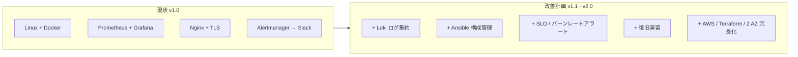

# 島田則幸 (Noriyuki Shimada)

製造・物流の現場で培った正確性と業務改善力を生かし、IT サポート、社内 SE 補助、インフラ運用へのキャリアチェンジを目指しています。

---

## インフラ運用ポートフォリオ概観

詳細：[アーキテクチャ図（現状 / 将来構想）](./docs/architecture-diagram.md)

---

## ハンズオン：Server Monitor Infrastructure Lab

リポジトリ：[server-monitor](https://github.com/ns7jp/server-monitor)

Linux サーバーの監視を題材に、Flask 製ダッシュボードを **安全に配備し、収集・可視化・通知・障害対応まで設計する** ポートフォリオです。

| 観点 | 実装・作成した内容 |
| --- | --- |
| 配備 | 非 root Docker イメージ、Docker Compose、Nginx、Gunicorn、systemd / TLS 設定例 |
| セキュリティ | Basic 認証、metrics 用 Bearer token、秘密ファイル管理、ホスト名・ユーザー名の既定マスク |
| 監視 | Prometheus、node-exporter、Grafana dashboard、Alertmanager、CPU / メモリ / ディスクのアラートルール |
| 運用 | 構成図、セキュリティ設計、構築手順、バックアップ復旧設計、停止ランブック、CPU 高負荷演習記録 |
| 品質 | pytest、GitHub Actions による API と配備設定の検証 |

設計資料:
[構成設計](https://github.com/ns7jp/server-monitor/blob/main/docs/architecture.md) /
[セキュリティ設計](https://github.com/ns7jp/server-monitor/blob/main/docs/security.md) /
[構築手順](https://github.com/ns7jp/server-monitor/blob/main/docs/deployment.md) /
[障害対応ランブック](https://github.com/ns7jp/server-monitor/blob/main/docs/runbooks/service-down.md)

---

## 改善計画（v1.1 → v2.0）

server-monitor を実運用水準へ引き上げるため、本リポジトリ内に **改善設計書を 5 本** 整備しました。
着手前に設計を固め、段階的に server-monitor 側へ実装します。

| # | テーマ | 解決する課題 | 設計書 |
| --- | --- | --- | --- |
| 01 | **Loki + Promtail ログ集約** | メトリクスのみで、障害時にログ調査が分断 | [01-loki-log-aggregation.md](./docs/server-monitor-improvements/01-loki-log-aggregation.md) |
| 02 | **Ansible 構成管理** | 手順書ベースで再現性・移植性が低い | [02-ansible-automation.md](./docs/server-monitor-improvements/02-ansible-automation.md) |
| 03 | **AWS + Terraform 化** | クラウド / IaC / 冗長化の経験不足 | [03-terraform-aws.md](./docs/server-monitor-improvements/03-terraform-aws.md) |
| 04 | **SLO / エラーバジェット設計** | 閾値アラート止まりで品質指標が無い | [04-slo-design.md](./docs/server-monitor-improvements/04-slo-design.md) |
| 05 | **バックアップ・復旧演習** | バックアップ設計はあるが復旧実証なし | [05-backup-recovery-drill.md](./docs/server-monitor-improvements/05-backup-recovery-drill.md) |

ロードマップと依存関係：[改善計画 一覧](./docs/server-monitor-improvements/README.md)

---

## IT サポート・社内 SE 補助ドキュメント

問い合わせ対応・キッティング・棚卸しなど、社内 IT サポート業務で必要になる手順とフローを自作しました。

| ドキュメント | 内容 |
| --- | --- |
| [想定 FAQ](./docs/it-support/faq.md) | 「PC が遅い」「メール届かない」「VPN 繋がらない」など 10 カテゴリ、一次切り分け手順付き |
| [トラブルシューティングフロー](./docs/it-support/troubleshooting.md) | ネットワーク・印刷・パスワード・不審メール等の Mermaid フローチャート |
| [アカウント管理・キッティング手順](./docs/it-support/account-management.md) | 入社・異動・退職・四半期棚卸しの SOP、PowerShell / SQL サンプル付き |

---

## 業務改善実績

物流現場でのピッキング工程を、計測 → 仮説 → 実施 → 検証 → 標準化の流れで改善し、**1 日あたり約 1.5 時間の作業時間短縮** を達成しました。

| Before | After | 改善 |
| --- | --- | --- |
| ピッキング全体 8.0 h / 日 | 6.5 h / 日 | **-1.5 h / 日** |
| 新人独り立ち 約 2 週間 | 約 1 週間 | **▲ 50%** |
| ピッキングミス 月平均 12 件 | 4 件 | **▲ 67%** |
| 補充忘れによる遅延 月 3 件 | 0 件 | **▲ 100%** |

詳細レポート：[業務改善レポート（在庫管理・ピッキング工程）](./docs/business-improvement/picking-improvement.md)

---

## ポートフォリオ作品一覧

| 作品 | 技術・取り組み | リンク |
| --- | --- | --- |
| サーバー監視・運用ラボ | Linux / Docker / Nginx / Prometheus / Grafana / Flask | [Code & Docs](https://github.com/ns7jp/server-monitor) |
| 作品集 | Python / HTML / CSS | [Code](https://github.com/ns7jp/works) |
| 掲示板アプリ | PHP / MySQL / CSRF 対策 / bcrypt / PDO | [Code](https://github.com/ns7jp/post) |
| SNS アプリ「Pulse」 | PHP / SQLite | [Code](https://github.com/ns7jp/pulse) |

ポートフォリオサイト: [https://ns7jp.github.io/](https://ns7jp.github.io/)

---

## スキル・学習実績

### 取得済み

- Python: Python 3 エンジニア認定基礎・実践 取得
- PHP: PHP 8 技術者認定初級 取得
- Web: HTML / CSS / JavaScript / SQL (SQLite, MySQL)
- Infrastructure: Linux サーバー監視、Docker Compose、Nginx、Prometheus / Grafana、運用手順書作成

### 取得計画

体系的にインフラ運用の専門性を裏付けるため、以下を計画的に取得していきます。

| 時期 | 資格 |
| --- | --- |
| 2026 Q2-Q3 | LPIC-1 (101 / 102)、ITIL 4 Foundation |
| 2026 Q4 - 2027 Q1 | CCNA、AWS Solutions Architect Associate |
| 2027 Q2-Q4 | LPIC-2、AWS SysOps Administrator Associate |

詳細：[資格取得ロードマップ](./docs/certifications/roadmap.md)

### 訓練校

公共職業訓練「情報処理 (Python エンジニア) コース」(ISP アカデミー川越校 / 2025 年 10 月 - 2026 年 1 月) 修了。

---

## これまでの経験

- 製造・物流業務 10 年以上
- 在庫管理・ピッキング業務で、作業時間を **1 日約 1.5 時間短縮** する改善を実施
- 中部大学 応用生物学部 応用生物化学科 卒業

---

## 目指す役割

問い合わせや障害の切り分け、手順書整備、サーバー監視、継続的な業務改善に、**現場経験と技術検証の両面** から貢献できるインフラ運用担当を目指しています。

「設計 → 実装 → 運用 → 改善」のサイクルを、机上の知識ではなく **手を動かしたアウトプット** で示すことを意識しています。
