# 島田則幸 (Noriyuki Shimada)

製造・物流の現場で培った正確性と業務改善力を生かし、IT サポート、社内 SE 補助、インフラ運用へのキャリアチェンジを目指しています。

---

## 3 分で見るインフラ運用ポートフォリオ

| 見る場所 | 何が分かるか | 状態 |
| --- | --- | --- |
| [採用ご担当者さまへ（1 枚）](./docs/overview-for-recruiters.md) | 非エンジニアの方向けに「何ができるか」を平易に要約 | 整備済み |
| [server-monitor](https://github.com/ns7jp/server-monitor) | Linux / Docker / 監視 / IaC / 運用文書の実装 | コード実装済み |
| [検証証跡台帳](https://github.com/ns7jp/server-monitor/blob/main/docs/evidence/README.md) | 実測済み・未測定を分けた証跡管理 | 証跡追加中 |
| [証跡採録チェックリスト](./docs/evidence-capture-checklist.md) | 設計を実物に変える採録順序（無料・ローカル優先） | 整備済み・実行中 |
| [デモ動画台本](./docs/demo-script.md) | 「壊して直す」2〜3 分デモの収録台本 | 台本整備済み・収録待ち |
| [学習の一次記録](./LEARNINGS.md) | つまずきと対処の生ログ（信頼性の裏付け） | 記録中 |
| [アーキテクチャ図](./docs/architecture-diagram.md) | 実装済み構成と本番相当へ足す構成 | 整備済み |
| [改善設計一覧](./docs/server-monitor-improvements/README.md) | 今後の設計テーマ 17 本と依存関係 | 設計済み |
| [ADR](./docs/adr/README.md) | 技術選定の理由と採否 | 8 本整備済み |
| [ビジュアルショーケース](./docs/showcase/README.md) | 画面・通知・演習記録の見せ方 | 実機キャプチャ追加中 |

実行を伴う AWS 検証、復旧演習、full Molecule は、結果を採録するまで
「実績」とは表現しません。コード・設計・実測証跡を分けて提示します。
採録の進捗は [実証トラッキング Issue (#8)](https://github.com/ns7jp/ns7jp/issues/8) で公開管理しています。
現在は新規の設計追加をいったん止め、[証跡採録チェックリスト](./docs/evidence-capture-checklist.md)
に沿って実機証跡と [デモ動画](./docs/demo-script.md) の整備を最優先しています。

---

## インフラ運用ポートフォリオ概観

```mermaid
flowchart LR
    subgraph Implemented[server-monitor に実装済み]
        C1[Linux + Docker]
        C2[Prometheus + Grafana + Loki + Alloy]
        C3[Nginx + TLS]
        C4[Alertmanager + SLO rules]
        C5[Ansible + Terraform code]
    end

    subgraph Evidence[実測証跡を追加する対象]
        N1[AWS apply / destroy と実費]
        N2[D-1 / D-2 復旧演習]
        N3[外部 probe と中央観測基盤]
    end

    subgraph Designed[設計済み・順次実装]
        D1[Tempo + OTel]
        D2[Incident / Change / Security Ops]
        D3[Capacity / FinOps / DB / ID / NW]
        D4[Meta monitoring / Game Day]
    end

    subgraph Long[学習トラック v3.0]
        L1[Kubernetes / EKS]
    end

    Implemented --> Evidence --> Designed --> Long
```

詳細：[アーキテクチャ図（実装済み構成 / 検証境界）](./docs/architecture-diagram.md) ／
[ADR（技術選定の根拠）](./docs/adr/README.md) ／
[ビジュアルショーケース](./docs/showcase/README.md)

---

## ハンズオン：Server Monitor Infrastructure Lab

リポジトリ：[server-monitor](https://github.com/ns7jp/server-monitor)

Linux サーバーの監視を題材に、Flask 製ダッシュボードを **安全に配備し、収集・可視化・通知・障害対応まで設計する** ポートフォリオです。

| 観点 | 実装・作成した内容 |
| --- | --- |
| 配備 | 非 root Docker イメージ、Docker Compose、Nginx、Gunicorn、systemd / TLS 設定例 |
| セキュリティ | Basic 認証、metrics 用 Bearer token、秘密ファイル管理、ホスト名・ユーザー名の既定マスク |
| 監視・ログ | Prometheus、node-exporter、Grafana、Alertmanager、Loki + Grafana Alloy、SLO / burn-rate rules |
| 構成管理 / IaC | Ansible roles、Terraform の AWS dev / prod 構成コード |
| 運用 | 構成・セキュリティ・コスト・バックアップ設計、ランブック、演習シナリオ、検証証跡台帳 |
| 品質 | pytest、構成検証 CI、Terraform / Ansible checks、Trivy / pip-audit、Dependabot |

設計資料:
[構成設計](https://github.com/ns7jp/server-monitor/blob/main/docs/architecture.md) /
[セキュリティ設計](https://github.com/ns7jp/server-monitor/blob/main/docs/security.md) /
[構築手順](https://github.com/ns7jp/server-monitor/blob/main/docs/deployment.md) /
[障害対応ランブック](https://github.com/ns7jp/server-monitor/blob/main/docs/runbooks/service-down.md) /
[検証証跡台帳](https://github.com/ns7jp/server-monitor/blob/main/docs/evidence/README.md) /
[外部 probe / 中央 telemetry 設計](https://github.com/ns7jp/server-monitor/blob/main/docs/external-probe-central-telemetry.md)

---

## 改善設計の反映状況

`server-monitor` 側へ反映済みのテーマと、設計サンプルとして整備済みのテーマを
分けて管理しています。実行を伴う AWS 検証や復旧演習は、結果が採録されるまで
実績とは表現しません。

| # | テーマ | 反映状態 | 設計書 |
| --- | --- | --- | --- |
| 01 | **Loki + Grafana Alloy ログ集約** | 実装済み。EOL の Promtail 設計を Alloy に移行 | [01-loki-log-aggregation.md](./docs/server-monitor-improvements/01-loki-log-aggregation.md) |
| 02 | **Ansible 構成管理** | roles / playbook / CI 構文検証を実装。完全 Molecule は証跡待ち | [02-ansible-automation.md](./docs/server-monitor-improvements/02-ansible-automation.md) |
| 03 | **AWS + Terraform 化** | 構成コードを実装。apply / 費用実測は未収録 | [03-terraform-aws.md](./docs/server-monitor-improvements/03-terraform-aws.md) |
| 04 | **SLO / エラーバジェット設計** | rules / dashboard / runbook を実装。ラボ内観測として位置付け | [04-slo-design.md](./docs/server-monitor-improvements/04-slo-design.md) |
| 05 | **バックアップ・復旧演習** | script / runbook / CI を実装。D-1 / D-2 実測ログは未収録 | [05-backup-recovery-drill.md](./docs/server-monitor-improvements/05-backup-recovery-drill.md) |

server-monitor を実運用水準へ引き上げるため、本リポジトリ内に
**改善設計書を 17 本 + ADR 8 本** 整備しました。01-05 は実装反映済み、
06-17 は設計サンプルまたは中長期ロードマップとして位置付けています。

### 設計済み・順次実装するテーマ（06–17）

06–17 は **設計サンプル / 中長期ロードマップ** です（実装・実測はこれから）。実装済みの 01–05 とは明確に区別しています。領域別にまとめると次のとおりです。

- **可観測性**: 06 分散トレーシング / 12 メタモニタリング
- **運用プロセス**: 07 インシデント対応 / 11 変更管理 / 10 キャパシティ / 17 カオス・Game Day
- **セキュリティ・基盤運用**: 09 セキュリティ運用 / 16 アイデンティティ運用 / 15 ネットワーク・DNS / 14 データベース運用
- **クラウド・コスト**: 13 FinOps
- **中長期学習**: 08 Kubernetes / EKS

各テーマの設計書・依存関係・実装順・検証境界は [改善設計の実装対応表](./docs/server-monitor-improvements/README.md) に集約しています。

### ADR（アーキテクチャ決定記録）

主要な技術選定の「**なぜそれを選んだか**」を別立てで記録しています。

[ADR 一覧 →](./docs/adr/README.md)（Prometheus / Docker Compose / Loki / Ansible / Terraform / 自前運用 / Slack / 段階的認証 の 8 本）

---

## IT サポート・社内 SE 補助ドキュメント

問い合わせ対応・キッティング・棚卸しなど、社内 IT サポート業務で必要になる手順とフローを自作しました。

| ドキュメント | 内容 |
| --- | --- |
| [想定 FAQ](./docs/it-support/faq.md) | 「PC が遅い」「メール届かない」「VPN 繋がらない」など 10 カテゴリ、一次切り分け手順付き |
| [トラブルシューティングフロー](./docs/it-support/troubleshooting.md) | ネットワーク・印刷・パスワード・不審メール等の Mermaid フローチャート |
| [アカウント管理・キッティング手順](./docs/it-support/account-management.md) | 入社・異動・退職・四半期棚卸しの SOP、PowerShell / SQL サンプル付き |
| [Service Desk メトリクス設計](./docs/it-support/service-desk-metrics.md) | FCR / MTTR / CSAT / ABC 分析・Sev 別 SLO・SLO 思想との連続性 |

---

## 業務改善実績

物流現場でのピッキング工程を、計測 → 仮説 → 実施 → 検証 → 標準化の流れで改善し、**1 日あたり約 1 時間の作業時間短縮** を達成しました。

- 1 週間の作業時間ログを 15 分単位で計測し、ボトルネックを特定
- 棚ラベル更新・動線改善（ABC 分析）・在庫補充の閾値運用・OJT 用マップ整備
- 標準化（マップ・チェックリスト）で改善のリバウンドを防止

詳細レポート：[業務改善レポート（在庫管理・ピッキング工程）](./docs/business-improvement/picking-improvement.md)

> 当時の継続計測ルールを設計していなかった反省を踏まえ、サーバー監視ラボでは [SLO 設計](https://github.com/ns7jp/server-monitor/blob/main/docs/slo.md) と証跡台帳として継続計測の仕組みを実装しています。

### 現場経験 ↔ インフラ運用の橋渡し

物流現場で培ったコア能力（計測 → 仮説 → 標準化、5S、ABC 分析、属人化排除）を、インフラ運用の各領域へどう転用するかを 1 ページにまとめました。

詳細：[現場経験とインフラ運用の橋渡し](./docs/career-bridge.md)

---

## ポートフォリオ作品一覧

| 作品 | 技術・取り組み | リンク |
| --- | --- | --- |
| サーバー監視・運用ラボ | Linux / Docker / Nginx / Prometheus / Grafana / Loki / Alloy / Ansible / Terraform | [Code & Docs](https://github.com/ns7jp/server-monitor) |
| 作品集 | Python / HTML / CSS | [Code](https://github.com/ns7jp/works) |
| 掲示板アプリ | PHP / MySQL / CSRF 対策 / bcrypt / PDO | [Code](https://github.com/ns7jp/post) |
| SNS アプリ「Pulse」 | PHP / SQLite | [Code](https://github.com/ns7jp/pulse) |

ポートフォリオサイト: [https://ns7jp.github.io/](https://ns7jp.github.io/)

---

## スキル・学習実績

### 取得済み

- Python: Python 3 エンジニア認定基礎・実践 取得
- PHP: PHP 8 技術者認定初級 取得
- Web: HTML / CSS / JavaScript / SQL (SQLite, MySQL)
- Infrastructure: Linux サーバー監視、Docker Compose、Nginx、Prometheus / Grafana / Loki / Alloy、Ansible / Terraform、運用手順書作成

### 取得計画

体系的にインフラ運用の専門性を裏付けるため、以下を計画的に取得していきます。

| 時期 | 資格 |
| --- | --- |
| 2026 Q2-Q3 | LPIC-1 (101 / 102)、ITIL 4 Foundation |
| 2026 Q4 - 2027 Q1 | CCNA、AWS Solutions Architect Associate |
| 2027 Q2-Q4 | LPIC-2、AWS SysOps Administrator Associate |

詳細：[資格取得ロードマップ](./docs/certifications/roadmap.md)

### 訓練校

公共職業訓練「情報処理 (Python エンジニア) コース」(ISP アカデミー川越校 / 2025 年 10 月 - 2026 年 1 月) 修了。

---

## これまでの経験

- 製造・物流業務 10 年以上
- 在庫管理・ピッキング業務で、作業時間を **1 日約 1 時間短縮** する改善を実施
- 中部大学 応用生物学部 応用生物化学科 卒業

---

## 目指す役割

問い合わせや障害の切り分け、手順書整備、サーバー監視、継続的な業務改善に、**現場経験と技術検証の両面** から貢献できるインフラ運用担当を目指しています。

「設計 → 実装 → 運用 → 改善」のサイクルを、机上の知識ではなく **手を動かしたアウトプット** で示すことを意識しています。

---

## ポートフォリオ進捗

各ドキュメントの「実績 / 設計サンプル / 計画」の区別と、server-monitor 側の実装進捗は [STATUS.md](./STATUS.md) で一覧管理しています。
採用ご担当者様は併せてご覧ください。

---

## ご連絡先 / Contact

採用・カジュアル面談などのご連絡を歓迎します。

- GitHub: [github.com/ns7jp](https://github.com/ns7jp)
- ポートフォリオサイト: [ns7jp.github.io](https://ns7jp.github.io/)
- メール: `（公開用メールアドレスを記入）`
