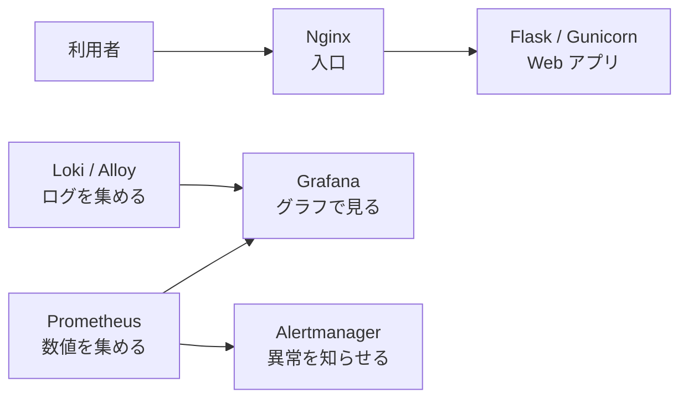

# 島田則幸 (Noriyuki Shimada)

## 未経験からサーバー設計・構築エンジニアへ

製造・物流の現場で 15 年以上培った「計測する・原因を絞る・手順化する・改善を続ける」を、サーバー構築と運用に生かします。

主作品は **[Server Monitor Infrastructure Lab](https://github.com/ns7jp/server-monitor)** です。Linux サーバーを題材に、設計して終わりではなく、次の一連の作業をコード・手順書・実行記録で示しています。

> **設計する → 構築する → 試験する → 監視する → 壊して直す → 記録する**

## 30 秒で見る

| 見てほしいもの | 分かること | 所要時間 |
| --- | --- | --- |
| [採用ご担当者さま向け 1 ページ](./docs/overview-for-recruiters.md) | 経験、強み、入社後に任せやすい業務 | 1 分 |
| [主作品 `server-monitor`](https://github.com/ns7jp/server-monitor) | Linux、Docker、Ansible、監視の実装 | 3 分 |
| [Linux サーバー構築案件パック](https://github.com/ns7jp/server-monitor/tree/main/docs/build-package) | 要件から引き渡しまでの構築工程 | 5 分 |
| [実測証跡ダイジェスト](https://ns7jp.github.io/evidence-demo.html) | 実際に動かした結果と未実施の範囲 | 2 分 |

初学者の方は、先に **[やさしい用語・見方ガイド](./docs/beginner-guide.md)** をご覧ください。
学習設計として不足している点と改善順は、[不足点セルフレビュー](./docs/learning-plan/README.md#11-学習設計の不足点セルフレビュー)に明記しています。

## 何を作ったか

監視対象の Web アプリと、異常を見つける監視基盤を構築しました。

```mermaid
flowchart LR
    U[利用者] --> N[Nginx<br>入口]
    N --> A[Flask / Gunicorn<br>Web アプリ]
    P[Prometheus<br>数値を集める] --> G[Grafana<br>グラフで見る]
    L[Loki / Alloy<br>ログを集める] --> G
    P --> M[Alertmanager<br>異常を知らせる]
```

覚え方は **「入口・本体・計測・表示・通知」** です。

| 役割 | 技術 | 簡単な説明 |
| --- | --- | --- |
| 入口 | Nginx | 外部からの通信を受け、アプリへ渡す |
| 本体 | Flask / Gunicorn | 画面や応答を返す |
| 計測 | Prometheus / Loki / Alloy | 数値とログを集める |
| 表示 | Grafana | 状態をグラフで確認する |
| 通知 | Alertmanager | 異常を検知して知らせる |
| 自動構築 | Ansible / Docker Compose | 同じ環境を繰り返し作れるようにする |

## サーバー構築で示したこと

| 工程 | 作成・実行したもの | 状態 |
| --- | --- | --- |
| 設計 | 要件定義、基本・詳細設計、パラメータシート、ネットワーク設計 | **作成済み** |
| 構築 | Ansible と Docker Compose による自動構築 | **実測済み** |
| 試験 | 通信、Firewall、監視、通知、バックアップ・復元を確認 | **23/23 PASS** |
| 監視 | Prometheus / Grafana / Loki でメトリクスとログを確認 | **実測済み** |
| 障害対応 | アプリ停止、通信断、DB 復元、LVM 拡張を演習 | **実測済み** |
| 変更管理 | Git SHA を指定した更新と旧版へのロールバック | **実測済み** |
| 引き渡し | チェックリストを作成 | 独立ホストでは **未実施** |

状態の意味：

- **作成済み**：コードや文書がある
- **実測済み**：日時・環境・結果を記録して実行した
- **未実施（NOT RUN）**：計画やコードはあるが、実行記録がない

実行結果の正本は [検証証跡台帳](https://github.com/ns7jp/server-monitor/blob/main/docs/evidence/README.md) です。

## 主な実測結果

| 検証 | 結果 | 実行環境 |
| --- | --- | --- |
| Full-stack E2E | [試験 23 件中 23 件 PASS](https://github.com/ns7jp/server-monitor/blob/4a292026b569dd1a522c0f2913b4ad40aeccebe7/docs/evidence/2026-08-22-full-stack-e2e.md#pr-75-hardening後の再検証) | GitHub Actions / Ubuntu 24.04 |
| Ansible の再実行 | [2 回目 `changed=0`](https://github.com/ns7jp/server-monitor/blob/main/docs/evidence/2026-08-17-molecule.md) | Linux コンテナ |
| アプリ停止からの自動復旧 | [PASS、RTO 13 秒](https://github.com/ns7jp/server-monitor/blob/main/docs/drills/logs/2026-08-19-D-1.md) | 手元 WSL2 / Ubuntu 24.04 |
| 3 層障害切り分け | [9 PASS / 0 FAIL](https://github.com/ns7jp/server-monitor/blob/main/docs/drills/logs/2026-08-24-B-2.md) | Docker コンテナ |
| DB バックアップ・復元 | [7 PASS / 0 FAIL、RTO 0.149 秒](https://github.com/ns7jp/server-monitor/blob/main/docs/drills/logs/2026-08-24-B-3.md) | Docker コンテナ |
| Git 版指定ロールバック | [旧版への復帰を確認](./docs/evidence/2026-08-23-server-monitor-git-rollback-ci.md) | GitHub Actions runner |

### まだ実測していないこと

独立した引き渡し対象ホスト、組織 DNS、Slack への実配信、AWS `apply`、ホスト再起動後の永続性、長期稼働、AlmaLinux 実機への適用は未実施です。実行していない項目を実績とは表現しません。

## 失敗から学んだこと

成功結果だけでなく、失敗を **「症状 → 原因 → 対処 → 学び」** の順に [LEARNINGS.md](./LEARNINGS.md) に記録しています。

| 症状 | 原因から得た学び |
| --- | --- |
| UFW の設定が毎回 `changed` になる | 同じポートへの `allow` と `limit` が競合していた |
| `docker kill` 後にコンテナが戻らない | 停止方法と再起動ポリシーの関係を理解できていなかった |
| AD ドメインが見つからない | クライアントの DNS が DC を向いていなかった |

切り分けの覚え方は **「事実を見る → 範囲を絞る → 1 つ変える → 再確認する」** です。

## 学習中の方へ

同じく未経験から始める方が再利用できるよう、[24 週の学習プラン](./docs/learning-plan/README.md)を公開しています。最初からすべて覚えるのではなく、毎回次の 5 点を残します。

1. 何を作るか
2. なぜ必要か
3. どのコマンドを使ったか
4. 何を見て成功と判断したか
5. 失敗したとき、どう戻すか

## 経験・資格

- 製造・物流業務 15 年以上
- Python 3 エンジニア認定基礎・実践
- PHP 8 技術者認定初級
- IT パスポート
- 基本情報技術者を学習中

詳しい職歴とスキルは [職務経歴書・スキルシート](./docs/resume.md)、現場改善の経験は [業務改善レポート](./docs/business-improvement/picking-improvement.md) にまとめています。

## AI の利用について

文書の構成・推敲、コードの雛形、レビューに AI 支援を利用しています。ただし、AI が生成した内容を未確認のまま実績にはしません。実機操作、結果の採録、秘密情報のマスク、技術選定の最終判断、面接での説明は本人が担当します。詳しい方針と進捗は [STATUS.md](./STATUS.md) を参照してください。

## Contact

- Email: [net7jp@gmail.com](mailto:net7jp@gmail.com)
- GitHub: [github.com/ns7jp](https://github.com/ns7jp)
