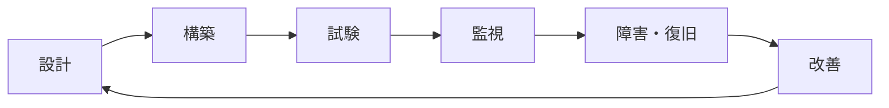

# 島田則幸 (Noriyuki Shimada)

## Linux サーバー構築・運用エンジニア志望

製造・物流の現場で 15 年以上培った「計測する・手順化する・改善を定着させる」力を生かし、Linux サーバーの構築から監視、障害対応、改善までを担うエンジニアを目指しています。

**現況（2026-08）**: 派遣社員としてトライアル就業中です。IT 業務に従事しながら、Linux サーバー構築へのキャリア移行を進めています。

第一志望は **Linux サーバー構築・運用** です。入口業務としてインフラ監視・運用、IT サポート、社内 SE 補助にも対応します。

## まず見る 3 点

1. **[Linux サーバー構築案件パック](https://github.com/ns7jp/server-monitor/tree/main/docs/build-package)** — 基本設計、詳細設計、パラメータ、ネットワーク、構築、試験、引き渡しを一つの案件として整理
2. **[検証証跡台帳](https://github.com/ns7jp/server-monitor/blob/main/docs/evidence/README.md)** — 実装済み・実測済み・未実測を明確に区別
3. **[3 分デモ収録手順（動画は未収録）](https://github.com/ns7jp/server-monitor/blob/main/docs/demo-capture-guide.md)** ／ **[二セグメント通信障害ラボ](https://github.com/ns7jp/server-monitor/tree/main/labs/network-troubleshooting)** — 正常確認、障害注入、切り分け、復旧を再現可能にした手順

補足：[採用ご担当者さま向け 1 ページ](./docs/overview-for-recruiters.md) ／ [職務経歴書・スキルシート](./docs/resume.md)

## 主作品：Server Monitor Infrastructure Lab

[server-monitor](https://github.com/ns7jp/server-monitor) は、Ubuntu サーバーへ監視ダッシュボードと可観測性基盤を配備し、構築後の監視・ログ・通知・バックアップ・障害復旧まで扱うラボです。

| 工程 | 作成・実装したもの |
| --- | --- |
| 設計 | 基本・詳細設計、構成図、OS / ミドルウェアパラメータ、IP アドレス表、セキュリティ設計 |
| 構築 | Ansible roles、Docker Compose、Nginx、Gunicorn、systemd、TLS 設定例 |
| 監視 | Prometheus、node-exporter、blackbox-exporter、Grafana、Alertmanager |
| ログ | Grafana Alloy、Loki、LogQL クエリ、30 日 retention |
| 試験 | pytest、構成検証 CI、試験仕様書、認証・非 root・公開範囲の確認項目 |
| 障害対応 | CPU 高負荷、プロセス停止、二セグメント通信断、ランブック、復旧判定 |
| 自動化・IaC | Ansible、Terraform AWS dev / prod 構成、GitHub Actions |
| 引き渡し | 構築手順、試験結果票、チェックリスト、変更・ロールバック手順 |

```mermaid
flowchart LR
    Design["設計"] --> Build["構築"] --> Test["試験"] --> Monitor["監視"] --> Incident["障害・復旧"] --> Improve["改善"]
    Improve --> Design
```

## 証拠の境界

資料やコードが存在するだけで、実環境で成功したとは表現しません。

| 状態 | 現在確認できるもの |
| --- | --- |
| CI で継続的に自動検証している | Python tests、Compose / Prometheus / Loki 設定、Ansible lint・syntax、Terraform fmt / validate、Trivy による依存・秘密値・設定 scan、バックアップスクリプトの日次検証 |
| コード・設定を実装済み | Docker / Nginx / Prometheus / Grafana / Loki / Alloy / Ansible / Terraform |
| **実機での実測はこれから** | **Linux ホストでの全 stack 起動、Grafana / Loki / 通知の実画面、D-1 / D-2 復旧演習、二セグメント障害ラボ** |
| AWS 実測が必要 | `plan / apply / destroy`、費用、AWS Backup 復元 |

**現時点で、Linux 上で本構成を起動した記録はありません。** [試験仕様書](https://github.com/ns7jp/server-monitor/blob/main/docs/build-package/06-test-specification.md)の結合試験・セキュリティ試験は全項目 `NOT RUN` です。ここを埋めることを最優先の課題として [証跡採録チェックリスト](./docs/evidence-capture-checklist.md) で管理しています。

自動検査で担保できる範囲（構文、設定の整合、秘密値の混入、依存の脆弱性）と、実機でしか確認できない範囲（起動、疎通、復旧時間）を区別すること自体を、運用設計の一部として扱っています。未収録の項目は「実装・手順作成済み」とし、実行日時、commit SHA、コマンド、結果、所要時間を記録して初めて「実測済み」へ変更します。

## サーバー構築で説明できること

- Ubuntu のユーザー、sudo、SSH、UFW、更新、timezone の初期設定
- Docker Compose を使った Nginx / Flask / 監視スタックの配備
- Ansible の role 分割、check mode、冪等性、Vault による秘密値管理
- listen address、認証、非 root、ログ保持、バックアップの設計判断
- `ip`, `ss`, `dig`, `curl`, `tcpdump` と Docker network を使う通信切り分け
- Prometheus metrics と Loki logs を組み合わせた障害調査
- 構築前確認、単体・結合試験、ロールバック、引き渡しの流れ

## 現場経験から生かせる強み

物流現場では、作業時間を 15 分単位で計測してボトルネックを特定し、棚配置・補充ルール・OJT 用マップを改善して、1 日あたり約 1 時間の作業時間短縮につなげました。

この経験をインフラ業務では次のように生かします。

| 現場で行ってきたこと | インフラ業務での活用 |
| --- | --- |
| 数値を取って原因を絞る | metrics / logs / command output に基づく切り分け |
| 作業を標準化する | 構築手順、試験項目、ランブックの整備 |
| 変更後も効果を確認する | SLO、監視、復旧演習による継続確認 |
| 属人化を減らす | Ansible、テンプレート、引き渡しチェックリスト |

詳細：[業務改善レポート](./docs/business-improvement/picking-improvement.md) ／ [現場経験とインフラの橋渡し](./docs/career-bridge.md)

## 志望順位

| 優先 | 志望領域 | 最初に貢献する業務 |
| --- | --- | --- |
| 1 | Linux サーバー構築・運用 | 手順に沿った構築、設定確認、試験、パラメータ・手順書更新 |
| 2 | インフラ監視・運用 | 監視確認、一次切り分け、エスカレーション、定型作業の自動化 |
| 3 | IT サポート・社内 SE 補助 | 問い合わせ切り分け、キッティング、FAQ・台帳整備 |

応募先別の成果物対応は [志望トラックと証跡](./docs/target-roles.md) にまとめています。

## スキル・資格

- Linux、Docker Compose、Nginx、systemd
- Prometheus、Grafana、Alertmanager、Loki、Grafana Alloy
- Ansible、Terraform、GitHub Actions
- Python、Flask、pytest
- HTML / CSS / JavaScript、PHP、SQL
- Python 3 エンジニア認定基礎・実践
- PHP 8 技術者認定初級
- LPIC-1 学習中

職業訓練「情報処理（Python エンジニア）コース」（2025 年 10 月〜2026 年 1 月）を修了しました。

## その他の成果物

- [IT サポート資料](./docs/it-support/faq.md) — FAQ、一次切り分け、アカウント管理、Service Desk metrics
- [post](https://github.com/ns7jp/post) — PHP / MySQL 掲示板（CSRF、bcrypt、PDO）
- [pulse](https://github.com/ns7jp/pulse) — PHP / SQLite SNS アプリ
- [works](https://github.com/ns7jp/works) — Python / HTML / CSS の学習作品
- [ポートフォリオサイト](https://ns7jp.github.io/) — 主作品と経歴のブラウザ向け案内

## AI の利用について

設計書・文書構成のドラフト、コードレビュー、リンクや表記の確認に AI 支援を利用しています。技術選定の最終判断、実機操作、結果の採録、機密情報のマスク、面接での説明は本人が担当します。AI が生成した手順も、本人が実行・理解していない状態では実績として扱いません。

## Contact

- Email: [net7jp@gmail.com](mailto:net7jp@gmail.com)
- GitHub: [github.com/ns7jp](https://github.com/ns7jp)
