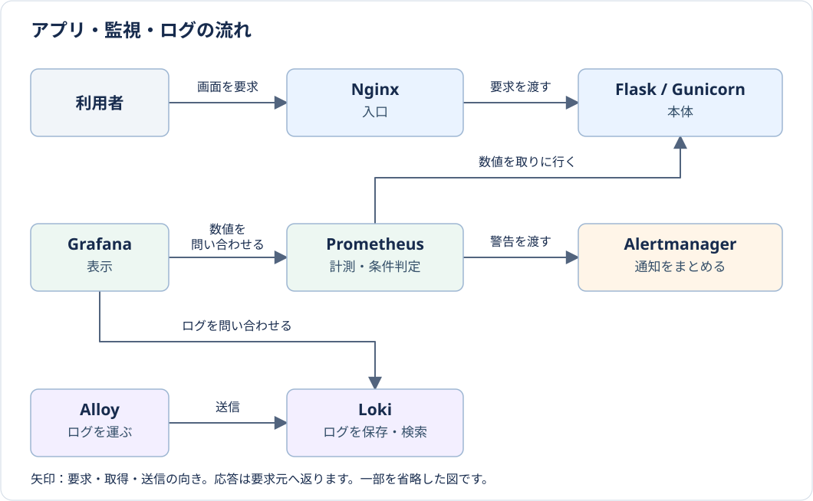

# 島田則幸 (Noriyuki Shimada)

## 未経験からサーバー設計・構築エンジニアへ

**Linux サーバーを作り、動作を確かめ、異常時に戻せるようにする**ことを学んでいます。このページは、個人の学習・検証で作ったものと実行記録を紹介するポートフォリオです。サーバー構築の実務経験としては扱っていません。

製造・物流の現場で 15 年以上培った「計測する・原因を絞る・手順化する・改善を続ける」を、サーバー構築と運用に生かします。

主作品は **[サーバー構築・監視ラボ `server`](https://github.com/ns7jp/server)** です。サーバーとは、利用者や別のプログラムからの要求に応答するコンピューターやソフトウェアのこと。このラボでは、小さな Web アプリを動かす環境と、その状態を調べる仕組みを作っています。

> **設計する → 構築する → 試験する → 監視する → 復旧する → 記録する**

**初めて学ぶ方は、[やさしいガイドの「最初の10分」](./docs/beginner-guide.md#最初の10分で行うこと)から始めます。** まず「利用者 → 入口 → アプリ」の流れを説明し、準備ができたら2サービスだけを動かします。環境の準備時間は別に取り、1回の確認結果を自分の言葉で話すところまでを最初の目標にします。

## 30 秒で選ぶ

採用の観点では、次の3つから確認できます。志望と検証範囲をまとめて読む場合は、[採用ご担当者さま向けページ](./docs/overview-for-recruiters.md)をご覧ください。

| 目的 | 最初に開くページ | 分かること |
| --- | --- | --- |
| 主作品を見る | [サーバー構築・監視ラボ `server`](https://github.com/ns7jp/server) | 構成・コード・構築と復旧の手順 |
| 本人の最新実測を見る | [主な実測結果](#主な実測結果) | 9月8〜10日のVM操作・画像・確認範囲 |
| 経歴と応募条件を見る | [職務経歴書・スキルシート](./docs/resume.md) | 現場経験・志望・就業状況 |

本人の最新実測では、Hyper-V上のUbuntuで数値監視、ログ検索・復元、アプリの自動再起動を別々の演習として確認しました。AIの手順案内による支援を受けて本人が操作した記録です。全構成の受け入れや独力での再構築・説明は別途確認が必要です。

## 何を作ったか

「サーバーが止まっているのに誰も気づかない」状態を減らすため、**応答を返すアプリ**と、**異常を見つけて知らせる監視基盤**を組み合わせました。まず「入口・本体・計測・表示・通知」で覚えます。

矢印のラベルは、要求・取得・送信の動作です。応答は要求元へ返ります。一部を省略した図で、詳細は[構成図](./docs/architecture-diagram.md)にあります。ログは「いつ何が起きたか」の記録、数値は CPU 使用率などの測定値です。

| 役割 | 技術 | 何のために使うか |
| --- | --- | --- |
| 土台 | Linux（Ubuntu など） | アプリや監視を動かす |
| 入口と本体 | Nginx / Flask / Gunicorn | 通信を受け、アプリの応答を返す |
| 計測・判定 | Prometheus | 数値を集め、警告条件を判定する |
| ログ | Alloy / Loki | ログを運び、保存・検索する |
| 表示 | Grafana | 保存された数値やログを問い合わせて見せる |
| 通知 | Alertmanager | 受け取った警告を整理し、通知先へ送る |
| 構築・起動 | Ansible / Docker Compose | OS の設定をそろえる / 複数のコンテナを起動する |

## サーバー構築で示したこと

| 工程 | 成果物・確認対象 | 確認先 |
| --- | --- | --- |
| 要件・設計 | 作る目的、構成、設定値を決める | [構築案件パック](https://github.com/ns7jp/server/tree/main/docs/build-package) |
| 構築・試験 | 自動構築し、通信・認証・監視などを確かめる | 下の[実行記録](#主な実測結果) |
| 復旧・変更 | 停止からの復旧、バックアップ復元、旧版への戻し方を確かめる | [検証証跡台帳](https://github.com/ns7jp/server/blob/main/docs/evidence/README.md) |
| 引き渡し | 他の人が扱える手順とチェックリストを残す | [構築案件パック](https://github.com/ns7jp/server/tree/main/docs/build-package)（対象ホストへの正式な引き渡しは未実施） |

**文書化済み**は説明や手順があること、**実装済み**はコードや設定があること、**検証済み／実測済み**は対象・日時・結果の記録があることです。実行記録がない項目は **未実施（NOT RUN）** とします。資料を読んだこと、本人が自力で再現できることも区別します。

## 主な実測結果

以下は **各記録に書かれた時点・環境・コード版での結果**です。現在のコード全体や本番環境の合格を示すものではありません。PASS は、その試験で決めた合格条件を満たした意味です。

### 最近の本人による操作（2026-09-08〜10）

AIが手順を案内し、本人がVMを操作して提供した画像に対応する記録です。以下の件数・結果を合算して、全構成の合格とは扱いません。

| 記録 | 本人が操作して確認したこと | この記録の限界 |
| --- | --- | --- |
| [9/8：数値監視](https://github.com/ns7jp/server/blob/main/docs/evidence/2026-09-08-lab-base01-monitoring-practice.md) | 5サービスでPrometheus収集・Grafana表示。手動停止と再開で収集状態1→0→1 | 部分構成。外部通知・長期稼働は未実施 |
| [9/8：ログ監視](https://github.com/ns7jp/server/blob/main/docs/evidence/2026-09-08-lab-base01-loki-practice.md) | 6サービスでNginxの目印付きログ2件をGrafanaから検索 | 全10サービスの同時検証ではない |
| [9/8：バックアップ復元](https://github.com/ns7jp/server/blob/main/docs/evidence/2026-09-08-lab-base01-restore-practice.md) | Lokiのアーカイブを別名ボリュームへ復元し、過去ログ2件を取得 | 同じVM内の復元。別ホスト・全データの完全性は未確認 |
| [9/8：アプリ自動復旧](https://github.com/ns7jp/server/blob/main/docs/evidence/2026-09-08-lab-base01-d1-practice.md) | 再起動回数0→1、HTTP復帰の計測2秒、後続のhealthyを確認 | app/nginxの1回の試験。2秒は全機能の復旧時間や本番保証ではない |
| [9/9：Ansible入力検証](https://github.com/ns7jp/server/blob/main/docs/evidence/2026-09-09-lab-base01-validation-practice.md) | 不正ポート70000を変更前に拒否し、出力ファイルのSHA-256と本文維持を確認 | ホーム内のファイル生成演習。実ポート待受の試験ではない |
| [9/10：Gitマージ](https://github.com/ns7jp/server/blob/main/docs/evidence/2026-09-10-lab-base01-git-merge-practice.md) | マージ・競合解消・中止後の一致を確認し、mainを元の状態へ復帰 | VM内のローカル演習。VMからのpush・Ansible反映は未実施 |

### 基礎設定と自動試験の記録

| 記録 | 確認したこと | 環境と限界 |
| --- | --- | --- |
| [2026-08-22：一連の構築・試験 23/23 PASS](https://github.com/ns7jp/server/blob/4a292026b569dd1a522c0f2913b4ad40aeccebe7/docs/evidence/2026-08-22-full-stack-e2e.md#pr-75-hardening後の再検証) | 構築、再実行、監視、ローカル通知、復旧、復元 | GitHub Actions の使い捨て Ubuntu。Docker は事前導入済み |
| [2026-09-04：Ubuntu の基礎設定](https://github.com/ns7jp/server/blob/main/docs/evidence/2026-09-04-ansible-foundation-build.md) | `foundation.yml` で設定・Docker 導入、再実行で `changed=0` | 本人の Hyper-V VM。監視全体を構築する `site.yml` とは別の手順 |
| [2026-09-04：AlmaLinux への適用](https://github.com/ns7jp/server/blob/main/docs/evidence/2026-09-04-ansible-foundation-el9-build.md) | 基礎設定の適用、再実行、SELinux 設定の欠陥修正 | 再利用した Hyper-V VM。新規構築・最小公開の証明は未完了 |

`changed=0` は、同じ設定をもう一度適用したときの変更が 0 件だったことです。これだけで全機能が正常と証明できるわけではなく、試験結果と合わせて確認します。その他の結果は[実測証跡ダイジェスト](https://ns7jp.github.io/evidence-demo.html)と[検証証跡台帳](https://github.com/ns7jp/server/blob/main/docs/evidence/README.md)から追えます。

### まだ実測していないこと

主な未実施範囲は、監視ラボ全体を独立した引き渡し対象ホストへ構築すること、組織 DNS を含む本番相当のネットワーク確認、Slack への実配信、AWS への実適用、ホスト再起動後の永続性・長期稼働です。AlmaLinux は上記の基礎設定までで、監視ラボ全体の `site.yml` 適用は未実施です。

次は小さな構成の再起動後確認、24時間の観測、別VMへの復元、本人以外による手順確認を順に進めます。本人の判断を確認するための[実測一件を使った説明と問い返し](./docs/portfolio-explanation.md#7-最近の本人実測を使って判断を説明する)も用意しています。手順の用意と実施完了は区別します。

## 失敗から学んだこと

失敗の記録は [LEARNINGS.md](./LEARNINGS.md) にあります。たとえば、UFW（通信を許可・制限する設定ツール）の設定が毎回「変更あり」になった記録から、**初回の成功だけで終えず、もう一度実行して同じ状態になるか確かめる必要性**を学べます。

原因調査は **「事実を見る → 範囲を絞る → 1 つ変える → 再確認する」**。公開済みの記録と、自分が経験した失敗は分けて扱います。

## 学習中の方へ

最初の目標は、主作品を全部暗記することではなく、**小さな構成を 1 回動かし、何を確認したかを説明すること**です。

1. [やさしいガイド](./docs/beginner-guide.md)で、構成図を見ながら各部品の役割を言う。
2. [主作品の学習ガイド](https://github.com/ns7jp/server/blob/main/docs/beginner-learning-guide.md)で起動・確認・終了を行い、出力を残す。
3. [説明練習](./docs/portfolio-explanation.md)の記録欄に、自分の実施範囲・結果・未実施を記入する。
4. 手順を閉じて「目的 → 構成 → 自分の操作 → 確認結果 → 次の課題」を説明する。詰まった箇所だけ読み直す。

さらに学ぶ際は [24 週の学習プラン](./docs/learning-plan/README.md)へ進みます。[育成システム](./docs/server-engineer/README.md)で今日の課題と提出物を決め、24週後は条件変更・初見障害・第三者への引き渡しを含む総合演習へ進めます。学習期間は目安です。本人による演習と説明の確認をもって習得を判断します。

### 教材と改善システムの案内

下表は学習や改善のための資料です。教材の作成・自動テストの成功を、本人の習得や案件の実施完了には読み替えません。

| 目的 | 資料 |
| --- | --- |
| PC・Linuxの準備 | [開始前診断と最初の30分](./docs/learning-plan/00-start-here.md) |
| 用語を確かめる | [IT基礎用語集](./docs/it-glossary.md) |
| 小規模案件の先へ進む | [初心者から熟練への橋渡し設計](./docs/server-engineer/advanced/README.md) |
| 案件を受付から終結まで進める | [サーバー案件の運用システム](./docs/server-projects/README.md) |
| 就職・定着と学習配分 | [就職・定着・継続成長](./docs/engineer-career/README.md)・[自律型成長](./docs/autonomous-growth/README.md) |
| 週次の改善と実測の取り込み | [ポートフォリオ改善ループ](./docs/portfolio-loop/README.md) |
| 成果・負荷・期限を振り返る | [自律繁栄](./docs/autonomous-prosperity/README.md)・[詳細運用](./docs/prosperity-review/README.md) |
| 仮説を比較して改善する | [改善実験](./docs/server-innovation/README.md)・[試行錯誤ループ](./docs/server-innovation/fast-loop.md)・[探索と改善の橋渡し](./docs/server-innovation/bridge.md) |

## 経験・資格

- 製造・物流業務 15 年以上
- Python 3 エンジニア認定基礎・実践
- PHP 8 技術者認定初級
- IT パスポート
- 基本情報技術者を学習中

詳しい職歴とスキルは [職務経歴書・スキルシート](./docs/resume.md)、現場改善の経験は [業務改善レポート](./docs/business-improvement/picking-improvement.md)にまとめています。

## AI の利用について

文書の構成・推敲に加え、実装コードの生成・レビューにも AI 支援を利用しています。生成物や自動試験の成功を、本人の習得や実務経験へ読み替えません。本人の作業・判断・説明は個別の記録で確認します。範囲と方針は [STATUS.md](./STATUS.md)と[職務経歴書・スキルシート](./docs/resume.md)に記載しています。

改善ツールの実装範囲は[詳細設計](./docs/portfolio-automation/design.md)と[週次運用手順](./docs/portfolio-automation/weekly-operation.md)にまとめています。自動処理の結果と、本人の技能・実機の受け入れ・公開判断は別に記録します。

## Contact

- Email: [net7jp@gmail.com](mailto:net7jp@gmail.com)
- GitHub: [github.com/ns7jp](https://github.com/ns7jp)
