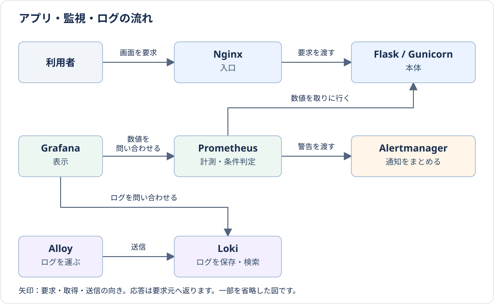

# 島田則幸 (Noriyuki Shimada)

## 未経験からサーバー設計・構築エンジニアへ

製造・物流の現場で 15 年以上、「計測する・原因を絞る・手順化する・改善を続ける」を続けてきました。今はそれをサーバーの構築と運用に生かすため、**Linux と Windows Server の両方で、作る → 確かめる → 壊して直す → 記録する**を練習しています。

> 個人の学習記録です（実務経験ではありません）。AI 支援の範囲と未実施の範囲は[この資料の読み方](#この資料の読み方)にまとめています。

## まず見ていただきたい 3 本

2026 年 9 月に、手元の Hyper-V（Windows の仮想化機能）上の仮想マシン（VM）で行った記録から、特に説明したいものを 3 本に絞りました。

| # | 題材 | 何を示すか | 記録 |
| --- | --- | --- | --- |
| 1 | **AD の冗長化と復旧** | Windows Server 2022 で AD を構築し必須 31 項目 PASS。DC を 2 台にして複製を確認し、System State 復元と、1 台を失った想定での FSMO 役割の奪取まで実施 | [構築](https://github.com/ns7jp/server/blob/main/docs/evidence/2026-09-01-ad-build-validation.md)・[復元](https://github.com/ns7jp/server/blob/main/docs/evidence/2026-09-02-ad-restore-drill.md)・[FSMO 奪取](https://github.com/ns7jp/server/blob/main/docs/evidence/2026-09-04-ad-fsmo-seize.md) |
| 2 | **Ubuntu の構築と監視** | 固定 IP・SSH 鍵認証・UFW・時刻同期・自動更新を手作業で設定し、わざと起こした設定不備から復旧。Prometheus / Grafana / Loki で停止と復帰を確認 | [初期構築](https://github.com/ns7jp/server/blob/main/docs/evidence/2026-09-08-lab-base01-initial-build.md)・[監視](https://github.com/ns7jp/server/blob/main/docs/evidence/2026-09-08-lab-base01-monitoring-practice.md) |
| 3 | **原因の切り分け** | WSUS の試験が FAIL。承認件数の突き合わせで前日の仮説を否定し、「分類・製品 0 件＝絞り込みなし」という真因を特定して手順書を修正 | [原因特定](https://github.com/ns7jp/server/blob/main/docs/evidence/2026-09-08-wsus-sit04-sit06-root-cause.md) |

主作品は **[サーバー構築・監視ラボ `server`](https://github.com/ns7jp/server)** です。上の 3 本以外の練習記録は、[検証証跡台帳](https://github.com/ns7jp/server/blob/main/docs/evidence/README.md)に日付順で並べています。

| 目的 | 開くページ |
| --- | --- |
| 志望と検証範囲を 1 ページで読む | [採用ご担当者さま向けページ](./docs/overview-for-recruiters.md) |
| 経歴と応募条件を見る | [職務経歴書・スキルシート](./docs/resume.md) |
| 詰まった記録を見る | [LEARNINGS.md](./LEARNINGS.md) |

## 主な実測結果

### Windows Server / Active Directory（2026-09-01〜08）

| 記録 | 確認したこと |
| --- | --- |
| [9/1〜2：AD の構築・試験](https://github.com/ns7jp/server/blob/main/docs/evidence/2026-09-01-ad-build-validation.md) | AD DS（ドメインの認証基盤）を構築し、試験仕様書のフェーズ 1 必須 31 項目がすべて PASS。手順書・設計書の誤りを実機で見つけて修正 |
| [9/2：System State 復元](https://github.com/ns7jp/server/blob/main/docs/evidence/2026-09-02-ad-restore-drill.md) | バックアップ後に作った目印の OU が、復元で消えることを確認。復元処理 15 分 29 秒、復旧全体は約 40 分（うち約 18 分は起動設定の解除漏れによるやり直し） |
| [9/3：2 台目の DC と複製](https://github.com/ns7jp/server/blob/main/docs/evidence/2026-09-03-ad-second-dc-replication.md) | 複製の失敗 0/5、複製の遅延 17.8 秒。GPO が配られない原因を、前日の復元で消えていたファイルと突き止めて修復 |
| [9/3〜4：DC の停止と役割の奪取](https://github.com/ns7jp/server/blob/main/docs/evidence/2026-09-04-ad-fsmo-seize.md) | [1 台を止めても](https://github.com/ns7jp/server/blob/main/docs/evidence/2026-09-03-ad-dc-outage-drill.md) DNS・LDAP・Kerberos が続くことと、復帰後の収束 18 分 31 秒を確認。FSMO 役割を奪取し、`ntdsutil` で古い DC の情報を削除 |
| [9/7〜8：WSUS の構築](https://github.com/ns7jp/server/blob/main/docs/evidence/2026-09-07-wsus-build-validation.md) | 必須 28 項目中 26 PASS・判定は FAIL。翌日、[残った 2 件の原因](https://github.com/ns7jp/server/blob/main/docs/evidence/2026-09-08-wsus-sit04-sit06-root-cause.md)を特定して手順書を修正（通しの再試験は未実施） |

作業結果と障害 15 件の対処は[作業結果・引き渡し報告](https://github.com/ns7jp/server/blob/main/docs/evidence/2026-09-02-work-result-SM-AD-001.md)、設計書・手順書・試験仕様書は [AD 構築案件パック](https://github.com/ns7jp/server/tree/main/docs/build-package-ad)にあります。

### Linux（2026-09-04〜08）

| 記録 | 確認したこと |
| --- | --- |
| [9/7〜8：Ubuntu の初期構築](https://github.com/ns7jp/server/blob/main/docs/evidence/2026-09-08-lab-base01-initial-build.md) | 固定 IP、SSH 鍵認証、sudo、UFW、時刻同期、自動更新を手作業で設定。設定不備を起こし、拒否の表示とサーバーのログを照合して復旧 |
| [9/4：Ansible での基礎設定](https://github.com/ns7jp/server/blob/main/docs/evidence/2026-09-04-ansible-foundation-build.md) | Ubuntu と [AlmaLinux](https://github.com/ns7jp/server/blob/main/docs/evidence/2026-09-04-ansible-foundation-el9-build.md) に OS の共通設定と Docker を適用し、2 回目の変更 0 件。AlmaLinux では SELinux 設定の欠陥を修正 |
| [9/8：数値の監視](https://github.com/ns7jp/server/blob/main/docs/evidence/2026-09-08-lab-base01-monitoring-practice.md)・[ログ検索](https://github.com/ns7jp/server/blob/main/docs/evidence/2026-09-08-lab-base01-loki-practice.md) | サービスの停止・再開に合わせて収集状態が 1→0→1 と変わることを表示。Nginx の目印付きログを Loki で検索 |
| [9/8：復元](https://github.com/ns7jp/server/blob/main/docs/evidence/2026-09-08-lab-base01-restore-practice.md)・[自動復旧](https://github.com/ns7jp/server/blob/main/docs/evidence/2026-09-08-lab-base01-d1-practice.md) | Loki のデータを別ボリュームへ復元して過去のログを再取得。アプリ停止後の自動再起動で HTTP 復帰 2 秒（1 回の計測） |

### CI（自動試験）の記録

| 記録 | 確認したこと |
| --- | --- |
| [8/22：一連の構築・試験](https://github.com/ns7jp/server/blob/4a292026b569dd1a522c0f2913b4ad40aeccebe7/docs/evidence/2026-08-22-full-stack-e2e.md#pr-75-hardening後の再検証) | GitHub Actions の使い捨て Ubuntu で、構築・再実行・監視・通知・復旧・復元の 23 項目が PASS |
| [9/17：性能試験の見直し](https://github.com/ns7jp/server/blob/main/docs/evidence/2026-09-17-performance-ci-analysis.md) | 以前の集計が HTTP 502 を失敗に数えていなかったことを見つけて修正。[接続再利用を加えた比較](https://github.com/ns7jp/server/blob/main/docs/evidence/2026-09-17-upstream-keepalive-comparison.md)では 2 回の CI で失敗 0 件 |

## 何を作ったか

「サーバーが止まっているのに誰も気づかない」状態を減らすため、**応答を返すアプリ**と、**異常を見つけて知らせる監視基盤**を組み合わせました。

| 役割 | 技術 | 何のために使うか |
| --- | --- | --- |
| 土台 | Linux（Ubuntu など） | アプリや監視を動かす |
| 入口と本体 | Nginx / Flask / Gunicorn | 通信を受け、アプリの応答を返す |
| 計測・判定 | Prometheus | 数値を集め、警告条件を判定する |
| ログ | Alloy / Loki | ログを運び、保存・検索する |
| 表示 | Grafana | 数値やログを問い合わせて見せる |
| 通知 | Alertmanager | 警告を整理し、通知先へ送る |
| 構築・起動 | Ansible / Docker Compose | OS の設定をそろえる / 複数のコンテナを起動する |

詳細は[構成図](./docs/architecture-diagram.md)にあります。副作品（[design](https://github.com/ns7jp/design)・[shell](https://github.com/ns7jp/shell)・[network](https://github.com/ns7jp/network)・[aws](https://github.com/ns7jp/aws)）の確認範囲は[作品案内](./docs/github-profile-cleanup.md#主作品と副作品)に書いています。

## 失敗から学んだこと

失敗の記録は [LEARNINGS.md](./LEARNINGS.md) にあります。原因調査は **「事実を見る → 範囲を絞る → 1 つ変える → 再確認する」** の順で進めます。9 月の AD の記録にも、最初の仮説が外れた例を残しています。「強制停止でレジストリが巻き戻った」と考えた設定の変化は、実際には GPO による上書きでした。

## 経験・資格

- 製造・物流業務 15 年以上
- IT 企業でのトライアル就業（2026/07〜09/15 に終了、人材派遣。Windows / Linux サーバーと AWS / Azure の構築研修）。現在は求職中で、すぐに勤務を開始できます
- Python 3 エンジニア認定基礎・実践、PHP 8 技術者認定初級、IT パスポート
- LPIC-1 101 を次に受験予定、基本情報技術者を学習中（[資格取得ロードマップ](./docs/certifications/roadmap.md)）

詳しい職歴とスキルは [職務経歴書・スキルシート](./docs/resume.md)、現場改善の経験は [業務改善レポート](./docs/business-improvement/picking-improvement.md)にまとめています。

## この資料の読み方

このポートフォリオ全体にかかる前提を、この節だけにまとめています。

### 言葉の定義

| 表記 | 意味 |
| --- | --- |
| **実装済み** | コードや設定、文書がある |
| **実測済み** | 対象・日時・環境・結果の記録がある |
| **未実施（NOT RUN）** | 実行結果がない |

判定の正本は [検証証跡台帳](https://github.com/ns7jp/server/blob/main/docs/evidence/README.md) です。

### 3 つの前提（AI の利用を含む）

1. **実務経験ではありません。** 個人の学習・検証で作ったものと、その実行記録です。
2. **結果は、その記録に書いた時点・環境・コード版のものです。** 個別の記録を合算して「全構成の合格」とは扱いません。
3. **AI 支援を使っています。** 文書と実装コード（Ansible role、Terraform module、CI workflow、テスト、ラボ）の生成・レビューに使いました。9 月の VM の記録は、AI が手順を案内し、私が操作して結果を画面で確かめたものです。範囲は [職務経歴書 §4-b](./docs/resume.md#4-b-ポートフォリオにおける-ai-支援の範囲) に書いています。

### まだ実測していないこと

- **AI を使わずに再現した記録**（最初の一件を[採録計画](./docs/evidence-capture-checklist.md#現在の残タスクlinux-サーバー構築を最優先)の順位 0 に置いています）
- 常時起動のホストでの 24 時間以上の稼働、再起動後の確認、Slack への実際の通知
- AWS への実際の構築（`apply / destroy`）、別の VM への復元
- 組織の DNS やクライアント PC を含むドメイン環境、第三者による手順の確認

初心者向けの教材は [ns7jp/learning](https://github.com/ns7jp/learning) に分けています（採用の判断には不要です）。

## Contact

- Email: [net7jp@gmail.com](mailto:net7jp@gmail.com)
- GitHub: [github.com/ns7jp](https://github.com/ns7jp)
