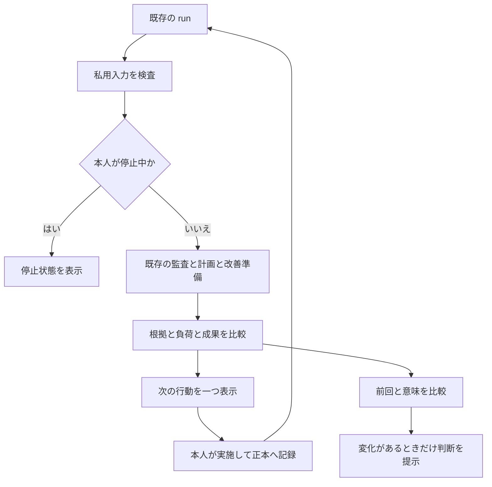

# 詳細設計：成果と余力を次の行動へ戻す

## 1. 目的と成功条件

最優先の目的は、既存のサーバー構築職への就職・定着方針を、毎週実行できる行動へつなぐことです。
作業量を増やす前に「何が役立ったか」「同じ条件で確かめたか」「続けられるか」を確認します。

| 観点 | 観察する事実 | 自動認定しないこと |
| --- | --- | --- |
| 技能 | 本人の再現、説明、別日の確認、既存SE評価 | 資料を作っただけで習得済み |
| 価値 | 復旧の改善、手順の再利用、相手の質問の解消 | コミット数だけで価値が増えた |
| 信頼 | 対象版・環境・日時・未実施が追える証拠 | CI合格だけで本番運用可能 |
| 機会 | 実在の要求と本人の証拠の対応、実際の応答 | 応募文面だけで採用に近づいた |
| 持続性 | 本人の負荷申告、既約束、余白、振り返り | 空き時間を全て追加作業へ配分 |

採用数・収入・満足度の目標値は本人と相手の事情で決める項目です。コードに架空の初期値や成功保証を入れません。

## 2. 一巡の構成

機械側の成果は「検査済みの提案」、人側の成果は「実際の実行と観察」です。
この両方が揃って次の改善を選べます。外部サービスに依存する結果は未確認のまま保持します。

## 3. 正本を増やさない

| 情報 | 正本 | 繁栄層での扱い |
| --- | --- | --- |
| 技能と実技評価 | 既存SE台帳 | キャリアの読取コンテキストを通して参照 |
| 仕事の承認と担当 | 既存PJ台帳・所属先の台帳 | 既存コンテキストに従う |
| 行動と週の時間 | `.local/engineer-career/profile.json` | 既存 `plan()` で再計算。直接変更しない |
| 監査と改善実験 | 既存ループと探索の記録 | `statusView()` と `runLoop()` で接続 |
| 本人の結果の原文 | `.local/engineer-career/records/` | 相対パスとSHA256で参照。文面の真偽は判定しない |
| 負荷の確認と比較の索引 | `.local/autonomous-prosperity/review.json` | 本人が確認した負荷と、比較に必要な数値だけ |
| 自動判断 | 同ディレクトリの `latest.json` | 上書き可能な派生物。原本や履歴の代用にしない |

比較の索引は正本の数値を再利用するための入力です。参照のハッシュが違えば止まり、書き換わった根拠を黙って使いません。
ハッシュの一致は保存内容の一致であり、実行者・実測の真正性・因果関係の証明ではありません。

## 4. 状態と優先順

入力の形式違反や根拠の不一致は終了コード2で停止します。形式が正しい入力は次の順で扱います。

| 優先 | 状態 | 条件 | 次の行動 |
| --- | --- | --- | --- |
| 1 | CONNECT_PROFILE | 既存の本人台帳なし | 接続先を確認して初期設定 |
| 2 | PAUSED | キャリアまたは本人の負荷が停止 | 既存ループの実行も省略。本人が再開条件を確認 |
| 3 | REVIEW_LOAD | 負荷不明、または通常計画に縮小申告 | 既存キャリア設定の縮小を検討 |
| 4 | REFRESH_REVIEW | 確認なし・合成・7日超 | 本人が週次の負荷と成果を確認 |
| 5 | FIX_LOOP | 既存ロック・状態の問題 | 正本側の問題を調査 |
| 6 | REFRESH_AUDIT | 監査が鮮度外、直近ループが24時間超・未来・不全・合成 | 最新の既存ループを実行 |
| 7 | REVIEW_PLAN | 既存計画の警告、時間未設定、600分超 | 正本の時間・接続を確認 |
| 8 | REVIEW_EXISTING | 既存ループに採否・接続・測定などの待ちがある | 既存の先頭の行動を提示 |
| 9 | REVIEW_HARM | 直近28日の品質条件違反 | 悪化を調査。再利用を保留 |
| 10 | READY | 上記なし | 既存の選択済み行動の先頭を提示 |

`READY` は処理上の状態です。技能・実機・公開の許可を意味しません。
ほかの状態でも成果比較の一覧は出力に残り、品質条件違反が消えるわけではありません。
原本の再読み取りに失敗した場合は `FIX_LOOP` などの提案を返す前にエラー停止することがあります。

## 5. 成果を比べる規則

比較できるのは、同じ既存行動ID、指標、単位、環境、比較条件キー、改善方向、最小改善幅の記録だけです。
直近28日からUTC日付が異なる最新2件を使います。同日の繰り返しは1件と数え、同じ証拠内容の重複登録は拒否します。

| 判定 | 条件 | 人がすること |
| --- | --- | --- |
| REVIEW_HARM | 同条件の28日内のどれかで品質条件を満たさない | 速度改善より品質を優先して原因を調べる |
| CHANGE_METHOD | 最新2日分のいずれかが最小幅以上に悪化 | 仮説・方法・比較条件を見直す |
| MEASURE_AGAIN | 比較可能な日が2日未満 | 別日に同条件で確認する |
| CONSIDER_REUSE | 2日とも最小幅以上に改善、品質条件違反なし | 既存の枠で再利用するか本人が検討する |
| REVIEW_HYPOTHESIS | 十分な改善が揃わない | 変化なしも記録し、仮説を再検討する |

改善量は「大きいほどよい」なら `after - before`、「小さいほどよい」なら `before - after` です。
最小改善幅は正の数を事前に決めます。2日の一致は再利用の検討材料で、統計的有意性や一般化の証明ではありません。
他の環境への拡大は新しい比較です。失敗した過去の品質条件は、同じ条件では28日間の保留材料になります。

## 6. 時間と負荷

週の時間計算は既存キャリアの方式を再利用します。通常は週600分、20%の余白、既約束、振り返りを差し引き、主行動は最大3件です。
繁栄の振り返りは `weekly-review` の中の最大15分です。枠がなければ0分とし、余白や未配分を勝手に使いません。
`check-in reduced` は本人の負荷確認だけを保存し、キャリアの時間設定を勝手に書き換えません。
通常設定と食い違えば `REVIEW_LOAD` となり、本人が既存キャリア原本の `load_mode` を見直します。

再投資するのは「新しく捻出したはずの架空の時間」ではありません。
月次に本人が実際の所要時間・結果・維持負担を見て、既存の行動を入れ替えます。週の上限と同時進行数は増えません。

## 7. 実装上の境界

- `run` / `weekly` は繁栄層のロックを取得し、入力検査、既存ループ、派生結果保存の順で処理します。
- `status` 用の専用CLIは読み取りのみです。既存の `loop status` は従来の状態確認です。
- 既存ループのオプション `--offline`、`--proposals`、`--occupied`、`--free` はそのまま渡します。
- 新規保存は `.local/autonomous-prosperity/` のみ。既存ループの保存範囲は従来どおりです。
- 原本や私用索引の読み取り中の変更を検出します。全台帳をまたぐデータベースの一括トランザクションではありません。
- 実行時刻と使い捨てレポートパスは通知の意味から除外します。監査結果・エラーの変化と新規の取り込みも通知判定へ含めます。
- ロック、壊れたJSON、根拠の不一致は勝手に修復しません。自動削除・自動採否・自動公開はありません。
- 全提案に `authorization: NONE` と実機 `NOT_RUN` を付けます。外部へ送る機能は追加しません。

## 8. 継続・中止・再開

本人が週次に負荷を確認し、月次に価値と維持負担を見て、四半期に目標と既存行動の対応を見直します。
成果が出なかったことは失敗の隠蔽や作業量の追加で補いません。比較条件と方法を変えるか、本人が既存採否台帳で保留します。
本人が停止を入力した場合は新規処理を止め、再開時に古い観測を取り直します。
この見直し周期は運用手順であり、自動スケジュール登録ではありません。
