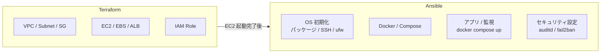

# ADR-0004: 構成管理に Ansible を採用

- **Status**: Accepted
- **Date**: 2026-03-25
- **Deciders**: ns7jp（個人ポートフォリオ）

---

## 1. Context

server-monitor v1.0 のセットアップは Markdown 手順書ベース。これは以下の問題を持つ。

- 手順を読みながらコピペするだけで、**「読んでない」「飛ばした」** が発生
- 設定の **意図的な差分** と **手作業ミスによる差分** が区別できない
- 新ホストへ移行するたびに、手順書を再実行する手間がかかる
- AWS / EC2 化（[03](../server-monitor-improvements/03-terraform-aws.md)）の前に、**OS / ミドル設定をコード化** しておく必要がある

---

## 2. Decision

**Ansible** を構成管理ツールとして採用する（[02 設計書](../server-monitor-improvements/02-ansible-automation.md)）。

playbook で OS 初期化 / Docker インストール / セキュリティ設定 / docker-compose デプロイを冪等化する。

---

## 3. Alternatives

| 選択肢 | 評価 | 不採用理由 |
| --- | --- | --- |
| **Chef** | 老舗、Ruby DSL | エージェント常駐型で導入が重い、Ruby 学習コスト、近年シェア低下 |
| **Puppet** | 老舗、宣言型 | 同上、独自 DSL の学習コスト、求人マッチで Ansible が優位 |
| **SaltStack** | 高速、Python 親和性 | コミュニティが Ansible より小さい、教材投資効率で劣後 |
| **shell スクリプト** | 学習不要 | 冪等性を自前で担保する必要、長期運用で破綻 |
| **Terraform のみ（provisioner）** | IaC 1 本化 | Terraform の本分はクラウドリソースの宣言。OS 内設定までやると責務が肥大 |
| **cloud-init のみ** | EC2 起動時で簡潔 | 起動後の継続的な再適用や、複雑な設定には向かない |
| **Packer + AMI** | ゴールデンイメージ、起動が速い | イメージビルドが重く反復が遅い。**Ansible で Packer から呼ぶハイブリッド** で将来補完予定 |

---

## 4. Decision Rationale

### 4.1 なぜ Ansible か

1. **エージェントレス**：SSH さえあれば動く、新ホストの準備が早い
2. **YAML ベース**：Markdown 手順書からの移行コストが低い
3. **学習教材が豊富**：日本語書籍、求人記載が多い
4. **モジュールが充実**：`docker_compose_v2`, `community.general.ufw` 等で OS 操作が標準化済み
5. **冪等性**：「もう一度実行しても安全」が標準的に保証される
6. **Terraform との役割分担が明確**：Terraform はリソース、Ansible は OS 内 → 「クラウド固有部分と OS 設定を綺麗に分離」できる

### 4.2 Terraform との役割分担

「**Terraform はインフラの形を作る、Ansible は中身を整える**」と覚える。

---

## 5. Consequences

### 5.1 良い影響

- **再現性**：`ansible-playbook site.yml` で 0 から構築可能
- **コードレビュー可**：構成変更が Pull Request で議論できる
- **棚卸し**：Ansible inventory が現存ホスト台帳になる
- **学習積み上げ**：Terraform への移行時、「これは TF / これは Ansible」の判断が自然に身につく

### 5.2 悪い影響・制約

- **実行が遅い**：SSH 越し逐次実行のため、台数が増えると分単位で時間がかかる → 部分実行（`--tags`）で対処
- **Pull 型ではない**：エージェント常駐がないため、「いま全ホストが宣言通りか」を継続検証する別の仕組みが必要 → CI で定期的に `--check` モード実行
- **シークレット管理**：Ansible Vault は使いやすいが、商用では AWS Secrets Manager / SSM Parameter Store に寄せた方が長期的に良い → [09 §5](../server-monitor-improvements/09-security-operations.md)

### 5.3 将来の発展

- **Ansible → AWS Systems Manager**：商用案件で Run Command / State Manager に移る可能性も視野
- **Ansible → Kubernetes Operator**：v3.0 では宣言の主役が Helm / Operator に移るため、Ansible は OS 層に縮退

---

## 6. 参考

- [Ansible Documentation](https://docs.ansible.com/)
- [Ansible Best Practices（2024 改訂版）](https://docs.ansible.com/ansible/latest/tips_tricks/index.html)
- [Geerling, "Ansible for DevOps"](https://www.ansiblefordevops.com/)
