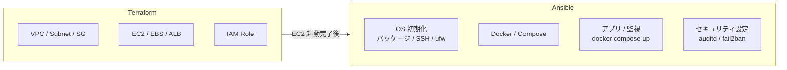

# ADR-0004: 構成管理に Ansible を採用

- **Status**: Accepted
- **Date**: 2026-03-25
- **Deciders**: ns7jp（個人ポートフォリオ）

> 公式ドキュメントや技術記事を調べて書いた学習目的の判断記録であり、
> 実務での構成管理運用・チーム意思決定の経験に基づくものではない。
> 代替案の比較も、深く使い込んだ上での判断ではなく、調べた範囲での判断である。

---

## 1. Context

server-monitor v1.0 のセットアップは Markdown 手順書ベースで、コピペ漏れなど手作業ミスと意図的な設定変更の区別がつかない問題があった。
AWS / EC2 化（[03](../server-monitor-improvements/03-terraform-aws.md)）の前に、OS / ミドル設定をコード化しておく必要があった。

---

## 2. Decision

**Ansible** を構成管理ツールとして採用する（[02 設計書](../server-monitor-improvements/02-ansible-automation.md)）。

playbook で OS 初期化 / Docker インストール / セキュリティ設定 / docker-compose デプロイを冪等化する。エージェントレスで SSH さえあれば動く点と、Markdown 手順書からの移行コストが低い YAML ベースである点を重視した。

役割分担は「Terraform はインフラの形を作る、Ansible は中身を整える」で分けている。

```mermaid
flowchart LR
    subgraph TF[Terraform]
        VPC[VPC / Subnet / SG]
        EC2[EC2 / EBS / ALB]
        IAM[IAM Role]
    end

    subgraph AN[Ansible]
        OS[OS 初期化<br/>パッケージ / SSH / ufw]
        Docker[Docker / Compose]
        App[アプリ / 監視<br/>docker compose up]
        Sec[セキュリティ設定<br/>auditd / fail2ban]
    end

    TF -->|EC2 起動完了後| AN
```

---

## 3. 他に見た選択肢

- **Chef / Puppet**: 老舗の構成管理ツールだが、エージェント常駐や独自 DSL の学習コストが重いと感じた
- **SaltStack**: 高速だがコミュニティが Ansible より小さく、教材が少なかった
- **shell スクリプト**: 学習コストは低いが、冪等性を自前で担保する必要があり長期運用では破綻しやすい
- **Packer + AMI**: ゴールデンイメージ方式。イメージビルドが重く反復が遅いため見送った

---

## 4. Consequences

- `ansible-playbook site.yml` で 0 から再現でき、構成変更を Pull Request 単位で見直せるようになった
- inventory がホスト台帳を兼ねるようになった
- SSH 越しの逐次実行のため台数が増えると遅く、Vault によるシークレット管理も商用では Secrets Manager 等への移行が要検討（[今後の興味リスト](../roadmap/README.md)）

---

## 5. 参考

- [Ansible Documentation](https://docs.ansible.com/)
- [Ansible Best Practices（2024 改訂版）](https://docs.ansible.com/ansible/latest/tips_tricks/index.html)
- [Geerling, "Ansible for DevOps"](https://www.ansiblefordevops.com/)
