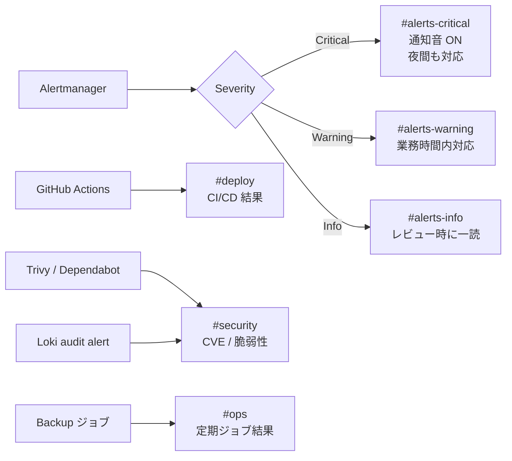

# ADR-0007: 通知チャネルに Slack を採用

- **Status**: Accepted
- **Date**: 2026-02-01
- **Deciders**: ns7jp（個人ポートフォリオ）

---

## 1. Context

Alertmanager / GitHub Actions / セキュリティスキャナーからの通知を **どのチャネル** で受けるかを決定する必要がある。

通知設計は単に「ツール選定」ではなく、**「誰が」「いつ」「どの粒度で」反応するか** に直結する。

---

## 2. Decision

**Slack（Incoming Webhook + Slack App）** を主通知チャネルとする。
ただし将来の On-Call 本格運用を見据え、**Critical Sev は PagerDuty / Opsgenie への切替パスを設計に含める**。

---

## 3. Alternatives

| 選択肢 | 評価 | 不採用理由（現段階） |
| --- | --- | --- |
| **メール** | 全社員受信可、簡単 | 既読管理ができず流される、Critical の即応性が低い |
| **PagerDuty** | On-Call の標準、エスカレーション・電話起こし可能 | 個人ポートフォリオで月額負担、当面は不要。将来 v1.3 で導入を検討 |
| **Opsgenie**（Atlassian） | PagerDuty 同等、Jira と統合 | 同上、Atlassian エコシステムを使う場合に再検討 |
| **Microsoft Teams** | 企業利用シェア | 個人で Slack に慣れている、IFTTT 的なツールも Slack の方が豊富 |
| **Discord** | 学習コミュニティで多用 | 業務系の用途ではない |
| **LINE / 個人 SMS** | 即届く | 業務用と分離できない、エスカレーション設計不可 |

---

## 4. Decision Rationale

### 4.1 なぜ Slack か

1. **業界標準**：採用面接で「Alertmanager → Slack 通知」と言えば即通じる
2. **チャネル分離が容易**：`#alerts-critical` / `#alerts-warning` / `#deploy` / `#security` を分けて運用できる
3. **Webhook API**：Alertmanager / GitHub / Trivy など全ツールが対応
4. **個人で無料枠で使える**：Free プランで十分（90 日履歴で十分）
5. **将来 PagerDuty 統合も可能**：Slack に集約しつつ、Critical だけ電話起こしも実装可

### 4.2 通知設計の原則（採用時に決めた）

| 原則 | 内容 |
| --- | --- |
| **ノイズと信号を分ける** | Warning と Critical で別チャネル、Critical だけ通知音 ON |
| **必ずアクションが書いてある** | アラート本文にランブック URL を必須化 |
| **メタ情報を必ず付ける** | instance, severity, value, threshold, Grafana URL |
| **抑制ルール** | 親アラート発火中は子アラートを抑制（cascade 防止） |
| **沈黙ルール** | 既知の問題は `silence` で時限抑制、自動失効 |

---

## 5. チャネル設計



---

## 6. Consequences

### 6.1 良い影響

- **学習・採用面接で再現性**：「監視 → 通知 → 対応」のループを面接で具体的に説明できる
- **既存ワークフローに溶け込みやすい**：採用先で Slack 利用なら即統合可能
- **ChatOps への発展**：将来 Slack コマンドから runbook 実行、incidentbot 等の自動化に発展できる

### 6.2 悪い影響・制約

- **夜間の対応保証ができない**：個人通知音だけでは寝てしまう。Critical Sev は PagerDuty / Opsgenie の導入で補完予定
- **Slack 障害時の代替経路がない**：副チャネルとしてメール / SMS の冗長化も将来検討
- **チャネルが増えると疲労**：定期的に「実効性のある通知」を棚卸しする月次レビューに組込み

### 6.3 将来の発展シナリオ

| 段階 | チャネル構成 |
| --- | --- |
| v1.0（現状） | Slack のみ |
| v1.3 | Slack + PagerDuty（Critical のみ） |
| v2.0 | Slack + PagerDuty + メール（重要連絡冗長化） |
| v3.0 | + ChatOps（Slack から runbook 起動） |

---

## 7. アラート本文テンプレ

```yaml
# alertmanager-template.tmpl
{{ define "slack.body" }}
{{ if eq .Status "firing" }}🔥{{ else }}✅{{ end }} *[{{ .Status | toUpper }}] {{ .Labels.alertname }}*
─────────────────────────────────
• instance: {{ .Labels.instance }}
• severity: *{{ .Labels.severity }}*
• value: {{ .Annotations.value }}
• threshold: {{ .Annotations.threshold }}

📖 Runbook: {{ .Annotations.runbook_url }}
📊 Grafana: {{ .Annotations.dashboard_url }}
{{ end }}
```

→ **ランブック URL が空ならアラートを登録しない** をルール化（PR レビューでチェック）。

---

## 8. 参考

- [Alertmanager Configuration](https://prometheus.io/docs/alerting/latest/configuration/)
- [Slack Incoming Webhooks](https://api.slack.com/messaging/webhooks)
- [Google SRE Workbook — Alerting on SLOs](https://sre.google/workbook/alerting-on-slos/)
