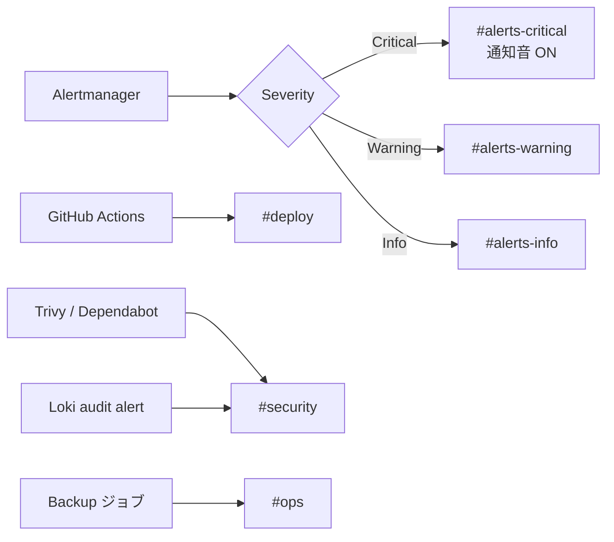

# ADR-0007: 通知チャネルに Slack を採用

- **Status**: Accepted
- **Date**: 2026-02-01
- **Deciders**: ns7jp（個人ポートフォリオ）

> 公式ドキュメントや技術記事を調べて書いた学習目的の判断記録であり、
> 実務での運用経験・チーム意思決定に基づくものではない。
> 通知ツールの比較も、深く使い込んだ上での判断ではなく、調べた範囲での判断である。

---

## 1. Context

Alertmanager / GitHub Actions / セキュリティスキャナーからの通知をどのチャネルで受けるかを決める必要がある。通知は「誰が」「いつ」気づくかに直結するため、単なるツール選定ではない。

---

## 2. Decision

**Slack（Incoming Webhook + Slack App）** を主通知チャネルとする。将来、重大なアラートだけは電話などですぐ気づける仕組み（PagerDuty / Opsgenie）への切替も検討する。

---

## 3. 他に見た選択肢

- **メール**: 誰でも受け取れるが既読管理ができず、緊急の連絡が流されやすい
- **PagerDuty / Opsgenie**: On-Call のエスカレーションや電話起こしができる本格的な選択肢だが、個人ポートフォリオの規模には月額コストが見合わず見送った（将来の導入候補）
- **Microsoft Teams / Discord**: 普段から Slack に慣れており、連携できるツールも豊富だった
- **LINE / 個人 SMS**: 業務用と私用が分離できないため見送った

---

## 4. チャネル設計


```mermaid
flowchart LR
    AM[Alertmanager] --> Severity{Severity}
    Severity -- Critical --> C[#alerts-critical<br/>通知音 ON]
    Severity -- Warning --> W[#alerts-warning]
    Severity -- Info --> I[#alerts-info]

    GA[GitHub Actions] --> Deploy[#deploy]
    Trivy[Trivy / Dependabot] --> Sec[#security]
    Audit[Loki audit alert] --> Sec
    Backup[Backup ジョブ] --> Ops[#ops]
```

---

## 5. Consequences

- 監視から通知、対応までの流れを一通り自分で組み立てられた
- 夜間など通知音だけでは気づけない場面の対応は課題として残る（将来 PagerDuty 等で補完予定）
- Slack 自体が落ちた場合の代替経路は未整備

---

## 6. アラート本文テンプレ

```yaml
# alertmanager-template.tmpl
{{ define "slack.body" }}
{{ if eq .Status "firing" }}🔥{{ else }}✅{{ end }} *[{{ .Status | toUpper }}] {{ .Labels.alertname }}*
─────────────────────────────────
• instance: {{ .Labels.instance }}
• severity: *{{ .Labels.severity }}*
• value: {{ .Annotations.value }}
• threshold: {{ .Annotations.threshold }}

📖 Runbook: {{ .Annotations.runbook_url }}
📊 Grafana: {{ .Annotations.dashboard_url }}
{{ end }}
```

ランブック URL が空のアラートは登録しないルールにしている。

---

## 7. 参考

- [Alertmanager Configuration](https://prometheus.io/docs/alerting/latest/configuration/)
- [Slack Incoming Webhooks](https://api.slack.com/messaging/webhooks)
- [Google SRE Workbook — Alerting on SLOs](https://sre.google/workbook/alerting-on-slos/)
