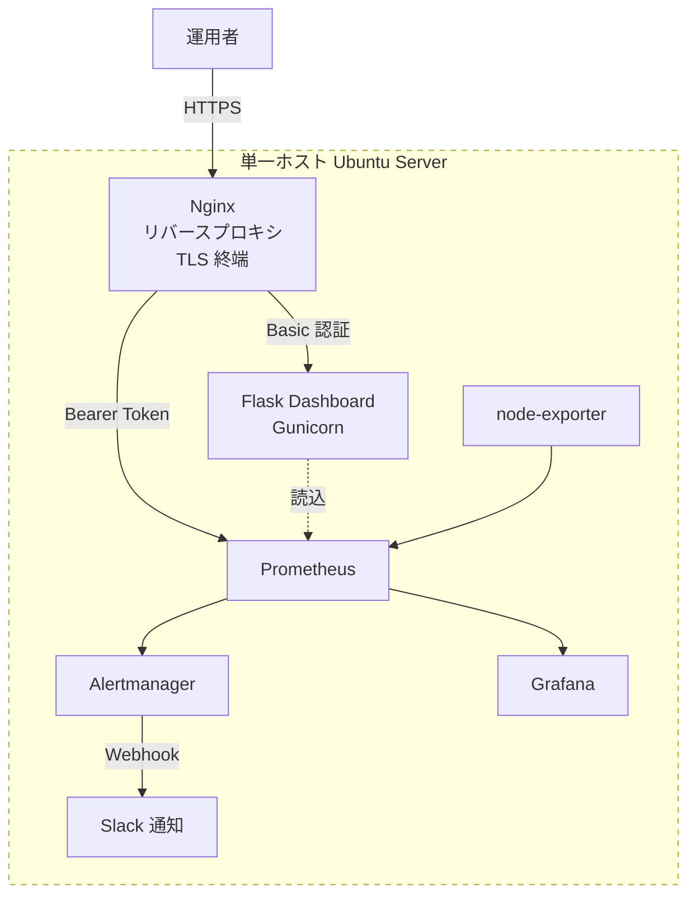
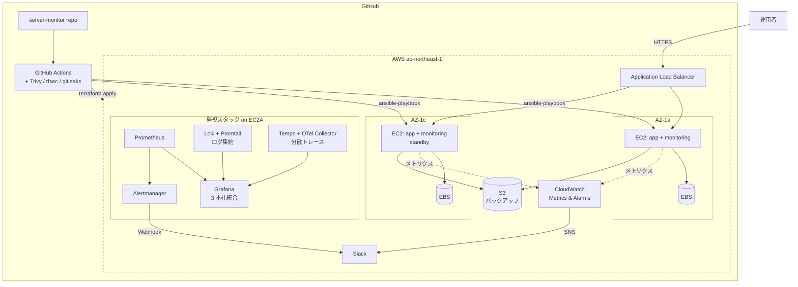
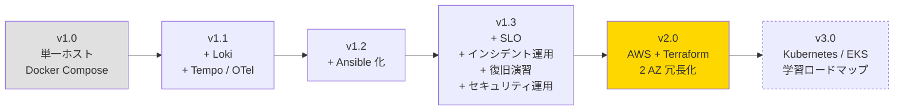

# アーキテクチャ図：現状と将来構想

サーバー監視ラボ（[server-monitor](https://github.com/ns7jp/server-monitor)）の **現状構成** と、改善後の **将来構想** を一枚絵で示します。

---

## 現状構成（v1.0：単一ホスト Docker Compose）

| 観点 | 現状 |
| --- | --- |
| 配備 | 単一ホスト + Docker Compose |
| メトリクス | Prometheus + node-exporter |
| 可視化 | Grafana |
| 通知 | Alertmanager → Slack |
| 認証 | Basic 認証 + Bearer Token |
| TLS | Nginx で終端 |
| CI | GitHub Actions（pytest・設定検証） |
| 構築手順 | Markdown 手順書 |

---

## 将来構想（v2.0：AWS + Terraform + Ansible + Loki + 冗長化）

| 観点 | 改善内容 | 参照 |
| --- | --- | --- |
| インフラ | AWS 上に Terraform で構築（IaC） | [03-terraform-aws.md](./server-monitor-improvements/03-terraform-aws.md) |
| 構成管理 | Ansible playbook で OS / ミドルウェア設定を冪等化 | [02-ansible-automation.md](./server-monitor-improvements/02-ansible-automation.md) |
| ログ | Loki + Promtail を追加し、メトリクスとログを 1 画面に | [01-loki-log-aggregation.md](./server-monitor-improvements/01-loki-log-aggregation.md) |
| トレース | Tempo + OpenTelemetry で Exemplars 連動の解析動線 | [06-observability-traces.md](./server-monitor-improvements/06-observability-traces.md) |
| 冗長化 | 2 AZ 構成 + ALB によるアクティブ-スタンバイ | [05-backup-recovery-drill.md](./server-monitor-improvements/05-backup-recovery-drill.md) |
| 信頼性指標 | SLO / SLI / エラーバジェット導入 | [04-slo-design.md](./server-monitor-improvements/04-slo-design.md) |
| 障害運用 | インシデント宣言・ポストモーテム・月次レビュー | [07-incident-response.md](./server-monitor-improvements/07-incident-response.md) |
| バックアップ | EBS スナップショット → S3、定期復旧演習 | [05-backup-recovery-drill.md](./server-monitor-improvements/05-backup-recovery-drill.md) |
| セキュリティ | 脆弱性スキャン CI、監査ログ、SSO、シークレットローテーション | [09-security-operations.md](./server-monitor-improvements/09-security-operations.md) |
| CI/CD | Terraform + Ansible + セキュリティスキャンを GitHub Actions から適用 | 同上 |
| 中長期発展 | Kubernetes / EKS（学習ロードマップ） | [08-kubernetes-roadmap.md](./server-monitor-improvements/08-kubernetes-roadmap.md) |

---

## 段階的移行計画

**優先順位の根拠**

1. **Loki + Tempo 追加（v1.1）** — 既存スタックに最小コストで **可観測性の三本柱** を完成させる。学習コストも低い。
2. **Ansible 化（v1.2）** — 手順書をコード化することで、v2.0 への移行コストを下げる。
3. **SLO / インシデント運用 / 復旧演習 / セキュリティ運用（v1.3）** — 既存構成のまま「運用品質」を可視化し、**月次レビューを一本化** する。これがあれば AWS 移行時の SLA 議論ができる。
4. **AWS + Terraform（v2.0）** — Ansible が出来てから着手することで、クラウド固有部分（Terraform）と OS 内設定（Ansible）を綺麗に分離できる。
5. **Kubernetes / EKS（v3.0）** — VM ベース AWS 環境を運用したうえで、CKAD / CKA と連動した段階的習得へ進む。

---

## 関連ドキュメント

- [server-monitor 改善計画 一覧](./server-monitor-improvements/README.md)
- [資格取得ロードマップ](./certifications/roadmap.md)
