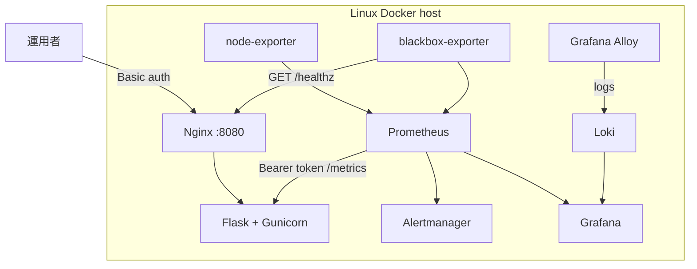
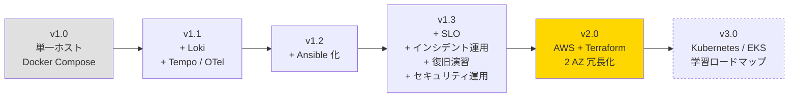

# アーキテクチャ図：実装済み構成と検証境界

サーバー監視ラボ（[server-monitor](https://github.com/ns7jp/server-monitor)）について、
構成コードとして実装した範囲と、実環境での証跡をまだ必要とする範囲を分けて示す。

## ローカルラボ構成（Docker Compose に実装済み）



| 観点 | 状態 |
| --- | --- |
| Metrics / alerts | Prometheus、Alertmanager、rules を実装 |
| Logs | Loki + Grafana Alloy を実装。Promtail は 2026-03-02 の EOL に伴い不採用 |
| SLO | blackbox-exporter、burn-rate rules、dashboard を実装 |
| 構成管理 | Ansible roles / playbook を実装 |
| 実測 | Docker 起動、演習 RTO、full Molecule の採録は未収録 |

blackbox-exporter は対象サービスと同じホスト内にあるため、ラボでのアプリ停止は測れるが、
ホスト全停止を外部利用者の視点から測定できない。この SLO はラボ内観測として扱う。

## AWS Terraform 構成（コード実装済み、適用証跡は未収録）

```mermaid
flowchart TB
    User[運用者] -->|HTTPS| ALB[Application Load Balancer]

    subgraph AWS[AWS ap-northeast-1]
        ALB --> A[EC2 AZ-1a<br/>app target + local lab stack]
        ALB --> C[EC2 AZ-1c<br/>app target + local lab stack]
        A -.AWS metrics.-> CW[CloudWatch alarms]
        C -.AWS metrics.-> CW
        CW --> SNS[SNS notification]
        A -.snapshot.-> Backup[AWS Backup]
        C -.snapshot.-> Backup
        Trail[CloudTrail + GuardDuty]
        Budget[AWS Budgets] --> SNS
    end

    Future[External synthetic probe<br/>and central telemetry store] -.required for production SLO.-> ALB
        ALB[Application Load Balancer]
        ALB --> EC2A
        ALB --> EC2B

        subgraph AZ1[AZ-1a]
            EC2A[EC2: app + monitoring]
            EBS_A[(EBS)]
            EC2A --> EBS_A
        end

        subgraph AZ2[AZ-1c]
            EC2B[EC2: app + monitoring<br/>standby]
            EBS_B[(EBS)]
            EC2B --> EBS_B
        end

        EC2A -.メトリクス.-> CW
        EC2B -.メトリクス.-> CW
        CW[CloudWatch<br/>Metrics & Alarms]

        EC2A --> S3[(S3<br/>バックアップ)]
        EC2B --> S3

        subgraph Monitoring[監視スタック on EC2A]
            Prom2[Prometheus]
            Loki[Loki + Promtail<br/>ログ集約]
            Tempo[Tempo + OTel Collector<br/>分散トレース]
            Grafana2[Grafana<br/>3 本柱統合]
            Alert2[Alertmanager]

            Prom2 --> Grafana2
            Loki --> Grafana2
            Tempo --> Grafana2
            Prom2 --> Alert2
        end

        Alert2 -->|Webhook| Slack2[Slack]
        CW -->|SNS| Slack2
    end

    subgraph CICD[GitHub]
        Repo[server-monitor repo]
        Actions[GitHub Actions<br/>+ Trivy / tfsec / gitleaks]
        Repo --> Actions
        Actions -->|terraform apply| AWS
        Actions -->|ansible-playbook| EC2A
        Actions -->|ansible-playbook| EC2B
    end

    style AWS stroke-dasharray: 5 5
```

| 観点 | 実装済み | まだ主張しないこと |
| --- | --- | --- |
| IaC | VPC / ALB / EC2 / Backup / CloudWatch / CloudTrail / GuardDuty / Budgets | AWS での apply 成功、実費 |
| 可用性 | ALB health / CloudWatch alarm のコード | 外部 synthetic probe による利用者視点 SLO |
| データ | 各 EC2 のローカル Compose 構成 | 複数 EC2 をまたぐ metrics / logs の中央正本 |
| 復旧 | AWS Backup とランブックのコード・文書 | 復旧演習の RTO / RPO 実測 |
| インフラ | AWS 上に Terraform で構築（IaC） | [03-terraform-aws.md](./server-monitor-improvements/03-terraform-aws.md) |
| 構成管理 | Ansible playbook で OS / ミドルウェア設定を冪等化 | [02-ansible-automation.md](./server-monitor-improvements/02-ansible-automation.md) |
| ログ | Loki + Promtail を追加し、メトリクスとログを 1 画面に | [01-loki-log-aggregation.md](./server-monitor-improvements/01-loki-log-aggregation.md) |
| トレース | Tempo + OpenTelemetry で Exemplars 連動の解析動線 | [06-observability-traces.md](./server-monitor-improvements/06-observability-traces.md) |
| メタ監視 | Healthchecks.io / UptimeRobot で監視の監視を冗長化 | [12-meta-monitoring.md](./server-monitor-improvements/12-meta-monitoring.md) |
| 冗長化 | 2 AZ 構成 + ALB によるアクティブ-スタンバイ | [05-backup-recovery-drill.md](./server-monitor-improvements/05-backup-recovery-drill.md) |
| 信頼性指標 | SLO / SLI / エラーバジェット導入 | [04-slo-design.md](./server-monitor-improvements/04-slo-design.md) |
| キャパ計画 | k6 で SLO 限界値を実測、Rightsizing と連動 | [10-capacity-planning.md](./server-monitor-improvements/10-capacity-planning.md) |
| 障害運用 | インシデント宣言・ポストモーテム・月次レビュー | [07-incident-response.md](./server-monitor-improvements/07-incident-response.md) |
| 変更管理 | Standard / Normal / Emergency 区分、PR ベース CAB | [11-change-management.md](./server-monitor-improvements/11-change-management.md) |
| バックアップ | EBS スナップショット → S3、定期復旧演習 | [05-backup-recovery-drill.md](./server-monitor-improvements/05-backup-recovery-drill.md) |
| DB 運用 | mysqldump + binlog で PITR、スロークエリ調査 | [14-database-operations.md](./server-monitor-improvements/14-database-operations.md) |
| ネットワーク | TLS 期限監視、SG 棚卸し、SSM Session Manager | [15-network-operations.md](./server-monitor-improvements/15-network-operations.md) |
| カオス / Game Day | pumba / AWS FIS で「気付ける設計」を実証 | [17-chaos-engineering.md](./server-monitor-improvements/17-chaos-engineering.md) |
| セキュリティ | 脆弱性スキャン CI、監査ログ、SSO、シークレットローテーション | [09-security-operations.md](./server-monitor-improvements/09-security-operations.md) |
| ID 運用 | ID ライフサイクル、IAM Identity Center、特権管理 | [16-identity-operations.md](./server-monitor-improvements/16-identity-operations.md) |
| コスト | タグ規約、Budgets / Anomaly Detection、Rightsizing 月次 | [13-finops.md](./server-monitor-improvements/13-finops.md) |
| CI/CD | Terraform + Ansible + セキュリティスキャンを GitHub Actions から適用 | 同上 |
| 中長期発展 | Kubernetes / EKS（学習ロードマップ） | [08-kubernetes-roadmap.md](./server-monitor-improvements/08-kubernetes-roadmap.md) |
| 技術選定根拠 | 主要な技術選定の比較・採否を ADR で記録 | [ADR 一覧](./adr/README.md) |

---

## 段階的移行計画



**優先順位の根拠**

1. **Loki + Tempo 追加（v1.1）** — 既存スタックに最小コストで **可観測性の三本柱** を完成させる。学習コストも低い。
2. **Ansible 化（v1.2）** — 手順書をコード化することで、v2.0 への移行コストを下げる。
3. **SLO / インシデント運用 / 復旧演習 / セキュリティ運用（v1.3）** — 既存構成のまま「運用品質」を可視化し、**月次レビューを一本化** する。これがあれば AWS 移行時の SLA 議論ができる。
4. **AWS + Terraform（v2.0）** — Ansible が出来てから着手することで、クラウド固有部分（Terraform）と OS 内設定（Ansible）を綺麗に分離できる。
5. **Kubernetes / EKS（v3.0）** — VM ベース AWS 環境を運用したうえで、CKAD / CKA と連動した段階的習得へ進む。

ALB の背後で node-local Grafana を複数台運用しても履歴は統合されないため、
監視データの正本とは扱わない。本番相当へ進める際は外部 probe と AMP / CloudWatch
Logs または中央 Loki の導入を先に証明する。

## 関連ドキュメント

- [改善設計の実装対応表](./server-monitor-improvements/README.md)
- [server-monitor の検証証跡台帳](https://github.com/ns7jp/server-monitor/blob/main/docs/evidence/README.md)
- [server-monitor 改善計画 一覧（17 本 + ADR 8 本）](./server-monitor-improvements/README.md)
- [ADR（アーキテクチャ決定記録）一覧](./adr/README.md)
- [資格取得ロードマップ](./certifications/roadmap.md)
- [現場経験 ↔ インフラ運用 橋渡し](./career-bridge.md)
