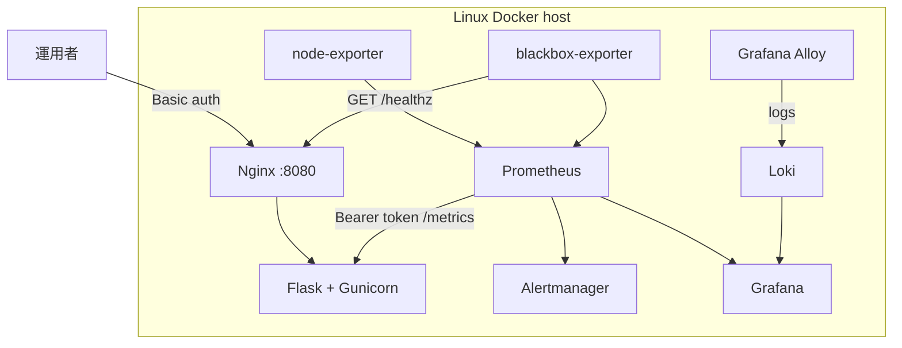
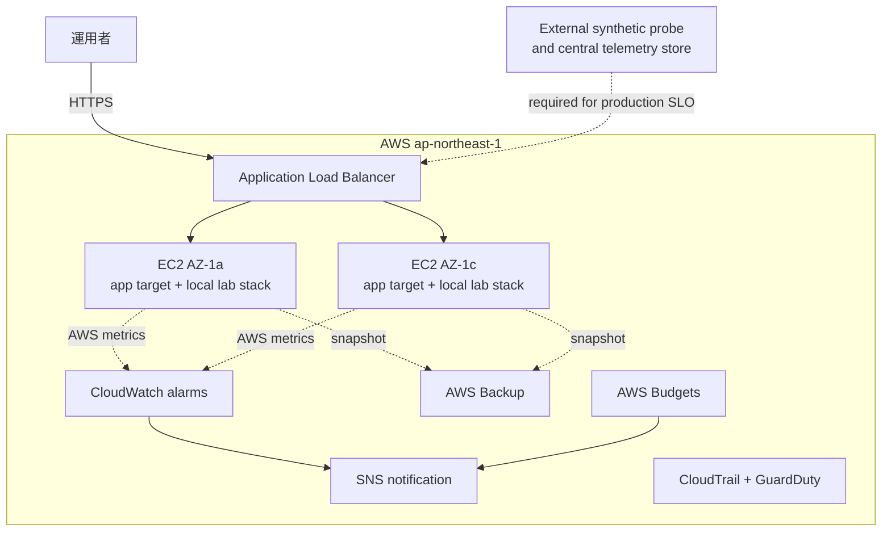

# アーキテクチャ図：実装済み構成と検証境界

サーバー監視ラボ（[server-monitor](https://github.com/ns7jp/server-monitor)）について、
構成コードとして実装した範囲と、実環境での証跡をまだ必要とする範囲を分けて示す。

## ローカルラボ構成（Docker Compose に実装済み）

| 観点 | 状態 |
| --- | --- |
| Metrics / alerts | Prometheus、Alertmanager、rules を実装 |
| Logs | Loki + Grafana Alloy を実装。Promtail は 2026-03-02 の EOL に伴い不採用 |
| SLO | blackbox-exporter、burn-rate rules、dashboard を実装 |
| 構成管理 | Ansible roles / playbook を実装 |
| 実測 | Docker 起動、演習 RTO、full Molecule の採録は未収録 |

blackbox-exporter は対象サービスと同じホスト内にあるため、ラボでのアプリ停止は測れるが、
ホスト全停止を外部利用者の視点から測定できない。この SLO はラボ内観測として扱う。

## AWS Terraform 構成（コード実装済み、適用証跡は未収録）

| 観点 | 実装済み | まだ主張しないこと |
| --- | --- | --- |
| IaC | VPC / ALB / EC2 / Backup / CloudWatch / CloudTrail / GuardDuty / Budgets | AWS での apply 成功、実費 |
| 可用性 | ALB health / CloudWatch alarm のコード | 外部 synthetic probe による利用者視点 SLO |
| データ | 各 EC2 のローカル Compose 構成 | 複数 EC2 をまたぐ metrics / logs の中央正本 |
| 復旧 | AWS Backup とランブックのコード・文書 | 復旧演習の RTO / RPO 実測 |

ALB の背後で node-local Grafana を複数台運用しても履歴は統合されないため、
監視データの正本とは扱わない。本番相当へ進める際は外部 probe と AMP / CloudWatch
Logs または中央 Loki の導入を先に証明する。

## 関連ドキュメント

- [改善設計の実装対応表](./server-monitor-improvements/README.md)
- [server-monitor の検証証跡台帳](https://github.com/ns7jp/server-monitor/blob/main/docs/evidence/README.md)
- [資格取得ロードマップ](./certifications/roadmap.md)
