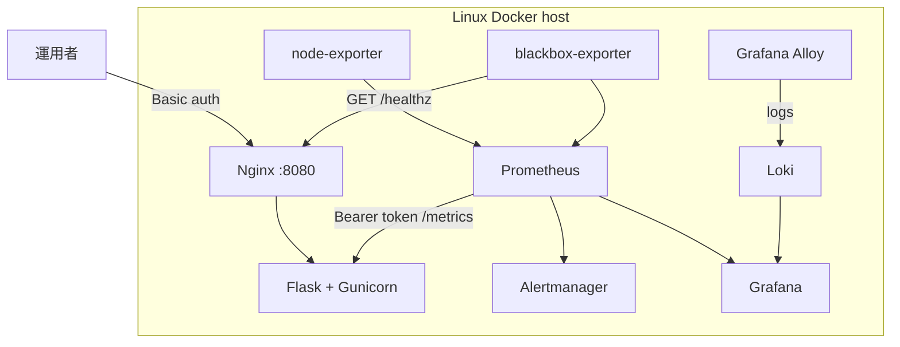
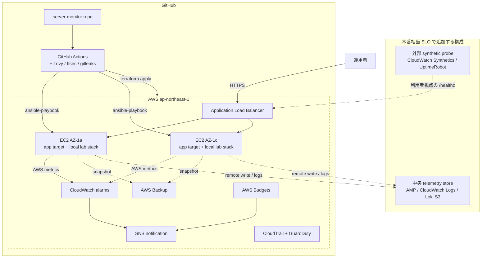
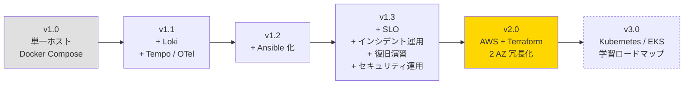

# アーキテクチャ図：実装済み構成と検証境界

サーバー監視ラボ（[server-monitor](https://github.com/ns7jp/server-monitor)）について、
構成コードとして実装した範囲と、実環境での証跡をまだ必要とする範囲を分けて示す。

## ローカルラボ構成（Docker Compose に実装済み）

| 観点 | 状態 |
| --- | --- |
| Metrics / alerts | Prometheus、Alertmanager、rules を実装 |
| Logs | Loki + Grafana Alloy を実装。Promtail は 2026-03-02 の EOL に伴い不採用 |
| SLO | blackbox-exporter、burn-rate rules、dashboard を実装 |
| 構成管理 | Ansible roles / playbook を実装 |
| 実測 | Docker 起動、演習 RTO、full Molecule の採録は未収録 |

blackbox-exporter は対象サービスと同じホスト内にあるため、ラボでのアプリ停止は測れるが、
ホスト全停止を外部利用者の視点から測定できない。この SLO はラボ内観測として扱う。

## AWS Terraform 構成（コード実装済み、適用証跡は未収録）

| 観点 | 実装済み | まだ主張しないこと |
| --- | --- | --- |
| IaC | VPC / ALB / EC2 / Backup / CloudWatch / CloudTrail / GuardDuty / Budgets | AWS での apply 成功、実費 |
| 可用性 | ALB health / CloudWatch alarm のコード | 外部 synthetic probe による利用者視点 SLO |
| データ | 各 EC2 のローカル Compose 構成 | 複数 EC2 をまたぐ metrics / logs の中央正本 |
| 復旧 | AWS Backup とランブックのコード・文書 | 復旧演習の RTO / RPO 実測 |

## 本番相当 SLO へ進めるための追加設計

| 領域 | 最小構成 | 目的 |
| --- | --- | --- |
| 外部 probe | CloudWatch Synthetics または UptimeRobot | 対象 EC2 外から `/healthz` を測る |
| Metrics 中央化 | Prometheus remote_write → AMP | EC2 障害時も時系列を失わない |
| Logs 中央化 | Alloy → CloudWatch Logs または Loki S3 | ノードをまたぐログ検索を可能にする |
| 通知 | CloudWatch Alarm / Alertmanager → Slack | 外形監視と内部監視の通知を統合 |
| 証跡 | probe 履歴、Grafana 画面、Cost Explorer | 「動いた」ことを再現可能に示す |

---

## 段階的移行計画

**優先順位の根拠**

1. **Tempo + メタ監視追加（v1.1）** — 既存の metrics / logs に traces と監視の監視を加える。
2. **Ansible 化（v1.2）** — 手順書をコード化することで、v2.0 への移行コストを下げる。
3. **SLO / インシデント運用 / 復旧演習 / セキュリティ運用（v1.3）** — 既存構成のまま「運用品質」を可視化し、**月次レビューを一本化** する。これがあれば AWS 移行時の SLA 議論ができる。
4. **AWS + Terraform（v2.0）** — Ansible が出来てから着手することで、クラウド固有部分（Terraform）と OS 内設定（Ansible）を綺麗に分離できる。
5. **Kubernetes / EKS（v3.0）** — VM ベース AWS 環境を運用したうえで、CKAD / CKA と連動した段階的習得へ進む。

ALB の背後で node-local Grafana を複数台運用しても履歴は統合されないため、
監視データの正本とは扱わない。本番相当へ進める際は外部 probe と AMP / CloudWatch
Logs または中央 Loki の導入を先に証明する。

## 関連ドキュメント

- [改善設計の実装対応表](./server-monitor-improvements/README.md)
- [server-monitor の検証証跡台帳](https://github.com/ns7jp/server-monitor/blob/main/docs/evidence/README.md)
- [外部 probe / 中央 telemetry 設計](https://github.com/ns7jp/server-monitor/blob/main/docs/external-probe-central-telemetry.md)
- [server-monitor 改善計画 一覧（17 本 + ADR 8 本）](./server-monitor-improvements/README.md)
- [ADR（アーキテクチャ決定記録）一覧](./adr/README.md)
- [資格取得ロードマップ](./certifications/roadmap.md)
- [現場経験 ↔ インフラ運用 橋渡し](./career-bridge.md)
