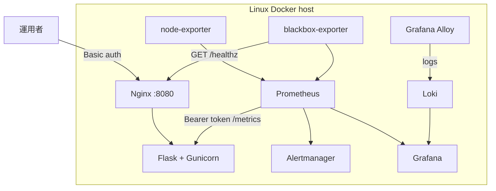
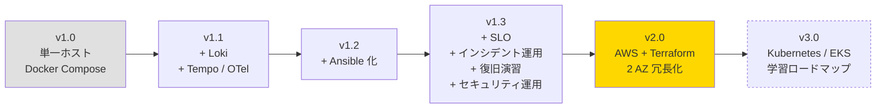

# アーキテクチャ図：実装済み構成と検証境界

サーバー監視ラボ（[server-monitor](https://github.com/ns7jp/server-monitor)）について、
構成コードとして実装した範囲と、実環境での証跡をまだ必要とする範囲を分けて示す。

## ローカルラボ構成（Docker Compose に実装済み）

```mermaid
flowchart TB
    User[運用者] -->|Basic auth| Nginx[Nginx :8080]

    subgraph Host[Linux Docker host]
        Nginx --> App[Flask + Gunicorn]
        Prom[Prometheus] -->|Bearer token /metrics| App
        Node[node-exporter] --> Prom
        Probe[blackbox-exporter] -->|GET /healthz| Nginx
        Probe --> Prom
        Prom --> Alert[Alertmanager]
        Prom --> Grafana[Grafana]
        Alloy[Grafana Alloy] -->|logs| Loki[Loki]
        Loki --> Grafana
    end
```

| 観点 | 状態 |
| --- | --- |
| Metrics / alerts | Prometheus、Alertmanager、rules を実装 |
| Logs | Loki + Grafana Alloy を実装。Promtail は 2026-03-02 の EOL に伴い不採用 |
| SLO | blackbox-exporter、burn-rate rules、dashboard を実装 |
| 構成管理 | Ansible roles / playbook を実装 |
| 実測 | Docker 起動、演習 RTO、full Molecule の採録は未収録 |

blackbox-exporter は対象サービスと同じホスト内にあるため、ラボでのアプリ停止は測れるが、
ホスト全停止を外部利用者の視点から測定できない。この SLO はラボ内観測として扱う。

## AWS Terraform 構成（コード実装済み、適用証跡は未収録）

ローカルラボと同じ構成を、AWS 上で ALB + 2 台の EC2 として動かす Terraform コードを
用意している。CloudWatch によるアラーム通知、AWS Backup によるスナップショット、
基本的な監査ログの有効化などをあわせてコード化した。

実装済みなのはコードのみで、実際に `terraform apply` した実績・実費は未収録。
詳細な構成図とセキュリティ設定は
[server-monitor 側のAWS設計](https://github.com/ns7jp/server-monitor/blob/main/docs/aws-architecture.md)
を正本とする。

複数 EC2 をまたぐ metrics / logs の一元化や、対象ホスト外からの外形監視は
未実装の将来構想として
[外部 probe / 中央 telemetry 設計](https://github.com/ns7jp/server-monitor/blob/main/docs/roadmap/external-probe-central-telemetry.md)
に整理している。

---

## 段階的移行計画

```mermaid
flowchart LR
    V10[v1.0<br/>単一ホスト<br/>Docker Compose] --> V11

    V11[v1.1<br/>+ Loki<br/>+ Tempo / OTel] --> V12
    V12[v1.2<br/>+ Ansible 化] --> V13
    V13[v1.3<br/>+ SLO<br/>+ インシデント運用<br/>+ 復旧演習<br/>+ セキュリティ運用] --> V20

    V20[v2.0<br/>AWS + Terraform<br/>2 AZ 冗長化] --> V30

    V30[v3.0<br/>Kubernetes / EKS<br/>学習ロードマップ]

    style V10 fill:#e0e0e0
    style V20 fill:#ffd700
    style V30 stroke-dasharray: 3 3
```

**優先順位の根拠**

1. **Tempo + 監視の監視追加（v1.1）** — 既存の metrics / logs に traces と監視の監視を加える。
2. **Ansible 化（v1.2）** — 手順書をコード化することで、v2.0 への移行コストを下げる。
3. **SLO / インシデント運用 / 復旧演習 / セキュリティ運用（v1.3）** — 既存構成のまま「運用品質」を可視化できるようになる。これがあれば AWS 移行後にどの程度の可用性・性能を保てているかを自分で説明しやすくなる。
4. **AWS + Terraform（v2.0）** — Ansible が出来てから着手することで、クラウド固有部分（Terraform）と OS 内設定（Ansible）を綺麗に分離できる。
5. **Kubernetes / EKS（v3.0）** — VM ベース AWS 環境を運用したうえで、CKAD / CKA と連動した段階的習得へ進む。

ALB の背後で node-local Grafana を複数台運用しても履歴は統合されないため、
監視データの正本とは扱わない。本番相当へ進める際は外部 probe と AMP / CloudWatch
Logs または中央 Loki の導入を先に証明する。

## 関連ドキュメント

- [改善設計の実装対応表](./server-monitor-improvements/README.md)
- [server-monitor の検証証跡台帳](https://github.com/ns7jp/server-monitor/blob/main/docs/evidence/README.md)
- [外部 probe / 中央 telemetry 設計](https://github.com/ns7jp/server-monitor/blob/main/docs/roadmap/external-probe-central-telemetry.md)
- [server-monitor 改善計画 一覧](./server-monitor-improvements/README.md)（中長期テーマ 4 本は [ロードマップ](./roadmap/README.md) へ分離）
- [ADR（アーキテクチャ決定記録）一覧](./adr/README.md)
- [資格取得ロードマップ](./certifications/roadmap.md)
- [現場経験 ↔ インフラ運用 橋渡し](./career-bridge.md)
