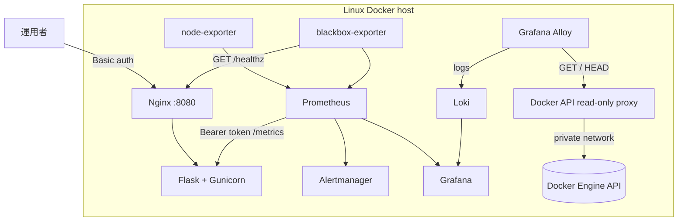
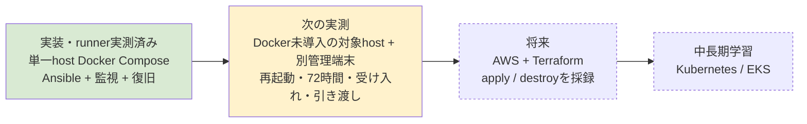

# アーキテクチャ図：実装済み構成と検証境界

サーバー監視ラボ（[server-monitor](https://github.com/ns7jp/server-monitor)）について、
構成コードとして実装した範囲と、実環境での証跡をまだ必要とする範囲を分けて示す。

## ローカルラボ構成（Docker Compose に実装済み）

```mermaid
flowchart TB
    User[運用者] -->|Basic auth| Nginx[Nginx :8080]

    subgraph Host[Linux Docker host]
        Nginx --> App[Flask + Gunicorn]
        Prom[Prometheus] -->|Bearer token /metrics| App
        Node[node-exporter] --> Prom
        Probe[blackbox-exporter] -->|GET /healthz| Nginx
        Probe --> Prom
        Prom --> Alert[Alertmanager]
        Prom --> Grafana[Grafana]
        Alloy[Grafana Alloy] -->|GET / HEAD| Proxy[Docker API read-only proxy]
        Proxy -->|private network| Engine[(Docker Engine API)]
        Alloy -->|logs| Loki[Loki]
        Loki --> Grafana
    end
```

| 観点 | 状態 |
| --- | --- |
| Metrics / alerts | Prometheus、Alertmanager、rules を実装 |
| Logs | Loki + Grafana Alloy を実装。Docker API は GET / HEAD 限定 proxy 経由。Promtail は 2026-03-02 の EOL に伴い不採用 |
| SLO | blackbox-exporter、burn-rate rules、dashboard を実装 |
| 構成管理 | Ansible roles / playbook を実装 |
| Full-stack E2E | [2026-08-22](https://github.com/ns7jp/server-monitor/blob/4a292026b569dd1a522c0f2913b4ad40aeccebe7/docs/evidence/2026-08-22-full-stack-e2e.md#pr-75-hardening後の再検証) に使い捨て Ubuntu 24.04 上で `site.yml` を 2 回適用し、2 回目 `changed=0`、計 11 containers、Docker API proxy の GET 成功・POST 拒否・Loki log 到達、network / UFW、local webhook、D-1 RTO 1 秒、3 volumes の backup / restore を確認。23/23 ID PASS |
| 既存の実測履歴 | Linux (WSL2) 上で 9 サービス起動、Grafana / Loki 表示、2026-08-19 の D-1 RTO 13 秒、4 ロールの full Molecule を採録済み |
| 未実測の境界 | Slack 実配信、AWS `apply / destroy`、D-2、Docker 未導入の引き渡し対象ホストと別の独立管理端末、組織 DNS、ホスト再起動後の永続性、24時間・72時間の継続稼働。local webhook と runner 内 network / UFW の結果をこれらの代替にはしない |

blackbox-exporter は対象サービスと同じホスト内にあるため、ラボでのアプリ停止は測れるが、
ホスト全停止を外部利用者の視点から測定できない。この SLO はラボ内観測として扱う。

## AWS Terraform 構成（コード実装済み、適用証跡は未収録）

ローカルラボと同じ構成を、AWS 上で ALB + 2 台の EC2 として動かす Terraform コードを
用意している。CloudWatch によるアラーム通知、AWS Backup によるスナップショット、
基本的な監査ログの有効化などをあわせてコード化した。

実装済みなのはコードのみで、実際に `terraform apply` した実績・実費は未収録。
詳細な構成図とセキュリティ設定は
[server-monitor 側のAWS設計](https://github.com/ns7jp/server-monitor/blob/main/docs/aws-architecture.md)
を正本とする。

複数 EC2 をまたぐ metrics / logs の一元化や、対象ホスト外からの外形監視は
未実装の将来構想として
[外部 probe / 中央 telemetry 設計](https://github.com/ns7jp/server-monitor/blob/main/docs/roadmap/external-probe-central-telemetry.md)
に整理している。

---

## 実装済み構成から次の実測へ

```mermaid
flowchart LR
    Current["実装・runner実測済み<br/>単一host Docker Compose<br/>Ansible + 監視 + 復旧"] --> Next["次の実測<br/>Docker未導入の対象host + 別管理端末<br/>再起動・72時間・受け入れ・引き渡し"]
    Next --> AWS["将来<br/>AWS + Terraform<br/>apply / destroyを採録"]
    AWS --> K8s["中長期学習<br/>Kubernetes / EKS"]

    style Current fill:#d9ead3
    style Next fill:#fff2cc
    style AWS stroke-dasharray: 3 3
    style K8s stroke-dasharray: 3 3
```

現在は機能追加より、同じ構成を Docker 未導入の独立ホストへ構築し、再起動後の状態と
受け入れ試験を採録することを優先する。AWS と Kubernetes はコードまたは学習計画であり、
実環境の結果を採録するまで実績として扱わない。

ALB の背後で node-local Grafana を複数台運用しても履歴は統合されないため、
監視データの正本とは扱わない。本番相当へ進める際は外部 probe と AMP / CloudWatch
Logs または中央 Loki の導入を先に証明する。

## 関連ドキュメント

- [改善設計の実装対応表](./server-monitor-improvements/README.md)
- [server-monitor の検証証跡台帳](https://github.com/ns7jp/server-monitor/blob/main/docs/evidence/README.md)
- [外部 probe / 中央 telemetry 設計](https://github.com/ns7jp/server-monitor/blob/main/docs/roadmap/external-probe-central-telemetry.md)
- [server-monitor 改善計画 一覧](./server-monitor-improvements/README.md)（中長期テーマ 4 本は [ロードマップ](./roadmap/README.md) へ分離）
- [ADR（アーキテクチャ決定記録）一覧](./adr/README.md)
- [資格取得ロードマップ](./certifications/roadmap.md)
- [現場経験 ↔ インフラ運用 橋渡し](./career-bridge.md)
