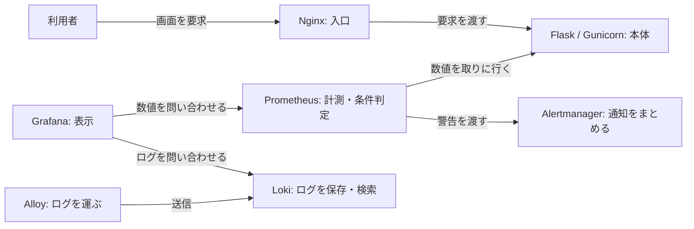

# プロフィール構成図の編集用ソース

[プロフィール](../README.md)には、GitHubの動的な図の描画処理に依存しない[SVG画像](images/architecture-overview.svg)を表示します。以下は同じ8要素・7本の矢印を表すMermaid原文です。図を変更する際はSVGとこの原文を同時に更新し、矢印の方向とラベルを照合します。

矢印は要求・取得・送信の向きで、応答は要求元へ返ります。構成と実測範囲の詳細は[アーキテクチャ図](architecture-diagram.md)と[検証証跡台帳](https://github.com/ns7jp/server/blob/main/docs/evidence/README.md)にあります。

SVGは固定背景と通常のテキスト・図形で構成し、JavaScript、外部画像・フォント、`foreignObject`を使いません。図の表示は構築・運用の実測結果を示すものではありません。
