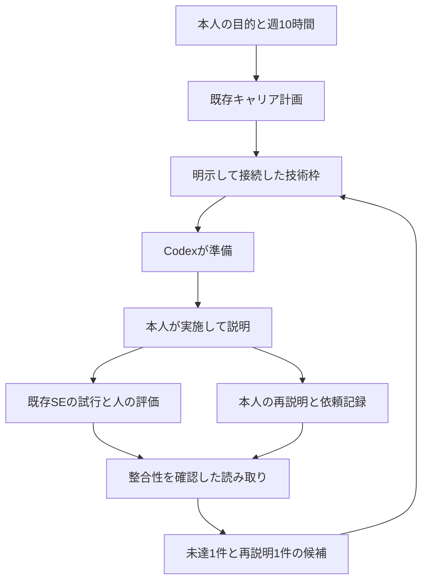

# 実際の記録から次の一手を選ぶ自律型成長システム

サーバー構築職への就職・定着に向けて、**目的を決める→予想する→実践する→確かめる→説明する→方法を変える→別日に再確認する**流れを回します。
本人の学習台帳を読み、次の未達条件と再説明の候補を選ぶ機能を、既存の週次運用へ追加します。
学習・作品改善・就職活動の合計は引き続き週10時間です。

## まず使うもの

| 目的 | 開くもの |
| --- | --- |
| 今日の課題が選ばれる仕組みを知る | [詳細設計](design.md) |
| 1回の練習を実施する | [実践の手順](practice.md) |
| 自分の予想・観測・説明・改善を残す | [本人用の記録票](templates.md) |
| 台帳を接続し、計画を生成する | [CLIと入力仕様](tool-guide.md) |
| 実装済みと未実施を確認する | [検証記録](validation.md) |

## 何を自動で進めるか

Codexは正本を読み、未達や再確認の候補を絞り、実施カード・確認質問・ログ記入枠・関連するコード改善を準備します。
本人が実施して結果を正本に残すと、次の実行で候補が変わります。前回と同じ意味の提案は繰り返し通知しません。

本人は、予想、実行、観測、説明、仮説、相談、次の方法を決めます。
AIの答えを使った試行も練習として残し、独力の確認は別の試行で行います。
人による実技観察が必要な段階は、実際の評価を受けるまで評価待ちです。

## 既存システムとの関係

技能合否は[既存SEの評価](../server-engineer/assessment.md)、仕事の承認は[PJまたは所属先の正本](../server-projects/README.md)、
求人・仕事・学習全体の配分は[キャリア計画](../engineer-career/README.md)を使います。
新しい技能称号、本人の実績、別の週10時間、別のスケジューラは追加しません。

## 初回の状態

この作業の私用キャリア設定では、本人のSE台帳IDは未接続です。
そのため最初は「既存の本人用台帳IDを確認して現在地を接続する」という準備を候補にします。
未接続を「本人は未経験」「全条件に未合格」と判断しません。
既存台帳がある場合はそのIDを指定し、ない場合にだけ既存SEツールで空の本人用台帳を作ります。

初期接続は既存の `evidence-map`（証拠整理）枠の一部を使う提案です。
この枠は180分で、未接続の確認に20分を提案します。残り160分が消化済みになることはなく、週の計画390分に時間を追加しません。
他の仕事の技術枠は流用しません。対象行動の目的や時間が変わったら、枠の接続を見直します。

## 実際に成長したと判断する材料

前より説明できるようになった、違う条件でも再現できた、必要なところで相談できた、
同じ失敗に別の識別方法を使えた、相手が手順を追えた、といった観察を本人の記録で確認します。
コードや資料を作ったこと、計画が生成されたこと、試験用データのテスト成功は、本人の技能の実証とは区別します。

採用・職場評価・実務権限の判断は、それぞれの当事者と正本に従います。
このシステムは、次の行動と確認を続けるための仕組みです。
