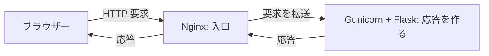
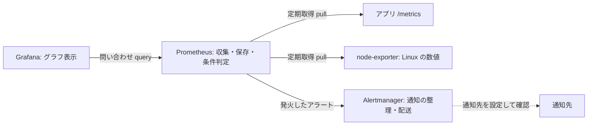
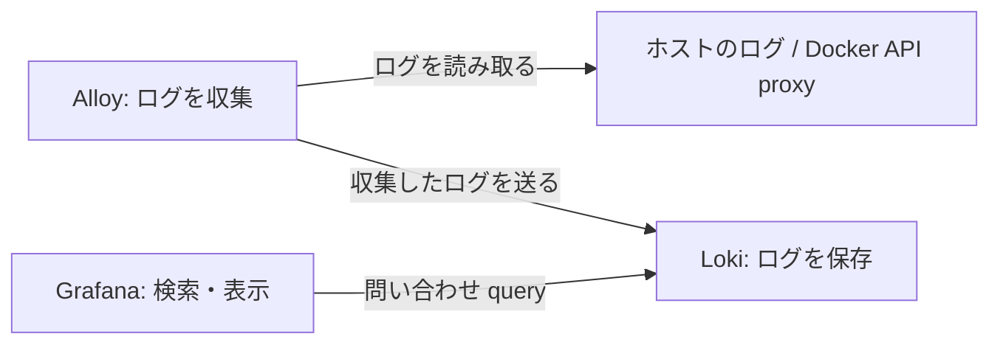

# やさしい用語・見方ガイド

このページは、未経験からサーバー構築エンジニアを目指す人が、主作品 **[server](https://github.com/ns7jp/server)** を理解するための入口です。目標は、製品名を暗記することではなく、**「何のために作り、何がどの役割を持ち、何を見て正常と判断するか」**を説明することです。

まずこのページで仕組みを読み、[説明練習と自分の記録](./portfolio-explanation.md)で言葉にします。実際の構築は、主作品の[初心者向け学習ガイド](https://github.com/ns7jp/server/blob/main/docs/beginner-learning-guide.md)で app と Nginx の最小構成から始めます。その後に[一本道ラーニングパス](https://github.com/ns7jp/server/blob/main/docs/learning-path.md)で監視・自動化・復旧へ範囲を広げます。読む時間と、環境を用意して習得する時間は別です。

## 1. この作品は何を作っているのか

**Linux 上に小さなアプリと監視の仕組みを置き、正常確認・異常の切り分け・復旧・記録を練習する個人の学習ラボ**です。業務の本番運用経験を示すものではありません。

サーバーは、他のコンピューターやソフトからの要求に応じて、情報や機能を返す側です。要求する側を **クライアント** と呼びます。例えばブラウザーが「ページをください」と要求し、Web サーバーがページを返します。サーバーという言葉は、役割・ソフト・それが動くコンピューターのいずれも指すため、何を指しているかを確認します。

この作品では、人が状態表示アプリを見られるようにしたうえで、「アプリが返事をするか」「Linux の負荷はどうか」「何が起きたか」を別々に確かめます。

| 知りたいこと | 見るもの | 分かること・限界 |
| --- | --- | --- |
| アプリは返事をするか | `/healthz` という確認用 URL | 確認時点で応答したか。全機能や長期の安定動作まで保証しない |
| CPU やメモリの状態はどうか | メトリクス（時刻と結び付いた数値） | いつ、どの数値が変化したか。数値だけで原因は確定しない |
| そのとき何が起きたか | ログ（時刻付きの出来事の記録） | エラーや操作の手がかり。関連する状態や設定と照合する |
| 戻ったと判断できるか | 復旧後の状態、応答、ログ | 変更前に決めた試験と比べて判断する |

主作品の基本構成に業務データ用の DB はありません。Web / AP / DB の 3 層構成は別の発展ラボです。最初は以下の基本構成を説明できれば十分です。

## 2. 土台・起動・設定を分ける

| 言葉 | 平易な意味 | この作品との関係 |
| --- | --- | --- |
| OS / Linux / Ubuntu | OS は機器やソフトを動かす基本ソフト。Linux を使いやすくまとめたものの一つが Ubuntu | 入門は破棄できる Ubuntu 24.04 の検証環境で進める |
| ホスト | コンテナなどを動かす側のコンピューター | Linux ホスト全体の状態と、アプリから見える状態を区別する |
| VM（仮想マシン） | ソフトで用意するコンピューター。通常はその中に OS を入れる | 学習用の Linux を手元の PC 内に用意する方法の一つ |
| コンテナ / Docker | ホストの OS カーネルを共有し、プロセスなどを分離してソフトを動かす仕組み | アプリや監視製品を分けて動かす。VM と同じものではない |
| Docker Compose | 複数コンテナの起動設定をまとめて扱う道具 | `compose.yaml` にサービス、通信、保存先を書く |
| Ansible | 望む設定をファイルに書き、対象へ適用する道具 | OS 設定や配備をそろえる。実行内容を読むことが先 |
| Git | ファイルの変更履歴を残す道具 | どの版を使い、何を変えたかを追えるようにする |

コンテナを「箱」、Ansible を「手順書」と考えると役割は覚えやすくなります。ただし、箱でも完全に独立した PC ではなく、手順書でも誤った設定を自動で正しく直してくれるわけではありません。たとえは入口として使い、実際の設定と試験で確かめます。

**冪等性（べきとうせい）**は、同じ望ましい状態を繰り返し適用しても、不要な変更が増えない性質です。Ansible の 2 回目の結果 `changed=0` はその確認材料です。実行対象・設定・失敗の有無も記録します。変更が 0 件というだけで、サービス全体の正常動作が証明されるわけではありません。

## 3. 通信と監視を三つの経路で覚える

### A. 人がアプリを見る経路

**HTTP** は Web の要求と応答の約束です。**Nginx** が入口で要求を受け、**Gunicorn** が動かす **Flask** アプリへ渡します。受付と担当者にたとえられますが、通信の中継であり、人が判断して振り分けるわけではありません。

**IP アドレス**は通信先を指定する番号、**ポート**は同じ通信先でどのサービスにつなぐかを指定する番号です。基本構成の `127.0.0.1:8080` は、そのホスト自身からアクセスする入口です。VM 内で動かした場合、Windows のブラウザーから見た `127.0.0.1` は Windows 自身です。別の端末からの閲覧は、主作品の[配備手順](https://github.com/ns7jp/server/blob/main/docs/deployment.md)に沿って接続方法を確認します。

### B. 数値を収集して表示し、異常を知らせる経路

この図の `pull / query` の矢印は、**誰が要求を出すか**を示します。数値の応答は逆方向に返ります。

- **Prometheus** がアプリや **node-exporter** へ定期的に数値を取りに行き、保存します。アプリが Grafana へ数値を直接送り続ける構成ではありません。
- **Grafana** は Prometheus に問い合わせてグラフを表示します。Grafana の画面が開かなくても、それだけで数値収集が止まったとは判断できません。
- この作品の数値による異常条件は **Prometheus のルール**で判定します。**Alertmanager** は届いたアラートをまとめたり、抑制したり、通知先へ配送したりします。異常の検知と通知の到達は別々に試験します。
- Linux ホスト全体は **node-exporter** を基準に確認します。コンテナ内で動く Flask / `psutil` から見える数値は実行環境の影響を受けるため、ホスト全体の値だと決め付けません。

さらに **blackbox-exporter** が Nginx 経由の `/healthz` にアクセスし、その結果を Prometheus が取得する経路があります。「数値を取得できるか」と「入口から応答するか」を分けるためです。基本構成では監視側も同じホストにいるので、ホスト全停止を独立した外部の視点で測る構成ではありません。

### C. 出来事の記録を探す経路

**Alloy** はログを収集して **Loki** に送り、**Grafana** は Loki に問い合わせてログを表示します。コンテナログの取得では、Alloy は読み取り用の **Docker API proxy** を経由します。メトリクスは「いつ、どの程度変化したか」、ログは「そのとき何が起きたか」を考える材料です。

実装との対応は、主作品の [`compose.yaml`](https://github.com/ns7jp/server/blob/main/compose.yaml)、[Prometheus の収集設定](https://github.com/ns7jp/server/blob/main/deploy/prometheus/prometheus.yml)、[異常条件](https://github.com/ns7jp/server/blob/main/deploy/prometheus/rules.yml)、[Grafana の問い合わせ先](https://github.com/ns7jp/server/tree/main/deploy/grafana/provisioning/datasources)、[Alloy の収集設定](https://github.com/ns7jp/server/blob/main/deploy/alloy/config.alloy)で確認できます。最初はファイル全部を理解せず、今読んだ製品名と接続先を一つ見つけます。

## 4. コマンドを目的から選ぶ

以下は Linux 検証環境で使う確認例です。`<名前>` や `<URL>` は対象に置き換える欄で、そのまま入力しません。Compose のコマンドは主作品の `server` ディレクトリで、環境準備後に使います。

| 確かめたいこと | 確認例 | 観測と、まだ言えないこと |
| --- | --- | --- |
| OS のサービス状態 | `systemctl status <名前>` | `active` は unit の状態。Web の応答も別に確認する |
| OS のサービスログ | `journalctl -u <名前> --since today` | 発生時刻の前後を読む。最初に見つけたエラーが根本原因とは限らない |
| TCP ポートの待ち受け | `ss -lntp` | `LISTEN` は待ち受けあり。外部から到達できる証明ではない |
| 名前解決 | `dig <名前>` | 返答状態と期待した IP を照合する。Web の正常性は別 |
| HTTP の応答 | `curl -i <URL>` | 状態コードと本文を期待値と比べる。200 だけで全機能を合格にしない |
| ディスク使用状況 | `df -h` | 対象の使用率を確認する。増加傾向、必要容量、inode 不足も別途見る |
| コンテナの状態 | `docker compose ps` | `Up` は稼働状態。`healthy` の有無と実際の応答も見る |
| アプリの直近ログ | `docker compose logs --tail=50 app` | 発生時刻とエラーの前後を読む。50 行より前の情報が必要なこともある |

OS の `systemctl` と Compose の `docker compose ps` は、調べる対象が違います。主作品の基本構成では、Docker 内の app を調べるときに `systemctl status app` と入力するわけではありません。

詳しいオプションは[Linux コマンド集](./linux-commands.md)、Windows 側の操作は[Windows コマンド集](./windows-commands.md)へ進みます。

## 5. 構築と障害対応を一巡する

サーバー構築は、**要件 → 設計 → 構築 → 試験 → 証跡 → 運用 → 変更**で考えます。要件は「何が必要か」、設計は「どの設定で満たすか」、証跡は「実行内容と結果を後から確認できる記録」です。

例えば「アプリの状態を自分の端末から確認したい」なら、必要な通信と公開範囲を決め、構築し、状態と応答を試験して記録します。運用中に問題が出たら、次の順で考えます。

1. **見る**：対象、発生時刻、症状、直前の変更、状態とログを保存する。
2. **絞る**：到達先・待受・Nginx・アプリなどを、正常と確認できた範囲から調べる。一つの症状だけで原因を断定しない。
3. **変える**：戻し方を決め、仮説に対応する変更を一つ行う。
4. **確かめる**：変更前と同じ試験を行い、期待値と比べて復旧を判定する。

再起動も調査や復旧の手段ですが、先に必要な状態とログを確保します。障害を起こす練習は、主作品の指定手順と中止条件に従い、破棄できる検証環境で進めます。

## 6. 作品の証跡と自分の習得を分ける

| 言葉 | 意味 | 自分の説明に必要なもの |
| --- | --- | --- |
| 文書化済み | 設計や手順がある | 該当文書を示す。実行したとは言わない |
| 実装済み | コードや設定がある | 該当ファイルを示す。動作確認範囲は別に示す |
| 記録済みの実測 | 特定の日時・環境・版で実行結果がある | [検証証跡台帳](https://github.com/ns7jp/server/blob/main/docs/evidence/README.md)と日付付き記録を示す |
| 自分で実施 | 本人が対象と結果を確認した | 自分の日時・環境・操作・出力・判定を残す |
| `NOT RUN` | まだ実行していない | 何を、どの条件で次に確認するかを書く |

CI（変更時などに自動で試験を実行する仕組み）の成功は、その試験の対象範囲での根拠です。自分の PC での再現、長期運用、AWS の実利用、本人の理解度まで証明するものではありません。

理解と操作の記録には[説明練習ページの記録欄](./portfolio-explanation.md#3-自分の操作記録を一つ作る)を使います。まだ実施していない結果は空欄のまま、状態を `NOT RUN` として残します。

## 次に進む道順

| 今の目的 | 次に開くページ | 完了の目安 |
| --- | --- | --- |
| 仕組みを話してみたい | [説明練習と自分の記録](./portfolio-explanation.md) | 図を見ずに主要な役割を話し、質問に答える |
| 主作品を自分で動かしたい | [主作品の初心者向け学習ガイド](https://github.com/ns7jp/server/blob/main/docs/beginner-learning-guide.md) | 前提を確認し、app と Nginx の最小構成の操作と判定を残す |
| 最小構成から範囲を広げたい | [主作品の一本道ラーニングパス](https://github.com/ns7jp/server/blob/main/docs/learning-path.md) | 監視・自動化・復旧を Level ごとに実施し、記録する |
| Linux の基本操作から始めたい | [初心者向けスタートガイド](./learning-plan/00-start-here.md) | 開始前診断と最初の状態確認を記録する |
| 基礎から継続して学びたい | [24 週の学習プラン](./learning-plan/README.md) | 自分の環境と時間に合わせて範囲を選ぶ |
| 失敗の考え方を知りたい | [詰まった記録](../LEARNINGS.md) | 一事例の症状・確認・変更・再確認を区別する |

[プロフィールに戻る](../README.md)
