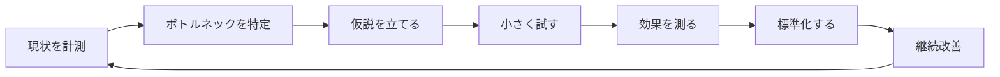

# 現場経験とインフラ運用の橋渡し

> **本ドキュメントの位置付け**
>
> 製造・物流の現場で 10 年以上培ったスキルが、**インフラ運用・社内 SE 補助業務にどう転用できるか** を言語化したものです。
> 「未経験のキャリアチェンジ」ではなく、**「業種は変わるが、コア能力は地続き」** であることを示すのが目的です。

---

## 1. 共通する仕事の構造

製造・物流の現場と、インフラ運用は、**同じ構造の仕事** をしています。

| ステップ | 物流現場の例 | インフラ運用の例 |
| --- | --- | --- |
| 計測 | 15 分単位の作業時間ログ | SLI（可用性、レイテンシ）の継続計測 |
| 特定 | 「場所探し」が 1 日 1 時間 | エラーバジェットの消費が偏る時間帯 |
| 仮説 | 棚ラベル更新で短縮できる | nginx keepalive 設定で改善する |
| 試す | 1 列だけ動線変更 | staging で設定変更 |
| 測る | 1 週間の作業時間変化 | p95 レイテンシの推移 |
| 標準化 | 場所マップ + 補充閾値表 | ランブック + IaC 化 |
| 改善 | 季節要因で再見直し | 月次 SLO レビュー |

物流現場で「**継続計測ルール不在**」だった反省（[業務改善レポート](./business-improvement/picking-improvement.md)）が、サーバー監視ラボの [SLO 設計](./server-monitor-improvements/04-slo-design.md) に直接活きています。

---

## 2. スキル転用マップ

### 2.1 計測・分析

| 物流現場 | インフラ運用 | 該当ドキュメント |
| --- | --- | --- |
| 15 分単位の作業時間記録 | SLI 計測（Prometheus / Loki） | [04. SLO 設計](./server-monitor-improvements/04-slo-design.md) |
| ABC 分析（パレート図） | 問い合わせ TOP10 → FAQ / 自動化対象選定 | [想定 FAQ](./it-support/faq.md) / [Service Desk Metrics](./it-support/service-desk-metrics.md) |
| 「忙しい時間帯」の特定 | バーンレートアラート（負荷ピーク検出） | [04. SLO 設計](./server-monitor-improvements/04-slo-design.md) |
| 出庫頻度の集計 | アラート発火頻度・ノイズ率の集計 | [07. インシデント対応](./server-monitor-improvements/07-incident-response.md) |
| 容量上限の把握（棚・倉庫） | キャパシティ計画（CPU / Mem / Disk / RPS） | [10. キャパシティプランニング](./server-monitor-improvements/10-capacity-planning.md) |
| ピッキング件数の月次レビュー | Service Desk メトリクスの月次レビュー | [Service Desk Metrics](./it-support/service-desk-metrics.md) |

### 2.2 標準化・属人化排除

| 物流現場 | インフラ運用 | 該当ドキュメント |
| --- | --- | --- |
| 場所マップで「新人でも探せる」 | 構成図 + ランブックで「当番でも復旧できる」 | [server-monitor 構成](https://github.com/ns7jp/server-monitor/blob/main/docs/architecture.md) |
| 棚ラベル統一（表記揺れ排除） | リソースタグ規約・命名規則 | [03. Terraform 化](./server-monitor-improvements/03-terraform-aws.md) |
| 補充閾値表で「気付いた人がやる」を脱却 | アラート閾値・自動スケール | [04. SLO 設計](./server-monitor-improvements/04-slo-design.md) |
| OJT チェックリスト | キッティング SOP・オンボーディング手順 | [アカウント管理](./it-support/account-management.md) |

### 2.3 運用カイゼン

| 物流現場 | インフラ運用 | 該当ドキュメント |
| --- | --- | --- |
| 動線改善（ABC で棚再配置） | アラート最適化（ノイズ削減） | [07. インシデント対応](./server-monitor-improvements/07-incident-response.md) |
| 季節要因で計測期間を見直す | 月次 SLO レビュー、エラーバジェット消費判断 | [04. SLO 設計](./server-monitor-improvements/04-slo-design.md) |
| 「カイゼンのリバウンド防止」 | IaC + CI で「設定が手動で戻らない」 | [02. Ansible](./server-monitor-improvements/02-ansible-automation.md) |
| 棚卸し（実物と帳簿の突合） | 構成棚卸し（Ansible / AWS Config） | [02. Ansible](./server-monitor-improvements/02-ansible-automation.md) [09. セキュリティ運用](./server-monitor-improvements/09-security-operations.md) |
| 「変えてはいけない時期」の合意 | 変更窓・凍結期間（年末年始・連休前） | [11. 変更管理](./server-monitor-improvements/11-change-management.md) |
| 想定外への備え（停電演習） | カオスエンジニアリング / Game Day | [17. カオスエンジニアリング](./roadmap/17-chaos-engineering.md) |

### 2.4 セキュリティ・統制（5S → セキュリティ統制）

| 物流現場の 5S | インフラ運用 | 該当ドキュメント |
| --- | --- | --- |
| 整理（要らない物を捨てる） | 不要 IAM ロール・古いシークレット削除 | [09. セキュリティ運用](./server-monitor-improvements/09-security-operations.md) |
| 整頓（定位置管理） | リソースタグ規約・Namespace 分離 | [03. Terraform 化](./server-monitor-improvements/03-terraform-aws.md) |
| 清掃（日々の点検） | 監査ログ日次チェック | [09. セキュリティ運用](./server-monitor-improvements/09-security-operations.md) |
| 清潔（清掃の標準化） | 自動化された脆弱性スキャン CI | [09. セキュリティ運用](./server-monitor-improvements/09-security-operations.md) |
| 躾（ルールの定着） | コードレビュー・PR ブロック | 各設計書の CI セクション |

### 2.5 災害対応・BCP

| 物流現場 | インフラ運用 | 該当ドキュメント |
| --- | --- | --- |
| 機械停止時の手作業フォロー | プロセス障害時のフェイルオーバー | [server-monitor ランブック](https://github.com/ns7jp/server-monitor/blob/main/docs/runbooks/service-down.md) |
| 繁忙期のピーク対応 | 負荷スパイク時のオートスケール / 帯域制御 | [08. K8s 計画](./server-monitor-improvements/08-kubernetes-roadmap.md) |
| 棚卸しズレ発生時の原因追跡 | データ不整合時の調査・復旧 | [05. 復旧演習](./server-monitor-improvements/05-backup-recovery-drill.md) |
| 災害時の代替動線 | 2 AZ 冗長化、リージョン障害対応 | [03. Terraform 化](./server-monitor-improvements/03-terraform-aws.md) [05. 復旧演習](./server-monitor-improvements/05-backup-recovery-drill.md) |

### 2.6 監視ツールの転用可能性（Prometheus → Zabbix / JP1）

本ラボは Prometheus / Grafana / Loki（OSS・SRE 系）で構成していますが、国内の監視運用・運用保守の現場では **Zabbix や JP1 系** が使われることも多いと理解しています。ツールは違っても監視の基本概念は対応するため、次の対応で読み替えて習得します。

| 監視の概念 | 本ラボ（Prometheus 系） | Zabbix | JP1 系 |
| --- | --- | --- | --- |
| メトリクス収集 | exporter（pull） | Zabbix エージェント / アイテム | JP1/PFM のレコード収集 |
| 監視対象の登録 | scrape config / service discovery | ホスト登録 + テンプレート | エージェント管理 |
| 異常判定のルール | alerting rule（PromQL） | トリガー（条件式） | 監視条件・しきい値定義 |
| 通知・エスカレーション | Alertmanager（ルーティング・抑制） | アクション（段階通知） | JP1/IM の自動アクション |
| 可視化 | Grafana ダッシュボード | Zabbix ダッシュボード / グラフ | 統合コンソール |
| ログ監視 | Loki + Alloy | ログ監視アイテム | JP1/Base ログトラップ |

「しきい値を決めて・検知して・通知して・手順書で対応する」という運用の骨格は共通なので、**ツール指定のある現場でも短期間でキャッチアップできる** 前提で学習しています（面接で「うちは Zabbix だが」と問われた際も、この対応表で説明します）。

---

## 3. 一段深い共通点 — 「**現場と本社の翻訳者**」

物流現場では「現場の困りごと」と「本社の改善方針」をつなぐ立場でした。
これはインフラ運用の現場で **「アプリ開発」と「経営層のコスト・SLA」をつなぐ役割** とほぼ同じ構造です。

| 物流での経験 | インフラ運用での活かし方 |
| --- | --- |
| 現場の言葉で課題を整理し、上長に「数値で」報告 | 障害事象を経営層に「SLO バジェット / 売上影響」で説明 |
| 本社施策を現場が動けるレベルに咀嚼 | 経営方針（コスト削減 / 可用性向上）を運用ルールに落とす |
| 現場の負荷感覚をデータ化する習慣 | アラート疲労を可視化し、運用負荷を経営課題として上申 |

---

## 4. 「失敗からの学び」を仕組み化する習慣

物流現場の業務改善で **最大の反省点** だったのは、改善後の継続計測を仕組み化しなかったことです（[業務改善レポート §6](./business-improvement/picking-improvement.md)）。

この経験から、サーバー監視ラボでは **意図的に以下を組み込んで** います。

| 学んだこと | 監視ラボでの反映先 |
| --- | --- |
| 単発の改善でなく **継続計測ルールを最初に設計** する | [04. SLO / SLI / エラーバジェット設計](./server-monitor-improvements/04-slo-design.md) |
| 個人の頭にある教訓を **チーム資産化** する | [07. ブレームレスポストモーテム](./server-monitor-improvements/07-incident-response.md) |
| 「次回は気を付ける」で終わらせない、**仕組みで防ぐ** | [07. アクションアイテム運用](./server-monitor-improvements/07-incident-response.md) |
| 自分しか知らない手順を作らない | [02. Ansible で手順をコード化](./server-monitor-improvements/02-ansible-automation.md) |

> **過去の反省を、次の現場では仕組みで防ぐ** — これが現場経験 10 年から得た最大の学びです。

---

## 5. 期待される役割と提供できる価値

| 業務 | 私が貢献できること | 根拠 |
| --- | --- | --- |
| ヘルプデスク・問い合わせ対応 | 一次切り分けと FAQ 整備 | [想定 FAQ](./it-support/faq.md) [TS フロー](./it-support/troubleshooting.md) |
| キッティング・棚卸し | SOP / チェックリスト整備、属人化排除 | [アカウント管理](./it-support/account-management.md) |
| サーバー監視・運用 | 構築 → 監視 → 障害対応のサイクル設計と実装 | [server-monitor](https://github.com/ns7jp/server-monitor) |
| 業務改善提案 | 数値で語る改善、上長合意の取り方 | [業務改善レポート](./business-improvement/picking-improvement.md) |
| ドキュメント運用 | 構造化された手順書・設計書を継続作成 | 本リポジトリ全体 |

---

## 6. 関連ドキュメント

- [プロフィール README](../README.md)
- [業務改善レポート](./business-improvement/picking-improvement.md)
- [サーバー監視ラボ 改善計画](./server-monitor-improvements/README.md)（中長期テーマは[ロードマップ](./roadmap/README.md)へ分離）
- [ADR（技術選定の根拠）](./adr/README.md)
- [Service Desk Metrics 設計](./it-support/service-desk-metrics.md)
- [アーキテクチャ図](./architecture-diagram.md)
- [資格取得ロードマップ](./certifications/roadmap.md)
