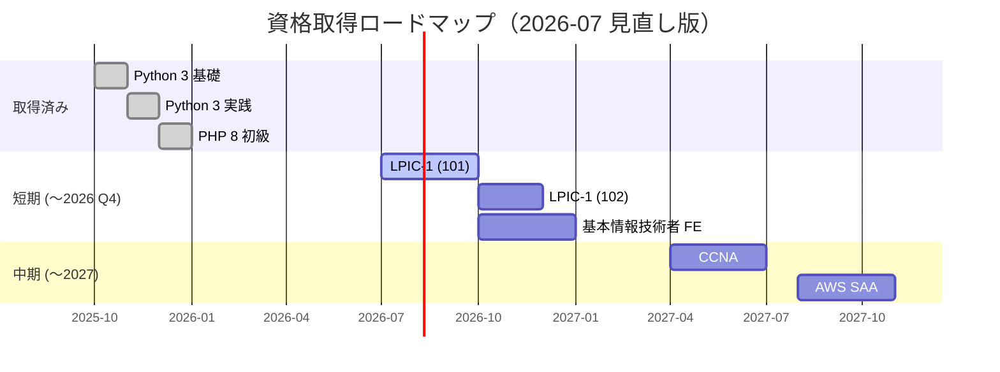

# 資格取得ロードマップ

> **本ドキュメントの位置付け**
>
> - 取得済み資格は **実績**
> - 取得計画・受験時期は **現時点での計画案** です。学習進捗・実務状況・最新の試験動向に応じて随時見直します
> - 「学習計画を立てる力」「優先順位を判断できる力」を示すことが目的です。そのため、**数を絞る判断・計画を変更した記録** も本文に残します

インフラ運用・社内 SE 補助としての専門性を裏付けるため、計画的に資格取得を進めます。

最終更新: 2026-07-12（試験制度の変わり目への対応：FE 前倒し / CCNA v2.0 注記 / SOA 名称更新 / AZ-802 追記）

---

## 計画の見直し記録

### 2026-07-12 見直し（試験制度の変わり目への対応）

2026〜2027 年に主要試験の制度変更が集中していることが分かったため、日程と表記を更新します。

| 変更 | 理由 |
| --- | --- |
| **FE の受験完了目標を「2026 Q4 - 2027 Q1」→「2026 年 12 月まで」へ前倒し** | 現行試験制度は 2026 年度実施をもって終了し、2027 年度から新試験制度へ移行予定。さらにシステムリプレースに伴い 2027 年 1 月頃から約 1 か月の CBT 休止が予定されている（IPA 発表）。休止・移行期を避け、教材・過去問が揃った現行制度のうちに受験を完了させる。LPIC-1 102 と学習が並走になるため、進捗が厳しい場合は「新制度移行後に回す」判断もあり得る（その場合は本記録に残す） |
| **CCNA に v2.0 切替の注記を追加**（受験予定は 2027 年前半のまま） | 2026-05-20 に Cisco が CCNA v2.0 を発表（試験コード 200-301 は不変のメジャー改定）。現行 v1.1 の最終受験日は 2027-02-02、v2.0 は 2027-02-03 開始。現計画の 2027 年 4 月着手は v2.0 初期に当たり日本語教材・問題集が薄い可能性があるため、着手時に「v1.1 で前倒し完了」か「v2.0 対応教材が揃うのを待つ」かを判断する |
| **AWS SOA の名称を CloudOps Engineer - Associate へ更新** | SysOps Administrator（SOA-C02）は 2025-09 に終了し、AWS Certified CloudOps Engineer - Associate（SOA-C03）へ改称・刷新されたため、最新の資格体系に追従 |
| **AZ-802（Windows Server Administrator Associate）を「就業後に検討」へ追加** | MCSA 廃止後に Windows Server + Active Directory スキルを証明する現行資格 AZ-800 / 801 が 2026-09-30 で廃止され、単一試験 AZ-802 へ統合される。国内 SIer / MSP では Windows Server 構築案件の比重が大きく、配属された場合の選択肢として追記（1 試験で済むため費用も旧体系の約半分） |
| **MD-102 の位置付けを明確化** | MD-102 はクライアント端末管理（Intune / Autopilot）の資格であり、サーバースキルの証明にはならない。社内 SE トラック専用の選択肢であることを明記し、サーバー系の証明は AZ-802 と役割分担する |

### 2026-07-03 見直し

計画も「変更管理」の対象と考え、変更内容と理由を記録します。

| 変更 | 理由 |
| --- | --- |
| LPIC-1 の受験時期を 2026 Q2-Q3 → **2026 Q3-Q4** へ後ろ倒し | 当初予定（6 月受験）に学習が追いつかなかったため。予定日を過ぎた計画を放置せず、実態に合わせて更新する |
| **基本情報技術者試験（FE）を「検討中」から日程化**（2026 Q4 - 2027 Q1） | 未経験採用の書類選考で最も広く通用する国家資格であり、「採用要件として求められることが多い」と自分でも書いていたのに時期未定だった優先順位の矛盾を解消。CBT 通年受験で着手障壁も低い |
| **CKAD / CKA / LPIC-2 / AWS SOA を「就業後に検討」へ降格** | 未経験 1 社目の選考ではほぼ評価されない一方、学習コストが大きい。転職活動期は LPIC-1 / FE の完走率を上げることに集中する |
| **ITIL 4 Foundation を「就業後に検討」へ移動** | 受験料が高額（約 6 万円）で、企業の団体受験・費用補助制度を利用できる可能性があるため、応募先の要件を見てから判断する。用語・概念の学習自体は先行して進める |
| 「Modern Desktop Administrator」の名称を **MD-102（Endpoint Administrator Associate）** に修正 | 旧資格は 2023 年に廃止済み。最新の資格体系に追従 |

---

## 取得済み

| 資格 | 取得時期 | 主な学習領域 |
| --- | --- | --- |
| Python 3 エンジニア認定基礎試験 | 公共職業訓練期間中 | 文法、組み込み型、関数、モジュール、標準ライブラリ |
| Python 3 エンジニア認定実践試験 | 公共職業訓練期間中 | 開発環境、ファイル / OS、テスト、デバッグ、デザイン |
| PHP 8 技術者認定初級試験 | 公共職業訓練期間中 | 文法、配列、文字列、関数、オブジェクト指向 |

---

## ロードマップ（転職活動期〜就業 1 年目）

日程を入れるのは上記 5 つまでに絞ります。それ以外は「就業後に検討」（後述）とし、配属領域が決まってから選択します。

---

## 短期目標（〜2026 Q4）

### LPIC-1（101 / 102）

| 項目 | 内容 |
| --- | --- |
| 目的 | Linux サーバー運用の体系的理解 |
| 受験予定 | 101: 2026 Q3、102: 2026 Q4 |
| 学習方法 | 公式教材 + Ping-t + 自作ラボ環境（Ubuntu / RHEL クローン）での実機演習 |
| 進捗の公開 | [#5 (101)](https://github.com/ns7jp/ns7jp/issues/5) / [#6 (102)](https://github.com/ns7jp/ns7jp/issues/6) に**週 1 回**、学習章・模試スコアを記録（進まなかった週もその旨を記録） |
| ポートフォリオ連動 | server-monitor リポジトリの構築・運用がそのまま学習教材になる |

### 基本情報技術者試験（FE）

| 項目 | 内容 |
| --- | --- |
| 目的 | IT 基礎知識の網羅性を国家資格で証明（非技術系の採用担当にも通じる、書類選考で最も汎用性の高い資格） |
| 受験予定 | 2026 Q4（**2026 年 12 月までに受験完了**。2026-07-12 見直しで前倒し） |
| 制度の変わり目 | 現行試験制度は 2026 年度で終了し 2027 年度から新制度へ移行予定。2027 年 1 月頃から約 1 か月の CBT 休止も予定されているため、現行制度のうちに受験する |
| 学習方法 | 過去問道場 + 参考書。**科目 B（アルゴリズム）は職業訓練の Python 学習がそのまま活きる** |
| ポートフォリオ連動 | セキュリティ・ネットワーク分野は server-monitor の設計と対応付けて学習 |

---

## 中期目標（〜2027）

### CCNA

| 項目 | 内容 |
| --- | --- |
| 目的 | ネットワーク基礎（OSI / TCP/IP / ルーティング / スイッチング / WLAN / 自動化）の体系化 |
| 受験予定 | 2027 年前半 |
| 試験改定 | 2026-05 に v2.0 が発表済み（現行 v1.1 の最終受験日 2027-02-02、v2.0 は 2027-02-03 開始）。着手時に「v1.1 で前倒し完了」か「v2.0 対応教材が揃うのを待つ」かを判断する（2026-07-12 見直し） |
| 学習方法 | Cisco 公式教材 + Packet Tracer での仮想構築 |
| ポートフォリオ連動 | [ネットワーク切り分け証跡](../evidence-capture-checklist.md)（dig / traceroute / tcpdump の一次メモ）を学習と並行して採録 |

### AWS Certified Solutions Architect - Associate (SAA)

| 項目 | 内容 |
| --- | --- |
| 目的 | クラウド設計の基礎（VPC / EC2 / RDS / S3 / IAM / 監視 / コスト最適化） |
| 受験予定 | 2027 年後半 |
| 学習方法 | AWS Skill Builder + 公式模擬試験 + AWS 無料利用枠での実機演習 |
| ポートフォリオ連動 | server-monitor を AWS 上に Terraform で再構築（[計画](../server-monitor-improvements/03-terraform-aws.md)） |

---

## 就業後に検討（配属領域に応じて選択）

転職活動期に日程を入れず、**就業後に業務との関連が明確になってから** 着手判断します。

| 資格 | 検討する条件 |
| --- | --- |
| LPIC-2 | Linux サーバー運用が主業務になった場合 |
| AWS CloudOps Engineer - Associate（旧 SysOps Administrator / SOA。2025-09 に SOA-C03 へ改称） | AWS 運用が主業務になった場合 |
| AZ-802（Windows Server Administrator Associate） | Windows Server / Active Directory 案件が主業務になった場合（AZ-800 / 801 は 2026-09-30 廃止。後継の AZ-802 は単一試験で費用も旧体系の約半分） |
| ITIL 4 Foundation | 応募先・就業先が ITSM プロセスを重視する場合（団体受験・費用補助があれば優先度を上げる。用語の学習は先行して継続） |
| CKAD / CKA | コンテナ基盤・Kubernetes を扱う部署に配属された場合（[K8s 発展計画](../server-monitor-improvements/08-kubernetes-roadmap.md) と連動） |

---

## 検討中（時期未定）

| 資格 | 検討理由 |
| --- | --- |
| 情報処理安全確保支援士（登録セキスペ） | 社内 SE として情報セキュリティ責任を担うため（FE → 応用情報の先の長期目標） |
| 応用情報技術者 | FE 合格後の次段階として |
| Microsoft 365 Certified: Endpoint Administrator Associate（MD-102） | 社内 SE で M365 / Intune を扱う場合に有効。**クライアント端末管理の資格でありサーバースキルの証明にはならない**ため社内 SE トラック専用（サーバー系の証明は AZ-802 が担当）。社内 SE トラックの応募比率が高くなれば優先度を上げる |
| Red Hat Certified System Administrator (RHCSA) | 実機重視の Linux 資格として LPIC を補完 |

---

## 学習ログ管理

学習進捗は GitHub の Issue で管理し、可視化します。

- **運用ルール**: 各 Issue へ**週 1 回**コメントで進捗を記録する。進まなかった週は「今週は進まず。理由: 〇〇」の 1 行を残す（記録が途切れないこと自体を証跡にする）
- Issue：資格ごとに作成、チェックリストで学習章 / 模試スコアを記録
- 受験予定日を過ぎた場合は、結果または延期理由を必ず記録して日程を更新する（本ページの「見直し記録」と連動）

### 公開中の学習ログ Issue

- [#5 LPIC-1 101](https://github.com/ns7jp/ns7jp/issues/5)（2026 Q3）
- [#6 LPIC-1 102](https://github.com/ns7jp/ns7jp/issues/6)（2026 Q4）
- [#7 ITIL 4 Foundation](https://github.com/ns7jp/ns7jp/issues/7)（就業後に検討へ変更。用語学習の記録に利用）

FE・CCNA 以降は、着手時に同じ形式で Issue を作成します。

---

## 関連ドキュメント

- [サーバー監視ラボ：改善設計の実装対応表](../server-monitor-improvements/README.md)
- [アーキテクチャ図（実装済み構成 / 検証境界）](../architecture-diagram.md)
- [証跡採録チェックリスト](../evidence-capture-checklist.md)
