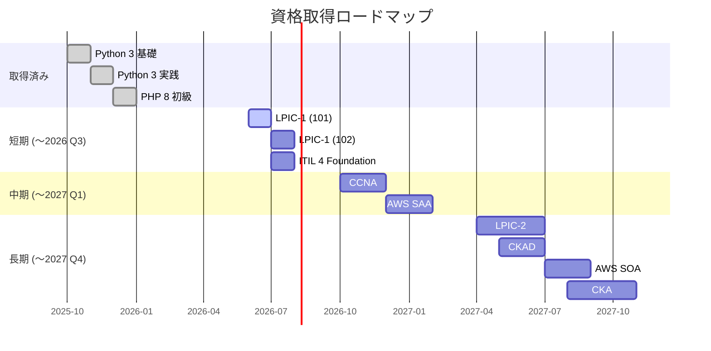

# 資格取得ロードマップ

> **本ドキュメントの位置付け**
>
> - 取得済み資格は **実績**
> - 取得計画・受験時期は **現時点での計画案** です。学習進捗・実務状況・最新の試験動向に応じて随時見直します
> - 「学習計画を立てる力」「優先順位を判断できる力」を示すことが目的です

インフラ運用・社内 SE 補助としての専門性を裏付けるため、計画的に資格取得を進めます。

---

## 取得済み

| 資格 | 取得時期 | 主な学習領域 |
| --- | --- | --- |
| Python 3 エンジニア認定基礎試験 | 公共職業訓練期間中 | 文法、組み込み型、関数、モジュール、標準ライブラリ |
| Python 3 エンジニア認定実践試験 | 公共職業訓練期間中 | 開発環境、ファイル / OS、テスト、デバッグ、デザイン |
| PHP 8 技術者認定初級試験 | 公共職業訓練期間中 | 文法、配列、文字列、関数、オブジェクト指向 |

---

## ロードマップ

---

## 短期目標（6 か月以内）

### LPIC-1（101 / 102）

| 項目 | 内容 |
| --- | --- |
| 目的 | Linux サーバー運用の体系的理解 |
| 受験予定 | 2026 年 6 〜 8 月 |
| 学習方法 | 公式教材 + Ping-t + 自作ラボ環境（Ubuntu / RHEL クローン）での実機演習 |
| ポートフォリオ連動 | server-monitor リポジトリの構築・運用がそのまま学習教材になる |

### ITIL 4 Foundation

| 項目 | 内容 |
| --- | --- |
| 目的 | サービスマネジメントの共通言語を獲得（インシデント・問題・変更管理） |
| 受験予定 | 2026 年 7 月 |
| 学習方法 | 公式書籍 + 模擬試験問題集 |
| ポートフォリオ連動 | ランブック・FAQ 設計に「ITIL の用語」で語れるようにする |

---

## 中期目標（1 年以内）

### CCNA

| 項目 | 内容 |
| --- | --- |
| 目的 | ネットワーク基礎（OSI / TCP/IP / ルーティング / スイッチング / WLAN / 自動化）の体系化 |
| 受験予定 | 2026 年 10 〜 12 月 |
| 学習方法 | Cisco 公式教材 + Packet Tracer での仮想構築 + Boson Exsim 模擬試験 |
| ポートフォリオ連動 | 自宅ラボ（VyOS / OpenWrt）でルーティング・VLAN 構築 |

### AWS Certified Solutions Architect - Associate (SAA)

| 項目 | 内容 |
| --- | --- |
| 目的 | クラウド設計の基礎（VPC / EC2 / RDS / S3 / IAM / 監視 / コスト最適化） |
| 受験予定 | 2026 年 12 月 〜 2027 年 2 月 |
| 学習方法 | AWS Skill Builder + 公式模擬試験 + AWS 無料利用枠での実機演習 |
| ポートフォリオ連動 | server-monitor を AWS 上に Terraform で再構築（[計画](../server-monitor-improvements/03-terraform-aws.md)） |

---

## 長期目標（2 年以内）

### LPIC-2

| 項目 | 内容 |
| --- | --- |
| 目的 | Linux のシステム管理者レベル（サービス、ストレージ、セキュリティ強化） |
| 受験予定 | 2027 年 4 〜 6 月 |

### AWS Certified SysOps Administrator - Associate (SOA)

| 項目 | 内容 |
| --- | --- |
| 目的 | 運用視点での AWS（監視、ログ、自動化、コスト管理） |
| 受験予定 | 2027 年 7 〜 8 月 |

### CKAD（Certified Kubernetes Application Developer）

| 項目 | 内容 |
| --- | --- |
| 目的 | Kubernetes 上でアプリを動かす基礎（Pod / Service / Deployment / Helm） |
| 受験予定 | 2027 年 5 〜 6 月 |
| 学習方法 | kind / minikube ローカル学習 + KodeKloud 実機演習 |
| ポートフォリオ連動 | server-monitor を Helm chart 化（[K8s 発展計画](../server-monitor-improvements/08-kubernetes-roadmap.md) Phase 1〜2） |

### CKA（Certified Kubernetes Administrator）

| 項目 | 内容 |
| --- | --- |
| 目的 | Kubernetes クラスタの構築・運用（kubeadm / RBAC / Networking / Storage） |
| 受験予定 | 2027 年 8 〜 10 月 |
| 学習方法 | KodeKloud + 自宅ラボでクラスタ構築演習、EKS 上での運用 |
| ポートフォリオ連動 | server-monitor on EKS（[K8s 発展計画](../server-monitor-improvements/08-kubernetes-roadmap.md) Phase 3〜4） |

---

## 検討中（時期未定）

| 資格 | 検討理由 |
| --- | --- |
| 情報処理安全確保支援士（登録セキスペ） | 社内 SE として情報セキュリティ責任を担うため |
| 基本情報技術者・応用情報技術者 | 知識の網羅性証明（採用要件として求められることが多い） |
| Microsoft 365 Certified: Modern Desktop Administrator | 社内 SE で M365 / Intune を扱う場合に有効 |
| Red Hat Certified System Administrator (RHCSA) | 実機重視の Linux 資格として LPIC を補完 |

---

## 学習ログ管理

学習進捗は GitHub の Issue / Projects で管理し、可視化します。

- Issue：資格ごとに作成、チェックリストで学習章 / 模試スコアを記録
- Projects：Kanban（学習中 / 受験予約済み / 合格）で全資格を一覧化
- Wiki：各資格の学習ノート（後輩・転職時の自分用）

---

## 関連ドキュメント

- [サーバー監視ラボ：改善計画一覧](../server-monitor-improvements/README.md)
- [アーキテクチャ図（現状 / 将来構想）](../architecture-diagram.md)
