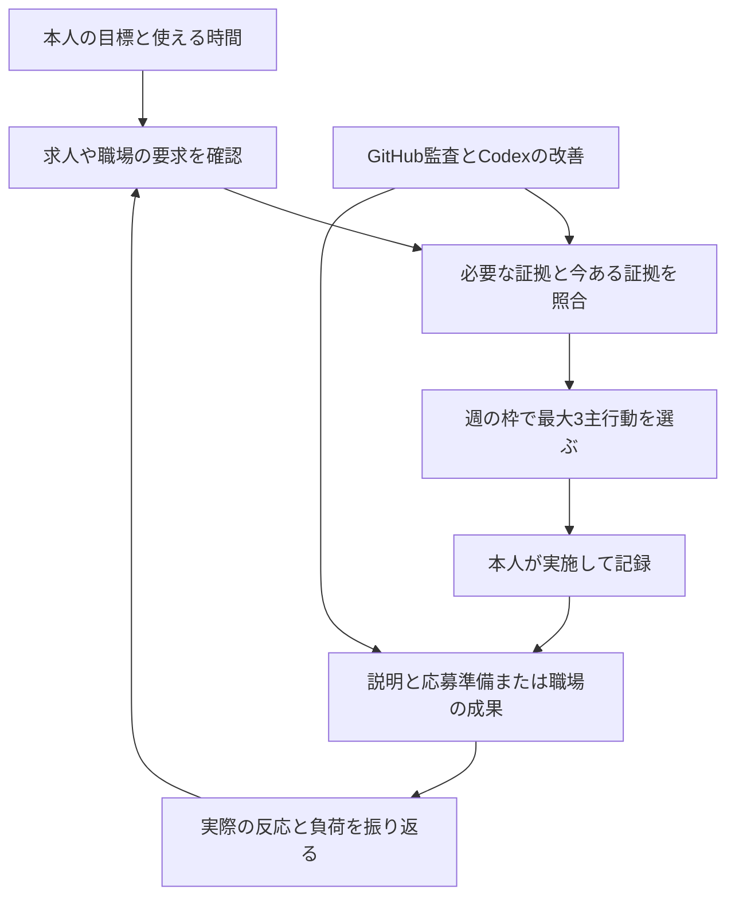

# サーバー構築職への就職・定着・継続成長をつなぐ

「繁栄」を、役に立つ技術を身につけ、実績を正しく伝え、合う仕事に就き、無理なく成果と選択肢を増やすこととして設計します。
当面の最優先は **サーバー構築職への就職・定着**、学習・作品改善・就職活動の合計上限は **週10時間**です。
これは2026-09-08の本人の選択です。現在の雇用状態、応募実績、内定、収入、技能合格を示すものではありません。

## 最初の一歩

1. [週次運用](operation.md)で、使える時間・今ある約束・必要な本人判断を確認する。
2. [求人選びと応募準備](job-search.md)で、希望条件と求人の要求を整理する。
3. [私用台帳の操作](tool-guide.md)で週10時間の計画を作る。初回は実施結果を空のままにする。
4. 生成された最大3つの主行動から着手し、実際に行ったことだけを[記録票](templates.md)へ残す。
5. 就職後は[定着と担当範囲の拡張](onboarding.md)へ。業務時間や生活の変化に合わせ、週10時間を見直す。

## 既存の仕組みをどう使うか

| 確認したいこと | 正本 | この仕組みが追加するもの |
| --- | --- | --- |
| 何ができるようになったか | [SEの8段階32条件](../server-engineer/README.md) | 求人・配属先の要求から次の条件へつなぐ |
| 一件の仕事をどう進めるか | [PJの案件運用](../server-projects/README.md)または所属先の業務台帳 | 個人の週次配分に必要な参照だけを持つ |
| ポートフォリオの弱点 | [GitHub週次監査](../portfolio-automation/weekly-operation.md) | 応募準備・説明練習・定着への影響を判断する |
| 技術面談でどう説明するか | [30秒・3分説明](../portfolio-explanation.md) | 実際に問われた問いを次の練習へ戻す |
| 入社後の担当と承認 | [職場への接続](../server-engineer/workplace.md) | 面談・フィードバック・時間の再配分をつなぐ |
| 専門性をどう広げるか | [既存のBR/BX発展課題](../server-engineer/advanced/README.md) | 実際の不足から四半期に1テーマ選ぶ |

SEの合格、案件の承認、応募状態を新しい独自スコアへ変換しません。
学習台帳・案件台帳は既存CLIが検査した結果を参照し、このシステムから合格を書き込みません。
キャリア台帳に新しく持つのは、**機会、確認日、次の行動、期限、時間配分、本人の記録への参照**です。

## 一巡の流れ

## 初週の配分例

| 行動 | 時間 | 残すもの |
| --- | --- | --- |
| 証拠を整理して次の実測を一つに絞る | 3時間 | 正本、環境、本人の実施範囲、未実施、次の実施カード |
| 希望条件と公式求人を3件まで比較 | 1.5時間 | 必須・歓迎・未確認と本人の条件の対応 |
| 実記録で3分説明を練習 | 1時間 | 説明できた範囲、詰まった問い、次の練習 |
| 振り返りと翌週の調整 | 1時間 | 実施・未実施、負荷、次の一手 |
| 余白 | 2時間 | 割込みや見積違いに備える |
| 未配分 | 1.5時間 | 無理に埋めない |

3時間の証拠整理は3時間で実機構築を終える約束ではありません。
必要な試験を短縮せず、一つの完了条件を意味のある作業へ分けます。
既存SE教材の週10時間に、この就職活動10時間を上乗せしません。全体で10時間です。

## 自律的に進める範囲

Codexは毎週、最新の原本を読む、公開情報から候補を調べる、説明や改善の下書きを作る、
コード・文書をローカルで改善する、検証する、次の本人行動を絞る、という作業を進めます。
本人の理解、実操作、応募先の選択、職場での相談・承認は本人と関係者の実際の記録が必要です。

応募送信、企業・知人への連絡、アカウント登録、応募書類の外部共有、契約・金銭・実機操作は自動実行しません。
GitHub公開は具体的な差分と検証を提示し、既存の許可範囲に従います。
採用・定着・収入増加は外部の判断と実際の活動にも依存するため、この仕組みで達成を保証しません。

[詳細な週次運用](operation.md) / [CLIと状態の仕様](tool-guide.md) / [本人用の記録票](templates.md) / [一次資料と設計の根拠](sources.md) / [検証範囲](validation.md)
