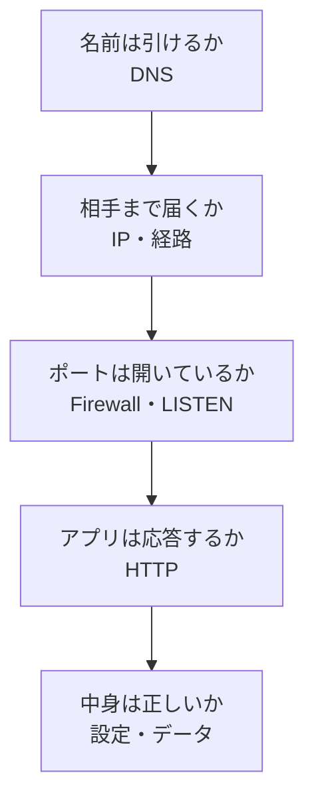
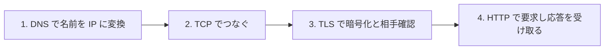
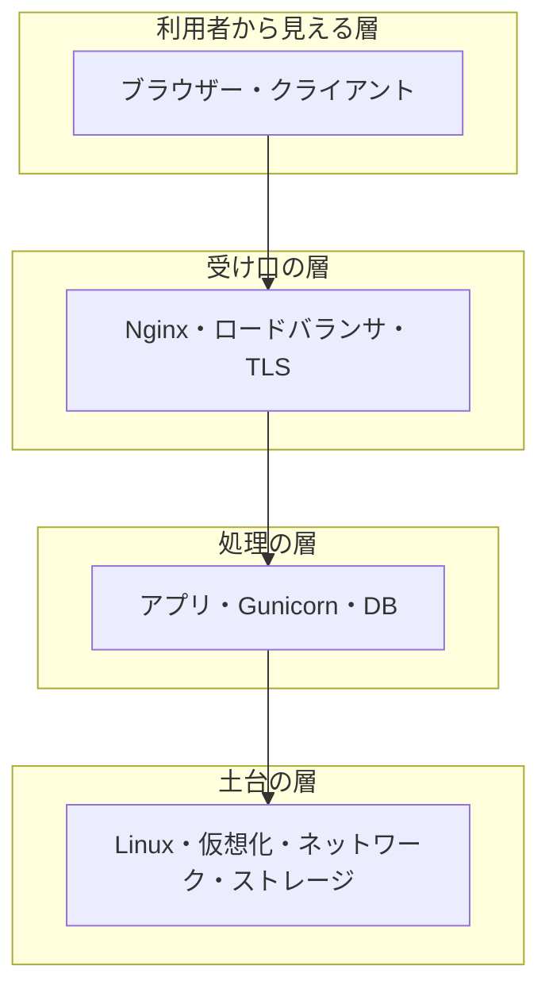

# IT 基礎用語集（初心者向け）

このページは、未経験からサーバー構築エンジニアを目指す人が、**現場で飛び交う言葉を「意味・たとえ・使いどころ」の3点で覚える**ための保存版リファレンスです。約 300 語を 20 の分野に分け、初心者がつまずきやすい違いや、実際にどのコマンドで確かめられるかまで書いています。

このリポジトリには目的の違う3つの入口があります。用語の意味そのものを引きたいときは、このページを開いてください。

| ページ | 目的 | 使うとき |
| --- | --- | --- |
| [やさしい用語・見方ガイド](./beginner-guide.md) | 主作品 `server` の構成と役割を理解する | 「この作品は何をしているのか」を知りたいとき |
| **IT 基礎用語集（このページ）** | IT・サーバーの言葉を分野ごとに体系的に覚える | 「この単語は何のことか」を引きたいとき |
| [Linux コマンド集](./linux-commands.md) / [Windows コマンド集](./windows-commands.md) | 目的からコマンドを逆引きする | 「どう操作するか」を調べたいとき |

## このページの使い方

用語は、辞書の文をそのまま暗記しても身につきません。次の**3点セット**で覚えると、面接でも現場でも使える言葉になります。

1. **ひとことの意味**：15 字前後で言い切る。長い説明は後回しにする
2. **たとえと注意**：身近なものにたとえる。同時に「たとえのどこが実物と違うか」も覚える
3. **使いどころ**：サーバー構築のどの場面で出てくるかを1つ思い浮かべる

各章の表は、この3点に対応した4列で構成しています。

| 列 | 何が書いてあるか |
| --- | --- |
| 用語 | 日本語表記・カタカナ表記 |
| 読み方・英語 | 読み間違えやすい語の読みと、語源になった英語 |
| ひとことの意味 | まずこれだけ覚える短い定義 |
| 覚え方と注意 | たとえ、対になる用語、初心者がつまずきやすい点 |

**大切な前提**：用語の意味は文脈で変わります。たとえば「サーバー」は役割・ソフトウェア・機器のいずれも指します。会話で食い違いを感じたら、**「今どの意味で使っていますか」と確認する**ことが、暗記よりも実務的です。製品名を並べて言えることより、**役割を自分の言葉で説明できること**を目標にしてください。

## 目次

| 章 | 分野 | 主に出てくる場面 |
| --- | --- | --- |
| [0](#0-まず覚える20語) | まず覚える20語 | 最初の1週間 |
| [1](#1-コンピューターとサーバーの基本) | コンピューターとサーバーの基本 | 機器選定・設置 |
| [2](#2-osとlinuxの基本) | OSとLinuxの基本 | OS 導入・初期設定 |
| [3](#3-ファイルとディレクトリと権限) | ファイルとディレクトリと権限 | 設定ファイル操作 |
| [4](#4-プロセスとサービス) | プロセスとサービス | 起動・停止・調査 |
| [5](#5-ネットワークの基本) | ネットワークの基本 | 疎通確認・切り分け |
| [6](#6-名前解決とwebの通信) | 名前解決とWebの通信 | 公開・TLS 設定 |
| [7](#7-webシステムの構成) | Webシステムの構成 | 設計・負荷分散 |
| [8](#8-仮想化とコンテナとクラウド) | 仮想化とコンテナとクラウド | 検証環境・基盤選定 |
| [9](#9-構築の自動化と構成管理) | 構築の自動化と構成管理 | Ansible・Terraform |
| [10](#10-監視とログと可観測性) | 監視とログと可観測性 | 監視設計・障害検知 |
| [11](#11-セキュリティと認証) | セキュリティと認証 | 公開前の防御設定 |
| [12](#12-ストレージとバックアップと可用性) | ストレージとバックアップと可用性 | 設計・復旧試験 |
| [13](#13-障害対応と運用の指標) | 障害対応と運用の指標 | 障害対応・報告 |
| [14](#14-バージョン管理とデプロイの自動化) | バージョン管理とデプロイの自動化 | Git・CI |
| [15](#15-データベースの基本) | データベースの基本 | DB を含む構成 |
| [16](#16-単位と数値の読み方) | 単位と数値の読み方 | 性能・容量の判断 |
| [17](#17-略語早見表) | 略語早見表 | 読めない略語が出たとき |
| [18](#18-まちがえやすい用語の対比) | まちがえやすい用語の対比 | 復習・面接対策 |
| [19](#19-覚え方のコツ) | 覚え方のコツ | 学習が続かないとき |
| [20](#20-理解度セルフチェック) | 理解度セルフチェック | 章を読み終えたあと |

## 0. まず覚える20語

最初から全部を読む必要はありません。**この 20 語を「ひとことの意味」で言えるようになる**ことが最初の目標です。ここが土台になり、他の用語はこの 20 語の周りに付いていきます。

| 用語 | ひとことの意味 | これだけは押さえる |
| --- | --- | --- |
| サーバー | 要求に応えて情報や機能を返す側 | 役割・ソフト・機器のどれを指すかは文脈で決まる |
| クライアント | 要求する側 | ブラウザーは代表的なクライアント |
| OS | 機器とソフトの間をとりもつ基本ソフト | サーバーでは Linux が主流 |
| Linux | サーバーで広く使われる OS の系統 | 配布形態（ディストリビューション）が複数ある |
| プロセス | 実行中のプログラム1つ分 | 「動いているか」はプロセスの有無で確かめる |
| ポート | 同じ機器の中でサービスを区別する番号 | 住所（IP）の中の部屋番号 |
| IP アドレス | ネットワーク上の住所にあたる番号 | 機器ではなくネットワーク接続口に付く |
| DNS | 名前と IP アドレスを対応づける仕組み | 「つながらない」の原因になりやすい |
| HTTP | Web の要求と応答の約束事 | 応答には状態を示す3桁の番号が付く |
| TLS | 通信を暗号化し相手を確認する仕組み | HTTPS は HTTP を TLS で守ったもの |
| ファイアウォール | 通す通信と通さない通信を決める仕組み | 開けた覚えのないポートは閉じておく |
| パーミッション | ファイルを誰が読み書き実行できるかの設定 | 緩めれば動くが、緩めた分だけ危険になる |
| root | Linux の管理者権限 | 常用しない。必要なときだけ `sudo` で使う |
| パッケージ | ソフトを導入・更新できる形にまとめたもの | 導入元（リポジトリ）と版を記録する |
| ログ | いつ何が起きたかの記録 | 障害調査の一次資料 |
| メトリクス | 時刻と結び付いた数値 | 傾向は分かるが、原因は確定しない |
| 冗長化 | 壊れても続けられるよう予備を持つこと | バックアップとは目的が違う |
| バックアップ | 別の場所に取っておく複製 | 戻せることを試して初めて価値が出る |
| 仮想化 | 1台の機器の上に複数の環境を作る技術 | 学習用の壊せる環境が作れる |
| コンテナ | OS を共有しつつアプリを分離して動かす仕組み | 仮想マシンより軽いが、独立した PC ではない |

**確認の仕方**：この表を隠して、20 語それぞれを 15 秒で説明してみます。詰まった語がある章から読み進めてください。

## 1. コンピューターとサーバーの基本

サーバーは特別な魔法の箱ではなく、**普通のコンピューターと同じ部品でできています**。違うのは「人が横で操作せず、要求に応え続ける役割を持つ」ことと、そのために**壊れにくさと連続稼働を重視した作り**になっていることです。まず部品の役割を押さえると、後で出てくる「CPU 使用率が高い」「メモリが足りない」という話が具体的に理解できます。

| 用語 | 読み方・英語 | ひとことの意味 | 覚え方と注意 |
| --- | --- | --- | --- |
| ハードウェア | hardware | 機器そのもの。触れる部分 | 「硬い=物理」。故障は交換が必要 |
| ソフトウェア | software | 機器を動かす命令の集まり | 「柔らかい=書き換えられる」 |
| CPU | シーピーユー / Central Processing Unit | 計算と処理を行う中心部品 | 頭脳。速さは処理性能に直結する |
| コア | core | CPU の中で実際に処理を行う単位 | 「4コア=同時に4つの作業台」 |
| スレッド | thread | 処理の流れ1本分。1コアで複数扱える場合がある | 作業台1つで2人が交代する状態に近い |
| クロック周波数 | clock / GHz | CPU が1秒あたりに刻む回数 | 数字が大きいほど速いが、コア数や世代でも変わる |
| メモリ | memory / RAM | 処理中のデータを一時的に置く場所 | 作業机の広さ。電源を切ると消える |
| ストレージ | storage | データを保存し続ける場所 | 引き出し。電源を切っても残る |
| HDD | ハードディスク | 円盤を回して記録する保存装置 | 安価で大容量。速度は SSD に劣る |
| SSD | エスエスディー | 半導体で記録する保存装置 | 速いが容量あたりの単価は高い |
| NIC | ニック / Network Interface Card | ネットワークにつなぐ部品 | ここに IP アドレスが割り当てられる |
| マザーボード | motherboard | 各部品をつなぐ基板 | 拡張性の上限を決める |
| BIOS / UEFI | バイオス / ユーエフアイ | 電源投入直後に機器を初期化する仕組み | OS が動く前の世界。起動順の設定はここ |
| ファームウェア | firmware | 機器に組み込まれた制御ソフト | 更新できるが、失敗すると機器が起動しなくなる |
| ドライバー | driver | OS が周辺機器を扱うための橋渡しソフト | 「認識しない」ときの容疑者 |
| ラックマウント型 | rack mount | ラックに収める横長のサーバー機 | 高さを `U`（ユー）で数える。1U=約 4.45cm |
| ブレードサーバー | blade | 共通の筐体に薄い機器を差して集約する形 | 高密度だが専用筐体に依存する |
| データセンター | data center | サーバーを預けて動かす専用施設 | 電源・空調・回線・入退室管理が備わる |
| オンプレミス | on-premises | 自社の設備でサーバーを持つ形態 | 「オンプレ」。クラウドと対で覚える |
| クラウド | cloud | 事業者の設備を借りて使う形態 | 手元に機器はないが、設定責任は残る |
| 冗長電源 | redundant power | 電源装置を2台以上持つ構成 | 1台壊れても止まらない。予備であって節電ではない |
| ホスト | host | ネットワークにつながった1台のコンピューター | 「ホスト側」「ゲスト側」は仮想化で頻出 |
| アーキテクチャ | architecture | CPU の命令の方式。x86_64 や ARM など | 対応しないソフトは動かない。導入前に確認する |
| 64bit | ロクヨンビット | 一度に扱えるデータ幅が 64 の方式 | 大容量メモリを扱える。現在のサーバーの標準 |
| IPMI / iLO / iDRAC | アイピーエムアイ など | OS が落ちていても遠隔で電源操作できる管理機能 | 「遠隔の電源ボタン」。管理用ネットワークを分ける |
| KVM スイッチ | ケーブイエム | 1組の画面・キーボードを複数機器で切り替える装置 | 仮想化技術の KVM とは別物。混同注意 |

### もう少し詳しく

**CPU・メモリ・ストレージの関係**は、料理に例えると理解しやすくなります。CPU は料理人、メモリは調理台、ストレージは冷蔵庫です。冷蔵庫（ストレージ）から材料を調理台（メモリ）に出し、料理人（CPU）が処理します。調理台が狭い（メモリ不足）と、材料を出し入れする回数が増えて全体が遅くなります。Linux ではこの「一時的に退避する場所」を**スワップ**と呼び、スワップが多発しているときは調理台が足りていない状態です。

ただしこのたとえは、料理人が同時に複数の作業をこなす点（マルチコア・マルチタスク）や、よく使う材料を手元に置く**キャッシュ**の存在を省略しています。数値で確かめるときは `free -h`（メモリの空き）、`top`（CPU 使用率）、`df -h`（ストレージの空き）を使います。詳しくは[Linux コマンド集](./linux-commands.md)を参照してください。

**サーバー機と一般 PC の違い**は、性能そのものより「壊れにくさ」と「止めない工夫」にあります。電源やディスクを二重化し、ECC メモリ（誤りを訂正するメモリ）を使い、遠隔管理の口を持ちます。学習段階では一般 PC 上の仮想マシンで十分で、この違いは「なぜ本番機は高いのか」を説明するときに使います。

### この章のつまずきポイント

- **「サーバーを買う」＝「高性能な PC を買う」ではありません**。連続稼働・保守契約・遠隔管理まで含めた選定です
- **メモリとストレージの混同**は初心者に非常に多い誤りです。「消えるのがメモリ、残るのがストレージ」と対で覚えます
- **`U`（ユー）はラックの高さの単位**で、性能とは無関係です

## 2. OSとLinuxの基本

OS はハードウェアとアプリの間に立ち、**「誰にどれだけ資源を使わせるか」を調整する管理役**です。サーバーでは Linux が主流で、その理由は無償で使える版があること、遠隔から文字だけで操作できること、同じ設定を自動で再現しやすいことにあります。ここでは Linux を触るときに毎回出てくる言葉をまとめます。

| 用語 | 読み方・英語 | ひとことの意味 | 覚え方と注意 |
| --- | --- | --- | --- |
| OS | オーエス / Operating System | 機器とソフトを仲介する基本ソフト | 資源の配分役。アプリは OS 越しに機器を使う |
| カーネル | kernel | OS の中核。資源配分と機器制御を担う部分 | 「核」。Linux とは本来このカーネルを指す |
| ディストリビューション | distribution | カーネルと道具一式をまとめた配布形態 | 「ディストリ」。Ubuntu などは全部これ |
| Debian 系 | デビアン | Debian をもとにした系統。Ubuntu を含む | パッケージ管理は `apt` |
| RHEL 系 | レル | Red Hat Enterprise Linux 系統 | AlmaLinux・Rocky Linux など。管理は `dnf` |
| Ubuntu | ウブントゥ | 入門者にも情報が多い Debian 系 OS | 学習環境の定番 |
| LTS | エルティーエス / Long Term Support | 長期間サポートされる版 | サーバーでは原則 LTS を選ぶ |
| シェル | shell | 入力したコマンドを解釈して実行するプログラム | 「殻」。既定は `bash` が多い |
| ターミナル | terminal | 文字で操作するための画面 | シェルを表示する窓。シェル本体とは別 |
| CLI | シーエルアイ | 文字で操作する方式 | 手順を記録・再現しやすい |
| GUI | グイ / ジーユーアイ | 画面上の絵と操作で扱う方式 | 直感的だが、遠隔・自動化に不向き |
| プロンプト | prompt | 入力待ちを示す表示。`$` や `#` | `#` は root で操作中の合図 |
| 環境変数 | environment variable | シェルやプログラムが参照する設定値 | `echo $PATH` で中身を見る |
| PATH | パス | コマンドを探しに行く場所の一覧 | 「command not found」の主犯 |
| パッケージ管理 | package manager | ソフトの導入・更新・削除を一元管理する仕組み | `apt` / `dnf`。手動配置より追跡しやすい |
| リポジトリ | repository | パッケージの配布元 | 出所が信頼できるかを必ず確認する |
| 依存関係 | dependency | あるソフトが動くために必要な別のソフト | 勝手に消すと別のソフトが壊れる |
| systemd | システムディー | サービスの起動・停止・自動起動を管理する仕組み | 現在の Linux の標準。操作は `systemctl` |
| ユニット | unit | systemd が管理する対象1つ分の定義 | `.service` `.timer` `.socket` など |
| ターゲット | target | 到達したい状態をまとめたもの | 古い「ランレベル」の考え方の後継 |
| journald | ジャーナルディー | systemd のログ収集の仕組み | `journalctl` で読む |
| cron | クロン | 決まった時刻に処理を実行する仕組み | 「時計仕掛け」。systemd timer でも代替できる |
| ファイルシステム | file system | ディスク上でファイルを管理する方式 | `ext4` `xfs` など。作り直すと中身は消える |
| マウント | mount | 記憶領域をディレクトリに割り当てて使えるようにすること | 「棚を家の一室として使えるようにする」 |
| パーティション | partition | ディスクを区切った領域 | 区切り方は後から変えにくい。設計時に決める |
| スワップ | swap | メモリが不足したとき退避に使うディスク領域 | 保険であって増設の代わりではない |
| sysctl | シスコントロール | カーネルの動作設定を変更する仕組み | 一時変更と恒久設定（設定ファイル）は別 |
| dmesg | ディーメッセージ | カーネルが出す起動・機器のメッセージ | 機器やドライバーの異常が出る |
| ロケール | locale | 言語・文字・日付表記の設定 | 文字化けの原因になる。`UTF-8` が基本 |
| タイムゾーン | time zone | 時刻の地域設定 | **ログの時刻がずれる最大の原因**。全台そろえる |
| NTP | エヌティーピー | 時刻を自動的に合わせる仕組み | 時刻ずれはログ突合を不可能にする |
| ホスト名 | hostname | その機器に付ける名前 | 作業前に必ず確認。**別の機器を操作する事故を防ぐ** |
| OSS | オーエスエス / Open Source Software | ソースコードが公開されたソフト | 無償とは限らない。ライセンス条件を読む |

### 主なディレクトリの役割

Linux では「置き場所」に意味があります。設定ファイルを探すとき、この対応を知っていれば当てずっぽうに探さずに済みます。

| 場所 | 何が置かれるか | よく開くもの |
| --- | --- | --- |
| `/etc` | 設定ファイル | `/etc/hosts`、`/etc/ssh/sshd_config`、`/etc/nginx/` |
| `/var/log` | ログ | `syslog`、`nginx/access.log` |
| `/home` | 一般ユーザーの作業場所 | 自分の作業ファイル |
| `/root` | root 専用の作業場所 | 通常は使わない |
| `/usr` | 導入されたプログラム本体 | `/usr/bin` の各コマンド |
| `/tmp` | 一時ファイル | 再起動で消える前提で使う |
| `/opt` | 追加ソフトの置き場 | 手動導入した製品 |
| `/proc`、`/sys` | カーネルが見せる現在の状態 | 実体のあるファイルではない |

**覚え方**：`etc` は「設定（エトセトラではなく設定置き場と割り切る）」、`var` は「変わるもの（variable）＝ログや一時データ」、`usr` は「導入済みプログラム（user ではなく unix system resources 由来）」。この3つだけで日常の 8 割はカバーできます。

### この章のつまずきポイント

- **Linux とディストリビューションの混同**：「Linux を入れる」と言うとき、実際に入れているのは Ubuntu や AlmaLinux などの配布形態です
- **`apt update` と `apt upgrade` の違い**：`update` は一覧の更新だけで、実体は更新されません（[Linux コマンド集](./linux-commands.md)に詳細があります）
- **タイムゾーンの不一致**：監視・ログ・アプリで時刻がずれると、障害の順序が追えなくなります。**構築の初期に統一する**のが鉄則です

## 3. ファイルとディレクトリと権限

Linux では**設定もログもデバイスもファイルとして扱われます**。したがって「ファイルの場所・中身・誰が触れるか」を扱えることが、そのままサーバー操作の基礎になります。特に権限は、緩めれば動くが危険が増すという性質を持つため、意味を理解せずコピーした設定を貼るのが最も危険です。

| 用語 | 読み方・英語 | ひとことの意味 | 覚え方と注意 |
| --- | --- | --- | --- |
| ディレクトリ | directory | ファイルを入れる入れ物 | Windows の「フォルダ」とほぼ同義 |
| 絶対パス | absolute path | `/` から書いた完全な道順 | どこから実行しても同じ場所を指す |
| 相対パス | relative path | 今いる場所からの道順 | 実行場所が変わると別の場所を指す |
| ルートディレクトリ | root directory | 一番上の `/` | 管理者の root とは別。文脈で区別する |
| ホームディレクトリ | home directory | ユーザー個人の作業場所。`~` で表す | 通常はここで作業する |
| 隠しファイル | dot file | `.` で始まるファイル | `ls -a` を付けないと見えない |
| 拡張子 | extension | 名前の末尾の `.conf` など | **Linux では単なる慣習**で、種類の決定はしない |
| inode | アイノード | ファイルの管理情報の番号 | 容量が空いていても inode 枯渇で書けないことがある |
| シンボリックリンク | symbolic link | 別の場所を指す道しるべ | Windows のショートカットに近い |
| ハードリンク | hard link | 同じ実体を指す別名 | 元を消しても実体は残る点が異なる |
| パーミッション | permission | 読み・書き・実行の許可設定 | `r`=読む、`w`=書く、`x`=実行する |
| 所有者 | owner | そのファイルを所有するユーザー | `ls -l` の3列目 |
| グループ | group | 権限をまとめて与える単位 | `ls -l` の4列目 |
| その他 | others | 所有者でもグループでもない全員 | ここを緩めるのが最も危険 |
| umask | ユーマスク | 新規作成時に権限を差し引く既定値 | `022` なら新規ファイルは `644` |
| sudo | スードゥー | 一時的に管理者権限で実行する仕組み | 誰が何をしたかがログに残る |
| root | ルート | 制限のない管理者ユーザー | 常用しない。**取り返しのつかない操作ができる** |
| setuid | セットユーアイディー | 実行時に所有者の権限で動く設定 | 不用意に付けると権限昇格の穴になる |
| ACL | エーシーエル | 標準の3区分より細かい権限設定 | 使うなら設計と記録が必須 |
| 標準入力 | stdin | プログラムへの入力の既定の口 | 番号は `0` |
| 標準出力 | stdout | 通常の出力先 | 番号は `1` |
| 標準エラー出力 | stderr | エラーの出力先 | 番号は `2`。`2>&1` で統合できる |
| リダイレクト | redirect | 出力先をファイルなどへ変える | `>` は上書き、`>>` は追記 |
| パイプ | pipe | 出力を次のコマンドの入力に渡す | 記号は縦棒。「流れ作業」で覚える |
| 文字コード | character encoding | 文字を数値で表す方式 | `UTF-8` が基本。混在で文字化けする |
| 改行コード | line ending | 行の終わりを表す符号 | Linux は `LF`、Windows は `CRLF` |
| アーカイブ | archive | 複数ファイルを1つにまとめたもの | `tar`。圧縮とは本来別の処理 |
| 圧縮 | compression | 容量を小さくすること | `gzip` など。展開して初めて使える |

### パーミッションの読み方

`ls -l` の先頭に出る `-rwxr-xr--` は、3文字ずつ3組に分けて読みます。

| 位置 | 対象 | `rwxr-xr--` の場合 |
| --- | --- | --- |
| 1文字目 | 種類 | `-` はファイル、`d` はディレクトリ、`l` はリンク |
| 2〜4文字目 | 所有者 | `rwx` = 読み・書き・実行すべて可 |
| 5〜7文字目 | グループ | `r-x` = 読みと実行のみ |
| 8〜10文字目 | その他 | `r--` = 読みのみ |

数値表記は `r`=4、`w`=2、`x`=1 を足した値です。よく使う組み合わせだけ覚えれば十分です。

| 数値 | 記号 | 主な用途 |
| --- | --- | --- |
| `755` | `rwxr-xr-x` | 実行できるファイル、公開ディレクトリ |
| `644` | `rw-r--r--` | 通常の設定ファイル・HTML |
| `600` | `rw-------` | 本人しか読めない情報。**秘密鍵はこれ** |
| `700` | `rwx------` | 本人専用のディレクトリ |
| `777` | `rwxrwxrwx` | **誰でも書き換え可能。原則使わない** |

**注意**：「動かないから `777` にする」は、原因を消さずに危険だけを増やす対処です。多くの場合、正しい対処は所有者・グループを合わせること（`chown`）です。SSH の秘密鍵は権限が緩いと、そもそも接続を拒否されます。

### この章のつまずきポイント

- **ディレクトリの `x`** は「中に入れる（通過できる）」という意味で、実行ファイルの `x` とは意味が違います
- **相対パスのままで手順書を書く**と、実行者の場所によって結果が変わります。手順書は絶対パスで書きます
- **`rm` に取り消しはありません**。実行前に `ls` で対象を確認する習慣をつけます

## 4. プロセスとサービス

「サーバーが動いている」とは、多くの場合**必要なプロセスが起動し、決めたポートで待ち受けている**状態を指します。障害対応では「落ちているのか、遅いのか、待ち受けていないのか」を切り分ける必要があり、その言葉がこの章に集まっています。

| 用語 | 読み方・英語 | ひとことの意味 | 覚え方と注意 |
| --- | --- | --- | --- |
| プログラム | program | ディスク上に置かれた命令の集まり | まだ動いていない状態 |
| プロセス | process | 実行中のプログラム1つ分 | 同じプログラムから複数のプロセスができる |
| PID | ピーアイディー | プロセスに付く番号 | 再起動すると変わる。固定値ではない |
| 親プロセス | parent process | 別のプロセスを起動した側 | 親を止めると子も影響を受ける |
| デーモン | daemon | 常駐して要求を待ち続けるプロセス | 末尾の `d`（`sshd` `nginxd` 等）が目印 |
| サービス | service | systemd が管理する常駐処理の単位 | 「デーモンを管理単位で呼んだ名前」 |
| フォアグラウンド | foreground | 画面を占有して実行する状態 | 終了すると処理も止まる |
| バックグラウンド | background | 画面を離しても続く実行状態 | `&` を付けて起動する |
| シグナル | signal | プロセスへ送る短い指示 | 停止・再読込などの合図 |
| SIGTERM | シグターム | 終了処理をしてから止まるよう促す信号（15） | **まずこれ**。片付けの時間を与える |
| SIGKILL | シグキル | 強制的に止める信号（9） | 最終手段。データが壊れる可能性がある |
| SIGHUP | シグハップ | 設定の再読込に使われることが多い信号（1） | サービス無停止で設定を反映できる場合がある |
| ゾンビプロセス | zombie | 終了したのに親が回収していない状態 | 資源はほぼ使わないが、増え続けるなら親側の異常 |
| ロードアベレージ | load average | 実行待ちを含む処理待ち行列の平均 | **CPU 使用率とは別物**。コア数と比べて読む |
| CPU 使用率 | CPU usage | CPU が働いている時間の割合 | 100% でも「異常」とは限らない |
| メモリ使用率 | memory usage | メモリの使用割合 | Linux はキャッシュで多く見える。`available` を見る |
| OOM Killer | オーオーエムキラー | メモリ枯渇時にプロセスを強制終了する機能 | 「勝手に落ちた」の典型原因。ログに残る |
| ulimit | ユーリミット | 1ユーザー・プロセスあたりの上限設定 | ファイル数上限に当たると接続を受けられなくなる |
| cgroup | シーグループ | プロセス群の資源使用を制限する仕組み | コンテナの土台技術 |
| 待ち受け | listen | 特定ポートで接続を受け付けている状態 | 起動していても待ち受けていない場合がある |
| ソケット | socket | 通信の出入り口を表す仕組み | IP とポートの組で識別する |
| systemctl | システムシーティーエル | サービスを操作するコマンド | `start` `stop` `status` `restart` |
| enable | イネーブル | OS 起動時に自動で開始する設定 | **start とは別**。再起動で消える設定事故の元 |
| reload | リロード | 停止せずに設定を読み直す操作 | 対応していないサービスもある |
| グレースフルリスタート | graceful restart | 処理中の要求を落とさず入れ替える再起動 | 「そっと交代する」 |
| ヘルスチェック | health check | 生きているかを定期的に確かめる仕組み | 応答したことしか保証しない |
| タイムアウト | timeout | 待つ時間の上限 | 短すぎると誤検知、長すぎると気づけない |
| 常駐 | resident | 動き続けている状態 | 常駐と自動起動は別の話 |

### 状態を確かめる順番

障害時は、思いつきで再起動する前に、次の順で確認すると原因の範囲が絞れます。

| 確認したいこと | 使うコマンドの例 | 何が分かるか |
| --- | --- | --- |
| プロセスの有無 | `systemctl status <名前>` / `ps aux` | 起動しているか、直前に落ちたか |
| 待ち受けの有無 | `ss -ltnp` | どのポートを誰が握っているか |
| 応答の有無 | `curl -I http://127.0.0.1:8080/` | 応答コードが返るか |
| 直近の出来事 | `journalctl -u <名前> -n 50` | 停止理由や設定エラー |
| 資源の状況 | `top` / `free -h` / `df -h` | CPU・メモリ・容量の逼迫 |

**再起動を最初にやらない理由**は、再起動によって症状が消え、原因の証拠まで消えてしまうためです。急いで復旧が必要な場合でも、ログの取得だけは先に行います。

### この章のつまずきポイント

- **`start` と `enable` の混同**：`start` は今動かす、`enable` は次回起動時も動かす。**サーバーを再起動したら止まっていた**の原因の大半はこれです
- **ロードアベレージの読み方**：4コアで `4.0` はほぼ満杯、1コアで `4.0` は明確な過負荷です。**コア数とセットで判断**します
- **`kill -9` の常用**：まず通常の停止（SIGTERM）を試します。いきなり強制終了すると書きかけデータが壊れることがあります

## 5. ネットワークの基本

「サーバーにつながらない」という一言の裏には、住所の間違い・経路の不通・入口の閉鎖・名前解決の失敗など、複数の異なる原因があります。**どの層の問題かを切り分ける言葉**を持つことが、この章の目的です。

| 用語 | 読み方・英語 | ひとことの意味 | 覚え方と注意 |
| --- | --- | --- | --- |
| LAN | ラン | 建物内など狭い範囲のネットワーク | 「構内」 |
| WAN | ワン | 拠点間・インターネットを含む広い範囲 | 「広域」 |
| IP アドレス | アイピー | ネットワーク上の住所にあたる番号 | 機器ではなく接続口ごとに付く |
| IPv4 | アイピーブイフォー | `192.168.1.10` のような 4 組の数字形式 | 各組は 0〜255 |
| IPv6 | アイピーブイシックス | 桁数を大幅に増やした新しい形式 | `2001:db8::1` のように書く |
| サブネットマスク | subnet mask | どこまでが同じネットワークかを示す値 | `255.255.255.0` は先頭 24 ビットが共通 |
| CIDR 表記 | サイダー | `/24` のようにビット数で書く表記 | `/24` は 256 個（利用可能は 254 個） |
| ネットワークアドレス | network address | その範囲の先頭を示す番号 | 機器には割り当てない |
| ブロードキャストアドレス | broadcast | 範囲内全員宛の番号 | こちらも機器には割り当てない |
| プライベート IP | private IP | 組織内で自由に使える範囲 | `10.` `172.16〜31.` `192.168.` |
| グローバル IP | global IP | インターネットで一意な番号 | 割り当てを受けて使う |
| リンクローカル | link-local | 自動設定で付く `169.254.` の番号 | **DHCP 失敗のサイン**として有名 |
| ループバック | loopback | 自分自身を指す `127.0.0.1` | 「自分の中だけで完結する通信」 |
| `0.0.0.0` | ゼロ | 待ち受けでは「すべての口で受ける」意味 | 公開範囲が広がる。意図して使う |
| デフォルトゲートウェイ | default gateway | 宛先が分からない通信の出口 | 「外に出るときの玄関」 |
| ルーティング | routing | 通信の経路を決めること | 経路表（ルーティングテーブル）で決まる |
| NAT | ナット | プライベート IP とグローバル IP を変換する仕組み | 家庭のルーターがやっていること |
| ポートフォワーディング | port forwarding | 特定ポート宛の通信を内部の機器へ転送する設定 | 公開範囲を限定して使う |
| MAC アドレス | マック | 機器の NIC に付く固有の識別子 | 同じネットワーク内でのみ使われる |
| ARP | アープ | IP から MAC を調べる仕組み | 「同じ島の中での住所照会」 |
| スイッチ | switch | 同じネットワーク内で通信を振り分ける機器 | MAC を見て届ける |
| ルーター | router | 異なるネットワークをつなぐ機器 | IP を見て経路を選ぶ |
| VLAN | ブイラン | 1台のスイッチを論理的に分割する技術 | 物理配線を変えずに分離できる |
| DHCP | ディーエイチシーピー | IP アドレスなどを自動で配る仕組み | サーバーは固定 IP にすることが多い |
| ポート番号 | port | 同じ機器の中でサービスを区別する番号 | 0〜65535。1023 以下は特権が必要 |
| TCP | ティーシーピー | 到達と順序を保証する通信方式 | 「宅配便（受領確認あり）」 |
| UDP | ユーディーピー | 確認せず送る軽い通信方式 | 「はがき」。速いが届いた保証はない |
| 3ウェイハンドシェイク | 3-way handshake | TCP が接続開始時に行う3往復の合図 | 「呼びかけ→応答→了解」 |
| パケット | packet | 分割されて運ばれるデータの単位 | 「小分けにした荷物」 |
| MTU | エムティーユー | 一度に送れるデータの最大サイズ | 不一致で「大きい通信だけ失敗」が起きる |
| OSI 参照モデル | オーエスアイ | 通信を7階層に整理した考え方 | 切り分けの共通語として使う |
| TCP/IP 4層モデル | ティーシーピーアイピー | 実装に近い4階層の整理 | 実務ではこちらが基準になりやすい |
| ファイアウォール | firewall | 通す通信と通さない通信を判断する仕組み | 既定は「拒否」、必要な口だけ開ける |
| ICMP | アイシーエムピー | 到達確認や通知に使う制御用の通信 | `ping` が使う。遮断されている場合もある |
| ping | ピング | 相手に届くかを確かめるコマンド | 応答なし＝停止とは限らない |
| traceroute | トレースルート | 途中の経路を表示する道具 | どこまで届いているかが分かる |
| 帯域 | bandwidth | 単位時間に流せる量 | 「道路の車線数」 |
| レイテンシ | latency | 往復にかかる時間 | 「距離による遅れ」。帯域とは別 |
| パケットロス | packet loss | 途中で失われる割合 | 少量でも体感速度を大きく落とす |
| プロキシ | proxy | 通信を代理して中継する仕組み | 出ていく側の代理が基本形 |
| VPN | ブイピーエヌ | 公衆回線上に安全な経路を作る技術 | 「専用の通路をトンネルで作る」 |
| SSH | エスエスエイチ | 暗号化された遠隔操作の仕組み | Linux 運用の入口。既定ポートは 22 |
| 踏み台サーバー | bastion / jump server | 内部へ入る唯一の中継サーバー | 経路を1つに絞り、記録を残す |

### よく出るポート番号

暗記の必要はありませんが、**上位10個は見た瞬間に分かる**と調査が速くなります。

| ポート | サービス | 覚え方 |
| --- | --- | --- |
| 22 | SSH | 遠隔操作の入口 |
| 25 / 587 | SMTP（メール送信） | 587 は認証付きの送信 |
| 53 | DNS | 名前解決。TCP と UDP の両方を使う |
| 80 | HTTP | Web の平文 |
| 123 | NTP | 時刻同期 |
| 443 | HTTPS | Web の暗号化通信 |
| 3306 | MySQL / MariaDB | データベース |
| 5432 | PostgreSQL | データベース |
| 3389 | RDP | Windows の遠隔デスクトップ |
| 8080 | HTTP の代替 | 開発・内部用でよく使う |

主作品の監視構成では 9090（Prometheus）、3000（Grafana）、3100（Loki）、9093（Alertmanager）、9100（node exporter）も登場します。**ポート番号は「役割の名札」**であり、変更もできます。

### 切り分けの順番

**下の層から順に確かめる**のが原則です。名前解決が失敗しているのにアプリの設定を疑っても、時間だけが過ぎます。IP アドレスを直接指定して動くなら DNS の問題、`ping` は通るのに接続できないならポートやファイアウォールの問題、と切り分けられます。

### この章のつまずきポイント

- **`ping` が通る＝サービスが正常、ではありません**。ICMP は届いても、Web サービスが落ちていることは普通にあります
- **`127.0.0.1` は「自分自身」**です。仮想マシン内で待ち受けたサービスに、手元の PC のブラウザーで `127.0.0.1` を開いてもつながりません
- **`0.0.0.0` での待ち受けは公開範囲が広い**設定です。学習環境でも、ファイアウォールと合わせて意図を確認します

## 6. 名前解決とWebの通信

ブラウザーに `https://example.com` と入力してからページが表示されるまでの間には、**名前解決・接続・暗号化・要求と応答**という4つの段階があります。それぞれの段階に固有の用語と固有の失敗があり、区別できると障害の切り分けが一気に速くなります。

### 名前解決に関する用語

| 用語 | 読み方・英語 | ひとことの意味 | 覚え方と注意 |
| --- | --- | --- | --- |
| DNS | ディーエヌエス | 名前と IP アドレスを対応づける仕組み | 「電話帳」。止まると全部つながらなくなる |
| ドメイン名 | domain name | 人が読みやすい名前 | 取得して使う。所有には期限がある |
| FQDN | エフキューディーエヌ | 省略のない完全な名前 | `web01.example.com` の形 |
| ホスト名 | host name | 機器に付ける短い名前 | 単独では組織外から引けない |
| ゾーン | zone | ある範囲の名前を管理する単位 | 管理責任の区切り |
| 権威 DNS サーバー | authoritative | 正解の情報を持っている側 | 「元帳を持つ人」 |
| キャッシュ DNS サーバー | resolver | 問い合わせを代行し結果を一時保存する側 | 社内やプロバイダーが持つ |
| A レコード | エーレコード | 名前と IPv4 アドレスの対応 | 最も基本 |
| AAAA レコード | クアッドエー | 名前と IPv6 アドレスの対応 | 読みは「クアッドエー」 |
| CNAME レコード | シーネーム | 別名を本名に転送する対応 | 「転送先の名札」 |
| MX レコード | エムエックス | メールの宛先サーバーを示す対応 | メール不達の調査で見る |
| TXT レコード | テキスト | 任意の文字列を登録する対応 | 所有証明や送信元認証に使う |
| NS レコード | エヌエス | そのゾーンを管理する DNS を示す対応 | 委任の設定 |
| PTR レコード | ピーティーアール | IP から名前を引く逆引きの対応 | 逆引きは正引きと別に設定が必要 |
| TTL | ティーティーエル | 情報を保持してよい時間 | **変更が即反映されない原因**。切替前は短くする |
| `/etc/hosts` | ホスツ | 手元だけで有効な名前と IP の対応表 | 検証には便利。**本番での放置は事故の元** |
| 名前解決 | name resolution | 名前から IP を得ること | 「引けるか」を最初に確認する |

### Web 通信に関する用語

| 用語 | 読み方・英語 | ひとことの意味 | 覚え方と注意 |
| --- | --- | --- | --- |
| URL | ユーアールエル | 資源の場所を示す文字列 | 方式・ホスト・パスの3部構成 |
| HTTP | エイチティーティーピー | Web の要求と応答の約束事 | 平文。盗み見・改ざんに弱い |
| HTTPS | エイチティーティーピーエス | HTTP を TLS で保護したもの | 現在の公開サイトの前提 |
| HTTP メソッド | method | 何をしたいかを示す語 | `GET` 取得、`POST` 送信、`PUT` 更新、`DELETE` 削除 |
| ステータスコード | status code | 応答の結果を示す3桁の番号 | 百の位で大分類が分かる |
| ヘッダー | header | 本文に付随する情報 | 形式・認証・キャッシュ指示など |
| ボディ | body | 実際に運ばれる中身 | HTML や JSON など |
| Cookie | クッキー | ブラウザーに保存される小さなデータ | 「再訪時に見せる会員証」 |
| セッション | session | 一連のやり取りを結び付ける仕組み | サーバー側で状態を持つ場合がある |
| キャッシュ | cache | 一度得た結果を再利用のため保存すること | **変更が反映されない**原因になりやすい |
| CDN | シーディーエヌ | 世界各地に置いた配信網 | 利用者に近い場所から配る |
| リダイレクト | redirect | 別の URL へ案内する応答 | `301` は恒久、`302` は一時 |
| TLS | ティーエルエス | 通信を暗号化し相手を確認する仕組み | SSL は旧称。現行は TLS |
| 証明書 | certificate | サーバーの身元を示す電子的な証明 | 有効期限がある。**失効切れは典型的な障害** |
| 認証局 | CA | 証明書を発行し保証する機関 | 「身分証の発行元」 |
| Let's Encrypt | レッツエンクリプト | 無償で証明書を発行する認証局 | 自動更新の設定を必ず確認する |
| 公開鍵 | public key | 配ってよい鍵 | 暗号化・署名検証に使う |
| 秘密鍵 | private key | 絶対に配らない鍵 | 漏れたら作り直す。権限は `600` |
| SNI | エスエヌアイ | 1つの IP で複数の証明書を使い分ける仕組み | 仮想ホストの HTTPS 版 |
| REST API | レスト | HTTP を使って機能を呼び出す設計様式 | 「URL が名詞、メソッドが動詞」 |
| JSON | ジェイソン | データを表す軽量な記述形式 | API のやり取りの標準 |
| WebSocket | ウェブソケット | 接続を維持して双方向にやり取りする仕組み | チャットや実時間の更新に使う |
| User-Agent | ユーザーエージェント | クライアントの種類を示す情報 | アクセスログに残る |

### ステータスコードの読み方

3桁の**百の位**だけ覚えれば、応答の意味は 8 割つかめます。

| 分類 | 意味 | 代表例 | 誰の問題か |
| --- | --- | --- | --- |
| `2xx` | 成功 | `200 OK`、`201 Created`、`204 No Content` | 正常 |
| `3xx` | 転送 | `301` 恒久移動、`302` 一時移動、`304` 変更なし | 案内 |
| `4xx` | 要求側の誤り | `400` 不正、`401` 未認証、`403` 禁止、`404` 不在、`429` 過多 | クライアント側 |
| `5xx` | サーバー側の誤り | `500` 内部エラー、`502` 上流不正、`503` 利用不可、`504` 上流時間切れ | サーバー側 |

**構築担当が特に重要なのは `502` と `504` の違い**です。どちらもリバースプロキシ（Nginx など）が出す応答ですが、原因は異なります。

| コード | 起きていること | よくある原因 |
| --- | --- | --- |
| `502 Bad Gateway` | 転送先から**不正な応答が返った、または接続できない** | アプリが落ちている、ポートやソケットの指定違い |
| `504 Gateway Timeout` | 転送先が**時間内に応答しなかった** | アプリが重い、DB 待ち、タイムアウト設定が短い |

**覚え方**：`502` は「相手が出てこない」、`504` は「相手が遅い」。`401` と `403` の違いは「`401` は誰か分からない（未認証）、`403` は誰か分かっているが許可がない（権限不足）」です。

### この章のつまずきポイント

- **DNS の変更が即座に反映されない**のは、TTL の間キャッシュが使われるためです。切替の前日までに TTL を短くしておくのが定石です
- **`/etc/hosts` を書いて確認したまま消し忘れる**と、その機器だけ古い接続先を見続けます。検証後に戻す手順まで含めて記録します
- **証明書の期限切れ**は、監視していれば必ず防げる障害です。期限を監視対象に入れます

## 7. Webシステムの構成

Web システムは「入口・処理・保存」という役割分担でできています。役割ごとに分けるのは、**それぞれ性質の違う仕事を、それぞれに適した方法で拡張し、守るため**です。

| 用語 | 読み方・英語 | ひとことの意味 | 覚え方と注意 |
| --- | --- | --- | --- |
| 3層構成 | three-tier | Web・AP・DB に分けた構成 | 「受付・担当・書庫」 |
| Web サーバー | web server | HTTP を受け静的な内容を返すソフト | Nginx、Apache |
| Nginx | エンジンエックス | 軽量で同時接続に強い Web サーバー | 入口とリバースプロキシで使われる |
| Apache | アパッチ | 歴史が長く情報が多い Web サーバー | 機能をモジュールで足す |
| アプリケーションサーバー | AP server | 処理を実行して応答を作る層 | 動的な内容を生成する |
| Gunicorn | ジーユニコーン | Python アプリを動かすサーバー | Flask などの実行役 |
| WSGI | ウィズギー | Python の Web アプリとサーバーの接続規約 | 「変換プラグの規格」 |
| Flask | フラスク | 小さく書ける Python の Web フレームワーク | 学習に向く |
| フレームワーク | framework | よく使う土台をまとめた枠組み | 自由度は下がるが速く作れる |
| リバースプロキシ | reverse proxy | 利用者の前に立ち、後ろのサーバーへ中継する仕組み | **サーバー側の代理** |
| フォワードプロキシ | forward proxy | 内部の利用者の代わりに外へ出る仕組み | **利用者側の代理** |
| ロードバランサ | load balancer | 複数のサーバーへ要求を振り分ける仕組み | 「受付の交通整理」 |
| ラウンドロビン | round robin | 順番に振り分ける方式 | 最も単純な分散 |
| スティッキーセッション | sticky session | 同じ利用者を同じサーバーへ固定する仕組み | 便利だが偏りと復旧しにくさを生む |
| ヘルスチェック | health check | 振り分け先が正常か確認する仕組み | 異常な先を自動的に外す |
| スケールアップ | scale up | 1台の性能を上げること | 「机を大きくする」。上限がある |
| スケールアウト | scale out | 台数を増やすこと | 「机を増やす」。分散の設計が必要 |
| ステートレス | stateless | 状態を持たない作り | 台数を増やしやすい |
| ステートフル | stateful | 状態を持つ作り | 増やすときに共有の工夫が要る |
| 静的コンテンツ | static | 変化しないファイル。画像や CSS | Web サーバーが直接返せる |
| 動的コンテンツ | dynamic | 要求ごとに作る内容 | アプリ層が生成する |
| 仮想ホスト | virtual host | 1台で複数のドメインを扱う設定 | 名前で振り分ける |
| ドキュメントルート | document root | 公開するファイルの起点ディレクトリ | ここより上を公開しない |
| コネクション数 | connections | 同時接続の数 | 上限に達すると新規が待たされる |
| キュー | queue | 処理待ちの列 | 溜まり続けるなら処理能力が不足 |
| ミドルウェア | middleware | OS とアプリの間で働くソフト群 | Web サーバーや DB がこれにあたる |
| セッション管理 | session management | 利用者ごとの状態を保つ仕組み | 共有保存先（Redis など）を使う場合がある |

### 役割分担の理由

**なぜ分けるのか**を説明できることが、構成図を暗記するより重要です。

| 分ける理由 | 具体的にどう役立つか |
| --- | --- |
| 性能の性質が違う | 静的配信は接続数、アプリは CPU、DB はディスクが効く。**別々に増強できる** |
| 障害の影響を限定できる | アプリが落ちても、入口が `503` を返して状況を伝えられる |
| 守り方が違う | 入口で TLS を終端し、DB は外部から直接触れない位置に置ける |
| 交換しやすい | アプリを入れ替えても入口の設定は変えずに済む |

一方で、分けるほど**部品が増えて確認箇所も増えます**。学習では、まずアプリ 1 つと Nginx 1 つの最小構成を動かし、そこに監視を足していく順序が確実です。主作品の基本構成に業務データ用 DB がないのはこの理由によります。

### この章のつまずきポイント

- **プロキシとリバースプロキシの向き**：内側から外へ出るのがフォワード、外から内へ受けるのがリバースです
- **「Nginx があるからアプリは要らない」ではありません**。Nginx は静的配信と中継、処理を作るのはアプリ層です
- **スケールアウトは万能ではありません**。状態を持つ仕組み（セッション、ファイル保存）を先に共有化しないと、台数を増やしても不整合が起きます

## 8. 仮想化とコンテナとクラウド

学習でも実務でも、**壊してよい環境をすぐ作れること**が上達の速度を決めます。それを支えるのが仮想化とコンテナ、そしてクラウドです。3つは似た目的で語られますが、分離のしかたと責任範囲が異なります。

| 用語 | 読み方・英語 | ひとことの意味 | 覚え方と注意 |
| --- | --- | --- | --- |
| 仮想化 | virtualization | 1台の機器上に複数の独立した環境を作る技術 | 資源を分けて貸し出す |
| ハイパーバイザー | hypervisor | 仮想マシンを動かす土台のソフト | 「大家さん」 |
| Type 1 | ベアメタル型 | ハードウェア上で直接動く方式 | 本番向け。ESXi、Hyper-V、KVM |
| Type 2 | ホスト型 | OS の上で動く方式 | 学習向け。VirtualBox、VMware Workstation |
| 仮想マシン | VM | ソフトで作ったコンピューター | 中に OS を入れる。起動は数十秒〜 |
| ホスト OS | host OS | 仮想マシンを動かす側の OS | 資源の元締め |
| ゲスト OS | guest OS | 仮想マシンの中で動く OS | ホストとは別に管理・更新が要る |
| スナップショット | snapshot | ある時点の状態を保存する機能 | **練習の必須機能**。ただしバックアップではない |
| クローン | clone | 仮想マシンを複製すること | ホスト名や IP の重複に注意 |
| コンテナ | container | OS のカーネルを共有しつつ分離して動かす仕組み | 起動が速く軽い。「独立した PC ではない」 |
| Docker | ドッカー | コンテナを扱う代表的なソフト | イメージから起動する |
| イメージ | image | コンテナの元になる読み取り専用の型 | 「金型」。タグで版を区別する |
| レイヤー | layer | イメージを構成する差分の積み重ね | 共通部分が再利用され軽くなる |
| Dockerfile | ドッカーファイル | イメージの作り方を書いた手順ファイル | 手順が文書として残る |
| レジストリ | registry | イメージを保管・配布する場所 | Docker Hub など。出所を確認する |
| タグ | tag | イメージの版を示す名札 | `latest` 固定は**再現性を失う**原因 |
| コンテナレジストリの認証 | login | 非公開イメージを取得するための認証 | 資格情報の扱いに注意 |
| Docker Compose | コンポーズ | 複数コンテナの構成をまとめて扱う道具 | `compose.yaml` に定義する |
| ボリューム | volume | コンテナの外にデータを残す仕組み | **付けないと消える**。DB では必須 |
| バインドマウント | bind mount | ホストのディレクトリを直接見せる方法 | 開発で便利。権限の食い違いに注意 |
| ポートマッピング | port mapping | ホストのポートをコンテナへつなぐ設定 | `8080:80` は「ホスト:コンテナ」 |
| コンテナネットワーク | container network | コンテナ同士をつなぐ仮想ネットワーク | サービス名で名前解決できる |
| オーケストレーション | orchestration | 多数のコンテナの配置・復旧・拡張を自動化すること | Kubernetes が代表 |
| Kubernetes | クバネティス / K8s | コンテナを大規模に運用する基盤 | 「k」と「s」の間に 8 文字 |
| クラウド | cloud | 事業者の資源を必要な分だけ借りる形態 | 使った分だけ課金される |
| IaaS | イアース | 仮想マシンなど基盤を借りる形態 | OS 以上は自分で管理する |
| PaaS | パース | 実行環境まで用意された形態 | アプリに集中できる |
| SaaS | サース | 完成したサービスを使う形態 | 設定と運用の範囲が限られる |
| リージョン | region | 地理的に離れた大きな区分 | 法規制や遅延に関わる |
| アベイラビリティゾーン | AZ | リージョン内の独立した設備の区分 | 複数 AZ に分けると耐障害性が上がる |
| VPC | ブイピーシー | クラウド内に作る自分専用のネットワーク | 「借りた土地の中の私設 LAN」 |
| セキュリティグループ | security group | 仮想的なファイアウォール設定 | 既定は拒否。必要な通信だけ許可 |
| EC2 | イーシーツー | AWS の仮想サーバーサービス | IaaS の代表 |
| S3 | エススリー | AWS のオブジェクトストレージ | **公開設定の事故が多い**。既定は非公開 |
| マネージドサービス | managed service | 運用の一部を事業者が担うサービス | 楽になる代わりに制約もある |
| オートスケール | auto scaling | 負荷に応じて台数を自動増減する仕組み | 状態を持たない設計が前提 |
| 従量課金 | pay as you go | 使った分だけ支払う方式 | **消し忘れが請求につながる** |
| 責任共有モデル | shared responsibility | 事業者と利用者の責任範囲の区分 | 「設定と権限は利用者の責任」 |

### 仮想マシンとコンテナの違い

この2つの違いは、面接でもよく問われます。**「何を共有しているか」**で説明すると正確です。

| 観点 | 仮想マシン | コンテナ |
| --- | --- | --- |
| OS | ゲスト OS を個別に持つ | ホストのカーネルを共有する |
| 起動時間 | 数十秒〜数分 | 数秒以下のことが多い |
| 大きさ | 数 GB 単位になりやすい | 数十 MB〜数百 MB |
| 分離の強さ | 強い | 仮想マシンより弱い |
| 向いている用途 | 異なる OS、強い分離が要る場面 | 同じ OS 上で多数のアプリを動かす場面 |
| 注意点 | 資源消費が大きい | カーネルを共有するため、影響が及ぶ場合がある |

**覚え方**：仮想マシンは「一戸建て（土台から別）」、コンテナは「同じ建物の別部屋（土台は共有）」。ただしこのたとえは、コンテナが部屋ごとに完全な防音・防火を備えるわけではない点を省略しています。分離の強さが必要な場面では仮想マシンを選びます。

### この章のつまずきポイント

- **スナップショットをバックアップと呼ばない**：同じ機器・同じ基盤の上にあるため、**基盤ごと壊れれば両方失われます**
- **コンテナのデータは消える前提**：ボリュームを付けない限り、コンテナを作り直せば中のデータは失われます
- **`latest` タグへの依存**：いつ取得したかで中身が変わり、「昨日は動いた」が起きます。版を固定して記録します
- **クラウドの消し忘れ**：学習で作った資源は、その日のうちに削除する手順まで含めて演習にします

## 9. 構築の自動化と構成管理

同じ設定を人が手で繰り返すと、必ず差が生まれます。自動化の目的は楽をすることだけではなく、**「同じ状態を、誰がやっても、何度でも再現できる」ようにすること**です。この考え方を表す言葉が集まっています。

| 用語 | 読み方・英語 | ひとことの意味 | 覚え方と注意 |
| --- | --- | --- | --- |
| IaC | イアック / Infrastructure as Code | 基盤の構成をコードとして書き、管理する考え方 | 手順書ではなく**実行できる定義** |
| 宣言的 | declarative | 「こうあってほしい状態」を書く方式 | Ansible・Terraform の基本 |
| 手続き的 | imperative | 「この順に実行する」を書く方式 | シェルスクリプトが典型 |
| 冪等性 | べきとうせい / idempotency | 何度実行しても同じ状態に落ち着く性質 | **2回目に変更 0 件**が確認材料 |
| 構成管理 | configuration management | 設定を定義し、ずれを直し続けること | 「あるべき姿の維持」 |
| 構成ドリフト | configuration drift | 手作業などで定義から状態がずれること | 再適用で気づける |
| プロビジョニング | provisioning | 資源を用意して使える状態にすること | 作る側の作業 |
| Ansible | アンシブル | 定義した設定を対象へ適用する道具 | エージェント不要。SSH で接続する |
| インベントリ | inventory | 操作対象のホスト一覧 | 「誰に対して実行するか」 |
| プレイブック | playbook | 実行内容を書いた YAML の台本 | 上から順に処理される |
| タスク | task | プレイブック内の処理1つ | モジュールを呼び出す |
| モジュール | module | Ansible が用意する処理の部品 | 自分でコマンドを書くより安全 |
| ロール | role | 再利用できる形にまとめた設定のかたまり | 「役割ごとの部品箱」 |
| ハンドラ | handler | 変更があったときだけ動く処理 | 設定変更時のサービス再読込に使う |
| ドライラン | dry run | 実際には変更せず結果を確認する実行 | Ansible では `--check` |
| Terraform | テラフォーム | クラウド資源の作成・変更・削除を管理する道具 | 「作る」側に強い |
| プロバイダ | provider | 対象サービスとの接続部品 | AWS、Azure など |
| plan | プラン | 適用前に変更内容を確認する操作 | **必ず読んでから適用する** |
| apply | アプライ | 定義どおりに実際へ反映する操作 | 課金や停止を伴う場合がある |
| destroy | デストロイ | 管理下の資源を削除する操作 | **取り消せない**。対象を確認する |
| state | ステート | Terraform が管理する現在の状態記録 | 壊すと管理不能になる。共有と保護が要る |
| テンプレート | template | 変数を埋め込める雛形ファイル | Jinja2 形式がよく使われる |
| 変数 | variable | 環境ごとに変える値 | 定義と値を分けると使い回せる |
| シークレット | secret | 鍵やパスワードなど秘匿すべき値 | **コードに直接書かない** |
| Ansible Vault | ボールト | 秘匿値を暗号化して扱う仕組み | 鍵の管理方法も併せて決める |
| YAML | ヤムル | 設定を書くための記述形式 | **インデントが意味を持つ**。タブは使わない |
| 手順書 | runbook | 人が実行するための作業指示 | 自動化できない判断を含む |
| パラメータシート | parameter sheet | 設定値を一覧化した表 | 引き渡しの必須資料 |
| ゴールデンイメージ | golden image | 標準構成を焼き込んだ雛形 | 更新の反映が課題になる |
| 変更管理 | change management | 変更内容・時期・影響・戻し方を管理すること | 「戻せない変更はしない」 |
| ロールバック | rollback | 変更前の状態へ戻すこと | 事前に手順と条件を決める |
| 環境の分離 | dev / stg / prod | 開発・検証・本番を分ける考え方 | 本番だけ設定が違う事故を防ぐ |

### 冪等性を体で覚える

**冪等性（べきとうせい）**は、耳慣れない言葉ですが意味は単純です。「同じ操作を何度繰り返しても、結果が同じ状態に落ち着く」性質です。

| 例 | 冪等か | 理由 |
| --- | --- | --- |
| エレベーターのボタンを 5 回押す | 冪等 | 何度押しても「呼ぶ」結果は同じ |
| 設定ファイルに1行「追記」する | 冪等ではない | 実行のたびに行が増える |
| 「この内容であること」を保証する | 冪等 | すでにその内容なら何もしない |
| `mkdir /data` | 冪等ではない | 2回目はすでに存在してエラーになる |

Ansible の実行後に表示される `changed=0` は、「今回の適用で変更が必要な項目が 0 件だった」という意味です。これは**定義と実状態が一致している証拠**にはなりますが、**サービスが正しく動作している証明にはなりません**。動作の確認は、別途の試験項目で行います。

### この章のつまずきポイント

- **自動化＝安全ではありません**。誤った定義は、誤りを全台へ高速に展開します。`--check` や `plan` で先に確認します
- **YAML のインデント誤り**は初心者の躓きどころです。タブを使わず、半角スペースで統一します
- **秘密情報のコード混入**：一度コミットすると履歴に残ります。仕組みで防ぎ、混入したら**値そのものを無効化**します

## 10. 監視とログと可観測性

監視の目的は、グラフを眺めることではなく、**「異常に気づく」「原因の範囲を絞る」「戻ったと判断する」**の3つです。この3つに対応する情報がメトリクス・ログ・トレースで、それぞれ答えられる問いが違います。

| 情報の種類 | 答えられる問い | 苦手なこと |
| --- | --- | --- |
| メトリクス（数値） | いつ、どの数値が変化したか | 「なぜ」までは分からない |
| ログ（出来事） | そのとき何が起きたか | 全体の傾向はつかみにくい |
| トレース（追跡） | どの処理のどこで時間を使ったか | 収集の作り込みが必要 |

| 用語 | 読み方・英語 | ひとことの意味 | 覚え方と注意 |
| --- | --- | --- | --- |
| 監視 | monitoring | 決めた項目を定期的に確認し続けること | 「決めた項目しか見ていない」 |
| 可観測性 | observability | 外から得られる情報で内部状態を推測できる度合い | 監視より広い考え方 |
| メトリクス | metrics | 時刻と結び付いた数値 | 傾向とタイミングが分かる |
| ログ | log | 時刻付きの出来事の記録 | 障害調査の一次資料 |
| トレース | trace | 1つの要求の経路と所要時間の記録 | 分散した処理の遅延調査に効く |
| 死活監視 | alive monitoring | 動いているかどうかの確認 | 応答の有無だけを見る |
| リソース監視 | resource monitoring | CPU・メモリ・容量などの確認 | 枯渇の予兆をつかむ |
| 外形監視 | synthetic monitoring | 利用者と同じ経路から確認すること | 「利用者から見て使えるか」 |
| Prometheus | プロメテウス | 数値を収集・保存し条件を判定する監視ソフト | **取りに行く（プル型）** |
| プル型 | pull | 監視側が対象へ取りに行く方式 | 対象の状態を監視側で把握しやすい |
| プッシュ型 | push | 対象が監視側へ送る方式 | 短命な処理に向く |
| スクレイプ | scrape | Prometheus が定期取得する動作 | 間隔が粗いと短い異常を見逃す |
| exporter | エクスポーター | 監視対象の情報を数値として公開する部品 | `node_exporter` は OS の情報 |
| 時系列データベース | TSDB | 時刻付き数値の保存に特化した保存先 | 保持期間の設計が必要 |
| PromQL | プロムキューエル | Prometheus の問い合わせ言語 | グラフと警告条件の両方で使う |
| Grafana | グラファナ | 数値やログを問い合わせて表示する道具 | **保存はしない。表示役** |
| ダッシュボード | dashboard | 複数のグラフをまとめた画面 | 「見る順番」を設計する |
| アラート | alert | 条件に合致したときに出される警告 | 出しすぎると誰も見なくなる |
| しきい値 | threshold | 警告を出す境界の値 | 平常時の値を測ってから決める |
| Alertmanager | アラートマネージャー | 警告をまとめ、通知先へ振り分ける仕組み | 集約・抑止・沈黙を担う |
| サイレンス | silence | 一時的に通知を止める設定 | 作業中の誤通知を防ぐ。戻し忘れに注意 |
| 誤検知 | false positive | 異常でないのに警告が出ること | 信頼を失い、無視される原因になる |
| 見逃し | false negative | 異常なのに警告が出ないこと | 最も危険。定期的に検知試験をする |
| Loki | ロキ | ログを保存・検索する仕組み | ラベルで絞り込む |
| Alloy | アロイ | ログや数値を収集して転送する代理 | 「運び役」 |
| エージェント | agent | 対象に常駐して情報を集めるソフト | 導入負荷と情報量の兼ね合い |
| ログレベル | log level | 記録の重要度の区分 | `DEBUG` `INFO` `WARN` `ERROR` |
| ログローテーション | log rotation | 古いログを切り替え・削除する仕組み | **無いとディスクが埋まる** |
| syslog | シスログ | OS 標準のログ収集の仕組み | 集約先へ転送できる |
| 保持期間 | retention | どれだけ残すか | 容量・費用・調査の必要性で決める |
| ベースライン | baseline | 平常時の基準値 | 異常判定は平常を知って初めてできる |
| SNMP | エスエヌエムピー | ネットワーク機器の情報取得に使う仕組み | 機器監視で今も広く使われる |
| Zabbix | ザビックス | 統合的な監視ソフト | 企業システムで採用例が多い |
| オンコール | on-call | 通知を受けて対応する当番 | 通知の質が生活の質に直結する |

### 監視設計で最初に決める4つ

| 決めること | 例 | 決めないと起きること |
| --- | --- | --- |
| 何を見るか | 応答の有無、CPU、ディスク使用率、証明書期限 | 見ていない項目で障害が起きる |
| どこから見るか | サーバー内部か、利用者と同じ外部か | 内部は正常なのに外から使えない状態を見逃す |
| いつ警告するか | 5分間 90% を超えたら | 一瞬の跳ねで通知が鳴り続ける |
| 誰にどう伝えるか | 通知先、重大度、対応手順の場所 | 通知は出たが誰も動かない |

**「監視しています」と言えるのは、検知試験をした項目だけ**です。意図的に停止させて警告が出ることを確かめ、その記録を残すところまでが監視設計です。

### この章のつまずきポイント

- **Grafana はデータを保存していません**。グラフが出ないとき、原因は Grafana ではなく問い合わせ先（Prometheus や Loki）にあることが多いです
- **アラート疲れ**：警告が多すぎると重要な通知が埋もれます。**「対応が必要なものだけ通知する」**が原則です
- **時刻のずれ**：メトリクスとログの時刻がずれていると突合できません。NTP による時刻同期は監視の前提条件です

## 11. セキュリティと認証

セキュリティは特別な工程ではなく、**構築の各段階に含まれる当たり前の設定**です。初心者がまず担当するのは、難しい攻撃対策よりも「余計な口を開けない」「初期設定のまま公開しない」「権限を配りすぎない」という基本の徹底です。

| 用語 | 読み方・英語 | ひとことの意味 | 覚え方と注意 |
| --- | --- | --- | --- |
| 情報セキュリティの3要素 | CIA | 機密性・完全性・可用性 | 「見せない・壊さない・止めない」 |
| 機密性 | confidentiality | 許可された人だけが見られること | 権限設計と暗号化 |
| 完全性 | integrity | 内容が正しく保たれていること | 改ざん検知、バックアップ |
| 可用性 | availability | 必要なときに使えること | 冗長化、復旧手順 |
| 認証 | authentication | **誰であるか**を確かめること | 「本人確認」 |
| 認可 | authorization | **何をしてよいか**を決めること | 「権限付与」。認証とは別 |
| 多要素認証 | MFA | 知識・所持・生体など複数で確認する方式 | パスワード漏洩だけでは突破されにくくなる |
| 最小権限の原則 | least privilege | 必要最小限の権限だけ与える考え方 | 「困ったら広げる」ではなく「必要な分だけ」 |
| 権限昇格 | privilege escalation | より高い権限を得ること | 攻撃者の目的にもなる |
| 公開鍵認証 | public key authentication | 鍵の組でログインする方式 | SSH では**パスワードより安全** |
| SSH 鍵 | SSH key | 公開鍵と秘密鍵の組 | 秘密鍵は持ち出さない。権限は `600` |
| パスフレーズ | passphrase | 秘密鍵を保護する合言葉 | 鍵が漏れても即座には使われにくくなる |
| ハッシュ | hash | 元に戻せない一方向の変換 | **暗号化とは違う**。保存や照合に使う |
| ソルト | salt | ハッシュ前に足す固有の値 | 同じパスワードでも別の結果になる |
| 暗号化 | encryption | 鍵で戻せる形に変換すること | 通信の暗号化と保存の暗号化がある |
| 共通鍵暗号 | symmetric | 同じ鍵で暗号化と復号を行う方式 | 速い。鍵の配送が課題 |
| 公開鍵暗号 | asymmetric | 対になる2つの鍵を使う方式 | 配送問題を解決。処理は重い |
| PKI | ピーケーアイ | 証明書と認証局で信頼を作る仕組み | HTTPS の土台 |
| ファイアウォール | firewall | 通信の許可・拒否を制御する仕組み | Linux では `ufw` や `firewalld` |
| ufw | ユーエフダブリュー | Ubuntu で使いやすい設定ツール | 有効化前に SSH を許可する |
| 既定拒否 | default deny | 原則すべて拒否し、必要な通信だけ許可する設計 | 逆にすると穴に気づけない |
| ポートスキャン | port scan | 開いている口を調べる行為 | 公開サーバーは常時受けている |
| 総当たり攻撃 | brute force | 順に試して突破を狙う攻撃 | 鍵認証と試行制限で対処 |
| fail2ban | フェイルツーバン | 失敗が続く接続元を自動遮断する仕組み | 誤って自分を締め出す事故に注意 |
| 脆弱性 | vulnerability | 悪用され得る欠陥 | 「弱点」。公表されるものが多い |
| CVE | シーブイイー | 脆弱性に付けられる共通の識別番号 | 対象製品と版で影響を判断する |
| パッチ適用 | patching | 修正を適用すること | 適用計画と再起動の判断が要る |
| ゼロデイ | zero-day | 修正が出る前に悪用される脆弱性 | 回避策と監視で被害を抑える |
| SQL インジェクション | SQL injection | 入力を通じて DB を不正操作する攻撃 | 入力値の扱いをアプリ側で正す |
| XSS | クロスサイトスクリプティング | 閲覧者のブラウザーで不正な処理を実行させる攻撃 | 出力時の適切な処理が対策 |
| CSRF | シーサーフ | 利用者になりすまして操作を実行させる攻撃 | 使い捨ての確認値などで防ぐ |
| DDoS | ディードス | 大量の通信で機能停止を狙う攻撃 | 上流や CDN での対処が中心 |
| WAF | ワフ | Web 向けの通信を検査して防ぐ仕組み | 万能ではない。設定と例外管理が要る |
| SELinux | エスイーリナックス | RHEL 系の強制アクセス制御 | 無効化で解決せず、原因を調べて許可する |
| AppArmor | アップアーマー | Ubuntu 系の強制アクセス制御 | 同上 |
| 監査ログ | audit log | 誰が何をしたかの記録 | 消えない場所へ保管する |
| 資格情報 | credential | 認証に使う情報 | コード・チャット・スクリーンショットに残さない |
| セキュリティグループ | security group | クラウド側の通信制御設定 | OS 側の設定と二重に確認する |

### 公開前に必ず確認する項目

学習環境であっても、インターネットへ出す時点で攻撃対象になります。**最低限これだけは確認する**という一覧です。

| 項目 | 確認内容 |
| --- | --- |
| 初期パスワード | 既定値のまま残っていないか |
| SSH | 鍵認証にしたか、root の直接ログインを止めたか |
| 開放ポート | `ss -ltnp` で意図しない待ち受けがないか |
| ファイアウォール | 既定拒否になっているか、開けた口に理由があるか |
| 管理画面 | 監視やアプリの管理画面が誰でも見られる状態でないか |
| 更新 | OS とミドルウェアの修正が適用されているか |
| ログ | 認証失敗と管理操作が記録されているか |
| 秘密情報 | リポジトリや設定ファイルに鍵が残っていないか |

### この章のつまずきポイント

- **認証と認可の混同**：ログインできること（認証）と、その操作をしてよいこと（認可）は別です。`401` と `403` の違いもここに対応します
- **ハッシュを「暗号化」と呼ばない**：ハッシュは戻せません。パスワードの保存はハッシュ、通信の保護は暗号化です
- **SELinux をとりあえず無効化**：症状は消えますが防御も消えます。ログを見て必要な許可を与えるのが正しい対処です

## 12. ストレージとバックアップと可用性

「止まらないようにする」と「失っても取り戻せるようにする」は、**別の目的で、別の手段**です。この2つを混同すると、冗長化しているのにデータを失う、という事故が起こります。

| 用語 | 読み方・英語 | ひとことの意味 | 覚え方と注意 |
| --- | --- | --- | --- |
| ブロックストレージ | block storage | ディスクとして接続して使う保存領域 | OS から見ると普通のディスク |
| ファイルストレージ | file storage | 共有フォルダとして使う保存領域 | NFS、SMB |
| オブジェクトストレージ | object storage | ファイルを識別子で出し入れする保存方式 | S3 が代表。大量保存に向く |
| NAS | ナス | ネットワーク経由で共有する保存装置 | ファイル単位で共有 |
| SAN | サン | 記憶装置専用のネットワーク | ブロック単位で提供 |
| NFS | エヌエフエス | UNIX 系で使う共有の仕組み | 権限とネットワーク断に注意 |
| SMB | エスエムビー | Windows で使う共有の仕組み | 「CIFS」と呼ばれることもある |
| iSCSI | アイスカジー | IP 網でブロック接続する方式 | 専用機材なしで SAN 的に使える |
| RAID | レイド | 複数のディスクをまとめて信頼性や速度を上げる技術 | **バックアップの代わりにはならない** |
| RAID 0 | ストライピング | 分散して書き速度を上げる | **冗長性なし**。1本壊れると全損 |
| RAID 1 | ミラーリング | 同じ内容を2本に書く | 容量は半分。1本壊れても継続 |
| RAID 5 | パリティ分散 | 誤り訂正情報を分散し1本の故障に耐える | 最低3本。再構築中の負荷が高い |
| RAID 6 | 二重パリティ | 2本の故障に耐える | 最低4本。容量効率は下がる |
| RAID 10 | ミラー+ストライプ | 速度と冗長性を両立 | 最低4本。採用しやすい構成 |
| ホットスペア | hot spare | 待機させておく予備ディスク | 故障時に自動で組み込む |
| LVM | エルブイエム | 領域を柔軟に分割・拡張する仕組み | 後から広げやすくなる |
| パーティション | partition | ディスクを区切った領域 | 変更は影響が大きい |
| マウントポイント | mount point | 領域を割り当てるディレクトリ | どこに何を割り当てたかを記録する |
| バックアップ | backup | 別の場所へ複製を取ること | **戻せて初めて成立する** |
| フルバックアップ | full | 全体を毎回取る方式 | 容量は大きいが復旧が単純 |
| 差分バックアップ | differential | 前回のフルからの変化分を取る方式 | 復旧はフル+最新の差分 |
| 増分バックアップ | incremental | 前回のバックアップからの変化分を取る方式 | 容量は最小。復旧は連鎖が必要 |
| 世代管理 | generation | 複数時点の版を保持すること | 「壊れた状態」で上書きされる事故を防ぐ |
| スナップショット | snapshot | ある時点の状態を保持する機能 | 同一基盤上。**別の場所ではない** |
| リストア | restore | バックアップから戻す作業 | 手順と所要時間を測っておく |
| リカバリ | recovery | 業務が使える状態まで戻すこと | リストアより広い範囲 |
| RPO | アールピーオー | どこまでのデータ喪失を許容するか | **時間の巻き戻り幅**。取得間隔で決まる |
| RTO | アールティーオー | どれだけの時間で復旧するか | **停止時間の上限** |
| 3-2-1 ルール | スリーツーワン | 3つの複製・2種類の媒体・1つは別拠点 | バックアップ設計の目安 |
| レプリケーション | replication | 別の場所へ継続的に複製する仕組み | 誤削除も複製される点に注意 |
| 冗長化 | redundancy | 予備を持ち、壊れても続けられるようにすること | 目的は**継続**。復元ではない |
| 単一障害点 | SPOF | そこが壊れると全体が止まる箇所 | 図を書いて洗い出す |
| フェイルオーバー | failover | 障害時に予備へ切り替えること | 切り戻し手順も設計する |
| クラスタ | cluster | 複数台を1つのまとまりとして扱う構成 | 構成管理が複雑になる |
| 可用性 | availability | 使える状態を保てている度合い | 稼働率で表す |
| DR | ディーアール | 災害時に別拠点で復旧する備え | 距離と費用の設計判断 |
| BCP | ビーシーピー | 事業を継続するための計画 | IT だけでなく業務全体の計画 |

### 冗長化とバックアップの違い

| 観点 | 冗長化 | バックアップ |
| --- | --- | --- |
| 目的 | 止めない | 失っても取り戻す |
| 守れること | 機器故障による停止 | 誤削除、ランサムウェア、論理的な破損 |
| 守れないこと | **誤削除は即座に複製される** | 停止そのものは防げない |
| 例 | RAID 1、複数台構成 | 日次の外部保存、世代管理 |

**「RAID を組んでいるからバックアップは不要」は明確な誤り**です。RAID はディスクの物理故障に耐えますが、`rm -rf` の誤実行や暗号化被害には無力です。逆にバックアップだけでは、故障時にサービスは止まります。**両方が必要**です。

### 稼働率と許容停止時間

| 稼働率 | 年間の停止許容 | 月間の停止許容 |
| --- | --- | --- |
| 99% | 約 3.65 日 | 約 7.2 時間 |
| 99.9% | 約 8.76 時間 | 約 43.8 分 |
| 99.95% | 約 4.38 時間 | 約 21.9 分 |
| 99.99% | 約 52.6 分 | 約 4.4 分 |

**9 が1つ増えるごとに、許容できる停止時間は約 10 分の1**になります。数字を上げるほど費用と複雑さが跳ね上がるため、業務上の必要から決めます。

### この章のつまずきポイント

- **取得しただけのバックアップは、バックアップではありません**。定期的なリストア試験までが設計です
- **RPO と RTO の混同**：RPO は「どこまで戻るか（データ）」、RTO は「いつまでに戻すか（時間）」です
- **スナップショットの過信**：基盤ごと失われれば同時に失われます。別の場所への複製が必要です

## 13. 障害対応と運用の指標

構築が終われば仕事は終わりではなく、そこから運用が始まります。運用の現場では**共通の言葉で状況を伝えること**が、技術力と同じくらい重視されます。

| 用語 | 読み方・英語 | ひとことの意味 | 覚え方と注意 |
| --- | --- | --- | --- |
| インシデント | incident | サービスの品質を損なう出来事 | 障害だけでなく劣化も含む |
| 障害 | failure | 想定どおり動かない状態 | 「遅い」も障害になり得る |
| 事象 | symptom | 実際に観測された事実 | 推測と分けて記録する |
| 原因 | cause | 事象を引き起こしたもの | 確定するまで断定しない |
| 一次対応 | first response | まず影響を止める・軽くする対応 | 復旧優先。原因究明は後 |
| 恒久対策 | permanent fix | 再発しないようにする対策 | 一次対応との区別を明示する |
| ワークアラウンド | workaround | 暫定的な回避策 | 「いつまで」を必ず決める |
| エスカレーション | escalation | 上位者・専門部署へ引き継ぐこと | 基準を先に決めておく |
| 切り分け | isolation | 原因の範囲を絞る作業 | 「1つ変えて1つ確かめる」 |
| 再現性 | reproducibility | 同じ手順で再び起こせるか | 再現できると原因究明が速い |
| 根本原因分析 | RCA | なぜそうなったかを掘り下げる分析 | 人の責任追及にしない |
| ポストモーテム | postmortem | 障害後の振り返り記録 | 事実・時系列・学びを残す |
| 時系列 | timeline | いつ何が起きたかの並び | 報告の骨格になる |
| 影響範囲 | impact | 誰が・何を・どれだけ使えなかったか | 技術より先に問われる |
| 変更管理 | change management | 変更の申請・承認・記録の仕組み | 「誰が・いつ・何を・戻し方」 |
| メンテナンスウィンドウ | maintenance window | 作業を許容する時間帯 | 事前告知とセット |
| リリース | release | 変更を利用者へ届けること | 戻せる形で出す |
| SLA | エスエルエー | 提供者と利用者の間で合意した水準 | **契約**。未達に罰則が伴う場合がある |
| SLO | エスエルオー | 内部で目指す目標水準 | SLA より厳しく設定する |
| SLI | エスエルアイ | 実際に測る指標 | 応答時間、成功率など |
| エラーバジェット | error budget | 目標に対して許容される失敗の量 | 使い切ったら安定化を優先する |
| MTBF | エムティービーエフ | 故障と故障の間の平均時間 | 長いほど壊れにくい |
| MTTR | エムティーティーアール | 復旧までの平均時間 | 短いほど早く戻せる |
| 稼働率 | uptime | 使えていた時間の割合 | 計測範囲を明示する |
| オンコール | on-call | 通知を受けて対応する体制 | 手順と権限を事前に用意する |
| チケット | ticket | 依頼や障害を記録・追跡する単位 | 口頭依頼を残す仕組み |
| ナレッジ | knowledge base | 対応方法を蓄積した記録 | 属人化を防ぐ |
| 引き継ぎ | handover | 対応状況を次の担当へ渡すこと | 「やったこと・分かったこと・次の一手」 |
| ITIL | アイティル | IT サービス管理の考え方をまとめた枠組み | 用語の共通語源になっている |

### 障害報告の型

初心者が最初に評価されるのは、原因を当てる速さではなく、**状況を正確に伝えられるか**です。次の順で書けば、そのまま報告になります。

| 項目 | 書く内容 | 悪い例 |
| --- | --- | --- |
| いつ | 検知時刻と発生時刻（分かる範囲で） | 「さっき」 |
| 何が | 観測した事実。画面表示やエラー文そのまま | 「動きません」 |
| どれだけ | 影響範囲。全体か一部か | 「たぶん全部」 |
| 何をしたか | 自分が実行した操作 | （書かない） |
| 何が分かったか | 確認済みの事実と、まだ未確認の事項 | 「原因は DB だと思います」 |
| 次に何をするか | 次の確認内容と、判断を仰ぎたい点 | （書かない） |

**推測は「推測」と明示する**ことが信頼につながります。断定した推測が外れると、周囲の判断まで誤らせます。

### この章のつまずきポイント

- **SLA と SLO の混同**：SLA は外部との合意（契約）、SLO は内部の目標です
- **「復旧しました」の根拠**：再起動して画面が出たことは復旧の一部でしかありません。**変更前に決めた確認項目**と照らして判断します
- **原因不明のまま終わらせる**：分からなかった事実も記録に残します。次回の調査時間を大きく短縮します

## 14. バージョン管理とデプロイの自動化

サーバー構築でも、設定はコードとして管理する時代です。**「いつ・誰が・何を・なぜ変えたか」を残す**ことは、障害調査でも引き渡しでも効きます。

| 用語 | 読み方・英語 | ひとことの意味 | 覚え方と注意 |
| --- | --- | --- | --- |
| バージョン管理 | version control | 変更の履歴を記録し、戻せるようにする仕組み | 「上書き保存の反対」 |
| Git | ギット | 現在の標準的なバージョン管理の道具 | 手元にも全履歴を持つ |
| GitHub | ギットハブ | Git を共同利用するためのサービス | Git 本体とは別物 |
| リポジトリ | repository | 履歴を含むプロジェクトの保管場所 | 「リポジトリ＝置き場」 |
| クローン | clone | リモートの内容を手元へ複製すること | 最初の1回 |
| コミット | commit | 変更を履歴として確定すること | 単位を小さく、意味のあるまとまりで |
| コミットメッセージ | commit message | 変更の意図を書く説明 | **「なぜ」を書く**。「修正」だけでは足りない |
| ブランチ | branch | 履歴を分けて並行作業する仕組み | 「作業用の枝」 |
| main | メイン | 基準になる主要ブランチ | 直接変更しない運用が多い |
| マージ | merge | 分けた変更を取り込むこと | 履歴が合流する |
| コンフリクト | conflict | 同じ箇所への変更が衝突すること | 人が判断して解消する |
| プルリクエスト | pull request | 変更の取り込みを依頼する仕組み | レビューの起点 |
| レビュー | review | 他者が変更内容を確認すること | 品質と知識共有の両方に効く |
| タグ | tag | 特定の時点に付ける印 | リリース版の目印 |
| リモート | remote | 共有先のリポジトリ | 既定の名前は `origin` |
| fetch | フェッチ | リモートの情報を取得するだけの操作 | 手元の作業には反映しない |
| pull | プル | 取得して手元へ反映する操作 | `fetch` + `merge` |
| push | プッシュ | 手元の変更をリモートへ送る操作 | 送る前に何を送るか確認する |
| `.gitignore` | ギットイグノア | 管理対象から外すファイルの指定 | **鍵や個人情報の混入防止**に使う |
| 差分 | diff | 変更前後の違い | レビューの単位 |
| 履歴の書き換え | rebase / amend | 過去の履歴を作り直す操作 | 共有済みの履歴では原則使わない |
| CI | シーアイ | 変更のたびに自動で検証する仕組み | 「壊れたらすぐ分かる」 |
| CD | シーディー | 検証を通った変更を自動で配布・展開する仕組み | 配布と展開で意味の幅がある |
| パイプライン | pipeline | 一連の自動処理の流れ | 「工程の並び」 |
| GitHub Actions | ギットハブアクションズ | GitHub 上で自動処理を動かす仕組み | ワークフローを YAML で書く |
| ワークフロー | workflow | 自動処理全体の定義 | 起動条件を決める |
| ジョブ | job | ワークフロー内の実行単位 | 並列にもできる |
| ステップ | step | ジョブ内の1つの処理 | コマンドや部品を実行する |
| ランナー | runner | 処理を実行する環境 | 使い捨ての環境が使われることが多い |
| ビルド | build | 実行できる形に組み立てること | 設定の検証も含めて考える |
| 単体テスト | unit test | 小さな部品ごとの試験 | 速く、数を多く |
| 結合テスト | integration test | 部品を組み合わせた試験 | 実環境に近づくほど遅く不安定 |
| Lint | リント | 記述の誤りや書式を機械的に検査すること | 人のレビュー前に自動で通す |
| シークレット | secret | 自動処理に渡す秘匿値 | 出力に出さない設定を確認する |
| デプロイ | deploy | 動く場所へ配置して使える状態にすること | 「配備」 |
| ブルーグリーンデプロイ | blue-green | 新旧2系統を用意して切り替える方式 | 戻しやすい |
| カナリアリリース | canary | 一部の利用者から段階的に出す方式 | 影響を小さく試せる |
| ロールバック | rollback | 前の版へ戻すこと | **戻し方を決めてから出す** |
| アーティファクト | artifact | ビルドで生成された成果物 | 版と一緒に保管する |

**CI の成功が意味すること**は、「その試験項目の範囲で問題がなかった」ことだけです。手元の環境での再現、長期稼働、本番相当の負荷、担当者の理解度までは証明しません。この区別は、このリポジトリ全体で一貫して重視している考え方です（[やさしい用語・見方ガイド](./beginner-guide.md)の証跡の章も参照）。

## 15. データベースの基本

サーバー構築の担当でも、DB の**接続・バックアップ・性能の入口**は必ず関わります。SQL を書けることより、まず構造と用語を押さえます。

| 用語 | 読み方・英語 | ひとことの意味 | 覚え方と注意 |
| --- | --- | --- | --- |
| データベース | database | 整理して保存・検索できるデータの集まり | 「書庫」 |
| DBMS | ディービーエムエス | データベースを管理するソフト | MySQL、PostgreSQL など |
| RDBMS | アールディービーエムエス | 表形式で関係を扱う DBMS | 現在も主流 |
| テーブル | table | 行と列でできた表 | 「1つの台帳」 |
| 行 | row / record | 1件分のデータ | 横方向 |
| 列 | column / field | 項目の種類 | 縦方向 |
| 主キー | primary key | 行を一意に識別する項目 | 重複も空も許さない |
| 外部キー | foreign key | 他の表の行を参照する項目 | 整合性を保つ |
| インデックス | index | 検索を速くするための索引 | **書き込みは遅くなる**。付けすぎ注意 |
| SQL | エスキューエル | データベースを操作する言語 | `SELECT` `INSERT` `UPDATE` `DELETE` |
| クエリ | query | データベースへの問い合わせ | 「質問」 |
| スロークエリ | slow query | 実行に時間がかかる問い合わせ | 遅延調査の入口。ログで抽出する |
| トランザクション | transaction | まとめて成功か失敗かにする処理の単位 | 「振込は引き落としと入金で1組」 |
| ACID | アシッド | トランザクションが満たすべき4性質 | 原子性・一貫性・独立性・永続性 |
| コミット | commit | 変更を確定すること | Git のコミットとは別の文脈 |
| ロールバック | rollback | 変更を取り消すこと | 失敗時に元へ戻す |
| ロック | lock | 同時変更を防ぐ排他制御 | 待ちが増えると全体が遅くなる |
| デッドロック | deadlock | 互いに待ち合って進まない状態 | 検出して片方を中止する |
| 正規化 | normalization | 重複をなくす設計手法 | 整合性は上がるが結合は増える |
| ダンプ | dump | データを取り出してファイル化すること | 論理バックアップの基本 |
| レプリケーション | replication | 別のサーバーへ複製する仕組み | 参照分散と冗長化に使う |
| マスタ / レプリカ | primary / replica | 書き込み側と複製側 | 遅延の有無を確認する |
| コネクションプール | connection pool | 接続を再利用する仕組み | 上限枯渇は典型的な障害原因 |
| NoSQL | ノーエスキューエル | 表形式に限らない DB の総称 | 用途特化。万能ではない |
| KVS | ケーブイエス | 鍵と値で保存する方式 | Redis が代表。キャッシュにも使う |
| 文字コード設定 | charset | DB 側の文字の扱い | アプリと不一致だと文字化けする |

### 接続情報の5点セット

DB につながらないときは、次の5つを1つずつ確認します。**構築担当が問われるのはこの範囲**です。

| 項目 | 例 | よくある誤り |
| --- | --- | --- |
| ホスト | `db01.example.com` | 名前解決できない |
| ポート | `3306` | ファイアウォールで閉じている |
| データベース名 | `appdb` | 作成されていない |
| ユーザー | `appuser` | 接続元ホストの許可がない |
| パスワード | （秘匿） | 設定ファイルと実際が不一致 |

## 16. 単位と数値の読み方

監視でも設計でも、数値の意味を取り違えると判断を誤ります。**単位と、平均のワナ**を押さえます。

| 用語 | 読み方 | 意味 | 注意 |
| --- | --- | --- | --- |
| ビット | bit | 情報の最小単位。`0` か `1` | 小文字の `b` |
| バイト | byte | 8 ビット分 | 大文字の `B` |
| KB / MB / GB / TB | キロ・メガ・ギガ・テラ | 1000 倍ずつの容量表記 | 製品表記でよく使われる |
| KiB / MiB / GiB | キビ・メビ・ギビ | 1024 倍ずつの表記 | **OS の表示はこちらのことが多い** |
| bps | ビーピーエス | 1秒あたりのビット数。回線速度 | 「100Mbps」は約 12.5MB/s が理論上限 |
| B/s | バイト毎秒 | 1秒あたりのバイト数。転送量 | bps との 8 倍差に注意 |
| ミリ秒 | ms | 1000 分の1秒 | 応答時間の基本単位 |
| マイクロ秒 | µs | 100 万分の1秒 | ディスクや内部処理で使う |
| Hz / GHz | ヘルツ | 1秒あたりの回数 | CPU の動作周波数 |
| IOPS | アイオップス | 1秒あたりの入出力回数 | 小さなアクセスが多い処理で効く |
| スループット | throughput | 単位時間に処理できる量 | 「太さ」 |
| レイテンシ | latency | 1件あたりにかかる時間 | 「速さの体感」 |
| RPS / QPS | リクエスト毎秒 | 1秒あたりの要求数 | 負荷の規模を表す |
| 平均 | average | 合計を件数で割った値 | **極端な値に引きずられる** |
| 中央値 | median | 並べて真ん中の値 | 実感に近いことが多い |
| p95 / p99 | パーセンタイル | 下から 95% / 99% 番目の値 | **遅い利用者の体験**が分かる |
| 使用率 | utilization | 使っている割合 | 100% が常に異常とは限らない |

**なぜ平均だけでは危険か**：応答時間の平均が 200ms でも、p99 が 8 秒なら、100 人に 1 人は 8 秒待たされています。利用者からの「遅い」という声は、平均ではなく**裾（すそ）の値**に現れます。監視ではパーセンタイルを併せて見ます。

**ロードアベレージの読み方**：`uptime` が示す 3 つの数値は、直近 1 分・5 分・15 分の平均です。コア数と比べ、また**時間の並びで傾向を読みます**。1 分だけ高いのは一時的な処理、15 分まで高いなら継続した負荷です。

## 17. 略語早見表

読めない略語が出たときに引く一覧です。**アルファベット順**に並べています。詳細は各章を参照してください。

| 略語 | 正式名称 | ひとことの意味 |
| --- | --- | --- |
| ACL | Access Control List | 細かい権限設定の一覧 |
| API | Application Programming Interface | ソフト同士が機能を呼び合う窓口 |
| ARP | Address Resolution Protocol | IP から MAC を調べる仕組み |
| AZ | Availability Zone | クラウド内の独立した設備区分 |
| BCP | Business Continuity Plan | 事業継続計画 |
| BIOS | Basic Input Output System | 起動直後に機器を初期化する仕組み |
| CA | Certification Authority | 証明書を発行する認証局 |
| CDN | Content Delivery Network | 各地から配信する仕組み |
| CI | Continuous Integration | 変更のたびに自動で検証する仕組み |
| CD | Continuous Delivery / Deployment | 自動で配布・展開する仕組み |
| CIDR | Classless Inter-Domain Routing | `/24` のようなアドレス範囲の表記 |
| CPU | Central Processing Unit | 計算処理の中心部品 |
| CVE | Common Vulnerabilities and Exposures | 脆弱性の共通識別番号 |
| DB | Database | データベース |
| DHCP | Dynamic Host Configuration Protocol | IP を自動で配る仕組み |
| DNS | Domain Name System | 名前と IP を対応づける仕組み |
| DR | Disaster Recovery | 災害時の復旧の備え |
| FQDN | Fully Qualified Domain Name | 省略のない完全な名前 |
| GUI | Graphical User Interface | 画面と絵で操作する方式 |
| HTTP | HyperText Transfer Protocol | Web の通信規約 |
| IaaS | Infrastructure as a Service | 基盤を借りる形態 |
| IaC | Infrastructure as Code | 基盤をコードで管理する考え方 |
| ICMP | Internet Control Message Protocol | 到達確認などの制御通信 |
| IOPS | Input/Output Per Second | 1秒あたりの入出力回数 |
| IP | Internet Protocol | 住所を決めて届ける通信規約 |
| JSON | JavaScript Object Notation | データの記述形式 |
| LAN | Local Area Network | 構内ネットワーク |
| LDAP | Lightweight Directory Access Protocol | 利用者情報を集中管理する仕組み |
| LTS | Long Term Support | 長期サポート版 |
| LVM | Logical Volume Manager | 領域を柔軟に扱う仕組み |
| MFA | Multi-Factor Authentication | 多要素認証 |
| MTBF | Mean Time Between Failures | 平均故障間隔 |
| MTTR | Mean Time To Repair | 平均復旧時間 |
| MTU | Maximum Transmission Unit | 一度に送れる最大サイズ |
| NAT | Network Address Translation | アドレスを変換する仕組み |
| NFS | Network File System | UNIX 系の共有の仕組み |
| NIC | Network Interface Card | ネットワーク接続部品 |
| NTP | Network Time Protocol | 時刻を合わせる仕組み |
| OS | Operating System | 基本ソフト |
| OSS | Open Source Software | ソースが公開されたソフト |
| PaaS | Platform as a Service | 実行環境まで借りる形態 |
| PID | Process ID | プロセスの番号 |
| PKI | Public Key Infrastructure | 証明書による信頼の仕組み |
| RAID | Redundant Arrays of Inexpensive Disks（Independent とも） | 複数ディスクをまとめる技術 |
| RCA | Root Cause Analysis | 根本原因分析 |
| RDBMS | Relational Database Management System | 表形式の DB 管理ソフト |
| REST | Representational State Transfer | HTTP を使った API の設計様式 |
| RPO | Recovery Point Objective | 許容できるデータ喪失幅 |
| RTO | Recovery Time Objective | 目標復旧時間 |
| SaaS | Software as a Service | 完成品を使う形態 |
| SLA | Service Level Agreement | 合意した水準（契約） |
| SLI | Service Level Indicator | 実際に測る指標 |
| SLO | Service Level Objective | 内部で目指す目標水準 |
| SMB | Server Message Block | Windows の共有の仕組み |
| SMTP | Simple Mail Transfer Protocol | メール送信の規約 |
| SNMP | Simple Network Management Protocol | 機器情報を取得する規約 |
| SPOF | Single Point Of Failure | 単一障害点 |
| SQL | Structured Query Language | DB を操作する言語 |
| SSD | Solid State Drive | 半導体の保存装置 |
| SSH | Secure Shell | 暗号化された遠隔操作 |
| SSL / TLS | Secure Sockets Layer / Transport Layer Security | 通信を暗号化する仕組み |
| SSO | Single Sign-On | 一度の認証で複数サービスを使う仕組み |
| TCP | Transmission Control Protocol | 到達を保証する通信方式 |
| TTL | Time To Live | 情報を保持してよい時間 |
| UDP | User Datagram Protocol | 確認せず送る通信方式 |
| UEFI | Unified Extensible Firmware Interface | BIOS の後継 |
| URL | Uniform Resource Locator | 資源の場所を示す文字列 |
| VLAN | Virtual LAN | 論理的に分けたネットワーク |
| VM | Virtual Machine | 仮想マシン |
| VPC | Virtual Private Cloud | クラウド内の専用ネットワーク |
| VPN | Virtual Private Network | 安全な通信経路を作る技術 |
| WAF | Web Application Firewall | Web 向けの防御の仕組み |
| WSGI | Web Server Gateway Interface | Python の接続規約 |
| YAML | YAML Ain't Markup Language | 設定を書く記述形式 |

## 18. まちがえやすい用語の対比

似ている言葉は、**単独で覚えるより対で覚えるほうが定着します**。面接で問われやすい組み合わせでもあります。

| 対比 | 違いの一言 | 見分け方 |
| --- | --- | --- |
| サーバー（役割） / サーバー機（機器） | 役割か、物理的な機械か | 「1台」と数えられるなら機器の話 |
| 仮想マシン / コンテナ | ゲスト OS を持つか、カーネルを共有するか | 起動が数秒ならコンテナ |
| IP アドレス / MAC アドレス | ネットワーク上の住所か、機器固有の識別子か | 経路を越えて使うのは IP |
| ドメイン名 / IP アドレス | 人向けの名前か、機械向けの番号か | 変換するのが DNS |
| TCP / UDP | 到達を確認するか、しないか | 「確実さ」重視は TCP |
| HTTP / HTTPS | 平文か、TLS で保護されているか | 鍵の表示と `443` 番 |
| 認証 / 認可 | 誰かを確かめるか、何をしてよいか決めるか | `401` は認証、`403` は認可 |
| 暗号化 / ハッシュ | 戻せるか、戻せないか | パスワード保存はハッシュ |
| ログ / メトリクス | 出来事の記録か、時刻付きの数値か | 「何が」はログ、「どれだけ」は数値 |
| 監視 / 可観測性 | 決めた項目を見るか、内部を推測できる度合いか | 未知の障害に強いのは後者 |
| 冗長化 / バックアップ | 止めないためか、取り戻すためか | 誤削除に効くのはバックアップ |
| スナップショット / バックアップ | 同じ基盤上か、別の場所か | 基盤ごと壊れたら残るか |
| RAID / バックアップ | 物理故障対策か、データ喪失対策か | `rm` の事故には RAID は無力 |
| RPO / RTO | どこまで戻るか（データ）、いつまでに戻すか（時間） | P は Point（地点）、T は Time（時間） |
| SLA / SLO | 外部との契約か、内部の目標か | A は Agreement（合意） |
| スケールアップ / スケールアウト | 1台を強くするか、台数を増やすか | 上限があるのはアップ |
| ステートレス / ステートフル | 状態を持たないか、持つか | 増やしやすいのはステートレス |
| フォワードプロキシ / リバースプロキシ | 利用者側の代理か、サーバー側の代理か | 誰のために立っているか |
| Nginx / Gunicorn | 入口・中継か、アプリの実行役か | 応答を作るのは後者 |
| Ansible / Terraform | 設定を整えるか、資源を作るか | 「中身」と「箱」 |
| 宣言的 / 手続き的 | 状態を書くか、手順を書くか | 再実行して安全なのは宣言的 |
| `systemctl start` / `enable` | 今動かすか、次回起動時も動かすか | 再起動で消えるなら `enable` 忘れ |
| `restart` / `reload` | 止めて起こすか、止めずに読み直すか | 接続を切りたくないなら `reload` |
| `apt update` / `apt upgrade` | 一覧の更新か、実体の更新か | `update` だけでは何も新しくならない |
| `502` / `504` | 転送先が応答できないか、時間内に返さないか | 「出てこない」と「遅い」 |
| `401` / `403` | 未認証か、権限不足か | 名乗ればよいのか、諦めるのか |
| `git fetch` / `git pull` | 取得するだけか、取り込むまで行うか | 手元が変わるのは `pull` |
| プロセス / サービス | 実行中のプログラムか、管理単位か | `systemctl` で扱うのはサービス |
| ルートディレクトリ / root ユーザー | 一番上の `/` か、管理者か | 文脈で必ず区別する |
| 平均 / p95 | 全体の代表値か、遅い側の実態か | 苦情に近いのは p95 |
| KB / KiB | 1000 倍か、1024 倍か | OS の表示は KiB 系が多い |
| bps / B/s | ビットか、バイトか | 8 倍の差がある |

## 19. 覚え方のコツ

用語集を最後まで読んでも、翌週にはほとんど忘れます。**忘れることを前提に、思い出せる仕組みを作る**のが現実的です。ここでは、この用語集を使った具体的な覚え方を示します。

### 1. 3点セットで声に出す

「意味・たとえ・使いどころ」を 15 秒で言います。書くより速く、読むより定着します。

- 悪い例：「DNS はドメインネームシステムの略で……」（正式名称から入ると詰まる）
- 良い例：「DNS は名前と IP を対応づける電話帳。止まると全部つながらない。切り分けでは最初に確認する」

### 2. 対で覚える

第 18 章の対比表を使い、**片方を見たらもう片方を言う**練習をします。単語カードを作るなら、対比表がそのまま素材になります。

### 3. 図の中の位置で覚える

用語を単語として覚えず、**構成図のどこにいるか**で覚えます。位置が分かれば役割も思い出せます。

**新しい用語に出会ったら、この4層のどこに置くかを決める**習慣をつけると、知識が散らばりません。

### 4. 英語の意味から覚える

カタカナのままだと記憶に引っかかりません。語源を知ると意味が推測できます。

| 用語 | 元の意味 | つながり |
| --- | --- | --- |
| kernel | 木の実の核 | OS の中核 |
| daemon | 守護霊・裏方の存在 | 常駐して待ち続ける |
| proxy | 代理人 | 通信を代わりに行う |
| host | 主人・宿主 | 場所を提供する側 |
| mount | 載せる・据え付ける | 領域を使える位置に据える |
| deploy | 配置する・展開する | 動く場所へ置く |
| commit | 確定する・引き受ける | 変更を履歴に確定する |
| cache | 隠し場所・蓄え | すぐ出せるよう手元に置く |
| idempotent | 何度やっても同じ | 冪等性 |
| resolve | 解決する・分解する | 名前を IP に解く |
| route | 道筋 | 経路を選ぶ |
| orchestration | 楽団の指揮 | 多数の部品をまとめて動かす |
| graceful | 優雅な・穏やかな | 落とさずそっと入れ替える |

### 5. 実物で確かめて覚える

**手を動かした用語は忘れません**。この用語集の言葉は、次のコマンドで実物を確認できます（詳細は[Linux コマンド集](./linux-commands.md)）。

| 覚えたい用語 | 実物を見るコマンド |
| --- | --- |
| プロセス・PID | `ps aux` |
| サービス・自動起動 | `systemctl status ssh` / `systemctl is-enabled ssh` |
| 待ち受け・ポート | `ss -ltnp` |
| IP アドレス・NIC | `ip a` |
| 経路・デフォルトゲートウェイ | `ip route` |
| 名前解決・DNS | `dig example.com` または `nslookup example.com` |
| ステータスコード | `curl -I https://example.com` |
| パーミッション | `ls -l /etc/ssh/sshd_config` |
| メモリ・スワップ | `free -h` |
| ディスク使用量 | `df -h` |
| ロードアベレージ | `uptime` |
| ログ | `journalctl -u ssh -n 20` |
| OS の版 | `cat /etc/os-release` |
| 時刻とタイムゾーン | `timedatectl` |

### 6. 復習の間隔を決める

一度で覚えようとせず、**間隔を空けて4回**触れます。目安は「翌日・3日後・1週間後・1か月後」です。4回目で思い出せた用語は、実務で使える段階に入っています。

### 7. あえて覚えないものを決める

**すべてを暗記対象にしない**ことも重要です。次の3つは、その都度調べれば十分です。

- 細かいコマンドのオプション（`man` で調べる）
- 製品ごとの設定項目名（公式文書を見る）
- 数値の正確な仕様（変わることがある）

覚えるべきは、**「何のためにあるか」「どこに位置するか」「何を見て正常と判断するか」**の3点です。

## 20. 理解度セルフチェック

各章を読み終えたら、次の 30 問に答えてみてください。**用語を言い換えて説明できるか**が判定基準です。解答は次の節にあります。

### 基礎の10問

| No. | 問題 | 対応する章 |
| --- | --- | --- |
| 1 | サーバーとクライアントの違いを1文で説明してください | 0・1 |
| 2 | メモリとストレージの違いは何ですか | 1 |
| 3 | カーネルとディストリビューションの関係を説明してください | 2 |
| 4 | `/etc`、`/var/log`、`/home` にはそれぞれ何が置かれますか | 2 |
| 5 | パーミッション `644` を記号で書くと何になりますか | 3 |
| 6 | `sudo` を使う理由を、root で直接作業しない理由とあわせて説明してください | 3 |
| 7 | プロセスとサービスの違いは何ですか | 4 |
| 8 | `systemctl start` と `systemctl enable` の違いは何ですか | 4 |
| 9 | SIGTERM と SIGKILL のどちらを先に使うべきですか。理由は何ですか | 4 |
| 10 | ロードアベレージが `4.0` のとき、正常か異常かを判断するには何の情報が必要ですか | 4・16 |

### ネットワークと Web の10問

| No. | 問題 | 対応する章 |
| --- | --- | --- |
| 11 | IP アドレスと MAC アドレスの違いは何ですか | 5 |
| 12 | TCP と UDP の違いを、それぞれの用途とあわせて説明してください | 5 |
| 13 | `127.0.0.1` は何を指しますか | 5 |
| 14 | 「つながらない」と言われたとき、最初に確認すべきことを3つ挙げてください | 5・6 |
| 15 | DNS の TTL が長いと、切り替え時にどんな問題が起きますか | 6 |
| 16 | HTTPS が HTTP に対して追加している保護は何ですか | 6・11 |
| 17 | `502` と `504` の違いを説明してください | 6・7 |
| 18 | `401` と `403` の違いを説明してください | 6・11 |
| 19 | リバースプロキシとフォワードプロキシの違いは何ですか | 7 |
| 20 | スケールアップとスケールアウトの違いと、それぞれの限界は何ですか | 7 |

### 基盤・運用の10問

| No. | 問題 | 対応する章 |
| --- | --- | --- |
| 21 | 仮想マシンとコンテナの違いを「何を共有しているか」で説明してください | 8 |
| 22 | 冪等性とは何ですか。`changed=0` は何を証明し、何を証明しませんか | 9 |
| 23 | スナップショットをバックアップと呼べない理由は何ですか | 8・12 |
| 24 | RAID があってもバックアップが必要な理由は何ですか | 12 |
| 25 | RPO と RTO の違いを説明してください | 12 |
| 26 | メトリクスとログはそれぞれどんな問いに答えられますか | 10 |
| 27 | 「監視しています」と言えるのは、どんな条件を満たした項目ですか | 10 |
| 28 | 認証と認可の違いを、HTTP のステータスコードと結び付けて説明してください | 11 |
| 29 | CI が成功したことは、何を証明し、何を証明しませんか | 14 |
| 30 | 障害を報告するとき、最初に伝えるべき項目を3つ挙げてください | 13 |

## セルフチェックの解答

| No. | 解答例 |
| --- | --- |
| 1 | 要求に応えて情報や機能を返す側がサーバー、要求する側がクライアントです |
| 2 | メモリは処理中の一時的な置き場で電源を切ると消え、ストレージは保存し続ける場所です |
| 3 | カーネルは OS の中核で、そこに道具一式をまとめて配布した形がディストリビューションです |
| 4 | `/etc` は設定ファイル、`/var/log` はログ、`/home` は一般ユーザーの作業場所です |
| 5 | `rw-r--r--` です。所有者は読み書き、グループとその他は読みのみを許可します |
| 6 | 必要なときだけ権限を上げることで誤操作の影響を抑え、誰が何をしたかを記録に残せるためです |
| 7 | プロセスは実行中のプログラム1つ分、サービスは systemd が起動・停止を管理する単位です |
| 8 | `start` は今すぐ動かすこと、`enable` は OS 起動時に自動で開始する設定です |
| 9 | まず SIGTERM です。終了処理の時間を与えるためで、SIGKILL は片付けを行わずデータが壊れる可能性があります |
| 10 | コア数です。4コアなら余裕がありますが、1コアなら明確な過負荷です |
| 11 | IP はネットワーク上の住所で経路を越えて使われ、MAC は NIC 固有の識別子で同じネットワーク内で使われます |
| 12 | TCP は到達と順序を保証し Web やファイル転送に、UDP は確認せず送るため DNS や映像配信などに向きます |
| 13 | 自分自身（ループバック）です。その機器の中だけで完結する通信に使います |
| 14 | 名前解決ができるか、相手まで届くか（経路）、ポートが開いていて待ち受けているか、の3点です |
| 15 | 古い情報がキャッシュに残り続け、変更の反映が遅れます。切替前に TTL を短くしておきます |
| 16 | 通信内容の暗号化と、接続先が正当な相手であることの確認（証明書による）です |
| 17 | `502` は転送先から不正な応答が返った・接続できない状態、`504` は転送先が時間内に応答しなかった状態です |
| 18 | `401` は認証が済んでいない状態、`403` は認証済みだが権限がない状態です |
| 19 | リバースプロキシはサーバー側の代理として外からの要求を受け、フォワードプロキシは利用者側の代理として外へ出ます |
| 20 | スケールアップは1台の性能向上で機器の上限があり、スケールアウトは台数増加で状態の共有設計が必要になります |
| 21 | 仮想マシンはゲスト OS を個別に持ち、コンテナはホストのカーネルを共有します |
| 22 | 同じ適用を繰り返しても不要な変更が増えない性質です。`changed=0` は定義と実状態の一致を示しますが、サービスが正常に動作している証明にはなりません |
| 23 | 同じ基盤の上にあるため、基盤ごと失われれば同時に失われるからです |
| 24 | RAID はディスクの物理故障には耐えますが、誤削除や暗号化被害などの論理的な喪失には無力だからです |
| 25 | RPO は許容できるデータ喪失の幅（時間の巻き戻り）、RTO は復旧までの目標時間です |
| 26 | メトリクスは「いつ、どの数値が変化したか」、ログは「そのとき何が起きたか」に答えられます |
| 27 | 意図的に異常を起こして検知されることを確認し、その記録が残っている項目です |
| 28 | 認証は誰であるかの確認で未認証は `401`、認可は何をしてよいかの決定で権限不足は `403` です |
| 29 | その試験項目の範囲で問題がなかったことを証明します。別環境での再現、長期稼働、本番相当の負荷、担当者の理解度は証明しません |
| 30 | いつ（時刻）、何が（観測した事実）、どれだけ（影響範囲）です |

**採点の目安**：24 問以上を自分の言葉で説明できれば、基礎用語の土台はできています。答えられなかった問の「対応する章」へ戻って読み直してください。

## 次に読むページ

1. [やさしい用語・見方ガイド](./beginner-guide.md)で、この用語集の言葉が主作品 `server` のどこに対応するかを確認する
2. [Linux コマンド集](./linux-commands.md)で、覚えた用語を実際のコマンドで確かめる
3. [Windows コマンド集](./windows-commands.md)で、Windows 側の対応する操作を確認する
4. [初心者向けスタートガイド](./learning-plan/00-start-here.md)で、環境を用意して最初の 30 分を実施する
5. [24 週の学習プラン](./learning-plan/README.md)で、どの週にどの分野を扱うかを確認する
6. [説明練習と自分の記録](./portfolio-explanation.md)で、覚えた用語を使って説明し、自分の実施範囲を記録する

[プロフィールに戻る](../README.md)
