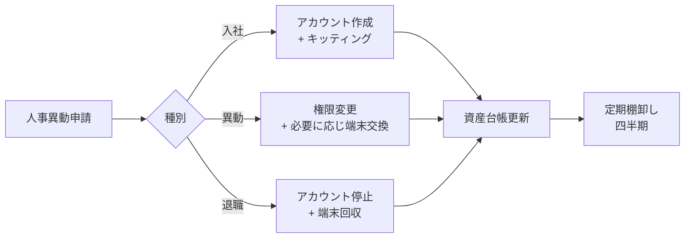

# アカウント管理・キッティング手順サンプル

> **本ドキュメントの位置付け**
>
> [FAQ](./faq.md) / [トラブルシューティング](./troubleshooting.md) と同様、私が運用設計を任された場合の **設計サンプル** です。特定企業での実運用記録ではありません。

社内 SE 補助業務でよく担当することになる、**入社・異動・退職に伴うアカウント / 端末の運用** を、私が現場で運用するならこう設計したい、というサンプルとしてまとめています。

実際の運用にあたっては、各社のディレクトリ製品（Active Directory / Microsoft Entra ID 等）、SSO、資産管理ツールに合わせて読み替えてください。

---

## 全体像



---

## 1. 入社時：アカウント作成チェックリスト

### 事前準備（入社 1 週間前まで）

| # | 項目 | 担当 | 備考 |
| --- | --- | --- | --- |
| 1 | 入社申請書受領 | 情シス | 配属・役職・利用システムを確認 |
| 2 | 社員番号採番 | 人事 | 連番ルール遵守 |
| 3 | メールアドレス命名 | 情シス | 命名規則に従う（重複・退職者再利用回避） |
| 4 | グループ所属決定 | 上長 | 部署 OU、共有フォルダ、メーリングリスト |

### アカウント作成項目

| システム | 作成内容 | 確認方法 |
| --- | --- | --- |
| Active Directory | ユーザー作成、OU 配置、グループ所属 | サインインテスト |
| Microsoft 365 | ライセンス割当（Teams / Outlook / OneDrive） | 管理センターで在籍確認 |
| 業務システム | 各システム管理者へ依頼 | 申請書ベース |
| VPN | クライアント証明書発行 | 接続テスト |
| 共有フォルダ | アクセス権付与 | 当該フォルダで読み書きテスト |

### 命名規則の例

| 種別 | 規則 | 例 |
| --- | --- | --- |
| ログイン ID | `s` + 社員番号 6 桁 | s012345 |
| メールアドレス | `姓.名@example.co.jp` | `shimada.noriyuki@example.co.jp` |
| PC ホスト名 | 拠点 2 文字 + 種別 1 文字 + 連番 4 桁 | TK-N-0042（東京 / Notebook） |

### 初期パスワード配布

- 平文メール送付は禁止
- 対面 / 電話 / 暗号化チャネルで通知
- 初回ログイン時にパスワード変更を **強制**
- 多要素認証（MFA）を初回ログイン後 24 時間以内に設定するよう案内

---

## 2. PC キッティング手順

### 標準キッティング項目

| カテゴリ | 項目 |
| --- | --- |
| OS | Windows 11 Pro / 最新更新適用 |
| 基本設定 | コンピューター名（命名規則に従う）、ドメイン参加、タイムゾーン |
| アカウント | ローカル管理者（情シス）、ドメインユーザー（業務） |
| 標準ソフト | Microsoft 365、Teams、ブラウザ（業務指定）、PDF リーダー |
| セキュリティ | EDR / アンチウイルス、ディスク暗号化（BitLocker） |
| 業務ソフト | 部署別アプリ（経理・営業 等） |
| 周辺機器 | プリンタドライバー、Web カメラドライバー |
| プロファイル | ブラウザのプロキシ設定、メールクライアント設定 |
| 検証 | サインイン、メール、印刷、VPN、業務システムログイン確認 |

### キッティング自動化の考え方

10 台 / 月以上のキッティングが発生するなら、以下の自動化を検討します。

| ツール | 用途 |
| --- | --- |
| Microsoft Intune / Autopilot | OS 初期設定・アプリ配信・MDM |
| PowerShell DSC / GPO | 設定の宣言的管理 |
| Ansible | サーバー側 + Windows ノードの構成管理 |
| Chocolatey / winget | ソフトウェア一括インストール |

**例：PowerShell によるソフトウェア一括インストール（winget）**

```powershell
$packages = @(
    "Microsoft.Office",
    "Microsoft.Teams",
    "Google.Chrome",
    "Adobe.Acrobat.Reader.64-bit",
    "7zip.7zip"
)

foreach ($pkg in $packages) {
    Write-Host "Installing $pkg ..."
    winget install --id $pkg --silent --accept-source-agreements --accept-package-agreements
}
```

### 検収

- ユーザー本人に対面 or リモートで以下をテストしてもらう
  - サインイン
  - メール送受信
  - 業務システムへのログイン
  - 印刷
  - VPN 接続
- 検収サインを資産台帳に記録

---

## 3. 異動時：権限変更チェックリスト

| # | 項目 | 内容 |
| --- | --- | --- |
| 1 | 旧部署権限の剥奪 | 共有フォルダ、メーリングリスト、業務システム権限 |
| 2 | 新部署権限の付与 | 同上を新部署のものへ |
| 3 | OU 移動 | AD の所属 OU を変更（GPO 適用範囲が変わる） |
| 4 | 端末交換要否 | 部署別アプリの差分が大きい場合は再キッティング |
| 5 | メールアドレス変更要否 | 役職名入りアドレス等の場合 |
| 6 | 連絡先一覧の更新 | 社内電話帳・組織図 |

### 注意点

- **異動日から 1 週間は旧権限を残す**（引継ぎ作業のため）
- 1 週間経過後に必ず棚卸し（旧権限が残り続けるのを防ぐ）

---

## 4. 退職時：アカウント停止チェックリスト

| # | 項目 | タイミング | 内容 |
| --- | --- | --- | --- |
| 1 | アカウント無効化 | 退職日 当日 17 時 | AD でアカウントを「無効」に |
| 2 | パスワード変更 | 同上 | ランダム文字列に変更 |
| 3 | MFA デバイス削除 | 同上 | 本人のスマートフォン認証等を解除 |
| 4 | メール転送設定 | 退職日 翌日 | 上長または引継ぎ担当へ転送（最大 6 か月） |
| 5 | OneDrive / 共有データ | 退職日 翌日 | 上長へアクセス権移管 |
| 6 | 業務システムアカウント | 1 週間以内 | 各システム管理者へ停止依頼 |
| 7 | VPN 証明書失効 | 即日 | CRL に追加 |
| 8 | 端末回収・初期化 | 退職日 当日 | BitLocker 回復キーで解除 → 工場出荷状態 |
| 9 | 入館証・社員証回収 | 退職日 当日 | 総務と連携 |
| 10 | 資産台帳更新 | 1 週間以内 | 機材の払い出し記録を消し込み |

### 退職後 1 か月でアカウント削除

- 即時削除はしない（アクセスログ調査 / 監査対応に備える）
- 1 か月後に **削除 or アーカイブ** を判断

---

## 5. 定期棚卸し（四半期ごと）

棚卸しは **「アカウント・端末・権限」の 3 軸** で実施します。

### 5.1 アカウント棚卸し

確認内容：

- 在籍者と AD アカウントの突合
- 90 日以上ログイン履歴のないアカウントの抽出
- 「退職者なのに有効なアカウント」が無いか

**SQL 例（人事 DB と AD エクスポートの突合）**

```sql
-- 退職者なのに AD アカウントが有効なユーザーを抽出
SELECT
    ad.sam_account_name,
    ad.display_name,
    hr.employment_status,
    hr.retire_date
FROM ad_accounts ad
LEFT JOIN hr_employees hr
    ON ad.employee_number = hr.employee_number
WHERE
    ad.enabled = TRUE
    AND (
        hr.employment_status = 'retired'
        OR hr.employee_number IS NULL
    );
```

**PowerShell 例（90 日以上未ログインの抽出）**

```powershell
$inactiveDays = 90
$threshold = (Get-Date).AddDays(-$inactiveDays)

Get-ADUser -Filter {Enabled -eq $true} -Properties LastLogonDate, Department |
    Where-Object { $_.LastLogonDate -lt $threshold } |
    Select-Object SamAccountName, DisplayName, Department, LastLogonDate |
    Sort-Object LastLogonDate |
    Export-Csv -Path "inactive_users.csv" -NoTypeInformation -Encoding UTF8
```

### 5.2 端末棚卸し

- 資産台帳と現物の突合（年 1 回は実機確認）
- リース満了端末の更新計画
- 紛失・盗難端末の確認とリモートワイプ実施記録

### 5.3 権限棚卸し

- 共有フォルダ・業務システムへのアクセス権を、現所属部署と突合
- 「特権アカウント」の利用ログレビュー（管理者アカウントを誰がいつ使ったか）

---

## 6. 運用上の工夫

私が現場で意識したいポイントです。

### チケット運用

- 全ての作業を **チケット起票 → 承認 → 実施 → クローズ** のサイクルで管理
- パスワードリセットや権限変更も例外なくチケット化（事後に「言った言わない」を防ぐ）

### 申請書テンプレート

| 申請種別 | 必須項目 |
| --- | --- |
| アカウント作成 | 氏名、社員番号、所属、上長承認、必要システム、開始日 |
| 権限変更 | 氏名、社員番号、変更内容、上長承認、適用日 |
| 端末払出 | 氏名、所属、機種、用途、上長承認、返却予定日 |
| アカウント停止 | 氏名、社員番号、停止日、データ引継ぎ先 |

### KPI

- **作業完了までの平均時間**（アカウント作成・パスワードリセット 等）
- **再依頼率**（同一ユーザーが同じ内容で再度問い合わせる率 → 手順書の質）
- **棚卸し時の差分件数**（多いほど日常運用に漏れがある）

---

## 関連ドキュメント

- [想定 FAQ](./faq.md)
- [トラブルシューティングフロー](./troubleshooting.md)
- [業務改善レポート（ピッキング工程）](../business-improvement/picking-improvement.md)
