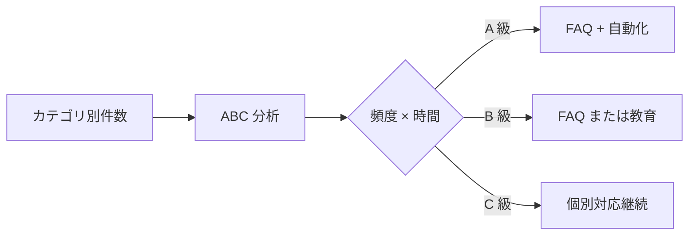

# IT サポート Service Desk メトリクス設計

> **本ドキュメントの位置付け**
>
> [想定 FAQ](./faq.md) / [トラブルシューティング](./troubleshooting.md) / [アカウント管理](./account-management.md) は「**手順**」だが、本ドキュメントは「**手順の運用品質を数値で語る**」設計サンプルです。
>
> インフラ運用の SLO 思想（[04 SLO 設計](../server-monitor-improvements/04-slo-design.md)）を IT サポート側に展開し、「**継続改善が回る仕組み**」を示します。
>
> 本ドキュメントは実体験ベースではなく、業務設計サンプルです（IT サポート業務に従事し次第、実体験に置き換え予定）。

---

## 1. 背景

IT サポート業務は「**問い合わせを捌けば OK**」になりがちで、以下が起きやすい：

- どのカテゴリが多いか分からない
- どこに時間がかかっているか分からない
- 何を改善すれば効果が大きいか判断できない
- 「忙しい」が定性的にしか語れない

これは [業務改善レポート](../business-improvement/picking-improvement.md) で物流現場で経験した「**継続計測ルール不在**」と同じ構造の課題です。サーバー監視ラボの SLO 設計（[04](../server-monitor-improvements/04-slo-design.md)）と同じ思想で、IT サポートにも **継続計測** を入れます。

---

## 2. 主要メトリクス

### 2.1 一次解決率（FCR: First Contact Resolution）

| 項目 | 内容 |
| --- | --- |
| 定義 | 「1 回目のやり取りで完結したチケット」/「全チケット」 |
| 目標値（例） | 70%（業界一般値 60-75%） |
| 改善手段 | FAQ 拡充、テンプレ回答、自己解決ツール |
| 注意 | FCR を追い求めて「とりあえず即時クローズ」にならないよう、CSAT と併用 |

### 2.2 平均応答時間（MRT: Mean Response Time）

| 項目 | 内容 |
| --- | --- |
| 定義 | チケット起票から **担当者の最初の返信** までの時間 |
| 目標値（例） | 業務時間内 30 分、業務時間外は翌営業日の 30 分以内 |
| 改善手段 | 通知の優先順位設計、On-call 当番制 |

### 2.3 平均解決時間（MTTR: Mean Time To Resolve）

| 項目 | 内容 |
| --- | --- |
| 定義 | チケット起票から **クローズ** までの時間 |
| 目標値（例） | Sev に応じた段階（後述） |
| 改善手段 | ランブック整備、自動化、定型作業のセルフサービス化 |

### 2.4 顧客満足度（CSAT）

| 項目 | 内容 |
| --- | --- |
| 定義 | クローズ時のアンケート（1-5 段階） |
| 目標値（例） | 平均 4.0 以上 |
| 改善手段 | 低スコア時のフォロー、共感的コミュニケーション訓練 |

### 2.5 再オープン率

| 項目 | 内容 |
| --- | --- |
| 定義 | クローズ後 7 日以内に再オープンしたチケットの比率 |
| 目標値（例） | < 5% |
| 改善手段 | 「解決」基準の明確化、フォローアップの仕組み |

### 2.6 バックログ（未着手 / 滞留）

| 項目 | 内容 |
| --- | --- |
| 定義 | 未クローズチケット数、特に「24h 以上未対応」 |
| 目標値（例） | バックログ < 10 件、24h 超過 = 0 |
| 改善手段 | 棚卸し、優先度の見直し、要員配置 |

### 2.7 カテゴリ別 ABC 分析

物流の ABC 分析（[業務改善レポート](../business-improvement/picking-improvement.md)）と同じ手法を適用：

```text
TOP10 カテゴリで全チケット数の 80% を占めている、を確認
→ TOP3 はテンプレ化 / 自己解決ツール化の最有力候補
```

---

## 3. Sev 分類と SLO

[04 SLO 設計](../server-monitor-improvements/04-slo-design.md) と同じ思想で、Sev ごとに応答 / 解決の目標を定義：

| Sev | 例 | 応答 SLO | 解決 SLO |
| --- | --- | --- | --- |
| **Sev1** | 全社的にサービス停止、業務停止 | 5 分以内 | 4 時間以内 |
| **Sev2** | 部署単位の停止、業務に支障 | 15 分以内 | 1 営業日以内 |
| **Sev3** | 個人の業務に影響、回避策あり | 30 分以内 | 3 営業日以内 |
| **Sev4** | 個別質問、機能要望 | 1 営業日以内 | 1 週間以内 |

各 Sev で **目標達成率（SLO）** を月次計測。例：「Sev3 解決 SLO の達成率 90% / 月」。

---

## 4. ダッシュボード設計

```text
┌──────────────────────────────────────────────────────────────────┐
│ Service Desk Dashboard                          May 2026         │
├──────────────────────────────────────────────────────────────────┤
│ 当月の対応件数             FCR              CSAT                 │
│  142 件                    71%              4.2 / 5              │
├──────────────────────────────────────────────────────────────────┤
│ Sev 別 SLO 達成率                                                │
│  Sev1   ████████████████████ 100%（0 件中 0 件超過）             │
│  Sev2   █████████████████░░░  87%（15 件中 2 件超過）            │
│  Sev3   ██████████████████░░  92%（78 件中 6 件超過）            │
│  Sev4   ███████████████████░  95%（49 件中 2 件超過）            │
├──────────────────────────────────────────────────────────────────┤
│ カテゴリ TOP5（ABC 分析）                                         │
│  1. パスワードリセット       28 件 (20%)                         │
│  2. メール送受信不良          22 件 (15%)                         │
│  3. プリンタ印刷不可           18 件 (13%)                         │
│  4. VPN 接続不可               14 件 (10%)                         │
│  5. キッティング              12 件 ( 8%)                         │
│  ─────  ABC 累積 66% ─────                                        │
├──────────────────────────────────────────────────────────────────┤
│ バックログ                                                        │
│  未クローズ: 8 件 / うち 24h 超過: 0 件 ✓                         │
└──────────────────────────────────────────────────────────────────┘
```

---

## 5. データソースと計測方法

### 5.1 ITSM ツール候補

| ツール | 月額 | 特徴 |
| --- | --- | --- |
| **GitHub Issues + Label** | 無料 | OSS / 小規模 / 学習用に最適 |
| **Jira Service Management** | $7/user〜 | エンタープライズ標準、SLA 機能標準 |
| **Zendesk** | $25/user〜 | 顧客サポート寄り |
| **Freshservice** | $19/user〜 | ITSM 寄り、ITIL 整合 |
| **ServiceNow** | 要問合せ | 大企業向け |

→ **ポートフォリオでは GitHub Issues + ラベル運用** を採用し、CSV エクスポートから集計するサンプルを示す。

### 5.2 GitHub Issues での運用例

```text
ラベル：
  sev/1, sev/2, sev/3, sev/4
  category/password, category/email, category/print, category/vpn, ...
  status/triage, status/in-progress, status/waiting-user, status/resolved
  fcr/yes, fcr/no
```

集計スクリプト：

```python
# scripts/service_desk_report.py
import requests, csv, statistics
from datetime import datetime

issues = requests.get(
    "https://api.github.com/repos/ORG/it-tickets/issues",
    params={"state": "closed", "since": "2026-05-01T00:00:00Z"},
    headers={"Authorization": f"token {TOKEN}"},
).json()

ttr = [
    (datetime.fromisoformat(i["closed_at"]) - datetime.fromisoformat(i["created_at"])).total_seconds() / 3600
    for i in issues
]

print(f"件数: {len(issues)}")
print(f"平均解決時間: {statistics.mean(ttr):.1f}h")
print(f"中央値: {statistics.median(ttr):.1f}h")
```

→ 月次レポート Markdown を `docs/it-support-reviews/YYYY-MM.md` に自動生成。

---

## 6. 月次レビュー

### 6.1 アジェンダ（30 分）

1. メトリクスの当月実績 / 目標達成率
2. Sev 別 SLO 違反の振り返り
3. ABC 分析（TOP10 カテゴリ）
4. 改善アクション候補
   - FAQ 化（高頻度 + テンプレ化可能）
   - 自動化（高頻度 + 機械的）
   - 自己解決（高頻度 + ユーザー操作）
   - 教育（重大 + 知識ギャップ）
5. CSAT 低スコアのレビュー（個別フォロー）

### 6.2 改善優先度の決め方



**着眼点**：

- 件数だけ多くて時間が短い → FAQ で十分（パスワードリセット）
- 件数は少ないが時間がかかる → ランブック整備（VPN トラブル）
- 件数も時間もかかる → 根本原因の調査（プリンタドライバ）

---

## 7. SLO 思想との連続性

サーバー監視ラボ（[04 SLO 設計](../server-monitor-improvements/04-slo-design.md)）と本ドキュメントの **設計思想は同じ**：

| サーバー監視ラボ | IT サポート |
| --- | --- |
| 可用性 SLO | Sev 別解決 SLO |
| エラーバジェット | バックログ閾値 |
| バーンレートアラート | 24h 滞留チケット警告 |
| 月次 SLO レビュー | 月次 Service Desk レビュー |
| ポストモーテム（[07](../server-monitor-improvements/07-incident-response.md)） | CSAT 低スコアフォロー |
| カオスエンジニアリング（[17](../server-monitor-improvements/17-chaos-engineering.md)） | 「IT 担当不在で他者が対応できるか」演習 |

「**インフラ運用も IT サポートも、同じ計測 → 仮説 → 改善のサイクル**」を扱える人材であることを示します。

---

## 8. 業務改善レポートとの連続性

[業務改善レポート](../business-improvement/picking-improvement.md) で得た最大の学びは：

> **継続計測ルールを最初から設計せよ**（単発改善のリバウンドを防ぐため）

本ドキュメントは、この反省を IT サポート業務側で先に組み込んでおく **設計サンプル** です。

| 物流現場での反省 | 本ドキュメントでの先回り |
| --- | --- |
| 改善後の計測ルールが無く効果が見えなくなった | 主要メトリクスを月次計測することを最初から組込み |
| ボトルネックの定量的特定が不十分 | ABC 分析を運用に組込み |
| 改善のリバウンドを許してしまった | CSAT・再オープン率で品質劣化を監視 |

---

## 9. ツール導入の段階性

| 段階 | ツール | 主目的 |
| --- | --- | --- |
| 入社直後 | スプレッドシート + Slack | まずは計測する |
| 1-3 ヶ月 | GitHub Issues / Notion + 集計スクリプト | 計測の自動化 |
| 3-6 ヶ月 | 軽量 ITSM（Freshservice 等） | SLA / カテゴリ自動分類 |
| 6 ヶ月+ | フル ITSM + ナレッジベース | 全社統合 |

「**ツールから入らず、計測の文化から入る**」が原則。サーバー監視で先に SLO の考え方を体得しているため、IT サポート側でも同じ思想を持ち込めます。

---

## 10. 完了条件（Definition of Done、実務着任後）

- [ ] 主要 6 メトリクスが月次で計測されている
- [ ] Sev 別 SLO が定義され、達成率が月次レビューされている
- [ ] ABC 分析が月次で実施され、TOP3 改善アクションが決まっている
- [ ] CSAT が計測され、低スコア時のフォロー手順がある
- [ ] サーバー監視ラボの月次レビューと **同じ会議体** で運営している
- [ ] 業務改善レポートで反省した「継続計測ルール不在」を再発させていない

---

## 11. 関連ドキュメント

- [想定 FAQ](./faq.md) — メトリクス改善の主要手段（FAQ 化）
- [トラブルシューティング](./troubleshooting.md) — ランブック整備
- [アカウント管理](./account-management.md) — Sev3-4 の典型カテゴリ
- [業務改善レポート](../business-improvement/picking-improvement.md) — 継続計測の重要性
- [現場経験 ↔ インフラ運用 橋渡し](../career-bridge.md) — 計測 → 仮説 → 標準化サイクル
- [04 SLO 設計](../server-monitor-improvements/04-slo-design.md) — 同じ SLO 思想

---

## 12. 参考

- [HDI（Help Desk Institute）— Service Desk Metrics](https://www.thinkhdi.com/)
- [ITIL 4 — Service Desk Practice](https://www.axelos.com/certifications/itil-service-management/)
- [Google SRE Book — Chapter 5: Eliminating Toil](https://sre.google/sre-book/eliminating-toil/)
