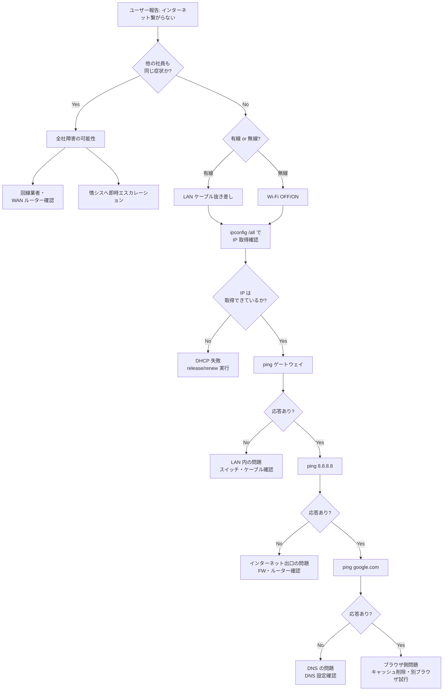
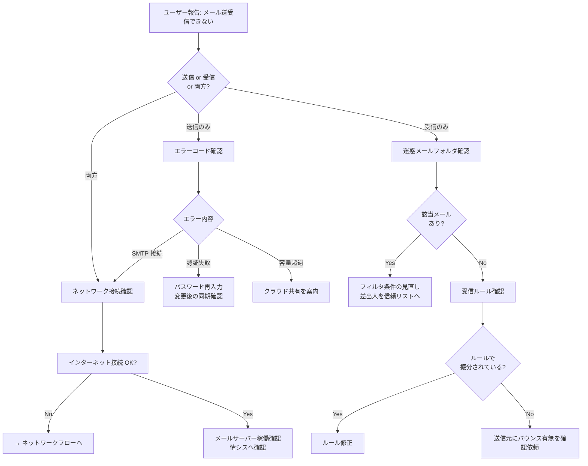
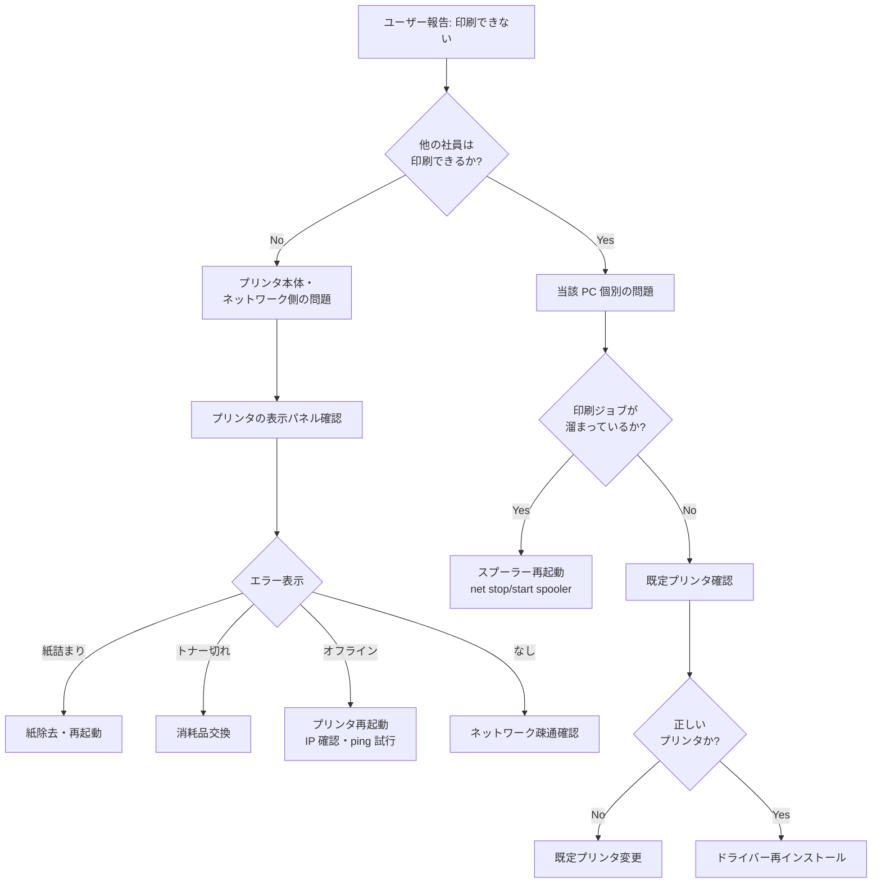
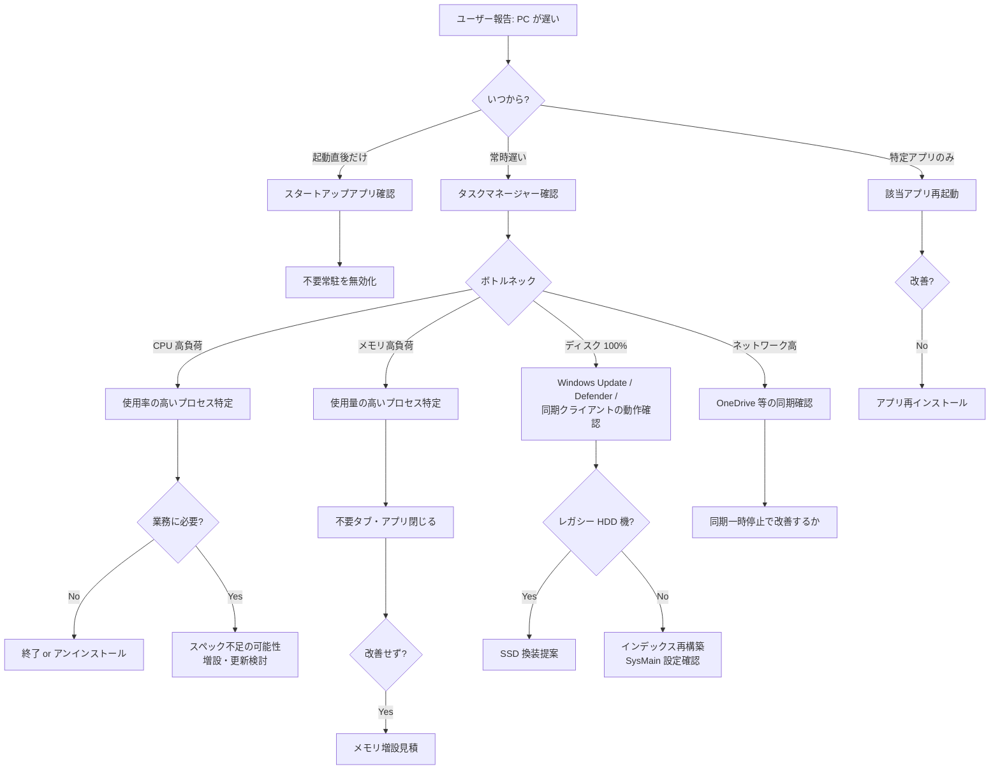
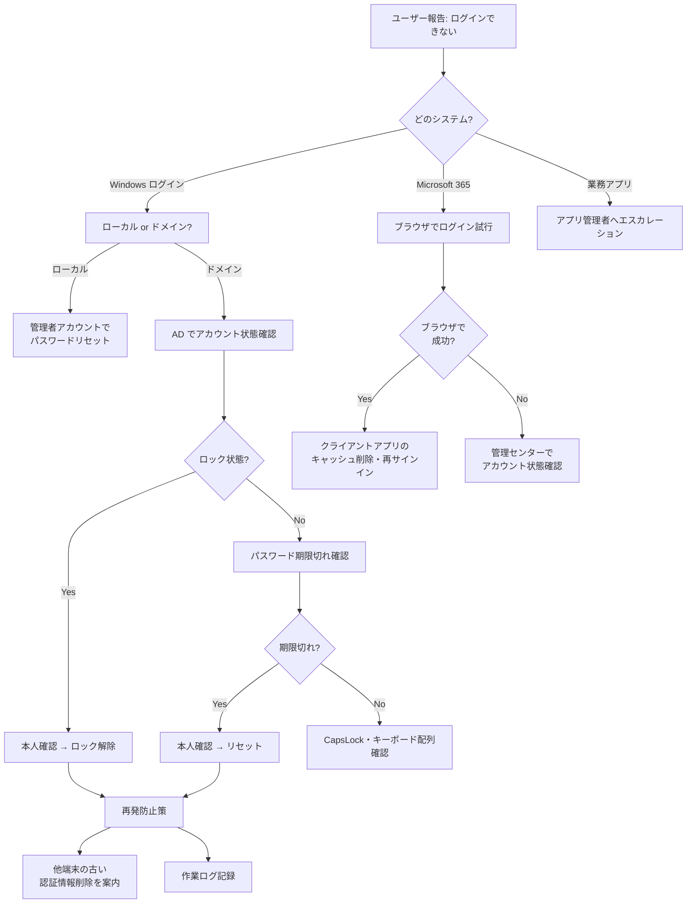
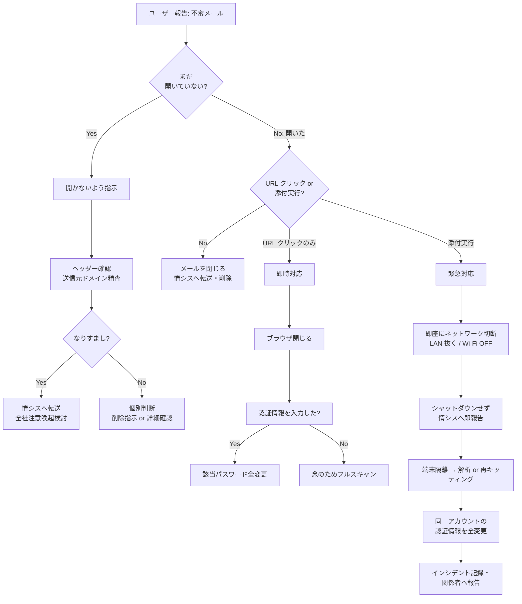

# トラブルシューティングフロー集

> **本ドキュメントの位置付け**
>
> [FAQ](./faq.md) と同様、IT サポート業務での切り分け設計を示す **サンプル / テンプレート** です。実際の現場対応記録ではありません。

代表的な障害について、**「現場で迷わない切り分け順序」** を Mermaid フローチャートで整理しています。
FAQ より一段深く、判断分岐を持った形で記述しています。

---

## 1. インターネットに繋がらない

---

## 2. メール送受信ができない

---

## 3. 印刷ができない

---

## 4. PC の動作が遅い

---

## 5. パスワード関連トラブル

---

## 6. 不審メール受信 / クリックしてしまった

---

## フローチャート設計の考え方

私が切り分けフローを作る際に意識した点です。

| 観点 | 内容 |
| --- | --- |
| **二分木で考える** | 「Yes / No」で枝を分け、判断を機械的にする |
| **共通の入口** | 「他の社員も同じか」「いつから」「再現性」を最初に確認 |
| **コストの低い順** | 再起動 → 再インストール → 再キッティング の順で試す |
| **エスカレーション基準** | 30 分試して進展なし or 影響範囲が広がる場合は即上位へ |
| **記録を残す** | フローのどこで解決したかをチケットに記載し、FAQ・手順書に還元 |

---

## 関連ドキュメント

- [想定 FAQ](./faq.md)
- [アカウント管理・キッティング手順](./account-management.md)
