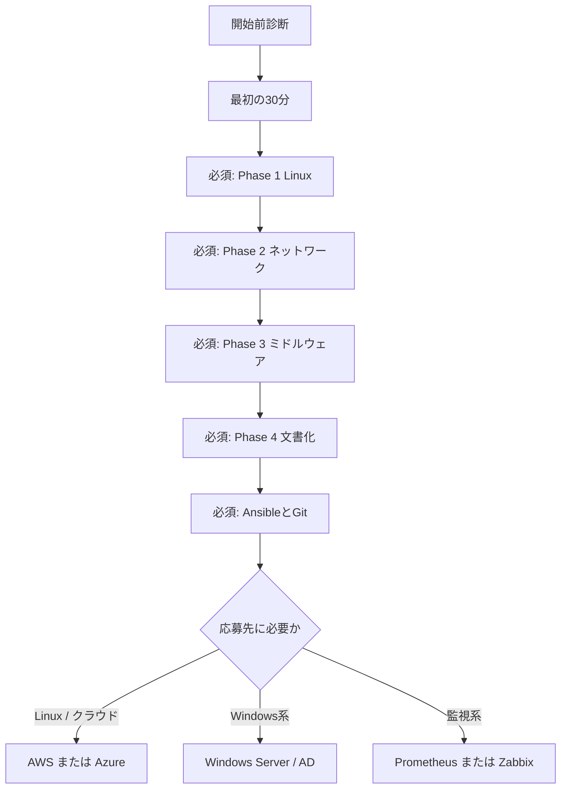

# 初心者向けスタートガイド

対象バージョン: Ubuntu 24.04 LTS  
最終手順確認日: 2026-09-01  
次回確認期限: 2026-12-01

このページは、24 週プランを始める前の入口です。**開始前診断 → 最初の 30 分 → 学習ルート選択**の順に進めます。

## 1. 開始前診断（10〜15 分）

分からない項目は「いいえ」にします。無理に標準ルートへ進む必要はありません。

| # | 確認 | はいの場合 |
| --- | --- | --- |
| 1 | PC の OS 名とバージョンを確認できる | 結果を作業メモへ記録する |
| 2 | PC のメモリが 16 GB 以上ある | 標準ルートの候補 |
| 3 | 60 GB 以上の空き容量がある | VM 3 台構成を選択できる |
| 4 | BIOS / UEFI の仮想化機能が有効である | Hyper-V 等を利用できる |
| 5 | PC の管理者権限を利用できる | 仮想化ソフトを導入できる |
| 6 | `ls`、`cd`、`pwd` の役割を説明できる | Phase 1 をそのまま開始できる |
| 7 | エラー全文をテキストへ保存できる | 質問テンプレートを利用できる |
| 8 | 週 10 時間以上を確保できる | 24 週の標準ペースを選択できる |

### 診断結果から選ぶルート

| ルート | 目安 | 最初に行うこと |
| --- | --- | --- |
| **標準** | 2〜8 がすべて「はい」 | VM 3 台構成で[学習環境](./01-environment.md)を作る |
| **軽量** | メモリ 8〜15 GB、または空き容量 30〜59 GB | VM 1 台だけで Phase 1 を行い、3 層構成はコンテナで代替する |
| **基礎補習** | 6 または 7 が「いいえ」 | 下記の「最初の 30 分」を行い、ファイル操作と記録に慣れる |

メモリが 8 GB 未満、空き容量が 30 GB 未満、または管理者権限がない場合は、端末を変更するか、管理者へ相談してから開始します。クラウドへの安易な代替は、課金と公開設定の危険があるため行いません。

## 2. 最初の 30 分：状態を確認して記録する

### この演習の目的

Ubuntu 24.04 のターミナルで、**コマンドを実行し、期待結果と実際の結果を区別して記録する**ことがゴールです。設定変更や削除は行いません。

### 前提

- [学習環境](./01-environment.md)に従って Ubuntu 24.04 の VM を 1 台起動済みである
- VM のターミナルへ一般ユーザーでログインしている
- 本番サーバーや会社の端末ではない

VM をまだ用意できない場合は、ここで止まり、開始前診断の軽量ルートまたは環境ページへ戻ります。

### 手順 1：自分と現在位置を確認する

```bash
whoami
pwd
```

**期待結果**:

- `whoami` はログイン中の一般ユーザー名を 1 行で表示する
- `pwd` は `/home/<ユーザー名>` など、現在いる場所を表示する
- `whoami` が `root` の場合は演習を中止し、一般ユーザーでログインし直す

### 手順 2：OS と IP アドレスを確認する

```bash
cat /etc/os-release
ip -brief address
```

**期待結果**:

- `/etc/os-release` に `Ubuntu` とバージョンが表示される
- `ip -brief address` に `lo` 以外のインターフェースと IP アドレスが 1 つ以上表示される

表示されたIPアドレスを公開リポジトリへ記録するときは、端末固有情報として末尾を `xxx` に置き換えます。

### 手順 3：SSH サービスの状態を確認する

```bash
systemctl is-active ssh
systemctl is-enabled ssh
```

**成功条件**は、上から順に `active` と `enabled` が表示されることです。`inactive`、`failed`、`not-found` の場合は勝手に設定を変えず、下記の質問テンプレートへ出力を保存します。

### 手順 4：記録を残す

次を作業メモへコピーして埋めます。

```text
目的: Ubuntu VM の利用者、OS、IP、SSH の状態を確認する
実行したこと: whoami / pwd / cat /etc/os-release / ip / systemctl
期待する結果: 一般ユーザー、Ubuntu 24.04、IP あり、SSH が active / enabled
実際の結果: （秘密情報を除いた実際の出力と判定を書く）
失敗時の戻し方: 読み取りだけなので変更なし。失敗時は出力を保存して質問する
```

### 完了判定

- [ ] `root` ではない利用者名を確認した
- [ ] OS 名とバージョンを確認した
- [ ] `lo` 以外の IP アドレスを確認した
- [ ] SSH の状態を成功または失敗として判定した
- [ ] 期待結果と実際の結果を分けて記録した

5 項目すべてにチェックできたら完了です。SSH が動いていなくても、状態を正しく記録できていればこの演習は合格です。次は[最初の 7 日間](./README.md#最初の-7-日間)へ進みます。

## 3. 必須ルートと選択トラック



最初から AWS、Azure、Windows Server、AD、Zabbixをすべて行う必要はありません。Phase 1〜4と Ansible / Git を必須とし、その後は応募先の求人票に合わせて**各分野から 1 つずつ**選びます。Terraform、Python、PowerShellの発展演習は、必須ルートの成果物が完成するまで「今は読まなくてよい」範囲です。

## 4. 各 Phase の採点基準と提出例

### 合格条件

次の4観点をすべて満たせば合格です。コマンドは調べながらで構いません。

| 観点 | 合格条件 |
| --- | --- |
| 実行 | 一般ユーザーから `sudo` を必要な箇所だけで使い、SSH とサービスの状態を確認できる |
| 判定 | コマンド出力のどの行を根拠に成功／失敗と判断したか書ける |
| 復旧 | スナップショット取得後に設定を 1 つ壊し、元へ戻せる |
| 証跡 | 日時、対象、コマンド、結果、秘密情報のマスクが揃っている |

Phase 2以降も、次の必須観点をすべて満たしたら合格です。各行の成果物に、上表の「判定」と「証跡」も含めます。

| Phase | 必須観点 | 合格する成果物 |
| --- | --- | --- |
| 2 ネットワーク | 名前解決、待受ポート、通信経路を別々に確認し、停止箇所を説明する | 「pingは通るがHTTPは返らない」状態の切り分け記録 |
| 3 ミドルウェア | Web / AP / DB の役割を分け、バックアップを空のDBへ復元する | 構成図、確認コマンド、復元前後のデータ比較 |
| 4 文書化 | 手順、想定結果、中止条件、切り戻し、正常系／異常系試験を第三者が追える | 記入済みパラメータシート、手順書、試験項目書 |
| 5 自動化 | 手作業との差分を説明し、同じ対象へ2回適用して冪等性を確認する | 2回目が `changed=0` のログとGitの変更理由 |
| 6 クラウド・監視 | 予算上限を設定し、障害の検知、通知、復旧、削除まで行う | 課金対策、RTO、復旧結果、リソース削除の記録 |

Phase 2以降で、必須観点を満たしているか自分で判断できない場合は、合格扱いにせず質問テンプレートを使います。第三者評価で判定が割れた観点は、再現テスト記録へ残して基準を更新します。

### よい提出例

> `systemctl is-active ssh` が `inactive` だった。`journalctl -u ssh --since today` で設定エラーの時刻を確認し、変更した1行を戻した。同じ確認コマンドが `active` になったため復旧と判定した。

症状、確認、変更、再確認が分かれ、判定根拠が明記されています。

### 惜しい提出例

> SSHを直した。現在は接続できる。

結果は分かりますが、対象、コマンド、原因、判定根拠がありません。不足情報を追記すれば再実行は不要です。

### 再提出になる例

> 動かなかったので何度か再起動した。最後は動いた。

原因を確認する前に状態を変え、どの操作で直ったか再現できません。スナップショットへ戻り、状態とログを先に保存してやり直します。

## 5. 30 分以上止まったとき

同じ操作を推測で繰り返さず、次を記録します。パスワード、トークン、公開前のIPアドレス、個人名は `<REDACTED>` に置き換えます。

```text
対象ページと手順番号:
利用 OS / バージョン:
利用環境（標準・軽量・基礎補習）:
実行したコマンド:
期待した結果:
実際の結果（省略しない）:
直前に変更したこと:
試した対処:
スナップショットへ戻せるか:
```

報告先は、このリポジトリの GitHub Issues です。公開できない端末情報を含む場合は本文へ貼らず、再現可能な最小情報へ置き換えます。Issueを利用できない場合は、プロフィールREADMEの連絡先を使います。

## 6. 第三者再現テスト

このページが本当に初心者向けかは、作成者の自己評価では確定しません。初学者2名以上に、READMEからこのページと「最初の30分」をヒントなしで実行してもらいます。

テスト担当者は[第三者再現テスト記録](./beginner-usability-test.md)を複製して記入します。同じ箇所で2名が止まった場合は教材の欠陥として修正し、修正後に別の初学者または同じ条件で再テストします。実施記録が2名分揃うまでは「初心者による再現確認済み」と表現しません。

## 7. 保守と報告

- Ubuntu の四半期更新に合わせ、3か月ごとにコマンドと期待結果を確認する
- OSやツールの対象バージョンを変更した場合は、確認日と変更理由を更新する
- リンク切れと Mermaid 構文はリポジトリの検査コマンドで確認する
- 不具合報告では、対象ページ、手順番号、OS、期待結果、実際の結果を必須とする
