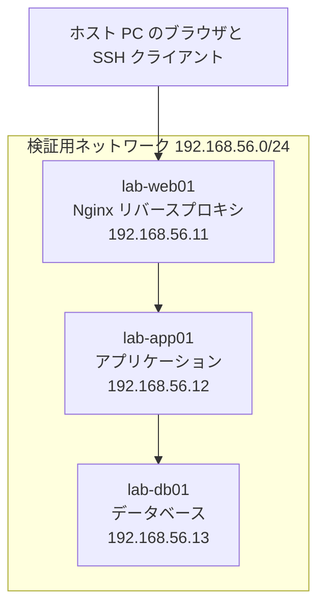

# 01 学習環境の作り方

> **本ドキュメントの位置付け**
>
> [サーバー構築エンジニア学習プラン](./README.md)の Phase 0（着手前の準備）にあたります。
> 未経験者が最初に脱落する原因の上位が「環境構築で時間を使い切る」ことのため、
> **迷わないように選択肢を絞り、構成を固定**しています。所要時間の目安は 1 日から 2 日です。

最終更新: 2026-08-11

---

## 1. 用意するもの

### PC の要件

| 区分 | CPU | メモリ | 空きディスク | 備考 |
| --- | --- | --- | --- | --- |
| 最低 | 4 コア | 8 GB | 60 GB | VM は 1 台ずつ起動する運用にする |
| 推奨 | 4 コア以上 | 16 GB | 150 GB | VM を 3 台同時に起動できる |

- **メモリ 8 GB でも学習は可能**です。3 台同時起動をあきらめ、1 台ずつ切り替えて使います
- ディスクは SSD を強く推奨します。HDD では VM の起動待ちが学習リズムを壊します
- CPU の仮想化支援機能（Intel VT-x / AMD-V）が BIOS / UEFI で有効になっている必要があります

### 費用

| 項目 | 費用 |
| --- | --- |
| 仮想化ソフト（VirtualBox など） | 0 円 |
| Linux（Ubuntu / AlmaLinux） | 0 円 |
| Windows Server 評価版 | 0 円（180 日間） |
| 書籍 | 3,000-4,000 円 × 4-5 冊程度 |
| クラウド検証 | 数百円（[課金ガード](#5-クラウド検証と課金事故の防止)を設定した場合の目安） |

Phase 1 から Phase 5 までは**すべて 0 円・ローカル完結**で実施できます。

---

## 2. 仮想化環境の選び方

### 選択肢の比較

| 方式 | 対応 OS | 向いている用途 | 注意点 |
| --- | --- | --- | --- |
| **VirtualBox** | Windows / Linux / Intel Mac | **本プランの標準**。複数 VM とネットワーク分離を学べる | Apple Silicon Mac では非対応または不安定 |
| VMware Workstation Pro | Windows / Linux | VirtualBox とほぼ同等 | 商用利用条件を確認する |
| Hyper-V | Windows Pro 以上 | Windows 標準で追加インストール不要 | Home エディションでは使えない |
| WSL2 | Windows | Linux コマンドの練習に最速 | **本物の OS 起動・ネットワーク構成の学習には不向き** |
| Multipass | Windows / macOS / Linux | Ubuntu VM を 1 コマンドで作れる | ネットワーク構成の自由度が低い |
| UTM | Apple Silicon Mac | Mac で ARM 版 Linux を動かせる | x86 前提の教材と手順が食い違うことがある |

### 判断の指針

- **Windows PC を持っている場合は VirtualBox** を選びます。教材・情報量が最も多く、詰まったときに検索で解決できます
- **Apple Silicon Mac の場合は UTM または Multipass** を使い、それでも詰まるならクラウドの無料枠に切り替えます
- **WSL2 だけで済ませない**でください。コマンド練習には最適ですが、本プランで扱う NIC 設定・ファイアウォール・複数台間の疎通・OS 再起動の挙動が学べません

> WSL2 は「Phase 1 のコマンド練習」に併用する分には有効です。役割を分けて使います。

---

## 3. ラボ構成（3 台構成）

Phase 3 以降で使う 3 層構成を、最初から想定した構成にします。
**最初に 1 台だけ作り、Phase 3 で複製して 3 台に増やします。**



図の要約：ホスト PC からホストオンリーネットワーク経由で 3 台の VM に接続し、Web → AP → DB の順に通信します。

### ネットワーク設計

VM には**アダプタを 2 枚**設定します。役割を分けることが、そのままネットワーク学習になります。

| アダプタ | 種別 | 用途 | 例 |
| --- | --- | --- | --- |
| 1 枚目 | NAT | VM からインターネットへの通信（パッケージ取得） | DHCP |
| 2 枚目 | ホストオンリー | ホスト PC と VM 間、VM 同士の通信 | 固定 IP `192.168.56.0/24` |

- **ホストオンリー側は固定 IP** にします。DHCP のままだと再起動のたびに IP が変わり、手順書が再現しません
- ホストオンリーのネットワークアドレスは仮想化ソフトの設定に合わせます（VirtualBox の既定は `192.168.56.0/24`）

### 命名と IP の割り当て規則

現場では命名規則が必ず決められています。**学習段階から規則を決めて運用します。**

```text
命名規則: <環境>-<役割><連番>
  例) lab-web01, lab-app01, lab-db01, lab-ops01

IP 割り当て規則: 192.168.56.<役割番号>
  .1        ホスト PC 側
  .11-.19   Web 系
  .21-.29   AP 系
  .31-.39   DB 系
  .41-.49   運用・監視系
```

> 規則そのものは何でも構いません。**「規則を決めて、最後まで守れること」**が評価される能力です。

### OS の選び方

| ディストリビューション | 使う場面 | 理由 |
| --- | --- | --- |
| **Ubuntu Server LTS** | Phase 1-3 の主環境 | 情報量が多く、詰まったときに解決しやすい |
| **AlmaLinux または Rocky Linux** | Phase 3 の後半以降で 1 台追加 | 国内の商用環境は RHEL 系が多く、`dnf` / `firewalld` / SELinux の差分を知っておく必要がある |

**両方を触ることが目的**です。パッケージ管理（`apt` と `dnf`）、ファイアウォール（`ufw` と `firewalld`）、
SELinux の有無という違いを、実際に手を動かして体験しておくと、現場のどちらに配属されても対応できます。

---

## 4. 環境構築の手順と初期設定

### 手順の流れ

1. 仮想化ソフトをインストールする
2. Ubuntu Server LTS の ISO をダウンロードする
3. VM を 1 台作成する（vCPU 2 / メモリ 2 GB / ディスク 20 GB）
4. OS をインストールする（最小構成 + OpenSSH サーバー）
5. 下記の初期設定チェックリストを実施する
6. **スナップショットを取得する**（名前: `base-clean`）

### 初期設定チェックリスト

このチェックリストは、そのまま Phase 4 で作る**構築手順書の原型**になります。
実行するたびに、コマンドと想定結果をメモしてください。

- [ ] ホスト名を命名規則どおりに設定する
- [ ] タイムゾーンを `Asia/Tokyo` に設定する
- [ ] 時刻同期（NTP / chrony）が有効であることを確認する
- [ ] ホストオンリー側の NIC に固定 IP を設定する
- [ ] 作業用ユーザーを作成し、sudo 権限を付与する
- [ ] SSH 公開鍵を登録し、鍵でログインできることを確認する
- [ ] パスワード認証と root ログインを禁止する
- [ ] ファイアウォールを有効化し、SSH のみ許可する
- [ ] OS を最新化する
- [ ] ログの保存先とローテーション設定を確認する

> **重要**: 「パスワード認証を禁止する」設定は、**別のターミナルで鍵ログインできることを確認してから**
> 適用します。この順序を間違えると自分が締め出されます。これは学習ラボに限らず、現場の事故で最も多いパターンの 1 つです。

### スナップショット運用

本プランは「壊して直す」ことを前提にしているため、**戻れる状態を常に持ちます**。

| スナップショット名 | 取得タイミング | 用途 |
| --- | --- | --- |
| `base-clean` | 初期設定完了直後 | すべての演習の起点 |
| `phaseN-done` | 各フェーズ完了時 | 次フェーズの起点、やり直しの基準 |
| `before-drill` | 壊す演習の直前 | 演習後に確実に戻す |

- 演習で壊す前は**必ず** `before-drill` を取ります
- スナップショットが増えるとディスクを圧迫します。フェーズ完了時に古い `before-drill` を削除します
- **スナップショットは実務のバックアップとは別物**です。バックアップとリストアの学習は Phase 6 で別途行います

---

## 5. クラウド検証と課金事故の防止

Phase 6 でクラウドを使います。未経験者が最も恐れるのは想定外の請求のため、**触る前にガードを設定します**。

| # | 対策 | 具体的な操作 |
| --- | --- | --- |
| 1 | ルートユーザーに MFA を設定する | アカウント作成直後に実施する |
| 2 | 作業用の IAM ユーザーを作り、以後ルートを使わない | 権限は必要最小限から始める |
| 3 | 予算アラートを設定する | 上限を 1,000 円など低く設定し、メール通知を有効にする |
| 4 | 作業時間を先に決める | 「1 時間で作って壊す」と決めてから着手する |
| 5 | **終わったら必ず削除する** | 削除後にコンソールで残骸がないことを目視確認する |
| 6 | 翌日に請求額を確認する | 実費を記録する。金額そのものが学習の証跡になる |

削除漏れが起きやすいリソースの例：ロードバランサー、固定 IP（未使用でも課金される）、
ストレージのスナップショット、マネージド DB、NAT ゲートウェイ。
**「作ったものの一覧」を紙に書いてから作り始め、削除時にその紙で消し込みます。**

---

## 6. Windows Server の学習環境（任意）

国内の求人では Windows Server と Active Directory を扱う構築案件も多いため、
応募先の比率に応じて 1 台追加します。

| 項目 | 内容 |
| --- | --- |
| 入手 | Microsoft の評価版（180 日間・無料） |
| VM 要件 | vCPU 2 / メモリ 4 GB / ディスク 40 GB |
| 学習範囲 | OS の初期構築（ホスト名・固定 IP・ローカル管理者・リモート管理・ファイアウォール）、AD DS の構築、OU 設計、ユーザー作成、グループポリシーの基本、PowerShell での一括操作 |
| 成果物 | PowerShell の実行ログ（[06 シェルスクリプト演習設計 Level 4](./06-shell-scripting-exercise-design.md#44-level-4-active-directory-運用スクリプト)の内容を実際に流す） |

> Linux トラックを主軸にする場合、この 1 台は Phase 6 以降または転職活動と並行して追加すれば十分です。
> 本リポジトリでは[証跡採録チェックリストの優先 7](../evidence-capture-checklist.md) に対応します。
> 「OS の初期構築」（空の VM への導入からホスト名・固定 IP・ローカル管理者・WinRM/RDP・ファイアウォール・
> Windows Update・サービス／タスクの基礎まで）は [10 Windows Server 基礎構築演習設計](./10-windows-server-exercise-design.md)に、
> 「PowerShell での一括操作」の具体的な演習（基礎文法からサービス・イベントログ・AD 操作まで）は
> [06 シェルスクリプト演習設計](./06-shell-scripting-exercise-design.md)に、「OU 設計」「グループポリシーの基本」は
> [08 AD構築演習設計](./08-ad-exercise-design.md)に設計しています。

---

## 7. 環境トラブルの対処

環境構築で詰まったときに、**時間を溶かさないための判断基準**です。

| 症状 | 最初に確認すること | 30 分で解決しない場合 |
| --- | --- | --- |
| VM が起動しない | BIOS / UEFI の仮想化支援機能、Hyper-V との競合 | VM を作り直す（設定を追うより速い） |
| VM からインターネットに出られない | NAT アダプタが有効か、`ip a` でアドレスが付いているか | アダプタ 1 枚目を NAT で作り直す |
| ホスト PC から SSH できない | ホストオンリーのアドレス範囲、ファイアウォール、`ss -tlnp` の待ち受け | ホストオンリーアダプタを削除して再作成する |
| 動作が極端に遅い | 割り当てメモリ、同時起動台数、ディスクの空き | 同時起動を 1 台に減らす |
| 設定を壊して復旧できない | 直前のスナップショット | `base-clean` へ戻し、**壊した経緯を記録してから**やり直す |

**30 分ルール**: 環境トラブルは 30 分で解決しなければ、原因追及をやめて作り直します。
ただし**作り直す前に、症状とエラー全文を記録**します。この記録が Phase 2 以降の切り分け力になります。

---

## 8. 環境そのものを証跡にする

学習環境の構築は、それ自体が「構築作業」です。次の 3 点を残しておくと、そのまま面接で使えます。

1. **構成図** — 台数・IP・役割を 1 枚に描く（手書きの写真でも可）
2. **初期構築手順書** — 上記チェックリストにコマンドと想定結果を足したもの
3. **つまずきログ** — 症状 → 原因 → 対処 → 学び の 4 点（[記載例](../../LEARNINGS.md)）

> 「教材どおりに作りました」より、「この構成にした理由」と「ここで詰まって、こう直した」を
> 説明できるほうが評価されます。環境構築は最初の演習であって、雑務ではありません。

---

## 関連ドキュメント

- [学習プラン 全体像](./README.md)
- [02 フェーズ別カリキュラム](./02-curriculum.md)
- [03 構築工程の実務ドキュメント](./03-build-process.md)
- [証跡採録チェックリスト](../evidence-capture-checklist.md)
- [学習の一次記録（つまずきログ）](../../LEARNINGS.md)
