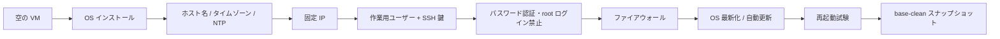

# 05 Phase 1 演習設計：空の VM からの初期構築（lab-base01）

> **本ドキュメントの位置付け**
>
> [サーバー構築エンジニア学習プラン](./README.md) Phase 1（W1-W4）のうち、
> [01 学習環境の作り方](./01-environment.md)の初期設定チェックリストと
> [02 フェーズ別カリキュラム W1-W3](./02-curriculum.md#phase-1-linux-基礎w1-w4)の一部を、
> [03 構築工程の実務ドキュメント](./03-build-process.md)の様式（パラメータシート・構築手順書・試験項目書）に
> 落とし込んだ**具体的な演習設計**です。
>
> [STATUS.md](../../STATUS.md) が「コードでは埋められない、残っている穴」の 2 番目に挙げている
> **「空の VM に OS を入れるところからやっていない」**に対応する演習を、実行前に詳細まで設計しておくことが目的です。
> 本ドキュメントは**設計であり、実施記録ではありません**。実施したら [8. 実施ステータス](#8-実施ステータスと次のアクション)を更新します。
>
> 本ドキュメントは 2026-08-25 に一度、Ubuntu Server 24.04 / OpenSSH 9.6p1 / ufw 0.36.2 / netplan /
> cloud-init の実機挙動と照らして精査し、コマンド・想定結果・リポジトリ内の参照を訂正しています
> （精査の経緯自体は記録していません。設計書自体の正確性の担保であり、本演習の実施記録ではないため）。
>
> 本文（3〜7 章）は [01 学習環境](./01-environment.md)が既定とする **VirtualBox** を前提に書いています。
> 本人が実際に使用する仮想化基盤は **Hyper-V** のため、VirtualBox 固有の操作（VM 作成、ホストオンリー相当の
> ネットワーク、スナップショット）が出てくる箇所には `[Hyper-V版]` の注記を置き、対応する手順は
> [付録 A](#付録-a-hyper-v-版の差分) にまとめています。OS 側の操作（netplan・sshd・ufw・ユーザー作成など）は
> 仮想化基盤に依存しないため、本文の記述をそのまま使います。
>
> 2026-08-26 には、設計書に書いたコマンド・設定ファイルのうち OS インストールを伴わない部分（`sshd_config.d`
> の読み込み順序、`ufw` のコマンド出力、`logrotate` / `unattended-upgrades` の既定値など）を、この AI 支援
> セッションの作業環境上で個別に実行して検証しました。その過程で [T-12](#5-試験項目書) の期待結果が既定の
> `sshd` `LogLevel` では成立しないことが分かり、設計を訂正しています。**これは本演習の実施ではありません**
> （空の VM への OS インストールを伴っていません）。検証できた範囲・できなかった範囲は
> [付録 B](#付録-b-設計の事前検証コマンド構文と設定挙動の確認) にまとめています。

最終更新: 2026-08-26

> **実施ステータス: 設計のみ・未実施**（2026-08-26 時点。[付録 B](#付録-b-設計の事前検証コマンド構文と設定挙動の確認)の
> コマンド構文・設定挙動の事前検証は完了しましたが、本演習そのもの（空の VM への OS インストール）は未実施です）。
> 試験項目書の実測結果欄はすべて空欄です。

---

## 目次

| 節 | 内容 |
| --- | --- |
| [1](#1-演習の目的スコープ前提条件) | 目的・スコープ・前提条件 |
| [2](#2-要件と基本設計) | 要件と基本設計（なぜこの構成にするか） |
| [3](#3-パラメータシート) | パラメータシート（lab-base01 の設定値） |
| [4](#4-構築手順書) | 構築手順書（コマンド・想定結果・判定） |
| [5](#5-試験項目書) | 試験項目書（単体・結合・総合・異常系） |
| [6](#6-実施タイムテーブルと中断基準) | 実施タイムテーブルと中断基準 |
| [7](#7-証跡採録計画) | 証跡採録計画 |
| [8](#8-実施ステータスと次のアクション) | 実施ステータスと次のアクション |
| [付録 A](#付録-a-hyper-v-版の差分) | Hyper-V 版の差分（VM 作成・ネットワーク・チェックポイント） |
| [付録 B](#付録-b-設計の事前検証コマンド構文と設定挙動の確認) | 設計の事前検証（コマンド構文・設定挙動の確認。本演習の実施ではない） |

---

## 1. 演習の目的・スコープ・前提条件

### 目的

[学習プランの自己採点](./README.md#本人の到達状況自己採点)（採点の正本）で G1（空の VM から **Web / AP / DB の 3 層構成**を
単独で構築）は「△」であり、その根拠欄に「コンテナ上の構成であり、空の VM に OS を入れて組んだ実績ではない」と
明記されている。これは [STATUS.md](../../STATUS.md) の「コードでは埋められない、残っている穴」の 2 番目
（「空の VM に OS を入れるところからやっていない」）とも対応する。

本演習は、この差分を埋めるために**空の VM 1 台に Ubuntu Server 24.04 LTS を導入し、
01 学習環境の初期設定チェックリスト（ホスト名・タイムゾーン・NTP・固定 IP・ユーザー・SSH 鍵・
パスワード認証禁止・ファイアウォール・OS 最新化・自動更新・ログ）をコマンドと想定結果まで具体化する**
ことを目的とする。

完成後の成果物は [02 フェーズ別カリキュラム](./02-curriculum.md)が Phase 1 の成果物として定めている
**「初期構築手順書 v1」**の実体になる。ただし本演習が満たすのは 02 の W1-W3 到達確認の**すべて**ではない
（詳細は下記スコープ表）。

### スコープ

| 対象 | 扱い |
| --- | --- |
| OS インストール〜初期設定（W1-W3 のうち初期構築に関わる範囲） | **本演習の対象**。3 章〜5 章で扱う。具体的には W1 の設定ファイル編集、W2 の鍵認証失敗時のログ確認、W3 のサービス状態確認と `journalctl` の絞り込みに対応する |
| W1 のコマンド操作演習（`find` / `grep`・リダイレクトによる標準出力とエラー出力の振り分け・`vi` の検索置換・`tar`）と W3 の unit 自作・`logrotate` の強制実行・`cron` / systemd timer | **対象外**。[02 W1](./02-curriculum.md#w1-os-インストールと基本操作) / [W3](./02-curriculum.md#w3-プロセスサービスログ)のハンズオンとして、本演習とは別に実施する |
| 追加ディスクの LVM 構成・拡張（W4 相当） | **対象外**。[02 フェーズ別カリキュラム W4](./02-curriculum.md#w4-ディスクファイルシステムシェルスクリプト)で別途扱う。本演習の完了後（`base-clean` スナップショット取得後）に続けて実施する想定 |
| Web / AP / DB の 3 層構成 | **対象外**。Phase 3 で本演習の VM を複製して構築する（[01 学習環境 §3](./01-environment.md#3-ラボ構成3-台構成)）。**本演習を完走しても G1 の評価記号は △ のまま**であり、○ への変更は Phase 3 の 3 層構築を実施した後になる |
| Ansible によるコード化 | **対象外**。Phase 5 で、本演習の手順を role へ落とし込む |

3 層ラボ相当のコンテナ構成・自動化演習（B-1〜B-4）は [server-monitor](https://github.com/ns7jp/server-monitor) 側に
既に実装済みで、2026-08-24 に実行・採録している。実行環境は B-1 が qemu ゲスト（Ubuntu 24.04）、
B-2 / B-3 が Docker コンテナ、B-4 が network namespace であり、**いずれも AI 支援セッションの作業環境上での実行**で、
独立した物理／VPS ホストや手元 WSL2 での再実行証跡ではない
（[README](../../README.md#手を動かして実演できること2026-08-24-に実行採録)に実行環境を明記）。
いずれも「VirtualBox 等の一般的なハイパーバイザー上で、空の VM に手作業で OS を導入する」経路とは別物である。
本演習は後者を埋める。

### 前提条件

- [01 学習環境の作り方 §1〜3](./01-environment.md#1-用意するもの)（PC 要件・仮想化ソフト・ホストオンリーネットワーク `192.168.56.0/24`）が完了していること
- Ubuntu Server 24.04 LTS の ISO を取得済みであること
- VM を 1 台、まっさらな状態（OS 未導入）で用意できること
- ホスト PC の OS とバージョン（例: Windows 11 / macOS 14 / Ubuntu 24.04）を記録しておくこと。本手順書の「ホスト PC 側」コマンドは Linux / macOS の表記であり、Windows の場合は [3-7-2](#3-7-ssh-公開鍵の登録と鍵ログイン確認パスワード認証を禁止する前に実施)と [T-09](#5-試験項目書) に併記した Windows 版を使う

### 想定所要時間

| 区分 | 時間 |
| --- | --- |
| 初回・構築（3-1〜3-11。OS インストール・ISO 起動を含む） | 3〜4 時間 |
| 初回・試験（T-01〜T-21。異常系 7 件と検証用セグメントの追加・撤去を含む） | 1.5〜2 時間。構築とは別セッションに分けてよい |
| 2 回目以降（手順書のみを見た再現性検証、[03 §3 の原則](./03-build-process.md#3-構築手順書)に基づく） | 1.5 時間以内 |

---

## 2. 要件と基本設計

### 非機能要件（学習ラボとしての最小要件）

| 項目 | 要件 | 理由 |
| --- | --- | --- |
| 可用性 | 単一 VM。冗長化なし | Phase 1 は「1 台を正確に作れる」ことが目的で、冗長化は Phase 6 以降 |
| セキュリティ | パスワード認証禁止・root ログイン禁止・SSH 許可元をラボセグメントに限定 | [01 初期設定チェックリスト](./01-environment.md#4-環境構築の手順と初期設定)の「パスワード認証と root ログインを禁止する」「ファイアウォールを有効化し、SSH のみ許可する」と、[README Phase 1 到達度チェック](./README.md#7-到達度チェック)に合わせる。許可元のセグメント限定は [02 W7](./02-curriculum.md#w7-ポートファイアウォールssh-の実務)の先取り |
| 再現性 | 手順書のみで、まっさらな VM から 1 日以内に再構築できる | [03 構築手順書の原則](./03-build-process.md#3-構築手順書) |
| 永続性 | 再起動後に全設定（ホスト名・固定 IP・ファイアウォール）が保持される | [03 試験項目書](./03-build-process.md#4-試験項目書)の総合試験「再起動後の復帰」に対応（本演習では[3-11 再起動試験](#3-11-再起動試験とスナップショット)・T-10 で確認）。設定の永続化そのものは [02 W5 到達確認](./02-curriculum.md#w5-tcpip-とアドレス設計)の「一時設定と永続設定の違いを理解し、再起動後も設定が残ることを確認できる」を Phase 1 の範囲で先取りする |

### 基本設計（構成と選定理由）



図の要約：空の VM から OS 導入 → ホスト名・時刻設定 → 固定 IP → ユーザーと SSH 鍵 → 鍵認証以外を禁止 →
ファイアウォール → OS 最新化・自動更新 → 再起動試験 → スナップショット取得、の順に進む。**鍵ログインを確認してから
パスワード認証を禁止する順序を守る**（[01 学習環境の注意書き](./01-environment.md#4-環境構築の手順と初期設定)と同じ）。

| 決定事項 | 選定 | 理由・比較した選択肢 |
| --- | --- | --- |
| OS | Ubuntu Server 24.04 LTS | [01 学習環境 §3](./01-environment.md#3-ラボ構成3-台構成)の標準環境。情報量が多く、詰まったときに解決しやすい |
| パーティション | インストーラ既定の LVM（`ubuntu-vg`） | 追加ディスクでの手動 LVM 構成は [02 W4](./02-curriculum.md#w4-ディスクファイルシステムシェルスクリプト)で別途行うため、ここでは既定値を使い争点を増やさない |
| 時刻同期 | `systemd-timesyncd`（Ubuntu Server 既定） | この時点では Ansible 未導入。server-monitor 側の `common` role が導入する `chrony` とは別物であり、[混同しないよう明記](../../STATUS.md)する |
| ネットワーク設定方法 | netplan（ドロップインファイルを新規追加） | Ubuntu Server 既定の構成方式。cloud-init が生成する既定ファイルとの関係を[構築手順書 3-5](#3-5-固定-ip-の設定)で扱う |
| SSH 強化の設定場所 | `/etc/ssh/sshd_config.d/` 配下に新規ファイル | 本体の `sshd_config` を直接編集しない。ドロップインは辞書順に読まれ、sshd は同一キーワードの**最初に得た値**を採用する（先勝ち）ため、Ubuntu インストーラの cloud-init が生成する `sshd_config.d/50-cloud-init.conf` より前に読ませる必要がある（ファイル名を `00-` のように先頭にする。netplan の「後勝ち」とは優先順位の向きが逆）。server-monitor の `common` role が `sshd_config.d` の上書きを検査している方針（[STATUS.md](../../STATUS.md)）と揃える |

---

## 3. パラメータシート

[03 構築工程の実務ドキュメント §2](./03-build-process.md#2-パラメータシート)の様式に、lab-base01 の実値を入れたもの。

### 基本情報

| 項目 | 値 |
| --- | --- |
| ホスト名 | `lab-base01` |
| 役割 | Phase 1 初期構築テンプレート（Phase 3 で複製し `lab-web01` 等に転用） |
| 環境区分 | 検証（個人学習ラボ） |
| 設置場所 | ローカル仮想環境（VirtualBox。**`[Hyper-V版]`** 本人の実施環境は Hyper-V のため、VM 作成・ネットワーク・スナップショット相当は [付録 A](#付録-a-hyper-v-版の差分) を使う） |
| 用途・備考 | [01 学習環境 §3](./01-environment.md#3-ラボ構成3-台構成)の 3 台構成ラボの、複製前の元 VM |

### ハードウェア・仮想マシン

| 項目 | 値 |
| --- | --- |
| vCPU | 2 |
| メモリ | 2 GB |
| ディスク構成 | 20 GB（単一ディスク、インストーラ既定の LVM） |
| 仮想化基盤 | VirtualBox 7.x（**`[Hyper-V版]`** Windows 11 Pro/Enterprise または Windows Server の Hyper-V、Generation 2 仮想マシン。詳細は [付録 A-1](#a-1-vm-作成)） |
| NIC 枚数 | 2（[01 学習環境 §3](./01-environment.md#3-ラボ構成3-台構成)のネットワーク設計に準拠）。[T-09 / T-13](#5-試験項目書)の実施時のみ検証用の 3 枚目を一時的に追加し、試験後に撤去する（**`[Hyper-V版]`** [付録 A-3](#a-3-検証用セグメントの一時追加p-1p-7-の代替)） |

### OS

| 項目 | 値 |
| --- | --- |
| OS / バージョン | Ubuntu Server 24.04 LTS（[3-10-1](#3-10-os-の最新化自動更新とログの確認)実施時点の最新パッチ。適用済み版数は実施時に `uname -r` と併せて記録する） |
| インストール構成 | 最小構成 + OpenSSH Server |
| タイムゾーン | `Asia/Tokyo` |
| ロケール | `ja_JP.UTF-8` |
| 時刻同期 | `systemd-timesyncd`（既定で有効） |
| AppArmor | 有効（既定のまま） |
| 自動更新 | `unattended-upgrades` によるセキュリティ更新のみ（`ubuntu-server` に既定で同梱） |

### ネットワーク

| 項目 | 値 |
| --- | --- |
| NIC1（enp0s3 想定） | NAT、DHCP。インターネットアクセス用 |
| NIC2（enp0s8 想定） | ホストオンリー、`192.168.56.10/24` 固定 |
| IP アドレス補足 | `.10` は [01 学習環境の採番規則](./01-environment.md#命名と-ip-の割り当て規則)（`.11-.19` Web 系 等）と衝突しない未使用アドレスを、複製前のテンプレート専用に予約したもの |
| デフォルトゲートウェイ | NAT 側（NIC1）が担う。ホストオンリー側にゲートウェイは設定しない |
| DNS | NAT 側の VirtualBox 既定の転送を使用（内部 DNS は Phase 3 以降） |
| 名前解決 | この時点では `/etc/hosts` の追記なし（1 台のみのため不要） |
| 開放ポート | `22/tcp`（SSH）のみ |
| 接続元制限 | SSH は `192.168.56.0/24` のみ許可 |

> インターフェース名（`enp0sX`）は仮想化ソフトのバージョンやアダプタ順によって変わる。
> 手順実施時は必ず `ip a` で実際の名前を確認してから読み替える。

### ユーザー・権限

| 項目 | 値 |
| --- | --- |
| 作業用ユーザー | `opsadmin` |
| sudo 権限 | 全コマンド許可、パスワード必須（`sudo` グループへの所属） |
| root ログイン | 禁止（SSH 不可、コンソールもアカウントロックにより直接ログイン不可。sudo 経由に統一） |
| 認証方式 | SSH 公開鍵のみ（`ed25519`） |

### ログ

| 項目 | 値 |
| --- | --- |
| ログ出力先 | `/var/log/`（rsyslog 既定）、`journalctl` |
| ローテーション | `logrotate` の既定設定（`/etc/logrotate.conf`: `weekly` / `rotate 4`、`compress` は無効）。`logrotate.timer` が日次で起動し weekly ポリシーを適用 |
| 監視・バックアップ | この演習では対象外。VirtualBox スナップショット（`key-login-ok` / `base-clean` / `before-drill`）のみ取得 |

---

## 4. 構築手順書

[03 構築工程の実務ドキュメント §3](./03-build-process.md#3-構築手順書)の構成・書式に従う。

### 1. 概要

- **1.1 目的**: [3 章のパラメータシート](#3-パラメータシート)どおりに `lab-base01` を構築し、
  [02 フェーズ別カリキュラム W1-W3](./02-curriculum.md#phase-1-linux-基礎w1-w4)の到達確認のうち、
  初期構築で判定できるもの（W1 の設定ファイル編集、W2 の鍵認証失敗時のログ確認、
  W3 のサービス状態確認と `journalctl` の絞り込み）を満たす。
  W1 のコマンド操作（`find` / `grep`・リダイレクトによる標準出力とエラー出力の振り分け・`tar`）、
  W2 の「読めるのに書けない」状態の再現、W3 の `restart` と `reload` の対比は本演習では扱わない
- **1.2 対象ホスト**: `lab-base01`（新規 VM）
- **1.3 前提条件**: [1 章](#1-演習の目的スコープ前提条件)のとおり
- **1.4 想定所要時間**: 初回 3〜4 時間（構築のみ。試験の所要時間は[1 章の想定所要時間](#想定所要時間)を参照）

### 2. 作業前確認

| No | 確認内容 | コマンド / 操作 | 想定結果 |
| --- | --- | --- | --- |
| 2-1 | ホストオンリーネットワーク（相当）の存在確認 | VirtualBox の「ホストネットワークマネージャー」を開く（**`[Hyper-V版]`** [付録 A-2](#a-2-ホストオンリー相当のネットワーク) の手順で Internal スイッチを作成済みであることを確認する） | `192.168.56.0/24` のアダプタが存在する |
| 2-2 | ISO の取得確認 | `https://releases.ubuntu.com/24.04/SHA256SUMS` を ISO と同じディレクトリに保存し、Linux/macOS は `sha256sum -c SHA256SUMS --ignore-missing`、Windows (PowerShell) は `Get-FileHash .\ubuntu-24.04.x-live-server-amd64.iso -Algorithm SHA256`（`x` は入手した ISO の実際のポイントリリース番号に読み替える） | Linux/macOS: `ubuntu-24.04.x-live-server-amd64.iso: OK` が表示される。Windows: 表示された Hash が `SHA256SUMS` の該当行と完全一致する |

> 2-1・2-2 が満たされない場合は本手順に進まず、[1 章の前提条件](#前提条件)（[01 学習環境 §3](./01-environment.md#3-ラボ構成3-台構成)）に戻る。

作業前スナップショットは対象外（新規 VM のため）。最初の復元先は [3-7-5](#3-7-ssh-公開鍵の登録と鍵ログイン確認パスワード認証を禁止する前に実施)の
`key-login-ok`、次いで [3-11-5](#3-11-再起動試験とスナップショット)の `base-clean`。それ以前に復旧不能になった場合は、
[6 章の中断基準 3](#6-実施タイムテーブルと中断基準)に従い VM を作り直す。

### 3. 作業手順

#### 3-1〜3-3 VM 作成と OS インストール（GUI / TUI 操作）

| No | 作業内容 | 操作 | 想定結果 | 判定 |
| --- | --- | --- | --- | --- |
| 3-1 | VM 新規作成 | VirtualBox で新規 VM を作成。vCPU 2 / メモリ 2GB / ディスク 20GB、NIC1=NAT、NIC2=ホストオンリー（`192.168.56.0/24`）を設定（**`[Hyper-V版]`** [付録 A-1](#a-1-vm-作成)） | VM 一覧に `lab-base01` が表示される | 設定値がパラメータシートと一致 |
| 3-2 | OS インストーラ起動 | ISO をマウントして起動（**`[Hyper-V版]`** Generation 2 VM の場合、起動前に [付録 A-1](#a-1-vm-作成) の Secure Boot 設定を確認する） | Subiquity（Ubuntu Server インストーラ）の言語選択画面が表示される | 画面が表示される |
| 3-3 | OS インストール | 言語・キーボード・ネットワーク（この時点は既定の DHCP のままでよい）・ストレージ（既定の LVM 全ディスク使用）・プロファイル（ユーザー名は後で作り直すため任意）・OpenSSH Server の導入（**有効化必須。この時点では SSH 鍵は取り込まない**）を選択し、インストールを完了させる | インストール完了後、再起動して login プロンプトが表示される | ログインプロンプトが表示される |

> **3-3 の注意**: インストーラのプロファイル作成でも初期ユーザーは作れるが、
> 本演習では[3-6](#3-6-ユーザー作成)で改めて `opsadmin` を正規の手順で作成する。
> インストーラ作成ユーザーは、演習完了後に不要であれば削除してよい（削除も演習として実施可）。
> また、この画面で SSH 鍵をインポートしない場合、Subiquity は初回起動時の cloud-init に
> パスワード認証を許可する設定（`ssh_pwauth: true`）を渡す。これは[3-8 の注意](#3-8-パスワード認証root-ログインの禁止)で扱う。

#### 3-4 初期ログインとホスト名・時刻設定

| No | 作業内容 | コマンド | 想定結果 | 判定 |
| --- | --- | --- | --- | --- |
| 3-4-1 | ホスト名設定 | `sudo hostnamectl set-hostname lab-base01` | 出力なし | `hostnamectl status` の `Static hostname` が `lab-base01` |
| 3-4-2 | タイムゾーン設定 | `sudo timedatectl set-timezone Asia/Tokyo` | 出力なし | `timedatectl show --property=Timezone --value` が `Asia/Tokyo` |
| 3-4-3 | NTP 同期確認 | `timedatectl show --property=NTPSynchronized --value` | `yes`（数分待って再実行が必要な場合あり） | `yes` が返る |
| 3-4-4 | ロケール設定 | `sudo locale-gen ja_JP.UTF-8 && sudo update-locale LANG=ja_JP.UTF-8` | ロケール生成メッセージが表示される | `locale -a` に `ja_JP.utf8` が含まれる |

#### 3-5 固定 IP の設定

| No | 作業内容 | コマンド | 想定結果 | 判定 |
| --- | --- | --- | --- | --- |
| 3-5-1 | 現在のインターフェース名確認 | `ip a` | `enp0s3`（NAT）と `enp0s8`（ホストオンリー）相当の 2 つの NIC が見える | 実際のインターフェース名を控える |
| 3-5-2 | cloud-init のネットワーク管理が無効か確認 | `ls /etc/cloud/cloud.cfg.d/` | `subiquity-disable-cloudinit-networking.cfg` が存在する（Subiquity がインストール時にあらかじめ配置する） | 存在すれば追加作業は不要。無い場合のみ `sudo bash -c 'echo "network: {config: disabled}" > /etc/cloud/cloud.cfg.d/99-disable-network-config.cfg'` を実行する |
| 3-5-3 | 既存の netplan 定義を確認 | `sudo cat /etc/netplan/50-cloud-init.yaml` | cloud-init が生成した DHCP 設定が見える（netplan の YAML はパーミッション 600 のため `sudo` が必要） | ホストオンリー側 NIC の定義有無を確認する |
| 3-5-4 | 固定 IP 用の netplan ファイルを作成 | `sudo cp -a /etc/netplan/50-cloud-init.yaml /var/tmp/50-cloud-init.yaml.bak`（切り戻し用に退避） の後、`sudo vi /etc/netplan/60-lab-static.yaml`（内容は下記） | ファイルが保存される | `sudo netplan try` で構文エラーが出ない |
| 3-5-5 | 50-cloud-init.yaml とのキー重複を除去 | `50-cloud-init.yaml` にホストオンリー側 NIC の定義が残っている場合、その NIC のブロックのみ削除するか、ファイル全体を `network: {}` に置き換える | 重複定義がなくなる | `sudo grep -n '<NIC名>' /etc/netplan/*.yaml` の出力が `60-lab-static.yaml` の行だけになる |
| 3-5-6 | ファイル権限の修正 | `sudo chmod 600 /etc/netplan/60-lab-static.yaml` | 出力なし | `netplan` 実行時に権限の警告が出ない |
| 3-5-7 | 適用 | `sudo netplan apply` | 出力なし（またはネットワーク再起動の一瞬の切断） | `ip -4 addr show enp0s8` に `192.168.56.10/24` が表示される |

3-5-4 で作成するファイルの内容（インターフェース名は 3-5-1 で確認した実際の名前に読み替える）:

```yaml
network:
  version: 2
  ethernets:
    enp0s3:
      dhcp4: true
    enp0s8:
      dhcp4: false
      addresses: [192.168.56.10/24]
```

> **3-5 の注意**: Subiquity でインストールした Ubuntu Server 24.04 では、インストーラが
> `/etc/cloud/cloud.cfg.d/subiquity-disable-cloudinit-networking.cfg`（内容は `network: {config: disabled}`）を
> あらかじめ配置しているため、cloud-init はネットワーク設定を生成しない。3-5-2 は同じ無効化を念のため
> 確認する手順であり、これが無くても固定 IP が DHCP へ戻ることはない。
> 実際に効いているのは netplan のマージ規則で、`/etc/netplan/*.yaml` をファイル名の昇順に読み、
> 同じキーは**後**のファイルが勝つ。`60-lab-static.yaml` は `50-cloud-init.yaml` より後に読まれるため、
> `enp0s8` の `dhcp4: false` と固定アドレスが勝つ。事故になるのは、自分のファイルより**後ろ**の
> ファイル名に同じ NIC の DHCP 定義が残っている場合である。
> これは「設定したはずが再起動で消える」典型例であり、[02 W5 つまずきやすい点](./02-curriculum.md#w5-tcpip-とアドレス設計)の
> 「一時設定（`ip` コマンド）は再起動で消える」、[02 W6 つまずきやすい点](./02-curriculum.md#w6-名前解決とアドレス配布)の
> 「`resolv.conf` が自動生成で上書きされる環境がある」と同じ、「何が設定を上書きしているか」を疑う実例になる。

#### 3-6 ユーザー作成

| No | 作業内容 | コマンド | 想定結果 | 判定 |
| --- | --- | --- | --- | --- |
| 3-6-1 | 作業用ユーザー作成 | `sudo adduser opsadmin`（対話式でパスワード設定） | ユーザー作成メッセージが表示される | `id opsadmin` が成功する |
| 3-6-2 | sudo 権限付与 | `sudo usermod -aG sudo opsadmin` | 出力なし | `id opsadmin` の groups に `sudo` が含まれる |

#### 3-7 SSH 公開鍵の登録と鍵ログイン確認（パスワード認証を禁止する**前**に実施）

| No | 作業内容 | コマンド（ホスト PC 側） | 想定結果 | 判定 |
| --- | --- | --- | --- | --- |
| 3-7-1 | 鍵ペア生成 | `ssh-keygen -t ed25519 -C "lab-base01"`（保存先を聞かれたら既定 `~/.ssh/id_ed25519` のままで良い） | 秘密鍵・公開鍵が生成される | `~/.ssh/` に鍵ファイルが存在する |
| 3-7-2 | 公開鍵の登録 | `ssh-copy-id opsadmin@192.168.56.10`（この時点はまだパスワード認証が有効なので通る。Windows には `ssh-copy-id` が同梱されないため、PowerShell で `Get-Content $env:USERPROFILE\.ssh\id_ed25519.pub \| ssh opsadmin@192.168.56.10 "mkdir -p ~/.ssh && chmod 700 ~/.ssh && cat >> ~/.ssh/authorized_keys && chmod 600 ~/.ssh/authorized_keys"`） | `Number of key(s) added: 1`（Windows 版は出力なし。登録成否は 3-7-3・3-7-4 で判定する） | `~opsadmin/.ssh/authorized_keys` に公開鍵が追加される |
| 3-7-3 | パーミッション確認 | サーバー側（この時点のコンソールはインストーラ作成ユーザー）で `sudo ls -ld ~opsadmin/.ssh ~opsadmin/.ssh/authorized_keys` | `.ssh` は `drwx------`（700）、`authorized_keys` は `-rw-------`（600）、所有者はいずれも `opsadmin opsadmin` | 権限と所有者が一致する（sshd の `StrictModes` は権限だけでなく所有者も検査する） |
| 3-7-4 | **鍵ログインの動作確認（重要・必須）** | `ssh -o PreferredAuthentications=publickey opsadmin@192.168.56.10 'whoami'` | `opsadmin` が返る | 別ターミナルで成功することを確認してから次へ進む |
| 3-7-5 | スナップショット取得（SSH 強化の直前） | VirtualBox で `key-login-ok` という名前のスナップショットを取得（**`[Hyper-V版]`** [付録 A-4](#a-4-スナップショットチェックポイント) の手順でチェックポイント名 `key-login-ok` を作成） | 一覧に `key-login-ok` が表示される | 鍵ログイン成功（3-7-4）を確認した状態で取得済み |

> **ここで鍵ログインが失敗する場合、絶対に次の 3-8 へ進まない。**
> [01 学習環境の注意書き](./01-environment.md#4-環境構築の手順と初期設定)と同じ理由で、
> 先にパスワード認証を禁止すると自分が締め出される。

#### 3-8 パスワード認証・root ログインの禁止

| No | 作業内容 | コマンド | 想定結果 | 判定 |
| --- | --- | --- | --- | --- |
| 3-8-0 | 既存ドロップインの確認 | `ls -l /etc/ssh/sshd_config.d/` | インストーラが置いた `50-cloud-init.conf` が見える場合がある | 既存ファイルの番号を控える。本演習のファイルはそれより小さい番号（`00-`）にする |
| 3-8-1 | ドロップイン設定ファイル作成 | `sudo vi /etc/ssh/sshd_config.d/00-lab-hardening.conf` に以下を記述<br>`PasswordAuthentication no`<br>`KbdInteractiveAuthentication no`<br>`PermitRootLogin no`<br>`LogLevel VERBOSE` | ファイルが保存される | - |
| 3-8-2 | 構文チェック | `sudo sshd -t` | 出力なし | エラーが出ない |
| 3-8-3 | 設定反映 | `sudo systemctl reload ssh` | 出力なし | 3-8-4 で active |
| 3-8-4 | 稼働確認 | `systemctl is-active ssh` | `active` | 一致 |
| 3-8-5 | **実効値の確認（必須）** | `sudo sshd -T \| grep -Ei '^(passwordauthentication\|permitrootlogin\|kbdinteractiveauthentication\|loglevel)'` | `passwordauthentication no` / `permitrootlogin no` / `kbdinteractiveauthentication no` / `loglevel verbose` | 4 行とも一致。1 つでも既定値に戻っていれば 3-8-0 に戻り、読み込み順（ファイル名の辞書順）を疑う |

> **3-8 の注意**: インストーラで SSH 鍵を取り込まなかった場合、Subiquity は `ssh_pwauth: true` を渡し、
> cloud-init が初回起動時に `/etc/ssh/sshd_config.d/50-cloud-init.conf` を作成して `PasswordAuthentication yes` を書く。
> `sshd_config` の `Include /etc/ssh/sshd_config.d/*.conf` は全キーワードより前にあり、sshd は**各キーワードで
> 最初に得た値**を採用し、glob は辞書順に展開される。ファイル名が `50-` より後（例: `99-`）だと負けて
> `PasswordAuthentication no` が黙って無視される（`sshd -t` は構文チェックのみでこれを検出できない）。
> 本演習では `00-` を使って先に読ませており、3-8-5 の実効値確認で最終確認する。
>
> **`LogLevel VERBOSE` を加えている理由**: OpenSSH の既定 `LogLevel`（`INFO`）では、`Accepted publickey` は
> 記録されるが、**鍵が一致しなかった試行の `Failed publickey for ...` は記録されない**（`sshd -T` で確認できる
> 実効値は `loglevel info` のまま変えなくても構文上は正しく、`sshd -t` はこれを検出できない）。
> [T-12](#5-試験項目書)は「サーバーログに `Failed publickey` が残る」ことを期待結果にしているため、
> 既定の `INFO` のままだと期待結果自体が成立しない。`VERBOSE` にするとこの行が記録される
> （[付録 B](#付録-b-設計の事前検証コマンド構文と設定挙動の確認)で実測済み）。

#### 3-9 ファイアウォール

| No | 作業内容 | コマンド | 想定結果 | 判定 |
| --- | --- | --- | --- | --- |
| 3-9-1 | SSH の許可ルール（ラボセグメント限定） | `sudo ufw allow from 192.168.56.0/24 to any port 22 proto tcp` | `Rules updated`（この時点では ufw が無効なため、ルールファイルへ書き込まれるだけ。有効化後に追加した場合は `Rule added`） | `sudo ufw show added` に `ufw allow from 192.168.56.0/24 to any port 22 proto tcp` が 1 行表示される |
| 3-9-2 | 既定ポリシー設定 | `sudo ufw default deny incoming` / `sudo ufw default allow outgoing` | それぞれ `Default incoming policy changed to 'deny'` 等 | - |
| 3-9-3 | 有効化 | `sudo ufw enable`（SSH 経由の場合は確認プロンプトが出るので `y` を入力） | `Command may disrupt existing ssh connections. Proceed with operation (y\|n)?` に `y` を入力すると `Firewall is active and enabled on system startup` が表示される | - |
| 3-9-4 | 状態確認 | `sudo ufw status verbose` | `22/tcp ALLOW IN 192.168.56.0/24` のみが許可される | ルールが一致する |

> **3-9-3 の注意**: この確認プロンプトは SSH セッションから実行したときだけ表示される（VirtualBox のローカルコンソールからは表示されない）。
> 非対話で流す場合は `sudo ufw --force enable` を使うが、必ず 3-9-1 の許可ルール投入後であることを確認する。
> 許可ルールなしで有効化すると、その場で SSH から締め出される。

#### 3-10 OS の最新化・自動更新とログの確認

| No | 作業内容 | コマンド | 想定結果 | 判定 |
| --- | --- | --- | --- | --- |
| 3-10-1 | OS の最新化 | `sudo apt update && sudo apt -y full-upgrade && sudo apt -y autoremove --purge` | 保留中の更新が適用され、エラーなく完了する | `apt list --upgradable` に更新候補が 1 件も表示されない |
| 3-10-2 | 自動更新パッケージの導入状況確認 | `dpkg -s unattended-upgrades \| grep ^Status` | `Status: install ok installed`（`ubuntu-server` の依存経由で ISO インストール時に導入済み） | 既に導入されている |
| 3-10-3 | 定期実行設定の確認 | `cat /etc/apt/apt.conf.d/20auto-upgrades` | `APT::Periodic::Update-Package-Lists "1";` と `APT::Periodic::Unattended-Upgrade "1";` の 2 行（パッケージの postinst が既定値として配置済み） | 両方が `"1"`。`"0"` または欠落の場合のみ `sudo dpkg-reconfigure -plow unattended-upgrades` → `Yes` を選び、この判定を再実行する |
| 3-10-4 | ログ出力先の確認 | `journalctl --disk-usage` | 使用量が表示される | エラーなく表示される |
| 3-10-5 | ローテーション設定確認 | `cat /etc/logrotate.conf` | `weekly` と `rotate 4` が有効、`compress` はコメントアウトされている | 既定値どおり |

> **3-10-1 の注意**: 更新にカーネルが含まれた場合、新しいカーネルは 3-11 の再起動で有効になる。
> 再起動後に `uname -r` の出力を控え、[6 章の記録](#6-実施タイムテーブルと中断基準)に残す。

#### 3-11 再起動試験とスナップショット

| No | 作業内容 | コマンド | 想定結果 | 判定 |
| --- | --- | --- | --- | --- |
| 3-11-1 | 再起動 | `sudo reboot` | 接続が切れる | - |
| 3-11-2 | 再接続確認 | ホスト PC から `ssh -o PreferredAuthentications=publickey opsadmin@192.168.56.10 'hostname'` | `lab-base01` が返る | 手動操作なしで到達できる |
| 3-11-3 | 固定 IP 保持確認 | `ip -4 addr show enp0s8` | `192.168.56.10/24` | 再起動後も保持 |
| 3-11-4 | ファイアウォール保持確認 | `sudo ufw status verbose` | 再起動前と同じルール | 保持されている |
| 3-11-5 | スナップショット取得 | VirtualBox で `base-clean` という名前のスナップショットを取得（**`[Hyper-V版]`** [付録 A-4](#a-4-スナップショットチェックポイント) の手順でチェックポイント名 `base-clean` を作成） | スナップショット一覧に表示される | [01 学習環境 §4 のスナップショット運用](./01-environment.md#スナップショット運用)に準拠 |

### 4. 作業後確認

| No | 確認内容 | コマンド | 想定結果 |
| --- | --- | --- | --- |
| 4-1 | サービス稼働確認 | `systemctl is-active ssh` | `active` |
| 4-2 | 疎通確認 | ホスト PC から `ssh opsadmin@192.168.56.10 'echo OK'` | `OK` |
| 4-3 | ログ確認 | `sudo journalctl -u ssh --since "10 min ago"` | 認証成功のログが記録されている |

### 5. 切り戻し手順

#### 5.1 切り戻しの判断基準

| 判断基準 | 対応 |
| --- | --- |
| 手順の途中で SSH 接続不能になった（3-8 の設定ミスなど） | VirtualBox のコンソール（ローカルコンソール、SSH 不要）から直接ログインし、`/etc/ssh/sshd_config.d/00-lab-hardening.conf` を削除する（[5.2](#52-切り戻し手順作業手順と同じ粒度) の R-1）か、直近のスナップショットへ復元する |
| ネットワーク設定を壊し、原因を 30 分以内に特定できない | [01 学習環境 §7 の 30 分ルール](./01-environment.md#7-環境トラブルの対処)に従い、症状とエラー全文を記録してから作り直す |
| それ以外の重大な設定ミス | 取得済みの直近スナップショット（構築完了後は `base-clean`、異常系実施中は `before-drill`、それ以前は `key-login-ok`）へ復元する。3-7-5 より前はスナップショットが存在しないため、[6 章の中断基準 3](#6-実施タイムテーブルと中断基準)に従い VM を作り直す |

切り戻し手順そのものも、意図的に 1 つの設定を壊した状態から実際に実行し、所要時間を記録する
（[03 §5 の原則](./03-build-process.md#5-移行と切り戻し)にある「切り戻しを一度も実行したことがない手順書は、机上の想定にすぎない」に従う）。

#### 5.2 切り戻し手順（作業手順と同じ粒度）

VirtualBox のコンソール（SSH 不要）から実施する（**`[Hyper-V版]`** Hyper-V Manager で対象 VM を右クリック →「接続」からコンソールを開く）。適用済みの手順の逆順に、必要な行だけを実行する。

| No | 作業内容 | コマンド | 想定結果 | 判定 |
| --- | --- | --- | --- | --- |
| R-1 | sshd ハードニング解除（3-8 の戻し） | `sudo rm /etc/ssh/sshd_config.d/00-lab-hardening.conf && sudo sshd -t && sudo systemctl reload ssh` | 出力なし | `sudo sshd -T \| grep -i passwordauthentication` が `passwordauthentication yes` |
| R-2 | ufw 無効化（3-9 の戻し） | `sudo ufw disable` | `Firewall stopped and disabled on system startup` | `sudo ufw status` が `Status: inactive` |
| R-3 | 自動更新設定を戻す（3-10 の戻し） | `sudo dpkg-reconfigure -plow unattended-upgrades` → `No` を選択 | 設定画面が表示され終了する | `/etc/apt/apt.conf.d/20auto-upgrades` の 2 行が `"0"` になる。**パッケージは purge しない**（Ubuntu Server 24.04 は既定で同梱しており、purge は「作業前の状態」より後退する） |
| R-4 | 固定 IP 撤去（3-5 の戻し） | `sudo rm -f /etc/netplan/60-lab-static.yaml /etc/cloud/cloud.cfg.d/99-disable-network-config.cfg && sudo cp -a /var/tmp/50-cloud-init.yaml.bak /etc/netplan/50-cloud-init.yaml && sudo netplan apply` | 出力なし（一瞬の切断） | `ip -4 addr show enp0s8` に `192.168.56.10/24` が無く、NAT 側が DHCP で採番されている |
| R-5 | 作業用ユーザー削除（3-6・3-7 の戻し） | インストーラ作成ユーザーでコンソールにログインし `sudo deluser --remove-home opsadmin` | ホームごと削除される | `id opsadmin` が `no such user`（`opsadmin` 自身でログイン中は実行できない） |
| R-6 | ロケール・ホスト名の戻し（3-4 の戻し） | `sudo update-locale LANG=<3-4-4 実施前に控えた値>` / `sudo hostnamectl set-hostname <3-4-1 実施前の値>` | 出力なし | `locale` の LANG と `hostnamectl status` の `Static hostname` が控えた値に戻る |
| R-7 | 復旧確認 | コンソールからログイン後、ホスト PC から `ssh opsadmin@<DHCP で得た IP> 'hostname'`（R-5 実施時はコンソールログインのみ） | ログインでき、ホスト名が返る | [4. 作業後確認](#4-作業後確認)の 4-1〜4-3 と同じ結果になる |

| 記入欄 | 内容 |
| --- | --- |
| 切り戻し開始の期限 | [6 章タイムテーブル](#6-実施タイムテーブルと中断基準)の経過 5:00 を超えた時点、または 30 分ルール（[01 §7](./01-environment.md#7-環境トラブルの対処)）に該当した時点で切り戻しを開始する |
| 切り戻し所要時間（実測） | 実施時に記入（未実施） |

R-4 / R-6 を実行可能にするため、3-4-1・3-4-4・3-5-4 の各手順で「変更前の値」と「50-cloud-init.yaml の退避」を
あらかじめ控えている（表内に記載済み）。

### 6. 記録

| 項目 | 内容 |
| --- | --- |
| 実施者・実施日時 | 実施時に記入 |
| 作業ログの保管先 | [7 章](#7-証跡採録計画)を参照 |

---

## 5. 試験項目書

[03 構築工程の実務ドキュメント §4](./03-build-process.md#4-試験項目書)の様式。
異常系 7 件 / 全 21 件（約 33%）で、[同ドキュメントが定める「異常系 3 割以上」](./03-build-process.md#異常系を必ず入れる理由)を満たす設計にしている。
実測結果・判定・エビデンス・実施日は**すべて未記入**（未実施のため）。

| No | 試験分類 | 観点 | 前提条件 | 手順 | 期待結果 | 実測結果 | 判定 | エビデンス | 実施日 |
| --- | --- | --- | --- | --- | --- | --- | --- | --- | --- |
| T-01 | 単体 | ホスト名 | OS 導入済み | `hostnamectl status` | `Static hostname: lab-base01` | | | | |
| T-02 | 単体 | タイムゾーン | 同上 | `timedatectl show --property=Timezone --value` | `Asia/Tokyo` | | | | |
| T-03 | 単体 | NTP 同期 | 同上 | `timedatectl show --property=NTPSynchronized --value` | `yes` | | | | |
| T-04 | 単体 | 固定 IP | netplan 適用済み | `ip -4 addr show enp0s8` | `192.168.56.10/24` が付与されている | | | | |
| T-05 | 単体 | sudo 権限とパスワード必須 | `opsadmin` 作成済み | `opsadmin` で `sudo -k` 後に `sudo -n true`、続けて `sudo whoami` | `sudo -n true` は `sudo: a password is required` で終了ステータス 1。パスワード入力後の `sudo whoami` は `root` | | | | |
| T-06 | 単体 | SSH 鍵ログイン | 公開鍵登録済み | `ssh -o PreferredAuthentications=publickey opsadmin@192.168.56.10 'whoami'` | `opsadmin` | | | | |
| T-07 | 結合 | パスワード認証拒否 | 3-8-5 の実効値確認が通っている | `ssh -o PreferredAuthentications=password -o PubkeyAuthentication=no opsadmin@192.168.56.10` | 認証を拒否される（`Permission denied`） | | | | |
| T-08 | 結合 | root ログイン拒否 | 同上 | `ssh root@192.168.56.10` | 認証を拒否される | | | | |
| T-09 | 結合 | ファイアウォール許可ポート | ufw 有効化済み | ホスト PC（`192.168.56.1`、許可セグメント内）から `ssh -o ConnectTimeout=5 -o BatchMode=yes opsadmin@192.168.56.10 'true'` と、未開放ポートへの `nc -z -w 5 192.168.56.10 80`（Windows は `Test-NetConnection -ComputerName 192.168.56.10 -Port 80`）。許可セグメント**外**からの到達性は[検証用セグメントの一時追加](#t-09--t-13-の前提検証用セグメントの一時追加) P-5 で確認する | 22/tcp は成功（終了コード 0）、80/tcp は 5 秒でタイムアウトする（`default deny incoming` は DROP のため RST は返らない） | | | | |
| T-10 | 総合 | 再起動後の復帰 | 全設定完了 | `sudo reboot` 後、鍵ログイン・固定 IP・ufw に加えて `hostnamectl --static` と `systemctl is-enabled ssh ufw systemd-timesyncd` を確認 | 手動操作なしで全項目が復帰する。`lab-base01` が返り、3 サービスとも `enabled` | | | | |
| T-11 | 総合 | スナップショット復元 | `base-clean` 取得済み | `/etc/hostname` を書き換えた後スナップショットへ復元 | 復元後 `lab-base01` に戻る | | | | |
| T-12 | 異常系 | 誤った鍵での接続 | `ssh-keygen -t ed25519 -f ~/.ssh/lab-wrongkey -N ""` で捨て鍵を生成済み（公開鍵はサーバーに登録しない）。`before-drill` 取得済み | `ssh -i ~/.ssh/lab-wrongkey -o IdentitiesOnly=yes opsadmin@192.168.56.10` を実行し、サーバー側で `journalctl -u ssh` を確認 | クライアントに `Permission denied (publickey).` が出て接続できず、サーバーログに `Failed publickey for opsadmin` が残る | | | | |
| T-13 | 異常系 | 未許可の接続元からの SSH | ufw 設定済み。[検証用セグメントの一時追加](#t-09--t-13-の前提検証用セグメントの一時追加) P-1〜P-4 実施済み。`before-drill` 取得済み | [P-5](#t-09--t-13-の前提検証用セグメントの一時追加) のとおり `192.168.57.10` 宛に接続を試行 | 5 秒でタイムアウトする。サーバー側 `sudo journalctl -k \| grep UFW` に `[UFW BLOCK] ... DPT=22` が記録される | | | | |
| T-14 | 異常系 | `/var` 容量枯渇 | 構築完了後・`before-drill` 取得済み | `sudo fallocate -l <残容量弱>G /var/tmp/dummy` でほぼ埋め、ログ書き込みを試行 → 原因ファイルを特定して削除 | 症状（書き込み不可・警告）を確認後、削除で復旧できる | | | | |
| T-15 | 異常系 | SSH 誤設定からの復旧 | `before-drill` 取得済み | `00-lab-hardening.conf` に存在しないディレクティブを追記し `sudo sshd -t` を実行 → `before-drill` へ復元 | `sshd -t` が構文エラーを検出する。復元で復旧できる | | | | |
| T-16 | 異常系 | 自動更新設定の欠落検知 | `before-drill` 取得済み。パッケージは導入済みのまま | `sudo mv /etc/apt/apt.conf.d/20auto-upgrades /var/tmp/` 後に 3-10-3 の確認コマンドを実行 → `sudo cp /usr/share/unattended-upgrades/20auto-upgrades /etc/apt/apt.conf.d/20auto-upgrades` で復旧 | ファイル欠落を検知でき、復旧後に両方 `"1"` へ戻る | | | | |
| T-17 | 異常系 | サーバー側パーミッション起因の鍵失敗 | 鍵ログイン成功済み。`before-drill` 取得済み。**既存の SSH セッションを 1 つ開いたまま**（新規接続が拒否されるため）サーバー側で `chmod 666 ~/.ssh/authorized_keys`（other に書き込み権を付与。`644` では StrictModes は拒否しない） | 別ターミナルから `ssh -o PreferredAuthentications=publickey opsadmin@192.168.56.10` を試行し、サーバー側で `sudo journalctl -t sshd -n 20` を確認 | クライアント側は `Permission denied (publickey)`。サーバー側ログに `Authentication refused: bad ownership or modes for file /home/opsadmin/.ssh/authorized_keys` が記録される。確認後、開いたままのセッション（または VirtualBox コンソール）で `chmod 600 ~/.ssh/authorized_keys` を実行して復旧する | | | | |
| T-18 | 異常系 | クライアント側秘密鍵パーミッションの失敗 | ホスト PC 側 | `chmod 644 ~/.ssh/id_ed25519` にしてから `ssh opsadmin@192.168.56.10` | クライアント側で `WARNING: UNPROTECTED PRIVATE KEY FILE!` が出て鍵が使われず接続できない。`chmod 600 ~/.ssh/id_ed25519` で復旧する（[02 W2 到達確認](./02-curriculum.md#w2-ユーザーグループパーミッション)の「鍵ファイルのパーミッションをわざと `644` にして接続失敗を再現する」と対応） | | | | |
| T-19 | 単体 | ロケール | 3-4-4 実施済み | `localectl status` | `System Locale: LANG=ja_JP.UTF-8` | | | | |
| T-20 | 単体 | 自動更新の動作（T-16 の正常系） | `unattended-upgrades` 導入済み | `systemctl is-enabled unattended-upgrades` と `sudo unattended-upgrade --dry-run` | `enabled` が返り、dry-run がエラーなく終了する | | | | |
| T-21 | 単体 | root アカウントのロック | OS 導入済み | `sudo passwd -S root` | 2 列目が `L`（コンソールからも root で直接ログインできない） | | | | |

> `authorized_keys` の権限について（T-17 で実測する前に必ず読む）: OpenSSH の StrictModes が拒否するのは
> **書き込み権**（`o+w`、および所有者以外のメンバーがいるグループの `g+w`）であり、読み取り権ではない。
> `chmod 644` や `664` にしても鍵認証は成功する（Ubuntu/Debian はユーザー専用グループの `g+w` を許容するため）。
> 確実に再現させるには `666` を使う。

### T-09 / T-13 の前提：検証用セグメントの一時追加

3 章のとおり lab-base01 の NIC は NAT とホストオンリーの 2 枚のみで、ホスト PC からの接続元は必ず
`192.168.56.1`（許可セグメント内）になる。「許可セグメント外」を実際に再現するため、試験時のみ 3 枚目の
NIC を一時的に足す。試験後は必ず外す（この後始末まで含めて 1 つの手順とする）。

**`[Hyper-V版]`** 以下の P-1〜P-7 は VirtualBox の操作。Hyper-V での代替手順は [付録 A-3](#a-3-検証用セグメントの一時追加p-1p-7-の代替) を使う。

| No | 作業内容 | コマンド / 操作 | 想定結果 | 判定 |
| --- | --- | --- | --- | --- |
| P-1 | 2 つ目のホストオンリーネットワーク作成 | VirtualBox の「ホストネットワークマネージャー」で新規作成。IPv4 `192.168.57.1/24`、DHCP サーバーは無効 | 一覧に追加される | `192.168.57.0/24` のアダプタが存在する |
| P-2 | NIC3 の接続 | **VM をシャットダウンしてから**、設定 → ネットワーク → アダプター 3 を有効化し P-1 のホストオンリーに割り当て、VM を起動 | VM が起動する | `ip a` に 3 つ目の NIC（`enp0s9` 想定）が見える |
| P-3 | 検証用 IP の付与 | `sudo vi /etc/netplan/61-lab-test.yaml`（内容は下記）→ `sudo chmod 600 /etc/netplan/61-lab-test.yaml` → `sudo netplan apply` | 出力なし | `ip -4 addr show enp0s9` に `192.168.57.10/24` |
| P-4 | 到達性の切り分け | ホスト PC から `ping -c1 192.168.57.10` | 応答あり（ufw 既定で ICMP は許可） | 応答がある＝経路は成立している（以降の失敗は ufw によるものと確定できる） |
| P-5 | **T-09 外側 / T-13 本体** | ホスト PC から `nc -zv 192.168.57.10 22`（Windows は `Test-NetConnection 192.168.57.10 -Port 22`） | 接続がタイムアウトまたは拒否される | ufw の許可元が `192.168.56.0/24` のみのため失敗する |
| P-6 | 後始末（設定） | `sudo rm /etc/netplan/61-lab-test.yaml && sudo netplan apply` | 出力なし | `ip a` に `192.168.57.10` が残っていない |
| P-7 | 後始末（NIC） | VM をシャットダウンし、アダプター 3 を無効化 | - | NIC が 2 枚に戻り、3 章のパラメータシートと一致する |

P-3 で作成するファイル（インターフェース名は P-2 で確認した実際の名前に読み替える）:

```yaml
network:
  version: 2
  ethernets:
    enp0s9:
      dhcp4: false
      addresses: [192.168.57.10/24]
```

> `192.168.57.0/24` は VirtualBox がホストオンリーに既定で許可する範囲（`192.168.56.0/21`）内のため、
> `/etc/vbox/networks.conf` の変更なしに作成できる。T-09 の「許可セグメント内」側は、従来どおりホスト PC
> から `nc -zv 192.168.56.10 22` を実行して成功を確認する。**`[Hyper-V版]`** Hyper-V の Internal / Private
> スイッチにはこの種のアドレス範囲制限が無いため、任意のサブネットで作成できる（[付録 A-3](#a-3-検証用セグメントの一時追加p-1p-7-の代替)）。

---

## 6. 実施タイムテーブルと中断基準

一度の作業セッションで通す場合の目安（[03 §5 の当日タイムテーブル](./03-build-process.md#当日タイムテーブル)の考え方を、
移行作業ではなく構築演習向けに読み替えたもの）。

| 経過時間 | 作業 | 判定ポイント |
| --- | --- | --- |
| 0:00 | VM 作成・OS インストール開始（3-1〜3-3） | インストーラでの選択ミスがないか都度確認 |
| 1:00 | 初期ログイン〜固定 IP まで（3-4〜3-5） | `ip a` で固定 IP が付与されている |
| 1:45 | ユーザー作成〜鍵ログイン確認（3-6〜3-7） | **鍵ログイン成功を確認するまで先へ進まない**。確認後 `key-login-ok` を取得してから 3-8 へ進む |
| 2:15 | パスワード認証禁止〜ファイアウォール（3-8〜3-9） | 別ターミナルを塞がずに反映、鍵ログインで確認しながら進める |
| 2:45 | OS 最新化・自動更新・ログ確認（3-10） | 設定ファイルの中身を確認 |
| 3:00 | 再起動試験・スナップショット/チェックポイント（3-11、`base-clean` 取得） | 再起動後にすべての設定が保持されている |
| 3:30 | 試験項目書 T-01〜T-11・T-19〜T-21 の実施 | 全項目 OK |
| 3:50 | `before-drill` スナップショット取得 | 異常系に入る前に取得済みであること（[01 §4 スナップショット運用](./01-environment.md#スナップショット運用)） |
| 4:00 | 検証用セグメントの追加（P-1〜P-4） | `192.168.57.10` へ疎通する |
| 4:20 | 異常系 T-12〜T-18 の実施（T-13 は P-5 を使用） | 全項目で「期待結果」どおりの失敗・復旧が再現する |
| 5:00 | 異常系の後始末（T-14 のダミーファイル削除、T-16 で退避した `20auto-upgrades` の復元、T-17 で緩めた `authorized_keys` を `600` に戻す、P-6〜P-7 の検証用セグメント撤去） | 3-11 完了直後と同じ状態に戻っている |
| 5:30 | **終了目標**。未完了の試験項目は次セッションへ繰り越す | 中断基準 4 と対応 |

**中断基準**（作業前に決めておく）:

1. 鍵ログイン確認（3-7-4）が 3 回試行しても成功しない場合、SSH 強化に進まず原因調査へ切り替える
2. 単一の環境トラブルに 30 分以上かかった場合、[01 学習環境 §7 の 30 分ルール](./01-environment.md#7-環境トラブルの対処)に従う
3. スナップショット取得前に取り返しのつかない状態になった場合、VM を作り直す（症状は先に記録する）
4. 開始から 5:30 を過ぎた時点で未実施の試験項目が残っている場合、その日は打ち切り、残りを次セッションで実施する（[03 §5](./03-build-process.md#切り戻しの判断基準)の「時刻を入れる」に従う）

---

## 7. 証跡採録計画

本演習を実際に実行する際の記録方針。[証跡採録チェックリストの原則](../evidence-capture-checklist.md#このチェックリストの原則)にある
「設計サンプルと実測証跡を混同しない」を踏まえ、**このドキュメントの表を直接 PASS で埋めない**。

| 項目 | 方針 |
| --- | --- |
| 作業ログ | [03 §3 の作業ログ取得](./03-build-process.md#作業ログの取得)と同じく `script -a`（Windows ホストは `Start-Transcript`）で端末のやり取りを記録する。ホスト PC 側の端末で開始し、SSH セッションも含めて 1 本のログに残す（T-06・T-09・T-12・T-13 はホスト側の出力が主証跡になる） |
| GUI 手順の証跡 | 3-1〜3-3 と 3-11-5 は端末ログに残らないため、スクリーンショットで採録する。最低限、VM 設定画面（vCPU 2 / メモリ 2GB / NIC 2 枚）、ストレージ選択画面、インストール完了画面、`base-clean` を含むスナップショット（Hyper-V の場合はチェックポイント）一覧の 4 枚 |
| ファイル名 | `<日付>_<対象ホスト>_<作業名>.log`（例: `20260901_lab-base01_initial-build.log`） |
| 試験証跡の命名 | [5 章 試験項目書](#5-試験項目書)のエビデンス列は [03 §4 のエビデンスの要件](./03-build-process.md#エビデンスの要件)に従い `<試験No>_<対象>_<日付>.<拡張子>` で統一する（例: `T-01_lab-base01_20260901.log`、`T-11_lab-base01_20260901.png`） |
| マスク | 保存前にパスワード・鍵の中身・実 IP（ラボ内 IP は学習目的のため公開可）を確認する |
| 保管先 | [証跡採録チェックリスト 原則 2](../evidence-capture-checklist.md#このチェックリストの原則)（Linux の採録物は server-monitor 側へ集約）に従い、作業ログは server-monitor の `docs/drills/logs/` へ保存し、[検証証跡台帳](https://github.com/ns7jp/server-monitor/blob/main/docs/evidence/README.md)から辿れるようにする。本リポジトリ側には一次証跡を複製せず、索引メモとリンクのみを置く（[2026-08-23 の PR #77 索引メモ](../evidence/2026-08-23-server-monitor-git-rollback-ci.md)と同じ扱い）。着手時に[証跡採録チェックリスト](../evidence-capture-checklist.md)の該当箇所へ採録予定として追記する |
| 反映先 | 実施後、本ドキュメントの[試験項目書](#5-試験項目書)の実測結果欄を埋めるか、実施記録を指す別ファイルへのリンクをここに追加する |

---

## 8. 実施ステータスと次のアクション

- **現在の状態**: 設計のみ。3〜7 章・[付録 A](#付録-a-hyper-v-版の差分)のいずれも実機（VM）で実行していない。
  [付録 B](#付録-b-設計の事前検証コマンド構文と設定挙動の確認)のコマンド構文・設定挙動の事前検証のみ完了（2026-08-26）
- **次のアクション**: [1 章の前提条件](#前提条件)を満たしたうえで、[4 章 構築手順書](#4-構築手順書)を上から順に実施し
  （VirtualBox 固有の操作は [付録 A](#付録-a-hyper-v-版の差分) の Hyper-V 版に読み替える）、
  [5 章 試験項目書](#5-試験項目書)の実測結果欄を埋める
- **完了後に更新するもの**:
  - [STATUS.md](../../STATUS.md) の「コードでは埋められない、残っている穴」の該当項目
  - [学習プラン G1 の自己採点](./README.md#本人の到達状況自己採点)の**根拠欄**（本演習は 1 台の初期構築までで
    3 層構成が未達のため、評価記号は △ のまま。○ への変更は Phase 3 の 3 層構築を実施した後）
  - [02 フェーズ別カリキュラム Phase 1 の成果物](./02-curriculum.md#phase-1-linux-基礎w1-w4)欄からのリンク

---

## 付録 A: Hyper-V 版の差分

> 3〜7 章は [01 学習環境](./01-environment.md)が標準とする VirtualBox を前提に書いている。
> 本人が実際に使う仮想化基盤は **Hyper-V**（Windows 11 Pro/Enterprise、Hyper-V の役割・機能を有効化済み）のため、
> VirtualBox 固有の GUI 操作が出てくる箇所（VM 作成・ホストオンリー相当のネットワーク・スナップショット）だけを
> ここにまとめる。OS 側の操作（netplan・sshd・ufw・ユーザー作成・パラメータシートの IP アドレス設計など）は
> 仮想化基盤に依存しないため、3〜5 章の記述をそのまま使う。
>
> **本付録も設計のみ・未実施**であり、GUI の文言・PowerShell コマンドレットの細部は Hyper-V のバージョンによって
> 変わり得る。実施時に画面の表記が異なる場合は、実際の表記を優先し、差分を [LEARNINGS.md](../../LEARNINGS.md) へ残す。

### A-1 VM 作成

3-1〜3-3（VM 新規作成・OS インストーラ起動・OS インストール）の代替。

| 項目 | 値 |
| --- | --- |
| 世代（Generation） | Generation 2（UEFI）。Ubuntu Server 24.04 は Generation 1（BIOS）でも動くが、Canonical は Generation 2 を推奨している |
| メモリ | 起動時メモリ 2048 MB。**動的メモリ（Dynamic Memory）は無効化する**（[2 章の非機能要件「再現性」](#2-要件と基本設計)に合わせ、割り当てを固定して挙動を安定させるため） |
| 仮想プロセッサ数 | 2（ウィザードでは設定できないため、作成後に VM の設定から変更する） |
| 仮想ハードディスク | 20 GB、可変サイズ（VHDX） |
| ネットワーク | ウィザードではスイッチを 1 つしか選べない。ここでは「接続しない」のまま作成し、作成後に [A-2](#a-2-ホストオンリー相当のネットワーク) の 2 枚を設定する |
| インストール元 | 「起動可能なイメージファイルから OS をインストールする」で Ubuntu Server 24.04 の ISO を指定 |

作成手順（Hyper-V マネージャー）:

1. 「操作」→「新規」→「仮想マシン」で新規仮想マシンウィザードを開き、上表の値で進める
2. 作成後、対象 VM を右クリック →「設定」を開く
3. 「セキュリティ」で **セキュアブートのテンプレートを「Microsoft UEFI Certificate Authority」に変更する**
   （既定は「Microsoft Windows」で、これのままだと Ubuntu のブートローダーの署名を検証できず起動に失敗する。
   セキュアブート自体は有効のままでよい）
4. 「プロセッサ」で仮想プロセッサ数を 2 に変更
5. 「メモリ」で動的メモリのチェックを外し、2048 MB に固定
6. 「SCSI コントローラー」→「DVD ドライブ」を追加し、ISO を割り当てる
7. VM を起動すると Subiquity の言語選択画面が表示される（以降は本文 3-3 と同じ）

PowerShell での作成例（管理者権限、値は上表と一致）:

```powershell
New-VM -Name lab-base01 -Generation 2 -MemoryStartupBytes 2GB `
  -NewVHDPath "D:\HyperV\lab-base01\lab-base01.vhdx" -NewVHDSizeBytes 20GB
Set-VMProcessor lab-base01 -Count 2
Set-VMMemory lab-base01 -DynamicMemoryEnabled $false
Set-VMFirmware lab-base01 -SecureBootTemplate MicrosoftUEFICertificateAuthority
Add-VMDvdDrive lab-base01 -Path "C:\ISO\ubuntu-24.04.x-live-server-amd64.iso"
```

### A-2 ホストオンリー相当のネットワーク

Hyper-V の仮想スイッチには 3 種類ある。

| 種類 | ホストとの通信 | 外部ネットワークとの通信 | 用途 |
| --- | --- | --- | --- |
| External | 可 | 可（物理 NIC にブリッジ） | 本演習では未使用 |
| **Internal** | **可** | 不可 | VirtualBox のホストオンリーに最も近い。NIC2 に使う |
| Private | 不可 | 不可 | VM 同士のみ通信可。ホストから疎通確認できないため本演習には使わない |

NIC1（NAT 相当、インターネットアクセス用）には、Windows 10 1809 以降 / Windows 11 のクライアント Hyper-V に
標準で存在する **Default Switch** を使う（追加の作成は不要。DHCP で任意のプライベートアドレスが振られるが、
本演習では NIC1 側を固定 IP にしないため範囲そのものは問題にならない）。
**Windows Server の Hyper-V には Default Switch が無いことが多い。** その場合は External スイッチを作成して
NIC1 に割り当てるか、代替の NAT 設定が必要になる（実施時に確認する）。

NIC2（ホストオンリー相当）の作成手順:

1. Hyper-V マネージャー →「操作」→「仮想スイッチマネージャー」→「新規仮想ネットワークスイッチ」
2. 種類を **「内部ネットワーク」（Internal）** にし、名前を `lab-internal` とする
3. 作成すると、ホスト側に `vEthernet (lab-internal)` という仮想 NIC が自動的に現れる
   （`Get-NetAdapter` または Windows の「ネットワーク接続」で確認できる）
4. ホスト側にこの NIC 用の固定 IP を付与する（[01 学習環境の IP 割り当て規則](./01-environment.md#命名と-ip-の割り当て規則)の
   `.1` = ホスト PC 側に合わせる）:

   ```powershell
   New-NetIPAddress -InterfaceAlias "vEthernet (lab-internal)" -IPAddress 192.168.56.1 -PrefixLength 24
   ```

5. VM 設定 →「ネットワークアダプター」を 1 枚追加し、仮想スイッチに `lab-internal` を選ぶ（NIC1 は Default Switch のまま）

### A-3 検証用セグメントの一時追加（P-1〜P-7 の代替）

T-09（許可セグメント外からの到達性）・T-13 用に、VirtualBox 版の P-1〜P-7 と同じ目的で行う。
**追加のスイッチも Internal にする**（Private ではホスト自身がそのスイッチに接続できず、
「ホスト PC から許可セグメント外を装って接続する」という試験の前提が成立しないため）。

| No | 作業内容 | 操作 | 想定結果 | 判定 |
| --- | --- | --- | --- | --- |
| Q-1 | 検証用 Internal スイッチ作成 | 仮想スイッチマネージャーで新規作成。種類「内部ネットワーク」、名前 `lab-test-segment` | 一覧に追加される | `vEthernet (lab-test-segment)` がホスト側に現れる |
| Q-2 | VM への接続 | VM 設定でネットワークアダプターを 1 枚追加し、仮想スイッチに `lab-test-segment` を選ぶ。**Generation 2 VM はネットワークアダプターの追加を実行中のまま行える（ホットアド）はずだが未検証。失敗する場合は VM をシャットダウンしてから追加する** | アダプターが追加される | VM 側 `ip a` に 3 つ目の NIC が見える |
| Q-3 | ホスト側 IP の付与 | `New-NetIPAddress -InterfaceAlias "vEthernet (lab-test-segment)" -IPAddress 192.168.57.1 -PrefixLength 24` | 出力にアドレスが表示される | ホスト側に `192.168.57.1/24` が付与される |
| Q-4 | 検証用 IP の付与（VM 側） | 本文 [P-3](#5-試験項目書) と同じ netplan 定義を、3 つ目の NIC 向けに作成・適用 | 出力なし | `ip -4 addr show <NIC名>` に `192.168.57.10/24` |
| Q-5 | 到達性の切り分け | ホスト PC から `ping -n 1 192.168.57.10`（Windows は `-n`、Linux/macOS ホストの場合は本文 P-4 と同じ `-c1`） | 応答あり | 経路は成立している（以降の失敗は ufw によるものと確定できる） |
| Q-6 | **T-09 外側 / T-13 本体** | ホスト PC から `Test-NetConnection -ComputerName 192.168.57.10 -Port 22`（Linux/macOS ホストの場合は本文 P-5 と同じ `nc -zv`） | `TcpTestSucceeded : False` | ufw の許可元が `192.168.56.0/24` のみのため失敗する |
| Q-7 | 後始末 | VM 側で本文 [P-6](#5-試験項目書) と同じ netplan ファイル削除、VM 設定で追加したネットワークアダプターを削除、`Remove-VMSwitch lab-test-segment` でスイッチ自体を削除（ホスト側の `192.168.57.1` も自動的に消える） | - | NIC が 2 枚に戻り、3 章のパラメータシートと一致する |

### A-4 スナップショット（チェックポイント）

Hyper-V ではスナップショットを「チェックポイント」と呼ぶ。本文の 3-7-5・3-11-5・[5.2 の切り戻し](#52-切り戻し手順作業手順と同じ粒度)・
[6 章タイムテーブル](#6-実施タイムテーブルと中断基準)の `key-login-ok` / `base-clean` / `before-drill` はすべてこの操作に読み替える。

- **作成**: Hyper-V マネージャーで対象 VM を右クリック →「チェックポイントの作成」。名前を指定できない場合は、
  作成後にチェックポイント一覧から対象を右クリック →「名前の変更」で `key-login-ok` 等に変更する。
  PowerShell: `Checkpoint-VM -Name lab-base01 -SnapshotName key-login-ok`
- **復元**: チェックポイント一覧から対象を右クリック →「適用」。
  PowerShell: `Get-VMSnapshot -VMName lab-base01 -Name base-clean | Restore-VMSnapshot -Confirm:$false`

> **実施時に確認すること（未検証）**: Hyper-V は既定で「運用チェックポイント」（VSS 経由でアプリケーション整合性を
> 保つ方式）を試み、対象 VM がこれに対応していない場合は自動的に「標準チェックポイント」（保存状態ベース、
> VirtualBox のスナップショットに近い方式）へフォールバックする。Ubuntu 24.04 ゲストが VSS 連携デーモン
> （`hv_vss_daemon` 等）を導入していない場合にどちらの方式になるかは実施時に確認する。
> 挙動を固定したい場合は、VM 設定 →「チェックポイント」で「運用チェックポイントの作成」のチェックを外し、
> 常に標準チェックポイントを使うようにする。

---

## 付録 B: 設計の事前検証（コマンド構文と設定挙動の確認）

> **これは本演習の実施ではない。** [8 章](#8-実施ステータスと次のアクション)が指す「実施」は、空の VM に
> Ubuntu Server 24.04 を新規インストールしてから 4〜5 章を通すことであり、下記はそれとは別の、
> **設計書に書いたコマンド・設定ファイルの記述が実際に想定どおり動くかを、この AI 支援セッションの
> 作業環境（後述）上で個別に確認した記録**である。[STATUS.md](../../STATUS.md) の「コードでは埋められない、
> 残っている穴」（空の VM への OS インストール）はこれでは埋まらない。試験項目書（[5 章](#5-試験項目書)）の
> 実測結果欄も更新しない（対象がラボの実機ではないため）。
>
> **実施環境**: `uname -a` → `Linux vm 6.18.44-fc-v21 #1 SMP PREEMPT_DYNAMIC @0 x86_64 GNU/Linux`
>（[B-2〜B-4 演習](../../README.md#手を動かして実演できること2026-08-24-に実行採録)と同じ `6.18.44-fc-v21`
> カーネルの AI 支援セッション環境）/ `cat /etc/os-release` → `Ubuntu 24.04.4 LTS`。ただしこれは
> **AI 支援セッションのコンテナ環境**であり、Ubuntu Server 24.04 の
> ISO から最小構成でインストールした実機・VM ではない（多数の開発ツールが同居し、systemd が PID 1 として
> 起動していない）。確認できたのはコマンドの構文・設定ファイルの読み込み順序・sshd や ufw といった
> 個々のプログラムの挙動までで、VM 全体の構築・再起動を跨いだ永続性・実際のネットワークインターフェース
> 上での通信は確認していない。

### 確認できたこと

| # | 確認対象 | 方法 | 結果 |
| --- | --- | --- | --- |
| 1 | [3-8](#3-8-パスワード認証root-ログインの禁止) の `sshd_config.d` 読み込み順序 | `00-lab-hardening.conf` と `50-cloud-init.conf`（`PasswordAuthentication yes`）を両方置き、`sshd -T -f <test-config>` で実効値を確認 | `00-` のときは `passwordauthentication no` が勝つ。ファイル名を `99-` に変えて再実行すると `passwordauthentication yes` に戻ることも確認し、設計書の警告どおりの失敗モードを再現した |
| 2 | [T-17](#5-試験項目書) `authorized_keys` の権限（`644` は通り `666` は拒否） | 実際に `sshd` をループバック（`127.0.0.1:2222`）で起動し、鍵ペアを生成して両方の権限で接続を試行 | `644`: 接続成功（`Accepted publickey`）。`666`: 拒否され、サーバーログに設計書が引用しているとおり `Authentication refused: bad ownership or modes for file ...authorized_keys` が記録された |
| 3 | [T-18](#5-試験項目書) クライアント秘密鍵 `644` の拒否 | 同上の環境で秘密鍵側を `644` にして接続 | クライアント側に `WARNING: UNPROTECTED PRIVATE KEY FILE!` が出て鍵が使われず、設計書の記述と一致した |
| 4 | [T-05](#5-試験項目書) `sudo -n true` の失敗メッセージ | `sudo` グループに所属させたテストユーザーで `sudo -k && sudo -n true` を実行 | `sudo: a password is required` で終了ステータス 1。設計書の記述と一致 |
| 5 | [3-9-1〜3-9-2](#3-9-ファイアウォール) の `ufw` コマンド出力 | `ufw allow ...` / `ufw default deny incoming` / `ufw default allow outgoing` / `ufw show added` を実行（**`ufw enable` は実行していない**。下記「確認できなかったこと」参照） | いずれも設計書に書いた出力文言（`Rules updated`、`Default incoming policy changed to 'deny'` 等）と一致した |
| 6 | [3-10-5](#3-10-os-の最新化自動更新とログの確認) `logrotate.conf` の既定値 | `cat /etc/logrotate.conf` | `weekly` / `rotate 4` が有効、`compress` はコメントアウト。設計書の記述と一致 |
| 7 | [3-10-2〜3-10-3](#3-10-os-の最新化自動更新とログの確認) `unattended-upgrades` の既定状態 | `dpkg -s unattended-upgrades` / `cat /etc/apt/apt.conf.d/20auto-upgrades` | 導入済み、2 行とも `"1"`。設計書の記述と一致 |
| 8 | [3-4-4](#3-4-初期ログインとホスト名時刻設定) `locale -a` の表記 | `locale-gen ja_JP.UTF-8` 後に `locale -a` | `ja_JP.utf8`（`UTF-8` ではなく小文字・ハイフン無し）で一致。設計書の記述と一致 |
| 9 | [3-5-4](#3-5-固定-ip-の設定) netplan YAML の構文 | Python の `yaml` モジュールで構文解析のみ確認（下記「確認できなかったこと」参照） | 構文エラー無し |
| 10 | [T-08](#5-試験項目書) root ログイン拒否 | 上記と同じループバック環境で `ssh root@127.0.0.1` を試行 | `Permission denied (publickey)`。設計書の記述と一致 |
| 11 | [T-07](#5-試験項目書) パスワード認証拒否 | 有効なユーザーに対しパスワード認証のみ（`PubkeyAuthentication=no`）で接続を試行 | `Permission denied`。パスワードプロンプトが出る前に拒否され、設計書の記述と一致 |
| 12 | [T-15](#5-試験項目書) SSH 設定の構文エラー検出 | `00-lab-hardening.conf` に存在しないディレクティブを追記して `sshd -t` を実行 | `Bad configuration option: ...` で構文エラーを検出。復元後は正常に戻ることも確認 |
| 13 | [T-16](#5-試験項目書) 自動更新設定ファイルの欠落検知 | `20auto-upgrades` を退避してから `cat` | ファイル欠落（`No such file or directory`）を検知でき、復元で `"1"` が 2 行とも戻ることを確認 |
| 14 | [T-21](#5-試験項目書) root アカウントのロック状態 | `passwd -S root` | 2 列目が `L`。設計書の記述と一致 |

### 見つかった不整合と対応（設計を訂正した）

| # | 症状 | 原因 | 対応 |
| --- | --- | --- | --- |
| 1 | [T-12](#5-試験項目書)（誤った鍵での接続）の期待結果「サーバーログに `Failed publickey for opsadmin` が残る」が、設計書どおりの `sshd_config.d` 設定では**実際には記録されない** | OpenSSH の既定 `LogLevel`（`INFO`）では `Accepted publickey` は記録されるが `Failed publickey` は記録されない。`VERBOSE` 以上が必要（`sshd -T` の実効値確認・`sshd -t` の構文チェックのどちらも既定 `LogLevel` のままで「正しい」と判定してしまい、検出できない） | [3-8-1](#3-8-パスワード認証root-ログインの禁止) の `00-lab-hardening.conf` に `LogLevel VERBOSE` を追加し、[3-8-5](#3-8-パスワード認証root-ログインの禁止) の実効値確認にも `loglevel` を追加した。実際に `LogLevel VERBOSE` を加えた設定で `Failed publickey for ...` が記録されることを確認済み |

### 確認できなかったこと（この環境の制約）

| 項目 | 制約 |
| --- | --- |
| `hostnamectl` / `timedatectl` / `systemctl`（[3-4](#3-4-初期ログインとホスト名時刻設定)・[3-8-3〜3-8-4](#3-8-パスワード認証root-ログインの禁止)・[T-01〜T-03](#5-試験項目書)・[T-10](#5-試験項目書)・[T-20](#5-試験項目書) の `systemctl is-enabled unattended-upgrades` 等） | このコンテナは systemd を PID 1 として起動していない（`Failed to connect to bus`）。実機 VM では systemd が起動するため対象外の制約だが、この環境では確認できない |
| `netplan generate` / `netplan try`（[3-5](#3-5-固定-ip-の設定)）、`unattended-upgrade --dry-run`（[T-20](#5-試験項目書)） | このセッションの `/usr/bin/python3` が標準の 3.12 系ではなく 3.11 系に差し替わっており、OS 同梱パッケージが `cpython-312` 向けにビルドしたネイティブ拡張（netplan の `_cffi_backend`、`unattended-upgrade` が使う `apt_pkg`）を読み込めない（`/usr/bin/python3.12 -c "import apt_pkg"` は成功することを確認したため、Ubuntu 24.04 自体の欠陥ではなくこのセッション固有の Python 差し替えが原因と特定した）。YAML の構文チェックにとどめ、netplan 独自のスキーマ検証・実際のインターフェースへの適用・`unattended-upgrade` の dry-run 実行結果は未確認 |
| `ufw enable`（[3-9-3〜3-9-4](#3-9-ファイアウォール)） | この AI 支援セッション自体がこのコンテナのネットワーク接続に依存しており、`ufw enable` で実際に iptables/nftables ルールを有効化するとセッションの接続性を損なうおそれがあるため、意図的に実行しなかった。ルール追加・既定ポリシー変更（上表 #5）までは安全に確認できたが、有効化後の実際の許可・拒否挙動（`22/tcp ALLOW IN` 等）は未確認 |
| 実際のネットワークインターフェース（`enp0s3` / `enp0s8`）上での固定 IP 適用・再起動後の永続性（[3-11](#3-11-再起動試験とスナップショット)） | コンテナのネットワークは `eth0` / `docker0` のみで、VM のような複数 NIC 構成が無い |
| [付録 A](#付録-a-hyper-v-版の差分)（Hyper-V 版）のコマンド・GUI 手順 | この環境に Hyper-V ホストへのアクセスが無いため、付録 A 自体は今回も未検証のまま |

---

## 関連ドキュメント

- [学習プラン 全体像](./README.md)
- [01 学習環境の作り方](./01-environment.md)
- [02 フェーズ別カリキュラム](./02-curriculum.md)
- [03 構築工程の実務ドキュメント](./03-build-process.md)
- [証跡採録チェックリスト](../evidence-capture-checklist.md)
- [学習の一次記録（つまずきログ）](../../LEARNINGS.md)
- [ポートフォリオ進捗 STATUS](../../STATUS.md)
