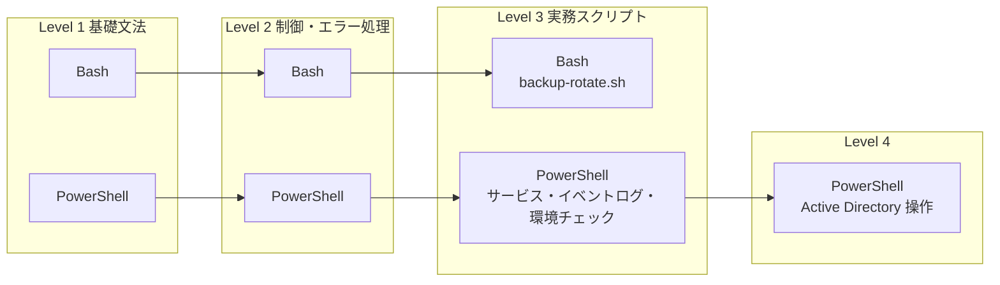

# 06 シェルスクリプト演習設計：Linux (Bash) / Windows (PowerShell) 基礎から実務まで

> **本ドキュメントの位置付け**
>
> [サーバー構築エンジニア学習プラン](./README.md) Phase 1（W4）と Phase 5（W18）の「シェルスクリプト」に関する学習項目・ハンズオンを、[03 構築工程の実務ドキュメント](./03-build-process.md)の様式（仕様・手順・試験項目書）に落とし込んだ**具体的な演習設計**です。[05 Phase 1 演習設計](./05-phase1-exercise-design.md)が Linux の初期構築 1 本を対象にしたのに対し、本書は**シェルスクリプト**という 1 スキル領域を、Linux（Bash）と Windows（PowerShell）の両方で、基礎文法から実務水準のスクリプトまで通しで設計します。
>
> 本リポジトリの「[新規設計を増やさない運用ルール](../evidence-capture-checklist.md)」の対象は **server-monitor の改善設計 06 以降**です。本書は改善設計ではなく学習計画（[05](./05-phase1-exercise-design.md)と同じ位置付け）のため対象外です。
>
> Windows（PowerShell）を扱う理由は、[STATUS.md](../../STATUS.md) が「コードでは埋められない、残っている穴」に挙げる**研修で触れている Windows Server / AD が実測に出ていないこと**に対応するためです。本書はそのうち、Active Directory のユーザー・グループ操作、Windows サービス、イベントログという**運用スクリプトの基礎**を演習として 1 から組み立てます。ドメインコントローラの構築そのもの（forest promotion）は引き続き [Windows / AD 公開再現ラボ](../evidence/templates/windows-ad-lab.md)の領域とし、本書はそのラボが構築済みであることを前提にした操作スクリプトを対象にします。
>
> 本ドキュメントは主に**設計**です。3 章（Bash：Level 1・Level 2・演習A `backup-rotate.sh`・演習B `env-check.sh`）と、4 章のうち Level 1・Level 2・演習A `Backup-Rotate.ps1`（4.1〜4.3 演習Aまで）は、AI 支援セッションの作業環境（Linux コンテナに PowerShell 7 を導入したもの）で実行し記述に反映済みですが、これは**本人が実機（Windows を含む）で再現・検証した記録ではありません**。4 章のうち `Get-Service`／`*-EventLog`／`ActiveDirectory` モジュールに依存する範囲（演習B・演習C・演習D・演習E）は、Windows 実行環境が無いこの AI 支援セッションでは原理的に実行できないため、実施キット（[windows-ps-kit](./windows-ps-kit/README.md)、構文検証済み・機能未実行）としてのみ用意しています。詳細は [8. 実施ステータス](#8-実施ステータスと次のアクション)を参照してください。

最終更新: 2026-08-26

---

## 目次

| 節 | 内容 |
| --- | --- |
| [1](#1-演習の目的スコープ前提条件) | 目的・スコープ・前提条件 |
| [2](#2-bash-と-powershell-の対応関係) | Bash と PowerShell の対応関係 |
| [3](#3-linuxbash演習設計) | Linux（Bash）演習設計：基礎 → 制御・エラー処理 → 実務スクリプト |
| [4](#4-windowspowershell演習設計) | Windows（PowerShell）演習設計：基礎 → 制御・エラー処理 → サービス・イベントログ → Active Directory |
| [5](#5-到達確認) | 到達確認 |
| [6](#6-実施タイムテーブルと中断基準) | 実施タイムテーブルと中断基準 |
| [7](#7-証跡採録計画) | 証跡採録計画 |
| [8](#8-実施ステータスと次のアクション) | 実施ステータスと次のアクション |

---

## 1. 演習の目的・スコープ・前提条件

### 目的

[02 フェーズ別カリキュラム](./02-curriculum.md) は、シェルスクリプトを 2 か所で扱っています。

- **W4**（Phase 1・Linux 基礎）: 「シェルスクリプト（変数・条件分岐・ループ・終了ステータス・`set -euo pipefail`・引数処理）」という学習項目と、「指定ディレクトリを日付付きで固めて保存し、7 世代より古いものを削除するバックアップスクリプトを書く」というハンズオン
- **W18**（Phase 5・自動化・IaC）: 「実務で使うスクリプトの設計（引数・終了ステータス・ログ出力・冪等性の意識）」という学習項目と、「日次バックアップと世代管理を行うスクリプトを実務水準で書き直す」「環境チェックスクリプトを書く」というハンズオン

どちらも**学習項目とハンズオンの見出しだけ**で、[05](./05-phase1-exercise-design.md) が Phase 1 の初期構築に対して行ったような、コマンド・想定結果・試験項目までの具体化はまだされていません。本書はこの差分を埋めます。

あわせて、[01 学習環境の作り方 §6](./01-environment.md#6-windows-server-の学習環境任意) は Windows Server の学習範囲に「PowerShell での一括操作」と 1 行だけ書いており、具体的な演習は未設計でした。本書で Bash と並行して設計します。

### スコープ

| 対象 | 扱い |
| --- | --- |
| Bash の基礎文法（変数・条件分岐・ループ・関数・配列） | **対象**。[3.1](#31-level-1-基礎文法) |
| Bash の制御・エラー処理（`set -euo pipefail`・`trap`・引数解析） | **対象**。[3.2](#32-level-2-制御入出力エラー処理) |
| Bash の実務スクリプト（ログ・排他制御・冪等性・スケジューリング連携） | **対象**。[3.3](#33-level-3-実務スクリプト) |
| PowerShell の基礎文法（変数・条件分岐・ループ・関数・パイプライン） | **対象**。[4.1](#41-level-1-基礎文法) |
| PowerShell の制御・エラー処理（`try`/`catch`・パラメータ検証） | **対象**。[4.2](#42-level-2-制御入出力エラー処理) |
| Windows サービス・イベントログの操作 | **対象**。[4.3](#43-level-3-システム操作サービスイベントログ) |
| ラボドメインに対する AD ユーザー・グループ・OU 操作スクリプト | **対象**。[4.4](#44-level-4-active-directory-運用スクリプト)。**ただしラボドメインが構築済みであることが前提** |
| Active Directory のフォレスト構築・ドメイン参加そのもの（ドメインコントローラのセットアップ） | **対象外**。[Windows / AD 公開再現ラボ §4](../evidence/templates/windows-ad-lab.md#4-greenfield-ad-ds--dns-forest-の構築)で扱う |
| Ansible によるスクリプトの置き換え | **対象外**。[02 W19](./02-curriculum.md#w19-ansible-による構成管理)で扱う |
| クラウド・監視ツールからのスクリプト呼び出し | **対象外**。Phase 6（[02 W23](./02-curriculum.md#w23-監視バックアップ復旧演習)）で扱う |

### 前提条件

| 項目 | Linux（Bash） | Windows（PowerShell） |
| --- | --- | --- |
| 環境（Level 1〜3） | [01 学習環境](./01-environment.md)の VM（[05](./05-phase1-exercise-design.md) の `lab-base01` 相当。Bash 5.x、Ubuntu 24.04 LTS 既定） | [01 学習環境 §6](./01-environment.md#6-windows-server-の学習環境任意)の Windows Server 評価版、または Windows 11 の PowerShell 7（任意・補助トラック） |
| 環境（Level 4・AD のみ） | 該当なし | 上記に加え、[Windows / AD 公開再現ラボ §4](../evidence/templates/windows-ad-lab.md#4-greenfield-ad-ds--dns-forest-の構築)でラボドメインを構築済みであること。**このラボ自体、本書執筆時点では未実施（`NOT RUN`）**（[8 章](#8-実施ステータスと次のアクション)） |
| 権限 | 一般ユーザー + 必要時 `sudo` | Level 1〜3 は一般権限で完結。Level 4（AD 操作）とサービス・イベントログの一部（[4.3](#43-level-3-システム操作サービスイベントログ)）は管理者 PowerShell が必要 |
| 前提知識 | [02 W1-W3](./02-curriculum.md#phase-1-linux-基礎w1-w4)（コマンド・パーミッション・プロセス）を終えていること | Windows のファイル操作・タスクスケジューラ・サービス管理の GUI 操作に慣れていること |
| 位置付け | [24 週学習プラン](./README.md)の**主軸**（第一志望：Linux サーバー構築・運用に直結） | [社内 SE / Windows トラックの位置付け](../evidence-capture-checklist.md#社内-se--windows-トラックの位置付け2026-07-見直し)と同じ**補助トラック**。Linux を優先し、時間が余れば着手する |

> Level 4（AD 操作）は、[Windows / AD 公開再現ラボ](../evidence/templates/windows-ad-lab.md)が使う fail-closed の考え方は踏襲しますが、forest promotion のような承認 marker・二重確認プロンプトまでは要求しません。対象が**ラボ専用 OU 内のユーザー・グループ**に限られ、ドメインコントローラの構築そのものより影響範囲が小さいためです。同じ重さの手順を機械的にコピーしないという判断自体が、[STATUS.md](../../STATUS.md) の「未経験者としての実力に対して内容が高度すぎる」設計を避ける方針に沿っています。

---

## 2. Bash と PowerShell の対応関係

図の要約：Bash・PowerShell それぞれで基礎文法 → 制御・エラー処理 → 実務スクリプトの 3 段階を並行して進めます。Windows 側だけ Active Directory 操作という Level 4 が続きます（[STATUS.md](../../STATUS.md) の差別化材料としての位置付けのため、Bash 側より 1 段階深く設計しています。Bash 側の同等の深さは [02 W19 Ansible](./02-curriculum.md#w19-ansible-による構成管理)が担います）。両言語を同時に学ぶのではなく、**Bash を主軸として先に完走してから、同じ順序で PowerShell を後追いする**進め方を想定しています（[1 章のスコープ](#スコープ)のとおり Windows は補助トラックのため）。

### 概念の対応表

未経験者が最初につまずくのは、**同じ概念が言語ごとに別の名前・別の構文で出てくること**です。先に対応関係を掴んでおくと、2 つ目の言語の習得が速くなります（[現場経験とインフラ運用の橋渡し](../career-bridge.md)が Zabbix / JP1 と Prometheus の概念対応表を作っているのと同じ考え方です）。

| 概念 | Bash | PowerShell | 補足 |
| --- | --- | --- | --- |
| 変数代入 | `name=value`（`=` の前後にスペース不可） | `$name = value` | Bash は文字列がデフォルト型、PowerShell は動的型付けでオブジェクトを保持する |
| 変数参照 | `$name` または `${name}` | `$name` | PowerShell は変数名自体に `$` を含む |
| 条件分岐 | `if [[ cond ]]; then ... fi` | `if (cond) { ... }` | Bash は `[[ ]]` 内が文字列/数値比較の式、PowerShell は `()` 内が真偽値を返す式 |
| ループ | `for i in ...; do ... done` | `foreach ($i in ...) { ... }` | PowerShell には `ForEach-Object`（パイプライン用）と `foreach` 文の 2 系統がある（[4.2](#42-level-2-制御入出力エラー処理)） |
| 関数定義 | `func_name() { ... }` | `function Verb-Noun { ... }` | PowerShell は「動詞-名詞」の命名規約（`Get-`/`Set-`/`Invoke-` 等）が推奨される |
| 配列 | `arr=(a b c)` / `declare -A` で連想配列 | `$arr = @(a, b, c)` / `@{}` でハッシュテーブル | Bash の連想配列は bash 4 以降が必須（[3.1](#31-level-1-基礎文法)） |
| 終了ステータス | `$?`（直前コマンドの 0-255） | `$?`（真偽値）と `$LASTEXITCODE`（ネイティブ exe の数値）の 2 系統 | [3.2](#32-level-2-制御入出力エラー処理) / [4.2](#42-level-2-制御入出力エラー処理)で詳述 |
| エラー時に止める | `set -e` | `$ErrorActionPreference = 'Stop'` + `try`/`catch` | Bash は「失敗コマンドで即終了」（ただし `if`/`while` の条件式や `&&`/`\|\|` の非最後尾など例外がある。詳細は [3.2](#32-level-2-制御入出力エラー処理)）、PowerShell は「例外として捕捉可能にする」という設計思想の違いがある |
| 引数解析 | `getopts` | `param()` ブロック + `[CmdletBinding()]` | PowerShell は型・必須・選択肢を宣言的に書ける分、学習コストがやや高い |
| 排他制御（多重起動防止） | `flock` | `Mutex`（`System.Threading.Mutex`） | [3.3](#33-level-3-実務スクリプト) / [4.3](#43-level-3-システム操作サービスイベントログ) |
| サービス操作 | `systemctl`（[02 W3](./02-curriculum.md#w3-プロセスサービスログ)） | `Get-Service`/`Start-Service`/`Stop-Service`/`Set-Service` | 障害時の自動復旧は Linux が `Restart=on-failure`、Windows は `sc.exe failure` と担当コマンドが分かれる（[4.3](#43-level-3-システム操作サービスイベントログ)） |
| ログ・イベントの検索 | `journalctl`（[02 W3](./02-curriculum.md#w3-プロセスサービスログ)） | `Get-WinEvent` | どちらも構造化ログを条件で絞り込めるが、保持期間・ローテーションの設計思想が異なる |
| 定期実行 | `cron` / systemd timer | タスクスケジューラ（`Register-ScheduledTask`） | [4.3](#43-level-3-システム操作サービスイベントログ) |
| 実行ログの丸ごと記録 | `script -a`（[03 §3](./03-build-process.md#作業ログの取得)） | `Start-Transcript` | [4.3](#43-level-3-システム操作サービスイベントログ) |

---

## 3. Linux（Bash）演習設計

### 3.1 Level 1 基礎文法

[02 W4](./02-curriculum.md#w4-ディスクファイルシステムシェルスクリプト)の学習項目のうち、変数・条件分岐・ループ・関数・配列を扱います。

> **実施記録（2026-08-26）**: AI 支援セッションの作業環境（[3.3 演習 A の実施記録](#33-level-3-実務スクリプト)と同一環境）で L1-1〜L1-5 のハンズオンをすべて実行し、各行の到達確認どおりの結果を確認しました（**本人による実機再現ではありません**）。

| # | 学習項目 | ハンズオン | 到達確認 | つまずきやすい点 |
| --- | --- | --- | --- | --- |
| L1-1 | 変数・クォート（`"..."` / `'...'` / コマンド置換 `$(...)`） | `now=$(date +%Y%m%d)` のように日付を変数化し、`echo "今日は $now"` で展開されることを確認する。シングルクォートで同じことをして展開されないことも確認する | ダブルクォートとシングルクォートの展開の違いを、実際に壊してから説明できる | `name = value`（`=` の前後にスペース）は代入ではなくコマンド実行として解釈される |
| L1-2 | 条件分岐（`if` / `[[ ]]` / `case`） | ファイルの存在確認（`-f`）・実行権限確認（`-x`）を `if [[ ]]` で書く。`case` で引数 `start`/`stop`/`status` を分岐する | `[[ ]]` と `[ ]` の違いを 1 つ挙げて説明できる | `[[ $a == $b ]]` は右辺がクォートなしだとパターンマッチになる（`==` の右辺はグロブとして解釈される） |
| L1-3 | ループ（`for` / `while` / `until`） | `for f in *.log; do ...; done` でファイル一覧を処理する。`while read -r line; do ...; done < file` で 1 行ずつ処理する | `while read` でファイルを行単位に処理できる（`cat file \| while read` との違いも説明できる） | パイプ経由の `while read` はサブシェルで実行されるため、ループ内で更新した変数がループ後に消える（bash・dash 等 POSIX 系シェル全般に共通する落とし穴で bash 固有ではない。bash では `shopt -s lastpipe` で回避できる） |
| L1-4 | 関数・引数（`$1` `$2` `$@` `$#`） | 引数を検証する関数 `require_arg()` を書き、未指定なら使い方を表示して終了する | 関数内の `local` とグローバル変数の違いを説明できる。関数から値を返す 2 通り（`return` の終了ステータスと、`echo` を `$(...)` で受け取るデータ返却）を区別できる | `return` は 0-255 の終了ステータスしか返せない。数値以外のデータを返したい場合は標準出力を `$(...)` で受け取る |
| L1-5 | 配列・連想配列 | ログファイルのパスを配列に入れて `for` で処理する。サービス名 → ポート番号の対応を連想配列（`declare -A`）で持つ | `"${arr[@]}"` のダブルクォートを外すと何が起きるかを実際に壊して確認できる | 連想配列は bash 4 以降が必要（`bash --version` で確認する習慣をつける） |

### 3.2 Level 2 制御・入出力・エラー処理

[02 W4](./02-curriculum.md#w4-ディスクファイルシステムシェルスクリプト)の `set -euo pipefail` と、[02 W18](./02-curriculum.md#w18-シェルスクリプトによる定型化)の「エラーハンドリング」を扱います。

> **実施記録（2026-08-26）**: [3.1 と同じ実施記録](#31-level-1-基礎文法)のとおり、L2-1〜L2-5 のハンズオンをすべて実行し確認しました。L2-2 では、`exit` を明示的に呼ばない単純な `trap '...' EXIT` でも `kill -TERM` で `$?`（`wait` から見た終了コード）が `143` になることを確認し、[3.3 演習 A の T-11 の注記](#試験項目書)にある「`exit "$rc"` を呼んでも `wait` から見た終了コードは `143` のまま」という発見の裏付けになりました（rc を明示的に `exit` するかどうかに関わらず、シグナルによる終了コードは保たれるようです）。

| # | 学習項目 | ハンズオン | 到達確認 | つまずきやすい点 |
| --- | --- | --- | --- | --- |
| L2-1 | `set -euo pipefail` | 既存のスクリプトの先頭に付け、未定義変数の参照や失敗コマンドで実際に止まることを確認する。`if some_cmd; then` の中では `-e` が効かないことも確認する。`local x=$(false)` が `-e` を付けていても止まらないことも確認する | `-e` が効かない場面（`if`/`while` の条件式、`&&`/`\|\|` の非最後尾）を 1 つ実演できる | `-e` を付けても「効かない」と感じる箇所の大半はこの仕様どおりの動作であり、バグではない。特に `local x=$(failing_cmd)` は `local` 自体の終了ステータスが代入の成否と別に評価されるため、`-e` があってもエラーが握りつぶされる（`local x; x=$(failing_cmd)` のように宣言と代入を分けると検知できる） |
| L2-2 | `trap` によるクリーンアップ | 一時ファイルを作るスクリプトに `trap 'rm -f "$tmpfile"' EXIT` を付け、正常終了・`Ctrl-C`・`kill` のいずれでも一時ファイルが消えることを確認する | `EXIT` と `ERR` の違いを説明できる（`ERR` は `set -e` が捕捉するのと同じ条件でのみ発火する） | `trap ... EXIT` は素の `exit` 呼び出しでも発火する（多くの初学者が「異常終了時だけ」と誤解する） |
| L2-3 | 引数解析（`getopts`） | `-s <src> -d <dst> -n <世代数>` を受け取るオプション解析を書く | `getopts` が `--long-option` 形式（GNU ロングオプション）を扱えないことを知っている | `getopts` は外部コマンド `getopt(1)` とは別物で、混同すると挙動が変わる |
| L2-4 | 終了ステータスの設計 | 「対象ディレクトリなし」「権限不足」「ディスク不足」でそれぞれ異なる終了コード（例: 2/3/4）を返すスクリプトを書き、呼び出し側で `case $? in` により分岐する | パイプラインでの `$?` の挙動を、`pipefail` の有無で比較して説明できる（`cmd1 \| cmd2` は既定では `cmd2` の終了ステータスだけが残る） | `cmd1 \| cmd2 \|\| echo fail` は `pipefail` なしでは `cmd1` の失敗を検知できない |
| L2-5 | 標準出力・標準エラー出力の分離 | 処理結果は標準出力、ログ・警告は標準エラー出力に分けて書く。`script.sh >out.log 2>err.log` で分離を確認する | 標準出力だけをパイプで後続処理に渡し、ログはターミナルに残す、という使い分けができる | `echo` はデフォルトで標準出力に出る。ログ用途なら明示的に `>&2` を付ける |

### 3.3 Level 3 実務スクリプト

[02 W18](./02-curriculum.md#w18-シェルスクリプトによる定型化)の 2 つのハンズオンを、[03 構築工程の実務ドキュメント](./03-build-process.md)の様式で具体化します。**演習 A（バックアップ・世代管理）を Linux 側のフラッグシップ演習とし、[05](./05-phase1-exercise-design.md)と同水準の手順・試験項目まで設計します。**

#### 演習 A（フラッグシップ）: `backup-rotate.sh`

##### 仕様

| 項目 | 内容 |
| --- | --- |
| 目的 | 指定ディレクトリを日付付きで `tar.gz` に固め、指定世代数より古いものを削除する。多重起動を防止し、成功・失敗をログに残す |
| 呼び出し形式 | `backup-rotate.sh -s <対象ディレクトリ> -d <バックアップ先ディレクトリ> -n <保持世代数>` |
| 実行方法 | 対話シェルからの手動実行、および cron / systemd timer からの非対話実行の両方に対応する |
| 終了コード | `0`=成功／`1`=引数エラー／`2`=対象ディレクトリなし／`3`=バックアップ先へ書き込み不可／`4`=多重起動（ロック取得失敗）／`5`=`tar` 失敗（ディスク不足等） |
| ログ出力先 | `<バックアップ先ディレクトリ>/backup-rotate.log`（`YYYY-MM-DD HH:MM:SS [LEVEL] message` 形式で追記） |
| ロック方式 | `flock -n` を使い、同一バックアップ先に対する多重起動を拒否する |

##### 構築手順（段階的に機能を積む）

| No | 段階 | 追加する内容 | 想定結果 | 判定 |
| --- | --- | --- | --- | --- |
| A-1 | 骨組み | `#!/usr/bin/env bash` と `set -euo pipefail`、`getopts` によるオプション解析、使い方表示 | 引数なしで実行すると使い方を表示して終了コード `1` | `echo $?` が `1` |
| A-2 | 事前確認 | 対象ディレクトリの存在確認（`[[ -d $src ]]`）、バックアップ先への書き込み確認（`[[ -w $dst ]]`） | 存在しないディレクトリを指定すると終了コード `2` | ログにも原因が 1 行残る |
| A-3 | ロック | `exec 200>"$dst/.backup.lock"; flock -n 200 \|\| exit 4` を関数化する | 同じバックアップ先に対して 2 つ目を同時実行すると即座に終了コード `4` | 1 つ目は継続して正常終了する |
| A-4 | ログ関数 | `log() { printf '%(%F %T)T [%s] %s\n' -1 "$1" "$2" \| tee -a "$logfile" >&2; }` のようなログ関数を用意し、各段階で呼ぶ | `log INFO "backup started"` がログファイルと標準エラー出力の両方に出る | タイムスタンプの書式が統一されている |
| A-5 | バックアップ本体 | `tar -czf "$dst/backup-$(date +%Y%m%d-%H%M%S).tar.gz" -C "$(dirname "$src")" "$(basename "$src")"` | 生成された `tar.gz` を別ディレクトリへ展開し、元の対象ディレクトリと `diff -r` で差分なし | 展開後の内容が一致する |
| A-6 | `trap` によるロック解放・後始末の保証 | `trap 'rc=$?; flock -u 200 2>/dev/null; [[ $rc -ne 0 && -n "${outfile:-}" && -e "$outfile" ]] && rm -f "$outfile"; log INFO "exit code=$rc"; exit "$rc"' EXIT` を **A-3（ロック取得）の直後**に置く（`$?` を `rc` へ退避してから解放・後始末を行い、最後に `exit "$rc"` で本来の終了コードを明示的に復元する。単に `flock -u 200; log INFO "exit code=$?"` だと `$?` が `flock -u` 自身の終了コードに上書きされ、`log` の終了コードがそのままスクリプトの最終終了コードになってしまう） | `kill -TERM` で中断させても、ロックファイルが解放され次回実行がブロックされない。`tar` 失敗時は中途半端な `.tar.gz` が残らない | 中断後すぐに再実行が成功する。呼び出し元が見る終了コードが常に元の値（2/3/4/5 等）と一致する。A-1・A-2 のように A-3 より前で終了する経路ではこの trap は未登録のため発火しない（後始末対象がまだ無いので問題ない） |
| A-7 | 世代管理 | バックアップ先の `backup-*.tar.gz` を更新日時順に並べ、`-n` で指定した世代数を超えた分だけ `rm` する（`ls -t` を使い、移植性の低い `find -printf` は避ける） | 世代数を `3` にして 5 回実行すると、最新 3 世代だけが残る | 削除順が古い順になっている（新しいものを誤って消していない）。`ls` 出力のパースは一般にファイル名の空白等で壊れうる（shellcheck SC2012）が、本演習の生成ファイル名は `backup-YYYYmmdd-HHMMSS.tar.gz` の固定形式のため許容している |

##### 試験項目書

異常系 5 件 / 全 12 件（約 42%）で、[03 §4](./03-build-process.md#異常系を必ず入れる理由)が定める「異常系 3 割以上」を満たします。

> **実施記録（2026-08-26）**: AI 支援セッションの作業環境（コンテナ、`Linux 6.18.44-fc-v21`、bash 5.2.21、root 権限）で本演習を実装・実行し、下表の 12 項目すべてを採録しました（12/12 OK）。**本人がこの結果を実機で再現・検証した記録ではありません**（[README の AI の利用について](../../README.md#ai-の利用について)と同じ区別）。想定していた Ubuntu 24.04 LTS の `lab-base01` とは別環境のため、T-07・T-09・T-11 は環境差分に応じた代替手順で確認しています（各行末の注記を参照）。raw ログはこのセッションの一時領域にのみ存在し、[7 章の証跡採録計画](#7-証跡採録計画)が想定する `server-monitor` 側への保存はまだ行っていません（エビデンス列は「セッション内実行記録」と表記）。

| No | 試験分類 | 観点 | 前提条件 | 手順 | 期待結果 | 実測結果 | 判定 | エビデンス | 実施日 |
| --- | --- | --- | --- | --- | --- | --- | --- | --- | --- |
| T-01 | 単体 | 実行権限 | スクリプト配置済み | `chmod +x backup-rotate.sh` 後に `./backup-rotate.sh -h` | 使い方が表示される | 終了コード一覧を含む使い方が表示された。`exit=0` | OK | セッション内実行記録 | 2026-08-26 |
| T-02 | 単体 | 正常バックアップ生成 | 対象ディレクトリにテストファイル数点 | `./backup-rotate.sh -s ./src -d ./dst -n 3` | `dst/backup-<日時>.tar.gz` が生成される。終了コード `0` | `dst/backup-20260826-041849.tar.gz` が生成された。`exit=0` | OK | セッション内実行記録 | 2026-08-26 |
| T-03 | 単体 | バックアップ内容の整合性 | T-02 完了後 | 生成物を別ディレクトリへ展開し `diff -r ./src <展開先>` | 差分なし | `diff -r` の出力なし（差分なし） | OK | セッション内実行記録 | 2026-08-26 |
| T-04 | 単体 | ログ記録 | T-02 完了後 | `cat dst/backup-rotate.log` | 開始・完了のログ行が時刻付きで記録されている | `[INFO] backup started` / `backup created` / `backup completed successfully` / `exit code=0` の 4 行が時刻付きで記録された | OK | セッション内実行記録 | 2026-08-26 |
| T-05 | 結合 | 世代管理 | 各実行の間に `sleep 1` を挟みながら `-n 3` で 5 回実行（タイムスタンプが秒単位のため、間隔を空けないと同名ファイルが上書きされ世代数が想定と変わる） | `ls dst/backup-*.tar.gz \| wc -l` | `3`（最新 3 世代のみ） | 5 回実行後、最新 3 世代（`041903`/`041904`/`041905`）のみ残存。`wc -l` = `3` | OK | セッション内実行記録 | 2026-08-26 |
| T-06 | 結合 | ロック正常解放 | 正常終了後 | 続けて同じコマンドを再実行 | 待たされずに開始できる | `real 0m0.027s` で完了。ロック待ちなし | OK | セッション内実行記録 | 2026-08-26 |
| T-07 | 総合 | cron 経由の非対話実行 | crontab に 1 分後実行を登録 | 実行後 `dst` を確認 | 対話シェルと同じ結果が得られる（環境変数・`PATH` 差異がないことを確認） | `env -i PATH=/usr/bin:/bin ...` の最小環境から絶対パスで実行し、対話シェルと同じ結果（`exit=0`）。実 crontab への登録はしていない（注 1） | OK（代替手順） | セッション内実行記録 | 2026-08-26 |
| T-08 | 異常系 | 対象ディレクトリなし | `-s` に存在しないパスを指定 | `./backup-rotate.sh -s ./no-such-dir -d ./dst -n 3` | 終了コード `2`。ログに原因が記録される | `exit=2`。ログに `対象ディレクトリが存在しません: ./no-such-dir` を記録 | OK | セッション内実行記録 | 2026-08-26 |
| T-09 | 異常系 | バックアップ先へ書き込み不可 | `chmod 555 ./dst` | 同上コマンドを実行 | 終了コード `3` | `chattr +i ./dst`（immutable 属性）で再現。`chmod 555` は root 権限では無効だった（注 2）。`exit=3` | OK（代替手順） | セッション内実行記録 | 2026-08-26 |
| T-10 | 異常系 | 多重起動 | 1 つ目をバックグラウンドで起動し `tar` 実行中に | 2 つ目を同じ引数で起動 | 2 つ目は即座に終了コード `4`。1 つ目は正常終了する | 2 つ目は即座に `exit=4`。1 つ目は約 3 秒後に `exit=0` で正常完了 | OK | セッション内実行記録 | 2026-08-26 |
| T-11 | 異常系 | 実行中の強制終了 | `tar` 実行中に対象プロセスへ `kill -TERM` | 終了後に `flock -n` で再度ロックを取得できるか確認 | ロックが解放されており、再実行がブロックされない | `kill -TERM` 送信後、即再実行が `real 0m0.026s` で成功（ロック解放を確認）。ログの `exit code=` は trap 内で捕捉した `$?`（`0`）を記録しており、`wait` で観測した実プロセスの終了コード `143`（SIGTERM 由来）とは一致しなかった（注 3） | OK | セッション内実行記録 | 2026-08-26 |
| T-12 | 異常系 | ディスク容量不足 | バックアップ先を極小 tmpfs（例: 1MB）にマウントして実行 | `./backup-rotate.sh -s ./src -d <tmpfs> -n 3` | `tar` が失敗し終了コード `5`。中途半端な `.tar.gz` が残らない（`trap` で後始末する設計にする） | 1MB tmpfs を 950KB まで埋めた状態で 300KB の非圧縮データを対象に実行。`gzip: No space left on device` で `tar` が失敗し `exit=5`。`.tar.gz` は残らなかった（trap の後始末を確認） | OK | セッション内実行記録 | 2026-08-26 |

> **注 1（T-07）**: 実際の `crontab` への登録はしておらず、`env -i` で構成した最小環境（`PATH`/`HOME`/`SHELL` のみ）から絶対パスで起動する代替で「対話シェルと異なる実行コンテキストでも動く」ことを確認しました。cron デーモン経由の実行そのものは未確認です。
>
> **注 2（T-09）**: このセッションは常に root 権限で動作しており、Linux の DAC（パーミッションビットによるアクセス制御）は root に対して働かないため、`chmod 555` では書き込み不可を再現できないことを実行して確認しました（`touch` が成功してしまう）。代わりに `chattr +i`（immutable 属性）を使ったところ、`bash [[ -w ]]` が正しく「書き込み不可」と判定し、設計どおり `exit=3` になりました。
>
> **注 3（T-11）**: `trap ... EXIT` は SIGTERM でも発火し、ロック解放とクリーンアップという**設計上の要件は満たしています**。ただし `rc=$?` が捕捉する値は、シグナルによる強制終了時には期待どおりの値（128+15=143 相当）にならず `0` になりました。EXIT トラップ内の `exit "$rc"` も、シグナルによる終了処理には反映されないようです（`wait` で観測される実際の終了コードは `143` のまま）。設計書の記述（[3.2 L2-2](#32-level-2-制御入出力エラー処理)、[2 章の対応表](#2-bash-と-powershell-の対応関係)）はロック解放・クリーンアップの発火自体については正確ですが、シグナル終了時の `$?` の具体的な値までは踏み込んでいませんでした。ログの記録用途では問題ありませんが、シグナル終了時の終了コードを呼び出し元へ正確に伝えたい場合は、追加の検証が必要です。

#### 演習 B: `env-check.sh`

[02 W18](./02-curriculum.md#w18-シェルスクリプトによる定型化)の「環境チェックスクリプトを書く（サービス稼働・ディスク使用率・証明書残日数・時刻同期を一括確認）」を、通常のハンズオン粒度で設計します。

> **実施記録（2026-08-26）**: [演習 A と同じ AI 支援セッションの作業環境](#演習-aフラッグシップ-backup-rotatesh)で、この演習を実装・実行しました（**本人による実機再現ではありません**）。B-2（ディスク使用率）と B-3（証明書残日数）は、しきい値超過・証明書期限間近の両方の異常系を含めて設計どおりに動作することを確認しました。B-1（サービス稼働）・B-4（時刻同期）は `systemctl`/`timedatectl` を使いますが、**このセッションのコンテナは systemd が PID 1 として起動していない**ため、実際のサービス起動・停止に対する検知はできず、`systemctl is-active` 自体が `System has not been booted with systemd as init system... Can't operate.` で失敗する状態しか確認できませんでした（この失敗も非ゼロ終了として正しく `FAIL` 扱いになることは確認済み）。集約ロジック（B-5）は、`systemctl`/`timedatectl` をスタブに置き換えて全項目 OK になる経路と、`OK 4 / FAIL 0` → 終了コード `0` になることも別途確認しました。

| # | 学習項目 | ハンズオン | 到達確認 | つまずきやすい点 |
| --- | --- | --- | --- | --- |
| B-1 | サービス稼働確認 | `systemctl is-active` を対象サービスの配列に対してループし、非 `active` があれば記録する | 1 つでも異常があれば終了コードを非ゼロにできる | `systemctl is-active` 自体が非 `active` 時に非ゼロを返すため、`set -e` の下ではループが途中で止まる（`\|\| true` や `if` での明示的な捕捉が必要）。コンテナ環境では systemd が PID 1 でないと `systemctl` 自体が使えない（上記実施記録を参照） |
| B-2 | ディスク使用率確認 | `df --output=pcent,target` を解析し、しきい値（例: 80%）を超えたマウントポイントを列挙する | 数値比較（`-gt`）と文字列比較（`>`）の違いを説明できる | `df` の出力の `%` 記号を数値比較の前に取り除く必要がある |
| B-3 | 証明書残日数確認 | `openssl x509 -enddate -noout -in cert.pem` の出力を `date -d` で秒数に変換し、残日数を計算する | 期限切れ間近（例: 7 日以内）の証明書を検知できる | `date -d` の日付書式は環境（`LANG`/`LC_TIME`）依存で崩れることがある。`openssl x509 -checkend` を使う代替案も比較する |
| B-4 | 時刻同期確認 | `timedatectl show --property=NTPSynchronized --value` を確認する | 同期が外れている状態を意図的に作り（NTP サービス停止）、検知できることを確認する | 同期直後は `yes` にならないことがある（[05 の T-03 と同じ注意](./05-phase1-exercise-design.md#5-試験項目書)）。B-1 と同じく、コンテナ環境では systemd が PID 1 でないと `timedatectl` 自体が使えない |
| B-5 | 結果の集約 | 各チェックの結果を配列に集め、最後に集計してサマリを 1 行で出力する（例: `OK: 3 / WARN: 1 / FAIL: 0`） | 個別チェックが 1 つでも `FAIL` なら全体の終了コードが非ゼロになる | 途中のチェックで `set -e` により早期終了しないよう、個別チェックの失敗は明示的に捕捉してから集計する設計にする |

---

## 4. Windows（PowerShell）演習設計

### 4.1 Level 1 基礎文法

> **実施記録（2026-08-26）**: AI 支援セッションの作業環境（Linux コンテナに PowerShell 7.4.6 を導入したもの。[4.3 演習A の実施記録](#43-level-3-システム操作サービスイベントログ)と同一環境）で L1-1〜L1-5 のハンズオンをすべて実行し、各行の到達確認どおりの結果を確認しました（**本人による実機（Windows）再現ではありません**）。L1-2 の「配列との `-eq $null` 比較」は、要素数 2 以上の配列に `$null` を含む場合にのみ `if` が常に真になることを、複数パターンで実際に確認しました（含まない場合は正しく偽になります）。

| # | 学習項目 | ハンズオン | 到達確認 | つまずきやすい点 |
| --- | --- | --- | --- | --- |
| L1-1 | 変数・型 | `$today = Get-Date -Format 'yyyyMMdd'` のように変数へ代入し、`"今日は $today"` で文字列展開する。`(Get-Date).GetType()` も試し、`-Format` の有無で型が変わることを比較する | `Get-Date -Format ...` は文字列（`String`）を返すため `$today.GetType()` は `String` になることを確認できる。`-Format` を外した `(Get-Date).GetType()` は `DateTime` になり、変数が文字列だけでなくオブジェクトも保持できることを確認できる | `$today` のようにドル記号が変数名の一部（Bash の `$name` が「参照時にだけ付く記号」なのに対し PowerShell は「変数名そのものに含まれる」という違い）。`-Format` を付けると戻り値の型が `DateTime` から `String` に変わる点を混同しない |
| L1-2 | 条件分岐（`if` / `switch`） | `Test-Path` でファイル存在確認をし `if` で分岐する。引数 `start`/`stop`/`status` を `switch` で分岐する | `-eq`/`-like`/`-match` の使い分けを説明できる。`$null` との比較は必ず `$null` を左辺に書く理由を説明できる | `if ($a = $b)` は代入であり比較にならない（`-eq` を使う）。`-eq`/`-like`/`-match` は既定で大文字小文字を区別しない（区別するには `-ceq`/`-clike`/`-cmatch`）。`$var -eq $null` は `$var` が配列だと「各要素との比較結果の配列」を返し、要素数 2 以上ならその配列は常に真と評価されるため誤判定になる。`$null -eq $var` の順で書けば `$null` はスカラーなのでこの罠を避けられる |
| L1-3 | ループ（`foreach` / `while`） | `Get-ChildItem *.log` の結果を `foreach` で 1 件ずつ処理する | `foreach ($item in $collection)` と `$collection \| ForEach-Object { ... }` の違いを説明できる（詳細は [4.2](#42-level-2-制御入出力エラー処理)） | `foreach` 文はコレクション全体を先にメモリへ展開する。巨大な結果セットではパイプライン処理（`ForEach-Object`）の方が適することがある |
| L1-4 | 関数・パラメータ | `Test-DiskUsage` のような「動詞-名詞」形式の関数を定義し、引数を受け取る | PowerShell の命名規約（承認済み動詞: `Get-`/`Set-`/`Test-`/`Invoke-` 等）を `Get-Verb` で確認できる | 関数の戻り値は `return` の式だけでなく、途中の出力すべてがパイプラインに混ざる（[4.2](#42-level-2-制御入出力エラー処理)の `Write-Host` の説明と合わせて理解する） |
| L1-5 | 配列・ハッシュテーブル | サービス名の配列を `$services = @('W32Time', 'Spooler')` で作る。名前 → 説明の対応をハッシュテーブル `@{}` で持つ | `$arr.Count` と `$hash.Keys` の取得ができる | 要素数 1 の配列はパイプラインを通ると単一オブジェクトとして扱われることがある（`,$arr` で強制的に配列として扱う場面がある） |

### 4.2 Level 2 制御・入出力・エラー処理

> **実施記録（2026-08-26）**: [4.1 と同じ実施記録](#41-level-1-基礎文法)のとおり、L2-1〜L2-5 のハンズオンをすべて実行し確認しました。ただし L2-2 は、`Get-Service` コマンドレット自体が Linux 版 PowerShell 7 に存在しない（Windows 専用）ため、`Get-Item -Path <存在しないパス>` に置き換えて実行しました。終端エラー・非終端エラーの一般的な挙動（`-ErrorAction Stop` の有無で `try`/`catch` に捕捉されるかどうか）は `Get-Service` と同じ PowerShell 共通のエラーモデルによるものなので確認できていますが、`Get-Service` 固有のエラーメッセージ・型は未確認です。

| # | 学習項目 | ハンズオン | 到達確認 | つまずきやすい点 |
| --- | --- | --- | --- | --- |
| L2-1 | 出力ストリームの使い分け（`Write-Output`/`Write-Host`/`Write-Error`/`Write-Verbose`） | 同じスクリプト内でこの 4 つを使い分け、`.\script.ps1 \| Out-File result.txt` で何が記録され何が記録されないかを確認する | `Write-Host` はパイプラインに乗らず、変数へも `$x = .\script.ps1` の形では捕捉されないことを確認できる | 学習初期は結果確認のために安易に `Write-Host` を使いがちだが、後工程で結果を加工・捕捉できなくなる |
| L2-2 | `try` / `catch` / `finally` とエラー方針 | `Get-Service -Name '存在しないサービス名' -ErrorAction Stop` を `try` で囲み `catch` で捕捉する。`-ErrorAction Stop` を外すとどうなるかも確認する | 終端エラー（terminating）と非終端エラー（non-terminating）の違いを、`-ErrorAction Stop` の有無で実演できる | 既定では多くのコマンドレットのエラーは非終端エラーであり、`try`/`catch` だけでは捕まらない |
| L2-3 | パラメータ検証（`param()` / `[CmdletBinding()]`） | `[Parameter(Mandatory=$true)]` と `[ValidateSet('start','stop','status')]` を使ったスクリプトを書く | 不正な値を渡すと、スクリプト本体が実行される前に PowerShell 自身がエラーを出すことを確認できる | 検証はスクリプトの処理より前（パラメータバインディング時）に働くため、`try`/`catch` の外側で失敗する |
| L2-4 | 終了コードの設計（`exit` / `$LASTEXITCODE` / `$?`） | `exit 2` を使うスクリプトを書き、別プロセスから `powershell.exe -File script.ps1; echo $LASTEXITCODE` で終了コードを確認する | `$?` （直前コマンドが成功したかの真偽値）と `$LASTEXITCODE`（直前に実行したネイティブ exe の終了コード）の違いを説明できる | ネイティブ exe（`ping.exe` 等）が非ゼロで終了しても、PowerShell はそれだけでは例外を投げない。`$LASTEXITCODE` を自分で確認する必要がある |
| L2-5 | ログの分離 | 処理結果はパイプラインへ、ログは `Write-Verbose`（`-Verbose` オプション時のみ表示）で分ける | `-Verbose` の有無で出力が変わることを確認できる | Bash の「標準出力とエラー出力の分離」と発想は同じだが、PowerShell は**ストリームの本数が多い**（本書では主要な数本を扱う） |

### 4.3 Level 3: システム操作（サービス・イベントログ）

02 W18 の「環境チェックスクリプトを書く」を PowerShell 側でも設計します。加えて、Windows 特有の運用対象である**サービス**と**イベントログ**を単独の演習として設計し、両方を組み合わせたスクリプトを本書 2 本目のフラッグシップ演習（演習 C）とします。AD DS のような破壊的操作は伴わず、単体の Windows 端末で完結するため、補助トラックの中でも着手しやすい設計にしています。

#### 演習 A: `Backup-Rotate.ps1`

[3.3 演習 A](#演習-aフラッグシップ-backup-rotatesh)の PowerShell 版を、通常のハンズオン粒度で設計します。

> **実施記録（2026-08-26）**: AI 支援セッションの作業環境（Linux コンテナに PowerShell 7.4.6 を導入したもの）で A-1〜A-4 のとおりに実装・実行し、生成物を `Expand-Archive` で展開して元と一致すること（A-1）、`Keep` を超えた世代だけが削除されること（A-2）、2 重起動時に 2 つ目のインスタンスが `Mutex.WaitOne(0)` で `$false` を受け取り安全に終了すること（A-3）、`SourcePath` 不正時の異常系でも `finally` により transcript が閉じられ Mutex が解放され、直後の実行に影響しないこと（A-4）を確認しました（**本人による実機（Windows）再現ではありません**）。`Compress-Archive`／`[System.Threading.Mutex]`／`Start-Transcript` はいずれも Linux 版 PowerShell 7 でも動作するクロスプラットフォームな機能のため、この確認は成立します。実装は [windows-ps-kit](./windows-ps-kit/README.md) の `backup-rotate/Backup-Rotate.ps1` を参照してください。
>
> **追記（同日・本人が実機で初回実行）**: 本人が Windows PowerShell 5.1 で `Backup-Rotate.ps1` を実行したところ、`ParserError: MissingCatchOrFinally` で読み込み自体に失敗する事象に遭遇した。原因は `windows-ps-kit` の全 `.ps1` が UTF-8（BOM なし）で保存されており、Windows PowerShell 5.1 は BOM なしの `.ps1` を既定でシステムの ANSI コードページとして読み込むため日本語コメント・文字列が文字化けしていたこと（PowerShell 7／Core では BOM の有無に関わらず UTF-8 として扱うため、AI 支援セッションの Linux コンテナでは再現しなかった）。全 `.ps1` に UTF-8 BOM を付与して修正した（詳細は [windows-ps-kit README の未検証の範囲](./windows-ps-kit/README.md#未検証の範囲)）。この修正はエンコーディングの付与のみで、スクリプトのロジック自体（A-1〜A-4）は変更していない。

| # | 学習項目 | ハンズオン | 到達確認 | つまずきやすい点 |
| --- | --- | --- | --- | --- |
| A-1 | 圧縮バックアップ | `Compress-Archive -Path $src -DestinationPath "backup-$(Get-Date -Format yyyyMMdd-HHmmss).zip"` | 生成物を `Expand-Archive` で展開し元と一致することを確認する | `Compress-Archive` は既定で対象フォルダ名を zip 内の最上位に含める（Bash の `tar -C` によるパス制御と挙動が異なる） |
| A-2 | 世代管理 | `Get-ChildItem -Filter 'backup-*.zip' \| Sort-Object LastWriteTime -Descending \| Select-Object -Skip $keep \| Remove-Item` | 世代数を超えた分だけ削除される | `Sort-Object` の既定は昇順のため `-Descending` を明示しないと新しいものを消してしまう |
| A-3 | 排他制御 | `[System.Threading.Mutex]::new($false, 'Global\BackupRotate')` を作成した後、両方のインスタンスで `WaitOne(0)` を呼ぶ。1 つ目は `$true`（ロック取得）、2 つ目は即座に `$false` を受け取ることを確認する | Bash の `flock` と同じ目的をどう PowerShell で実現するか説明できる | コンストラクタの第 1 引数 `$false`（initiallyOwned）は「作成時点でロックを保持しない」という意味で、呼ぶだけではロックを取得しない。`WaitOne()` を明示的に呼んで初めてロックを取得する。Mutex は明示的に `ReleaseMutex()`/`Dispose()` しないと解放されないため、`try`/`finally` で確実に解放する設計にする |
| A-4 | ログ記録 | `Start-Transcript` で開始し、`finally` ブロックで `Stop-Transcript` を呼ぶ | スクリプトを異常終了させても transcript が正しく閉じることを確認する | `Start-Transcript` を多重に開始しようとすると `Transcription has already been started. Use the -Force parameter to start a new transcript.` というエラーになる（既定では非終端エラーのため `-ErrorAction Stop` を付けないと `try`/`catch` で捕まらない）。`try`/`finally` の対で管理する |

#### 演習 B: Windows サービスの操作

> **未実施**: `Get-Service`／`Set-Service` 等はコマンドレット自体が Linux 版 PowerShell 7 に存在しないため、AI 支援セッションでは実行できません。[windows-ps-kit](./windows-ps-kit/README.md)を参照してください。

| # | 学習項目 | ハンズオン | 到達確認 | つまずきやすい点 |
| --- | --- | --- | --- | --- |
| S-1 | サービス状態の確認 | `Get-Service` で対象サービス一覧の `Status`/`StartType` を取得する。`services.msc` の表示と突き合わせる | `Get-Service -Name` と `Get-Service -DisplayName` の違いを説明できる | サービス名（`Name`）と表示名（`DisplayName`）は別物で、`-Name` にはサービス名を渡す |
| S-2 | 起動・停止 | 非重要なサービス（例: `Spooler`）を `Stop-Service` → `Start-Service` で操作し、状態遷移を確認する | 依存関係のあるサービスを停止しようとした場合の挙動（`-Force` の要否）を説明できる | 依存されているサービスを `-Force` なしで停止しようとするとエラーになる。事前に `-WhatIf` で確認する習慣をつける |
| S-3 | スタートアップ種別の変更 | `Set-Service -StartupType Manual` / `Automatic` を試し、再起動なしで設定が反映されることを確認する | `Automatic`・`Manual`・`Disabled` の違いを説明できる。「自動（遅延開始）」は Windows PowerShell 5.1 の `Set-Service` では設定できず `sc.exe config <name> start= delayed-auto` の併用が必要だが、PowerShell 7.1 以降は `Set-Service -StartupType AutomaticDelayedStart` で直接設定できることを知っている | `Set-Service` はバージョンによってコマンドレットだけで完結しない設定項目があり、古い `sc.exe` を併用する場面が残っている（`sc.exe` の `key= value` 形式は `=` の直後に半角スペースが必須） |
| S-4 | 障害時の自動復旧設定 | `sc.exe failure <サービス名> reset= 86400 actions= restart/60000` で「失敗時に 60 秒後リスタート」を設定し、直後に `if ($LASTEXITCODE -ne 0) { throw "sc.exe failed: $LASTEXITCODE" }` で成否を確認する | この設定が PowerShell 標準コマンドレットには存在しない（`sc.exe` 併用が必要な）ことを説明できる | `sc.exe` はネイティブ exe のため、失敗しても `try`/`catch` では捕まらない。[4.2 L2-4](#42-level-2-制御入出力エラー処理)と同じく `$LASTEXITCODE` を自分で確認する必要がある。Linux の `systemd` の `Restart=on-failure`（[02 W3](./02-curriculum.md#w3-プロセスサービスログ)）に相当する機能だが、設定方法が全く異なる |
| S-5 | サービス障害の検知 | 対象サービスを意図的に `Stop-Service` した状態を「異常」とみなし、`Get-Service` の結果から検知するチェック関数 `Test-ServiceRunning` を書く | [演習 C](#演習-cフラッグシップ-invoke-environmentcheckps1)のサービス確認部分がこの関数を再利用できる設計になっている | サービスが「存在しない」（`Get-Service` がエラー）のと「存在するが停止中」は別のエラーとして扱う必要がある（[4.2 L2-2](#42-level-2-制御入出力エラー処理)の非終端エラーの扱いと同じ論点） |

#### 演習 C: イベントログの操作

> **バージョン制約**: `New-EventLog`/`Write-EventLog`/`Clear-EventLog`/`Remove-EventLog` など classic の `*-EventLog` 系コマンドレットは、PowerShell 7（Core）への移植時に含まれず存在しません（Windows PowerShell 5.1 専用）。読み取り専用の `Get-WinEvent` は両バージョンで動作しますが、本演習の書き込み・作成・クリア操作（E-1・E-2・E-4、および [演習 C（フラッグシップ）の C-6](#演習-cフラッグシップ-invoke-environmentcheckps1)）は **Windows PowerShell 5.1 での実施を前提**にします。

| # | 学習項目 | ハンズオン | 到達確認 | つまずきやすい点 |
| --- | --- | --- | --- | --- |
| E-1 | カスタムログ・ソースの作成 | 管理者権限で `New-EventLog -LogName 'PortfolioLab' -Source 'EnvCheck'` を実行する | 既存のログ名・ソース名と重複しないことを確認してから作成できる | ログ・ソースの作成には管理者権限が必要。一般ユーザーで実行すると権限エラーになる |
| E-2 | イベントの書き込み | `Write-EventLog -LogName 'PortfolioLab' -Source 'EnvCheck' -EventId 1000 -EntryType Information -Message '...'` で書き込む | `EntryType`（`Information`/`Warning`/`Error`）を使い分けて書き込める | `-EventId` の指定範囲に制限があるため、事前にドキュメントで確認してから採番規則を決める |
| E-3 | イベントの検索・絞り込み | `Get-WinEvent -LogName 'PortfolioLab'` で全件、`-FilterHashtable @{LogName='PortfolioLab'; Level=2}` でエラーのみに絞り込む | 直近 1 時間・特定 `EventId`・特定 `EntryType`（`Level`）の 3 通りで絞り込みができる | `Get-EventLog` だけでなく `New-EventLog`/`Write-EventLog`/`Clear-EventLog`/`Remove-EventLog` など classic の `*-EventLog` 系コマンドレット全体が PowerShell 7（Core）には存在しない（上記バージョン制約を参照）。読み取りは両バージョン対応の `Get-WinEvent` を使う |
| E-4 | エクスポートとクリア | `Get-WinEvent \| Export-Csv` で外部保存してから `Clear-EventLog` でログをクリアする（**ラボ専用ログのみ**に限定する） | クリア前にエクスポートが完了していることを確認する運用を徹底できる | `Clear-EventLog`/`Remove-EventLog` はシステムログ（`Application`/`System` 等）に対しては実施しない。本演習はラボ専用ログ `PortfolioLab` のみを対象にする |
| E-5 | 障害検知への応用 | [演習 B](#演習-b-windows-サービスの操作)で検知したサービス異常を、イベントとして記録する処理を組み合わせる | サービス異常発生 → イベント記録 → `Get-WinEvent` で検知、という一連の流れを再現できる | イベントログへの書き込み自体が失敗するケース（権限不足）も想定し、書き込み失敗時にせめて transcript には残す設計にする |

#### 演習 C（フラッグシップ）: `Invoke-EnvironmentCheck.ps1`

演習 B・演習 C（サービス・イベントログ）と、Bash 側 [演習 B](#演習-b-env-checksh) の PowerShell 版（ディスク使用率・証明書残日数）を統合します。

> **実施記録（2026-08-26）**: 実装は [windows-ps-kit](./windows-ps-kit/README.md) の `flagship/Invoke-EnvironmentCheck.ps1` に用意しました。`Get-Service`（C-3）・`Write-EventLog`（C-6）・`Cert:` ドライブ（C-4）は AI 支援セッションの Linux コンテナでは利用できないため未実行です。ディスク使用率チェック（C-2、`Get-PSDrive -PSProvider FileSystem` を利用）だけは関数を単体で切り出して実行し、しきい値超過時に `WARN` になることを確認しました。スクリプト全体は PowerShell の構文パーサーでエラーが無いことを確認済みですが、Windows 実機での通し実行（C-1・C-5・C-7・C-8、[試験項目書](#試験項目書)の T-01〜T-14）は未実施です。

##### 仕様

| 項目 | 内容 |
| --- | --- |
| 目的 | ディスク使用率・対象サービスの稼働・証明書の残日数を一括確認し、結果をカスタムイベントログへ記録したうえで、異常があれば非ゼロで終了する |
| 呼び出し形式 | `Invoke-EnvironmentCheck.ps1 -Services <String[]> -DiskThresholdPercent <int> -CertPath <String[]> -CertExpiryWarningDays <int> -EventLogName <string> -EventSource <string>` |
| 終了コード | `0`=すべて正常／`1`=パラメータ不正／`2`=1 件以上 `WARN`／`3`=1 件以上 `FAIL` |
| ログ出力先 | `Start-Transcript` によるフル記録に加え、[演習 C](#演習-c-イベントログの操作)のログ・ソースへサマリを記録する。標準出力へは各チェック結果を `[pscustomobject]` の配列として返す |
| 対象範囲 | ドメインコントローラを前提にしない。単体の Windows 端末（評価版 Windows Server、または Windows 11）で完結する |
| 実行環境の制約 | [演習 C（フラッグシップ）の C-6](#演習-cフラッグシップ-invoke-environmentcheckps1)（イベントログへの記録）が `Write-EventLog` を使うため、[演習 C のバージョン制約](#演習-c-イベントログの操作)により Windows PowerShell 5.1 での実施が前提になる |
| Windows の時刻同期確認 | `w32tm /query /status` を使うが、本書では確認コマンドの提示に留め、演習の必須項目には含めない（Bash 版の演習 B にある `timedatectl` 相当項目との非対称は意図的） |

##### 構築手順（段階的に機能を積む）

| No | 段階 | 追加する内容 | 想定結果 | 判定 |
| --- | --- | --- | --- | --- |
| C-1 | 骨組み | `[CmdletBinding()]` と `param()` ブロック（`Mandatory` と既定値） | 必須パラメータを渡さずに実行すると、本体が動く前に PowerShell 自身がエラーを出す | プロンプトでパラメータ入力を求められる、または明示的なエラーで停止する |
| C-2 | ディスク使用率チェック | `Get-Volume` （または `Get-PSDrive -PSProvider FileSystem`）から使用率を計算する関数 `Test-DiskUsage` | しきい値超過のドライブを `WARN` として結果配列に追加する | 環境によって取得できるプロパティ名が異なることがあるため、`Used`/`SizeRemaining` 相当の値から自前で計算するロジックにしておく |
| C-3 | サービス稼働チェック | [演習 B の S-5](#演習-b-windows-サービスの操作)で作った `Test-ServiceRunning` を呼び出す | 存在しないサービス名を指定しても例外で止まらず、「該当サービスなし」として `FAIL` に計上できる | `Get-Service` は既定では存在しないサービス名でエラーを投げる。`-ErrorAction SilentlyContinue` と結果の `null` チェックで明示的に扱う |
| C-4 | 証明書残日数チェック | `Get-ChildItem -Path $CertPath` （`Cert:\LocalMachine\My` 等）から `NotAfter` を取得し、`(Get-Date)` との差分日数を計算する関数 `Test-CertificateExpiry` | 残日数がしきい値未満の証明書を `WARN`（期限切れ済みは `FAIL`）として計上する | `Cert:` ドライブへのアクセスは実行ユーザーの権限によって見える証明書が変わる |
| C-5 | ログとサマリ集約 | `Start-Transcript`（`try`/`finally` で確実に `Stop-Transcript`）と、各チェック結果を `[pscustomobject]` の配列にまとめて出力する | `$results \| Format-Table` で `Check` / `Target` / `Status` / `Detail` の一覧が見える | `Write-Host` で個別に表示するのではなく、オブジェクトとして返すことで後工程（CSV 出力・通知等）に繋げられる設計にする |
| C-6 | イベントログへの記録 | [演習 C](#演習-c-イベントログの操作)のログ・ソースへ、サマリを 1 件のイベントとして `Write-EventLog` で記録する（詳細は `Message` に JSON 等でまとめる） | `Get-WinEvent` でこのチェック結果のイベントを検索できる | 書き込み失敗（権限不足等）を `try`/`catch` で捕捉し、失敗してもチェック処理自体は継続する設計にする |
| C-7 | 終了コード決定 | `$results` を集計し、`FAIL` があれば `exit 3`、`WARN` のみなら `exit 2`、すべて正常なら `exit 0` | タスクスケジューラから実行した場合でも、履歴に終了コードが記録される | スクリプト内の `exit` はスクリプトプロセス自体を終了させる。Bash の `return`（関数だけを抜ける）との違いを意識する（関数内から `exit` を呼ぶとスクリプト全体が終了する）。`powershell.exe -File`（[演習 C の C-8](#演習-cフラッグシップ-invoke-environmentcheckps1)のタスクスケジューラ経由はこの形）は新しいプロセスとして実行されるため `exit` は OS まで終了コードが届くが、対話セッションで `.` によるドットソース実行をすると `exit` はそのセッション自体を終了させてしまう。動作確認は必ず `powershell.exe -File` 経由で行う |
| C-8 | タスクスケジューラ登録（任意） | `Register-ScheduledTask` で日次実行のタスクを登録する（トリガー・アクション・実行アカウントを指定） | タスクスケジューラの GUI にタスクが表示され、手動実行で成功する | サービスアカウントで登録する場合、対話ログオンとは異なる実行コンテキストになるため、相対パスに依存したスクリプトは失敗しやすい |

##### 試験項目書

異常系 6 件 / 全 14 件（約 43%）。実測結果・判定・エビデンス・実施日は未記入（未実施のため）。

| No | 試験分類 | 観点 | 前提条件 | 手順 | 期待結果 | 実測結果 | 判定 | エビデンス | 実施日 |
| --- | --- | --- | --- | --- | --- | --- | --- | --- | --- |
| T-01 | 単体 | 必須パラメータ検証 | スクリプト配置済み | `.\Invoke-EnvironmentCheck.ps1`（パラメータなしで実行） | 本体処理の前にパラメータ入力を求められる、またはエラーで停止する | | | | |
| T-02 | 単体 | ディスク使用率（正常） | しきい値未満のドライブ | `.\Invoke-EnvironmentCheck.ps1 -DiskThresholdPercent 95 ...` | 対象ドライブが `OK` として記録される | | | | |
| T-03 | 単体 | サービス稼働（正常） | 対象サービスが `Running` | 同上 | `Test-ServiceRunning` の結果が `OK` | | | | |
| T-04 | 単体 | 証明書残日数（正常） | 有効期限が十分先の自己署名証明書 | 同上 | `OK`（残日数を含む） | | | | |
| T-05 | 結合 | transcript 記録 | 実行後 | transcript ファイルを確認 | 開始・各チェック・終了が記録されている | | | | |
| T-06 | 結合 | サマリ出力形式 | 実行後 | `$results \| Get-Member` | `Check`/`Target`/`Status`/`Detail` プロパティを持つオブジェクト配列 | | | | |
| T-07 | 結合 | イベントログへの記録 | C-6 完了後 | `Get-WinEvent -LogName PortfolioLab -Source EnvCheck` | 実行結果に対応するイベントが検索できる | | | | |
| T-08 | 総合 | タスクスケジューラ経由の実行 | C-8 でタスク登録済み | タスクを手動実行し履歴を確認 | 対話実行と同じ結果、終了コードが履歴に記録される | | | | |
| T-09 | 異常系 | ディスク使用率しきい値超過 | ダミーファイルでドライブを圧迫 | 同上コマンドを実行 | 対象ドライブが `WARN`、スクリプト終了コード `2` | | | | |
| T-10 | 異常系 | サービス停止中 | 対象サービスを `Stop-Service` | 同上 | `FAIL` として記録され、終了コード `3` | | | | |
| T-11 | 異常系 | 存在しないサービス名 | `-Services` に存在しない名前を含める | 同上 | 例外で停止せず `FAIL` として記録される（C-3 の設計どおり） | | | | |
| T-12 | 異常系 | 証明書の期限切れ間近 | 有効期限をしきい値未満だが日単位の余裕を持たせた未来（例: 警告しきい値の半分程度の日数後）に設定した自己署名証明書（分単位だと実行タイミングのずれで期限切れに転じ `FAIL` になりうるため避ける） | 同上 | `WARN` として残日数付きで記録される | | | | |
| T-13 | 異常系 | transcript 多重起動 | 同一セッション（同一プロセス）内で `Start-Transcript` を開始済み・未 `Stop-Transcript`（`Start-Transcript` の多重起動エラーはセッション単位のため、別セッションで同名ファイルを指定しても通常は再現しない） | 同上コマンドを実行 | エラーを `try`/`catch` で捕捉し、処理は継続する（C-5 の設計どおり） | | | | |
| T-14 | 異常系 | イベントログ書き込み権限なし | イベントソース `EnvCheck` が未登録（`New-EventLog` 未実行）の状態で、一般権限（非管理者）で実行（登録済みソースへの書き込みは一般権限でも通常成功するため、未登録状態でないと失敗を再現できない） | 同上 | `Write-EventLog` の失敗を `try`/`catch` で捕捉し、他のチェック・終了コード判定は継続する（C-6 の設計どおり） | | | | |

### 4.4 Level 4: Active Directory 運用スクリプト

前提: [Windows / AD 公開再現ラボ §4](../evidence/templates/windows-ad-lab.md#4-greenfield-ad-ds--dns-forest-の構築)の Greenfield 手順でラボドメイン（`ad.example.test` / `ADLAB`）を構築済みであること。**本書はドメインコントローラの構築（forest promotion）を対象にしません。** 同じラボ専用 OU（`PortfolioLab`）・接頭辞（`pf-`）をここでも使い、リポジトリ内で規約を二重化しません。OU 階層の設計、AGDLP グループ戦略、GPO・パスワードポリシー・FSMO・バックアップは[08 AD構築演習設計](./08-ad-exercise-design.md)が扱うため、本節は CSV からのユーザー一括作成という**スクリプト側**に閉じます。

Level 1〜3 で身につけた基礎（`param()` 検証、`try`/`catch`、transcript、事前確認の考え方）を、AD 操作という書き込みを伴う対象に適用する演習です。入社時のアカウント作成・棚卸しという、社内 SE 補助業務で典型的な運用作業を題材に、CSV 一括操作のスクリプトとして 1 から組み立てます。

> **未実施**: `ActiveDirectory` モジュール（Windows Server の RSAT 機能）が無いと `Get-ADDomain`/`New-ADUser` 等のコマンドレット自体が存在しないため、AI 支援セッションでは実行できません。ラボドメインの構築自体も [Windows / AD 公開再現ラボ](../evidence/templates/windows-ad-lab.md)側で `NOT RUN` のままです。[windows-ps-kit](./windows-ps-kit/README.md)を参照してください。

#### 演習 D: AD オブジェクトの読み取り・作成の基礎

| # | 学習項目 | ハンズオン | 到達確認 | つまずきやすい点 |
| --- | --- | --- | --- | --- |
| D-1 | ドメイン・OU の確認 | `Get-ADDomain`、`Get-ADOrganizationalUnit -Filter *` でラボドメインの構造を確認する | 対象ドメインが期待どおりか（`DNSRoot` 等）をスクリプトで検証できる | `Get-ADDomain` は現在ログオン中のドメインに対して実行される。想定外のドメインで実行しないための事前確認が必要 |
| D-2 | ユーザーの読み取り | `Get-ADUser -SearchBase <ラボ OU> -Filter *` でラボ OU 内のユーザーだけを取得する | `-SearchBase` を指定しないとドメイン全体が検索対象になることを実演できる（誤って本番相当の OU まで検索しない） | `-SearchBase` の指定漏れは読み取りだけなら実害は小さいが、次の作成・変更操作では書き込み範囲の誤りに直結する |
| D-3 | ユーザーの作成 | `New-ADUser` でラボ OU 内・接頭辞付きのユーザーを 1 件作成する（パスワードは `Read-Host -AsSecureString`） | 作成後 `Get-ADUser` で存在確認し、`SamAccountName` が接頭辞規約と一致することを確認できる | 平文パスワードを変数やコマンド引数に残さない（[Windows / AD 公開再現ラボ §7.2](../evidence/templates/windows-ad-lab.md#72-ou--group--test-user-の安全な作成)と同じ注意） |
| D-4 | グループへの追加 | `New-ADGroup` でラボ OU 内にグループを作成し、`Add-ADGroupMember` でユーザーを追加する | 既にメンバーのユーザーに `Add-ADGroupMember` を再実行するとエラーになり、無処理では完了しないことを踏まえ、`Get-ADGroupMember` による事前確認を組み込んだ冪等な設計にできる | `Add-ADGroupMember` は既存メンバーを指定すると一貫してエラーを返す（黙って成功はしない）。[Windows / AD 公開再現ラボ §7.2](../evidence/templates/windows-ad-lab.md#72-ou--group--test-user-の安全な作成)も同じ前提で、`Get-ADGroupMember` で既存メンバーか確認してからのみ `Add-ADGroupMember` を呼ぶパターンを使っている。本演習でも同じパターンを再利用する |
| D-5 | OU 間の移動 | `Move-ADObject` でユーザーをラボ OU 内の別サブ OU へ移動する | 移動前後で `DistinguishedName` が変わることを確認できる | 移動先が想定したラボ OU の配下であることを、移動前に文字列一致で確認する（[Level 2 の事前検証](#42-level-2-制御入出力エラー処理)と同じ考え方） |

#### 演習 E（フラッグシップ）: `New-LabUserBatch.ps1`

> **実施記録（2026-08-26）**: 実装は [windows-ps-kit](./windows-ps-kit/README.md) の `flagship/New-LabUserBatch.ps1` に用意しました。AD に依存する経路（E-2〜E-6 の `Get-ADDomain`/`New-ADUser`/`Add-ADGroupMember` 等）は AI 支援セッションでは実行できません。CSV 読み込み・必須列検証・接頭辞判定・部署名からのグループ名導出（E-1 の AD 非依存部分）、および「既定は `-WhatIf` 相当、`-WhatIf:$false` で明示的に書き込む」という安全策の既定値切り替えロジックは、`windows-ps-kit/sample-data/new-lab-users.csv`（接頭辞のない行を 1 件含む）を使って単体で実行し、意図どおりの結果を確認しました。スクリプト全体は構文パーサーでエラーが無いことを確認済みです。

##### 仕様

| 項目 | 内容 |
| --- | --- |
| 目的 | CSV（氏名・`SamAccountName`・部署）からラボ OU 内へユーザーを一括作成し、部署ごとのグループへ追加する。実行前にドメイン・OU・接頭辞を検証し、対象外への書き込みを拒否する（fail-closed）。完了後、作成結果と 90 日未ログイン相当の棚卸し一覧を出力する |
| 呼び出し形式 | `New-LabUserBatch.ps1 -CsvPath <path> [-WhatIf]` |
| 終了コード | `0`=成功／`1`=事前検証失敗（ドメイン・OU・接頭辞不一致）／`2`=CSV 形式不正／`3`=一部ユーザー作成に失敗 |
| 安全策 | [Windows / AD 公開再現ラボ §5](../evidence/templates/windows-ad-lab.md#5-promotion-後の変数と-fail-closed-事前確認)と同じ考え方の事前確認を行う。ただし forest promotion のような承認 marker・二重確認プロンプトは、書き込み対象がラボ OU 内のユーザー・グループに限られるため**本演習では必須にしない**（対象と影響範囲が全く異なるため、同じ重さの手順を機械的にコピーしない） |
| ログ出力先 | `Start-Transcript`。既定は `-WhatIf` を推奨し、実際に書き込む場合は明示的に `-WhatIf:$false` を指定する設計にする |

##### 構築手順（段階的に機能を積む）

| No | 段階 | 追加する内容 | 想定結果 | 判定 |
| --- | --- | --- | --- | --- |
| E-1 | 骨組み・CSV 読み込み | `param()` で `-CsvPath` を受け取り、`Import-Csv -Encoding UTF8` で読み込む。必須列（`Name`/`SamAccountName`/`Department`）の存在を検証する | 列が欠けている CSV を渡すと処理前に終了コード `2` | エラーメッセージに欠けている列名が含まれる。`Department` に日本語の部署名を含む CSV を読む場合、`-Encoding` を省略すると Windows PowerShell 5.1 と PowerShell 7 で既定の文字コードが異なり文字化けの原因になる（[4.2 L2-5](#42-level-2-制御入出力エラー処理)と同じ「明示する」原則） |
| E-2 | 事前確認（fail-closed） | [D-1](#演習-d-ad-オブジェクトの読み取り作成の基礎)の確認をスクリプト化し、`Get-ADDomain` の `DNSRoot`／`NetBIOSName` が期待値と一致しない場合は書き込み前に停止する | 期待値と異なるドメインで実行すると終了コード `1`。書き込みは一切発生しない | 事前確認の失敗パスを先に試験する（[試験項目書](#試験項目書-2)の T-08） |
| E-3 | 重複確認 | CSV の各行について `Get-ADUser -Filter "SamAccountName -eq '$sam'"` で既存ユーザーを確認し、既存ならスキップして記録する | 同じ CSV を 2 回実行しても、2 回目は全件スキップとして完了する（冪等） | スキップと失敗を区別して結果に記録する（両方とも「作成されなかった」ではログとして不十分） |
| E-4 | ユーザー作成 | `New-ADUser` でラボ OU・接頭辞付きで作成する（`-Path` はラボ OU 固定、`SamAccountName` は接頭辞チェック後のみ使用） | 接頭辞のない `SamAccountName` を含む行はスキップされ、理由が記録される | 1 件の失敗で全体を止めない（`try`/`catch` を行単位で囲み、失敗した行だけ記録して継続する） |
| E-5 | グループ追加 | 部署名からグループ名（`pf-<部署>`）を導出し、存在しなければ作成する。[D-4](#演習-d-ad-オブジェクトの読み取り作成の基礎)と同じく `Get-ADGroupMember` で既存メンバーか確認してから `Add-ADGroupMember` を呼ぶ | 部署ごとのグループにユーザーが分類される。同じ CSV を再実行しても `Add-ADGroupMember` のエラーで止まらない（T-05 の冪等性はこの事前確認に依存する） | グループ名の導出ルール（部署名の正規化）を先に決めておく（空白・全角半角の揺れに注意） |
| E-6 | 結果サマリと棚卸し | 作成・スキップ・失敗を件数で集計し、`LastLogonDate` が 90 日以上前（未ログインの場合は `whenCreated` が 90 日以上前）のユーザーをラボ OU 限定で抽出して一覧を出力する | サマリと棚卸し結果の両方が transcript に記録される | 棚卸しクエリは読み取りのみのため、E-2 で確認済みのラボ OU をそのまま `-SearchBase` に使う設計にし、判定ロジックを演習内で二重に書かない |

##### 試験項目書

異常系 5 件 / 全 12 件（約 42%）。実測結果・判定・エビデンス・実施日は未記入（未実施のため）。

| No | 試験分類 | 観点 | 前提条件 | 手順 | 期待結果 | 実測結果 | 判定 | エビデンス | 実施日 |
| --- | --- | --- | --- | --- | --- | --- | --- | --- | --- |
| T-01 | 単体 | CSV 必須列の検証 | 正しい形式の CSV | `.\New-LabUserBatch.ps1 -CsvPath valid.csv -WhatIf` | `-WhatIf` により書き込みなしで対象一覧が表示される | | | | |
| T-02 | 単体 | 事前確認（正しいドメイン） | ラボドメインにログオン中 | `.\New-LabUserBatch.ps1 -CsvPath valid.csv -WhatIf:$false` | 事前確認を通過し、作成処理へ進む | | | | |
| T-03 | 単体 | ユーザー作成（1 件） | CSV に新規 1 件 | 同上 | `Get-ADUser` で作成確認。`SamAccountName` が接頭辞と一致 | | | | |
| T-04 | 単体 | グループ追加 | E-5 完了後 | `Get-ADGroupMember` | 対象ユーザーが部署グループのメンバーになっている | | | | |
| T-05 | 結合 | 冪等性 | T-03 完了後 | 同じ CSV で再実行 | 全件スキップとして完了。終了コード `0` | | | | |
| T-06 | 結合 | transcript 記録 | 実行後 | transcript ファイルを確認 | 事前確認・作成・スキップ・棚卸しの各段階が記録されている | | | | |
| T-07 | 総合 | 棚卸しの実行 | E-6 完了後 | 出力結果を確認 | 基準日時・検索範囲・件数を説明できる（`LastLogonDate` 90 日超、またはログイン履歴なしで `whenCreated` 90 日超という判定基準） | | | | |
| T-08 | 異常系 | 誤ったドメインでの実行 | 期待値と異なる `DNSRoot` | 同上コマンドを実行 | 終了コード `1`。`Get-ADUser`/`New-ADUser` は一切呼ばれない | | | | |
| T-09 | 異常系 | CSV の必須列欠落 | `Department` 列のない CSV | 同上 | 終了コード `2` | | | | |
| T-10 | 異常系 | 重複する `SamAccountName` | CSV 内に同一値を 2 行 | 同上 | 1 件目は作成、2 件目はスキップとして記録される（作成の重複エラーで停止しない） | | | | |
| T-11 | 異常系 | 接頭辞のない `SamAccountName` | CSV の 1 行だけ接頭辞なし | 同上 | 該当行だけスキップされ、他の行は正常に処理される | | | | |
| T-12 | 異常系 | 存在しない部署名からのグループ導出失敗 | `Department` が空文字の行 | 同上 | 該当行はグループ追加をスキップし、理由が記録される。他の行は継続する | | | | |

---

## 5. 到達確認

[学習プランの到達度チェック](./README.md#7-到達度チェック)と同じ形式です。すべて「調べながらで可」ですが、**手順書を見ずに何をすべきか判断できる**ことが条件です。

### Bash

- [ ] `set -euo pipefail` が「効かない」場面を 1 つ実演し、理由を説明できる
- [ ] `trap ... EXIT` を使い、正常終了・`Ctrl-C`・`kill` のいずれでも後始末が実行されることを確認できる
- [ ] `flock` を使った多重起動防止を実装し、実際に 2 重起動させて拒否されることを確認できる
- [ ] パイプラインの終了ステータスが `pipefail` の有無でどう変わるかを実演できる
- [ ] `backup-rotate.sh` を cron から非対話実行し、対話実行と同じ結果になることを確認できる

### PowerShell

- [ ] `Write-Output` / `Write-Host` / `Write-Error` の違いを、パイプラインで捕捉できるかどうかで実演できる
- [ ] `-ErrorAction Stop` の有無で `try`/`catch` が効くかどうかを実演できる
- [ ] ネイティブ exe の失敗を `$LASTEXITCODE` で検知するコードを書ける
- [ ] Windows サービスの起動・停止・スタートアップ種別変更を PowerShell から実行し、GUI（`services.msc`）の表示と一致することを確認できる
- [ ] カスタムイベントログを作成し、書き込んだイベントを `Get-WinEvent` で検索・絞り込みできる
- [ ] `Invoke-EnvironmentCheck.ps1` をタスクスケジューラから実行し、終了コードが履歴に残ることを確認できる
- [ ] ラボ限定の AD ドメインに対して、CSV から複数ユーザーを一括作成し、部署ごとのグループへ追加できる
- [ ] AD 操作スクリプトが、想定外のドメイン・OU に書き込もうとした場合に安全に停止することを実演できる
- [ ] Bash と PowerShell で同じ「バックアップ・世代管理」を実装した経験から、両者の設計思想の違いを自分の言葉で説明できる

---

## 6. 実施タイムテーブルと中断基準

[05 §6](./05-phase1-exercise-design.md#6-実施タイムテーブルと中断基準)と同じ考え方で、Bash と PowerShell を別セッションに分けます（Windows 環境の有無に依存するため）。

### Bash セッション

| 経過時間 | 作業 | 判定ポイント |
| --- | --- | --- |
| 0:00 | Bash Level 1（3.1）のハンズオン | 各項目の到達確認を満たす |
| 0:45 | Bash Level 2（3.2）のハンズオン | 各項目の到達確認を満たす |
| 1:30 | 演習 A `backup-rotate.sh` の構築（A-1〜A-7） | 各段階の想定結果が一致する |
| 2:30 | 演習 A の試験項目書（T-01〜T-12） | 全項目で期待結果どおりの成功・失敗が再現する |
| 3:15 | 演習 B `env-check.sh` のハンズオン | 各項目の到達確認を満たす |
| 3:45 | **Bash セッションの終了目標** | 未完了は次セッションへ繰り越す |

### Windows セッション 1（Level 1〜3、別日）

| 経過時間 | 作業 | 判定ポイント |
| --- | --- | --- |
| 0:00 | PowerShell Level 1・2（4.1・4.2）のハンズオン | 各項目の到達確認を満たす |
| 1:00 | 演習 A `Backup-Rotate.ps1`、演習 B（サービス）のハンズオン | 各項目の到達確認を満たす |
| 1:45 | 演習 C（イベントログ）のハンズオン | 各項目の到達確認を満たす |
| 2:15 | 演習 C（フラッグシップ）`Invoke-EnvironmentCheck.ps1` の構築（C-1〜C-8） | 各段階の想定結果が一致する |
| 3:15 | 演習 C の試験項目書（T-01〜T-14） | 全項目で期待結果どおりの成功・失敗が再現する |
| 4:00 | **セッション 1 の終了目標** | 未完了は次セッションへ繰り越す |

### Windows セッション 2（Level 4・AD、ラボドメイン構築後）

| 経過時間 | 作業 | 判定ポイント |
| --- | --- | --- |
| 0:00 | 演習 D（AD 基礎操作）のハンズオン | 各項目の到達確認を満たす |
| 1:00 | 演習 E（フラッグシップ）`New-LabUserBatch.ps1` の構築（E-1〜E-6） | 各段階の想定結果が一致する |
| 2:15 | 演習 E の試験項目書（T-01〜T-12） | 全項目で期待結果どおりの成功・失敗が再現する |
| 3:00 | **セッション 2 の終了目標** | 未完了は次セッションへ繰り越す |

**中断基準**（[05](./05-phase1-exercise-design.md#6-実施タイムテーブルと中断基準)と同じ運用）:

1. 1 つのつまずきに 30 分以上かかった場合、[01 学習環境 §7 の 30 分ルール](./01-environment.md#7-環境トラブルの対処)に従う
2. Windows 環境固有のトラブル（評価版のライセンス認証、Hyper-V の有効化等）は Bash セッションの進行を止めない。Windows セッションだけを翌日以降へ繰り越す
3. Windows セッション 2（Level 4・AD）は、ラボドメインの構築（[Windows / AD 公開再現ラボ §4](../evidence/templates/windows-ad-lab.md#4-greenfield-ad-ds--dns-forest-の構築)）が完了するまで開始しない
4. 開始から終了目標を過ぎた時点で未実施の項目が残っている場合、その日は打ち切り、残りを次セッションで実施する

---

## 7. 証跡採録計画

本演習を実際に実行する際の記録方針です。[証跡採録チェックリストの原則](../evidence-capture-checklist.md#このチェックリストの原則)にある「設計サンプルと実測証跡を混同しない」を踏まえ、**このドキュメントの表を直接 PASS で埋めません**。

| 項目 | 方針 |
| --- | --- |
| スクリプト本体 | `backup-rotate.sh` / `env-check.sh` / `Backup-Rotate.ps1` / `Invoke-EnvironmentCheck.ps1` / `New-LabUserBatch.ps1` は本リポジトリまたは `server-monitor` 側の演習用ディレクトリへ置き、[04 教材と資格の対応](./04-resources.md)に倣い Bash 側は `shellcheck` を通してからコミットする |
| Bash 側の作業ログ | [03 §3 の作業ログ取得](./03-build-process.md#作業ログの取得)と同じく `script -a` で記録し、Linux の採録物として `server-monitor` の `docs/drills/logs/` へ保存する（[証跡採録チェックリスト 原則 2](../evidence-capture-checklist.md#このチェックリストの原則)） |
| PowerShell 側の作業ログ（Level 1〜3） | `Start-Transcript` の raw transcript は Git 管理外へ保存し、マスク済み公開コピーを本リポジトリの `docs/evidence/` へ置く。手順は[証跡台帳](../evidence/README.md)と[公開境界](../evidence/README.md#公開境界)に従う。読み取り中心の操作のため、[Windows / AD 公開再現ラボ](../evidence/templates/windows-ad-lab.md)ほど重い承認手順は不要だが、raw と公開用の分離・SHA-256 の記録は同じ運用にする |
| PowerShell 側の作業ログ（Level 4・AD） | 書き込みを伴う操作のため、[Windows / AD 公開再現ラボ §6〜§11](../evidence/templates/windows-ad-lab.md#6-raw-transcript-と公開用コピー)と同じ運用（raw transcript の非公開保存、マスク済み公開コピー、SHA-256、再確認）に揃える |
| 試験証跡の命名 | 各節の試験項目書のエビデンス列は `<試験No>_<対象>_<日付>.<拡張子>` で統一する |
| マスク | 保存前にパスワード・鍵・実 IP・ドメイン名・ユーザー名を確認する。Bash 側はラボ内 IP のため原則公開可（[05 §7](./05-phase1-exercise-design.md#7-証跡採録計画)と同じ扱い）。Windows / AD 側は[公開境界](../evidence/README.md#公開境界)のマスク対象に従う |
| 反映先 | 実施後、本ドキュメントの各試験項目書の実測結果欄を埋めるか、実施記録を指す別ファイルへのリンクをここに追加する |

---

## 8. 実施ステータスと次のアクション

- **現在の状態**:
  - Bash 側（3 章）を、AI 支援セッションの作業環境ですべて実行した（Level 1・Level 2 のハンズオン全項目、演習 A `backup-rotate.sh` 12/12 OK、演習 B `env-check.sh`。2026-08-26）
  - Windows 側（4 章）は、AI 支援セッションの作業環境（Linux コンテナに PowerShell 7.4.6 を導入したもの）で Level 1・Level 2・演習A `Backup-Rotate.ps1`（4.1〜4.3 演習Aまで）を実行した（2026-08-26）。演習B（サービス）・演習C（イベントログ）・演習C フラッグシップ `Invoke-EnvironmentCheck.ps1`・演習D（AD）・演習E フラッグシップ `New-LabUserBatch.ps1` は、`Get-Service`/`*-EventLog`/`ActiveDirectory` モジュールがこの環境に存在しないため未実行。実装は [windows-ps-kit](./windows-ps-kit/README.md) として用意し、構文パーサーでの検証と、AD/Windows 非依存部分（ディスク使用率チェック、CSV 読み込み・検証ロジック）の実行確認は済ませた
  - いずれも **本人が実機（`lab-base01`／Windows 実機等）で再現・検証した記録ではない**点、[7 章](#7-証跡採録計画)が想定する `server-monitor` 側への一次証跡保存がまだの点、演習 B（Bash）の B-1・B-4 がコンテナに systemd が無いため十分に検証できていない点は、各節の実施記録の注記のとおり
- **次のアクション**:
  1. [1 章の前提条件](#前提条件)の Linux VM（`lab-base01`）が整い次第、本人の実機で 3 章（Level 1・2・演習 A・演習 B）を再現し、AI 実行との差分（特に演習 B の B-1・B-4 は systemd が動く実機でなければ検証できない）があれば記録する
  2. Windows 実機（[01 学習環境 §6](./01-environment.md#6-windows-server-の学習環境任意)）が整い次第、本人が 4.1〜4.3 演習Aを再実施して AI 実行との差分を確認し、[windows-ps-kit](./windows-ps-kit/README.md) の演習B・演習C・演習C フラッグシップを実施する
  3. Level 4（AD 操作、4.4）は、[Windows / AD 公開再現ラボ §4](../evidence/templates/windows-ad-lab.md#4-greenfield-ad-ds--dns-forest-の構築)のラボドメイン構築が先行条件になる。**このラボ自体、本書執筆時点で `NOT RUN`** のため、Level 4 の着手はさらにその後になる
- **完了後に更新するもの**:
  - [02 フェーズ別カリキュラム W4 / W18](./02-curriculum.md#w4-ディスクファイルシステムシェルスクリプト) の該当ハンズオンから、本書の実施記録へのリンク
  - [STATUS.md](../../STATUS.md) の「コードでは埋められない、残っている穴」（Windows 側、特に Level 4 が完了した場合）
  - Level 4 が完了した場合、[証跡採録チェックリスト](../evidence-capture-checklist.md)の Windows 優先項目が要求する、より高度な PowerShell（AD 操作）へ進むための土台が整ったことになる

---

## 関連ドキュメント

- [学習プラン 全体像](./README.md)
- [01 学習環境の作り方](./01-environment.md)
- [02 フェーズ別カリキュラム](./02-curriculum.md)
- [03 構築工程の実務ドキュメント](./03-build-process.md)
- [05 Phase 1 演習設計](./05-phase1-exercise-design.md)
- [windows-ps-kit（Windows/PowerShell 側 実施キット）](./windows-ps-kit/README.md)
- [Windows / AD 公開再現ラボ](../evidence/templates/windows-ad-lab.md)
- [証跡採録チェックリスト](../evidence-capture-checklist.md)
- [学習の一次記録（つまずきログ）](../../LEARNINGS.md)
- [ポートフォリオ進捗 STATUS](../../STATUS.md)
