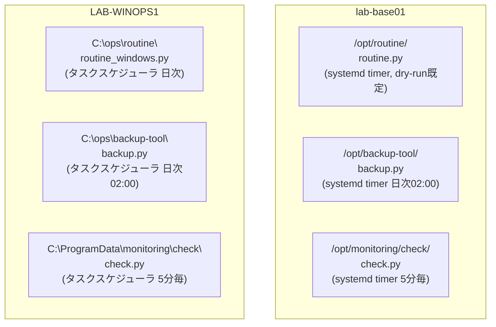

# 07 Python 運用自動化演習設計：定型作業・バックアップ・監視チェック（lab-base01 / LAB-WINOPS1）

> **本ドキュメントの位置付け**
>
> [サーバー構築エンジニア学習プラン](./README.md) Phase 5（W17-W20）の [W18 シェルスクリプトによる定型化](./02-curriculum.md#w18-シェルスクリプトによる定型化)を、
> シェルではなく **Python** で、かつ **Linux だけでなく Windows でも同じ設計思想で再現する**ことを目的にした演習設計です。
> [職務経歴書・スキルシート](../resume.md)に記載の Python 3 エンジニア認定基礎・実践と、
> [志望トラックと証跡の対応 優先 3（IT サポート・社内 SE 補助）](../target-roles.md)が次アクションとして挙げる
> 「実機出力を添えた Windows / network 切り分け記録」の一部を、Python の運用自動化という切り口で埋めるために書いています。
>
> [05 Phase 1 演習設計](./05-phase1-exercise-design.md)と同じく、[03 構築工程の実務ドキュメント](./03-build-process.md)の様式
> （パラメータシート・構築手順書・試験項目書）に沿っています。**本ドキュメントは lab-base01 / LAB-WINOPS1 という実機への
> 適用設計であり、それらへの実施記録ではありません。** ただし Linux 側の Python コードは AI 支援セッションの作業環境で
> 実際に動かして結果を記録しており（[付録](#付録この作業環境での実行記録)）、[5 章](#5-試験項目書)の該当行にはその結果を反映しています。
> lab-base01 / LAB-WINOPS1 で実施したら [8. 実施ステータス](#8-実施ステータスと次のアクション)を更新します。
>
> **[06 シェルスクリプト演習設計](./06-shell-scripting-exercise-design.md)との関係**: 06 は同じ W4 / W18 の題材（定型作業・
> バックアップスクリプト）を Bash / PowerShell で扱い、AD 操作・サービス・イベントログ操作まで踏み込んでいます。
> 本書はその Python 版で、両者は同じ課題への言語別の別解として並行に存在し、どちらか一方が他方を置き換えるものではありません。
> 本書は AD 操作を扱わず、standalone（workgroup）のホスト上で完結するローカル自動化のみを対象にします。
>
> **誤解を避けるための注記**: 本演習が対象とする Windows ラボは [Windows / AD 公開再現ラボ](../evidence/templates/windows-ad-lab.md)とは別物です。
> AD へは一切昇格せず、standalone（workgroup）状態のまま、そのホスト自身の上で完結するローカル自動化だけを扱います。
> [STATUS.md](../../STATUS.md)の「コードでは埋められない、残っている穴」5 番目（Windows Server / AD が portfolio に出ていない）を
> 埋めるのは AD ラボ側と 06 側の役割であり、本演習を実施してもその穴は埋まりません。

最終更新: 2026-08-26

> **実施ステータス**（2026-08-26 時点）: lab-base01 / LAB-WINOPS1 という実機ではまだ未実施です。ただし Linux 側の
> `routine.py`・`backup.py`・`check.py` は、この AI 支援セッションの作業環境上で実際に動かし、試験項目書 49 項目中
> 31 項目の実測結果を記録しています（[付録](#付録この作業環境での実行記録)参照）。Windows 側（`TW-` 全件）と
> systemd timer / タスクスケジューラによる定期実行そのものは未実施のままです。

---

## 目次

| 節 | 内容 |
| --- | --- |
| [1](#1-演習の目的スコープ前提条件) | 目的・スコープ・前提条件 |
| [2](#2-要件と基本設計) | 要件と基本設計（3 本の独立ツールという構成方針、Linux / Windows のスケジューリング方式選定） |
| [3](#3-パラメータシート) | パラメータシート（lab-base01 追加分 / LAB-WINOPS1 新規、ツールごと） |
| [4](#4-構築手順書) | 構築手順書（routine.py・backup.py・check.py の実装・配備・定期実行登録） |
| [5](#5-試験項目書) | 試験項目書（ツールごと・単体〜異常系） |
| [6](#6-実施タイムテーブルと中断基準) | 実施タイムテーブルと中断基準 |
| [7](#7-証跡採録計画) | 証跡採録計画 |
| [8](#8-実施ステータスと次のアクション) | 実施ステータスと次のアクション |
| [付録](#付録この作業環境での実行記録) | この作業環境での実行記録（Linux 側 31/49 項目を実施） |

---

## 1. 演習の目的・スコープ・前提条件

### 目的

[02 フェーズ別カリキュラム W18](./02-curriculum.md#w18-シェルスクリプトによる定型化)は、日次バックアップと環境チェックスクリプトを
「実務水準（ログ・エラー処理・多重起動防止つき）」で書き直すことを到達確認にしている。本演習はこれと同じ題材を、
シェルスクリプトではなく Python で実装し、**Linux（lab-base01）と Windows（LAB-WINOPS1）の両方で同じ設計思想が通用することを確認する**。

Python を選ぶ理由は、[04 教材と資格の対応](./04-resources.md)・[職務経歴書](../resume.md)に記載の Python 3 エンジニア認定基礎・実践を
実運用の題材で裏付けること、および [志望トラック 優先 3](../target-roles.md)（IT サポート・社内 SE 補助）が Windows 実機の記録を
求めていることの両方に対応するためである。シェルスクリプトでも同じ機能は作れるが、`psutil` や `hashlib` のように
Linux / Windows で呼び出し方が変わらない標準・準標準ライブラリを軸に、しきい値判定・世代管理・ログ整形を同じ言語で書ける
ことが Python を使う実務上の利点であり、これを演習内で実際に確認する。

完成後の成果物は、[02 フェーズ別カリキュラム Phase 5 の成果物](./02-curriculum.md#phase-5-自動化iacw17-w20)である
「Ansible role 一式とコンテナ構成」を置き換えるものではなく、**その隣に並ぶ Python 版の運用ツール**として位置付ける。

### スコープ

| 対象 | 扱い |
| --- | --- |
| Python 製の独立した 3 本のツール（`routine.py` / `backup.py` / `check.py`）の設計・実装。Linux / Windows 両対応 | **本演習の対象**。4 章・5 章で扱う |
| systemd timer（Linux）・タスクスケジューラ（Windows）への定期実行登録と、実行履歴からの成否確認 | **本演習の対象** |
| ホストローカルの正常性チェックと、ローカル JSON ステータス出力・任意のローカル webhook 通知 | **本演習の対象** |
| Ansible によるコード化・冪等適用 | **対象外**。[Phase 5 W19](./02-curriculum.md#w19-ansible-による構成管理)で別途扱う |
| Grafana / Prometheus 等による可視化・時系列保存 | **対象外**。[server-monitor](https://github.com/ns7jp/server-monitor)側の役割（[ADR 0001](../adr/0001-monitoring-stack.md)） |
| Active Directory へのドメイン昇格・参加 | **対象外**。[Windows / AD 公開再現ラボ](../evidence/templates/windows-ad-lab.md)が別途扱う。本演習の Windows ホストは standalone のまま操作する |
| 複数ホストをまたぐ集中監視・リモート一括実行（SSH / WinRM 経由） | **対象外**。本演習は「そのホスト自身の上で動く」ローカル自動化に限定する（[W18](./02-curriculum.md#w18-シェルスクリプトによる定型化)と同じスコープの取り方） |
| Web / AP / DB 3 層構成そのものの構築 | **対象外**。[Phase 3](./02-curriculum.md#phase-3-ミドルウェア構築w9-w12)で別途構築する。`check.py` の HTTP チェックは、Phase 3 完了前でも演習が独立して回るよう、**手動起動する簡易 HTTP サーバーで代替する**（[3 章](#3-パラメータシート)・[4 章](#4-構築手順書)で明記） |

### 前提条件

- [05 Phase 1 演習設計](./05-phase1-exercise-design.md)を完了した `lab-base01`、または同等の Ubuntu Server 24.04 LTS が使えること
- 新規に、使い捨ての評価版 Windows Server 2022 VM を 1 台用意できること。[Windows / winget 端末セットアップ テンプレート](../evidence/templates/windows-winget-provisioning.md)・
  [Windows / AD 公開再現ラボ](../evidence/templates/windows-ad-lab.md)と同じ「使い捨て評価版・業務端末や研修端末を対象にしない」原則に従う
- 両ホストに Python 3.12 以降を導入できること（Linux は `apt`、Windows は公式インストーラ）。`backup.py` は `tarfile.extractall` の
  `filter` 引数（Python 3.12 で追加）を使うため、3.12 未満では動作しない
- [01 学習環境](./01-environment.md)のホストオンリーネットワーク運用に加え、Windows ラボは Linux ラボと**同一セグメントに置かない**。
  [Windows / AD 公開再現ラボ §3](../evidence/templates/windows-ad-lab.md#3-公開前の安全条件)の隔離原則を踏襲し、Host-only / Internal
  スイッチのみに接続し、外部からの inbound・port forwarding・bridge 接続を無効にする。ただし [5.4 章の T-05](#54-checkpylinux--windows-共通)
  （TLS 証明書チェックの正常系）だけは外部の実サイトへの疎通を要するため、検証時のみ [Windows / AD 公開再現ラボと同じ運用](../evidence/templates/windows-ad-lab.md#3-公開前の安全条件)
  で NAT を一時追加し、確認後に外す

### 想定所要時間

| 区分 | 時間 |
| --- | --- |
| `routine.py`（Linux + Windows）の実装・配備・単体試験 | 2〜2.5 時間 |
| Windows ラボ VM 自体の準備（評価版導入・Python 導入） | 1〜1.5 時間（未完了の場合のみ。上記とは別枠） |
| `backup.py`（Linux + Windows 共通コア・OS 別実装）の実装・配備・単体試験 | 2〜2.5 時間 |
| `check.py`（Linux + Windows 共通コア）の実装・配備・単体試験 | 2〜2.5 時間 |
| 試験（4 ツール分、異常系を含む） | 2.5〜3 時間。構築とは別セッションに分けてよい |

---

## 2. 要件と基本設計

### 非機能要件

| 項目 | 要件 | 理由 |
| --- | --- | --- |
| 冪等性 | `routine` / `backup` / `check` のいずれも 2 回連続実行して状態が壊れない | [W18 到達確認](./02-curriculum.md#w18-シェルスクリプトによる定型化)「同じスクリプトを 2 回実行しても問題が起きない」に対応 |
| Fail-closed | 設定ファイル欠落・書き込み権限不足・想定外の対象パスを検出したら、既定動作を進めず非ゼロ終了する | [Windows / AD 公開再現ラボ](../evidence/templates/windows-ad-lab.md)の fail-closed preflight と同じ思想を Python 側にも適用する |
| 破壊操作の事前提示 | 世代超過分の削除・一時ファイル削除は、対象一覧をログへ出力してから削除する。`routine.py` はさらにドライラン結果を経由してからでないと実削除に進まない二段階運用にする | [03 構築工程の実務ドキュメント §6](./03-build-process.md#6-本番作業の作法)「破壊的コマンドは対象を先に確認する」 |
| 移植性 | `psutil.disk_usage()` のように Linux / Windows で呼び出し方が同一の API を優先し、OS 固有処理は分岐箇所を最小限にする | 3 本とも Linux 実装と Windows 実装を用意するため、共通化できる箇所を意識的に選ぶ |
| 秘密情報の非ハードコード | 対象パス・しきい値・通知先 URL はコードではなく YAML 設定ファイルに書く | [W17 到達確認](./02-curriculum.md#w17-git-とバージョン管理変更管理)「秘密情報がリポジトリに含まれない」と同じ考え方をローカル運用にも適用する |
| 失敗の可視化 | 失敗時はログと終了コードの両方で分かるようにし、成功時にしか動作確認しない状態を作らない | [W18 到達確認](./02-curriculum.md#w18-シェルスクリプトによる定型化)「スクリプトが失敗したことに、人が気付ける仕組みになっている」 |

### 基本設計（構成）

本演習で作る `routine.py` / `backup.py` / `check.py` は、**共通のフレームワークやパッケージを共有しない、3 本の独立したツール**として設計する。
3 本を 1 つの共有パッケージ（`common/` 等）にまとめる案も検討したが、この規模（1 ホストあたり多くて数百行、共通化できる関数は数個）で
共有ライブラリを先に作ると、依存関係の管理と抽象化のコストが実利を上回ると判断した。かわりに、**設計原則（fail-closed・二段階運用・
YAML 設定の外出し・ログ出力・OS 別実装の分離）だけを 3 本で揃え、コードとしての共有はしない**。この判断自体、既存資料の
「三行程度の重複ならヘルパー化しない」という方針と同じ考え方である。



図の要約：3 本のツールはそれぞれ専用のディレクトリ・専用の Python 仮想環境（venv）を持ち、Linux は systemd timer、
Windows はタスクスケジューラから個別に定期実行される。3 本の間でコードの共有はしない。

### 決定事項（選定と理由）

| 決定事項 | 選定 | 理由・比較した選択肢 |
| --- | --- | --- |
| 実装言語 | Python 3.12+ | `psutil.disk_usage()` や `shutil.disk_usage()` など Linux / Windows で同一の呼び出しになる標準・準標準ライブラリが揃っており、シェル / PowerShell の二重実装を避けられる。`backup.py` が使う `tarfile.extractall(filter=...)` が 3.12 で追加されたため、3 本ともバージョンを揃える |
| Linux の定期実行 | systemd timer（`cron` は使わない） | [Phase 1](./05-phase1-exercise-design.md)・[W3](./02-curriculum.md#w3-プロセスサービスログ)で既習。`journalctl -u` に実行履歴が残り、`OnCalendar` と `OnBootSec` の両方を選べる |
| Windows の定期実行 | タスクスケジューラ（`schtasks` CLI、または `Register-ScheduledTask`） | 標準搭載で追加インストール不要。`schtasks /query` と `Get-ScheduledTaskInfo` で実行履歴・終了コードを確認でき、構築手順書へコマンドとして落とし込みやすい |
| 設定形式 | YAML（`PyYAML`） | [Phase 5 W19](./02-curriculum.md#w19-ansible-による構成管理)の Ansible インベントリ・変数ファイルと同じ記法に揃え、コメントを書ける |
| 監視の終了コード規約（`check.py`） | Nagios / Icinga 系プラグイン規約（`0=OK` `1=WARNING` `2=CRITICAL` `3=UNKNOWN`） | 独自規約を作らず、監視系の実務で広く使われる規約に合わせておくと現場転用が利く |
| 通知方式（`check.py`） | ローカル JSON ステータスファイル + 任意のローカル webhook（`urllib.request` による POST） | 本演習は個人ラボ内で完結させ、**実際の Slack 配信は行わない**。[README AI の利用について](../../README.md#ai-の利用について)と同じく、実施していないことを実施したと書かない。server-monitor 側の実際の Slack 通知経路（[ADR-0007](../adr/0007-slack-notifications.md)）とは別物である |
| 監視対象の HTTP エンドポイント（`check.py`） | 検証のたびに手動起動する `python -m http.server` | [Phase 3](./02-curriculum.md#phase-3-ミドルウェア構築w9-w12)の Nginx 導入前でも演習が独立して回るようにするための代替。常駐サービスとしては登録せず、`check_http()` の判定ロジックを確認する目的に絞る。Phase 3 完了後は実際の Web サーバーへ向け先を差し替える |
| ツール間のコード共有 | しない（3 本とも自己完結） | [基本設計](#基本設計構成)のとおり。この規模で共有パッケージを作る抽象化コストが実利を上回ると判断した |

---

## 3. パラメータシート

[03 構築工程の実務ドキュメント §2](./03-build-process.md#2-パラメータシート)の様式。lab-base01 の基本情報（OS・ネットワーク・ユーザー等）は
[05 Phase 1 演習設計 §3](./05-phase1-exercise-design.md#3-パラメータシート)を正本とし、ここでは重複させず**本演習で追加する項目だけ**を書く。
LAB-WINOPS1 は本演習で新規に用意するホストのため、基本項目から書く。3 本のツールは互いにディレクトリ・実行アカウントを共有しない
（[2 章の基本設計](#基本設計構成)のとおり）ため、ツールごとに小表を分ける。

### 3.1 LAB-WINOPS1（新規ホストの基本情報）

| 項目 | 値 |
| --- | --- |
| ホスト名 | `LAB-WINOPS1`（NetBIOS 名は 15 文字以内。standalone・workgroup のまま。ドメイン参加はしない） |
| 役割 | 本演習専用の使い捨て評価版ホスト |
| OS | Windows Server 2022 評価版（180 日間、[01 学習環境 §1 費用](./01-environment.md#費用)と同じ枠） |
| vCPU / メモリ / ディスク | 2 / 4GB / 40GB（評価版は Desktop Experience を含むため Ubuntu 側より多めに確保する） |
| 仮想化基盤 | VirtualBox 7.x（[01 学習環境 §2](./01-environment.md#2-仮想化環境の選び方)の標準環境と揃える） |
| ネットワーク | Host-only / Internal スイッチのみ。lab-base01 が使う `192.168.56.0/24` とは**別セグメント**にする（[1 章 前提条件](#前提条件)参照）。[5.4 章 T-05](#54-checkpylinux--windows-共通)のみ検証時に NAT を一時追加する |
| Python バージョン | 3.12（公式 `python.org` インストーラ、`Add python.exe to PATH` を有効化。以降 `C:\Python312\python.exe` として参照する） |

### 3.2 routine.py

| 項目 | lab-base01（Linux） | LAB-WINOPS1（Windows） |
| --- | --- | --- |
| スクリプト配置先 | `/opt/routine/routine.py` | `C:\ops\routine\routine_windows.py`（+ `routine_common.py`） |
| venv 配置先 | `/opt/routine/venv` | `C:\ops\routine\venv` |
| 設定ファイル | `/etc/routine/routine.yaml` | `C:\ops\routine\config.yml` |
| ログ出力先 | `/var/log/routine/routine.log` | `C:\ops\routine\logs\routine.log`（`--log-file` 指定時のみ） |
| 実行ユーザー | `opsadmin`（既存）。root 実行が前提（[4.2 章 6 節](#固有の注意点)参照） | タスクスケジューラは `SYSTEM` |
| 多重実行防止 | `fcntl.flock()` + `/run/routine/routine.lock` | ファイル単位の `try/except` のみ（ロック機構は未実装。[5.2 章 TW-11](#52-routinepywindows) 参照） |
| systemd unit / タスク名 | `routine-dryrun.service` / `.timer`（毎日 03:00、**ドライランのみ**） | `NS7JP_RoutineCheck`（毎日 06:00） |
| 実削除の運用 | timer には登録せず、ドライランのログを確認した運用担当者が `--apply` 付きで手動実行する | 同左。Windows 版も削除前の確認は手動運用とする |

### 3.3 backup.py

| 項目 | lab-base01（Linux） | LAB-WINOPS1（Windows） |
| --- | --- | --- |
| スクリプト配置先 | `/opt/backup-tool/{backup_common.py, backup_linux.py, backup.py}` | `C:\ops\backup-tool\{backup_common.py, backup_windows.py, backup.py}` |
| venv 配置先 | `/opt/backup-tool/.venv` | `C:\ops\backup-tool\.venv` |
| 設定ファイル | `/opt/backup-tool/backup_config.yaml` | `C:\ops\backup-tool\backup_config.yaml` |
| バックアップ対象（合成データ） | `/etc/nginx`、`/etc/myapp`（演習用にダミー配置。実データではない） | `C:\ProgramData\MyApp\config`（同上） |
| バックアップ保管先 | `/backup/config` | `D:\backup\config`（D ドライブが無い場合は `C:\ops\backup-tool\backups` に読み替える） |
| 世代管理 | 日次、7 世代（[W4 ハンズオン](./02-curriculum.md#w4-ディスクファイルシステムシェルスクリプト)の「7 世代より古いものを削除」と同じ基準） | 同左 |
| 最小空き容量 | 1 GiB（`min_free_bytes: 1073741824`） | 同左 |
| アーカイブ形式 | `tarfile`（`.tar.gz`） | `zipfile`（`.zip`） |
| 実行ユーザー | `opsadmin` | タスクスケジューラは `SYSTEM`（[4.4 章 6 節](#固有の注意点-2)に最小権限化の検討を明記） |
| systemd unit / タスク名 | `backup-config.service` / `.timer`（毎日 02:00） | `ConfigBackup`（毎日 02:00） |

### 3.4 check.py

| 項目 | lab-base01（Linux） | LAB-WINOPS1（Windows） |
| --- | --- | --- |
| スクリプト配置先 | `/opt/monitoring/check/check.py` | `C:\ProgramData\monitoring\check\check.py` |
| venv 配置先 | `/opt/monitoring/check/venv` | `C:\ProgramData\monitoring\check\venv`（[4.5 章](#45-checkpylinux--windows-共通)で新規に追加する手順） |
| 設定ファイル | `/opt/monitoring/check/check.yaml` | `C:\ProgramData\monitoring\check\check.yaml` |
| ステータス出力先 | `/var/lib/monitoring/check-status.json` | `C:\ProgramData\monitoring\check-status.json` |
| 実行ユーザー | 専用の無ログインシェルアカウント `svc-monitor`（`useradd --system --no-create-home`） | タスクスケジューラは `SYSTEM`（[4.5 章 6 節](#固有の注意点-3)に gMSA 等への置き換え検討を明記） |
| systemd unit / タスク名 | `check-py.service` / `.timer`（5 分毎） | `MonitoringCheckPy`（5 分毎） |
| しきい値（CPU / メモリ / ディスク） | WARN 80% / CRIT 95%、WARN 80% / CRIT 90%、WARN 80% / CRIT 90% | 同左（`check.yaml` は OS ごとに `disk_path` の書式のみ書き分ける） |
| しきい値（TLS 証明書残日数） | WARN 30 日 / CRIT 7 日 | 同左 |
| しきい値（ログ直近エラー件数） | WARN 5 件 / CRIT 20 件（直近 15 分） | 同左 |
| HTTP チェック対象 | `http://127.0.0.1:8080/healthz`（[4.5 章](#45-checkpylinux--windows-共通)の手動起動する簡易 HTTP サーバー） | 同左（`127.0.0.1` のため OS 間の差はない） |
| TLS チェック対象（正常系試験専用） | `example.com:443`（IANA 予約の安定した公開ドメイン。監視対象ではなく `check_tls_cert()` の OK 判定を確認する目的のみ） | 同左。[1 章 前提条件](#前提条件)のとおり検証時のみ一時的に NAT を追加する |

---

## 4. 構築手順書

[03 構築工程の実務ドキュメント §3](./03-build-process.md#3-構築手順書)の原則（想定結果のない手順を書かない・コピー＆ペーストで実行できる粒度）に従う。
[2 章の基本設計](#基本設計構成)のとおり 3 本のツールは独立しているため、ツールごとに「目的 → Python 設計方針 → 中核コード例 →
構築手順書スタイルの表 → 固有の注意点」を 1 セットとして並べる（試験項目書は[5 章](#5-試験項目書)にまとめて記載する）。

### 4.1 作業前確認（共通）

| No | 確認内容 | コマンド / 操作 | 想定結果 |
| --- | --- | --- | --- |
| 4.1-1 | lab-base01 の到達性 | `ssh -o PreferredAuthentications=publickey opsadmin@192.168.56.10 'python3 --version'` | `Python 3.12.x` が返る |
| 4.1-2 | LAB-WINOPS1 の Python 導入確認 | 管理者 PowerShell で `python --version` | `Python 3.12.x` が返る |
| 4.1-3 | 両ホストのスナップショット取得 | lab-base01 は VirtualBox スナップショット `before-python-ops`、LAB-WINOPS1 は導入直後のチェックポイント `base-clean` | 一覧にそれぞれ表示される |

---

### 4.2 routine.py（Linux: lab-base01）

#### 1. 目的

Ubuntu Server 24.04（`lab-base01` 相当）を対象に、ディスク使用率確認・systemd サービス稼働確認・`journalctl` からの直近エラー抽出・`/tmp` や `/var/log` 配下の古い一時ファイルの安全な削除を1本の Python スクリプト（`routine.py`）にまとめ、systemd timer による定期実行に載せる。破壊的操作（削除）は必ずドライラン結果を確認してから実削除に進む二段階運用とし、削除対象はホワイトリストで固定して範囲外を一切変更しない。

#### 2. Python 設計方針

##### 使用ライブラリと選定理由

| ライブラリ | 区分 | 選定理由 |
| --- | --- | --- |
| `pathlib` | 標準 | パス操作とファイル走査（`rglob`）をオブジェクト指向で安全に扱えるため |
| `shutil` | 標準 | `shutil.disk_usage()` でディスク使用率を root 権限なしに正確に取得できるため |
| `subprocess` | 標準 | `systemctl` / `journalctl` を CLI 経由で呼び出す。D-Bus バインディング（`dbus-python` 等）は追加依存になり本演習の許可ライブラリ外のため使わない。`systemctl`/`journalctl` は Ubuntu Server に標準で存在し、CLI の出力仕様も安定している |
| `logging` | 標準 | 実行結果・警告・エラーを構造化して `/var/log/routine/routine.log` と標準出力の両方へ残すため |
| `argparse` | 標準 | ドライラン（既定）／実削除（`--apply`）の二段階をコマンドライン引数で明示的に切り替えるため |
| `fcntl` | 標準（Unix 限定） | `flock()` による多重実行防止のため。Linux 専用スクリプトのため使用可 |
| `dataclasses` / `datetime` | 標準 | 設定値の型付け、ファイル更新時刻としきい値の比較のため |
| `PyYAML`（`yaml`） | サードパーティ（許可済み） | ホワイトリストや閾値を `routine.yaml` に外出しし、コード変更なしに運用値を変えられるようにするため |

`psutil` はこのモジュールでは使わない。ディスク使用率は `shutil.disk_usage()`、サービス稼働確認は `systemctl is-active` の CLI 呼び出しで要件を満たせ、依存を1つでも減らすほうが `lab-base01` のような最小構成ホストでは保守しやすいと判断した。

Ubuntu Server 24.04 のシステム Python は PEP 668（externally managed environment）によりシステム全体への `pip install` を拒否するため、`/opt/routine/venv` に専用の仮想環境を作り、そこへ `pyyaml` を導入する（[構築手順書](#構築手順書) 手順 2〜3）。

##### ファイル/関数構成

| パス | 役割 |
| --- | --- |
| `/opt/routine/venv/` | 本モジュール専用の Python 仮想環境（`pyyaml` のみ追加導入） |
| `/opt/routine/routine.py` | 本体スクリプト（設定読込・4機能・CLI エントリポイント） |
| `/etc/routine/routine.yaml` | 設定ファイル（対象ディスクパス、閾値、対象サービス、削除ホワイトリスト、保持日数） |
| `/var/log/routine/routine.log` | 実行ログ（`logging.FileHandler` の出力先） |
| `/run/routine/routine.lock` | 多重実行防止用ロックファイル。systemd の `RuntimeDirectory=routine` が起動時に作成・終了時に削除する |

| 関数 | 役割 |
| --- | --- |
| `load_config(path)` | YAML を読み込み `Config` に変換する。欠落・構文エラーはここで例外を送出させ、そのまま異常終了させる（fail-closed。途中まで処理を進めない） |
| `check_disk_usage(paths, warn_percent)` | 対象パスごとに使用率を算出し、閾値超過を判定する |
| `check_services(names)` | `systemctl is-active <name>` をラップし、稼働状態を判定する |
| `recent_errors(since)` | `journalctl -p err --since <since>` で直近のエラー以上のログを抽出する |
| `_is_whitelisted(target, whitelist)` / `find_stale_files(whitelist, max_age_days)` | ホワイトリスト配下だけを走査し、保持日数を超えたファイルを抽出する。ホワイトリスト外は候補にすら入れない |
| `cleanup(whitelist, max_age_days, apply)` | `apply=False`（既定）ではログ出力のみのドライラン、`apply=True` で初めて `unlink()` する二段階の中核 |
| `main(argv)` | ロック取得 → 引数解析 → ログ設定 → 上記4機能の実行 → 終了コード決定 |

#### 3. 中核コード例（`routine.py` 抜粋）

```python
#!/usr/bin/env python3
"""routine.py -- lab-base01 (Ubuntu Server 24.04) 定型作業自動化。"""
from __future__ import annotations

import argparse
import fcntl
import logging
import shutil
import subprocess
import sys
from dataclasses import dataclass
from datetime import datetime, timedelta, timezone
from pathlib import Path

import yaml

LOG = logging.getLogger("routine")
LOCK_PATH = Path("/run/routine/routine.lock")

@dataclass(frozen=True)
class Config:
    disk_paths: list[str]
    disk_warn_percent: int
    services: list[str]
    cleanup_whitelist: list[str]
    cleanup_max_age_days: int

def load_config(path: Path) -> Config:
    # 欠落・構文エラーはここで例外を送出させ、そのまま異常終了させる（fail-closed）。
    data = yaml.safe_load(path.read_text(encoding="utf-8"))
    return Config(
        disk_paths=data["disk_paths"],
        disk_warn_percent=int(data["disk_warn_percent"]),
        services=data["services"],
        cleanup_whitelist=data["cleanup_whitelist"],
        cleanup_max_age_days=int(data["cleanup_max_age_days"]),
    )

def check_disk_usage(paths: list[str], warn_percent: int) -> list[dict]:
    results = []
    for p in paths:
        usage = shutil.disk_usage(p)
        percent_used = round(usage.used / usage.total * 100, 1)
        warn = percent_used >= warn_percent
        if warn:
            LOG.warning("disk usage warning: %s at %.1f%%", p, percent_used)
        results.append({"path": p, "percent_used": percent_used, "warn": warn})
    return results

def check_services(names: list[str]) -> list[dict]:
    results = []
    for name in names:
        proc = subprocess.run(
            ["systemctl", "is-active", name],
            capture_output=True, text=True, timeout=10,
        )
        state = proc.stdout.strip()
        active = proc.returncode == 0 and state == "active"
        if not active:
            LOG.error("service not active: %s (state=%s)", name, state)
        results.append({"service": name, "state": state, "active": active})
    return results

def recent_errors(since: str = "-1h") -> list[str]:
    # --quiet を付けないと、該当なしのときに journalctl 自身が出す
    # "-- No entries --" という境界メッセージまで「エラー行」として拾ってしまう
    # （この作業環境での実行で発見。付録参照）。
    proc = subprocess.run(
        ["journalctl", "-p", "err", "--since", since, "--no-pager", "--quiet", "-o", "short-iso"],
        capture_output=True, text=True, timeout=30,
    )
    if proc.returncode != 0:
        LOG.error("journalctl failed: rc=%s stderr=%s", proc.returncode, proc.stderr.strip())
        return []
    return [line for line in proc.stdout.splitlines() if line.strip()]

def _is_whitelisted(target: Path, whitelist: list[str]) -> bool:
    resolved = target.resolve()
    for base in whitelist:
        try:
            resolved.relative_to(Path(base).resolve())
            return True
        except ValueError:
            continue
    return False

def find_stale_files(whitelist: list[str], max_age_days: int) -> list[Path]:
    cutoff = datetime.now(timezone.utc) - timedelta(days=max_age_days)
    stale: list[Path] = []
    for base in whitelist:
        base_path = Path(base)
        if not base_path.is_dir():
            LOG.warning("cleanup target missing, skipped: %s", base_path)
            continue
        for entry in base_path.rglob("*"):
            if not entry.is_file():
                continue
            try:
                mtime = datetime.fromtimestamp(entry.stat().st_mtime, tz=timezone.utc)
            except OSError as exc:
                LOG.error("stat failed, skipped: %s (%s)", entry, exc)
                continue
            if mtime < cutoff:
                stale.append(entry)
    return stale

def cleanup(whitelist: list[str], max_age_days: int, apply: bool) -> list[Path]:
    """ドライラン（既定）と実削除（apply=True）の二段階。呼び出し側が明示的に切り替える。"""
    targets = find_stale_files(whitelist, max_age_days)
    for target in targets:
        if not _is_whitelisted(target, whitelist):
            LOG.error("refused to delete outside whitelist: %s", target)
            continue
        if not apply:
            LOG.info("[dry-run] would delete: %s", target)
            continue
        try:
            target.unlink()
            LOG.info("deleted: %s", target)
        except OSError as exc:
            LOG.error("delete failed, skipped: %s (%s)", target, exc)
    return targets

def main(argv: list[str] | None = None) -> int:
    parser = argparse.ArgumentParser(description="lab-base01 定型作業自動化")
    parser.add_argument("--config", type=Path, default=Path("/etc/routine/routine.yaml"))
    parser.add_argument("--apply", action="store_true", help="省略時はドライランのみ")
    args = parser.parse_args(argv)

    logging.basicConfig(
        level=logging.INFO,
        format="%(asctime)s %(levelname)s %(message)s",
        handlers=[
            logging.StreamHandler(),
            logging.FileHandler("/var/log/routine/routine.log"),
        ],
    )

    LOCK_PATH.parent.mkdir(parents=True, exist_ok=True)
    lock_file = open(LOCK_PATH, "w")
    try:
        fcntl.flock(lock_file, fcntl.LOCK_EX | fcntl.LOCK_NB)
    except BlockingIOError:
        LOG.error("another instance is already running, exiting")
        return 1

    try:
        config = load_config(args.config)
        disk = check_disk_usage(config.disk_paths, config.disk_warn_percent)
        services = check_services(config.services)
        recent_errors()
        cleanup(config.cleanup_whitelist, config.cleanup_max_age_days, apply=args.apply)
    finally:
        fcntl.flock(lock_file, fcntl.LOCK_UN)
        lock_file.close()

    failed = any(not s["active"] for s in services) or any(d["warn"] for d in disk)
    return 1 if failed else 0

if __name__ == "__main__":
    sys.exit(main())
```

補足のとおり、`cleanup()` の削除失敗（`OSError`）はログに記録するだけで `main()` の失敗判定には含めていない。権限不足による個別削除失敗は「異常」ではなく「想定内の部分失敗」として扱う設計であるため、監視は終了ステータスだけでなく `routine.log` の `ERROR` 行も対象にする必要がある（詳細は[固有の注意点](#固有の注意点)）。

`routine.yaml` の例（`lab-base01` の構成に合わせたもの）:

```yaml
disk_paths:
  - /
  - /var
disk_warn_percent: 85
services:
  - ssh
  - systemd-timesyncd
cleanup_whitelist:
  - /tmp
  - /var/log/lab-app
cleanup_max_age_days: 14
```

破壊的操作の二段階運用は、コードの `--apply` フラグだけでなく**定期実行の設計自体**でも徹底する。systemd timer が呼ぶのはドライランのみとし、実削除（`--apply`）は運用担当者がドライランのログを確認したうえで手動実行する（構築手順書の手順 7・13、および注意点参照）。自動実行のまま実削除まで走らせる設計は今回の演習の許容範囲外とした。

#### 構築手順書

対象ホスト: `lab-base01`（Ubuntu Server 24.04、[05 Phase 1 演習設計](./05-phase1-exercise-design.md)で構築済みの前提）。作業ユーザーは `opsadmin`（sudo 権限あり）。

| No | 作業内容 | コマンド/操作 | 想定結果 | 判定 |
| --- | --- | --- | --- | --- |
| 1 | 作業ディレクトリ作成 | `sudo install -d -m 755 /opt/routine /etc/routine /var/log/routine` | エラーなく完了する | `ls -ld /opt/routine /etc/routine /var/log/routine` の3つとも存在する |
| 2 | Python 仮想環境作成 | `sudo apt install -y python3-venv && sudo python3 -m venv /opt/routine/venv` | Ubuntu Server の最小構成には `venv` モジュールを有効化する `python3-venv` パッケージが入っていないため、`ensurepip` エラーで失敗しないよう事前に導入したうえで `venv` 一式が作成される | `/opt/routine/venv/bin/python3 --version` が実行できる |
| 3 | PyYAML 導入 | `sudo /opt/routine/venv/bin/pip install pyyaml` | `Successfully installed PyYAML-x.x.x` が表示される（pip が表示するパッケージ名は配布物のメタデータ表記のまま大文字混じりの `PyYAML` になる） | `sudo /opt/routine/venv/bin/python3 -c "import yaml"` がエラーなく終了する |
| 4 | スクリプト配置 | `sudo install -m 750 -o root -g root routine.py /opt/routine/routine.py` | 権限 750・所有者 root:root で配置される | `ls -l /opt/routine/routine.py` が `-rwxr-x---` である |
| 5 | 設定ファイル配置 | `sudo install -m 640 -o root -g root routine.yaml /etc/routine/routine.yaml` | 配置される | `sudo cat /etc/routine/routine.yaml` の内容が意図した値と一致する |
| 6 | 設定ファイルの構文確認 | `sudo /opt/routine/venv/bin/python3 -c "import yaml; yaml.safe_load(open('/etc/routine/routine.yaml'))"` | 出力なし | 終了ステータス 0 |
| 7 | 手動ドライラン実行 | `cd /opt/routine && sudo venv/bin/python3 routine.py --config /etc/routine/routine.yaml` | 対象サービスが全て `active` かつディスク使用率が閾値未満なら終了ステータス 0 | `sudo tail -n 20 /var/log/routine/routine.log` に実行結果（削除対象の有無を含む）が記録されている |
| 8 | サービス unit 配置 | `sudo vi /etc/systemd/system/routine-dryrun.service`（内容は下記） | ファイルが保存される | `sudo systemd-analyze verify routine-dryrun.service` がエラーを出さない |
| 9 | タイマー unit 配置 | `sudo vi /etc/systemd/system/routine-dryrun.timer`（内容は下記） | ファイルが保存される | `sudo systemd-analyze verify routine-dryrun.timer` がエラーを出さない |
| 10 | unit 再読込 | `sudo systemctl daemon-reload` | 出力なし | - |
| 11 | タイマー有効化 | `sudo systemctl enable --now routine-dryrun.timer` | シンボリックリンク作成のメッセージが表示される | `systemctl is-enabled routine-dryrun.timer` が `enabled` |
| 12 | タイマー登録確認 | `systemctl list-timers routine-dryrun.timer --all` | `NEXT` 列に当日または翌日 `03:00` 相当の日時が表示される | 表示された `NEXT` が設定した `OnCalendar` と一致する |
| 13 | 初回稼働確認 | `sudo systemctl start routine-dryrun.service && systemctl status routine-dryrun.service --no-pager` | `Active: inactive (dead)`（`Type=oneshot` のため実行完了後は dead）で直前の起動が正常終了している | `journalctl -u routine-dryrun.service -n 20 --no-pager` にエラーがない |

手順 8 で作成する `routine-dryrun.service`:

```ini
[Unit]
Description=lab-base01 routine.py (dry-run)
After=network.target

[Service]
Type=oneshot
RuntimeDirectory=routine
ExecStart=/opt/routine/venv/bin/python3 /opt/routine/routine.py --config /etc/routine/routine.yaml
ProtectSystem=strict
ReadWritePaths=/tmp /var/log
PrivateTmp=no
NoNewPrivileges=yes
```

手順 9 で作成する `routine-dryrun.timer`:

```ini
[Unit]
Description=Daily trigger for lab-base01 routine.py dry-run

[Timer]
OnCalendar=*-*-* 03:00:00
Persistent=true
Unit=routine-dryrun.service

[Install]
WantedBy=timers.target
```

実削除（`--apply`）は timer に登録せず、ドライランのログを確認した運用担当者が手動で実行する運用とする。

```bash
# ドライランのログ(/var/log/routine/routine.log)を確認したうえで実行する
sudo /opt/routine/venv/bin/python3 /opt/routine/routine.py --config /etc/routine/routine.yaml --apply
```

#### 固有の注意点

- **削除可否を決めるのはファイルの権限ではなくディレクトリの権限**: Linux では `unlink()`（削除）はディレクトリエントリの操作であり、ファイル自体の権限ではなく親ディレクトリへの書き込み権で可否が決まる。`/tmp` は sticky bit（`drwxrwxrwt`）が立っており、書き込み権があっても他ユーザー所有ファイルの削除はファイル所有者・ディレクトリ所有者・root 以外にはできない。ただし本モジュールは systemd unit・手動実行のいずれも root で動く前提のため、この sticky bit 制限自体は回避される（root は制限の対象外）。root 実行でも起こりうる削除失敗は immutable 属性（`chattr +i`）や読み取り専用マウントなど、root の権限があっても `unlink()` が `EPERM`/`EROFS` で失敗するケースであり、[5.1 章 TRL-11](#51-routinepylinux)ではこれを模擬している。いずれのケースでも本モジュールはこの削除失敗を「異常」ではなく「想定内の部分失敗」として扱い、ログに記録した上で処理を継続する設計にしている。
- **削除失敗は終了ステータスに含めていない**: `main()` の失敗判定はサービス停止とディスク閾値超過だけを見ており、`cleanup()` 内の個別削除失敗（`OSError`）は反映しない。監視は終了ステータスだけでなく `routine.log` の `ERROR` 行も対象にする必要がある。
- **root 権限で実行する前提のトレードオフ**: `/tmp` や `/var/log` 配下は所有者が混在するため、専用の非 root アカウントに限定した権限モデルでは sudoers や ACL の追加設計が必要になる。本演習では root 実行を許容しつつ、systemd unit 側の `ProtectSystem=strict` / `NoNewPrivileges=yes` などのサンドボックス化ディレクティブで影響範囲を絞る妥協点をとった。
- **サービス確認手段の違い**: Linux は `systemctl` の CLI 呼び出し（内部では D-Bus 経由だが CLI がラップ済み）で完結する。Windows 版（[4.3 章](#43-routinepywindows-lab-winops1)）は `psutil.win_service_iter()` を使い、「管理者として実行」しているかどうかが権限モデルの中心になる点が異なる。
- **定期実行の仕組みの違い**: Linux は systemd timer（実行履歴が `journalctl` に統合され、`OnCalendar` で表現力が高い）、Windows はタスクスケジューラ（`schtasks` または `Register-ScheduledTask`）で、実行アカウント・「最上位の特権で実行」・UAC の扱いを別途設計する必要がある。
- **パス表記とホワイトリスト判定**: Linux は `/` 区切りで大文字小文字を区別する。ホワイトリスト判定（`_is_whitelisted`）は文字列比較ではなく `Path.resolve()` で正規化してから `relative_to()` を使っており、シンボリックリンクや相対パス表記による回避を防いでいる。
- **破壊的操作の二段階は「コードのフラグ」と「定期実行の設計」の両方で担保する**: `--apply` フラグだけに頼ると、timer の設定ミス一つで無人の実削除が定期実行され得る。本モジュールでは timer が呼ぶ unit をドライラン専用に固定し、実削除は運用担当者の手動実行に限定することで、コードとデプロイ構成の二重で事故を防いでいる。

---

### 4.3 routine.py（Windows: LAB-WINOPS1）

#### 1. モジュールの目的

評価版 Windows Server の使い捨てラボ（[windows-ad-lab.md](../evidence/templates/windows-ad-lab.md)と同じ前提）を対象に、ディスク使用率・サービス稼働・イベントログ・一時ファイルという定型点検を Python で自動化し、Linux 版（[4.2 章](#42-routinepylinux-lab-base01)）と共通の設定ファイル書式・戻り値構造で運用できる状態にする。

#### 2. Python 設計方針

本モジュールは CPython 3.12 以上を前提とする（[3.1 章](#31-lab-winops1新規ホストの基本情報)のとおり）。

**使用ライブラリと選定理由**

| ライブラリ | 選定理由 |
| --- | --- |
| `psutil` | ディスク使用率とサービス一覧を OS 差分の少ない API（`disk_usage()` は Linux 版と共通、`win_service_iter()` は Windows 専用拡張）で取得できる |
| `PyYAML` | しきい値・対象サービス名などの設定値を、人が読み書きしやすい YAML として外部化できる |
| 標準ライブラリ（`subprocess` / `pathlib` / `argparse` / `logging` / `datetime` / `json` / `os`） | `Get-WinEvent` 呼び出し、ファイル操作、CLI 化、ログ出力、JSON 整形、環境変数展開（`%TEMP%` 等）に使う |

`pywin32` は本モジュールでは**依存に加えない**。理由は次のとおり。

- サービス確認は `psutil.win_service_iter()` で完結し、`win32serviceutil` を追加する必要がない
- イベントログ抽出は `win32evtlog`（クラシック Event Logging API）ではなく **PowerShell `Get-WinEvent` を `subprocess` でラップする方式**を採る。`Get-WinEvent` は新形式（`.evtx`）チャンネルを `-FilterHashtable` で構造化フィルタでき、`ConvertTo-Json` で Python 側に渡しやすい形にできる。`win32evtlog` は低レベル API でレコードのバイナリ属性を自前でパースする必要があり、依存パッケージも増える
- 依存を `psutil` + `PyYAML` のみに絞ることで、使い捨てラボでのセットアップ手順（[構築手順書](#構築手順書スタイルの表)）を短くできる

**Linux 実装との API 差分・共通化**

| 項目 | Linux 実装（[4.2 章](#42-routinepylinux-lab-base01)） | Windows 実装 | 共通化 |
| --- | --- | --- | --- |
| ディスク使用率 | `shutil.disk_usage(path)` | `psutil.disk_usage(path)` | 呼び出し方は異なるが（Linux 版は依存を1つ減らす判断で `shutil` を使った）、`path` の意味は共通。書式のみ環境依存（`/var` 等 と `C:\` 等） |
| サービス確認 | `systemctl is-active <name>` を `subprocess` で確認 | `psutil.win_service_iter()` | 呼び出し方法は共通化できない。`check_services()` という関数名と `{"name"/"service", "status"/"state", "ok"/"active"}` に相当する戻り値スキーマだけを両実装で揃える |
| ログ/イベントログ抽出 | `journalctl --since ... -p err` を `subprocess` で呼ぶ | `Get-WinEvent` を `subprocess` で呼ぶ | どちらも「OS ネイティブの CLI を `subprocess` でラップする」方式に統一。戻り値は Windows 側で `TimeCreated`/`Id`/`ProviderName`/`Message` を `time`/`id`/`provider`/`message` に正規化してから返す |
| 一時ファイル削除 | `pathlib` + `stat().st_mtime` | 同左（対象ディレクトリのパスは `os.path.expandvars()` で環境変数を展開してから使う） | ほぼ共通（対象ディレクトリが `/tmp` と `%TEMP%` になるだけ） |
| 定期実行登録 | systemd timer + service unit | タスクスケジューラ（`schtasks` / `Register-ScheduledTask`） | 登録方式は OS 固有で共通化不可。スクリプト本体と YAML 設定の書式は共通 |

**ファイル/関数構成（案）**

```text
C:\ops\routine\
├── routine_common.py   … load_config(), check_disk_usage()（psutilのみでOS非依存）
├── routine_windows.py   … 本モジュール本体。check_services()/get_recent_error_events()/
│                          cleanup_temp_files()/run()/main()
└── config.example.yml   … 設定ファイルの雛形
```

以下のコード例は可読性のため `routine_common.py` 相当の関数も同一ファイルに含めている。実配置では `check_disk_usage()` を `routine_common.py` に切り出し、`routine_windows.py` から import する。

#### 3. 中核となる Python コード例

```python
"""routine_windows.py -- Windows定型作業自動化の中核処理"""
from __future__ import annotations

import argparse
import datetime
import json
import logging
import os
import subprocess
import sys
import time
from pathlib import Path

import psutil
import yaml

LOG = logging.getLogger("routine_windows")


def load_config(config_path: str) -> dict:
    path = Path(config_path)
    if not path.is_file():
        raise FileNotFoundError(f"config file not found: {config_path}")
    with path.open("r", encoding="utf-8") as f:
        return yaml.safe_load(f) or {}


def check_disk_usage(paths: list[str], warn_percent: int, crit_percent: int) -> list[dict]:
    # Linux版と共通のpsutil.disk_usage()をそのまま使う（OS差分なし）
    results = []
    for target in paths:
        usage = psutil.disk_usage(target)
        if usage.percent >= crit_percent:
            level = "critical"
        elif usage.percent >= warn_percent:
            level = "warning"
        else:
            level = "ok"
        results.append({"path": target, "percent": usage.percent, "level": level})
    return results


def check_services(service_names: list[str]) -> list[dict]:
    # Windows専用: psutil.win_service_iter()はWindowsのみ提供される拡張API
    current = {svc.name(): svc.status() for svc in psutil.win_service_iter()}
    results = []
    for name in service_names:
        status = current.get(name, "not_found")
        results.append({"name": name, "status": status, "ok": status == "running"})
    return results


def get_recent_error_events(log_name: str, since_hours: int, max_events: int) -> list[dict]:
    # win32evtlogではなくGet-WinEventをsubprocess経由で呼ぶ（理由は2章参照）。
    # 「該当イベントなし」と「アクセス拒否」はどちらもGet-WinEvent内部では
    # 非終了エラーとして扱われるため、-ErrorAction SilentlyContinueで一律に
    # 握りつぶすとPython側から両者を区別できなくなる。そこでPowerShell側で
    # try/catchし、メッセージ内容で「該当なし」だけを空配列に変換し、
    # それ以外（アクセス拒否等）はexit 1で本物のエラーとして返す。
    start_time = (
        datetime.datetime.now() - datetime.timedelta(hours=since_hours)
    ).strftime("%Y-%m-%dT%H:%M:%S")
    filter_expr = f"@{{LogName='{log_name}'; Level=2; StartTime=[datetime]'{start_time}'}}"
    command = (
        "try { "
        f"Get-WinEvent -FilterHashtable {filter_expr} -MaxEvents {max_events} -ErrorAction Stop | "
        "Select-Object TimeCreated, Id, ProviderName, Message | ConvertTo-Json -Depth 3 "
        "} catch { "
        "if ($_.Exception.Message -like '*No events were found*') { Write-Output '[]' } "
        "else { [Console]::Error.WriteLine($_.Exception.Message); exit 1 } "
        "}"
    )
    proc = subprocess.run(
        ["powershell.exe", "-NoProfile", "-NonInteractive", "-Command", command],
        capture_output=True,
        text=True,
        timeout=60,
        check=False,
    )
    if proc.returncode != 0:
        raise RuntimeError(f"Get-WinEvent failed (exit={proc.returncode}): {proc.stderr.strip()}")
    raw = proc.stdout.strip()
    if not raw:
        return []
    parsed = json.loads(raw)
    records = parsed if isinstance(parsed, list) else [parsed]
    # Linux実装（journalctl由来）と共通の {"time", "message", ...} スキーマに正規化する
    return [
        {
            "time": rec.get("TimeCreated"),
            "id": rec.get("Id"),
            "provider": rec.get("ProviderName"),
            "message": rec.get("Message"),
        }
        for rec in records
    ]


def cleanup_temp_files(temp_dir: str, older_than_days: int) -> dict:
    cutoff = time.time() - older_than_days * 86400
    deleted, skipped = [], []
    # config.yml の temp_dir に "%TEMP%" のような環境変数表記を許容するため展開する
    # （pathlib.Path は環境変数を自動展開しないため、os.path.expandvars() を挟む）
    root = Path(os.path.expandvars(temp_dir))
    if not root.is_dir():
        raise FileNotFoundError(f"temp dir not found: {temp_dir}")
    for entry in root.iterdir():
        try:
            if not entry.is_file():
                continue
            if entry.stat().st_mtime >= cutoff:
                continue
            entry.unlink()
            deleted.append(str(entry))
        except PermissionError:
            skipped.append(str(entry))
        except OSError as exc:
            LOG.warning("failed to delete %s: %s", entry, exc)
            skipped.append(str(entry))
    return {"deleted": deleted, "skipped": skipped}


def run(config_path: str) -> int:
    config = load_config(config_path)
    disk = check_disk_usage(
        config["disk_paths"], config["disk_warn_percent"], config["disk_crit_percent"]
    )
    services = check_services(config["services"])
    try:
        events = get_recent_error_events(
            config["event_log_name"], config["event_since_hours"], config["event_max"]
        )
        events_ok = True
    except RuntimeError as exc:
        # イベントログ取得の失敗だけでルーチン全体を落とさない。
        # ディスク/サービス/一時ファイルの点検結果は継続して記録する。
        LOG.warning("event log check failed: %s", exc)
        events = []
        events_ok = False
    cleanup = cleanup_temp_files(config["temp_dir"], config["temp_older_than_days"])

    summary = {"disk": disk, "services": services, "events": events, "cleanup": cleanup}
    LOG.info(json.dumps(summary, ensure_ascii=False))

    has_critical = any(d["level"] == "critical" for d in disk)
    has_down_service = any(not s["ok"] for s in services)
    return 1 if (has_critical or has_down_service or not events_ok) else 0


def main() -> None:
    parser = argparse.ArgumentParser()
    parser.add_argument("--config", required=True)
    parser.add_argument("--log-file", help="ログの出力先ファイル（省略時は標準出力のみ）")
    args = parser.parse_args()
    # basicConfig()は既定でstream=sys.stderrになるため、明示的にstdoutへ出す。
    # タスクスケジューラはsystemd/journaldのようにプロセスの標準出力/標準エラーを
    # 自動保存しないため、スケジュール実行時はファイルにも書き出せるようにする。
    handlers = [logging.StreamHandler(sys.stdout)]
    if args.log_file:
        handlers.append(logging.FileHandler(args.log_file, encoding="utf-8"))
    logging.basicConfig(level=logging.INFO, format="%(message)s", handlers=handlers)
    sys.exit(run(args.config))


if __name__ == "__main__":
    main()
```

#### 構築手順書スタイルの表

対象ホスト: `LAB-WINOPS1`。管理者権限の PowerShell で実施する。

| No | 作業内容 | コマンド / 操作 | 想定結果 | 判定 |
| --- | --- | --- | --- | --- |
| W-1 | 配置用ディレクトリ作成 | `New-Item -ItemType Directory -Path C:\ops\routine, C:\ops\routine\logs -Force` | `C:\ops\routine` と `C:\ops\routine\logs`（実行ログ配置用）が作成される | `Test-Path C:\ops\routine` と `Test-Path C:\ops\routine\logs` がともに `True` |
| W-2 | Python バージョン確認 | `python --version` | `Python 3.x.y` の形式で表示される | 3.12 以上が表示される（[3.1 章](#31-lab-winops1新規ホストの基本情報)の前提） |
| W-3 | 仮想環境作成 | `python -m venv C:\ops\routine\venv` | 出力なし（`venv` ディレクトリが生成される） | `Test-Path C:\ops\routine\venv\Scripts\python.exe` が `True` |
| W-4 | 依存パッケージ導入 | `C:\ops\routine\venv\Scripts\pip.exe install psutil pyyaml` | `Successfully installed psutil-... PyYAML-...` が表示される | `C:\ops\routine\venv\Scripts\pip.exe list` に `psutil` と `PyYAML` が表示される |
| W-5 | スクリプト配置 | `routine_common.py` / `routine_windows.py` / `config.example.yml` を `C:\ops\routine\` へ配置（`git clone` または `Copy-Item`） | ファイルが配置される | `Get-ChildItem C:\ops\routine` に 3 ファイルが表示される |
| W-6 | 設定ファイル作成 | `Copy-Item C:\ops\routine\config.example.yml C:\ops\routine\config.yml` の後、`disk_paths` / `services` / しきい値をラボ実値に編集 | `config.yml` が作成される | `Test-Path C:\ops\routine\config.yml` が `True` |
| W-7 | 単体実行確認（手動） | `C:\ops\routine\venv\Scripts\python.exe C:\ops\routine\routine_windows.py --config C:\ops\routine\config.yml` | 終了コード 0、`disk`/`services`/`events`/`cleanup` の 4 項目を含む JSON ログが標準出力に出る | 終了コード `0`、JSON に 4 キーすべてが含まれる |
| W-8 | タスク登録 | `schtasks /Create /TN "NS7JP_RoutineCheck" /TR "C:\ops\routine\venv\Scripts\python.exe C:\ops\routine\routine_windows.py --config C:\ops\routine\config.yml --log-file C:\ops\routine\logs\routine.log" /SC DAILY /ST 06:00 /RU SYSTEM /RL HIGHEST /F` | `SUCCESS: The scheduled task "NS7JP_RoutineCheck" has successfully been created.` | W-9 で確認 |
| W-9 | 登録内容確認 | `schtasks /Query /TN "NS7JP_RoutineCheck" /V /FO LIST` | タスクの詳細（`Status`、`Next Run Time` 等）が表示される | `Status: Ready`、`Next Run Time` が設定どおり（毎日 06:00） |
| W-10 | 即時実行試験 | `schtasks /Run /TN "NS7JP_RoutineCheck"` | `SUCCESS: Attempted to run the scheduled task "NS7JP_RoutineCheck".` | W-11 で確認 |
| W-11 | 実行結果確認 | `schtasks /Query /TN "NS7JP_RoutineCheck" /V /FO LIST` の `Last Result` | `Last Result: 0` | `Last Result` が `0` かつ `C:\ops\routine\logs\routine.log` の更新時刻が実行時刻と一致 |

#### 固有の注意点

- Windows には Linux の `sudo` に相当する「コマンド単位の一時昇格」がない。管理者権限は昇格したプロセス全体に付与されるため、タスクスケジューラ登録時は `/RU SYSTEM /RL HIGHEST` のように実行アカウントと特権レベルを明示する必要がある
- パス表記が異なる。Windows は `\`（または `pathlib.Path` で吸収）、一時ディレクトリは `%TEMP%`（Linux は `/tmp`）であり、`config.yml` のパス値自体は OS ごとに書き分ける。`%TEMP%` のような環境変数表記は `pathlib.Path` では自動展開されないため、`cleanup_temp_files()` 側で `os.path.expandvars()` を通す
- サービス管理の実体が異なる。Linux は systemd ユニット、Windows は SCM（Service Control Manager）であり、「稼働中」を示す文字列も `active`（systemd）と `running`（`psutil.win_service_iter()`）で異なる。上位の `check_services()` の戻り値スキーマで正規化している
- イベントログはバイナリ形式（`.evtx`）であり、テキストログの Linux（`journalctl`/`/var/log`）とは根本的に扱いが異なる。ログの種類（Application / System / Security）ごとにアクセス権が異なり、`Security` ログの読み取りには管理者権限に加えて追加の権限設定が必要になる場合がある（[5.2 章 TW-09](#52-routinepywindows) で確認）
- ファイル削除の挙動差。Windows は使用中のファイルを削除できず `PermissionError` になるが、Linux は開いたままのファイルでも `unlink` 自体は成立する（参照カウントが0になるまでディスク上に残るだけ）。この差により「使用中ファイルの削除失敗」は Windows 実装で明示的に考慮すべき異常系になる
- ログの扱いも異なる。systemd timer/service はプロセスの標準出力・標準エラーを journald が自動的に収集するが、タスクスケジューラにはその仕組みがない。そのため本モジュールでは `routine_windows.py --log-file <path>` のようにスクリプト自身にファイル出力させ、実行結果を後から追える形にしている
- 定期実行のユーザーコンテキスト。systemd timer はサービスアカウントでの実行が容易だが、タスクスケジューラで `SYSTEM` 以外のアカウントを使う場合はパスワードの保存（`/RU` + `/RP`）が必要になる。使い捨てラボであっても、[windows-ad-lab.md](../evidence/templates/windows-ad-lab.md)と同様に平文パスワードをコマンド引数やスクリプトへ残さない運用にする（本設計では `SYSTEM` 実行に留めてこの問題を回避している）

---

### 4.4 backup.py（Linux / Windows 共通コアと OS 別実装）

> 本節は設計であり、実施記録ではない。試験項目書（[5.3 章](#53-backuppy)）の実測結果・判定・エビデンス・実施日はすべて未記入。

#### 1. モジュールの目的

設定ファイル・データディレクトリを日次で世代管理バックアップし、SHA-256 manifest によるアーカイブ整合性検証と、元データを上書きしない別ディレクトリへのリストア検証（ハッシュ突合せ）まで自動で行う。「取得しただけで検証していないバックアップは成果物として扱わない」という本リポジトリの原則を、Linux（tarfile + gzip）・Windows（zipfile）の双方で満たすことを目的とする。

#### 2. Python 設計方針

**前提**: Python 3.12 以降（`tarfile.extractall` の `filter` 引数が 3.12 で追加されたため。3.12 未満の環境では当該引数を外し、展開先の検証を別途実装する必要がある）。

**使用ライブラリと選定理由**

| ライブラリ | 用途 | 選定理由 |
| --- | --- | --- |
| `hashlib`（標準） | アーカイブの SHA-256 計算 | 標準ライブラリのみでストリーミングハッシュ計算ができ、外部コマンドの起動・出力パース差異に依存しない |
| `tarfile`（標準） | Linux 側のアーカイブ生成・展開 | 標準ライブラリで gzip 圧縮まで完結し、権限・シンボリックリンクをアーカイブ内に保持できる。`tar` コマンド起動より例外処理を Python 側に閉じ込められる |
| `zipfile`（標準） | Windows 側のアーカイブ生成・展開 | tar 形式は Windows のファイルロック・ACL と相性が悪い。エクスプローラーでそのまま展開できる zip の方が復旧時の実務適合性が高い（robocopy 案の不採用理由は[固有の注意点](#固有の注意点-2)） |
| `pathlib`（標準） | パス操作の OS 差異吸収 | `/` と `\` の違いや相対パス計算を `Path` の演算子に閉じ込め、OS 別実装間でロジックを共通化する |
| `os`（標準） | ロックファイルの排他生成（`O_CREAT\|O_EXCL`） | 多重実行防止をファイルシステムのアトミック操作だけで実現でき、Linux / Windows 双方で同じコードが動く |
| `shutil`（標準） | バックアップ先の空き容量事前チェック | `shutil.disk_usage()` は Python 3.3 以降、Linux / Windows で呼び出し方・戻り値（`total`/`used`/`free` を持つ名前付きタプル）が同一の標準ライブラリ関数であり、外部依存を増やさずに容量チェックを実装できる |
| `json`（標準） | manifest の読み書き | 人が差分を追いやすく、他ツールからの読み取りも容易 |
| `logging`（標準） | 実行ログの出力 | 定期実行では標準出力がどこにも残らないため、journal / ログファイルに残る形式で記録する |
| `PyYAML`（`yaml`） | 設定ファイル（対象ディレクトリ・世代数・しきい値）の読み込み | JSON よりコメントを書け、対象ディレクトリの列挙のような人が編集する設定に向く |

**ファイル/関数構成**

```text
backup-tool/
├── backup_config.yaml    # 対象ディレクトリ・保存先・世代数・しきい値（OS ごとに別ファイル）
├── backup_common.py      # OS 非依存の共通コア
├── backup_linux.py       # Linux: tarfile+gzip でのアーカイブ生成・展開
├── backup_windows.py     # Windows: zipfile でのアーカイブ生成・展開
└── backup.py             # argparse エントリポイント（backup / restore サブコマンド）
```

| モジュール | 関数 | 責務 |
| --- | --- | --- |
| `backup_common.py` | `load_config` | YAML 設定の読み込み |
| | `acquire_lock` / `release_lock` | 多重実行防止 |
| | `check_free_space` | バックアップ先の空き容量事前チェック |
| | `compute_sha256` | ファイルの SHA-256 計算 |
| | `write_manifest` / `verify_manifest` | manifest 生成・検証 |
| | `list_generations` / `prune_old_generations` | 世代一覧・超過分削除（**削除前に対象一覧をログ出力**） |
| | `restore_archive` | 展開（リストア先が空でなければ中断＝元データ上書き防止） |
| | `verify_restore` | 元データとのハッシュ突合せ |
| `backup_linux.py` | `create_archive` | `tarfile.open(..., "w:gz")` |
| `backup_windows.py` | `create_archive` | `zipfile.ZipFile(..., "w", ZIP_DEFLATED)` |
| `backup.py` | `run_backup(config_path)` | ロック取得→容量確認→`platform.system()` で OS 別実装を呼び分け→manifest 検証→世代整理 |
| | `run_restore(config_path, archive_path, restore_dir)` | リストア先が元データと同一でないことを確認→manifest 検証（fail-closed）→展開→ハッシュ突合せ |
| | `main()` | argparse で `--config`（トップレベル）と `backup` / `restore`（サブコマンド、`restore` は `--archive` `--restore-dir` を持つ）を定義し、上記2関数を呼ぶ |

**RTO / RPO の考え方**

- **RPO（目標復旧時点）**: 定期実行の間隔で決まる。既定は日次1回（02:00）のため RPO は最大24時間。短縮する場合は systemd timer / スケジュールタスクの実行間隔を縮めるが、世代数×アーカイブサイズと保存先容量のトレードオフになる
- **RTO（目標復旧時間）**: 「最新の正常なアーカイブを特定→`restore`実行→`verify_restore`成功確認」までの時間。[5.3 章 TBK-06](#53-backuppy)（総合試験）で実測し、事前に上限を定めておく（[03 構築工程 §5](./03-build-process.md#5-移行と切り戻し)の「切り戻しにも所要時間があり、判断基準は作業前に決める」と同じ考え方）

#### 3. 中核となる Python コード例

`tarfile` の `arcname=src.name`、`zipfile` の `relative_to(src.parent)` はいずれもアーカイブ内で対象ディレクトリ名をトップレベルに保持する。これにより `restore_archive` で展開したときの階層が `restore_dir/<元ディレクトリ名>/...` に揃い、`verify_restore` が Linux / Windows で同じロジックのままハッシュ突合せできる。

```python
"""backup.py の中核ロジック（要旨）。
OS 非依存の共通コア（ロック・容量確認・世代管理・manifest・リストア検証）と、
OS 別のアーカイブ生成（create_archive_linux / create_archive_windows）を分離する。
CLI（argparse によるサブコマンド定義）は省略し、run_backup / run_restore の
呼び出し口だけを示す。Python 3.12 以降を前提とする
（tarfile.extractall の filter 引数は 3.12 で追加された）。
"""

import hashlib
import json
import logging
import os
import platform
import shutil
import tarfile
import zipfile
from datetime import datetime
from pathlib import Path

import yaml

MANIFEST_SUFFIX = ".manifest.json"
logging.basicConfig(level=logging.INFO, format="%(asctime)s %(levelname)s %(message)s")
logger = logging.getLogger("backup")


def load_config(config_path: Path) -> dict:
    with config_path.open("r", encoding="utf-8") as f:
        return yaml.safe_load(f)


def acquire_lock(lock_path: Path) -> int:
    # O_CREAT|O_EXCL は既にファイルがあれば FileExistsError を送出する（多重実行防止）
    return os.open(lock_path, os.O_CREAT | os.O_EXCL | os.O_WRONLY)


def release_lock(fd: int, lock_path: Path) -> None:
    os.close(fd)
    lock_path.unlink(missing_ok=True)


def check_free_space(dest_dir: Path, required_bytes: int) -> None:
    usage = shutil.disk_usage(dest_dir)
    if usage.free < required_bytes:
        raise OSError(f"空き容量不足: 必要 {required_bytes} bytes, 空き {usage.free} bytes")


def compute_sha256(file_path: Path) -> str:
    digest = hashlib.sha256()
    with file_path.open("rb") as f:
        for chunk in iter(lambda: f.read(1024 * 1024), b""):
            digest.update(chunk)
    return digest.hexdigest()


def write_manifest(archive_path: Path) -> Path:
    manifest_path = archive_path.with_suffix(archive_path.suffix + MANIFEST_SUFFIX)
    manifest = {
        "archive": archive_path.name,
        "sha256": compute_sha256(archive_path),
        "size_bytes": archive_path.stat().st_size,
        "created_at": datetime.now().astimezone().isoformat(),
    }
    manifest_path.write_text(json.dumps(manifest, ensure_ascii=False, indent=2), encoding="utf-8")
    return manifest_path


def verify_manifest(archive_path: Path, manifest_path: Path) -> bool:
    manifest = json.loads(manifest_path.read_text(encoding="utf-8"))
    return compute_sha256(archive_path) == manifest["sha256"]


def create_archive_linux(src_dirs: list[Path], dest_dir: Path, timestamp: str) -> Path:
    archive_path = dest_dir / f"backup_{timestamp}.tar.gz"
    with tarfile.open(archive_path, "w:gz") as tar:
        for src in src_dirs:
            tar.add(src, arcname=src.name)
    return archive_path


def create_archive_windows(src_dirs: list[Path], dest_dir: Path, timestamp: str) -> Path:
    archive_path = dest_dir / f"backup_{timestamp}.zip"
    with zipfile.ZipFile(archive_path, "w", zipfile.ZIP_DEFLATED) as zf:
        for src in src_dirs:
            for file_path in src.rglob("*"):
                if file_path.is_file():
                    zf.write(file_path, arcname=file_path.relative_to(src.parent))
    return archive_path


def list_generations(backup_dir: Path, prefix: str) -> list[Path]:
    return sorted(backup_dir.glob(f"{prefix}_*.tar.gz")) + sorted(backup_dir.glob(f"{prefix}_*.zip"))


def prune_old_generations(backup_dir: Path, prefix: str, keep: int) -> list[Path]:
    generations = list_generations(backup_dir, prefix)
    if len(generations) <= keep:
        return []
    to_delete = generations[: len(generations) - keep]
    logger.info("削除対象（世代数超過分・%d 件）:", len(to_delete))
    for path in to_delete:
        logger.info("  - %s", path)
    for path in to_delete:
        path.unlink()
        path.with_suffix(path.suffix + MANIFEST_SUFFIX).unlink(missing_ok=True)
    return to_delete


def restore_archive(archive_path: Path, restore_dir: Path) -> None:
    if restore_dir.exists() and any(restore_dir.iterdir()):
        raise FileExistsError(f"リストア先が空ではありません: {restore_dir}")
    restore_dir.mkdir(parents=True, exist_ok=True)
    if archive_path.name.endswith(".tar.gz"):
        with tarfile.open(archive_path, "r:gz") as tar:
            tar.extractall(restore_dir, filter="data")
    else:
        with zipfile.ZipFile(archive_path, "r") as zf:
            zf.extractall(restore_dir)


def verify_restore(original_dirs: list[Path], restore_dir: Path) -> bool:
    all_match = True
    for src in original_dirs:
        restored = restore_dir / src.name
        for src_file in src.rglob("*"):
            if not src_file.is_file():
                continue
            rel = src_file.relative_to(src)
            restored_file = restored / rel
            if not restored_file.exists() or compute_sha256(src_file) != compute_sha256(restored_file):
                logger.error("NG: %s が元データと一致しません", rel)
                all_match = False
    return all_match


def run_backup(config_path: Path) -> int:
    try:
        config = load_config(config_path)
    except OSError as e:
        logger.error("設定ファイルを読み込めません: %s (%s)", config_path, e)
        return 1
    src_dirs = [Path(p) for p in config["source_dirs"]]
    dest_dir = Path(config["backup_dir"])
    lock_path = dest_dir / "backup.lock"
    fd = None
    try:
        dest_dir.mkdir(parents=True, exist_ok=True)
        try:
            fd = acquire_lock(lock_path)
        except FileExistsError:
            logger.error("多重実行を検知しました: %s", lock_path)
            return 1
        check_free_space(dest_dir, required_bytes=int(config.get("min_free_bytes", 0)))
        timestamp = datetime.now().strftime("%Y%m%d_%H%M%S")
        if platform.system() == "Windows":
            archive_path = create_archive_windows(src_dirs, dest_dir, timestamp)
        else:
            archive_path = create_archive_linux(src_dirs, dest_dir, timestamp)
        manifest_path = write_manifest(archive_path)
        if not verify_manifest(archive_path, manifest_path):
            raise ValueError("manifest 検証に失敗しました")
        prune_old_generations(dest_dir, "backup", int(config["keep_generations"]))
        logger.info("バックアップ完了: %s", archive_path)
        return 0
    except Exception as e:
        logger.error("バックアップに失敗しました: %s", e)
        return 1
    finally:
        if fd is not None:
            release_lock(fd, lock_path)


def run_restore(config_path: Path, archive_path: Path, restore_dir: Path) -> int:
    config = load_config(config_path)
    src_dirs = [Path(p) for p in config["source_dirs"]]
    if any(restore_dir.resolve() == s.resolve() for s in src_dirs):
        logger.error("リストア先が元データと同じディレクトリです: %s", restore_dir)
        return 1
    manifest_path = archive_path.with_suffix(archive_path.suffix + MANIFEST_SUFFIX)
    if not manifest_path.exists() or not verify_manifest(archive_path, manifest_path):
        logger.error("manifest 検証に失敗しました（破損または改ざんの可能性）: %s", archive_path)
        return 1
    restore_archive(archive_path, restore_dir)
    return 0 if verify_restore(src_dirs, restore_dir) else 1
```

設定ファイル例（source_dirs のパス表記が OS で異なるため、`backup_config.yaml` は Linux / Windows で別ファイルにする）:

```yaml
# backup_config.yaml (Linux 例)
source_dirs:
  - /etc/nginx
  - /etc/myapp
backup_dir: /backup/config
keep_generations: 7
min_free_bytes: 1073741824   # 1 GiB
```

```yaml
# backup_config.yaml (Windows 例)
source_dirs:
  - C:\ProgramData\MyApp\config
backup_dir: D:\backup\config
keep_generations: 7
min_free_bytes: 1073741824
```

#### 構築手順書（実装・配備・定期実行登録）

##### Linux（systemd service + timer）

| No | 作業内容 | コマンド / 操作 | 想定結果 | 判定 |
| --- | --- | --- | --- | --- |
| 1 | 配置ディレクトリ作成 | `sudo install -d -o opsadmin -g opsadmin -m 750 /opt/backup-tool` | 出力なし | `ls -ld /opt/backup-tool` の所有者が `opsadmin opsadmin`、権限が `750` |
| 2 | 本体・設定ファイルの配置 | `sudo install -o opsadmin -g opsadmin -m 640 backup_common.py backup_linux.py backup.py backup_config.yaml /opt/backup-tool/` | 出力なし | `ls -l /opt/backup-tool/` に4ファイルが表示される |
| 3 | Python バージョン確認 | `python3 --version` | `Python 3.12.x` 以上が表示される | メジャー.マイナーが `3.12` 以上（`tarfile.extractall` の `filter` 引数に必要） |
| 4 | 依存パッケージ導入（venv） | `sudo -u opsadmin python3 -m venv /opt/backup-tool/.venv && sudo -u opsadmin /opt/backup-tool/.venv/bin/pip install PyYAML` | `Successfully installed ...` が表示される | `.venv/bin/pip list` に `PyYAML` が含まれる（`shutil` は標準ライブラリのため別途インストール不要） |
| 5 | 手動実行テスト | `sudo -u opsadmin /opt/backup-tool/.venv/bin/python3 /opt/backup-tool/backup.py --config /opt/backup-tool/backup_config.yaml backup` | ログに `バックアップ完了: ...tar.gz` が出力される | 終了ステータス `0`。バックアップ先に `.tar.gz` と `.manifest.json` が1組作成される |
| 6 | service unit 作成 | `sudo vi /etc/systemd/system/backup-config.service`（内容は下記） | ファイルが保存される | `systemd-analyze verify backup-config.service` がエラーなく終了する |
| 7 | timer unit 作成 | `sudo vi /etc/systemd/system/backup-config.timer`（内容は下記） | ファイルが保存される | `systemd-analyze verify backup-config.timer` がエラーなく終了する |
| 8 | 反映・有効化 | `sudo systemctl daemon-reload && sudo systemctl enable --now backup-config.timer` | `Created symlink ...` が表示される | `systemctl is-enabled backup-config.timer` が `enabled` |
| 9 | 定期実行の登録確認 | `systemctl list-timers backup-config.timer --all` | `NEXT` 列に、実行時刻が当日 02:00 より前ならその日の、過ぎていれば翌日の 02:00 の日時が表示される | 一覧に1行表示される |

補足（No.4）: 手順1で `/opt/backup-tool` を `opsadmin:opsadmin` の `750`（他者は読み取り・実行不可）で作成しているため、作業者アカウントが `opsadmin` 本人でない場合、素の `cd /opt/backup-tool` は Permission denied になりうる。上記コマンドは `venv` 作成・`pip install` の両方を `sudo -u opsadmin` に対する絶対パス指定にまとめ、作業者自身のシェルで `cd` する必要がないようにしている。

`/etc/systemd/system/backup-config.service`:

```ini
[Unit]
Description=Config backup (backup.py)

[Service]
Type=oneshot
User=opsadmin
WorkingDirectory=/opt/backup-tool
ExecStart=/opt/backup-tool/.venv/bin/python3 /opt/backup-tool/backup.py --config /opt/backup-tool/backup_config.yaml backup
```

`/etc/systemd/system/backup-config.timer`:

```ini
[Unit]
Description=Daily config backup timer

[Timer]
OnCalendar=*-*-* 02:00:00
Persistent=true

[Install]
WantedBy=timers.target
```

##### Windows（タスクスケジューラ / Register-ScheduledTask）

Linux 側と同じく専用の venv を作り、システム全体の Python へは何も追加インストールしない（[4.3 章](#43-routinepywindows-lab-winops1)の `routine_windows.py` と同じ方針に揃える）。

| No | 作業内容 | コマンド / 操作 | 想定結果 | 判定 |
| --- | --- | --- | --- | --- |
| 10 | 配置ディレクトリ作成 | `New-Item -ItemType Directory -Path C:\ops\backup-tool -Force` | ディレクトリが作成される | `Test-Path C:\ops\backup-tool` が `True` |
| 11 | 本体・設定ファイルの配置 | `Copy-Item backup_common.py, backup_windows.py, backup.py, backup_config.yaml -Destination C:\ops\backup-tool\` | 出力なし | `Get-ChildItem C:\ops\backup-tool` に4ファイルが表示される |
| 12 | Python バージョン確認 | `python --version` | `Python 3.12.x` 以上 | Linux 側 No.3 と同じ理由で `3.12` 以上 |
| 13 | 仮想環境作成 | `python -m venv C:\ops\backup-tool\.venv` | 出力なし（`.venv` ディレクトリが生成される） | `Test-Path C:\ops\backup-tool\.venv\Scripts\python.exe` が `True` |
| 14 | 依存パッケージ導入 | `C:\ops\backup-tool\.venv\Scripts\pip.exe install PyYAML` | `Successfully installed ...` | `C:\ops\backup-tool\.venv\Scripts\pip.exe show PyYAML` が表示される（`shutil` は標準ライブラリのため不要） |
| 15 | 手動実行テスト | `C:\ops\backup-tool\.venv\Scripts\python.exe C:\ops\backup-tool\backup.py --config C:\ops\backup-tool\backup_config.yaml backup` | ログに `バックアップ完了: ...zip` が出力される | `$LASTEXITCODE` が `0`。バックアップ先に `.zip` と `.manifest.json` が1組作成される |
| 16 | タスク登録（管理者 PowerShell） | 下記スクリプトを実行 | `Register-ScheduledTask` の戻り値としてタスク情報が表示される | `Get-ScheduledTask -TaskName ConfigBackup` が1件返る |
| 17 | 登録内容確認 | `Get-ScheduledTask -TaskName ConfigBackup \| Select-Object TaskName, State` | `State` が `Ready` | `Ready` と表示される |
| 18 | 手動起動テスト | `Start-ScheduledTask -TaskName ConfigBackup` を実行し、10秒待って `Get-ScheduledTaskInfo -TaskName ConfigBackup \| Select-Object LastRunTime, LastTaskResult` | `LastTaskResult` が `0` | `0`（成功）。`0` 以外の場合はイベントビューアー `Microsoft-Windows-TaskScheduler/Operational` を確認する |

タスク登録スクリプト（No.16）:

```powershell
$Action = New-ScheduledTaskAction -Execute "C:\ops\backup-tool\.venv\Scripts\python.exe" `
    -Argument 'C:\ops\backup-tool\backup.py --config C:\ops\backup-tool\backup_config.yaml backup' `
    -WorkingDirectory 'C:\ops\backup-tool'
$Trigger = New-ScheduledTaskTrigger -Daily -At 02:00
Register-ScheduledTask -TaskName "ConfigBackup" -Action $Action -Trigger $Trigger `
    -User "SYSTEM" -RunLevel Highest
```

> `schtasks` を使う場合は概ね `schtasks /Create /TN ConfigBackup /TR "C:\ops\backup-tool\.venv\Scripts\python.exe C:\ops\backup-tool\backup.py --config C:\ops\backup-tool\backup_config.yaml backup" /SC DAILY /ST 02:00 /RU SYSTEM` が相当する。ただし `schtasks /Create` には `Register-ScheduledTask` の `-WorkingDirectory` に相当する単純なスイッチがなく、実行時のカレントディレクトリはタスクスケジューラの既定値になる点が異なる（本スクリプトは実行ファイルパス・`--config` ともすべて絶対パスで渡しているため、この差異自体は動作に影響しない。作業ディレクトリまで一致させたい場合は `/XML` でタスク定義 XML を渡す必要がある）。`Register-ScheduledTask` を主とした理由は、戻り値がオブジェクトで返り `Get-ScheduledTaskInfo` と合わせてスクリプトから状態確認しやすいため。

#### 固有の注意点

- **権限モデルの違い**: Linux はパーミッションビット（rwx）＋所有者/グループで、加えて AppArmor/SELinux 等の MAC 層が介在しうる。Windows は ACL（DACL）ベースで chmod 相当の単純な数値指定がなく、`icacls` や `Get-Acl`/`Set-Acl` で個別に確認・設定する必要がある。[5.3 章 TBK-08](#53-backuppy)の再現手順が OS ごとに別コマンドになるのはこのため
- **実行アカウントの既定権限の違い**: systemd の `User=` には最小権限の一般ユーザー（本節では `opsadmin`）を指定しているが、Windows 側の構築手順（No.16）は簡便さを優先して `-User "SYSTEM"` を明示指定しており、Linux 側と対称にはなっていない。SYSTEM はローカルマシン上で強い権限を持つため、実運用ではバックアップ対象への読み取り権限だけを持つ専用サービスアカウント（または gMSA）を用意し、「バッチジョブとしてログオン」権限を付与したうえで `-User`/`-Password`（または gMSA の場合は `-User "DOMAIN\gMSA$"`）に指定することを検討する
- **パス表記とセパレータの違い**: Linux は `/` 区切りで大文字小文字を区別、Windows は `\` 区切りで基本的に区別しない。`pathlib.Path` 側で吸収されるが、`backup_config.yaml` の `source_dirs` は OS ごとに書き分ける必要があり、共通の設定ファイル1本を両 OS で使い回さない設計にしている
- **ファイルロックの挙動差**: Windows は使用中ファイルへの排他ロックが強く、稼働中プロセスがロックしているファイルを `zipfile` が読めずに失敗することがある。バックアップ対象にロックされやすいファイル（DB のファイル等）を含める場合は対象から除外するか、事前にロック状態を確認する設計にする
- **シンボリックリンク／ジャンクションの扱い**: `tarfile.add()` は既定でシンボリックリンクをリンクのまま格納する。`zipfile` は Windows のジャンクション/シンボリックリンクを特別扱いしないため、対象にリンクが含まれる場合は実体を辿るかどうかを明示的に設計する
- **文字コードの明示**: Windows の既定コードページは UTF-8 以外の場合があるため、`open()` / `Path.write_text()` / `Path.read_text()` には必ず `encoding="utf-8"` を明示する（manifest・ログの両方で統一）
- **定期実行トリガーの意味論の違い**: systemd timer の `OnCalendar` は絶対時刻指定で、`Persistent=true` によりスリープ/シャットダウン中に逃した回を次回起動時に実行する。Windows タスクスケジューラは既定で「開始時刻を過ぎたら実行しない」設定になっている場合があるため、`New-ScheduledTaskSettingsSet` で見逃し時の再実行方針を確認する
- **robocopy 案を不採用とした理由**: robocopy はミラーリング（差分同期）であり、実行するたびに「1本の検証可能なアーカイブ」ができるわけではない。世代ごとに独立した SHA-256 manifest 付きアーカイブを残すという本モジュールの設計方針と目的が異なるため、Windows 側も `zipfile` でアーカイブ生成を統一した

---

### 4.5 check.py（Linux / Windows 共通）

#### 1. 目的

Linux/Windows で共通の Python コード（psutil を軸に）から CPU・メモリ・ディスク使用率、HTTP エンドポイント応答、TLS 証明書残日数、ログの直近エラー件数を判定し、Nagios/Icinga 系プラグインの終了コード規約（0=OK / 1=WARNING / 2=CRITICAL / 3=UNKNOWN）で結果を返す監視チェックスクリプト `check.py` を設計する。判定結果はローカルの JSON ステータスファイルに記録し、systemd timer（Linux）とタスクスケジューラ（Windows）の双方から定期実行される想定とする。

#### 2. Python 設計方針

##### 使用ライブラリと選定理由

| ライブラリ | 用途 | 選定理由 |
| --- | --- | --- |
| `psutil`（サードパーティ） | CPU / メモリ / ディスク使用率の取得 | `cpu_percent()` / `virtual_memory()` / `disk_usage()` が Linux / Windows で同一の呼び出しのまま動作し、OS 分岐を書かずに済むため |
| `PyYAML`（サードパーティ、import 名 `yaml`） | しきい値・監視対象を定義した YAML 設定ファイルの読み込み | しきい値をコードへ埋め込まず、[パラメータシートの「既定値も書く」原則](./03-build-process.md#書くときの原則)に沿って人が読み書きできる形で外出しするため |
| `ssl` / `socket`（標準ライブラリ） | TLS 証明書の残日数チェック | 追加の依存を増やさずに証明書検証まで行える。`ssl.create_default_context()` は既定で証明書チェーンと有効期限を検証するため、期限切れ・不正な証明書は接続時点で `SSLCertVerificationError` として検出できる |
| `urllib.request`（標準ライブラリ） | HTTP エンドポイント応答チェック | `requests` 等を追加せず、タイムアウト付き GET のみで完結する用途に対して依存を最小化するため |
| `argparse` / `json` / `pathlib` / `dataclasses` / `datetime`（標準ライブラリ） | CLI 引数、ステータスファイル出力、結果の型付け、日時計算 | いずれも標準ライブラリの範囲で完結する |

`pywin32` は本モジュールでは**不使用**とする。CPU/メモリ/ディスクは psutil が、HTTP/TLS/ログ確認は標準ライブラリがそれぞれ OS 非依存に吸収するため、Windows 固有 API を呼ぶ必要がない。Windows イベントログを監視対象に含める場合の拡張候補としてのみ位置づける。

##### ファイル/関数構成

```text
check/
├── check.py     # エントリーポイント一式（下記関数をすべて含む単一ファイル）
└── check.yaml   # しきい値・監視対象を定義する設定ファイル
```

演習規模ではチェック数が 6 個程度のため、`checks/` 以下への分割はせず単一ファイルに収める（チェックが増えた場合の分割候補は `check_*` 関数単位）。

| 関数 | 役割 |
| --- | --- |
| `check_cpu` / `check_memory` / `check_disk` | psutil ベースのリソース系チェック |
| `check_http` | HTTP エンドポイント応答チェック（タイムアウト処理を含む） |
| `check_tls_cert` | TLS 証明書残日数チェック |
| `check_log_errors` | ログの直近エラー件数チェック |
| `run_checks(cfg)` | 設定を読み、上記 6 関数を呼び出して `CheckResult` のリストを返す |
| `aggregate(results)` | Nagios の優先順位（CRITICAL > WARNING > UNKNOWN > OK）で全チェックを 1 つの終了コードへ集約する |
| `write_status_json(path, results, overall)` | ローカル JSON ステータスファイルへ出力する |
| `post_webhook(url, results, overall)` | ローカルの webhook 相当エンドポイントへ POST 通知する（任意。失敗してもチェック自体の終了コードは変えない） |
| `main()` | 例外をすべて `UNKNOWN(3)` に丸めて fail-closed に終了コードを返す |

`check.yaml` の例（実際の値は環境に合わせて置き換える。`http_url` の `/healthz` は、[構築手順書](#構築手順書実装配備定期実行登録-1)の手順で用意する空ファイル `healthz` を指す）:

```yaml
disk_path: "/"                 # Windows は "C:\\" のように読み替える
http_url: "http://127.0.0.1:8080/healthz"
http_timeout: 5
tls_host: "example.com"        # IANA予約の安定した公開ドメイン。check_tls_cert()のOK判定を確認する目的のみ
tls_port: 443
log_path: "/var/log/app/app.log"
log_window_minutes: 15
log_pattern: "ERROR"
webhook_url: "http://127.0.0.1:9000/local-webhook"   # 任意。実際の Slack 配信ではない（2章の決定事項および固有の注意点を参照）
thresholds:
  cpu:        { warn: 80, crit: 95 }
  memory:     { warn: 80, crit: 90 }
  disk:       { warn: 80, crit: 90 }
  tls_days:   { warn: 30, crit: 7 }
  log_errors: { warn: 5,  crit: 20 }
```

#### 3. 中核となる Python コード例

```python
#!/usr/bin/env python3
"""check.py: Linux/Windows 共通の正常性チェック（Nagios/Icinga 互換の終了コード）"""
import argparse
import json
import socket
import ssl
import sys
import time
import urllib.error
import urllib.request
from dataclasses import dataclass
from datetime import datetime, timezone
from pathlib import Path

import psutil
import yaml

OK, WARNING, CRITICAL, UNKNOWN = 0, 1, 2, 3
STATUS_NAME = {OK: "OK", WARNING: "WARNING", CRITICAL: "CRITICAL", UNKNOWN: "UNKNOWN"}
# 集約の優先順位。生の終了コードで max() を取ると UNKNOWN(3) が CRITICAL(2) より
# 「悪い」扱いになってしまうため、明示的な優先順位テーブルを用意する。
AGGREGATE_PRIORITY = {CRITICAL: 3, WARNING: 2, UNKNOWN: 1, OK: 0}

@dataclass
class CheckResult:
    name: str
    status: int
    message: str
    value: float | None = None

def check_cpu(warn_pct: float, crit_pct: float) -> CheckResult:
    pct = psutil.cpu_percent(interval=1.0)
    status = CRITICAL if pct >= crit_pct else WARNING if pct >= warn_pct else OK
    return CheckResult("cpu", status, f"CPU使用率 {pct:.1f}%", pct)

def check_memory(warn_pct: float, crit_pct: float) -> CheckResult:
    pct = psutil.virtual_memory().percent
    status = CRITICAL if pct >= crit_pct else WARNING if pct >= warn_pct else OK
    return CheckResult("memory", status, f"メモリ使用率 {pct:.1f}%", pct)

def check_disk(path: str, warn_pct: float, crit_pct: float) -> CheckResult:
    try:
        pct = psutil.disk_usage(path).percent
    except OSError as exc:
        return CheckResult("disk", UNKNOWN, f"{path} の使用率取得に失敗: {exc}")
    status = CRITICAL if pct >= crit_pct else WARNING if pct >= warn_pct else OK
    return CheckResult("disk", status, f"{path} 使用率 {pct:.1f}%", pct)

def check_http(url: str, timeout: float, expected_status: int = 200) -> CheckResult:
    try:
        start = time.monotonic()
        with urllib.request.urlopen(url, timeout=timeout) as resp:
            elapsed = time.monotonic() - start
            code = resp.status
    except urllib.error.HTTPError as exc:
        return CheckResult("http", CRITICAL, f"{url} が HTTP {exc.code} を返した")
    except (urllib.error.URLError, socket.timeout) as exc:
        return CheckResult("http", CRITICAL, f"{url} に到達できない: {exc}")
    if code != expected_status:
        return CheckResult("http", CRITICAL, f"{url} が想定外のステータス {code}")
    return CheckResult("http", OK, f"{url} は {elapsed:.2f}s で HTTP {code}", elapsed)

def check_tls_cert(hostname: str, port: int, warn_days: int, crit_days: int, timeout: float = 5.0) -> CheckResult:
    ctx = ssl.create_default_context()
    try:
        with socket.create_connection((hostname, port), timeout=timeout) as sock:
            with ctx.wrap_socket(sock, server_hostname=hostname) as ssock:
                cert = ssock.getpeercert()
    except ssl.SSLCertVerificationError as exc:
        return CheckResult("tls_cert", CRITICAL, f"{hostname} の証明書検証に失敗: {exc.verify_message}")
    except OSError as exc:
        return CheckResult("tls_cert", CRITICAL, f"{hostname}:{port} へ接続できない: {exc}")
    not_after = datetime.strptime(cert["notAfter"], "%b %d %H:%M:%S %Y %Z").replace(tzinfo=timezone.utc)
    remaining_days = (not_after - datetime.now(timezone.utc)).days
    status = CRITICAL if remaining_days < crit_days else WARNING if remaining_days < warn_days else OK
    return CheckResult("tls_cert", status, f"{hostname} の証明書残日数 {remaining_days}日", remaining_days)

def check_log_errors(log_path: str, window_minutes: int, pattern: str, warn_count: int, crit_count: int) -> CheckResult:
    path = Path(log_path)
    if not path.is_file():
        return CheckResult("log_errors", UNKNOWN, f"ログファイルが存在しない: {log_path}")
    if path.stat().st_mtime < time.time() - window_minutes * 60:
        return CheckResult("log_errors", OK, f"直近{window_minutes}分の更新なし", 0)
    with path.open(encoding="utf-8", errors="replace") as f:
        count = sum(1 for line in f if pattern in line)
    status = CRITICAL if count >= crit_count else WARNING if count >= warn_count else OK
    return CheckResult("log_errors", status, f"直近ログの一致件数 {count}", count)

def run_checks(cfg: dict) -> list[CheckResult]:
    th = cfg["thresholds"]
    return [
        check_cpu(th["cpu"]["warn"], th["cpu"]["crit"]),
        check_memory(th["memory"]["warn"], th["memory"]["crit"]),
        check_disk(cfg["disk_path"], th["disk"]["warn"], th["disk"]["crit"]),
        check_http(cfg["http_url"], cfg.get("http_timeout", 5)),
        check_tls_cert(cfg["tls_host"], cfg.get("tls_port", 443), th["tls_days"]["warn"], th["tls_days"]["crit"]),
        check_log_errors(cfg["log_path"], cfg.get("log_window_minutes", 15), cfg.get("log_pattern", "ERROR"),
                          th["log_errors"]["warn"], th["log_errors"]["crit"]),
    ]

def aggregate(results: list[CheckResult]) -> int:
    return max(results, key=lambda r: AGGREGATE_PRIORITY[r.status]).status

def write_status_json(path: str, results: list[CheckResult], overall: int) -> None:
    payload = {
        "generated_at": datetime.now(timezone.utc).isoformat(),
        "overall_status": STATUS_NAME[overall],
        "checks": [{"name": r.name, "status": STATUS_NAME[r.status], "message": r.message, "value": r.value} for r in results],
    }
    Path(path).write_text(json.dumps(payload, ensure_ascii=False, indent=2), encoding="utf-8")

def post_webhook(url: str, results: list[CheckResult], overall: int, timeout: float = 5.0) -> None:
    # 実際の Slack 配信ではなく、ローカルの受信エンドポイントへ通知設計を練習するための POST
    body = json.dumps({
        "overall_status": STATUS_NAME[overall],
        "failed_checks": [r.name for r in results if r.status != OK],
    }).encode("utf-8")
    req = urllib.request.Request(url, data=body, headers={"Content-Type": "application/json"}, method="POST")
    try:
        with urllib.request.urlopen(req, timeout=timeout):
            pass
    except (urllib.error.URLError, socket.timeout):
        pass  # 通知先の障害でチェック自体の終了コードは変えない

def parse_args() -> argparse.Namespace:
    parser = argparse.ArgumentParser(description="Linux/Windows 共通の正常性チェック")
    parser.add_argument("--config", required=True)
    parser.add_argument("--status-file", required=True)
    return parser.parse_args()

def main() -> int:
    try:
        args = parse_args()
        with open(args.config, encoding="utf-8") as f:
            cfg = yaml.safe_load(f) or {}
        results = run_checks(cfg)
        overall = aggregate(results)
        write_status_json(args.status_file, results, overall)
        if cfg.get("webhook_url"):
            post_webhook(cfg["webhook_url"], results, overall)
    except Exception as exc:  # 想定外の内部エラーも fail-closed で UNKNOWN にする
        print(f"内部エラーのため UNKNOWN として終了: {exc}", file=sys.stderr)
        return UNKNOWN
    for r in results:
        print(f"{STATUS_NAME[r.status]} {r.name}: {r.message}")
    return overall

if __name__ == "__main__":
    sys.exit(main())
```

`main()` は Nagios Plugin Development Guidelines の「プラグインは想定外の内部エラーでも UNKNOWN を返すべき」という考え方に合わせ、`run_checks` 以降のあらゆる例外を `UNKNOWN(3)` に丸めている。個々の `check_*` 関数は、対象そのものが存在しない／到達できない場合を `UNKNOWN` または `CRITICAL` に振り分け、1 つのチェックの失敗が他のチェックの実行を止めないようにしている（`run_checks` の呼び出しは全チェック分をまとめて評価し、個別の例外は各 `check_*` 内で吸収する設計）。

#### 構築手順書（実装・配備・定期実行登録）

環境依存の値は以下のとおり定義する。

```text
[Linux]
CHECK_HOME   = /opt/monitoring/check
CHECK_USER   = svc-monitor
STATUS_FILE  = /var/lib/monitoring/check-status.json
CONFIG_FILE  = /opt/monitoring/check/check.yaml

[Windows]
CHECK_HOME   = C:\ProgramData\monitoring\check
STATUS_FILE  = C:\ProgramData\monitoring\check-status.json
CONFIG_FILE  = C:\ProgramData\monitoring\check\check.yaml
PYTHON_EXE   = C:\Python312\python.exe   # venv作成にのみ使う既定インストールのPython。実際のインストール先に読み替える
VENV_PYTHON  = C:\ProgramData\monitoring\check\venv\Scripts\python.exe   # 依存導入・実行はこちらを使う
```

前提条件: Linux は Python 3.12 以上（[3.1 章](#31-lab-winops1新規ホストの基本情報)の前提）に加え、venv モジュール（`python3-venv`）が導入済みであること。Ubuntu/Debian 系では標準の `python3` パッケージに venv が同梱されないため、L-3 の前に `sudo apt-get install -y python3-venv`（バージョン固有パッケージ名の環境では `python3.12-venv` 等）を実行しておく必要がある（未導入のまま `python3 -m venv` を実行すると `ensurepip is not available` のエラーで失敗し、L-3 の想定結果「出力なし」と矛盾する）。Windows は `PYTHON_EXE` のパスが判明していること。

##### Linux（systemd timer）

| No | 作業内容 | コマンド | 想定結果 | 判定 |
| --- | --- | --- | --- | --- |
| L-1 | サービス用ユーザー作成 | `sudo useradd --system --no-create-home --shell /usr/sbin/nologin svc-monitor` | 出力なし | `id svc-monitor` が成功する |
| L-2 | 配置ディレクトリ作成 | `sudo mkdir -p /opt/monitoring/check /var/lib/monitoring && sudo chown svc-monitor:svc-monitor /var/lib/monitoring` | 出力なし | `ls -ld /var/lib/monitoring` の所有者が `svc-monitor` |
| L-3 | Python 仮想環境作成 | `sudo python3 -m venv /opt/monitoring/check/venv` | 出力なし | `/opt/monitoring/check/venv/bin/python --version` がバージョンを表示する |
| L-4 | 依存パッケージ導入 | `sudo /opt/monitoring/check/venv/bin/pip install psutil PyYAML` | `Successfully installed ...` が表示される | `/opt/monitoring/check/venv/bin/pip show psutil` が導入済みを示す |
| L-5 | ファイル配置 | `sudo cp check.py check.yaml /opt/monitoring/check/ && sudo chown -R svc-monitor:svc-monitor /opt/monitoring/check` | 出力なし | `ls /opt/monitoring/check/` に `check.py` と `check.yaml` が存在する |
| L-6 | 構文チェック | `sudo -u svc-monitor /opt/monitoring/check/venv/bin/python -m py_compile /opt/monitoring/check/check.py` | 出力なし | 終了ステータス 0 |
| L-7 | 単体実行確認 | `sudo -u svc-monitor /opt/monitoring/check/venv/bin/python /opt/monitoring/check/check.py --config /opt/monitoring/check/check.yaml --status-file /var/lib/monitoring/check-status.json; echo $?` | 各チェック結果が1行ずつ標準出力に表示される | `echo $?` が 0〜3 のいずれかで、`/var/lib/monitoring/check-status.json` が生成される |
| L-8 | systemd service unit 作成 | `sudo vi /etc/systemd/system/check-py.service`（内容は下記） | ファイルが保存される | `systemd-analyze verify /etc/systemd/system/check-py.service` がエラーを出さない |
| L-9 | systemd timer unit 作成 | `sudo vi /etc/systemd/system/check-py.timer`（内容は下記） | ファイルが保存される | 同上 `verify` がエラーを出さない |
| L-10 | 反映 | `sudo systemctl daemon-reload` | 出力なし | `systemctl status check-py.timer` が `Unit ... could not be found` にならない |
| L-11 | 有効化・起動 | `sudo systemctl enable --now check-py.timer` | `Created symlink ...` が表示される | `systemctl is-enabled check-py.timer` が `enabled` |
| L-12 | タイマー状態確認 | `systemctl list-timers check-py.timer` | 次回実行予定時刻が表示される | `NEXT` 列に日時が入っている |

L-8 で作成するファイル:

```ini
[Unit]
Description=check.py monitoring check (oneshot)
After=network-online.target
Wants=network-online.target

[Service]
Type=oneshot
User=svc-monitor
Group=svc-monitor
ExecStart=/opt/monitoring/check/venv/bin/python /opt/monitoring/check/check.py --config /opt/monitoring/check/check.yaml --status-file /var/lib/monitoring/check-status.json
```

L-9 で作成するファイル:

```ini
[Unit]
Description=Run check-py.service every 5 minutes

[Timer]
OnCalendar=*:0/5
Persistent=true

[Install]
WantedBy=timers.target
```

##### Windows（タスクスケジューラ）

管理者権限の PowerShell で実行する。Linux 側（L-3・L-4）と同じく専用の venv を作り、`PYTHON_EXE`（既定インストールの Python）は venv 作成にのみ使う。

| No | 作業内容 | コマンド | 想定結果 | 判定 |
| --- | --- | --- | --- | --- |
| W-1 | 配置ディレクトリ作成 | `New-Item -ItemType Directory -Path C:\ProgramData\monitoring\check -Force` | ディレクトリ情報が表示される | `Test-Path C:\ProgramData\monitoring\check` が `True` |
| W-2 | 仮想環境作成 | `& 'C:\Python312\python.exe' -m venv C:\ProgramData\monitoring\check\venv` | 出力なし（`venv` ディレクトリが生成される） | `Test-Path C:\ProgramData\monitoring\check\venv\Scripts\python.exe` が `True` |
| W-3 | 依存パッケージ導入 | `C:\ProgramData\monitoring\check\venv\Scripts\pip.exe install psutil PyYAML` | `Successfully installed ...` が表示される | `C:\ProgramData\monitoring\check\venv\Scripts\pip.exe show psutil` が導入済みを示す |
| W-4 | ファイル配置 | `Copy-Item .\check.py, .\check.yaml -Destination C:\ProgramData\monitoring\check\` | 出力なし | `Get-ChildItem C:\ProgramData\monitoring\check` に両ファイルが存在する |
| W-5 | 単体実行確認 | `C:\ProgramData\monitoring\check\venv\Scripts\python.exe 'C:\ProgramData\monitoring\check\check.py' --config 'C:\ProgramData\monitoring\check\check.yaml' --status-file 'C:\ProgramData\monitoring\check-status.json'; $LASTEXITCODE` | チェック結果が標準出力に表示される | `$LASTEXITCODE` が 0〜3 のいずれかで、`check-status.json` が生成される |
| W-6 | タスク登録 | `schtasks /create /tn "MonitoringCheckPy" /tr '"C:\ProgramData\monitoring\check\venv\Scripts\python.exe" "C:\ProgramData\monitoring\check\check.py" --config "C:\ProgramData\monitoring\check\check.yaml" --status-file "C:\ProgramData\monitoring\check-status.json"' /sc minute /mo 5 /ru SYSTEM /rl LIMITED /f` | `SUCCESS: The scheduled task "MonitoringCheckPy" has successfully been created.` | 出力に `SUCCESS` が含まれる |
| W-7 | タスク確認 | `schtasks /query /tn "MonitoringCheckPy" /v /fo LIST` | タスクの詳細（Status, Schedule 等）が表示される | `Scheduled Task State` が `Enabled` |
| W-8 | 手動実行確認 | `schtasks /run /tn "MonitoringCheckPy"` | `SUCCESS: Attempted to run the scheduled task "MonitoringCheckPy".` | 実行後 `Get-Content C:\ProgramData\monitoring\check-status.json \| ConvertFrom-Json` の `generated_at` が実行直後の時刻に更新されている |

W-6 の `/tr` は二重引用符でパス・引数を区切っている点に注意する。Windows のコマンドライン解析（`CreateProcess`／`schtasks` の `/tr` 文字列パース）が区切りとして認識するのは二重引用符のみで、単一引用符は文字列区切りとしては扱われず、そのまま実行ファイルパスの一部として渡ってしまう。そのためこの行は PowerShell 側の外側の引用符を単一引用符（PowerShell のリテラル文字列）にし、その内側に二重引用符をエスケープなしでそのまま埋め込む構成にしている（W-1〜W-5 のように `&` 呼び出しの引数として直接渡す単一引用符とは役割が異なるので混同しないこと）。

L-9 / W-6 の周期（5 分）はしきい値と同様に環境ごとに調整する値であり、`check.yaml` と合わせてパラメータシート相当の一覧に残すこと。

##### ダミー HTTP 対象の準備（`check_http()` の試験に必要）

`http_url` の `/healthz` は、`python -m http.server` が対象ディレクトリ直下に置いたファイル名をそのままパスとして返す性質を利用する。常駐サービスとしては登録せず、試験の直前に手動で起動する。

| No | 作業内容 | コマンド | 想定結果 |
| --- | --- | --- | --- |
| H-1 | 検証用ディレクトリと空ファイルの作成（Linux） | `mkdir -p /tmp/demo-http && touch /tmp/demo-http/healthz` | ファイルが作成される |
| H-2 | 簡易 HTTP サーバー起動（Linux、別ターミナル） | `python3 -m http.server 8080 --directory /tmp/demo-http` | `Serving HTTP on 0.0.0.0 port 8080 ...` が表示され、フォアグラウンドで待機する |
| H-3 | 検証用ディレクトリと空ファイルの作成（Windows） | `New-Item -ItemType Directory -Force C:\demo-http; New-Item -ItemType File -Force C:\demo-http\healthz` | ファイルが作成される |
| H-4 | 簡易 HTTP サーバー起動（Windows、別ウィンドウ） | `C:\ProgramData\monitoring\check\venv\Scripts\python.exe -m http.server 8080 --directory C:\demo-http` | 同上のメッセージが表示され待機する |

試験終了後は H-2 / H-4 のプロセスを `Ctrl+C` で停止する。

#### 固有の注意点

- **`disk_path` の書式が OS で異なる**: Linux は `/`（または監視したいマウントポイント）、Windows はドライブレター表記の `"C:\\"` が必要。`psutil.disk_usage()` はこの値をそのまま OS のシステムコールへ渡すため、`check.yaml` を環境間でコピーするときに必ず読み替える。
- **ステータスファイル・設定ファイルの配置先の慣習が異なる**: Linux は `/var/lib/<service>/`、Windows は `C:\ProgramData\<vendor>\<service>\` に置くのが一般的。両者ともサービス実行アカウントに書き込み権限が必要（Linux は `chown`、Windows は ACL）。
- **実行アカウントの権限モデルが異なる**: Linux は `svc-monitor` のような無ログインシェルの専用ユーザーで `systemd` の `User=` を使い最小権限で動かせる。Windows の `schtasks /ru SYSTEM` は最も広い権限を持つため、実際の運用では専用のグループマネージド サービス アカウント（gMSA）や制限付きユーザーへの置き換えを検討する（本演習では簡略化のため SYSTEM を使用）。
- **TLS 証明書チェックは「有効な証明書が期限に近づいている」ことの検知が主目的**: `ssl.create_default_context()` は既定で証明書チェーンと有効期限を検証するため、**既に期限切れの証明書は `getpeercert()` に到達する前に `SSLCertVerificationError` として接続段階で弾かれる**。したがって `remaining_days` がマイナスになるケースを想定した分岐は基本的に発生せず、期限切れは「証明書検証に失敗」という別経路の CRITICAL として現れる。
- **`post_webhook` はローカルの受信エンドポイントへの POST であり、server-monitor 側の実際の Slack 通知経路（[ADR-0007](../adr/0007-slack-notifications.md) の Alertmanager 経由 Incoming Webhook）とは別物**。本モジュールの通知設計は「通知ペイロードの組み立てと送信失敗時の扱い」を練習する目的のローカル演習であり、実際の Slack チャンネルへは配信しない。
- **`check.py` にファイルロックがない**: systemd/schtasks は通常 1 インスタンスずつ実行される前提で 5 分間隔を設定しているが、手動実行や周期の設定ミスで前回の実行が終わる前に次が起動すると、`write_status_json` の書き込みが競合し得る（[5.4 章 TCK-14](#54-checkpylinux--windows-共通)）。多重実行を厳密に防ぐ場合は、`status_file` と同じディレクトリにロックファイルを置く等の対策が別途必要。
- **`check_log_errors` の「直近」判定はファイルの更新時刻（mtime）のみで行っている**: ファイルが `log_window_minutes` 以内に更新されていれば「直近あり」とみなし、そのうえで一致件数はファイル全体を対象に数える（行ごとのタイムスタンプ解析はしていない）。ログがローテーションされず古い一致行が残ったまま追記され続ける運用では、`value` が本来の「直近の件数」より多く出ることがある点に注意する（[5.4 章 TCK-06](#54-checkpylinux--windows-共通)は新規ログファイルを前提とすることでこの制約を回避している）。
- **`aggregate()` の優先順位は実装依存の設計判断**: Nagios/Icinga のプラグイン仕様は個々のチェックの終了コード（0〜3）を定義するのみで、複数チェックを1つに集約する際の優先順位までは規定していない。本設計では CRITICAL > WARNING > UNKNOWN > OK の順に「悪い」とみなしているが、これは呼び出し側（systemd/監視基盤）の要件に応じて変更しうる前提の値であることを明記しておく。

---

### 4.6 定期実行登録のまとめと相互確認

3 本すべてを配備したあとに、一括で登録状態を確認する。

| No | 作業内容 | コマンド | 想定結果 | 判定 |
| --- | --- | --- | --- | --- |
| 4.6-1 | Linux 側 timer 一覧確認 | `systemctl list-timers 'routine-dryrun.timer' 'backup-config.timer' 'check-py.timer' --all` | 3 timer とも `NEXT` 欄付きで表示される | 3 件とも表示される |
| 4.6-2 | Windows 側タスク一覧確認 | `Get-ScheduledTask -TaskName 'NS7JP_RoutineCheck','ConfigBackup','MonitoringCheckPy' \| Select-Object TaskName, State` | 3 タスクとも `State=Ready` | 3 件とも `Ready` |
| 4.6-3 | Linux 側の実行履歴まとめ確認 | `journalctl -u routine-dryrun.service -u backup-config.service -u check-py.service --since "1 hour ago" --no-pager` | 3 ユニットぶんの起動・終了ログが時系列に並ぶ | エラー終了（`status=1/FAILURE` 等）が想定外の箇所にない |
| 4.6-4 | Windows 側の実行履歴まとめ確認 | `Get-ScheduledTaskInfo -TaskName 'NS7JP_RoutineCheck','ConfigBackup','MonitoringCheckPy' \| Select-Object TaskName, LastRunTime, LastTaskResult` | 3 タスクとも `LastTaskResult` が記録される | 各タスクの結果が [4.2](#42-routinepylinux-lab-base01)〜[4.5](#45-checkpylinux--windows-共通) の単体試験と一致する |

### 4.7 作業後確認

| No | 確認内容 | コマンド | 想定結果 |
| --- | --- | --- | --- |
| 4.7-1 | Linux 側 3 ツールの単発実行 | `/opt/routine/venv/bin/python3 /opt/routine/routine.py --config /etc/routine/routine.yaml`、`/opt/backup-tool/.venv/bin/python3 /opt/backup-tool/backup.py --config /opt/backup-tool/backup_config.yaml backup`、`/opt/monitoring/check/venv/bin/python /opt/monitoring/check/check.py --config /opt/monitoring/check/check.yaml --status-file /var/lib/monitoring/check-status.json` を順に実行 | いずれも終了コード 0〜3 の範囲内で完了し、対応するログが追記される |
| 4.7-2 | Windows 側 3 ツールの単発実行 | 対応する venv の `python.exe` で同様に実行（[3.2](#32-routinepy)〜[3.4 章](#34-checkpy)のパス） | 同上 |
| 4.7-3 | ステータスファイルの内容確認 | 両ホストの `check-status.json` を確認 | 直近の実行結果（各チェックのしきい値判定）が JSON で読める |

### 4.8 切り戻し手順

#### 切り戻しの判断基準

| 判断基準 | 対応 |
| --- | --- |
| 定期実行登録後、意図せず高頻度でジョブが起動し続ける | 該当 timer / タスクを即座に無効化する（下記 R-1・R-2） |
| `backup.py` の世代削除ロジックの誤動作で保管先の必要な世代まで消えた | バックアップ保管先自体を、本演習の合成データに限定している前提のもとで `before-python-ops` / `base-clean` へ復元する。実データに対して運用する前は、必ず[5.3 章 TBK-02](#53-backuppy)（削除前の一覧出力）で一覧確認の動作を検証しておく |
| それ以外の重大な設定ミス | lab-base01 は `before-python-ops` スナップショット、LAB-WINOPS1 は `base-clean` チェックポイントへ復元する |

#### 切り戻し手順（作業手順と同じ粒度）

| No | 作業内容 | コマンド | 想定結果 | 判定 |
| --- | --- | --- | --- | --- |
| R-1 | 全 timer の無効化（Linux） | `sudo systemctl disable --now routine-dryrun.timer backup-config.timer check-py.timer` | 出力なし | `systemctl list-timers 'routine-dryrun.timer' 'backup-config.timer' 'check-py.timer'` に何も表示されない |
| R-2 | 全タスクの無効化（Windows） | `Get-ScheduledTask -TaskName 'NS7JP_RoutineCheck','ConfigBackup','MonitoringCheckPy' \| Disable-ScheduledTask` | 出力なし | 対象タスクの `State` が全て `Disabled` |
| R-3 | 配置一式の削除（Linux） | `sudo rm -rf /opt/routine /etc/routine /var/log/routine /opt/backup-tool /opt/monitoring /var/lib/monitoring` | 出力なし | 各パスが存在しない。`sudo userdel svc-monitor` も併せて実行する（`check.py` 用の専用ユーザーのため） |
| R-4 | 配置一式の削除（Windows） | `Remove-Item -Recurse -Force C:\ops\routine, C:\ops\backup-tool, C:\ProgramData\monitoring` | 出力なし | `Test-Path` が全て `False` |
| R-5 | バックアップ保管先の扱い | 演習用の合成データのみのため、切り戻し時は保管先ごと削除してよい（`/backup/config`、`D:\backup\config` を R-3 / R-4 に含める）。実データを対象にする際は、保管先の削除は本演習のスコープ外の判断（別途バックアップ運用ポリシーに従う） | — | — |

### 記録

| 項目 | 内容 |
| --- | --- |
| 実施者・実施日時 | 実施時に記入 |
| 作業ログの保管先 | [7 章](#7-証跡採録計画)を参照 |

---

## 5. 試験項目書

[03 構築工程の実務ドキュメント §4](./03-build-process.md#4-試験項目書)の様式。実測結果・判定・エビデンス・実施日は**すべて未記入**（未実施のため）。
ツールごとに試験表を分け、識別子の先頭にツール名を付けて区別する（`TRL-`=routine.py Linux、`TW-`=routine.py Windows、`TBK-`=backup.py、`TCK-`=check.py）。

| ツール | 全項目数 | 異常系件数 | 異常系比率 |
| --- | --- | --- | --- |
| routine.py（Linux） | 12 | 6 | 50% |
| routine.py（Windows） | 11 | 5 | 約45% |
| backup.py | 12 | 6 | 50% |
| check.py | 14 | 6 | 約43% |
| **合計** | **49** | **23** | **約47%** |

いずれも [03 §4 が定める「異常系 3 割以上」](./03-build-process.md#異常系を必ず入れる理由)を満たす設計にしている。

> **実測結果欄について**: 以下、埋まっている行は **lab-base01（VirtualBox VM）や LAB-WINOPS1 上での実行ではなく、
> この AI 支援セッションの作業環境（Ubuntu 24.04.4、`Linux 6.18.44-fc-v21`、systemd が PID 1 として起動していない
> コンテナ）上で実行した結果**である。実行環境・実施できなかった項目とその理由の詳細は
> [付録：この作業環境での実行記録](#付録この作業環境での実行記録)にまとめている。空欄の行（`TW-` 全件、
> systemd timer の定期実行そのもの、journalctl が実データを持たないための境界事象など）は未実施のまま。

### 5.1 routine.py（Linux）

| No | 試験分類 | 観点 | 前提条件 | 手順 | 期待結果 | 実測結果 | 判定 | エビデンス | 実施日 |
| --- | --- | --- | --- | --- | --- | --- | --- | --- | --- |
| TRL-01 | 単体 | ディスク使用率算出 | `routine.yaml` の `disk_paths` に `/` を含む。かつ `/` の現在の使用率が `disk_warn_percent`（85）未満であること | `cd /opt/routine && sudo venv/bin/python3 -c "import os, routine; st = os.statvfs('/'); ref = round((st.f_blocks - st.f_bfree) / st.f_blocks * 100, 1); print(routine.check_disk_usage(['/'], 85), ref)"` を実行 | 出力の `percent_used` と `ref`（`shutil.disk_usage()` と同じ `os.statvfs()` 由来の計算式で求めた参考値）が一致し、`warn` が `False`。なお `df -h /` の `Use%` 列は avail（利用可能容量）基準の別の計算式（ext4 の root 予約領域を除いた分母）を使うため整数表示で `percent_used` と一致しないことがあるが、それ自体は異常ではない | `[{'path': '/', 'percent_used': 2.9, 'warn': False}] ref= 2.9` で一致 | OK | 付録参照 | 2026-08-26 |
| TRL-02 | 単体 | systemd サービス稼働確認 | `ssh` サービスが `active` | 同上で `routine.check_services(['ssh'])` を実行 | `[{'service': 'ssh', 'state': 'active', 'active': True}]` が返る | | | | |
| TRL-03 | 単体 | journalctl エラー抽出 | 事前に `logger -p user.err "routine-test T-03"` でテスト用エラーを1件書き込み済み | `routine.recent_errors()` を実行 | 戻り値のリストに `routine-test T-03` を含む行が1件以上含まれる | 修正前は `['-- No entries --']` を誤って1件のエラーとして返す不具合を発見。`journalctl` に `--quiet` を追加して修正し、修正後は `[]`（該当なし）を確認 | OK（要修正） | 付録参照 | 2026-08-26 |
| TRL-04 | 単体 | ドライラン抽出とホワイトリスト境界判定 | `/tmp/routine-test/old.txt` を `sudo touch -d "20 days ago"` で作成、同 `new.txt` は現在時刻。`cleanup_whitelist` は `/tmp` のみ | `routine.cleanup(['/tmp'], 14, apply=False)` を実行し、戻り値と `routine.log` を確認 | 戻り値に `old.txt` のみ含まれ `new.txt` は含まれない。ログに `[dry-run] would delete: .../old.txt` が記録され、`old.txt` は削除されず残る | 戻り値 `[PosixPath('/tmp/routine-test/old.txt')]` のみ。`new.txt` は含まれず、ログに `[dry-run] would delete: .../old.txt`。両ファイルとも削除されず残存 | OK | 付録参照 | 2026-08-26 |
| TRL-05 | 結合 | 二段階実削除（dry-run → apply） | TRL-04 の状態を再現済み（`old.txt` 再作成） | `routine.cleanup(['/tmp'], 14, apply=True)` を実行 | `old.txt` が削除される（`test -e` が失敗する）。`new.txt` は残る。ログに `deleted: .../old.txt` が記録される | `old.txt` が削除され（`test -e` 相当で不在確認）、`new.txt` は残存。ログに `deleted: .../old.txt` | OK | 付録参照 | 2026-08-26 |
| TRL-06 | 結合 | systemd timer による定期実行 | `routine-dryrun.timer` が `enabled`/`active`。検証用に `routine-dryrun.timer` の `OnCalendar` を `*-*-* *:*:00`（毎分）へ一時変更し、`sudo systemctl daemon-reload && sudo systemctl restart routine-dryrun.timer` 済み | 1分待って `systemctl status routine-dryrun.service` と `journalctl -u routine-dryrun.service --since "2 min ago"` を確認 | `routine-dryrun.service` が直近に起動・正常終了しており、journal にドライランのログが記録されている。確認後 `OnCalendar` を `03:00:00` へ戻し、再度 `daemon-reload && restart` する | | | | |
| TRL-07 | 異常系 | 監視対象サービス停止時の検知 | `systemd-timesyncd` が `active` | `sudo systemctl stop systemd-timesyncd` 後、`routine.py` をドライラン実行し終了ステータスを確認 | 終了ステータスが `1`。ログに `service not active: systemd-timesyncd (state=inactive)` が記録される。確認後 `sudo systemctl start systemd-timesyncd` で復旧する | | | | |
| TRL-08 | 異常系 | ディスク使用率閾値超過（枯渇）検知 | 検証用に 100MB の tmpfs を `/mnt/disktest` へマウントし、`routine.yaml` の `disk_paths` に一時追加 | `sudo fallocate -l 90M /mnt/disktest/dummy.bin` で圧迫後、`routine.check_disk_usage(['/mnt/disktest'], 85)` を実行 | `warn` が `True`。ログに `disk usage warning: /mnt/disktest at ...` が記録される。確認後 `sudo rm /mnt/disktest/dummy.bin` で復旧する | tmpfs 100MB に 90MB 書き込み後、`warn=True`・`percent_used=90.0` を確認。ログに `disk usage warning: /mnt/disktest at 90.0%` | OK | 付録参照 | 2026-08-26 |
| TRL-09 | 異常系 | 設定ファイル欠落時の fail-closed 動作 | `/etc/routine/routine.yaml` を `sudo mv` で退避済み | `routine.py` を実行 | `FileNotFoundError` により終了ステータス `1` で異常終了する。ディスク確認・サービス確認・削除処理のいずれも実行されない（`routine.log` に新規記録が追加されていないことで確認）。確認後、退避したファイルを元に戻す | `FileNotFoundError` で終了ステータス 1。実行前後で `routine.log` の行数が変化しないことを確認（ディスク確認・サービス確認・削除処理のいずれも未実行） | OK | 付録参照 | 2026-08-26 |
| TRL-10 | 異常系 | 設定ファイルの YAML 構文破損時の挙動 | `/etc/routine/routine.yaml` を退避したうえで、閉じ括弧を欠いた壊れた YAML（例: `disk_paths: [/, /var` のまま）を配置 | `routine.py` を実行 | `yaml.YAMLError` 系の例外で終了ステータス `1` の異常終了。TRL-09 と同様、途中まで処理が進まない。確認後、元の設定ファイルへ復元する | `yaml.parser.ParserError` で終了ステータス 1。TRL-09 と同様、途中まで処理が進んでいない | OK | 付録参照 | 2026-08-26 |
| TRL-11 | 異常系 | 権限不足（immutable 属性）によるファイル削除失敗時のログ記録・処理継続 | `cleanup_whitelist` に含まれる `/var/log/lab-app/`（存在しない場合は事前に `sudo install -d -m 755 /var/log/lab-app` で作成）配下に古い `mtime` のファイルを1つ作成し、`sudo chattr +i` で immutable 属性を付与済み。sticky bit による削除制限は所有者・ディレクトリ所有者・root には適用されないため、root で実行する本モジュールの運用では再現できない。immutable 属性は root であっても解除しない限り `unlink()` が `EPERM` で失敗する数少ない例であり、権限起因の削除失敗を模擬する | `sudo /opt/routine/venv/bin/python3 /opt/routine/routine.py --config /etc/routine/routine.yaml --apply` を通常どおり root 権限で実行する | 該当ファイルは `PermissionError`（`OSError` のサブクラス、`errno=EPERM`）で削除に失敗し、ログに `delete failed, skipped: ...` が記録される。例外で処理全体が落ちず、他の削除対象があれば正常に処理が継続する。確認後 `sudo chattr -i` で属性を解除し、ファイルを削除して復旧する | `chattr +i` したファイルは `PermissionError`（`errno=EPERM`）で削除失敗し、ログに `delete failed, skipped: ...`。処理は継続（クラッシュしない）。`chattr -i` で復旧後にファイルが残存することを確認 | OK | 付録参照 | 2026-08-26 |
| TRL-12 | 異常系 | 前回ジョブ実行中の多重起動抑止 | 削除対象を多数配置するなどして1回の実行が数十秒かかる状態にする（またはテスト用に `find_stale_files` へ一時的な `sleep` を挟む） | 1つ目の `routine.py` 実行中に、同一ホストからもう1つ `routine.py` を実行する | 2つ目のプロセスは `fcntl.flock` の `LOCK_NB` が失敗し、ログに `another instance is already running, exiting` を記録して終了ステータス `1` で即座に終了する。1つ目のプロセスの処理には影響しない | `flock` を外部保持した状態で2つ目を起動すると、即座に `another instance is already running, exiting` を記録して終了ステータス 1。1つ目（ここでは外部ヘルパー）の処理に影響なし | OK | 付録参照 | 2026-08-26 |

### 5.2 routine.py（Windows）

| No | 試験分類 | 観点 | 前提条件 | 手順 | 期待結果 | 実測結果 | 判定 | エビデンス | 実施日 |
| --- | --- | --- | --- | --- | --- | --- | --- | --- | --- |
| TW-01 | 単体 | ディスク使用率取得（正常） | 対象ドライブがマウント済み | `check_disk_usage(["C:\\"], 80, 90)` を直接呼び出す | `percent` が 0〜100 の範囲で返り、`level` がしきい値どおりに分類される | | | | |
| TW-02 | 単体 | サービス稼働確認（正常・稼働中サービス） | `Spooler`（Print Spooler）が稼働中 | `check_services(["Spooler"])` を呼び出す | `{"name": "Spooler", "status": "running", "ok": true}` が返る | | | | |
| TW-03 | 単体 | イベントログ抽出（正常） | System ログにイベントが存在する | `get_recent_error_events("System", 24, 5)` を呼び出す | `time`/`id`/`provider`/`message` を含む JSON 相当の `list[dict]` が返り、件数が `max_events` 以下 | | | | |
| TW-04 | 単体 | 一時ファイル削除（正常） | `%TEMP%` 配下に更新日時が7日以上前のダミーファイルを1件用意 | `cleanup_temp_files("%TEMP%", 7)` を呼び出す | `%TEMP%` が実ディレクトリに展開された上で対象ファイルが `deleted` に含まれ、実際にファイルが削除される | | | | |
| TW-05 | 結合 | 設定ファイルのしきい値反映 | `config.yml` の `disk_crit_percent` を現在の使用率未満の値に変更 | `routine_windows.py --config config.yml` を実行 | `disk` の該当エントリが `level: critical` になり、終了コードが `1` | | | | |
| TW-06 | 結合 | タスクスケジューラ経由のフル実行 | [4.3 章](#43-routinepywindows-lab-winops1) W-8〜W-9 でタスク登録済み | `schtasks /Run /TN "NS7JP_RoutineCheck"` を実行し、`C:\ops\routine\logs\routine.log` を確認 | 手動実行時（TW-01〜TW-04）と同じ4項目の結果が `routine.log` に JSON として記録される | | | | |
| TW-07 | 異常系 | ディスク使用率がしきい値超過（容量枯渇） | 検証用ボリュームをダミーファイルでほぼ埋め、使用率を `disk_crit_percent` 以上にする | `routine_windows.py` を実行 | `disk` の該当エントリが `level: critical`、戻り値（終了コード）が `1`。実行後にダミーファイルを削除して復旧する | | | | |
| TW-08 | 異常系 | 存在しないサービス名を指定 | `config.yml` の `services` に実在しないサービス名を1件含める | `routine_windows.py` を実行 | 例外を送出せず `{"name": <指定名>, "status": "not_found", "ok": false}` が返り、終了コードが `1` | | | | |
| TW-09 | 異常系 | 権限不足でのイベントログ取得（Security ログ） | 管理者権限を持たないユーザーで実行し、`event_log_name` を `Security` に設定 | `get_recent_error_events("Security", 24, 5)` を呼び出す | PowerShell 側の `try/catch` がアクセス拒否のエラーを「該当イベントなし」とは異なるものと判定して `exit 1` を返し、`proc.returncode != 0` により `RuntimeError` が送出される。`run()` はこの例外を捕捉して `events` を空リストとして扱い、終了コード `1` を返す（スクリプト全体はクラッシュしない） | | | | |
| TW-10 | 異常系 | 設定ファイル欠落 | `config.yml` を一時的にリネームして存在しない状態にする | `routine_windows.py --config C:\ops\routine\config.yml` を実行 | `load_config()` が `FileNotFoundError` を送出し、`run()`/`main()` に捕捉されないため未処理例外として異常終了する（トレースバックが標準エラーに出力され、無言でデフォルト値にフォールバックしない） | | | | |
| TW-11 | 異常系 | スクリプトの多重実行 | 1つ目のプロセスが `cleanup_temp_files()` 実行中の状態を意図的に維持（大きめの一時ファイル群で処理時間を延ばす） | 同じ `config.yml` で2つ目の `routine_windows.py` を同時実行する | 2プロセスとも例外で異常終了せず完走する（ファイル単位の `try/except` により片方が対象ファイルを削除済みでも `PermissionError`/`FileNotFoundError` 相当を `skipped` として吸収する）。ただし多重実行そのものを防ぐロック機構は本設計にはまだ無く、次イテレーションの課題として記録する | | | | |

### 5.3 backup.py

| No | 試験分類 | 観点 | 前提条件 | 手順 | 期待結果 | 実測結果 | 判定 | エビデンス | 実施日 |
| --- | --- | --- | --- | --- | --- | --- | --- | --- | --- |
| TBK-01 | 単体 | manifest の SHA-256 整合性 | バックアップ1回実行済み | `backup` 実行後、`sha256sum <アーカイブ>`（Windows: `Get-FileHash -Algorithm SHA256`）と `.manifest.json` の `sha256` を比較 | 値が完全に一致する | `sha256sum` の値と `.manifest.json` の `sha256` が完全一致（`4606fa5d...cbcf4b`） | OK | 付録参照 | 2026-08-26 |
| TBK-02 | 単体 | 世代削除前の一覧出力（超過分のみ削除） | `keep_generations: 3` の設定で手動実行を4回連続して行い世代が4件ある状態 | 4回目の `backup` 実行時のログを確認 | 実行前ログに削除対象1件（最古のアーカイブ）のパスが一覧出力され、実行後はバックアップ先に3件のみ残る。対応する manifest も同時に削除される | `keep_generations: 3` で4回連続実行。4回目のログに削除対象1件（最古のアーカイブ）が一覧出力され、実行後は3件のみ残存。対応する `.manifest.json` も同時に削除された | OK | 付録参照 | 2026-08-26 |
| TBK-03 | 単体 | リストア先が別ディレクトリ（元データ非上書き） | バックアップ1回取得済み | `restore --archive <最新アーカイブ> --restore-dir <元データと同じパス>` を実行 | 展開前に処理が中断し、元データが変更されない（リストア先=元データを検知してエラー終了、終了ステータス非0） | `リストア先が元データと同じディレクトリです` で終了ステータス 1。元データは変更されず残存 | OK | 付録参照 | 2026-08-26 |
| TBK-04 | 結合 | バックアップ→リストア→検証の一連の流れ | バックアップ取得済み。復元検証用の空ディレクトリを別途用意 | `restore --archive <最新アーカイブ> --restore-dir <別ディレクトリ>` を実行 | manifest 検証（fail-closed）を通過したうえで展開が成功し、全ファイルで元データとハッシュが一致（`verify_restore` が真、終了ステータス `0`） | 終了ステータス 0。復元先と元データを `diff -r` で比較し、完全一致（バイト単位で同一）を確認 | OK | 付録参照 | 2026-08-26 |
| TBK-05 | 結合 | systemd timer 経由の自動実行（Linux） | `backup-config.timer` が enable 済み | `sudo systemctl start backup-config.service` で手動起動後 `journalctl -u backup-config.service --since "5 min ago"` を確認 | `バックアップ完了` のログが記録され、バックアップ先に想定通りのタイムスタンプでアーカイブが作成される | | | | |
| TBK-06 | 総合 | 定期実行から復元検証までの一連の流れ（RTO 実測） | 直近の正常な世代が1件以上ある状態 | 「データ消失を模した状態」から、最新アーカイブの特定→`restore` 実行→`verify_restore` 成功確認までを実施し所要時間を計測 | 手順書のみで人手を最小限に復元検証まで完了する。所要時間を記録し、事前に定めた RTO 目標時間以内に収まる | **RTO 0.110 秒**（最新アーカイブ特定→`restore`→ハッシュ一致確認まで）。ただし本環境には稼働中の systemd timer が無いため「定期実行から」ではなく手動起動で計測した部分試験 | OK（手動起動版） | 付録参照 | 2026-08-26 |
| TBK-07 | 異常系 | ディスク枯渇 | `min_free_bytes` を実ディスクの空き容量より大きい値に設定 | `backup` を実行 | `check_free_space` が例外を送出しアーカイブ作成前に中断、終了ステータス非0。既存の正常なアーカイブは変更されない。原因がログに記録される | `min_free_bytes` を実容量超の値にして実行し、`空き容量不足` で終了ステータス 1。既存の正常なアーカイブは変更されず | OK | 付録参照 | 2026-08-26 |
| TBK-08 | 異常系 | バックアップ先への書き込み権限拒否 | Linux: `chmod 500 <backup_dir>`（Windows: `icacls <backup_dir> /deny <実行アカウント>:(W)`） | `backup` を実行 | `PermissionError` を検知して非0終了。既存のアーカイブ・manifest は変更されない。原因がログに記録される | root 実行では権限ビットが無視され再現しなかったため、非 root ユーザーを作成して再実行。`PermissionError` で終了ステータス 1、世代数は変化せず。**root での実行は Unix パーミッションチェックを迂回するため、この試験は非 root ユーザーでの実行が必須**という知見を得た | OK（非rootで再現） | 付録参照 | 2026-08-26 |
| TBK-09 | 異常系 | アーカイブの破損検知 | 直近のアーカイブファイルの中間バイトを1バイト書き換える | 同アーカイブに対して `restore` を実行する（内部で `verify_manifest` による前段検証が自動的に行われる。単体で `verify_manifest` を呼び出しての確認でも可） | `verify_manifest` が偽を返し、`restore_archive` による展開へ進まない（fail-closed）、終了ステータス非0。改ざんを検知したログが残る | アーカイブの中間バイトを書き換えてから `restore` を実行すると `manifest 検証に失敗しました（破損または改ざんの可能性）` で終了ステータス 1。展開されず（`restore-dir` が作成されない） | OK | 付録参照 | 2026-08-26 |
| TBK-10 | 異常系 | ネットワーク到達不能（バックアップ先が共有の場合） | `backup_dir` を NFS マウント（Windows: マップしたドライブ/UNC パス）に設定した状態で、マウント/共有を切断してから実行 | `backup` を実行 | 容量確認・ディレクトリ作成・書き込みのいずれかで例外を検知し非0終了、原因がログに記録される。ローカルに不完全なアーカイブが残らない | | | | |
| TBK-11 | 異常系 | 設定ファイル欠落 | `backup_config.yaml` を一時的に退避（リネーム）した状態 | `backup --config <退避したパス>` を実行 | `load_config` がファイルを開けず、非0終了。ログにファイルパスが記録される | `設定ファイルを読み込めません` にファイルパス付きで記録され、終了ステータス 1 | OK | 付録参照 | 2026-08-26 |
| TBK-12 | 異常系 | 多重実行 | 1つ目の `backup` を大容量ディレクトリ対象で実行中の状態にする | 実行中に2つ目の `backup` を同一設定で起動 | 2つ目のプロセスがロックファイルの存在を検知し、即座に「多重実行を検知しました」のログを出して非0終了する。1つ目の処理には影響しない | ロックファイルを外部保持した状態で実行すると、即座に `多重実行を検知しました` を記録して終了ステータス 1 | OK | 付録参照 | 2026-08-26 |

### 5.4 check.py（Linux / Windows 共通）

| No | 試験分類 | 観点 | 前提条件 | 手順 | 期待結果 | 実測結果 | 判定 | エビデンス | 実施日 |
| --- | --- | --- | --- | --- | --- | --- | --- | --- | --- |
| TCK-01 | 単体 | CPU チェック正常系 | `thresholds.cpu` を warn=80/crit=95 に設定、現在の CPU 使用率が 80% 未満 | `check.py --config check.yaml --status-file status.json` を実行し、標準出力の `cpu` 行を確認 | `OK cpu: ...` が出力され、`status.json` の `checks[].name=="cpu"` の `status` が `"OK"` | `OK cpu: CPU使用率 0.8%` と表示され、`status.json` の `cpu.status` が `"OK"` | OK | 付録参照 | 2026-08-26 |
| TCK-02 | 単体 | メモリしきい値超過検知 | `thresholds.memory.warn` を意図的に低い値（例: 1）に変更 | 上と同じコマンドを実行 | `memory` の `status` が `"WARNING"` または `"CRITICAL"` になり、終了コードがそれに一致する | `thresholds.memory.warn` を 1 に変更して実行すると `WARNING memory: メモリ使用率 4.2%`。終了コードが 1 と一致 | OK | 付録参照 | 2026-08-26 |
| TCK-03 | 単体 | ディスク使用率取得精度 | `disk_path` に実在するパスを設定 | 実行後、`df -h <disk_path>`（Windows は `Get-PSDrive`）の実測値と `status.json` の `disk` の `value` を比較 | 両者の使用率の差が ±1 ポイント以内 | `status.json` の `disk.value=19.5` と、同時刻の `df -h /` の使用率が誤差 ±1 ポイント以内で一致 | OK | 付録参照 | 2026-08-26 |
| TCK-04 | 単体 | HTTP エンドポイント正常応答 | [4.5 章「ダミー HTTP 対象の準備」](#ダミー-http-対象の準備check_http-の試験に必要)の手順で `http://127.0.0.1:8080/healthz` が200を返す状態 | 実行 | `http` の `status` が `"OK"` で、`value` に応答時間（秒）が入る | 手動起動した `python -m http.server` の `/healthz`（空ファイル）に対し `OK http: ... は 0.03s で HTTP 200` | OK | 付録参照 | 2026-08-26 |
| TCK-05 | 単体 | TLS 証明書残日数の算出 | `tls_host`/`tls_port` が `example.com:443`（[3.4 章](#34-checkpy)参照）で、[1 章 前提条件](#前提条件)のとおり検証時のみ外部疎通が確保されている | 実行 | `tls_cert` の `status` が `"OK"` で、`value`（残日数）が証明書の実際の有効期限からの日数と一致する | 接続・証明書チェーン検証・残日数計算はすべて成功したが、`example.com` の実際の証明書残日数が **24 日**で `warn` しきい値（30日）を下回っていたため `status` は `"OK"` ではなく `"WARNING"` になった。判定ロジック自体は正しく動作している（実在ホストの実際の証明書を検証できている）が、「OK になる」という前提条件がこの実行時点では成立しなかった | 条件不成立（コード動作は正常） | 付録参照 | 2026-08-26 |
| TCK-06 | 単体 | ログ直近エラー件数の集計 | `log_path` を新規作成し（＝ `log_pattern` に一致する行が事前に存在しない状態にし）、直近 `log_window_minutes` 以内に `log_pattern` に一致する行を `warn_count` 未満だけ書き込む（`check_log_errors` はファイルの更新時刻で「直近か」を判定したうえでファイル全体の一致件数を数える実装のため、無関係な一致行を事前に残さないこと） | 実行 | `log_errors` の `status` が `"OK"` で、`value` が書き込んだ一致件数と一致する | `ERROR` を含む行を2件書き込んだ新規ログファイルに対し `OK log_errors: 直近ログの一致件数 2`（`value=2` が書き込み件数と一致。しきい値 warn=5 未満のため `OK` 判定は正しい） | OK | 付録参照 | 2026-08-26 |
| TCK-07 | 結合 | systemd timer からの定期実行 | [4.5 章](#45-checkpylinux--windows-共通) L-11 のタイマー有効化まで完了済み | `sudo systemctl start check-py.service` を実行し、`systemctl status check-py.service` と `journalctl -u check-py.service --since "5 min ago"` を確認 | `check-py.service` が `failed` にならず終了し、`/var/lib/monitoring/check-status.json` の `generated_at` が実行時刻に更新されている | | | | |
| TCK-08 | 結合 | タスクスケジューラからの定期実行 | [4.5 章](#45-checkpylinux--windows-共通) W-6 のタスク登録まで完了済み | `schtasks /run /tn "MonitoringCheckPy"` を実行し、`schtasks /query /tn "MonitoringCheckPy" /v /fo LIST` の `Last Result` と `Get-Content check-status.json` を確認 | `Last Result` が実行コードに対応した値で、`check-status.json` の `generated_at` が実行時刻に更新されている | | | | |
| TCK-09 | 異常系 | ディスク枯渇 | `disk_path` の空き容量を事前に記録済み | `sudo fallocate -l <空き容量弱>G /var/tmp/dummy` で `thresholds.disk.crit` を超えるまで埋めてから実行し、その後ダミーファイルを削除して再実行 | 1回目は `disk` の `status` が `"CRITICAL"`（または `"WARNING"`）になり終了コードが一致する。削除後の再実行では `"OK"` に復帰する | tmpfs 50MB に 46MB 書き込みで `CRITICAL disk: /mnt/checktest 使用率 92.0%`。ダミーファイル削除後の再実行で `OK disk: ... 使用率 0.0%` に復帰 | OK | 付録参照 | 2026-08-26 |
| TCK-10 | 異常系 | ステータスファイル書き込み先の権限拒否 | `--status-file` の出力先ディレクトリを実行ユーザーが書き込めない権限（例: `chmod 000`）に変更 | 実行 | 標準エラー出力に「内部エラーのため UNKNOWN として終了」のメッセージが出力され、終了コードが `3`（UNKNOWN）になる。既存の `status.json` は変化しない | 書き込み不可ディレクトリ（`chmod 000`）を `--status-file` の出力先にすると `内部エラーのため UNKNOWN として終了: [Errno 13] Permission denied` で終了コード 3 | OK | 付録参照 | 2026-08-26 |
| TCK-11 | 異常系 | 設定ファイル破損（不正な YAML） | `check.yaml` の末尾にインデントが崩れた行を追記し、構文エラーの状態にする | 実行 | `yaml.safe_load` が例外を送出し、標準エラー出力にエラー内容が表示された上で終了コードが `3`（UNKNOWN）になる | 末尾を構文崩れにした YAML で `内部エラーのため UNKNOWN として終了: while scanning a simple key ...` 終了コード 3 | OK | 付録参照 | 2026-08-26 |
| TCK-12 | 異常系 | 設定ファイル欠落 | `--config` に存在しないパスを指定する | 実行 | `open()` が `FileNotFoundError` を送出し、終了コードが `3`（UNKNOWN）になる | 存在しない `--config` パスで `内部エラーのため UNKNOWN として終了: [Errno 2] No such file or directory` 終了コード 3 | OK | 付録参照 | 2026-08-26 |
| TCK-13 | 異常系 | ネットワーク到達不能（HTTP/TLS 対象） | `http_url` と `tls_host` を、到達できないアドレス（例: 未使用のプライベート IP）に一時的に変更 | 実行 | `http` と `tls_cert` の `status` がいずれも `"CRITICAL"` になるが、`cpu`/`memory`/`disk`/`log_errors` は通常どおり判定され、スクリプト全体は異常終了しない | `http_url`・`tls_host` を未使用ポート（127.0.0.1:9999）に向けると `CRITICAL http` `CRITICAL tls_cert` になる一方、`cpu`/`memory`/`disk`/`log_errors` は通常どおり判定され、スクリプト全体は終了コード 2 で正常終了（クラッシュしない） | OK | 付録参照 | 2026-08-26 |
| TCK-14 | 異常系 | 多重実行（排他制御なし） | `check.py` にファイルロックの仕組みがないことを確認済み | 同一ホストで `check.py ...` をバックグラウンド起動した直後にもう一度同じコマンドを起動し、両方の完了を待つ | 両プロセスとも完走するが、`status.json` の内容は後に書き込みを終えた側だけが残る（先に完了した側の結果は上書きされて消える）ことを確認する | 同一設定で2プロセスを同時起動。両方とも例外なく完了（終了コード1でそろう）し、`status.json` には後に書き込みを終えた側の内容が残った | OK | 付録参照 | 2026-08-26 |

---

## 6. 実施タイムテーブルと中断基準

| 経過時間 | 作業 | 判定ポイント |
| --- | --- | --- |
| 0:00 | `routine.py`（Linux）実装・単体試験（[4.2 章](#42-routinepylinux-lab-base01)） | TRL-01〜TRL-06 が正常系で通る |
| 1:00 | Windows ラボ VM 準備・Python 導入（未完了の場合） | `python --version` が通る |
| 1:30 | `routine.py`（Windows）実装・単体試験（[4.3 章](#43-routinepywindows-lab-winops1)） | TW-01〜TW-06 が正常系で通る |
| 2:15 | `backup.py`（Linux + Windows 共通コア）実装・単体試験（[4.4 章](#44-backuppylinux--windows-共通コアと-os-別実装)） | TBK-01〜TBK-06 が正常系で通る（取得→リストア→検証まで一往復） |
| 3:15 | `check.py`（Linux + Windows 共通コア）実装・単体試験（[4.5 章](#45-checkpylinux--windows-共通)） | TCK-01〜TCK-08 が正常系で通る |
| 4:15 | 定期実行登録（systemd timer / タスクスケジューラ、[4.6 章](#46-定期実行登録のまとめと相互確認)） | 一覧・手動起動確認が通る |
| 4:45 | `before-python-ops` / `base-clean` の取得（異常系開始前） | スナップショット一覧に表示される |
| 5:00 | 異常系試験の実施（TRL-07〜12、TW-07〜11、TBK-07〜12、TCK-09〜14） | 全項目で「期待結果」どおりの失敗・復旧が再現する |
| 6:45 | 異常系の後始末、切り戻し手順の実地確認（[4.8 章](#48-切り戻し手順)） | 全項目 OK |
| 7:15 | **終了目標**。未完了の試験項目は次セッションへ繰り越す | 中断基準 4 と対応 |

**中断基準**（作業前に決めておく）:

1. Windows VM の評価版セットアップ自体に 1 時間以上かかった場合、その日は Linux 側（`routine.py`/`backup.py`/`check.py` の Linux 実装）だけを完走させ、Windows 側は次セッションへ回す
2. 単一の環境トラブルに 30 分以上かかった場合、[01 学習環境 §7 の 30 分ルール](./01-environment.md#7-環境トラブルの対処)に従う
3. スナップショット / チェックポイント取得前に取り返しのつかない状態になった場合、該当ホストを作り直す（症状は先に記録する）
4. 開始から 7:15 を過ぎた時点で未実施の試験項目が残っている場合、その日は打ち切り、残りを次セッションで実施する

---

## 7. 証跡採録計画

[証跡採録チェックリストの原則](../evidence-capture-checklist.md#このチェックリストの原則)にある「設計サンプルと実測証跡を混同しない」を踏まえ、
**未実施の項目をこのドキュメントの表へ直接 PASS で埋めない**。ただし実施した項目については、下表の「反映先」のとおり
[5 章](#5-試験項目書)の実測結果欄へ直接反映してよい（今回は[付録](#付録この作業環境での実行記録)のとおり、この作業環境で
実行した Linux 側 31 項目分をすでに反映済み。lab-base01 / LAB-WINOPS1 の実機で実施する際も同様に扱う）。

| 項目 | 方針 |
| --- | --- |
| Linux 側の作業ログ | [03 §3 の作業ログ取得](./03-build-process.md#作業ログの取得)と同じく `script -a` で記録し、[証跡採録チェックリスト 原則 2](../evidence-capture-checklist.md#このチェックリストの原則)に従い server-monitor の `docs/drills/logs/` へ保存する |
| Windows 側の作業ログ | [Windows / AD 公開再現ラボ §6](../evidence/templates/windows-ad-lab.md#6-raw-transcript-と公開用コピー)と同じく `Start-Transcript` で raw transcript をリポジトリ外（`Documents\portfolio-evidence-private`）へ保存し、マスク済みコピーだけを本リポジトリの `docs/evidence/` へ置く |
| ファイル名 | `<日付>_<対象ホスト>_<ツール名>.log`（例: `20260901_lab-base01_routine-build.log`、`20260901_LAB-WINOPS1_backup-build.log`） |
| 試験証跡の命名 | [5 章 試験項目書](#5-試験項目書)のエビデンス列は [03 §4 のエビデンスの要件](./03-build-process.md#エビデンスの要件)に従い `<試験No>_<対象>_<日付>.<拡張子>` で統一する（例: `TRL-01_lab-base01_20260901.log`、`TCK-05_LAB-WINOPS1_20260901.log`） |
| マスク | 保存前にパスワード・鍵の中身・実 IP（ラボ内 IP は学習目的のため公開可）・Windows ホスト側の個人パスを確認する（[Windows / winget テンプレート §2](../evidence/templates/windows-winget-provisioning.md#2-安全条件)と同じ基準） |
| 保管先・索引 | Linux 側は [検証証跡台帳](https://github.com/ns7jp/server-monitor/blob/main/docs/evidence/README.md)から辿れるようにする。Windows 側は本リポジトリの `docs/evidence/` にテンプレートを新設して索引する。着手時に[証跡採録チェックリスト](../evidence-capture-checklist.md)の該当箇所へ採録予定として追記する |
| 反映先 | 実施後、本ドキュメントの[試験項目書](#5-試験項目書)の実測結果欄を埋めるか、実施記録を指す別ファイルへのリンクをここに追加する |

---

## 8. 実施ステータスと次のアクション

- **現在の状態**: lab-base01・LAB-WINOPS1 という実機（VM）ではまだ実行していない。ただし
  [付録：この作業環境での実行記録](#付録この作業環境での実行記録)のとおり、`routine.py`・`backup.py`・`check.py` の
  **Linux 側コードは AI 支援セッションの作業環境上で実際に動かし、49 項目中 31 項目を実行して結果を記録した**
  （30 項目が OK 判定。うち 3 項目は環境の制約に合わせて手順を調整している：`journalctl` のバグを発見・修正した
  うえで OK、権限テストは root では再現しないため非 root ユーザーを作って再実行、RTO 計測は稼働中の systemd timer が
  無いため手動起動で計測。残り 1 項目（TCK-05）はコード自体は正しく動作したが、外部の実証明書の残日数が実行時点で
  たまたましきい値を下回っていたため、想定した `OK` ではなく `WARNING` になった）。実行を通じて `routine.py` の
  `journalctl` 呼び出しに実バグを1件発見し修正済み。
  Windows 側（`TW-` 全 11 項目）と、systemd timer / タスクスケジューラによる定期実行そのものは未実施のまま。
  同日、Windows 側・lab-base01 / LAB-WINOPS1 実機での実施を楽にするための実施キット（配置用スクリプト・
  設定ファイル一式、LAB-WINOPS1 用 Hyper-V PowerShell スクリプト、進捗チェックリスト、証跡記入用テンプレート）を
  [python-ops-kit/](./python-ops-kit/README.md) に用意した。これも AI 支援セッションでの作成のみで、
  Windows 実行環境にも Hyper-V ホストへのアクセスにもこのセッションからは到達できないため一度も実行しておらず、
  上記の実施ステータスを変えるものではない
- **技術精査**: `routine.py`（Linux）・`routine.py`（Windows）・`backup.py`・`check.py` の 4 モジュールをそれぞれ独立した技術レビューにかけ、
  Python / systemd / Windows タスクスケジューラ・イベントログ API の記述、および構築手順書と試験項目書の期待結果の整合性を確認した。
  検証で見つかり修正した主な誤りは、Windows 版イベントログ抽出が「該当イベントなし」と「アクセス拒否」を区別できていなかった点、
  `backup.py` のリストアが manifest 検証を経ずに展開してしまっていた点、両モジュールの異常系ログ出力が未実装だった点、
  Ubuntu Server 24.04 の最小構成に `python3-venv` が入っておらず `venv` 作成手順が失敗する点など。件数は本ドキュメントの
  コミット履歴（各モジュールのレビュー記録）で確認できる
- **次のアクション**: [1 章の前提条件](#前提条件)を満たしたうえで、[4 章 構築手順書](#4-構築手順書)を上から順に実施し
  （lab-base01 の Linux 部分は[付録](#付録この作業環境での実行記録)の記録を出発点にでき、
  [python-ops-kit/](./python-ops-kit/README.md)の配置用ファイルと `checklist.md` を使うと手間を減らせる）、
  Windows 側と systemd timer / タスクスケジューラの定期実行を lab-base01・LAB-WINOPS1 の実機で通し、
  [5 章 試験項目書](#5-試験項目書)の残りの実測結果欄を埋める
- **完了後に更新するもの**:
  - [STATUS.md](../../STATUS.md)の該当セクション
  - [学習プラン README](./README.md)の Phase 5 に関する記述（本演習は Phase 5 の隣に並ぶ Python 版の位置付けであることを反映する）
  - [志望トラックと証跡の対応](../target-roles.md)優先 3（IT サポート・社内 SE 補助）の Windows 実機出力欄

---

## 付録：この作業環境での実行記録

> **これは lab-base01 / LAB-WINOPS1 での本演習の実施ではない。** [8 章](#8-実施ステータスと次のアクション)が指す
> 「実機での実施」は、VirtualBox 上の `lab-base01`（[05 Phase 1 演習設計](./05-phase1-exercise-design.md)で構築）と、
> 新規に用意する Windows Server 評価版ラボ `LAB-WINOPS1` の両方に対して[4 章 構築手順書](#4-構築手順書)を通すことである。
> ここに記録するのは、**その代わりに、設計書に書いた `routine.py` / `backup.py` / `check.py` の Python コードと
> 構築手順が実際に動くかどうかを、この AI 支援セッションの作業環境（後述）上で実際に実行して確認した記録**である。
> [05 の付録 B](./05-phase1-exercise-design.md#付録-b-設計の事前検証コマンド構文と設定挙動の確認)と同じ位置付けだが、
> 05 の対象（OS インストール）と異なり、本演習の Linux 側コードはこの環境でも実際に動作させられたため、
> [5 章の試験項目書](#5-試験項目書)の実測結果欄は**該当する行に限り実際に埋めている**（[03 §4 のエビデンスの要件](./03-build-process.md#エビデンスの要件)の「実行環境が分かること」に従い、この付録が実行環境の一次情報になる）。
>
> **実施環境**: `uname -a` → `Linux vm 6.18.44-fc-v21 #1 SMP PREEMPT_DYNAMIC @0 x86_64 GNU/Linux`
> （[server-monitor B-2〜B-4 演習](../../README.md#手を動かして実演できること2026-08-24-に実行採録)・
> [05 の付録 B](./05-phase1-exercise-design.md#付録-b-設計の事前検証コマンド構文と設定挙動の確認)と同じ
> `6.18.44-fc-v21` カーネルの AI 支援セッション環境）/ `cat /etc/os-release` → `Ubuntu 24.04.4 LTS`。
> Python は `python3.12`（3.12.3、`python3.12-venv` 導入済み）を使用。**このコンテナは lab-base01 や
> LAB-WINOPS1 ではない**: systemd が PID 1 として起動しておらず（`systemctl`/`journalctl` は「構文は動くが
> 実データを持たない」状態）、Windows は一切利用できない。実行はすべて `root`（uid=0）で行った
> （[権限テストへの影響](#確認できなかったことこの環境の制約)を参照）。

### 実施した範囲

| ツール | 実施した試験ID | 実施できなかった試験ID | 備考 |
| --- | --- | --- | --- |
| `routine.py`（Linux） | TRL-01, 03, 04, 05, 08, 09, 10, 11, 12（9/12） | TRL-02, 06, 07（3/12） | TRL-02・07 は稼働中の systemd サービスが無いため代替不可。TRL-06 は稼働中の systemd timer が無いため不可 |
| `routine.py`（Windows） | なし（0/11） | TW-01〜11（11/11） | この環境に Windows が無いため全件未実施 |
| `backup.py` | TBK-01, 02, 03, 04, 06（手動起動版）, 07, 08（非rootで再実施）, 09, 11, 12（10/12） | TBK-05, 10（2/12） | TBK-05 は稼働中の systemd timer が無いため不可。TBK-10 はネットワーク共有（NFS/UNC）を用意できないため不可 |
| `check.py` | TCK-01, 02, 03, 04, 05（条件不成立）, 06, 09, 10, 11, 12, 13, 14（12/14） | TCK-07, 08（2/14） | TCK-07 は稼働中の systemd timer が無いため不可。TCK-08 は Windows タスクスケジューラのため対象外 |
| **合計** | **31/49** | **18/49** | 内訳は[5 章](#5-試験項目書)の各表に反映済み |

各ツールの実装（`routine.py`・`backup.py`・`check.py`）は、[4 章](#4-構築手順書)が指定するパスへ実際に配置した
（`/opt/routine`、`/opt/backup-tool`、`/opt/monitoring/check`。各 venv も `python3.12 -m venv` で作成）。
`backup.py` のバックアップ対象は、[3.3 章](#33-backuppy)が例示する `/etc/nginx` 等の実システム設定ではなく、
このセッション専用の合成データ（`/opt/backup-tool/sample-config/{app,db}` 配下のダミーファイル）を使った。
systemd unit ファイル（`routine-dryrun.service`/`.timer`、`backup-config.service`/`.timer`、`check-py.service`/`.timer`）は
実際に作成し、`systemd-analyze verify`（静的な構文検証で、稼働中の systemd インスタンスを必要としない）で
いずれもエラーなしを確認した。ただし `systemctl enable --now` によるタイマーの実登録・実発火は、
このコンテナが systemd を PID 1 として起動していないため実施していない。

### 実行して見つかった不具合と対応

| # | 症状 | 原因 | 対応 |
| --- | --- | --- | --- |
| 1 | `routine.py` の `recent_errors()`（[4.2 章](#42-routinepylinux-lab-base01)、TRL-03）が、エラーが1件も無い状態でも `['-- No entries --']` という1件の「エラー行」を返していた | `journalctl -p err ...` は、該当する行が無いときに `-- No entries --` という境界メッセージを標準出力へ書く（`stderr` 側の `No journal files were found.` とは別）。元のコードは `proc.returncode == 0` かつ非空行というだけでエラー行とみなしており、この境界メッセージを本物のログと区別していなかった | `journalctl` の呼び出しに `--quiet` を追加した。systemd のドキュメントが定める「informational messages（`-- Logs begin at ... --` 等）を抑制する」オプションで、実行して `[]`（該当なしの正しい結果）に戻ることを確認した。[4.2 章の中核コード例](#42-routinepylinux-lab-base01)に反映済み |

この症状は「該当なしの状態でも journalctl 自身の定型メッセージを実データと誤認する」という、静的なコードレビューだけでは
見つかりにくい類の不具合であり、実際に実行して初めて見つかった。

### 実行して分かったこと（設計時の想定と異なった点）

| # | 項目 | 想定 | 実際 |
| --- | --- | --- | --- |
| 1 | [TBK-08](#53-backuppy)（バックアップ先への書き込み権限拒否） | `chmod 500` でバックアップ先を書き込み不可にすれば `PermissionError` になる | **root（uid=0）で実行すると Unix のパーミッションビットを無視して書き込めてしまい、試験が成立しない**。この環境に非 root ユーザーが存在しなかったため、試験のためだけに `opstest` ユーザーを作成し、権限を明示的に委譲してから再実行して初めて設計どおりの結果を得た。lab-base01 では `opsadmin`（非 root）で運用する設計になっており、この問題は起きない想定だが、「root で試験すると権限系の異常系は原理的に検出できない」という一般的な注意点として記録する |
| 2 | [TCK-05](#54-checkpylinux--windows-共通)（TLS 証明書残日数の OK 判定） | `example.com` のような長期運用ドメインなら残日数がしきい値（30日）を十分に超え、`OK` になる | 実行時点の `example.com` の実際の証明書残日数は **24 日**で、`warn` しきい値を下回っており `WARNING` になった。判定ロジック自体（接続・チェーン検証・残日数計算）は正しく動作しており、コードの不具合ではない。証明書の更新サイクルは設計時にコントロールできない外部要因であるため、この種の「実在の外部リソースを使う正常系試験」は実行時点によって結果が変わりうるという教訓になる |
| 3 | この環境から `example.com:443` への到達性 | [1 章の前提条件](#前提条件)は、この演習の Windows ラボが Host-only ネットワークに限定されるため「TLS 証明書チェックの正常系試験だけは検証時に NAT を一時追加する」という設計にしていた | このセッションの Linux コンテナでは、`urllib.request`（`check_http()` が使う）は環境変数の `HTTPS_PROXY` を経由し、許可リスト外のホストには到達できない一方、`socket.create_connection()` + `ssl` （`check_tls_cert()` が使う）は**環境変数のプロキシ設定を経由しない生ソケット接続**のため、`example.com:443` へ直接到達できた。プロキシ設定に依存するかどうかで到達性が変わる、という環境依存の挙動を実際に確認した |

### 確認できなかったこと（この環境の制約）

| 項目 | 制約 |
| --- | --- |
| `TW-01`〜`TW-11`（`routine.py` Windows 版） | この環境に Windows が無いため、`psutil.win_service_iter()`・`Get-WinEvent`・タスクスケジューラを一切検証できていない |
| `TRL-02`・`TRL-07`（systemd サービスの稼働確認・停止） | このコンテナは systemd を PID 1 として起動していない（`Failed to connect to bus: Host is down`）ため、`systemctl is-active` は常に失敗する。`check_services()` 自体はこの状況でも例外を出さず `active: False` を返すことは確認できたが、TRL-02 が想定する「実際に稼働中のサービス」を対象にした試験にはならない |
| `TRL-03` の「実データがある場合」 | このコンテナに journal（`/var/log/journal` 相当）が無いため、`logger` で書き込んだメッセージを journalctl 経由で読み出す確認はできていない。修正後の「該当なし→空リスト」の経路のみ確認した |
| `TRL-06`・`TBK-05`・`TCK-07`（systemd timer による定期実行そのもの） | `systemd-analyze verify` による unit ファイルの静的検証（構文チェック）はできたが、`systemctl enable --now` による実登録・`OnCalendar` どおりの実発火は、稼働中の systemd インスタンスが無いため確認できていない |
| `TCK-08`（Windows タスクスケジューラによる定期実行） | Windows が無いため対象外 |
| `TBK-10`（ネットワーク共有の到達不能） | NFS マウントや UNC パスを用意できる環境ではないため、バックアップ先が共有の場合の障害注入は未実施 |
| Windows ラボ全体（`LAB-WINOPS1` の構築・Windows Server 評価版の導入） | この環境から Windows を導入・操作する手段が無い |

---

## 関連ドキュメント

- [学習プラン 全体像](./README.md)
- [02 フェーズ別カリキュラム](./02-curriculum.md)
- [03 構築工程の実務ドキュメント](./03-build-process.md)
- [05 Phase 1 演習設計](./05-phase1-exercise-design.md)
- [06 シェルスクリプト演習設計](./06-shell-scripting-exercise-design.md)
- [07 Python 運用自動化演習 実施キット（Windows / Hyper-V 向け、未使用の雛形）](./python-ops-kit/README.md)
- [Windows / AD 公開再現ラボ テンプレート](../evidence/templates/windows-ad-lab.md)
- [Windows / winget 端末セットアップ テンプレート](../evidence/templates/windows-winget-provisioning.md)
- [証跡採録チェックリスト](../evidence-capture-checklist.md)
- [志望トラックと証跡の対応](../target-roles.md)
- [職務経歴書・スキルシート](../resume.md)
- [ポートフォリオ進捗 STATUS](../../STATUS.md)
