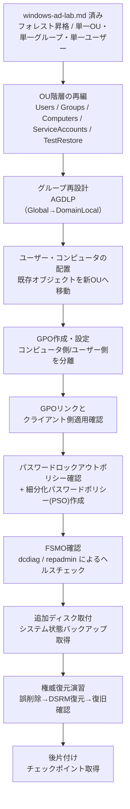
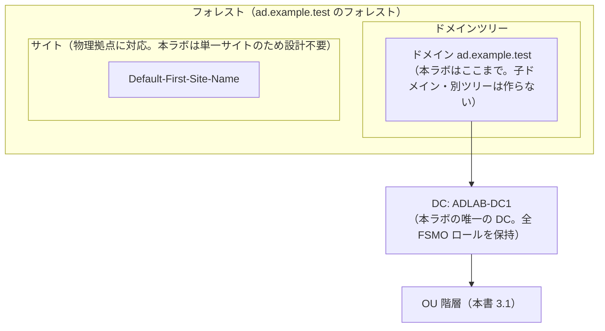
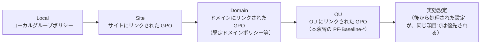

# 08 AD構築演習設計：OU・グループ・GPO・パスワードポリシー・ヘルスチェック・バックアップ（ADLAB / ad.example.test）

**この演習を一言でいうと**

フォレスト昇格まで終えたドメインコントローラ 1 台（`ADLAB-DC1`）を前提に、
「利用者をどの入れ物（OU）に整理し、どの入れ物にどんな設定（GPO）を配り、
消してしまったときにどう戻すか」を、パラメータシート・構築手順書・試験項目書の形にまとめた
**演習の設計書**です。

面接や引き継ぎで説明するときの 1 文（「設計まで完了、実施はこれから」と必ず添える）:
「AD を建てて終わりにせず、OU の分け方・グループの作り方・ポリシーの配り方・
バックアップからの戻し方までを、確認コマンドとセットで設計した演習です。」

以降の「本ドキュメントの位置付け」は、既存の資料とどう分担しているかの説明です。
初読では読み飛ばして [1 章](#1-演習の目的スコープ前提条件)から読み始めても構いません。
知らない用語が出てきたら [2 章の語彙表](#2-ad-の基礎概念と要件基本設計)と
[付録 A](#付録-a-ad-基礎用語辞典)に戻ってください。

> **本ドキュメントの位置付け**
>
> [01 学習環境の作り方 §6](./01-environment.md#6-windows-server-の学習環境任意)は、Windows Server の学習範囲として
> 「AD DS の構築、OU 設計、ユーザー作成、グループポリシーの基本、PowerShell での一括操作」を挙げています。
> このうち、AD DS の構築（forest promotion）とユーザー作成の最小限は
> [Windows / AD 公開再現ラボ §4・§7](../evidence/templates/windows-ad-lab.md)に、PowerShell での一括操作は
> [06 シェルスクリプト演習設計 §4.4](./06-shell-scripting-exercise-design.md#44-level-4-active-directory-運用スクリプト)に、
> それぞれ具体化されています。**しかし「OU 設計」と「グループポリシーの基本」は、01 が学習範囲として名指ししているにもかかわらず、
> どちらの資料にも詳細設計がありません**（windows-ad-lab.md §7 は単一のラボ OU と単一のグループを作るだけで、
> 設計判断の理由や、グループポリシー・パスワードポリシー・FSMO・バックアップには触れていません）。
>
> 本書はこの差分を埋め、[STATUS.md](../../STATUS.md)の「コードでは埋められない、残っている穴」5 番目
> （研修で触れている **Windows Server / AD** が portfolio に出ていないこと）に対応する範囲を、
> フォレスト構築の**先**まで広げます。[03 構築工程の実務ドキュメント](./03-build-process.md)の様式
> （パラメータシート・構築手順書・試験項目書）に沿い、**「なぜその設計にしたか」を Linux 側の
> [05 Phase 1 演習設計](./05-phase1-exercise-design.md)と同じ密度で**書きます。
>
> **windows-ad-lab.md との関係（重複させない）**: 本書は windows-ad-lab.md §4（フォレスト昇格）が完了済みであることを
> 前提条件とし、**昇格手順そのものは再掲しません**。windows-ad-lab.md §7 が作った単一 OU（`PortfolioLab`）・
> 単一グループ・単一ユーザーは本書の出発点として使い、そこに OU 階層・AGDLP グループ戦略・GPO・
> パスワードポリシー（既定 + 細分化）・FSMO 確認・ヘルスチェック・システム状態バックアップ／権威復元を追加します。
> windows-ad-lab.md §8（90 日未ログイン棚卸し）・§9（DNS 障害注入からドメイン参加）は対象外とし、重複させません
> （役割分担は[付録 B](#付録-b-本演習と既存資料の役割分担)に一覧化）。
>
> 対象読者は [06 の前提条件](./06-shell-scripting-exercise-design.md#前提条件)と同じく、Windows は
> [志望トラック](../target-roles.md)の**補助トラック（IT サポート・社内 SE 補助）**に対応する任意設計です。
> Linux（第一志望）の学習を優先し、時間が余れば着手する位置付けは 06 と揃えています。
>
> 本ドキュメントは**設計であり、実施記録ではありません**。実施したら [8. 実施ステータス](#8-実施ステータスと次のアクション)を更新します。

最終更新: 2026-08-26

> **実施ステータス: 設計のみ・未実施**（2026-08-26 時点）。前提となる windows-ad-lab.md §4 のフォレスト昇格自体が
> 本書執筆時点で `NOT RUN` のため、本書の着手はさらにその後になります。試験項目書の実測結果欄はすべて空欄です。

---

## 目次

| 節 | 内容 |
| --- | --- |
| [1](#1-演習の目的スコープ前提条件) | 目的・スコープ・前提条件 |
| [2](#2-ad-の基礎概念と要件基本設計) | AD の基礎概念と要件・基本設計 |
| [3](#3-パラメータシート) | パラメータシート（OU・グループ・GPO・PSO・FSMO・バックアップ） |
| [4](#4-構築手順書) | 構築手順書 |
| [5](#5-試験項目書) | 試験項目書 |
| [6](#6-実施タイムテーブルと中断基準) | 実施タイムテーブルと中断基準 |
| [7](#7-証跡採録計画) | 証跡採録計画 |
| [8](#8-実施ステータスと次のアクション) | 実施ステータスと次のアクション |
| [付録 A](#付録-a-ad-基礎用語辞典) | AD 基礎用語辞典（フォレスト/ドメイン/サイト、FSMO、グループの種類とスコープ、GPO 処理順序） |
| [付録 B](#付録-b-本演習と既存資料の役割分担) | 本演習と既存資料の役割分担（windows-ad-lab.md・06 §4.4 との対応） |

---

## 1. 演習の目的・スコープ・前提条件

### 目的

[01 学習環境 §6](./01-environment.md#6-windows-server-の学習環境任意)が学習範囲に挙げる「OU 設計」「グループポリシーの基本」を、
[03 構築工程の実務ドキュメント](./03-build-process.md)の様式（要件定義 → 基本設計 → パラメータシート → 構築手順書 → 試験項目書）
まで具体化する。windows-ad-lab.md §7 の単一 OU・単一グループという最小構成を、実務の AD 構築案件で一般的な
**OU 階層・AGDLP グループ戦略・GPO によるベースライン適用・パスワードポリシー・FSMO 確認・システム状態バックアップ**
まで拡張し、「ドメインコントローラを 1 台昇格させた」で終わらない設計にする。

完成後の成果物は、[志望トラックと証跡の対応](../target-roles.md)の「IT サポート・社内 SE 補助」トラックが
次アクションに挙げる「実機出力を添えた Windows / AD 切り分け記録」の土台になる。

### スコープ

| 対象 | 扱い |
| --- | --- |
| フォレスト / ドメイン昇格そのもの | **対象外**。[windows-ad-lab.md §4](../evidence/templates/windows-ad-lab.md#4-greenfield-ad-ds--dns-forest-の構築)の手順をそのまま前提にする |
| OU 階層の設計・作成 | **対象**。[3.1](#31-ou-階層) / [4.2](#42-ou-階層の作成)。windows-ad-lab.md §7.2 の単一 OU（`PortfolioLab`）を起点に、目的別の子 OU へ分割する |
| グループ戦略（AGDLP）の設計・作成 | **対象**。[3.2](#32-グループ設計agdlp) / [4.3](#43-グループの作成とネストagdlp)。windows-ad-lab.md §7.2 が作る単一グループの代わりに使う設計であり、既存グループを置き換える |
| GPO の作成・設定・リンク・適用確認 | **対象**。[3.3](#33-gpo-設計) / [4.5](#45-gpo-の作成と設定) 〜 [4.6](#46-gpo-のリンクとクライアント側の適用確認) |
| 既定ドメインパスワードポリシーの確認、細分化パスワードポリシー（PSO）の設計・作成 | **対象**。[3.4](#34-パスワードロックアウトポリシー) / [4.7](#47-パスワードロックアウトポリシーの確認と-pso-の作成) |
| FSMO ロールの確認、`dcdiag` / `repadmin` によるヘルスチェック | **対象**。[3.5](#35-fsmo-とヘルスチェック対象) / [4.8](#48-fsmo-ロールとヘルスチェック) |
| システム状態バックアップの取得、権威復元（authoritative restore）演習 | **対象**。[3.6](#36-バックアップ設定) / [4.9](#49-追加ディスクとシステム状態バックアップ) 〜 [4.10](#410-権威復元演習ou-の誤削除からの復旧) |
| ラボドメインに対する CSV からのユーザー一括作成スクリプト | **対象外**。[06 §4.4 演習 E](./06-shell-scripting-exercise-design.md#演習-eフラッグシップ-new-labuserbatchps1) が扱う。本書はスクリプト化ではなく AD 側の構造設計を対象にする |
| 90 日未ログイン棚卸し | **対象外**。[windows-ad-lab.md §8](../evidence/templates/windows-ad-lab.md#8-90-日未ログイン棚卸し)が扱う済み。重複させない |
| DNS 障害注入・クライアントのドメイン参加 | **対象外**。[windows-ad-lab.md §9](../evidence/templates/windows-ad-lab.md#9-dns-障害注入から-domain-参加復旧まで)が扱う済み。本書はそこで参加済みのクライアントを GPO 適用確認にのみ再利用する |
| マルチドメイン・フォレスト間信頼、サイトとレプリケーション、RODC | **対象外**。ラボが単一ドメイン・単一 DC のため実演できない。理由と本番との違いは[2 章の決定事項](#決定事項選定と理由)と[付録 A](#付録-a-ad-基礎用語辞典)に明記する |
| Azure AD Connect / Microsoft Entra ID との連携 | **対象外**。[今後の興味リスト](../roadmap/README.md)・[志望トラック](../target-roles.md)のいずれにも記載がなく、本書のスコープに含めない |
| セキュリティテンプレートの網羅的な適用（CIS Benchmark 等への準拠） | **対象外**。本演習は GPO の作成・リンク・適用確認という基礎の実演に限定し、網羅的なベースライン適用は扱わない |

### 前提条件

- [windows-ad-lab.md §3 の安全条件](../evidence/templates/windows-ad-lab.md#3-公開前の安全条件)を満たし、
  [§4 のフォレスト昇格](../evidence/templates/windows-ad-lab.md#4-greenfield-ad-ds--dns-forest-の構築)が完了していること
  （フォレスト `ad.example.test` / NetBIOS `ADLAB` / DC `ADLAB-DC1` が稼働中）
- [windows-ad-lab.md §7.2](../evidence/templates/windows-ad-lab.md#72-ou--group--test-user-の安全な作成) が作った
  ラボ OU（`PortfolioLab`）・グループ（`pf-ops-readers`）・テストユーザー（`pf-user01`）が存在すること。
  本書ではこの単一グループと単一 OU 構成を、[4.2](#42-ou-階層の作成) 〜 [4.3](#43-グループの作成とネストagdlp)で
  階層構成へ再編する
- [windows-ad-lab.md §9](../evidence/templates/windows-ad-lab.md#9-dns-障害注入から-domain-参加復旧まで) の手順で
  ドメイン参加済みのクライアント VM が 1 台あること。本書ではこれを `ADLAB-CLI1` と呼び、GPO の適用確認に使う
  （新規に VM を追加しない。[07 の LAB-WINOPS1](./07-python-ops-automation-exercise-design.md#31-lab-winops1新規ホストの基本情報)は
  standalone のまま扱う別ホストであり、本書とは無関係）
- DC 昇格時（windows-ad-lab.md §4.3）に設定した **DSRM（ディレクトリサービス復元モード）管理者パスワードを、
  本人だけが分かる安全な方法で控えていること**。忘れると[4.10 の権威復元演習](#410-権威復元演習ou-の誤削除からの復旧)が実行できない
- `ADLAB-DC1` に、システム状態バックアップの保存先専用の追加仮想ディスクを 1 本（20 GB 以上、OS ディスクとは別）
  取り付けられること（[3.6](#36-バックアップ設定)、`wbadmin` はバックアップ先に専用ボリュームを要求する）
- PowerShell の `ActiveDirectory` モジュールと `GroupPolicy` モジュールが `ADLAB-DC1` 上で利用可能であること
  （AD DS 昇格時に RSAT ツールも導入済みのため追加インストールは不要）

### 想定所要時間

| 区分 | 時間 |
| --- | --- |
| 初回・構築（[4.1](#41-作業前確認)〜[4.9](#49-追加ディスクとシステム状態バックアップ)。OU/グループ/ユーザー再編、GPO、パスワードポリシー、FSMO/ヘルスチェック、バックアップ取得まで） | 4〜5 時間 |
| [4.10 権威復元演習](#410-権威復元演習ou-の誤削除からの復旧)（DSRM への再起動を 2 回含む） | 1.5〜2 時間。最も時間がかかる区分のため、別セッションに分けてよい |
| 初回・試験（[5 章](#5-試験項目書) T-01〜T-26） | 2〜2.5 時間 |
| 2 回目以降（手順書のみを見た再現性検証） | 2.5 時間以内 |

---

## 2. AD の基礎概念と要件・基本設計

### AD の基礎概念（本演習を理解するための最小限）

未経験者が AD の設計判断を読むには、最低限次の語彙が要る。より詳しい説明は[付録 A](#付録-a-ad-基礎用語辞典)に譲り、
ここでは本章の決定事項を理解するために必要な範囲だけを先に示す。

| 用語 | 最小限の説明 |
| --- | --- |
| フォレスト / ドメイン | AD の管理境界。本演習のラボは単一ドメイン（`ad.example.test`）・単一フォレストで、複数ドメインは扱わない |
| ドメインコントローラ（DC） | ドメインの認証・ディレクトリデータを保持するサーバー。本演習のラボは `ADLAB-DC1` の 1 台のみ |
| OU（組織単位） | ユーザー・グループ・コンピュータをまとめる入れ物。**GPO をリンクできる単位**であり、権限委任の単位でもある |
| GPO（グループポリシーオブジェクト） | コンピュータ・ユーザーへ設定を配布する仕組み。OU・ドメイン・サイトにリンクして適用範囲を決める |
| グループの種類とスコープ | 種類はセキュリティ／配布の 2 つ、スコープはドメインローカル／グローバル／ユニバーサルの 3 つ。組み合わせ方の定石が **AGDLP**（Account → Global → Domain Local → Permission）で、「ユーザー（Account）はグローバルグループにまとめ、そのグローバルグループを、権限を持つドメインローカルグループへ入れる」という並び順の頭文字をつないだ略語 |
| FSMO（Flexible Single Master Operations） | ディレクトリ全体の整合性に関わる 5 つの役割（フォレスト全体で 2 つ、ドメインごとに 3 つ）。AD は通常どの DC でも書き込めるが、競合すると不整合を招くこの 5 つだけは担当 DC を 1 台に決める（担当は後から別の DC へ移せるので Flexible と呼ぶ）。単一 DC ラボでは全役割が 1 台に集中する |

### 非機能要件（学習ラボとしての最小要件）

| 項目 | 要件 | 理由 |
| --- | --- | --- |
| 可用性 | 単一 DC。冗長化なし | 本演習は「OU・グループ・GPO・ポリシー・ヘルスチェック・バックアップの設計」が目的であり、DC 冗長化・サイト設計は範囲外（[付録 A](#付録-a-ad-基礎用語辞典)で本番との差を明記） |
| セキュリティ | OU による委任境界の用意、GPO による最小限のベースライン適用、既定ポリシーではなく PSO で影響範囲を絞った強化 | 実務の AD 構築案件が要件定義で扱う「どこまでの範囲に、どの強さの設定を当てるか」という判断を、小規模でも同じ考え方で再現する |
| 再現性 | 手順書のみで、windows-ad-lab.md §4・§7・§9 完了後のドメインから 1 日以内に再構築できる | [03 構築手順書の原則](./03-build-process.md#3-構築手順書)と同じ |
| 事故防止 | 誤削除防止（`ProtectedFromAccidentalDeletion`）、GPO のリンク先を作業前に確認してからリンクする、DSRM 再起動前にパスワードと復元対象を確認する | [03 §6 本番作業の作法](./03-build-process.md#6-本番作業の作法)「破壊的操作は対象を先に確認する」を、AD 特有の操作（OU 削除・GPO 誤リンク・DSRM 復元）に適用する |
| 永続性 | DC 再起動後・クライアント再起動後も OU / グループ / GPO リンク / PSO の設定が保持される | [試験項目書](#5-試験項目書) T-17・T-18 で確認する |

### 基本設計（構成と選定理由）



図の要約：windows-ad-lab.md が作った最小構成（フォレスト・単一 OU・単一グループ・単一ユーザー）を起点に、
OU 階層の再編 → AGDLP グループ再設計 → オブジェクトの配置 → GPO の作成・リンク・適用確認 →
パスワードポリシー（既定確認 + PSO 新設） → FSMO 確認・ヘルスチェック → バックアップ取得 → 権威復元演習 →
チェックポイント取得、の順に進む。**各段階の後に必ず確認コマンドを実行してから次へ進む**（05 と同じ進め方）。

### 決定事項（選定と理由）

| 決定事項 | 選定 | 理由・比較した選択肢 |
| --- | --- | --- |
| OU 階層 | `PortfolioLab` 直下に `Users` / `Groups` / `Computers` / `ServiceAccounts` / `TestRestore` の 5 OU | windows-ad-lab.md §7 のフラット 1 OU との比較。GPO のリンク単位・委任単位を目的別に分けられる、実務の最小構成に近い設計にする。ただし大規模組織にある拠点別・部署別のネストは行わず、学習目的で型だけを再現する（[付録 A](#付録-a-ad-基礎用語辞典)の OU 設計原則を参照） |
| グループ戦略 | AGDLP（Account をまとめた Global グループを、リソース権限を持つ Domain Local グループへネストする） | Microsoft が推奨するベストプラクティス。単一ドメインのラボでも、将来ドメインが増えても崩れない設計を先に身につける。比較: ユーザーへ直接権限を割り当てる方式は小規模なら簡単だが棚卸しが困難になり、[windows-ad-lab.md §8](../evidence/templates/windows-ad-lab.md#8-90-日未ログイン棚卸し)のような棚卸し運用と相性が悪い |
| GPO のリンク先 | ドメインではなく OU（`Computers` / `Users`） | 影響範囲をラボ OU 配下に限定し、ドメイン全体へリンクする既定ドメインポリシーには手を加えない。ドメインリンクは全ユーザー・全コンピュータへ影響するため、学習中の事故のコストが高い |
| GPO を Computer Configuration 用と User Configuration 用の 2 本に分ける | `PF-Baseline-Workstation`（Computer 側、`Computers` OU にリンク）と `PF-Baseline-Users`（User 側、`Users` OU にリンク）に分離 | User Configuration の設定は、**ログオンするユーザーの OU 位置**を見て適用され、コンピュータの OU 位置は見ない（ループバック処理を有効化しない限り）。1 本の GPO を Computers OU にリンクしただけでは User Configuration 側の設定が効かないという典型的な誤解を、意図的に 2 本へ分けることで演習内で扱う（[付録 A](#付録-a-ad-基礎用語辞典)） |
| パスワードポリシー | 既定ドメインパスワードポリシーは変更せず、細分化パスワードポリシー（PSO）を新設してサービスアカウント用グループにのみ適用 | 実務では「管理者・サービスアカウントだけ強いポリシー」という細分化が一般的。既定ポリシーを直接変更すると全ユーザーに影響するため、学習用でも影響範囲を絞る設計を選ぶ |
| FSMO | 5 ロールを `ADLAB-DC1` に集約したまま変更しない | 単一 DC ラボでは役割分散に意味がない。本演習は「保持者を確認しヘルスチェックする」までを対象とし、ロール移譲（`Move-ADDirectoryServerOperationMasterRole`）やロールの強制取得（seize）は対象外にする。理由と本番との違いは[付録 A](#付録-a-ad-基礎用語辞典)に明記する |
| バックアップ方式 | `wbadmin` によるシステム状態バックアップ | Windows Server 標準機能で追加ライセンスが不要。AD ごみ箱（Recycle Bin）は既定で無効かつフォレスト機能レベルの要件があるため、本演習では有効化・使用を対象外とし、代わりにシステム状態バックアップと復元の考え方（非権威復元 / 権威復元の違い）を扱う（[付録 A](#付録-a-ad-基礎用語辞典)） |
| 復元演習の対象範囲 | `TestRestore` という使い捨て専用 OU 配下だけを権威復元の対象にする | ラボ全体を巻き戻すなら仮想化基盤のチェックポイントで足りる。`wbadmin` + `ntdsutil` による権威復元は「本番で他の DC が残っている場合に、削除がレプリケーションで巻き戻されないようにする」ための手順であり、それ自体を学ぶことが目的のため、影響範囲を専用 OU に限定して安全に実演する |

---

## 3. パラメータシート

[03 構築工程の実務ドキュメント §2](./03-build-process.md#2-パラメータシート)の様式。windows-ad-lab.md が定義済みの
フォレスト名・NetBIOS 名・DC 名・DSRM パスワードの扱いは重複させず、**本書で追加・再編する項目だけ**を書く。

### 3.1 OU 階層

| OU 名 | 完全パス（DN） | 用途 | `ProtectedFromAccidentalDeletion` |
| --- | --- | --- | --- |
| `PortfolioLab` | `OU=PortfolioLab,DC=ad,DC=example,DC=test` | ラボ全体のルート OU（windows-ad-lab.md §7.2 で作成済み） | 有効（windows-ad-lab.md §7.2 の設定を維持） |
| `Users` | `OU=Users,OU=PortfolioLab,DC=ad,DC=example,DC=test` | ラボ専用のユーザーオブジェクト | 有効 |
| `Groups` | `OU=Groups,OU=PortfolioLab,DC=ad,DC=example,DC=test` | ラボ専用のグループオブジェクト（Global / Domain Local 双方） | 有効 |
| `Computers` | `OU=Computers,OU=PortfolioLab,DC=ad,DC=example,DC=test` | ドメイン参加済みクライアントのコンピュータオブジェクト | 有効 |
| `ServiceAccounts` | `OU=ServiceAccounts,OU=PortfolioLab,DC=ad,DC=example,DC=test` | PSO を適用するサービスアカウント相当のテストユーザー | 有効 |
| `TestRestore` | `OU=TestRestore,OU=PortfolioLab,DC=ad,DC=example,DC=test` | [4.10 権威復元演習](#410-権威復元演習ou-の誤削除からの復旧)専用の使い捨て OU | **無効**（削除演習の対象のため意図的に外す） |

### 3.2 グループ設計（AGDLP）

| グループ名 | スコープ | 種別 | 配置 OU | メンバー | 用途 |
| --- | --- | --- | --- | --- | --- |
| `pf-g-helpdesk-staff` | Global | Security | `Groups` | `pf-user01`、`pf-user02` | 業務ロール（ヘルプデスク担当）をまとめる Account 側グループ |
| `pf-dl-helpdesk-share-ro` | Domain Local | Security | `Groups` | `pf-g-helpdesk-staff`（ネスト） | 共有フォルダへの読み取り権限を持つ Resource 側グループ（[T-15](#5-試験項目書)で権限付与に使う） |
| `pf-g-service-accounts` | Global | Security | `Groups` | `pf-svc01` | [PSO](#34-パスワードロックアウトポリシー)の適用対象をまとめる Account 側グループ |

> windows-ad-lab.md §7.2 が作った `pf-ops-readers` は本書では使わない。同じ AGDLP の考え方を学習用にゼロから再設計するため、
> [4.3](#43-グループの作成とネストagdlp)で新規グループへ作り直す（既存グループは削除せず残してよい。委任済みの権限がなく実害はない）。

### 3.3 GPO 設計

| GPO 名 | 対象設定 | リンク先 OU | レジストリキー / 値 | 選定理由 |
| --- | --- | --- | --- | --- |
| `PF-Baseline-Workstation` | Computer Configuration。サインイン画面に前回ログオンユーザー名を表示しない | `Computers` | `HKLM\Software\Microsoft\Windows\CurrentVersion\Policies\System` \| `DontDisplayLastUserName`（`DWord` \| `1`） | セキュリティオプション「対話型ログオン: 最後にログオンしたユーザー名を表示しない」の代表例。レジストリ値 1 本で設定でき、`gpresult` で確認しやすい |
| `PF-Baseline-Users` | User Configuration。レジストリ編集ツールへのアクセスを禁止 | `Users` | `HKCU\Software\Microsoft\Windows\CurrentVersion\Policies\System` \| `DisableRegistryTools`（`DWord` \| `1`） | ユーザー側設定の代表例。Computer 側 GPO とは**別 OU にリンクしないと効かない**ことを実演するために、意図的に別 GPO・別リンク先にする（[2 章の決定事項](#決定事項選定と理由)） |

### 3.4 パスワード・ロックアウトポリシー

| 項目 | 既定ドメインパスワードポリシー（変更しない・確認のみ） | 細分化パスワードポリシー `PF-Strict-ServiceAccounts`（新設） |
| --- | --- | --- |
| 最小文字数 | 7（既定値をそのまま確認） | 20 |
| パスワード履歴 | 24（既定値をそのまま確認） | 24 |
| 複雑さの要件 | 有効（既定値をそのまま確認） | 有効 |
| 可逆暗号化 | 無効（既定値をそのまま確認） | 無効 |
| 最大パスワード有効期間 | 42 日（既定値をそのまま確認） | 90 日 |
| 最小パスワード有効期間 | 1 日（既定値をそのまま確認） | 1 日 |
| ロックアウトしきい値 | 0（既定は無効。確認のみ） | 5 回 |
| ロックアウト期間 | 該当なし | 30 分 |
| ロックアウト観測時間 | 該当なし | 30 分 |
| Precedence（優先順位） | 該当なし | 10 |
| 適用対象 | ドメイン全ユーザー（変更なし） | `pf-g-service-accounts` |

> 優先順位（`Precedence`）は**数値が小さいほど優先される**。複数の PSO が同じユーザーに適用される場合、
> 最小の `Precedence` を持つ PSO 1 つだけが有効になる（既定ドメインポリシーとは併用されず、PSO が優先される）。
> この挙動は [T-21](#5-試験項目書) で実際に競合させて確認する。

### 3.5 FSMO とヘルスチェック対象

| 役割 | スコープ | 本ラボでの保持者 | 確認コマンド |
| --- | --- | --- | --- |
| スキーママスター | フォレスト全体 | `ADLAB-DC1` | `Get-ADForest \| Select-Object SchemaMaster` |
| ドメイン名前付けマスター | フォレスト全体 | `ADLAB-DC1` | `Get-ADForest \| Select-Object DomainNamingMaster` |
| RID マスター | ドメインごと | `ADLAB-DC1` | `Get-ADDomain \| Select-Object RIDMaster` |
| PDC エミュレータ | ドメインごと | `ADLAB-DC1` | `Get-ADDomain \| Select-Object PDCEmulator` |
| インフラストラクチャマスター | ドメインごと | `ADLAB-DC1` | `Get-ADDomain \| Select-Object InfrastructureMaster` |
| ヘルスチェック（一括） | — | — | `dcdiag /v /c`、`repadmin /showrepl`、`repadmin /replsummary` |

### 3.6 バックアップ設定

| 項目 | 値 |
| --- | --- |
| バックアップ対象 | システム状態（AD DS データベース `ntds.dit`、SYSVOL、レジストリ、ブートファイル等一式） |
| バックアップ先 | 追加仮想ディスク（`E:`、20 GB、OS ディスクとは別） |
| 取得方法 | `wbadmin start systemstatebackup -backupTarget:E: -quiet` |
| 世代管理 | ラボの規模上、明示的な世代削除は行わず `wbadmin get versions` で世代を都度確認する（本番運用では [W4 の 7 世代ルール](./02-curriculum.md#w4-ディスクファイルシステムシェルスクリプト)に相当する保持ポリシーの検討が必要になる旨を学びとして残す） |
| 復元対象（演習用） | `TestRestore` OU 配下のテストオブジェクト（[4.10](#410-権威復元演習ou-の誤削除からの復旧)） |
| DSRM 管理者パスワード | windows-ad-lab.md §4.3 で設定済みの値をそのまま使う（本書では新規設定しない） |

---

## 4. 構築手順書

[03 構築工程の実務ドキュメント §3](./03-build-process.md#3-構築手順書)の原則（想定結果のない手順を書かない・コピー＆ペーストで
実行できる粒度）に従う。すべて `ADLAB-DC1` 上の管理者 PowerShell（[4.6](#46-gpo-のリンクとクライアント側の適用確認)のみ
`ADLAB-CLI1` 側の操作を含む）で実行する。

### 4.1 作業前確認

| No | 確認内容 | コマンド | 想定結果 |
| --- | --- | --- | --- |
| 4.1-1 | フォレスト昇格済み確認 | `Get-ADForest \| Select-Object Name, RootDomain, ForestMode` | `Name`/`RootDomain` が `ad.example.test` |
| 4.1-2 | ラボ OU・グループ・ユーザーの存在確認 | `Get-ADOrganizationalUnit -Identity "OU=PortfolioLab,DC=ad,DC=example,DC=test"`、`Get-ADUser -Filter "SamAccountName -eq 'pf-user01'"` | いずれもエラーなく取得できる |
| 4.1-3 | クライアントのドメイン参加確認 | `ADLAB-CLI1` 上で `Get-CimInstance Win32_ComputerSystem \| Select-Object Domain, PartOfDomain` | `PartOfDomain: True`、`Domain: ad.example.test` |
| 4.1-4 | DSRM パスワードの保有確認 | （コマンドなし。本人が控えを確認する） | [4.10](#410-権威復元演習ou-の誤削除からの復旧)で入力できることを事前に確認済み |
| 4.1-5 | チェックポイント取得（作業前） | 仮想化基盤で `before-ad-design` という名前のチェックポイントを取得 | 一覧に表示される |

### 4.2 OU 階層の作成

| No | 作業内容 | コマンド | 想定結果 | 判定 |
| --- | --- | --- | --- | --- |
| 4.2-1 | 子 OU を一括作成 | `"Users","Groups","Computers","ServiceAccounts" \| ForEach-Object { New-ADOrganizationalUnit -Name $_ -Path "OU=PortfolioLab,DC=ad,DC=example,DC=test" -ProtectedFromAccidentalDeletion $true }` | 出力なし | `Get-ADOrganizationalUnit -Filter * -SearchBase "OU=PortfolioLab,DC=ad,DC=example,DC=test"` に 4 つの子 OU が表示される |
| 4.2-2 | 復元演習専用 OU を作成（削除保護は無効） | `New-ADOrganizationalUnit -Name "TestRestore" -Path "OU=PortfolioLab,DC=ad,DC=example,DC=test" -ProtectedFromAccidentalDeletion $false` | 出力なし | `(Get-ADOrganizationalUnit -Identity "OU=TestRestore,OU=PortfolioLab,DC=ad,DC=example,DC=test").ProtectedFromAccidentalDeletion` が `False` |
| 4.2-3 | 階層確認 | `Get-ADOrganizationalUnit -Filter * -SearchBase "OU=PortfolioLab,DC=ad,DC=example,DC=test" \| Select-Object Name, DistinguishedName` | [3.1](#31-ou-階層)の 6 OU（ルート含む）が表示される | パラメータシートと一致 |

### 4.3 グループの作成とネスト（AGDLP）

| No | 作業内容 | コマンド | 想定結果 | 判定 |
| --- | --- | --- | --- | --- |
| 4.3-1 | Global グループ作成 | `New-ADGroup -Name "pf-g-helpdesk-staff" -SamAccountName "pf-g-helpdesk-staff" -GroupScope Global -GroupCategory Security -Path "OU=Groups,OU=PortfolioLab,DC=ad,DC=example,DC=test"` | 出力なし | `Get-ADGroup pf-g-helpdesk-staff -Properties GroupScope, GroupCategory` が `Global`/`Security` |
| 4.3-2 | Domain Local グループ作成 | `New-ADGroup -Name "pf-dl-helpdesk-share-ro" -SamAccountName "pf-dl-helpdesk-share-ro" -GroupScope DomainLocal -GroupCategory Security -Path "OU=Groups,OU=PortfolioLab,DC=ad,DC=example,DC=test"` | 出力なし | 同上コマンドが `DomainLocal`/`Security` |
| 4.3-3 | サービスアカウント用 Global グループ作成 | `New-ADGroup -Name "pf-g-service-accounts" -SamAccountName "pf-g-service-accounts" -GroupScope Global -GroupCategory Security -Path "OU=Groups,OU=PortfolioLab,DC=ad,DC=example,DC=test"` | 出力なし | 同上 |
| 4.3-4 | Global を Domain Local へネスト | `Add-ADGroupMember -Identity "pf-dl-helpdesk-share-ro" -Members "pf-g-helpdesk-staff"` | 出力なし | `Get-ADGroupMember -Identity "pf-dl-helpdesk-share-ro"` に `pf-g-helpdesk-staff` が表示される |
| 4.3-5 | 追加テストユーザー作成 | `New-ADUser -Name "pf-user02" -SamAccountName "pf-user02" -UserPrincipalName "pf-user02@ad.example.test" -Path "OU=Users,OU=PortfolioLab,DC=ad,DC=example,DC=test" -AccountPassword (Read-Host -AsSecureString "一時 password を入力") -Enabled $true -ChangePasswordAtLogon $true`（`New-ADUser "pf-svc01" ...`も同様に `ServiceAccounts` OU へ作成） | 対話式でパスワード入力後、作成される | `Get-ADUser -Filter "SamAccountName -like 'pf-*'" -SearchBase "OU=PortfolioLab,DC=ad,DC=example,DC=test"` に `pf-user01`（後述 4.4 で移動）・`pf-user02`・`pf-svc01` が表示される |
| 4.3-6 | Account を Global へ追加 | `Add-ADGroupMember -Identity "pf-g-helpdesk-staff" -Members "pf-user02"`、`Add-ADGroupMember -Identity "pf-g-service-accounts" -Members "pf-svc01"` | 出力なし | `Get-ADGroupMember -Identity "pf-g-helpdesk-staff" -Recursive` に `pf-user02` が表示される |

### 4.4 既存オブジェクトの新 OU への移動

| No | 作業内容 | コマンド | 想定結果 | 判定 |
| --- | --- | --- | --- | --- |
| 4.4-1 | 既存テストユーザーの移動 | `Get-ADUser "pf-user01" \| Move-ADObject -TargetPath "OU=Users,OU=PortfolioLab,DC=ad,DC=example,DC=test"` | 出力なし | `Get-ADUser "pf-user01"`（`Get-ADUser` の既定の検索でも取得できるが、`DistinguishedName` が新パスに変わっていることを確認） |
| 4.4-2 | Account を Global へ追加 | `Add-ADGroupMember -Identity "pf-g-helpdesk-staff" -Members "pf-user01"` | 出力なし | `Get-ADGroupMember -Identity "pf-g-helpdesk-staff"` に `pf-user01` が表示される |
| 4.4-3 | クライアントのコンピュータオブジェクトを移動 | `Get-ADComputer "ADLAB-CLI1" \| Move-ADObject -TargetPath "OU=Computers,OU=PortfolioLab,DC=ad,DC=example,DC=test"` | 出力なし | `Get-ADComputer "ADLAB-CLI1"` の `DistinguishedName` が `OU=Computers,OU=PortfolioLab,...` に変わる |

> **4.4-3 の注意**: コンピュータオブジェクトは既定で組み込みコンテナ `CN=Computers,DC=...`（**OU ではない**）に
> 作成される。組み込みコンテナには GPO をリンクできないため、GPO を適用するには必ず OU へ移動する必要がある。
> ドメイン参加時に `-OUPath` を指定しなかった場合、この移動作業は AD 構築の定番作業になる。

### 4.5 GPO の作成と設定

| No | 作業内容 | コマンド | 想定結果 | 判定 |
| --- | --- | --- | --- | --- |
| 4.5-1 | GPO 作成（Computer 側） | `New-GPO -Name "PF-Baseline-Workstation" -Comment "PortfolioLab computers baseline"` | GPO オブジェクトが返る | `Get-GPO -Name "PF-Baseline-Workstation"` が成功する |
| 4.5-2 | レジストリ値設定 | `Set-GPRegistryValue -Name "PF-Baseline-Workstation" -Key "HKLM\Software\Microsoft\Windows\CurrentVersion\Policies\System" -ValueName "DontDisplayLastUserName" -Type DWord -Value 1` | 設定結果が返る | `Get-GPRegistryValue -Name "PF-Baseline-Workstation" -Key "HKLM\Software\Microsoft\Windows\CurrentVersion\Policies\System"` に `DontDisplayLastUserName=1` |
| 4.5-3 | GPO 作成（User 側） | `New-GPO -Name "PF-Baseline-Users" -Comment "PortfolioLab users baseline"` | GPO オブジェクトが返る | `Get-GPO -Name "PF-Baseline-Users"` が成功する |
| 4.5-4 | レジストリ値設定 | `Set-GPRegistryValue -Name "PF-Baseline-Users" -Key "HKCU\Software\Microsoft\Windows\CurrentVersion\Policies\System" -ValueName "DisableRegistryTools" -Type DWord -Value 1` | 設定結果が返る | `Get-GPRegistryValue -Name "PF-Baseline-Users" -Key "HKCU\Software\Microsoft\Windows\CurrentVersion\Policies\System"` に `DisableRegistryTools=1` |

### 4.6 GPO のリンクとクライアント側の適用確認

| No | 作業内容 | コマンド | 想定結果 | 判定 |
| --- | --- | --- | --- | --- |
| 4.6-1 | リンク先の事前確認（誤リンク防止） | `(Get-ADOrganizationalUnit -Identity "OU=Computers,OU=PortfolioLab,DC=ad,DC=example,DC=test").DistinguishedName` の出力を目視で確認してから次に進む | パラメータシートの DN と一致 | 一致を確認してから 4.6-2 を実行する |
| 4.6-2 | Computer 側 GPO をリンク | `New-GPLink -Name "PF-Baseline-Workstation" -Target "OU=Computers,OU=PortfolioLab,DC=ad,DC=example,DC=test"` | リンク結果が返る | `Get-GPInheritance -Target "OU=Computers,OU=PortfolioLab,DC=ad,DC=example,DC=test"` の `GpoLinks` に表示される |
| 4.6-3 | User 側 GPO をリンク | `New-GPLink -Name "PF-Baseline-Users" -Target "OU=Users,OU=PortfolioLab,DC=ad,DC=example,DC=test"` | リンク結果が返る | `Get-GPInheritance -Target "OU=Users,OU=PortfolioLab,DC=ad,DC=example,DC=test"` の `GpoLinks` に表示される |
| 4.6-4 | クライアント側で強制適用 | `ADLAB-CLI1` の管理者 PowerShell で `gpupdate /force` | `Computer Policy update has completed successfully.` / `User Policy update has completed successfully.` | 2 行とも成功メッセージ |
| 4.6-5 | 適用結果の確認（サマリ） | `ADLAB-CLI1` で `gpresult /r` | `Applied Group Policy Objects` に `PF-Baseline-Workstation` と `PF-Baseline-Users`（`pf-user01` としてサインイン中の場合）の両方が表示される | 両 GPO が一覧に含まれる |
| 4.6-6 | 適用結果の確認（詳細レポート） | `ADLAB-CLI1` で `Get-GPResultantSetOfPolicy -ReportType Html -Path C:\temp\rsop.html` | HTML レポートが生成される | レポート内に `DontDisplayLastUserName` と `DisableRegistryTools` の適用が確認できる |
| 4.6-7 | 実機能の確認（User 側） | `pf-user01` でサインイン中の `ADLAB-CLI1` で `regedit` を起動 | 「レジストリ エディターはシステム管理者によって無効にされています。」の警告が表示され起動できない | 起動が拒否される |

### 4.7 パスワード・ロックアウトポリシーの確認と PSO の作成

| No | 作業内容 | コマンド | 想定結果 | 判定 |
| --- | --- | --- | --- | --- |
| 4.7-1 | 既定ドメインパスワードポリシーの確認 | `Get-ADDefaultDomainPasswordPolicy` | [3.4](#34-パスワードロックアウトポリシー)の既定値どおりの出力（`MinPasswordLength=7` 等） | パラメータシートと一致（確認のみ、変更しない） |
| 4.7-2 | PSO 作成 | `New-ADFineGrainedPasswordPolicy -Name "PF-Strict-ServiceAccounts" -Precedence 10 -MinPasswordLength 20 -PasswordHistoryCount 24 -ComplexityEnabled $true -ReversibleEncryptionEnabled $false -MaxPasswordAge "90.00:00:00" -MinPasswordAge "1.00:00:00" -LockoutThreshold 5 -LockoutDuration "00:30:00" -LockoutObservationWindow "00:30:00"` | 出力なし | `Get-ADFineGrainedPasswordPolicy -Identity "PF-Strict-ServiceAccounts"` が成功する |
| 4.7-3 | PSO の適用対象を設定 | `Add-ADFineGrainedPasswordPolicySubject -Identity "PF-Strict-ServiceAccounts" -Subjects "pf-g-service-accounts"` | 出力なし | `Get-ADFineGrainedPasswordPolicySubject -Identity "PF-Strict-ServiceAccounts"` に `pf-g-service-accounts` が表示される |
| 4.7-4 | 適用結果の確認（対象ユーザー側から） | `Get-ADUserResultantPasswordPolicy -Identity "pf-svc01"` | `MinPasswordLength: 20` 等、PSO の値が返る（既定ポリシーではなく PSO が優先される） | PSO の値と一致 |

### 4.8 FSMO ロールとヘルスチェック

| No | 作業内容 | コマンド | 想定結果 | 判定 |
| --- | --- | --- | --- | --- |
| 4.8-1 | FSMO 保持者の一括確認 | `netdom query fsmo` | 5 ロールすべて `ADLAB-DC1.ad.example.test` | [3.5](#35-fsmo-とヘルスチェック対象)と一致 |
| 4.8-2 | フォレスト全体ロールの確認（PowerShell 側） | `Get-ADForest \| Select-Object SchemaMaster, DomainNamingMaster` | 両方 `ADLAB-DC1.ad.example.test` | 4.8-1 と一致 |
| 4.8-3 | ドメインロールの確認（PowerShell 側） | `Get-ADDomain \| Select-Object PDCEmulator, RIDMaster, InfrastructureMaster` | 3 つとも `ADLAB-DC1.ad.example.test` | 4.8-1 と一致 |
| 4.8-4 | ヘルスチェック（正常系） | `dcdiag /v /c` | すべての項目が `passed test` | エラーなし |
| 4.8-5 | レプリケーション状況の確認 | `repadmin /showrepl` と `repadmin /replsummary` | 単一 DC のため送信元／宛先パートナーが存在しない旨の出力になる | エラーではなく「パートナーなし」であることを確認する（[付録 A](#付録-a-ad-基礎用語辞典)で本番との違いを補足） |

### 4.9 追加ディスクとシステム状態バックアップ

| No | 作業内容 | コマンド | 想定結果 | 判定 |
| --- | --- | --- | --- | --- |
| 4.9-1 | 追加仮想ディスクの取り付け | 仮想化基盤で 20 GB の VHD/VHDX を作成し `ADLAB-DC1` に取り付け | ディスクマネージャーに未初期化ディスクが表示される | 表示される |
| 4.9-2 | 初期化・フォーマット | ディスクの管理（GUI）または `Initialize-Disk -Number <N> -PartitionStyle GPT; New-Partition -DiskNumber <N> -UseMaximumSize -DriveLetter E; Format-Volume -DriveLetter E -FileSystem NTFS -NewFileSystemLabel "AD-Backup"` | `E:` ドライブが利用可能になる | `Get-Volume -DriveLetter E` が `NTFS`/`Healthy` |
| 4.9-3 | バックアップ取得前確認 | `wbadmin get versions` | 現時点でバックアップが存在しない旨のメッセージ | 想定どおり（初回のため） |
| 4.9-4 | システム状態バックアップ取得 | `wbadmin start systemstatebackup -backupTarget:E: -quiet` | `The backup operation successfully completed.` | 成功メッセージ |
| 4.9-5 | バックアップ世代の確認 | `wbadmin get versions` | 1 件のバージョンが表示される（バージョン識別子を控える。[4.10](#410-権威復元演習ou-の誤削除からの復旧)で使用） | バージョンが表示される |
| 4.9-6 | チェックポイント取得 | 仮想化基盤で `ad-backup-taken` という名前のチェックポイントを取得 | 一覧に表示される | 表示される |

### 4.10 権威復元演習（OU の誤削除からの復旧）

> **この節は DSRM への再起動を 2 回伴う、本書で最も時間とリスクが高い手順である。開始前に必ず
> [4.9-6 のチェックポイント](#49-追加ディスクとシステム状態バックアップ)が取得済みであることと、
> [1 章の前提条件](#前提条件)の DSRM 管理者パスワードを本人が入力できることを確認する。**

**なぜ 2 段階に分けるのか（4.10-5 と 4.10-6 の関係）**: 復元は「バックアップから書き戻す」（4.10-5＝**非権威復元**）と、
「書き戻したものが最新版だと宣言する」（4.10-6＝**権威としてのマーキング**）の 2 段階で行い、この 2 つを合わせて
**権威復元**と呼ぶ。非権威復元だけで終えると、書き戻したオブジェクトは「古いデータ」の扱いになるため、
他の DC が持つ「削除済み」という新しい情報が複製（レプリケーション）されてきて、もう一度消されてしまう。
そこで `ntdsutil` でオブジェクトのバージョン番号を引き上げ、「こちらが新しい」と宣言するのが 4.10-6 である。
本ラボは DC が 1 台だけ（単一 DC）なので他の DC から消されることは実際には起きないが、
本番と同じ順序を身につけるために 2 段階のまま実施する。

| No | 作業内容 | コマンド / 操作 | 想定結果 | 判定 |
| --- | --- | --- | --- | --- |
| 4.10-1 | 復元対象のテストオブジェクトを作成 | `New-ADUser -Name "pf-restore-target" -SamAccountName "pf-restore-target" -Path "OU=TestRestore,OU=PortfolioLab,DC=ad,DC=example,DC=test" -Enabled $false` | 出力なし | `Get-ADUser "pf-restore-target"` が成功する |
| 4.10-2 | **バックアップを取り直す**（4.10-1 の後の状態を含める） | `wbadmin start systemstatebackup -backupTarget:E: -quiet` | 成功メッセージ | `wbadmin get versions` に新しいバージョンが増える（このバージョン識別子を 4.10-5 で使う） |
| 4.10-3 | 障害注入（誤削除の再現） | `Remove-ADUser "pf-restore-target" -Confirm:$false` | 出力なし | `Get-ADUser "pf-restore-target"` が `Cannot find an object with identity` で失敗する |
| 4.10-4 | DSRM への再起動 | `bcdedit /set safeboot dsrepair` の後 `Restart-Computer` | 再起動後、DSRM セーフモードで起動する | サインイン画面が「セーフ モード」の表示になる |
| 4.10-5 | DSRM でサインインし非権威復元を実行 | ローカル `.\Administrator`（**ドメインアカウントではなく、windows-ad-lab.md §4.3 で設定した DSRM パスワードを使うローカル管理者**）でサインイン後、`wbadmin start systemstaterecovery -version:<4.10-2で控えたバージョン> -backupTarget:E: -quiet` | `The recovery operation completed successfully.` | 成功メッセージ。この時点ではまだ `pf-restore-target` は他 DC のレプリケーションに巻き戻される可能性がある状態（本ラボは単一 DC のため実際には巻き戻されないが、手順は本番と同じ順序で行う） |
| 4.10-6 | 権威復元のマーキング（DSRM のまま） | `ntdsutil` を起動し、対話プロンプトの遷移に沿って表の直後のコードブロックの通り1コマンドずつ入力（`activate instance ntds` → `authoritative restore` → `restore subtree <対象 OU>` → `quit` → `quit`） | 対象オブジェクトのバージョン番号が引き上げられた旨のログが出力される | エラーなく完了する |
| 4.10-7 | 通常起動へ戻す | `bcdedit /deletevalue safeboot` の後 `Restart-Computer` | 通常のドメインサインイン画面に戻る | ドメインアカウントでサインインできる |
| 4.10-8 | 復旧確認 | `Get-ADUser "pf-restore-target"` | オブジェクトが復活している | エラーなく取得できる |

**4.10-6 の `ntdsutil` 対話プロンプト**: `ntdsutil` は対話シェルであり、コマンドを1つ入力するたびにプロンプト自体が遷移する。そのため以下のように、遷移後のプロンプト文字列とそこに入力するコマンドの組を1行ずつ確認しながら進める（`restore subtree` の対象 OU は 4.10-1 で作成した `TestRestore` OU）。

```text
C:\> ntdsutil
ntdsutil: activate instance ntds
ntdsutil: authoritative restore
authoritative restore: restore subtree OU=TestRestore,OU=PortfolioLab,DC=ad,DC=example,DC=test
authoritative restore: quit
ntdsutil: quit
```

> **DSRM サインインの注意**: DSRM で使う `.\Administrator` は、ドメインの `Administrator` アカウントとは別物の
> **ローカル管理者アカウント**であり、パスワードも DC 昇格時に個別に設定した値（DSRM パスワード）を使う。
> ドメインアカウントの資格情報は AD DS が停止している DSRM では認証できない（[付録 A](#付録-a-ad-基礎用語辞典)）。

### 4.11 作業後確認

| No | 確認内容 | コマンド | 想定結果 |
| --- | --- | --- | --- |
| 4.11-1 | OU 階層 | `Get-ADOrganizationalUnit -Filter * -SearchBase "OU=PortfolioLab,DC=ad,DC=example,DC=test" \| Select-Object Name` | [3.1](#31-ou-階層)の 6 OU が表示される |
| 4.11-2 | GPO リンク | `Get-GPInheritance -Target "OU=Computers,OU=PortfolioLab,DC=ad,DC=example,DC=test"`、同 `Users` | それぞれ対応する GPO がリンクされている |
| 4.11-3 | PSO | `Get-ADFineGrainedPasswordPolicy -Filter *` | `PF-Strict-ServiceAccounts` が表示される |
| 4.11-4 | バックアップ | `wbadmin get versions` | 複数バージョンが表示される |
| 4.11-5 | チェックポイント取得（作業完了後） | 仮想化基盤で `ad-design-complete` という名前のチェックポイントを取得 | 一覧に表示される |

### 4.12 切り戻し手順

#### 切り戻しの判断基準

| 判断基準 | 対応 |
| --- | --- |
| GPO のリンク先を間違え、意図しない範囲に適用してしまった | 直ちに `Remove-GPLink` でリンクを外す（[R-1](#切り戻し手順作業手順と同じ粒度)）。GPO 自体は削除せず、リンクだけを外せば影響は即座に止まる |
| DSRM 再起動後、通常起動に戻れない、またはドメインへサインインできない | [4.9-6 のチェックポイント](#49-追加ディスクとシステム状態バックアップ)（`ad-backup-taken`）へ復元する。それ以前の重大な失敗は `before-ad-design` へ復元し、[6 章の中断基準](#6-実施タイムテーブルと中断基準)に従う |
| OU 階層やグループ設計を丸ごとやり直したい | チェックポイントへの復元を優先する。個別の `Remove-ADOrganizationalUnit` は削除保護の解除が必要で手間がかかるため（[R-2](#切り戻し手順作業手順と同じ粒度)） |

#### 切り戻し手順（作業手順と同じ粒度）

| No | 作業内容 | コマンド | 想定結果 | 判定 |
| --- | --- | --- | --- | --- |
| R-1 | GPO リンクの解除（4.6 の戻し） | `Remove-GPLink -Name "PF-Baseline-Workstation" -Target "OU=Computers,OU=PortfolioLab,DC=ad,DC=example,DC=test"`（`PF-Baseline-Users` も同様） | 出力なし | `Get-GPInheritance -Target ...` の `GpoLinks` が空になる |
| R-2 | OU の削除（4.2 の戻し。削除保護の解除が必要） | 対象 OU に対し `Set-ADOrganizationalUnit -Identity <DN> -ProtectedFromAccidentalDeletion $false` の後 `Remove-ADOrganizationalUnit -Identity <DN> -Confirm:$false -Recursive` | 出力なし | `Get-ADOrganizationalUnit -Identity <DN>` が失敗する |
| R-3 | PSO の削除（4.7 の戻し） | `Remove-ADFineGrainedPasswordPolicy -Identity "PF-Strict-ServiceAccounts" -Confirm:$false` | 出力なし | `Get-ADFineGrainedPasswordPolicy -Filter *` に表示されなくなる |
| R-4 | 復旧確認 | [4.1 の作業前確認](#41-作業前確認)と同じコマンドを再実行 | windows-ad-lab.md §4・§7・§9 が作った状態まで戻る | 一致する |

---

## 5. 試験項目書

[03 構築工程の実務ドキュメント §4](./03-build-process.md#4-試験項目書)の様式。異常系 8 件 / 全 26 件（約 31%）で、
[同ドキュメントが定める「異常系 3 割以上」](./03-build-process.md#異常系を必ず入れる理由)を満たす設計にしている。
実測結果・判定・エビデンス・実施日は**すべて未記入**（未実施のため）。

| No | 試験分類 | 観点 | 前提条件 | 手順 | 期待結果 | 実測結果 | 判定 | エビデンス | 実施日 |
| --- | --- | --- | --- | --- | --- | --- | --- | --- | --- |
| T-01 | 単体 | OU 階層 | [4.2](#42-ou-階層の作成)完了 | `Get-ADOrganizationalUnit -Filter * -SearchBase "OU=PortfolioLab,DC=ad,DC=example,DC=test"` | 6 OU（ルート含む）が表示される | | | | |
| T-02 | 単体 | グループのスコープ・種別 | [4.3](#43-グループの作成とネストagdlp)完了 | `Get-ADGroup -Filter "SamAccountName -like 'pf-*'" -Properties GroupScope, GroupCategory` | [3.2](#32-グループ設計agdlp)の値と一致 | | | | |
| T-03 | 単体 | グループのネスト | 同上 | `Get-ADGroupMember -Identity "pf-dl-helpdesk-share-ro"` | `pf-g-helpdesk-staff` が表示される | | | | |
| T-04 | 単体 | 再帰メンバーシップ | 同上 | `Get-ADGroupMember -Identity "pf-dl-helpdesk-share-ro" -Recursive` | `pf-user01`・`pf-user02` が表示される（ネスト経由） | | | | |
| T-05 | 単体 | GPO 作成 | [4.5](#45-gpo-の作成と設定)完了 | `Get-GPO -All \| Where-Object DisplayName -like "PF-*"` | 2 件表示される | | | | |
| T-06 | 単体 | GPO レジストリ値 | 同上 | `Get-GPRegistryValue -Name "PF-Baseline-Workstation" -Key "HKLM\Software\Microsoft\Windows\CurrentVersion\Policies\System"` | `DontDisplayLastUserName=1` | | | | |
| T-07 | 単体 | GPO リンク | [4.6](#46-gpo-のリンクとクライアント側の適用確認)完了 | `Get-GPInheritance -Target "OU=Computers,OU=PortfolioLab,DC=ad,DC=example,DC=test"` | `PF-Baseline-Workstation` が `GpoLinks` に表示される | | | | |
| T-08 | 単体 | PSO 作成 | [4.7](#47-パスワードロックアウトポリシーの確認と-pso-の作成)完了 | `Get-ADFineGrainedPasswordPolicy -Identity "PF-Strict-ServiceAccounts"` | [3.4](#34-パスワードロックアウトポリシー)の値と一致 | | | | |
| T-09 | 単体 | PSO 適用対象 | 同上 | `Get-ADFineGrainedPasswordPolicySubject -Identity "PF-Strict-ServiceAccounts"` | `pf-g-service-accounts` が表示される | | | | |
| T-10 | 単体 | FSMO 保持者 | [4.8](#48-fsmo-ロールとヘルスチェック)完了 | `netdom query fsmo` | 5 ロールすべて `ADLAB-DC1.ad.example.test` | | | | |
| T-11 | 単体 | ヘルスチェック（正常系） | 同上 | `dcdiag /v /c` | すべて `passed test` | | | | |
| T-12 | 単体 | バックアップ取得 | [4.9](#49-追加ディスクとシステム状態バックアップ)完了 | `wbadmin get versions` | バージョンが 1 件以上表示される | | | | |
| T-13 | 結合 | Computer 側 GPO の適用 | [4.6-4](#46-gpo-のリンクとクライアント側の適用確認)完了 | `ADLAB-CLI1` で `gpresult /r` を確認後、サインイン画面を表示 | 前回サインインしたユーザー名が表示されない | | | | |
| T-14 | 結合 | User 側 GPO の適用 | 同上 | `pf-user01` でサインイン中の `ADLAB-CLI1` で `regedit` を起動 | レジストリエディタが起動を拒否される | | | | |
| T-15 | 結合 | AGDLP 経由の権限付与 | [4.3](#43-グループの作成とネストagdlp)完了。加えて本試験の実施前に `ADLAB-DC1` 上でテスト用の共有フォルダを 1 つ作り、共有アクセス権と NTFS 権限の両方に `pf-dl-helpdesk-share-ro` の読み取りだけを付与しておく（AGDLP の **P（Permission）** にあたる作業。4 章の構築手順書には手順を置いていないため、この試験の準備として実施する） | `ADLAB-CLI1` に `pf-user01` でサインインし、`\\ADLAB-DC1\<共有名>` を開く。`pf-user01` 本人にも `pf-g-helpdesk-staff` にも直接の権限は付けないこと（Global → Domain Local のネスト経由だけでアクセスできることを確かめる試験のため） | 読み取りアクセスできる | | | | |
| T-16 | 結合 | PSO の実効値 | [4.7-4](#47-パスワードロックアウトポリシーの確認と-pso-の作成)完了 | `pf-svc01` で 19 文字のパスワードへの変更を試行 | `MinPasswordLength=20` により拒否される | | | | |
| T-17 | 総合 | DC 再起動後の保持 | [4.6](#46-gpo-のリンクとクライアント側の適用確認)〜[4.7](#47-パスワードロックアウトポリシーの確認と-pso-の作成)完了 | `ADLAB-DC1` を再起動後、T-01・T-05・T-07・T-08 を再実行 | 全項目が再起動前と同じ結果になる | | | | |
| T-18 | 総合 | クライアント再起動後の GPO 保持 | T-13・T-14 完了 | `ADLAB-CLI1` を再起動後、`gpresult /r` を再確認 | 適用 GPO 一覧が変わらない | | | | |
| T-19 | 異常系 | OU の誤削除防止 | [4.2](#42-ou-階層の作成)完了（`Groups` OU は削除保護有効のまま） | `Remove-ADOrganizationalUnit -Identity "OU=Groups,OU=PortfolioLab,DC=ad,DC=example,DC=test" -Confirm:$false` | `ProtectedFromAccidentalDeletion` によりアクセス拒否エラーで失敗する。削除されない | | | | |
| T-20 | 異常系 | ロックアウトしきい値超過 | [4.7](#47-パスワードロックアウトポリシーの確認と-pso-の作成)完了。`pf-svc01` は正しいパスワードを一時的に忘れたていで試行する | `pf-svc01` として誤ったパスワードで 5 回連続サインイン試行 | 6 回目の試行時点で `LockedOut: True`（`Get-ADUser "pf-svc01" -Properties LockedOut`） | | | | |
| T-21 | 異常系 | PSO の優先順位競合 | T-20 完了後 | ロック解除後（`Unlock-ADAccount "pf-svc01"`）、`pf-svc01` を対象にした 2 つ目の PSO（`Precedence 5`、`LockoutThreshold 3`）を追加作成し、`Get-ADUserResultantPasswordPolicy "pf-svc01"` を確認 | `Precedence` が小さい新規 PSO（`LockoutThreshold=3`）が優先して返る | | | | |
| T-22 | 異常系 | GPO の誤リンク検知 | [4.6](#46-gpo-のリンクとクライアント側の適用確認)完了 | 誤って `PF-Baseline-Workstation` を `OU=Users,...` へも一時的にリンクし、`Get-GPInheritance -Target "OU=Users,OU=PortfolioLab,DC=ad,DC=example,DC=test"` で影響範囲の拡大を確認した後、`Remove-GPLink` で解除する | 誤リンクの直後に `GpoLinks` の増加として検知でき、解除後に元へ戻る | | | | |
| T-23 | 異常系 | 存在しない OU へのリンク試行 | [4.6](#46-gpo-のリンクとクライアント側の適用確認)完了 | `New-GPLink -Name "PF-Baseline-Workstation" -Target "OU=NoSuchOu,OU=PortfolioLab,DC=ad,DC=example,DC=test"` | オブジェクトが見つからないエラーで失敗する。リンクは作成されない | | | | |
| T-24 | 異常系 | DC 側 DNS 障害の検知 | [4.8](#48-fsmo-ロールとヘルスチェック)完了 | `ADLAB-DC1` で `Stop-Service -Name DNS` の後 `dcdiag /test:dns /v` を実行 | DNS テストが失敗として報告される | | | | |
| T-25 | 異常系 | DC 側 DNS 障害からの復旧確認 | T-24 完了 | `Start-Service -Name DNS` の後 `dcdiag /test:dns /v` を再実行 | 全項目 `passed test` に戻る | | | | |
| T-26 | 異常系 | 権威復元演習（誤削除からの復旧） | [4.10](#410-権威復元演習ou-の誤削除からの復旧)の 4.10-1〜4.10-3 完了 | [4.10-4〜4.10-8](#410-権威復元演習ou-の誤削除からの復旧)を実施 | `pf-restore-target` が復活し、`Get-ADUser` で取得できる | | | | |

---

## 6. 実施タイムテーブルと中断基準

| 経過時間 | 区分 | 内容 |
| --- | --- | --- |
| 0:00 | [4.1](#41-作業前確認) | 作業前確認・チェックポイント取得 |
| 0:15 | [4.2](#42-ou-階層の作成)〜[4.4](#44-既存オブジェクトの新-ou-への移動) | OU 階層作成・グループ再設計・オブジェクト移動 |
| 1:00 | [4.5](#45-gpo-の作成と設定)〜[4.6](#46-gpo-のリンクとクライアント側の適用確認) | GPO 作成・リンク・クライアント側適用確認 |
| 2:00 | [4.7](#47-パスワードロックアウトポリシーの確認と-pso-の作成) | パスワードポリシー確認・PSO 作成 |
| 2:45 | [4.8](#48-fsmo-ロールとヘルスチェック) | FSMO 確認・ヘルスチェック（DNS 障害注入含む） |
| 3:30 | [4.9](#49-追加ディスクとシステム状態バックアップ) | 追加ディスク取付・システム状態バックアップ |
| 4:15 | [4.11](#411-作業後確認) | 作業後確認・チェックポイント取得 |
| （別セッション推奨）0:00 | [4.10](#410-権威復元演習ou-の誤削除からの復旧) | 権威復元演習（DSRM 再起動 2 回。1.5〜2 時間） |
| （試験セッション）0:00 | [5 章](#5-試験項目書) | T-01〜T-26 の実施（2〜2.5 時間） |

### 中断基準

| 判断基準 | 対応 |
| --- | --- |
| いずれかの手順が 30 分以内に解決しない | [01 学習環境 §7 の 30 分ルール](./01-environment.md#7-環境トラブルの対処)に従い、症状とエラー全文を記録してから[4.12 の切り戻し手順](#412-切り戻し手順)へ進む |
| DSRM 再起動後、通常起動またはドメインサインインに 30 分以内に戻れない | 直ちに[4.9-6 のチェックポイント](#49-追加ディスクとシステム状態バックアップ)（`ad-backup-taken`）へ復元する。DSRM パスワードを見失った場合も同様（**推測や再設定を試みず、必ずチェックポイント復元を優先する**） |
| GPO のリンク範囲を誤り、想定外のオブジェクトへ適用が広がった | 即座に `Remove-GPLink` で解除する（[R-1](#切り戻し手順作業手順と同じ粒度)）。解除後、影響が実際に消えたことを対象クライアントで確認してから原因を調べる |
| 経過時間が[6 章冒頭の時間割](#6-実施タイムテーブルと中断基準)の 1.5 倍を超えた | 作業を中断し、[4.11 の作業後確認](#411-作業後確認)ができる状態まで進めてからチェックポイントを取得し、続きは別セッションに回す |

---

## 7. 証跡採録計画

本演習を実施した場合の記録は、windows-ad-lab.md が既に確立している運用にそのまま合わせる。**新しい採録の型は作らない。**

| 項目 | 方針 |
| --- | --- |
| raw transcript | [windows-ad-lab.md §6](../evidence/templates/windows-ad-lab.md#6-raw-transcript-と公開用コピー)と同じく `Start-Transcript` で非公開ディレクトリへ保存し、区切りごと（OU/グループ、GPO、パスワードポリシー、FSMO/ヘルスチェック、バックアップ、権威復元）にファイルを分ける |
| マスク | [windows-ad-lab.md §6](../evidence/templates/windows-ad-lab.md#6-raw-transcript-と公開用コピー)と同じ基準（Windows license key・tenant/subscription ID・machine GUID・SID・MAC address・個人名・ホスト側のパスを除く）。DSRM パスワードは平文で一切記録しない（[4.10-5](#410-権威復元演習ou-の誤削除からの復旧)は `Read-Host` の対話入力のみで完結させ、transcript にも残らないことを確認してから公開する） |
| 公開先ファイル | 実施したら `docs/evidence/YYYY-MM-DD-windows-ad-lab.md`（windows-ad-lab.md のコピー）に、本書の内容に対応する新しい節（例: `§12 OU・グループ・GPO・パスワードポリシー`、`§13 FSMO とヘルスチェック`、`§14 バックアップと権威復元`）を追記する形で統合する。**別ファイルへ分割しない**（[STATUS.md §0 ルール 8](../../STATUS.md#0-更新の運用ルール2026-07-03-制定)の「正本を決め、他は同期先とする」と同じ考え方で、Windows / AD の一次記録を 1 ファイルに保つ） |
| 状態の判定 | windows-ad-lab.md と同じ `PASS` / `FAIL` / `BLOCKED` / `NOT RUN` の 4 区分をそのまま使う |
| SHA-256・再確認 | [windows-ad-lab.md §6・§11](../evidence/templates/windows-ad-lab.md#6-raw-transcript-と公開用コピー)と同じ手順（公開用コピーの SHA-256 記録、独立した再確認） |

---

## 8. 実施ステータスと次のアクション

**実施ステータス（2026-08-26 時点）: 設計のみ・未実施。**

- 前提となる [windows-ad-lab.md §4 のフォレスト昇格](../evidence/templates/windows-ad-lab.md#4-greenfield-ad-ds--dns-forest-の構築)自体が
  本書執筆時点で `NOT RUN` のため、本書のいずれの手順も未着手である。
- [5 章の試験項目書](#5-試験項目書) T-01〜T-26 の実測結果・判定・エビデンス・実施日はすべて空欄。
- 同日、実施を楽にするための実施キット（4 章をそのままスクリプト化した `.ps1` 全 11 本、Hyper-V
  チェックポイント関数、進捗チェックリスト、証跡記入用テンプレート）を [ad-exercise-kit/](./ad-exercise-kit/README.md)
  に用意した。全スクリプトを PowerShell 7 の構文パーサーで検証済みで、その過程で `wbadmin` への
  ネイティブコマンド引数展開に関する不具合を 1 件発見・修正した（詳細は
  [ad-exercise-kit/README.md の「発見した不具合」](./ad-exercise-kit/README.md#発見した不具合構文検証の過程で)）。
  これも AI 支援セッションでの作成・構文検証のみで実行は未実施であり、上記の実施ステータスを
  変えるものではない。
- 次のアクションは次の順で進める。

| # | アクション | 前提 |
| --- | --- | --- |
| 1 | [windows-ad-lab.md §4](../evidence/templates/windows-ad-lab.md#4-greenfield-ad-ds--dns-forest-の構築)のフォレスト昇格を使い捨て評価版ラボで実施する | [01 学習環境](./01-environment.md)の Windows Server 評価版 VM を用意する |
| 2 | [windows-ad-lab.md §7・§9](../evidence/templates/windows-ad-lab.md#7-ad-ds--dns-とラボ専用-object-の確認)の OU/グループ/ユーザー作成とクライアントのドメイン参加を実施する | 上記 1 完了 |
| 3 | 本書 [4.1](#41-作業前確認)〜[4.9](#49-追加ディスクとシステム状態バックアップ)を実施する | 上記 2 完了 |
| 4 | 本書 [4.10 権威復元演習](#410-権威復元演習ou-の誤削除からの復旧)を別セッションで実施する | 上記 3（特に[4.9-6 のチェックポイント](#49-追加ディスクとシステム状態バックアップ)取得）完了 |
| 5 | [5 章の試験項目書](#5-試験項目書)を実施し、[7 章の証跡採録計画](#7-証跡採録計画)に従って windows-ad-lab.md のコピーへ記録する | 上記 4 完了 |

---

## 付録 A: AD 基礎用語辞典

「基礎から」を掲げる本書の、[2 章](#2-ad-の基礎概念と要件基本設計)で使う語彙をより詳しく補足する。
実機での確認を伴わない**概念解説**であり、本演習の実施記録ではない。

### フォレスト・ドメイン・サイトの階層



図の要約：フォレストの中にドメインツリーとサイトがあり、本ラボは単一ドメイン・単一サイト・単一 DC という
最小構成である。本番環境では複数ドメイン（子ドメイン・別ツリー）や複数サイト（拠点ごとのレプリケーション制御）
が登場するが、[1 章のスコープ](#スコープ)のとおり本演習では扱わない。

### FSMO（Flexible Single Master Operations）5 ロール

AD はマルチマスターレプリケーション（どの DC でも書き込める）が基本だが、一部の操作は競合すると
致命的な不整合を招くため、**特定の DC だけが実行できる**役割として 5 つに分けられている。

| ロール | スコープ | 役割 | 障害時の影響 |
| --- | --- | --- | --- |
| スキーママスター | フォレスト全体（1 つ） | スキーマ（オブジェクトクラス・属性の定義）への変更を許可する唯一の DC | スキーマ変更（新しいアプリの AD 拡張導入等）ができなくなる。日常運用への影響は小さい |
| ドメイン名前付けマスター | フォレスト全体（1 つ） | ドメインの追加・削除を管理する | 新規ドメインの追加ができなくなる。日常運用への影響は小さい |
| RID マスター | ドメインごと（1 つ） | 各 DC へ SID（セキュリティ識別子）採番用の RID プールを払い出す | プール枯渇後、新規ユーザー・グループ・コンピュータの作成ができなくなる |
| PDC エミュレータ | ドメインごと（1 つ） | パスワード変更の即時反映、時刻同期の基準、既定ドメインポリシーの優先処理点 | パスワード変更直後のロックアウト誤検知が増える、ドメイン内の時刻同期が乱れる |
| インフラストラクチャマスター | ドメインごと（1 つ） | 他ドメインのオブジェクトへの参照（グループメンバーシップ等）の整合性を保つ | マルチドメイン環境でグループメンバーの表示名が古いまま残ることがある。単一ドメインでは影響がほぼ無い |

本ラボは単一 DC のため 5 ロールとも `ADLAB-DC1` に集中している。本番の複数 DC 環境では、
負荷分散や耐障害性のために PDC エミュレータだけ別 DC に置く、といった設計判断が発生するが、
単一 DC ラボではその判断自体が発生しない（[2 章の決定事項](#決定事項選定と理由)）。

### グループの種類とスコープ、AGDLP 戦略

| 分類 | 種類・値 | 説明 |
| --- | --- | --- |
| 種類 | セキュリティ | 権限付与とメール配布の両方に使える |
| 種類 | 配布 | メール配布リスト専用。権限付与には使えない |
| スコープ | ドメインローカル | 同じドメイン内のリソース（フォルダ・プリンタ等）への権限付与に使う。メンバーは他ドメインのプリンシパルも受け入れられる |
| スコープ | グローバル | 同じドメインのユーザーをまとめる。他ドメインのドメインローカルグループへネストできる |
| スコープ | ユニバーサル | フォレスト全体で使える。メンバー一覧はグローバルカタログにも保持される。ドメイン機能レベル Windows Server 2003 以降は Linked Value Replication によりメンバーの増減が差分だけレプリケートされるが、それでもメンバー一覧自体はフォレスト全体（グローバルカタログ）へ可視化されるため、頻繁な変更が向く用途ではない |

**AGDLP**（Account → Global → Domain Local → Permission）は、ユーザー（Account）をグローバルグループにまとめ、
そのグローバルグループをドメインローカルグループへネストし、ドメインローカルグループにリソースへの権限（Permission）を
割り当てる、という並び順を表す略語である。この順序を守ると、ユーザーの異動はグローバルグループのメンバー変更だけで完結し、
リソース側の権限設定（ドメインローカルグループ）には触れずに済む。[3.2](#32-グループ設計agdlp)のグループ設計はこれをそのまま実装したものである。

### GPO の処理順序（LSDOU）と継承



図の要約：GPO は Local → Site → Domain → OU の順に処理され（頭文字を取って **LSDOU** と呼ばれる）、
同じ設定項目に複数の GPO が異なる値を書いていた場合は、**後から処理された（＝オブジェクトに近い）ほうが勝つ**。
ネストした OU がある場合は、親 OU → 子 OU の順にさらに処理される。「継承のブロック」（子 OU 側で親の設定を止める）
や「強制（Enforced）」（親側の設定を子で上書きさせない）という例外設定もあるが、本演習では使わない
（影響範囲の把握が複雑になるため、[2 章の決定事項](#決定事項選定と理由)のとおり OU 単位のシンプルなリンクに留める）。

**Computer Configuration と User Configuration は別系統で処理される**点も重要である。Computer Configuration は
**コンピュータオブジェクトが属する OU**を基準に、User Configuration は**ユーザーオブジェクトが属する OU**を基準に、
それぞれ独立して LSDOU の順序で処理される。[3.3 の GPO 設計](#33-gpo-設計)で 2 本の GPO を別々の OU にリンクしたのは、
この仕組みを正しく踏まえた設計である（コンピュータの Loopback Processing を使えばコンピュータの OU 位置を基準に
User Configuration も適用できるが、本演習では扱わない）。

### SYSVOL と GPO の実体

GPO の設定内容（グループポリシーテンプレート）は、AD DS データベース（`ntds.dit`）そのものではなく、
各 DC の `%SystemRoot%\SYSVOL\sysvol\<ドメイン名>\Policies\` に**ファイルとして**保存され、DC 間で
**DFS レプリケーション（DFSR）**を使って複製される。本ラボは単一 DC のため複製先が無く、この仕組み自体は
実演できない。本演習の[4.9 システム状態バックアップ](#49-追加ディスクとシステム状態バックアップ)が
SYSVOL を含む「システム状態」を対象にしているのは、GPO の実体である SYSVOL のファイル群も
バックアップ・復元の対象に含めるためである。

### AD ごみ箱（Recycle Bin）と tombstone

削除されたオブジェクトは、既定では即座に消えるのではなく `tombstone`（墓石）状態になり、既定 180 日
（`tombstoneLifetime`、AD 作成時期により既定値が異なる場合がある）保持された後に完全削除される。
**AD ごみ箱**機能を有効化すると、tombstone 期間中のオブジェクトを属性値まで含めて簡単に復元できるが、
フォレスト機能レベル Windows Server 2008 R2 以上が必要で、**既定では無効**であり、一度有効化すると無効化できない
不可逆な操作である。本演習では、この機能の有効化・無効化という不可逆な判断を学習ラボに持ち込まず、
[2 章の決定事項](#決定事項選定と理由)のとおり、いつでも無効化・再作成できるシステム状態バックアップと
`ntdsutil` による権威復元を復元手段として採用した。

---

## 付録 B: 本演習と既存資料の役割分担

Windows / AD 関連の資料が複数に分かれているため、「何を確認したいときにどれを見るか」を 1 か所にまとめる。

| 知りたいこと | 参照先 |
| --- | --- |
| フォレスト昇格の実際の手順（fail-closed の事前確認、承認マーカー、DSRM パスワード設定） | [windows-ad-lab.md §4](../evidence/templates/windows-ad-lab.md#4-greenfield-ad-ds--dns-forest-の構築) |
| 最小限の OU・グループ・テストユーザー作成、90 日未ログイン棚卸し | [windows-ad-lab.md §7・§8](../evidence/templates/windows-ad-lab.md#7-ad-ds--dns-とラボ専用-object-の確認) |
| クライアントの DNS 障害注入からドメイン参加までの復旧演習 | [windows-ad-lab.md §9](../evidence/templates/windows-ad-lab.md#9-dns-障害注入から-domain-参加復旧まで) |
| CSV からのユーザー一括作成・棚卸しスクリプトの PowerShell 実装（fail-closed な事前確認込み） | [06 §4.4](./06-shell-scripting-exercise-design.md#44-level-4-active-directory-運用スクリプト) |
| OU 階層設計、AGDLP グループ戦略、GPO の作成・リンク・適用確認、パスワードポリシー（既定 + PSO）、FSMO・ヘルスチェック、システム状態バックアップ・権威復元 | **本書**（[3 章](#3-パラメータシート)〜[5 章](#5-試験項目書)） |
| AD の基礎概念（フォレスト・FSMO・グループ・GPO 処理順序・SYSVOL・AD ごみ箱） | [付録 A](#付録-a-ad-基礎用語辞典)（本書） |

---

## 関連ドキュメント

- [サーバー構築エンジニア学習プラン](./README.md)
- [01 学習環境の作り方 §6](./01-environment.md#6-windows-server-の学習環境任意)
- [03 構築工程の実務ドキュメント](./03-build-process.md)
- [05 Phase 1 演習設計](./05-phase1-exercise-design.md)
- [06 シェルスクリプト演習設計](./06-shell-scripting-exercise-design.md)
- [07 Python 運用自動化演習設計](./07-python-ops-automation-exercise-design.md)
- [Windows / AD 公開再現ラボ](../evidence/templates/windows-ad-lab.md)
- [08 AD構築演習 実施キット](./ad-exercise-kit/README.md)
- [証跡採録チェックリスト](../evidence-capture-checklist.md)
- [志望トラックと証跡の対応](../target-roles.md)
- [ポートフォリオ進捗 STATUS](../../STATUS.md)
