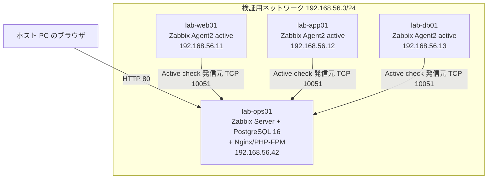

# 09 Zabbix 監視基盤構築演習設計：基礎からのオンプレミス監視構築

> **本ドキュメントの位置付け**
>
> [サーバー構築エンジニア学習プラン](./README.md) Phase 6（[W23 監視・バックアップ・復旧演習](./02-curriculum.md#w23-監視バックアップ復旧演習)）の「監視ツールを導入し、CPU・メモリ・ディスク・プロセス死活・HTTP 応答を可視化する」というハンズオンを、[05](./05-phase1-exercise-design.md)・[06](./06-shell-scripting-exercise-design.md)・[07](./07-python-ops-automation-exercise-design.md)と同じ様式で具体化した演習設計です。ただし対象は本ラボの主監視スタックである Prometheus / Grafana（[ADR-0001](../adr/0001-monitoring-stack.md)）ではなく **Zabbix** です。
>
> **本書は ADR-0001 を覆すものではありません。** 本ラボの主監視スタックは Prometheus + Grafana + Alertmanager のままとし、本演習はそれとは独立した 1 台（`lab-ops01`）を追加で構築します。ADR-0001 は Zabbix を「教材・情報が Prometheus より少なく独学しづらい」という理由で不採用にしましたが、同時に「エージェント型の老舗 OSS」とも記しています。[現場経験とインフラ運用の橋渡し §2.6](../career-bridge.md#26-監視ツールの転用可能性prometheus--zabbix--jp1) と [04 教材と資格の対応](./04-resources.md)は、国内 SIer・受託運用の求人で Zabbix の実務経験が問われることが多いとして、Prometheus → Zabbix の**概念対応表**をすでに用意しています。本書はその対応表を、実際に構築・設定・障害検知まで動かして検証済みの状態へ引き上げるための補完演習です。
>
> 本リポジトリの「[新規設計を増やさない運用ルール](../evidence-capture-checklist.md#新規設計を増やさない運用ルール)」の対象は **server-monitor の改善設計 06 以降**です。本書は改善設計ではなく学習計画（[05](./05-phase1-exercise-design.md)・[06](./06-shell-scripting-exercise-design.md)・[07](./07-python-ops-automation-exercise-design.md)と同じ位置付け）のため対象外です。
>
> **技術情報の裏取りについて**: 本書のバージョン・コマンド・設定項目は、2026-08-26 に AI 支援セッションで Zabbix 公式ドキュメント（zabbix.com/documentation）を調査して作成しました。このセッションのネットワーク方針により `zabbix.com` への直接アクセスが遮断されたため、検索エンジンのスニペットと、GitHub 公式リポジトリ（`zabbix/zabbix`）のタグ一覧を突き合わせて裏付けを取っています。バージョン番号（7.0 系が現行 LTS であること等）は GitHub のタグから直接確認できたため信頼度が高い一方、コマンドの正確な文字列や UI の細部は第三者記事・検索スニペットからの推定が含まれます。**実施前に、記載の URL とコマンドを公式ドキュメントで再確認してください**（[ADR-0001](../adr/0001-monitoring-stack.md)・[ADR-0006](../adr/0006-self-host-monitoring.md)と同じく「調べた範囲での判断」であることの明記）。
>
> 本ドキュメントは**設計であり、実施記録ではありません**。実施したら [11. 実施ステータス](#11-実施ステータスと次のアクション)を更新します。

最終更新: 2026-08-26

> **実施ステータス: 設計のみ・未実施**（2026-08-26 時点）。試験項目書の実測結果欄はすべて空欄です。

---

## 目次

| 節 | 内容 |
| --- | --- |
| [1](#1-演習の目的スコープ前提条件) | 目的・スコープ・前提条件 |
| [2](#2-要件と基本設計) | 要件と基本設計（バージョン選定・構成・Prometheus 系との対応） |
| [3](#3-パラメータシートlab-ops01) | パラメータシート（`lab-ops01`） |
| [4](#4-構築手順書) | 構築手順書（Server / DB / Frontend の構築、Agent 導入） |
| [5](#5-監視設計itemtriggeractiontemplatediscovery) | 監視設計（Item・Trigger・Action・Template・Discovery） |
| [6](#6-障害演習検知から復旧までz-1) | 障害演習：検知から復旧まで（Z-1） |
| [7](#7-試験項目書) | 試験項目書 |
| [8](#8-到達確認) | 到達確認 |
| [9](#9-実施タイムテーブルと中断基準) | 実施タイムテーブルと中断基準 |
| [10](#10-証跡採録計画) | 証跡採録計画 |
| [11](#11-実施ステータスと次のアクション) | 実施ステータスと次のアクション |

---

## 1. 演習の目的・スコープ・前提条件

### 目的

[02 フェーズ別カリキュラム W23](./02-curriculum.md#w23-監視バックアップ復旧演習)は「監視ツールを導入し、CPU・メモリ・ディスク・プロセス死活・HTTP 応答を可視化する」という**見出しだけ**のハンズオンです。本ラボではこれを Prometheus + Grafana で実施しますが、それとは別に、次の 2 点を満たす補完演習として本書を設計します。

1. [career-bridge.md §2.6](../career-bridge.md#26-監視ツールの転用可能性prometheus--zabbix--jp1) の概念対応表を「調べて書いた対応関係」から「実際に構築・設定して検証した対応関係」へ引き上げる
2. 国内 SIer・受託運用の求人で頻出する Zabbix の実務経験を、[05](./05-phase1-exercise-design.md)・[06](./06-shell-scripting-exercise-design.md)と同水準の具体性（コマンド・想定結果・試験項目）で積む

### スコープ

| 対象 | 扱い |
| --- | --- |
| Zabbix Server + PostgreSQL + Frontend（Nginx/PHP-FPM）の 1 台構成構築 | **対象**。[4 章](#4-構築手順書) |
| Zabbix Agent2 の導入（Active check） | **対象**。[4 章](#4-構築手順書)・[5.1](#51-level-1-基本監視標準テンプレート) |
| Item・Trigger・Action・Template・Low-Level Discovery の基礎設定 | **対象**。[5 章](#5-監視設計itemtriggeractiontemplatediscovery) |
| UserParameter によるカスタム監視（[06 演習 B](./06-shell-scripting-exercise-design.md#演習-b-env-checksh)との連携を含む） | **対象**。[5.2](#52-level-2-カスタムアイテムuserparameter) |
| 障害注入と検知・通知・復旧の一連の演習（RTO 相当の計測） | **対象**。[6 章](#6-障害演習検知から復旧までz-1) |
| Zabbix 自身のバックアップ・リストア | **対象**。[7 章](#7-試験項目書)の T-14 |
| Zabbix Proxy による分散監視（拠点分割・ファイアウォール越しの監視） | **対象外**。単一セグメントの学習ラボには不要。[今後の興味リスト](../roadmap/README.md)相当の発展topic |
| Zabbix Server のネイティブ HA クラスタリング | **対象外**。1 台構成の学習ラボの範囲を超える |
| Windows ホストの監視（Zabbix Agent for Windows） | **対象外**。[06 §4](./06-shell-scripting-exercise-design.md#4-windowspowershell演習設計)の補助トラックとは別に扱わない |
| Prometheus / Grafana スタックの置き換え | **対象外**。[ADR-0001](../adr/0001-monitoring-stack.md)のとおり本ラボの主系統は変更しない |

### 前提条件

| 項目 | 内容 |
| --- | --- |
| 環境 | [01 学習環境](./01-environment.md)の VM を 1 台追加（`lab-ops01`）。監視対象は[02 W9-W12](./02-curriculum.md#phase-3-ミドルウェア構築w9-w12)で構築した 3 層ラボ（`lab-web01` / `lab-app01` / `lab-db01`）を流用する |
| 前提知識 | [02 W1-W3](./02-curriculum.md#phase-1-linux-基礎w1-w4)（`systemctl`/`journalctl`）、[W9](./02-curriculum.md#w9-web-サーバーの構築)（Nginx）、[W11](./02-curriculum.md#w11-データベースの構築とリストア試験)（PostgreSQL）を終えていること |
| 権限 | 一般ユーザー + `sudo`（DB 作成・パッケージ導入・サービス操作のため） |
| 想定所要時間 | 構築 3 時間 + 監視設計 3 時間 + 障害演習・試験 2 時間（[9 章](#9-実施タイムテーブルと中断基準)） |
| 位置付け | [24 週学習プラン](./README.md)の**補完トラック**。Phase 6（W23）の主軸は Prometheus / Grafana のままとし、本書はそれに追加する形で実施する |

---

## 2. 要件と基本設計

### 非機能要件（学習ラボとしての最小要件）

| # | 要件 | 理由 |
| --- | --- | --- |
| N1 | 単一 VM（`lab-ops01`）で完結する | [01 学習環境](./01-environment.md)の「迷わないように選択肢を絞る」方針と同じ |
| N2 | 既存の 3 層ラボ・Prometheus スタックと共存できる | ADR-0001 の主系統を止めない。ポート（Zabbix: 10050/10051、node-exporter: 9100 系）が競合しないことを構築前に確認する |
| N3 | 既存の学習資産（Nginx・PostgreSQL・[06 のシェルスクリプト]）を流用する | 新規に学ぶ範囲を Zabbix 固有の概念（Item/Trigger/Action）に絞り、学習コストを抑える |
| N4 | 障害注入・復旧演習ができる | [5 原則](./README.md#5-進め方の-5-原則)の「壊してから直す」をそのまま適用する |

### 基本設計（構成とバージョン選定）

| 項目 | 選定 | 理由 |
| --- | --- | --- |
| Zabbix バージョン | **7.0 LTS**（本書執筆時点の最新パッチは 7.0.30 想定。実施時に最新へ読み替える） | 7.0 はフルサポートが 2027-06-30、セキュリティ修正のみのサポートが 2029-06-30 まで続く LTS。後継の標準リリース系列（7.4）はサポート期間が 12 か月のみで、本書執筆時点で EOL が目前（2026-09-30 見込み）。次期 LTS の 8.0 は本書執筆時点で GA（正式版）前（beta 段階）のため対象外とする |
| DB | PostgreSQL 16（Ubuntu 24.04 標準パッケージ） | [02 W11](./02-curriculum.md#w11-データベースの構築とリストア試験)・server-monitor 本体と同じ RDBMS に揃え、学習コストを増やさない。Zabbix 7.0 は PostgreSQL 13 以降に対応（追加のリポジトリ登録が要らない Ubuntu 標準パッケージで足りる） |
| Web/PHP | Nginx + PHP-FPM 8.3（Ubuntu 24.04 標準パッケージ） | [02 W9](./02-curriculum.md#w9-web-サーバーの構築)で学んだ Nginx をそのまま流用する。Apache 版のパッケージ（`zabbix-apache-conf`）もあるが、選択肢を増やさない |
| Agent | **Zabbix Agent2**（無印 Agent ではない） | Go 実装で並行実行性が高く、Docker/PostgreSQL 等のネイティブ監視プラグインを持つ。新規導入では公式に推奨されている。Zabbix 7.0 で無印 Agent との通信プロトコルが統合済み |
| チェック方式 | **Active check**（エージェントがサーバーへ接続する方式） | Prometheus の pull 型と対照的な push 型の設計を体験する狙い。Passive check（サーバーがエージェントへ接続）は概念のみ[5.1](#51-level-1-基本監視標準テンプレート)で扱い、本演習の主要経路には採用しない |
| 構成 | Server・DB・Frontend を `lab-ops01` 1 台にまとめる | 分散構成（DB 分離、Zabbix Proxy）は学習ラボの規模に対して過剰。[STATUS.md](../../STATUS.md)が指摘する「未経験者としての実力に対して内容が高度すぎる設計を避ける」方針に沿う |

図の要約：`lab-ops01` に Zabbix Server・DB・Frontend を集約し、既存の 3 層ラボ 3 台の Agent2 が能動的に `lab-ops01` の TCP 10051 へ接続してデータを送信します。ホスト PC のブラウザは HTTP でフロントエンドへアクセスします。

### Prometheus 系との概念対応表（本演習版）

[career-bridge.md §2.6](../career-bridge.md#26-監視ツールの転用可能性prometheus--zabbix--jp1) の対応表に、本演習での実装物を加えた版です。

| 監視の概念 | 本ラボ主系統（Prometheus 系、[ADR-0001](../adr/0001-monitoring-stack.md)） | Zabbix（本演習） | 本演習での実装物 |
| --- | --- | --- | --- |
| メトリクス収集 | exporter（pull、node-exporter 等） | Zabbix Agent2（本演習は active push を採用） | `lab-web01`/`lab-app01`/`lab-db01` の `zabbix-agent2`、`ServerActive`/`Hostname` |
| 監視対象の登録 | scrape config | ホスト登録 + テンプレートリンク | Data collection → Hosts、「Linux by Zabbix agent active」テンプレート |
| 異常判定のルール | alerting rule（PromQL） | トリガー（トリガー式） | [5.3 Level 3](#53-level-3-トリガー設計) |
| 通知・エスカレーション | Alertmanager（ルーティング・抑制） | アクション + オペレーション + エスカレーション | [5.4 Level 4](#54-level-4-アクションエスカレーション) |
| 可視化 | Grafana ダッシュボード | Zabbix ダッシュボード | Z-9（[4 章](#4-構築手順書)）で作成 |
| 自動検出 | service discovery | Low-Level Discovery（LLD） | [5.5 Level 5](#55-level-5-low-level-discovery) |
| ログ監視 | Loki + Alloy | ログ監視アイテム（`log[]`/`logrt[]`） | 対象外（[スコープ](#スコープ)参照。今後の興味リストへ） |

「しきい値を決めて・検知して・通知して・手順書で対応する」という骨格は共通ですが、**収集の向き**（pull と push）と**設定の入れ物**（PromQL の 1 行と、Item/Trigger/Template という複数オブジェクトの組み合わせ）が構造的に異なります。この違いを実機で体験することが、career-bridge.md の対応表を「説明できる」段階から「動かして示せる」段階へ引き上げます。

---

## 3. パラメータシート（`lab-ops01`）

### 基本情報

| 項目 | 値 |
| --- | --- |
| ホスト名 | `lab-ops01` |
| 役割 | Zabbix Server + DB + Frontend（監視基盤、1 台構成） |
| 対応する演習 | 09 Zabbix 監視基盤構築演習（本書） |
| 位置付け | [24 週学習プラン](./README.md) Phase 6（W23）の補完演習。本ラボの主監視スタックは Prometheus/Grafana（[ADR-0001](../adr/0001-monitoring-stack.md)）のままとし、本ホストは独立して追加する |

### ハードウェア・仮想マシン

| 項目 | 値 |
| --- | --- |
| vCPU | 2 |
| メモリ | 2 GB（学習ラボの最小構成。監視対象・保持期間を増やす場合は明記のうえ増設する） |
| ディスク | 20 GB（history/trends の保持期間次第で増減。[10 章](#10-証跡採録計画)でハウスキーピング設定を扱う） |
| 仮想化基盤 | [01 学習環境](./01-environment.md)の既定（VirtualBox）。Hyper-V の場合は[05 付録 A](./05-phase1-exercise-design.md#付録-a-hyper-v-版の差分)と同じ要領で読み替える |

### OS・ミドルウェア

| 項目 | 値 | 選定理由 |
| --- | --- | --- |
| OS | Ubuntu Server 24.04 LTS | [01 学習環境](./01-environment.md)の標準 |
| Zabbix | 7.0 LTS（最新パッチへ読み替える） | [2 章の基本設計](#基本設計構成とバージョン選定)を参照 |
| DB | PostgreSQL 16（Ubuntu 24.04 標準パッケージ） | 同上 |
| Web/PHP | Nginx + PHP-FPM 8.3（Ubuntu 24.04 標準パッケージ） | 同上 |
| Agent | Zabbix Agent2（Active check） | 同上 |

### ネットワーク

| 項目 | 値 |
| --- | --- |
| ホスト名 / IP | `lab-ops01` / `192.168.56.42`（[01 学習環境の割り当て規則](./01-environment.md#命名と-ip-の割り当て規則)の運用・監視系 `.41`-`.49` を使用。パラメータシートの記入例が `.41` を使っているため、重複を避けて `.42` を採用） |
| NIC 構成 | [01 学習環境](./01-environment.md#ネットワーク設計)と同じ 2 枚構成（NAT + ホストオンリー） |
| 開放ポート（`lab-ops01` 側） | TCP 80（フロントエンド）、TCP 10051（Agent2 の Active check を受け付ける Trapper ポート） |
| 開放ポート（監視対象側: `lab-web01`/`app01`/`db01`） | アウトバウンド TCP 10051 のみ（Active check のため）。**Passive check は本演習では使わない方針とし、インバウンド TCP 10050 は開放しない**（[5.1 のつまずきやすい点](#51-level-1-基本監視標準テンプレート)で理由を扱う） |
| 名前解決 | [03 パラメータシートの記入例](./03-build-process.md)と同じくホスト名ベース（`/etc/hosts` またはラボ内 DNS） |

### Zabbix 固有パラメータ

| 項目 | 値 |
| --- | --- |
| DB 名 / DB ユーザー | `zabbix` / `zabbix` |
| フロントエンドタイムゾーン | `Asia/Tokyo`（`php-fpm.conf` の `date.timezone`） |
| Zabbix server details（フロントエンド表示名） | `Zabbix server`（既定） |
| 初期ログイン | `Admin` / `zabbix`（初期値。ログイン後直ちに変更し、変更後のパスワードは証跡に残さない） |
| ハウスキーピング | 既定値（History/Trends の保持期間は Zabbix の既定のまま）から開始し、[6 章の障害演習](#6-障害演習検知から復旧までz-1)実施後に DB サイズを確認してから調整する |

### 監視対象ホスト

| ホスト名 | IP | 役割 | リンクするテンプレート |
| --- | --- | --- | --- |
| `lab-web01` | `192.168.56.11` | Nginx（[02 W9](./02-curriculum.md#w9-web-サーバーの構築)） | Linux by Zabbix agent active |
| `lab-app01` | `192.168.56.12` | アプリケーション | Linux by Zabbix agent active |
| `lab-db01` | `192.168.56.13` | PostgreSQL（[02 W11](./02-curriculum.md#w11-データベースの構築とリストア試験)） | Linux by Zabbix agent active（PostgreSQL 固有の監視テンプレートは[今後の興味リスト](../roadmap/README.md)相当として対象外） |

---

## 4. 構築手順書

段階的に機能を積み、各段階の直後に想定結果を確認します（[06 の演習 A](./06-shell-scripting-exercise-design.md#演習-aフラッグシップ-backup-rotatesh)と同じ形式）。コマンド中の URL・パッケージ名は 7.0 系のものです。**実行前に [zabbix.com/download](https://www.zabbix.com/download) で自分の OS/DB/Web サーバーの組み合わせに応じたコマンドを再確認してください**（末尾のリビジョン表記はダウンロードページ側で変わることがあります）。

| No | 段階 | 追加する内容 | 想定結果 | 判定 |
| --- | --- | --- | --- | --- |
| Z-1 | 公式リポジトリ登録 | `wget https://repo.zabbix.com/zabbix/7.0/release/ubuntu/pool/main/z/zabbix-release/zabbix-release_latest_7.0+ubuntu24.04_all.deb` → `sudo dpkg -i zabbix-release_latest_7.0+ubuntu24.04_all.deb` → `sudo apt update` | `apt-cache policy zabbix-server-pgsql` の Candidate に `7.0` 系のバージョンが表示される | バージョン文字列に `7.0` を含む |
| Z-2 | パッケージ導入 | `sudo apt install zabbix-server-pgsql zabbix-frontend-php php8.3-pgsql zabbix-nginx-conf zabbix-sql-scripts zabbix-agent2` | `dpkg -l \| grep zabbix` で 6 パッケージが導入済み | エラーなく完了 |
| Z-3 | DB 作成 | `sudo -u postgres createuser --pwprompt zabbix` → `sudo -u postgres createdb -O zabbix -E Unicode -T template0 zabbix` | `psql -U zabbix -d zabbix -h 127.0.0.1 -c '\dt'` が接続に成功し、テーブル 0 件と表示される | 接続エラーなし |
| Z-4 | スキーマ投入 | `zcat /usr/share/zabbix-sql-scripts/postgresql/server.sql.gz \| sudo -u zabbix psql zabbix` | `psql -U zabbix -d zabbix -c '\dt'` で 100 件以上のテーブルが表示される | エラーなく完了 |
| Z-5 | `zabbix_server.conf` 編集 | `DBPassword=<Z-3 で設定したパスワード>` を追記（既定はコメントアウト）。設定ファイルの権限を確認する | `ls -l /etc/zabbix/zabbix_server.conf` の所有者・権限がパッケージ既定のままである | 権限が緩んでいない |
| Z-6 | Nginx / PHP-FPM 設定 | `/etc/zabbix/nginx.conf` の `listen`/`server_name` のコメントを解除しポート 80 等に設定。`/etc/zabbix/php-fpm.conf` に `php_value[date.timezone] = Asia/Tokyo` を設定 | `sudo nginx -t` が構文 OK を返す | `syntax is ok` / `test is successful` |
| Z-7 | サービス起動 | `sudo systemctl enable --now zabbix-server zabbix-agent2 nginx php8.3-fpm` | `systemctl is-active` で 4 サービスすべて `active` | 4 件とも `active` |
| Z-8 | 初期セットアップウィザード | ブラウザで `http://192.168.56.42/` にアクセスし、Prerequisites（全項目 OK）→ DB 接続情報 → Zabbix server details（ポート `10051`）→ 概要確認、の順で進める | `/etc/zabbix/web/zabbix.conf.php` が生成される | ファイルが存在し、DB 接続情報が入力値と一致 |
| Z-9 | 初期ログインと Admin パスワード変更 | `Admin`/`zabbix` でログイン → Users → Admin → Change password で変更 | 変更後、旧パスワード（`zabbix`）でのログインが失敗する | 旧パスワードで失敗、新パスワードで成功 |
| Z-10 | 監視対象への Agent2 導入（3 台共通） | Z-1 と同じ手順で `zabbix-agent2` のみ導入。`zabbix_agent2.conf` に `ServerActive=192.168.56.42`、`Hostname=lab-web01`（対象ごとに変更）を設定し `sudo systemctl restart zabbix-agent2` | 各ホストで `sudo zabbix_agent2 -t agent.ping` を実行するとローカルでテスト結果が返る（ネットワーク到達性に依存しない動作確認） | `agent.ping` のテスト結果が返る |
| Z-11 | フロントエンドでのホスト登録 | Data collection → Hosts → Create host。Host name を対象ホスト名に、Templates に「Linux by Zabbix agent active」をリンクする | Monitoring → Latest data で 3 台それぞれの CPU・メモリ・ディスク・`agent.ping` にデータが入り始める（初回は `RefreshActiveChecks` 間隔、既定 2 分後） | 3 台とも直近データが更新されている。Monitoring → Hosts の可用性アイコンが緑 |

> **つまずきやすい点（構築全体）**: 7.4/8.0 系では Z-4 のスキーマ投入パスが `/usr/share/zabbix/sql-scripts/postgresql/server.sql.gz`（`zabbix-sql-scripts` ではなく `zabbix` 配下）に変わっています。バージョンを取り違えると `No such file or directory` になります。Z-7 で `zabbix-server` が `active` にならない場合は、[02 W3](./02-curriculum.md#w3-プロセスサービスログ)で学んだとおり `journalctl -u zabbix-server` で原因（多くは Z-5 の `DBPassword` 不一致）を確認します。Active 専用ホストでもフロントエンドの Interfaces 欄への入力を求められる場合があります（バージョンにより挙動が異なる可能性があるため実施時に確認）。求められた場合はホストの IP をそのまま入力しておけば動作に支障はありません（Active では実際には使われません）。

---

## 5. 監視設計（Item・Trigger・Action・Template・Discovery）

Zabbix 固有の「収集した値をどう異常判定し、どう通知するか」という設計層です。[06 の Level 構造](./06-shell-scripting-exercise-design.md#3-linuxbash演習設計)と同じく、段階を追って積み上げます。

### 5.1 Level 1: 基本監視（標準テンプレート）

| # | 学習項目 | ハンズオン | 到達確認 | つまずきやすい点 |
| --- | --- | --- | --- | --- |
| M1-1 | Host / Item / Template の関係 | [Z-11](#4-構築手順書)でリンクした「Linux by Zabbix agent active」テンプレートが持つ Item 一覧（CPU load・メモリ使用率・ディスク空き容量・`agent.ping` 等）を Data collection → Templates で確認する | テンプレートは**ホストグループではなくホストへ直接リンクする**ものだと説明できる | ホストグループはユーザー権限管理が主用途で、テンプレートの適用範囲を決めるものではない |
| M1-2 | Passive check と Active check の違い | 本演習が採用した Active（エージェント → サーバーへ `ServerActive` 宛に接続）と、Passive（サーバー → エージェントへ `Server` 宛に接続）の通信方向を図に書き、それぞれ塞ぐべきポート（Active はエージェント側アウトバウンド TCP 10051、Passive はエージェント側インバウンド TCP 10050）を答える | 「Passive だから 10050 だけ開ければよい」という誤解を、両方式の図で説明・反証できる | 現場では Passive 用インバウンド 10050 だけ開けて満足し、Active 用アウトバウンド 10051 の許可を忘れる事故が典型的 |
| M1-3 | プロセス死活監視 | `proc.num[nginx]` のようなアイテムを対象ホストへ手動追加する | `lab-web01` の Nginx を停止すると値が `0` になることを確認する | Item Type（Zabbix agent / Zabbix agent (active)）を対象ホストの通信方式と一致させる必要がある |
| M1-4 | HTTP 応答確認 | Data collection → Hosts → Web で `lab-web01` へのシナリオ（ステップに URL・期待するレスポンスコード）を作成する | Web サービスを止めるとシナリオが失敗として Monitoring → Web に表示される | Web 監視は**エージェント経由ではなく Zabbix Server 自身が HTTP リクエストを行う**（agentless）。サーバーから対象への到達性が別途必要 |

### 5.2 Level 2: カスタムアイテム（UserParameter）

[06 演習 B `env-check.sh`](./06-shell-scripting-exercise-design.md#演習-b-env-checksh)の資産を Zabbix から読める形にする、既存資産との統合演習です。

| # | 学習項目 | ハンズオン | 到達確認 | つまずきやすい点 |
| --- | --- | --- | --- | --- |
| M2-1 | UserParameter の追加 | 監視対象ホストで `/etc/zabbix/zabbix_agent2.d/userparameter_custom.conf` を新規作成し `UserParameter=proc.count[*],pgrep -c $1` を追加する | `sudo systemctl restart zabbix-agent2` 後、`sudo zabbix_agent2 -t proc.count[nginx]` でプロセス数が返る | 設定変更後の `zabbix-agent2` 再起動忘れ（「Unsupported」のまま気付かないケースが多い）。`UserParameterDir` 未設定時は相対パスが解決できない |
| M2-2 | フロントエンドでのアイテム化 | Type=Zabbix agent (active)、key=`proc.count[nginx]` でアイテムを手動追加する | Monitoring → Latest data に値が表示される | UserParameter のキーとフロントエンドのアイテムキーの文字列（大文字小文字・引数の有無）を完全に一致させる必要がある |
| M2-3 | [06 演習 B `env-check.sh`](./06-shell-scripting-exercise-design.md#演習-b-env-checksh)の Zabbix 連携 | `env-check.sh` の集約結果（`OK: n / WARN: n / FAIL: n` の行）から `FAIL` 件数だけを取り出すラッパースクリプト `envcheck-failcount.sh` を作り、`UserParameter=envcheck.failcount,/opt/lab/envcheck-failcount.sh` として登録する | `env-check.sh` をわざと失敗する条件（証明書の期限切れ等）で実行すると、Zabbix 側のアイテム値も追随して変化することを確認する | UserParameter の戻り値は**標準出力のみ**が値になる（終了コードはそのままでは伝わらない）。終了コードを監視したい場合は `envcheck.exitcode` のような別アイテムを用意し、`env-check.sh` 実行後の `$?` をシェル側で明示的に出力する |

### 5.3 Level 3: トリガー設計

トリガー式は `関数(/host/key, 期間) 演算子 定数` の形式です（Zabbix 5.0 以降の現行構文）。

| # | 学習項目 | ハンズオン | 到達確認 | つまずきやすい点 |
| --- | --- | --- | --- | --- |
| M3-1 | ディスク使用率トリガー | `min(/lab-web01/vfs.fs.size[/,pfree],5m)<10` のような、ディスク空き容量（%）のワーニングを作成する。[02 W4](./02-curriculum.md#w4-ディスクファイルシステムシェルスクリプト)と同じ手法でディスクを一時的に埋めて発火させる | Problems ビューに表示され、Severity（重要度）が `Warning` になっている | `pfree`（相対 %）と `free`（絶対値）を混同しない。瞬間的なノイズで誤検知しないよう、`min(...,5m)` のように時間集計関数を使う（単なる `last()` だけだと 1 回の揺れで発火する） |
| M3-2 | 到達不能検知（`nodata`） | `nodata(/lab-web01/agent.ping,3m)=1` で Agent2 自体の停止・通信断を検知するトリガーを作成する | `zabbix-agent2` を停止すると発火し、再起動すると自動的に解決（RESOLVED）することを確認する | `agent.ping` の nodata は「エージェントに到達できない」ことしか示さない。個別のプロセス監視（M1-3）とは別のトリガーとして設計する必要がある |
| M3-3 | 重要度の 6 段階 | `Not classified` / `Information` / `Warning` / `Average` / `High` / `Disaster` の 6 段階を、M3-1（ディスク）と M3-2（到達不能）にそれぞれ適切な段階で割り当てる | 「ディスク使用率警告」より「サーバー到達不能」の方が重要度が高いという判断を、選んだ段階の違いで説明できる | 重要度は通知の抑制・エスカレーション条件の分岐に使われるため、全項目を同じ重要度にすると[5.4](#54-level-4-アクションエスカレーション)のアクション設計が機能しなくなる |
| M3-4 | トリガー依存関係 | ディスク使用率トリガー（M3-1）が原因でアプリケーションも異常になる場合を想定し、下位（ディスク）が発火中は上位のトリガー通知を抑制する Trigger dependency を設定する | 依存元トリガー発火時、依存先の通知が抑制されることを確認する | 依存はトリガー単位の設定で、テンプレート側で組んでおかないとホストごとに手動設定が必要になる |

### 5.4 Level 4: アクション・エスカレーション

アクション = 条件（Conditions）× オペレーション（Operations）× エスカレーション（Escalations）という組み合わせです。

| # | 学習項目 | ハンズオン | 到達確認 | つまずきやすい点 |
| --- | --- | --- | --- | --- |
| M4-1 | 基本のアクション | 条件「Trigger severity >= Warning」、操作「Send message to Admin」のアクションを 1 つ作成する | M3-1 のトリガーを手動で発火させ、Reports → Action log に記録が残ることを確認する | Media type（送信経路）に SMTP 等の実配信先が未設定だと送信キューに溜まり続けるだけでエラーに気付きにくい。[server-monitor の Alertmanager → Slack 実配信](https://github.com/ns7jp/server-monitor/blob/main/docs/evidence/README.md)と同じく、まず Action log での記録確認を優先し、実配信は環境が整ってから追加する |
| M4-2 | エスカレーション設計 | Step 1（0 分後、Admin へ通知）→ Step 2（5 分後、別の通知先へ拡大）の 2 段階を設定する | Step duration の経過が Reports → Action log で確認できる | Default operation step duration の最小値は 60 秒。テスト時に短くしすぎるとエスカレーション前に自己復旧してしまい、意味のある検証にならない |
| M4-3 | 復旧通知（Recovery operations） | 「解決しました」の通知を Recovery operations に設定する | 障害を直すと解決通知が Action log に記録される（[server-monitor の D-1 演習](https://github.com/ns7jp/server-monitor/blob/main/docs/drills/logs/2026-08-19-D-1.md)の FIRING / RESOLVED と対応する概念） | 復旧操作は発火時の Operations とは別欄で設定するため、見落として「発火だけ通知され解決が来ない」状態になりがち |

### 5.5 Level 5: Low-Level Discovery

| # | 学習項目 | ハンズオン | 到達確認 | つまずきやすい点 |
| --- | --- | --- | --- | --- |
| M5-1 | ファイルシステムの自動検出 | `vfs.fs.discovery` の Discovery rule を確認し、アイテムプロトタイプ（`vfs.fs.size[{#FSNAME},pfree]` 等）がマウントポイントごとに実体化される様子を Data collection → Hosts → Discovery で見る | 新しいマウントポイントを追加すると、手動設定なしで新しいアイテム・トリガーが生成されることを確認する | 生成には Discovery rule の実行間隔（既定は数時間単位）がかかるため、即座には反映されない。[9 章](#9-実施タイムテーブルと中断基準)のタイムテーブルの枠内で反映を確認したい場合は、検証時だけ Discovery rule の Update interval を一時的に短く（例えば `1m`）設定し、反映を確認できたら既定値へ戻す |
| M5-2 | コンテキスト付きマクロ | 公式テンプレートのトリガー例 `min(/lab-web01/vfs.fs.dependent.size[{#FSNAME},pused],5m) > {$VFS.FS.PUSED.MAX.WARN:"{#FSNAME}"}` を読み、マウントポイントごとに個別のしきい値を設定する方法（ホスト単位でマクロ `{$VFS.FS.PUSED.MAX.WARN:"/"}` を上書き）を確認する | `/` だけしきい値を厳しくし、他のマウントポイントは既定のままにできることを確認する | マクロの優先順位は「ホスト個別 > テンプレート > グローバル」。上書きしたつもりが別階層に書いてしまい反映されないことがある |

---

## 6. 障害演習：検知から復旧まで（Z-1）

[server-monitor の D-1 復旧演習](https://github.com/ns7jp/server-monitor/blob/main/docs/drills/logs/2026-08-19-D-1.md)（RTO 実測）と同じ考え方で、Zabbix 版の障害注入演習を設計します。目的は「監視が設定されている」ことではなく「**検知から復旧までの所要時間を実測できる**」ことです。

| 手順 | 内容 | 記録する時刻 |
| --- | --- | --- |
| 1 | 正常稼働を確認する（Monitoring → Problems が 0 件） | 開始時刻 |
| 2 | `lab-web01` の Nginx を意図的に停止する（障害注入） | 注入時刻 |
| 3 | Monitoring → Problems に M1-3（プロセス死活）または M1-4（HTTP 応答）のトリガーが表示されるまでの時間を記録する | 検知時刻 |
| 4 | [5.4](#54-level-4-アクションエスカレーション)のアクションが発火し、Reports → Action log に通知記録が残る時間を記録する | 通知時刻 |
| 5 | Nginx を再起動して復旧する | 復旧操作時刻 |
| 6 | Problems から該当項目が消え、解決通知が記録される時間を記録する | 解決時刻 |
| 7 | 検知時間（注入 → 検知）と復旧時間（注入 → 解決）を算出し記録する | — |

> **到達確認**: 検知までの時間が、対象アイテムの Update interval（収集間隔。Active check の既定は概ね 1 分前後）より短くはならないことを説明できる。これは Prometheus の `scrape_interval` と同じ「ポーリング型の監視は収集間隔より速くは検知できない」という制約であり、[2 章の概念対応表](#prometheus-系との概念対応表本演習版)が示す共通点の 1 つです。

実測結果は未実施のため空欄です。実施したら本節に RTO 相当の値を追記します。

---

## 7. 試験項目書

異常系 7 件 / 全 14 件（50%）で、[03 §4](./03-build-process.md#異常系を必ず入れる理由)が定める「異常系 3 割以上」を満たします。実測結果・判定・エビデンス・実施日は未記入（未実施のため）。

| No | 試験分類 | 観点 | 前提条件 | 手順 | 期待結果 | 実測結果 | 判定 | エビデンス | 実施日 |
| --- | --- | --- | --- | --- | --- | --- | --- | --- | --- |
| T-01 | 単体 | パッケージ導入 | Z-2 完了後 | `dpkg -l \| grep zabbix` | 6 パッケージが `ii`（導入済み）と表示される | | | | |
| T-02 | 単体 | DB スキーマ投入 | Z-4 完了後 | `psql -U zabbix -d zabbix -c '\dt'` | 100 件以上のテーブルが表示される | | | | |
| T-03 | 単体 | フロントエンド Prerequisites | Z-6 完了後 | セットアップウィザードの Prerequisites 画面を開く | 全項目が緑（OK） | | | | |
| T-04 | 単体 | Agent2 ローカルテスト | Z-10 完了後 | 監視対象ホストで `zabbix_agent2 -t agent.ping` | テスト結果が返る | | | | |
| T-05 | 結合 | 標準テンプレートによるデータ収集 | Z-11 完了後 | Monitoring → Latest data を確認 | 3 台それぞれの CPU・メモリ・ディスクにデータが入っている | | | | |
| T-06 | 結合 | HTTP 応答監視 | M1-4 完了後 | Monitoring → Web を確認 | シナリオが成功として記録される | | | | |
| T-07 | 総合 | ダッシュボード表示 | 5 章完了後 | ダッシュボードを作成し 3 台のステータスを並べる | 3 台の稼働状況が 1 画面で確認できる | | | | |
| T-08 | 異常系 | DB パスワード誤り | Z-5 で誤ったパスワードを設定 | `sudo systemctl restart zabbix-server` | `zabbix-server` が `failed` になり `journalctl -u zabbix-server` に DB 接続エラーが記録される | | | | |
| T-09 | 異常系 | Passive check 用ポート未開放 | 本演習の設計どおりインバウンド 10050 を開けない状態 | サーバー側から Passive 用の疎通確認を試みる | 接続できない（設計どおり。Active check の経路とは無関係にデータ収集が継続することを確認） | | | | |
| T-10 | 異常系 | Hostname 不一致 | Agent2 の `Hostname` をフロントエンドのホスト名と意図的に食い違わせる | `zabbix-agent2` を再起動して数分待つ | アクティブアイテムに一切データが入らない | | | | |
| T-11 | 異常系 | Active check 用アウトバウンド遮断 | `lab-web01` で送信先 TCP 10051 を一時的にファイアウォールで遮断 | 数分待って Latest data を確認 | データが更新されなくなり、M3-2 の `nodata` トリガーが発火する | | | | |
| T-12 | 異常系 | ディスク容量逼迫 | ダミーファイルでディスクを 90% 以上埋める | Problems ビューを確認 | M3-1 のトリガーが `Warning` で発火する | | | | |
| T-13 | 異常系 | プロセス停止と復旧（[6 章](#6-障害演習検知から復旧までz-1)の Z-1 本体） | 正常稼働中 | Z-1 の手順を実施 | 検知・通知・復旧・解決の一連が確認でき、所要時間が記録される | | | | |
| T-14 | 異常系 | Zabbix 自身のバックアップ・リストア | `lab-ops01` で `sudo -u postgres pg_dump -Fc -f /tmp/zabbix.backup.bak zabbix` を実行 | `zabbix-server` を停止 → 新規空 DB を作成 → `pg_restore -d zabbix /tmp/zabbix.backup.bak` → `zabbix-server` を再起動 | フロントエンドへのログインとホスト一覧が復元前と一致する（[02 W11](./02-curriculum.md#w11-データベースの構築とリストア試験)と同じ「取得しただけでは成果物として数えない、リストアまで確認する」原則） | | | | |

---

## 8. 到達確認

[学習プランの到達度チェック](./README.md#7-到達度チェック)と同じ形式です。すべて「調べながらで可」ですが、**手順書を見ずに何をすべきか判断できる**ことが条件です。

- [ ] Zabbix 7.0 LTS を選んだ理由を、標準リリース（7.4）・次期 LTS（8.0）との対比で説明できる
- [ ] Passive check と Active check の通信方向の違いを説明し、それぞれ塞ぐべきポート（10050 / 10051）を挙げられる
- [ ] トリガー式の基本構文（`関数(/host/key,期間) 演算子 定数`）を書き、`min()`/`last()`/`nodata()` の使い分けを説明できる
- [ ] UserParameter で独自の監視項目を追加し、既存のシェルスクリプト資産（[06 の `env-check.sh`](./06-shell-scripting-exercise-design.md#演習-b-env-checksh)）を Zabbix から読める形にできる
- [ ] アクション・エスカレーション・復旧通知を設定し、発火から解決までの通知記録を確認できる
- [ ] Low-Level Discovery でファイルシステム監視が自動生成されることと、コンテキスト付きマクロでホスト個別のしきい値を設定する方法を説明できる
- [ ] Zabbix 自身のバックアップ・リストアを `pg_dump`/`pg_restore` で実行し、復元後の状態を照合できる
- [ ] [career-bridge.md の概念対応表](../career-bridge.md#26-監視ツールの転用可能性prometheus--zabbix--jp1)を、実機の画面を示しながら自分の言葉で説明できる
- [ ] Prometheus（pull 型・PromQL・Alertmanager）と Zabbix（push 型中心・トリガー式・アクション）の設計思想の違いを、収集間隔と検知速度の関係を含めて比較して説明できる

---

## 9. 実施タイムテーブルと中断基準

[05 §6](./05-phase1-exercise-design.md#6-実施タイムテーブルと中断基準)と同じ考え方で、構築・監視設計・障害演習を別セッションに分けます。

### セッション 1（構築、[4 章](#4-構築手順書)）

| 経過時間 | 作業 | 判定ポイント |
| --- | --- | --- |
| 0:00 | Z-1〜Z-7（パッケージ導入〜サービス起動） | 各段階の想定結果が一致する |
| 1:30 | Z-8〜Z-9（初期セットアップ・パスワード変更） | ログインが成功する |
| 2:00 | Z-10〜Z-11（Agent2 導入・ホスト登録、3 台分） | 3 台とも Latest data が更新される |
| 3:00 | **セッション 1 の終了目標** | 未完了は次セッションへ繰り越す |

### セッション 2（監視設計、[5 章](#5-監視設計itemtriggeractiontemplatediscovery)、別日）

| 経過時間 | 作業 | 判定ポイント |
| --- | --- | --- |
| 0:00 | 5.1〜5.2（基本監視・UserParameter） | 各項目の到達確認を満たす |
| 1:15 | 5.3（トリガー設計） | M3-1〜M3-4 の発火・依存関係を確認する |
| 2:15 | 5.4〜5.5（アクション・Discovery） | 通知記録と自動検出を確認する |
| 3:00 | **セッション 2 の終了目標** | 未完了は次セッションへ繰り越す |

### セッション 3（障害演習・試験、[6 章](#6-障害演習検知から復旧までz-1)・[7 章](#7-試験項目書)、別日）

| 経過時間 | 作業 | 判定ポイント |
| --- | --- | --- |
| 0:00 | T-01〜T-07（単体・結合・総合） | 全項目で期待結果どおりの成功が再現する |
| 0:45 | T-08〜T-12（異常系） | 全項目で期待結果どおりの失敗・検知が再現する |
| 1:30 | T-13（Z-1 障害演習本体） | 検知・通知・復旧・解決の所要時間が記録される |
| 1:50 | T-14（バックアップ・リストア） | 復元後の状態が照合できる |
| 2:00 | **セッション 3 の終了目標** | 未完了は次セッションへ繰り越す |

**中断基準**（[05](./05-phase1-exercise-design.md#6-実施タイムテーブルと中断基準)と同じ運用）:

1. 1 つのつまずきに 30 分以上かかった場合、[01 学習環境 §7 の 30 分ルール](./01-environment.md#7-環境トラブルの対処)に従う
2. バージョン起因の差分（[4 章の注記](#4-構築手順書)のスキーマ投入パス等）に気付かず時間を溶かしていると感じたら、まず `dpkg -l | grep zabbix-server` で導入済みバージョンを確認し、公式ドキュメントの該当バージョンページを見る
3. 開始から終了目標を過ぎた時点で未実施の項目が残っている場合、その日は打ち切り、残りを次セッションで実施する

---

## 10. 証跡採録計画

本演習を実際に実行する際の記録方針です。[証跡採録チェックリストの原則](../evidence-capture-checklist.md#このチェックリストの原則)にある「設計サンプルと実測証跡を混同しない」を踏まえ、**このドキュメントの表を直接 PASS で埋めません**。

| 項目 | 方針 |
| --- | --- |
| 設定ファイル | `zabbix_server.conf`・UserParameter 定義（`userparameter_custom.conf`）は、`DBPassword` 等の秘密値をマスクした上で `server-monitor` 側の演習用ディレクトリへ置く |
| 作業ログ | [03 §3 の作業ログ取得](./03-build-process.md#作業ログの取得)と同じく `script -a` で記録し、`server-monitor` の `docs/drills/logs/` へ保存する |
| スクリーンショット | Problems 画面・Latest data・ダッシュボードのスクリーンショットは、実 IP・ホスト名・パスワードをマスクしてから保存する |
| 試験証跡の命名 | [7 章](#7-試験項目書)の試験項目書のエビデンス列は `<試験No>_<対象>_<日付>.<拡張子>` で統一する |
| 障害演習の実測値 | [6 章](#6-障害演習検知から復旧までz-1)の検知時間・復旧時間は、[server-monitor の D-1 演習](https://github.com/ns7jp/server-monitor/blob/main/docs/drills/logs/2026-08-19-D-1.md)と同じ形式（`症状 → 検知 → 通知 → 復旧 → 所要時間` の表）で記録する |
| ハウスキーピングと DB サイズ | T-14 実施時に `\l+` 等で DB サイズを記録し、履歴保持期間の妥当性を検討した記録を残す |
| 反映先 | 実施後、本ドキュメントの各試験項目書・[6 章](#6-障害演習検知から復旧までz-1)の実測結果欄を埋めるか、実施記録を指す別ファイルへのリンクをここに追加する |

---

## 11. 実施ステータスと次のアクション

- **現在の状態**: 設計のみ・未実施（2026-08-26 時点）。本書の技術情報は AI 支援セッションでの Web 調査（本書冒頭「技術情報の裏取りについて」を参照）に基づくものであり、本人が実機で構築・検証した記録ではない
- **次のアクション**:
  1. [01 学習環境](./01-environment.md)に `lab-ops01` の VM を追加し、実施前に本書のコマンド・URL を [zabbix.com/download](https://www.zabbix.com/download) と公式ドキュメントで再確認したうえで [4 章](#4-構築手順書)の Z-1 から着手する
  2. 構築完了後、[5 章](#5-監視設計itemtriggeractiontemplatediscovery)の監視設計を進め、[06 演習 B](./06-shell-scripting-exercise-design.md#演習-b-env-checksh)との連携（M2-3）で既存資産の再利用を確認する
  3. [6 章](#6-障害演習検知から復旧までz-1)の障害演習を実施し、検知・復旧の所要時間を実測する
- **完了後に更新するもの**:
  - [02 フェーズ別カリキュラム W23](./02-curriculum.md#w23-監視バックアップ復旧演習)から、本書の実施記録へのリンク
  - [career-bridge.md §2.6](../career-bridge.md#26-監視ツールの転用可能性prometheus--zabbix--jp1)の概念対応表に、実施結果へのリンクを追加
  - [STATUS.md](../../STATUS.md)の該当エントリ

---

## 関連ドキュメント

- [学習プラン 全体像](./README.md)
- [01 学習環境の作り方](./01-environment.md)
- [02 フェーズ別カリキュラム](./02-curriculum.md)
- [03 構築工程の実務ドキュメント](./03-build-process.md)
- [04 教材と資格の対応](./04-resources.md)
- [05 Phase 1 演習設計](./05-phase1-exercise-design.md)
- [06 シェルスクリプト演習設計](./06-shell-scripting-exercise-design.md)
- [07 Python 運用自動化演習設計](./07-python-ops-automation-exercise-design.md)
- [現場経験とインフラ運用の橋渡し（Prometheus → Zabbix / JP1 の概念対応表）](../career-bridge.md#26-監視ツールの転用可能性prometheus--zabbix--jp1)
- [ADR-0001: 監視スタックに Prometheus + Grafana を採用](../adr/0001-monitoring-stack.md)
- [ADR-0006: 監視は自前運用（SaaS を採用しない）](../adr/0006-self-host-monitoring.md)
- [証跡採録チェックリスト](../evidence-capture-checklist.md)
- [学習の一次記録（つまずきログ）](../../LEARNINGS.md)
- [ポートフォリオ進捗 STATUS](../../STATUS.md)
