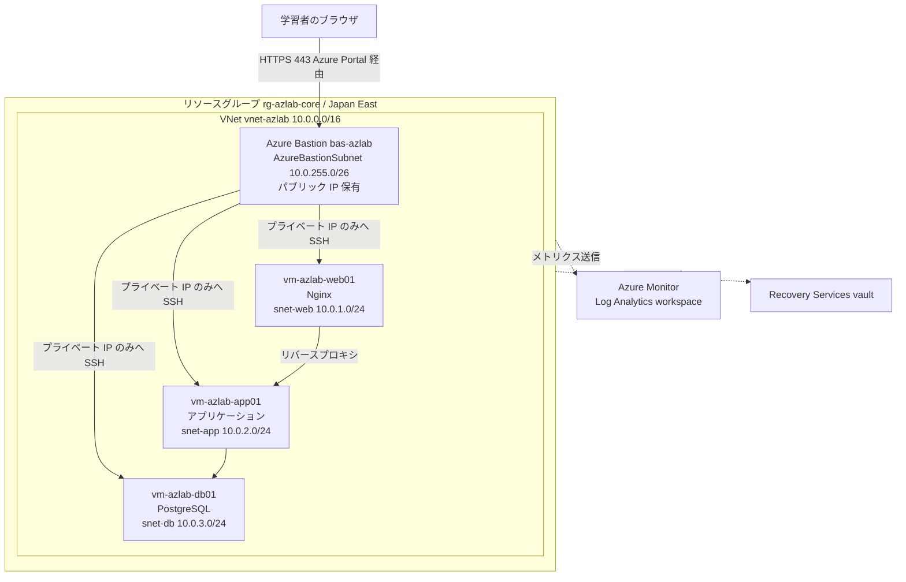

# 10 Azure構築演習設計：基礎からのクラウド基盤構築

> **本ドキュメントの位置付け**
>
> [サーバー構築エンジニア学習プラン](./README.md) Phase 6（[W21 クラウド基礎](./02-curriculum.md#w21-クラウド基礎)・[W22 Terraform によるコード化](./02-curriculum.md#w22-terraform-によるコード化)）のハンズオンを、[05](./05-phase1-exercise-design.md)・[06](./06-shell-scripting-exercise-design.md)・[07](./07-python-ops-automation-exercise-design.md)・[08](./08-ad-exercise-design.md)・[09](./09-zabbix-monitoring-exercise-design.md)と同じ様式で具体化した演習設計です。対象は **Microsoft Azure** です。
>
> **本書は [ADR-0005](../adr/0005-terraform-for-iac.md) を覆すものではありません。** 本ポートフォリオの主要クラウド／IaC 系統は AWS + Terraform のまま（[03 AWS + Terraform](../server-monitor-improvements/03-terraform-aws.md)）とし、本演習はそれとは独立に Azure 環境をもう 1 つ追加で構築します。[target-roles.md](../target-roles.md)・[career-bridge.md「志望の経緯」](../career-bridge.md#志望の経緯)が記すとおり、現在の派遣先では Windows Server / AD / Linux / AWS / Azure の構築研修に就いており、Azure は志望領域そのものに直結します。国内 SIer・大手企業の社内基盤では Microsoft 365 / Entra ID との親和性から Azure の採用例が多いことも踏まえ、AWS 一本足の実務経験を Azure でも説明できる状態へ引き上げるための補完演習として設計します（[09 Zabbix](./09-zabbix-monitoring-exercise-design.md)が Prometheus 系を置き換えずに Zabbix を追加したのと同じ位置付け）。
>
> 本リポジトリの「[新規設計を増やさない運用ルール](../evidence-capture-checklist.md#新規設計を増やさない運用ルール)」の対象は **server-monitor の改善設計 06 以降**です。本書は改善設計ではなく学習計画（[05](./05-phase1-exercise-design.md)〜[09](./09-zabbix-monitoring-exercise-design.md)と同じ位置付け）のため対象外です。
>
> **技術情報の裏取りについて**: 本書のバージョン・コマンド・料金体系は、2026-08-27 に AI 支援セッションで Microsoft Azure 公式ドキュメント（`learn.microsoft.com`・`azure.microsoft.com`）を調査して作成しました。このセッションのネットワーク方針により両ドメインへの直接アクセスが遮断されたため、検索エンジンのスニペットと、GitHub 公式リポジトリ（`hashicorp/terraform-provider-azurerm`）のリリースタグ一覧を突き合わせて裏付けを取っています。Terraform azurerm provider のメジャーバージョン（本書執筆時点で `5.x` 系、`5.0.0` は 2026-07-27 リリースの破壊的変更を含むメジャー更新）は GitHub のリリースタグから直接確認できたため信頼度が高い一方、Azure CLI の細かいオプション・イメージエイリアス名・無料アカウントの正確な条件は第三者記事・検索スニペットからの推定が含まれます。**実施前に、記載のコマンド・料金条件を `learn.microsoft.com`・`azure.microsoft.com` の公式ドキュメントで再確認してください**（[ADR-0001](../adr/0001-monitoring-stack.md)・[09 Zabbix](./09-zabbix-monitoring-exercise-design.md)と同じく「調べた範囲での判断」であることの明記）。
>
> 本ドキュメントは**設計であり、実施記録ではありません**。実施したら [11. 実施ステータス](#11-実施ステータスと次のアクション)を更新します。

最終更新: 2026-08-27

> **実施ステータス: 設計のみ・未実施**（2026-08-27 時点）。試験項目書の実測結果欄はすべて空欄です。

---

## 目次

| 節 | 内容 |
| --- | --- |
| [1](#1-演習の目的スコープ前提条件) | 目的・スコープ・前提条件 |
| [2](#2-要件と基本設計) | 要件と基本設計（サービス選定・構成・AWS 系との対応） |
| [3](#3-パラメータシート) | パラメータシート |
| [4](#4-構築手順書) | 構築手順書（課金ガード・ネットワーク・Bastion・VM 構築） |
| [5](#5-azure-基盤設計level-1level-5) | Azure 基盤設計（Level 1〜5：ガバナンス・ネットワーク・コンピュート・IaC・監視/バックアップ） |
| [6](#6-障害演習検知から復旧までaz-d1) | 障害演習：検知から復旧まで（AZ-D1） |
| [7](#7-試験項目書) | 試験項目書 |
| [8](#8-到達確認) | 到達確認 |
| [9](#9-実施タイムテーブルと中断基準) | 実施タイムテーブルと中断基準 |
| [10](#10-証跡採録計画) | 証跡採録計画 |
| [11](#11-実施ステータスと次のアクション) | 実施ステータスと次のアクション |

---

## 1. 演習の目的・スコープ・前提条件

### 目的

[02 フェーズ別カリキュラム W21](./02-curriculum.md#w21-クラウド基礎)は「クラウドの責任共有モデル / 仮想ネットワーク / セキュリティグループ / 仮想サーバー」等の**見出しだけ**のハンズオンで、クラウド事業者を指定していません。本ラボの IaC 実装（[ADR-0005](../adr/0005-terraform-for-iac.md)、[03 AWS + Terraform](../server-monitor-improvements/03-terraform-aws.md)）は AWS を対象にしていますが、それとは別に、次の 2 点を満たす補完演習として本書を設計します。

1. [career-bridge.md §2.7](../career-bridge.md#27-クラウド基盤の転用可能性aws--azure)の概念対応表を「調べて書いた対応関係」から「実際に構築・設定して検証した対応関係」へ引き上げる
2. 現在の派遣先研修（[target-roles.md](../target-roles.md)）、および国内 SIer・エンタープライズ案件で頻出する Azure の実務経験を、[05](./05-phase1-exercise-design.md)〜[09](./09-zabbix-monitoring-exercise-design.md)と同水準の具体性（コマンド・想定結果・試験項目）で積む

### スコープ

| 対象 | 扱い |
| --- | --- |
| サブスクリプション・リソースグループ・タグ設計 | **対象**。[4 章](#4-構築手順書)・[5.1](#51-level-1-ガバナンスid) |
| Microsoft Entra ID（旧 Azure AD）のユーザー・グループ・RBAC の基礎 | **対象**。[5.1](#51-level-1-ガバナンスid) |
| VNet・サブネット・NSG・Azure Bastion による踏み台経由アクセス | **対象**。[4 章](#4-構築手順書)・[5.2](#52-level-2-ネットワーク設計) |
| Linux VM（Ubuntu）のポータル + CLI での構築、3 層構成の再現 | **対象**。[4 章](#4-構築手順書)・[5.3](#53-level-3-コンピュート運用) |
| Terraform（`azurerm` provider）による IaC 化（[ADR-0005](../adr/0005-terraform-for-iac.md)の知識転用） | **対象**。[5.4](#54-level-4-iacterraform) |
| Azure Monitor + Log Analytics による基礎監視 | **対象**。[5.5](#55-level-5-監視バックアップ) |
| Azure Backup（Recovery Services vault）による VM バックアップ・リストア | **対象**。[5.5](#55-level-5-監視バックアップ)・[7 章](#7-試験項目書)の T-15 |
| 予算アラート・コスト可視化・削除漏れ防止 | **対象**。[4 章](#4-構築手順書)の AZ-1、[5.1](#51-level-1-ガバナンスid)の G1-4 |
| 障害注入と検知・通知・復旧の一連の演習 | **対象**。[6 章](#6-障害演習検知から復旧までaz-d1) |
| オンプレ AD（[08](./08-ad-exercise-design.md)）と Entra ID のハイブリッド同期（Entra Connect） | **対象外**。単一クラウドの学習ラボの範囲を超える。[今後の興味リスト](../roadmap/README.md)相当の発展 topic |
| Bicep / ARM テンプレートでの IaC | **対象外**。Terraform に一本化し、AWS 側（[03](../server-monitor-improvements/03-terraform-aws.md)）と同じツールで学習コストを増やさない。概念のみ[5.4](#54-level-4-iacterraform)の T4-1 で触れる |
| AKS（マネージド Kubernetes） | **対象外**。[今後の興味リスト（Kubernetes / EKS）](../roadmap/README.md)と合流する将来 topic |
| L7 ロードバランサー（Application Gateway / Front Door）、マルチリージョン構成 | **対象外**。単一リージョンの学習ラボの範囲を超える |
| Azure Policy・Blueprints 等の組織ガバナンス機能 | **対象外**。個人サブスクリプション 1 つの学習ラボでは体験できる範囲が限られる |

### 前提条件

| 項目 | 内容 |
| --- | --- |
| 環境 | [01 学習環境](./01-environment.md)のオンプレ VM ラボとは別に、Azure サブスクリプションを 1 つ用意する（無料アカウントを想定。[4 章](#4-構築手順書)の AZ-1 参照） |
| 前提知識 | [02 W21](./02-curriculum.md#w21-クラウド基礎)の座学一式、[02 W9-W11](./02-curriculum.md#phase-3-ミドルウェア構築w9-w12)（Nginx・PostgreSQL）、[06](./06-shell-scripting-exercise-design.md)・[07](./07-python-ops-automation-exercise-design.md)で慣れた CLI 操作、[ADR-0005](../adr/0005-terraform-for-iac.md)の Terraform 基礎（AWS 版で学習済みの `plan`/`apply`/`state`/`destroy`） |
| 権限 | Azure サブスクリプションの Owner（個人アカウントでの新規サブスクリプション作成を想定。以後は Contributor へ権限を絞る運用を[5.1](#51-level-1-ガバナンスid)の G1-2 で扱う） |
| 想定所要時間 | 構築 3 時間 + Azure 基盤設計（Level 1〜5）5 時間 + 障害演習・試験 2.5 時間（[9 章](#9-実施タイムテーブルと中断基準)） |
| 位置付け | [24 週学習プラン](./README.md)の**補完トラック**。Phase 6（W21-W22）の IaC・クラウドの主教材は AWS + Terraform のままとし、本書はそれに加えて Azure 版を実施する |

---

## 2. 要件と基本設計

### 非機能要件（学習ラボとしての最小要件）

| # | 要件 | 理由 |
| --- | --- | --- |
| N1 | 無料枠・低コストの範囲で完結する | [01 学習環境 §5](./01-environment.md#5-クラウド検証と課金事故の防止)の課金ガードの考え方を Azure にも適用する |
| N2 | 既存の Terraform スキル（[ADR-0005](../adr/0005-terraform-for-iac.md)）を転用する | 新規に学ぶ範囲を Azure 固有の概念（リソースモデル・RBAC・NSG）に絞り、学習コストを抑える |
| N3 | オンプレ 3 層ラボ（[01 学習環境](./01-environment.md#3-ラボ構成3-台構成)）と対比できる構成にする | 同じ Web/AP/DB 3 層構成を Azure 上に再現し、オンプレとクラウドの設計差分を体感する |
| N4 | 障害注入・復旧演習ができる | [5 原則](./README.md#5-進め方の-5-原則)の「壊してから直す」をそのまま適用する |

### 基本設計（構成とサービス選定）

| 項目 | 選定 | 理由 |
| --- | --- | --- |
| サブスクリプション | Azure 無料アカウント（本書執筆時点で $200 クレジット / 30 日 + 主要サービス 12 か月無料 + 常時無料サービスという構成。金額・期間は変更されることがあるため、登録前に [azure.microsoft.com/pricing/purchase-options/azure-account](https://azure.microsoft.com/pricing/purchase-options/azure-account) で必ず最新条件を確認する） | 個人学習の実費を最小化する。クレジット消費後は従量課金への切替可否を都度判断する |
| リージョン | Japan East（東日本） | 国内案件を想定し、レイテンシ・料金を体感するため。コストを切り詰めたい場合は最安リージョンでも学習目的は達成できる |
| OS | Ubuntu Server 24.04 LTS（Azure Marketplace） | [01 学習環境](./01-environment.md#os-の選び方)・オンプレ 3 層ラボと揃え、学習コストを増やさない。Azure CLI のイメージエイリアス名（`Ubuntu2204` 等）はバージョンごとに追加されるため、実施時に `az vm image list --publisher Canonical --all --output table` 等で最新のエイリアスを確認する |
| VM サイズ | `Standard_B1s` / `Standard_B2s`（B シリーズ・バースト可能） | 学習ラボの最小構成。無料アカウントの対象 SKU に含まれることが多い（実施時に対象条件を確認する）。CPU クレジットという AWS の T シリーズに近い概念を学べる |
| ネットワーク | VNet 1 つ + サブネット 4 分割（web/app/db + `AzureBastionSubnet`） | [01 学習環境](./01-environment.md#ネットワーク設計)の 3 層ラボ構成を Azure 上に再現しつつ、Bastion 専用サブネットという Azure 特有の制約を学ぶ |
| 管理アクセス | **Azure Bastion**（VM にパブリック IP を一切持たせない） | [01 学習環境 §5](./01-environment.md#5-クラウド検証と課金事故の防止)の「アクセス元を自分の IP のみに限定する」からさらに一歩進め、「そもそも直接公開しない」設計を学ぶ |
| ID | **Microsoft Entra ID**（2023 年に Azure Active Directory から改称。テナントは個人アカウント作成時に自動生成される既定テナントを使用） | [08 AD構築演習](./08-ad-exercise-design.md)（オンプレ AD DS）との対比で、クラウドネイティブな ID プロバイダーの設計思想の違いを学ぶ |
| IaC | **Terraform `azurerm` provider**（本書執筆時点の最新は `5.2.0`。`5.0.0` で破壊的変更を含むメジャー更新が 2026-07-27 に入っている） | [ADR-0005](../adr/0005-terraform-for-iac.md)の継続。Bicep / ARM は対象外（[スコープ](#スコープ)参照） |
| 監視 | Azure Monitor + Log Analytics workspace | [ADR-0001](../adr/0001-monitoring-stack.md)・[ADR-0006](../adr/0006-self-host-monitoring.md)の自前運用方針は変更しない。あくまで「クラウドネイティブ監視も動かして比較できる」ための補完 |
| バックアップ | Azure Backup（Recovery Services vault） | オンプレ 3 層ラボの `pg_dump`/`pg_restore`（[02 W11](./02-curriculum.md#w11-データベースの構築とリストア試験)）と対比し、マネージド型バックアップの操作感を学ぶ |

図の要約：`vnet-azlab` 内にリバースプロキシ（web）・アプリケーション（app）・DB の 3 層と、管理アクセス専用の `AzureBastionSubnet` を配置します。3 台の VM はいずれもパブリック IP を持たず、学習者は Azure Bastion 経由でのみ SSH 接続できます。Azure Monitor・Recovery Services vault はリソースグループ内の各リソースを横断的に扱う管理系サービスです。

### AWS 系との概念対応表（本演習版）

career-bridge.md §2.7（本書と同時に新設）の対応表に、本演習での実装物を加えた版です。09 の Prometheus → Zabbix 対応表と同じ形式で整理します。

| インフラの概念 | 本ポートフォリオ主系統（AWS + Terraform、[ADR-0005](../adr/0005-terraform-for-iac.md)） | Azure（本演習） | 本演習での実装物 |
| --- | --- | --- | --- |
| 課金の入れ物 | アカウント | サブスクリプション | [4 章](#4-構築手順書)の AZ-1 |
| リソースのグルーピング | タグ + アカウント分割 | リソースグループ | `rg-azlab-core`（[3 章](#3-パラメータシート)） |
| 仮想ネットワーク | VPC | VNet | `vnet-azlab`（10.0.0.0/16） |
| サブネット | サブネット（AZ 紐付け） | サブネット（リージョン内） | `snet-web`/`snet-app`/`snet-db`/`AzureBastionSubnet` |
| ファイアウォール | セキュリティグループ（ステートフル、インスタンス単位） | NSG（サブネット/NIC 単位に付与） | [5.2](#52-level-2-ネットワーク設計)の N-2 |
| 管理アクセス | Session Manager / 踏み台ホスト | Azure Bastion | [5.2](#52-level-2-ネットワーク設計)の N-4 |
| IAM | IAM ユーザー / ロール / ポリシー | Entra ID + RBAC（組み込み/カスタムロール） | [5.1](#51-level-1-ガバナンスid) |
| コンピュート | EC2 | Azure VM | `vm-azlab-web01` 等 |
| IaC ツール | Terraform（`aws` provider） | Terraform（`azurerm` provider） | [5.4](#54-level-4-iacterraform) |
| 監視 | CloudWatch | Azure Monitor + Log Analytics | [5.5](#55-level-5-監視バックアップ) |
| バックアップ | EBS スナップショット / AWS Backup | Azure Backup（Recovery Services vault） | [5.5](#55-level-5-監視バックアップ) |

「アカウント境界・ネットワーク・ファイアウォール・IAM・IaC・監視・バックアップ」という骨格は共通ですが、**リソースの階層構造**（AWS はアカウント直下にフラットにリソースが並ぶのに対し、Azure はテナント → サブスクリプション → リソースグループという入れ子構造を持つ）と、**IaC ツールは同じでも provider が変わるだけで多くの引数・既定動作が変わる**（[5.4](#54-level-4-iacterraform)の T4-1）という 2 点が構造的な違いです。この違いを実機で体験することが、career-bridge.md の対応表を「説明できる」段階から「動かして示せる」段階へ引き上げます。

---

## 3. パラメータシート

### 基本情報

| 項目 | 値 |
| --- | --- |
| サブスクリプション名 | （実施時に記入。無料アカウント作成時の既定名から変更してもよい） |
| リソースグループ | `rg-azlab-core`（Japan East） |
| 対応する演習 | 10 Azure構築演習（本書） |
| 位置付け | [24 週学習プラン](./README.md) Phase 6（W21-W22）の補完演習。本ポートフォリオの主要クラウド/IaC 系統は AWS + Terraform（[ADR-0005](../adr/0005-terraform-for-iac.md)）のままとし、本環境は独立して追加する |

### タグ規則

[01 学習環境](./01-environment.md#命名と-ip-の割り当て規則)の命名規則と同じ考え方で、**規則を決めてから作る**運用にします。

| タグキー | 値の例 | 用途 |
| --- | --- | --- |
| `env` | `lab` | 本番運用と学習ラボを区別する |
| `owner` | （個人名は書かず `portfolio` 等マスクした値） | Cost Management でのフィルタ用 |
| `purpose` | `azure-foundational-exercise` | 本書との対応付け |
| `delete-by` | 削除予定日（例 `2026-09-15`） | [4 章](#4-構築手順書)の AZ-9 で消し込みに使う。[01 学習環境 §5](./01-environment.md#5-クラウド検証と課金事故の防止)の「作ったものの一覧を紙に書いてから作る」運用のクラウド版 |

### ネットワーク

| 項目 | 値 |
| --- | --- |
| VNet | `vnet-azlab` / `10.0.0.0/16` |
| サブネット（web） | `snet-web` / `10.0.1.0/24` |
| サブネット（app） | `snet-app` / `10.0.2.0/24` |
| サブネット（db） | `snet-db` / `10.0.3.0/24` |
| サブネット（Bastion） | `AzureBastionSubnet` / `10.0.255.0/26`（**名前は固定・変更不可。最小 `/26` が必須**という Azure 特有の制約） |
| NSG | `nsg-azlab-web` / `nsg-azlab-app` / `nsg-azlab-db`（サブネットへ関連付け。[5.2](#52-level-2-ネットワーク設計)の N-2） |
| Bastion 用パブリック IP | `pip-azlab-bastion`（Standard SKU。VM 側にはパブリック IP を作らない） |

### VM

| ホスト名 | 役割 | サブネット / プライベート IP | サイズ | 対応するオンプレ資産 |
| --- | --- | --- | --- | --- |
| `vm-azlab-web01` | Nginx リバースプロキシ | `snet-web` / `10.0.1.4` | `Standard_B1s` | [01 学習環境の `lab-web01`](./01-environment.md#3-ラボ構成3-台構成) |
| `vm-azlab-app01` | アプリケーション | `snet-app` / `10.0.2.4` | `Standard_B1s` | `lab-app01` |
| `vm-azlab-db01` | PostgreSQL | `snet-db` / `10.0.3.4` | `Standard_B2s`（DB は余裕を持たせる） | `lab-db01` |

### Bastion・ID

| 項目 | 値 |
| --- | --- |
| Azure Bastion | `bas-azlab`（Basic SKU。学習用途では単一学習者の同時接続のみのため最安の Basic で足りる） |
| 管理者ユーザー名（VM） | `azlabadmin`（SSH 公開鍵認証。パスワード認証は無効のまま） |
| Entra ID テストユーザー | `azlab-test01`（[5.1](#51-level-1-ガバナンスid)の G1-3 で作成。MFA を有効化） |
| Entra ID グループ | `azlab-contributors`（テストユーザーを所属させ、グループ経由でロールを割り当てる） |
| RBAC | 個人アカウント = サブスクリプションの Owner（登録直後）。日常操作は `rg-azlab-core` スコープの組み込みロール **Contributor** を割り当てたグループ経由で行う（[5.1](#51-level-1-ガバナンスid)の G1-2） |

---

## 4. 構築手順書

段階的に機能を積み、各段階の直後に想定結果を確認します（[09 の 4 章](./09-zabbix-monitoring-exercise-design.md#4-構築手順書)と同じ形式）。コマンドは Azure CLI（`az`）を前提にしています。**実行前に [learn.microsoft.com](https://learn.microsoft.com/azure/) で自分のバージョン・課金条件を再確認してください**（イメージエイリアス名・無料アカウントの条件は変わることがあります）。

| No | 段階 | 追加する内容 | 想定結果 | 判定 |
| --- | --- | --- | --- | --- |
| AZ-1 | 無料アカウント登録・予算アラート設定（**最初にガードを設定**） | `az login` でサインイン → Azure Portal の Cost Management + Billing で予算（例: 1,000 円）を作成し、80%/100% 到達時のメール通知を有効化 | `az account show --output table` で対象サブスクリプションが表示され、予算アラートが「有効」と表示される | ガード未設定のまま先へ進まない |
| AZ-2 | リソースグループ作成 | `az group create --name rg-azlab-core --location japaneast --tags env=lab purpose=azure-foundational-exercise` | `az group show --name rg-azlab-core --output table` が正常表示される | エラーなく完了 |
| AZ-3 | VNet・サブネット作成 | `az network vnet create --resource-group rg-azlab-core --name vnet-azlab --address-prefix 10.0.0.0/16 --subnet-name snet-web --subnet-prefix 10.0.1.0/24` に続けて `az network vnet subnet create` を 3 回（`snet-app`・`snet-db`・`AzureBastionSubnet`） | `az network vnet subnet list --resource-group rg-azlab-core --vnet-name vnet-azlab --output table` で 4 サブネットが表示される | 4 件とも `Succeeded` |
| AZ-4 | NSG 作成・関連付け | `az network nsg create` を 3 回（web/app/db）→ `az network nsg rule create` で SSH（22番）を送信元 `10.0.255.0/26`（Bastion サブネット）のみ許可 → `az network vnet subnet update --network-security-group` でサブネットへ関連付け | `az network nsg rule list --resource-group rg-azlab-core --nsg-name nsg-azlab-web --output table` に優先度付きの許可ルールが 1 件表示される | 送信元が `10.0.255.0/26` に限定されている |
| AZ-5 | Azure Bastion 作成 | `az network public-ip create --name pip-azlab-bastion --sku Standard` → `az network bastion create --name bas-azlab --public-ip-address pip-azlab-bastion --vnet-name vnet-azlab --resource-group rg-azlab-core --sku Basic` | `az network bastion show --name bas-azlab --resource-group rg-azlab-core --query provisioningState` が `Succeeded` | 作成完了まで数分かかる点を織り込む |
| AZ-6 | VM 作成（web/app/db 3 台共通） | `az vm create --resource-group rg-azlab-core --name vm-azlab-web01 --image Ubuntu2404 --size Standard_B1s --vnet-name vnet-azlab --subnet snet-web --nsg "" --public-ip-address "" --admin-username azlabadmin --generate-ssh-keys`（`--nsg ""`/`--public-ip-address ""` で NIC 単位の自動作成を明示的に止める） | `az vm list -d --resource-group rg-azlab-core --output table` で `PowerState` が `running`、`PublicIps` 列が空 | 3 台とも公開 IP を持たない |
| AZ-7 | Bastion 経由の接続確認 | `az network bastion ssh --name bas-azlab --resource-group rg-azlab-core --target-resource-id <vm-azlab-web01 のリソース ID> --auth-type ssh-key --username azlabadmin --ssh-key ~/.ssh/id_rsa` | SSH ログインに成功し、`hostname` の出力が `vm-azlab-web01` と一致する | 3 台とも同じ手順で到達できる |
| AZ-8 | 3 層構成の疎通確認（[02 W9-W11](./02-curriculum.md#phase-3-ミドルウェア構築w9-w12)の再現） | 各 VM へ Nginx / アプリケーション / PostgreSQL を導入し、web → app → db の順にリバースプロキシ・DB 接続を設定する | web のパブリック URL 相当（Bastion 経由の `curl localhost`）で app の応答が返り、app から db への `psql` 接続が成功する | 3 層すべてで応答が確認できる |
| AZ-9 | 一時停止と消し込み | 使わない時間帯は `az vm deallocate --ids <3 台分の ID>` で停止し、タグの `delete-by` を[3 章](#3-パラメータシート)の一覧と突き合わせて消し込む | `az vm list -d --output table` で `PowerState` が `deallocated` | コンピュート課金は止まるが、マネージドディスク・パブリック IP・Bastion は課金が継続する点を[5.1](#51-level-1-ガバナンスid)の G1-4 で確認する |

> **つまずきやすい点（構築全体）**: `AzureBastionSubnet` は名前が固定でリネームできず、既存の `/24` サブネットを後から `/26` へ分割しようとして失敗するケースがあります（[3 章](#3-パラメータシート)のとおり最初から `/26` で確保しておく）。AZ-6 で `--nsg`/`--public-ip-address` の空文字指定を忘れると、Azure が NIC 単位で新規 NSG を自動作成し、サブネット NSG と二重になって意図しない許可ルールが混在することがあります。AZ-7 で Bastion からの接続に失敗する場合、まず `az network nic list-effective-nsg`（[5.2](#52-level-2-ネットワーク設計)の N-3）で実際に適用されているルールを確認してから、ポータルの表示を疑います。

---

## 5. Azure 基盤設計（Level 1〜Level 5）

Azure 固有の「ガバナンス・ネットワーク・コンピュート・IaC・監視/バックアップ」という設計層です。[09 の Level 構造](./09-zabbix-monitoring-exercise-design.md#5-監視設計itemtriggeractiontemplatediscovery)と同じく、段階を追って積み上げます。

### 5.1 Level 1: ガバナンス・ID

| # | 学習項目 | ハンズオン | 到達確認 | つまずきやすい点 |
| --- | --- | --- | --- | --- |
| G1-1 | テナント / サブスクリプション / リソースグループの階層 | `az account show` でテナント ID とサブスクリプション ID を確認し、`az group list --output table` でリソースグループ一覧を確認する | テナントとサブスクリプションが別物であり、個人アカウント作成時に 1 つずつ自動生成されることを図で説明できる | 組織アカウントでは 1 テナントに複数サブスクリプションがぶら下がるが、個人アカウントでは 1 対 1 に見えるため階層をイメージしにくい |
| G1-2 | RBAC の組み込みロール | `az role definition list --output table` で Owner/Contributor/Reader の権限範囲を比較し、`az role assignment list --output table` で自分の割り当てを確認する | Contributor はリソースの作成・削除はできるが RBAC 自体の変更はできないことを、権限のない操作を実際に試してエラーメッセージから確認できる | 「権限が強いほど安全」と誤解しがちだが、RBAC 変更権限（実質的な IAM 管理者相当）を持つのは Owner だけ |
| G1-3 | Entra ID のユーザー・グループ | テストユーザー `azlab-test01` を作成し、グループ `azlab-contributors` へ追加、そのグループへ `rg-azlab-core` スコープの Contributor を割り当てる | 新規ユーザーでサインインし、権限内のリソースのみ操作できることを確認する | 個人ユーザーへの直接ロール割り当てでなく、グループ経由の割り当てを徹底する理由（異動・離任時の一括はく奪）を説明できる |
| G1-4 | コストの可視化と「止める」と「消す」の違い | Cost Management + Billing で日次コストをリソースグループ単位で確認する | AZ-9 で VM を `deallocate` した前後でコスト内訳を比較し、マネージドディスク・パブリック IP・Bastion は課金が継続することを確認する | `deallocate` してもディスク・IP・Bastion は削除されない。「止めた」と「消した」は別物と説明できる |

### 5.2 Level 2: ネットワーク設計

| # | 学習項目 | ハンズオン | 到達確認 | つまずきやすい点 |
| --- | --- | --- | --- | --- |
| N-1 | VNet / サブネット設計と CIDR | [02 W5](./02-curriculum.md#phase-2-ネットワーク基礎w5-w8)の復習として各サブネットの使用可能ホスト数を計算し、`AzureBastionSubnet` の予約制約（名前固定・最小 `/26`）を確認する | 既存 VNet へセカンダリアドレス空間を追加する手順（`az network vnet update --address-prefixes`）を試す | サブネット作成時、Azure がネットワークアドレス・デフォルトゲートウェイ等で先頭 5 個の IP を予約するため、オンプレ計算より使用可能ホスト数が少ない |
| N-2 | NSG ルールの評価順序 | `az network nsg rule list --output table` の優先度（Priority）列で、番号の低い順に評価され最初に一致したルールで確定する既定動作を確認する | AZ-4 で追加した「Bastion サブネットからの SSH のみ許可（優先度 100）」ルールが、既定の `DenyAllInBound`（優先度 65500）より先に評価されることを説明できる | サブネット NSG と NIC NSG の両方が存在する場合、**両方**で許可されて初めて通信できる（AND 条件）。片方だけ許可して疎通しない事故が典型的 |
| N-3 | Effective security rules での検証 | `az network nic list-effective-nsg --resource-group rg-azlab-core --name <web VM の NIC 名>` で、実際に適用されているルールの合成結果を確認する | Bastion 以外の送信元からの SSH が実際にブロックされていることを、Effective rules の一覧から読み取れる | ポータルの表示と実際の評価結果は必ずしも一目で一致しないため、コマンド出力での裏取りを習慣にする |
| N-4 | Azure Bastion の通信経路 | ブラウザ → Azure Bastion（パブリック IP 保有）→ 対象 VM（プライベート IP のみ）という経路を図に書く | VM 側に誤ってパブリック IP を付けてしまった場合の切り離し手順（`az network nic ip-config update` で `--public-ip-address ""`）を実施できる | Bastion の SKU（Basic/Standard）で帯域・同時接続数が変わる。学習用途は Basic で十分だが、複数人が同時利用する現場では Standard が必要になる、という設計判断の違いを説明できる |

### 5.3 Level 3: コンピュート運用

| # | 学習項目 | ハンズオン | 到達確認 | つまずきやすい点 |
| --- | --- | --- | --- | --- |
| C-1 | VM サイズとバースト可能インスタンス | `az vm list-sizes --location japaneast --output table` で B シリーズの仕様を確認し、Azure Monitor の CPU Credit 系メトリクスで消費状況を見る | [06](./06-shell-scripting-exercise-design.md)/[07](./07-python-ops-automation-exercise-design.md)で使った負荷ツールで継続的に高負荷をかけ、CPU クレジット枯渇後に性能が落ちることを確認する | B シリーズは学習用途のコスト最適解だが、常時高負荷のワークロードには不向き（D シリーズ等が必要）と説明できる |
| C-2 | マネージドディスクの追加とリサイズ | データディスクを 1 本追加し、[02 W4](./02-curriculum.md#phase-1-linux-基礎w1-w4)の復習としてパーティション作成・マウントを行う | `az disk update --size-gb` で無停止拡張し、VM 内でファイルシステム拡張（`growpart`/`resize2fs` 等）まで通せる | ディスクの課金は「割り当てた容量」で決まり、使用量を減らしても自動的には安くならない |
| C-3 | カスタムスクリプト拡張 | `az vm extension set` で Custom Script Extension を使い、VM 作成直後にパッケージ導入・初期設定を自動化する | [06](./06-shell-scripting-exercise-design.md)/[07](./07-python-ops-automation-exercise-design.md)の初期設定スクリプトをそのまま流用し、手動 SSH で設定した場合と同じ状態になることを確認する | 拡張の実行ログは VM 内の `/var/log/azure` 配下に残る。失敗時はまずそこを確認する（手順書を見ずに判断できることの一例） |
| C-4 | タグによるコスト按分 | web/app/db 各 VM に `tier=web` 等のタグを付け、Cost Management でタグ別コスト内訳を表示する | タグ規則を決めてから作る（[3 章](#3-パラメータシート)のタグ規則）ことの重要性を、後付けでタグを付ける手間と比較して説明できる | タグは既存リソースへ後付けできるが、**付与前に発生済みのコストには遡って反映されない** |

### 5.4 Level 4: IaC（Terraform）

[ADR-0005](../adr/0005-terraform-for-iac.md)で学んだ Terraform の基本文法（`resource`/`variable`/`output`/`module`、`plan`/`apply`/`state`/`destroy`）を Azure へ転用する演習です。

| # | 学習項目 | ハンズオン | 到達確認 | つまずきやすい点 |
| --- | --- | --- | --- | --- |
| T4-1 | `azurerm` provider の初期化 | `provider "azurerm" { features {} }` を宣言し（バージョン制約は `~> 5.0`）、`terraform init` を実行する | [03 AWS + Terraform](../server-monitor-improvements/03-terraform-aws.md)のコードと見比べ、provider が変わっても `resource`/`variable`/`output`/`module` の基本文法は共通であることを確認できる | `azurerm` provider は `4.0.0` 以降、多くのリソースで `features {}` 内の既定動作が変わっている。AWS 版の感覚のままコードを書くと `plan` の時点でエラーになることがある。Bicep/ARM は対象外（[スコープ](#スコープ)）のため、文法の違いは概念比較にとどめる |
| T4-2 | AZ-2〜AZ-6 のコード化 | リソースグループ・VNet・サブネット・NSG・VM 一式を `.tf` へ落とし込み、`terraform plan` で作成予定リソースを確認してから `apply` する | `az resource list --resource-group rg-azlab-core --output table` の一覧が、手動構築（[4 章](#4-構築手順書)）時と一致することを確認する | VM の SSH 公開鍵など、手動構築時に対話入力していた値を `variables.tf` へ変数化し忘れると、`apply` のたびに入力を求められる |
| T4-3 | state とドリフト検出 | ポータルから手動でタグを 1 つ追加した後に `terraform plan` を実行する | 「手作業の変更とコードの乖離」（[02 W22 の到達確認](./02-curriculum.md#w22-terraform-によるコード化)と同じ論点）が実際に差分として検出されることを確認できる | 検出した差分を、コード側へ反映するか `-refresh-only` で追認するかの判断基準を、変更の意図（一時的な調査用か恒久設定か）から説明できる |
| T4-4 | `destroy` での完全削除 | `terraform destroy` を実行する | `az group show --name rg-azlab-core` が `ResourceGroupNotFound` になることを確認する | `for_each`/`module` で作ったリソースは依存関係の逆順で削除される。依存が正しく書けていないと削除順序でエラーになることがある。Bastion 用の Standard SKU パブリック IP など、destroy 対象から漏れやすいリソースが残っていないか、ポータルでも目視確認する |

### 5.5 Level 5: 監視・バックアップ

| # | 学習項目 | ハンズオン | 到達確認 | つまずきやすい点 |
| --- | --- | --- | --- | --- |
| M-1 | Azure Monitor と Log Analytics workspace の関係 | Log Analytics workspace を 1 つ作成し、Azure Monitor Agent（Data Collection Rule 経由）を各 VM へ導入して CPU/メモリ/ディスクのメトリクスを送る | Metrics Explorer で各 VM の CPU 使用率を時系列グラフで確認できる | Prometheus（pull 型・exporter、[ADR-0001](../adr/0001-monitoring-stack.md)）と対照的に、Azure Monitor は Agent がワークスペースへ push する設計であることを、[09 の pull/push 対応表](./09-zabbix-monitoring-exercise-design.md#prometheus-系との概念対応表本演習版)と同じ整理で説明できる |
| M-2 | メトリックアラート | CPU 使用率が 80% を超えたら通知するアラートルールを作成し、[C-1](#53-level-3-コンピュート運用)と同じ負荷ツールで実際に発火させる | Action Group 経由でメール通知が届き、復旧後に自動で `Resolved` になることを確認できる | アラートの評価粒度（既定 5 分単位が多い）より短い時間で復旧すると発火しないことがある。[09 の `nodata()` の議論](./09-zabbix-monitoring-exercise-design.md#53-level-3-トリガー設計)と同じく、評価粒度と実際の障害時間の関係を説明できる |
| M-3 | Azure Backup でのバックアップ・リストア | Recovery Services vault を作成し、web VM を対象にバックアップポリシー（1 日 1 回・保持 14 日）を設定して初回バックアップを取得する | バックアップ取得後に VM 内の任意のファイルを削除し、ファイルレベル回復または別名復元で復旧し、削除前の状態と一致することを確認できる（[02 W11](./02-curriculum.md#w11-データベースの構築とリストア試験)と同じ「取得しただけでは成果物として数えない、リストアまで確認する」原則） | 初回バックアップ（フル取得）は数十分かかるため、演習の時間配分（[9 章](#9-実施タイムテーブルと中断基準)）に織り込む必要がある |
| M-4 | オンプレ監視スタックとの役割分担 | Prometheus/Grafana（[ADR-0001](../adr/0001-monitoring-stack.md)）と Azure Monitor のダッシュボードを並べ、同じ「CPU 使用率」という指標が異なる仕組み（pull/push、PromQL/KQL）で得られていることを確認する | 対象範囲（オンプレラボ vs Azure 環境）でどちらの監視を見るかを切り分けて説明できる | Azure Monitor のクエリは KQL（Kusto Query Language）であり PromQL とは文法が異なる。「概念は共通、文法は別物」という整理を[09](./09-zabbix-monitoring-exercise-design.md)のトリガー式と同様にここでも適用する |

---

## 6. 障害演習：検知から復旧まで（AZ-D1）

[09 の Z-1 障害演習](./09-zabbix-monitoring-exercise-design.md#6-障害演習検知から復旧までz-1)・[server-monitor の D-1 復旧演習](https://github.com/ns7jp/server-monitor/blob/main/docs/drills/logs/2026-08-19-D-1.md)（RTO 実測）と同じ考え方で、Azure 版の障害注入演習を設計します。目的は「監視・バックアップが設定されている」ことではなく「**検知から復旧までの所要時間を実測できる**」ことです。

| 手順 | 内容 | 記録する時刻 |
| --- | --- | --- |
| 1 | 正常稼働を確認する（web/app/db 3 台とも `running`、Azure Monitor にアラートが無い） | 開始時刻 |
| 2 | `vm-azlab-web01` の Nginx を意図的に停止する（障害注入） | 注入時刻 |
| 3 | [M-2](#55-level-5-監視バックアップ)のメトリックアラート、または[C-3](#53-level-3-コンピュート運用)相当のプロセス監視が異常を検知するまでの時間を記録する | 検知時刻 |
| 4 | Action Group が発火し、メール通知が届く時間を記録する | 通知時刻 |
| 5 | Nginx を再起動して復旧する | 復旧操作時刻 |
| 6 | アラートが `Resolved` になる時間を記録する | 解決時刻 |
| 7 | 検知時間（注入 → 検知）と復旧時間（注入 → 解決）を算出し記録する | — |

> **到達確認**: 検知までの時間が、対象メトリックの評価粒度（既定は概ね数分単位）より短くはならないことを説明できる。これは Prometheus の `scrape_interval`（[09 の到達確認](./09-zabbix-monitoring-exercise-design.md#6-障害演習検知から復旧までz-1)）と同じ「ポーリング型の監視は評価間隔より速くは検知できない」という制約であり、[2 章の概念対応表](#aws-系との概念対応表本演習版)が示す共通点の 1 つです。
>
> **副次的な演習（NSG ロックアウトからの自己復旧）**: [5.2](#52-level-2-ネットワーク設計)の N-2 で作った SSH 許可ルールを誤って削除・変更し、Bastion 経由の接続そのものが失敗する状態を意図的に作ります。Azure Portal のシリアルコンソール（NIC を経由しないため NSG の影響を受けない）から NSG ルールを復元し、再びログインできることを確認します。「ファイアウォールを閉めすぎて自分もアクセスできなくなる」という運用事故を安全に疑似体験し、シリアルコンソールという「最後の手段」の存在を学びます。

実測結果は未実施のため空欄です。実施したら本節に RTO 相当の値を追記します。

---

## 7. 試験項目書

異常系 8 件 / 全 16 件（50%）で、[03 §4](./03-build-process.md#異常系を必ず入れる理由)が定める「異常系 3 割以上」を満たします。実測結果・判定・エビデンス・実施日は未記入（未実施のため）。

| No | 試験分類 | 観点 | 前提条件 | 手順 | 期待結果 | 実測結果 | 判定 | エビデンス | 実施日 |
| --- | --- | --- | --- | --- | --- | --- | --- | --- | --- |
| T-01 | 単体 | リソースグループ作成 | AZ-2 完了後 | `az group show --name rg-azlab-core` | `properties.provisioningState` が `Succeeded` | | | | |
| T-02 | 単体 | VNet/サブネット構成 | AZ-3 完了後 | `az network vnet subnet list` | 4 サブネットが表示される（web/app/db/Bastion） | | | | |
| T-03 | 単体 | NSG ルール | AZ-4 完了後 | `az network nsg rule list` | 優先度 100 で送信元 `10.0.255.0/26` の SSH 許可ルールが 1 件表示される | | | | |
| T-04 | 単体 | Bastion 構築 | AZ-5 完了後 | `az network bastion show` | `provisioningState` が `Succeeded` | | | | |
| T-05 | 結合 | VM 起動状態 | AZ-6 完了後 | `az vm list -d --output table` | 3 台とも `PowerState` が `running`、`PublicIps` が空 | | | | |
| T-06 | 結合 | Bastion 経由 SSH | AZ-7 完了後 | `az network bastion ssh` で 3 台へ接続 | 3 台すべてでログインに成功する | | | | |
| T-07 | 総合 | 3 層構成の疎通 | AZ-8 完了後 | web → app → db の順に応答を確認 | 3 層すべてで期待した応答が返る | | | | |
| T-08 | 総合 | Terraform 化の再現性 | [5.4](#54-level-4-iacterraform) T4-2 完了後 | `terraform apply` 後に `az resource list` を確認 | 手動構築（4 章）と同じリソース一覧になる | | | | |
| T-09 | 異常系 | Bastion 以外からの直接 SSH | 本演習の設計どおり VM にパブリック IP を持たせない状態 | 別ネットワークから対象 VM のプライベート IP へ直接 SSH を試みる（到達性がある場合）、または `az network nic list-effective-nsg` で評価結果を確認する | Bastion サブネット以外の送信元からの SSH は拒否される | | | | |
| T-10 | 異常系 | `AzureBastionSubnet` の命名誤り | サブネット名を `bastion-subnet` 等、規定と異なる名前で作成を試みる | `az network vnet subnet create --name bastion-subnet ...` の後に Bastion 作成を試みる | Bastion の作成時にサブネット名の制約エラーになる | | | | |
| T-11 | 異常系 | RBAC 権限不足操作 | [5.1](#51-level-1-ガバナンスid) G1-3 のテストユーザー（Contributor）でサインイン | 当該ユーザーでロール割り当ての変更を試みる | 権限不足のエラーで拒否される | | | | |
| T-12 | 異常系 | 稼働中 VM のサイズ変更失敗 | VM が `running` の状態 | 一部の対象外サイズへ `az vm resize` を試みる | エラーになる。`deallocate` → `resize` → 起動の正しい手順で成功することを確認する | | | | |
| T-13 | 異常系 | Terraform state とポータル変更の乖離 | [5.4](#54-level-4-iacterraform) T4-3 の状態 | ポータルでタグを手動追加後 `terraform plan` | 差分（ドリフト）が検出される | | | | |
| T-14 | 異常系 | 障害からアラート発火・復旧まで（[6 章](#6-障害演習検知から復旧までaz-d1)の AZ-D1 本体） | 正常稼働中 | AZ-D1 の手順を実施 | 検知・通知・復旧・解決の一連が確認でき、所要時間が記録される | | | | |
| T-15 | 異常系 | Azure Backup からのファイル復元 | [5.5](#55-level-5-監視バックアップ) M-3 の初回バックアップ完了後 | web VM 内のファイルを削除 → ファイルレベル回復を実行 | 削除前と同じ内容のファイルが復元される | | | | |
| T-16 | 異常系 | `destroy` 後の残骸確認 | [5.4](#54-level-4-iacterraform) T4-4 完了後 | `az resource list --resource-group rg-azlab-core`、および Bastion 用パブリック IP 単体の存在確認 | 0 件（リソースグループ自体が存在しない） | | | | |

---

## 8. 到達確認

[学習プランの到達度チェック](./README.md#7-到達度チェック)と同じ形式です。すべて「調べながらで可」ですが、**手順書を見ずに何をすべきか判断できる**ことが条件です。

- [ ] テナント・サブスクリプション・リソースグループの階層関係を、AWS のアカウント/タグ構造と対比して説明できる
- [ ] RBAC の組み込みロール（Owner/Contributor/Reader）の違いを説明し、権限の強さと RBAC 変更権限は別軸であることを説明できる
- [ ] VNet・サブネットの CIDR 設計と、`AzureBastionSubnet` に課される名前・サイズの制約を説明できる
- [ ] NSG のルール評価順序（優先度）と、サブネット NSG・NIC NSG の AND 条件を説明できる
- [ ] Azure Bastion を使い、VM にパブリック IP を持たせずに管理アクセスできる設計を構築・説明できる
- [ ] Terraform の `azurerm` provider で AZ-2〜AZ-6 相当の構成をコード化し、`plan`/`apply`/`destroy` を実行できる
- [ ] Terraform state と手動変更の乖離（ドリフト）を検出し、対応方針を判断できる
- [ ] Azure Monitor でメトリックアラートを設定し、発火から解決までの通知記録を確認できる
- [ ] Azure Backup で VM のバックアップを取得し、ファイル単位の復元まで実行して内容を照合できる
- [ ] [career-bridge.md §2.7 の概念対応表](../career-bridge.md#27-クラウド基盤の転用可能性aws--azure)を、実機の画面を示しながら自分の言葉で説明できる
- [ ] AWS（アカウント直下にフラットなリソース構造・`aws` provider）と Azure（テナント→サブスクリプション→リソースグループの階層構造・`azurerm` provider）の設計思想の違いを、実際にコードを書いた経験に基づいて比較して説明できる

---

## 9. 実施タイムテーブルと中断基準

[09 §9](./09-zabbix-monitoring-exercise-design.md#9-実施タイムテーブルと中断基準)と同じ考え方で、構築・基盤設計・障害演習を別セッションに分けます。

### セッション 1（構築、[4 章](#4-構築手順書)）

| 経過時間 | 作業 | 判定ポイント |
| --- | --- | --- |
| 0:00 | AZ-1〜AZ-5（課金ガード・RG・ネットワーク・NSG・Bastion） | 各段階の想定結果が一致する |
| 1:30 | AZ-6〜AZ-7（VM 作成・Bastion 経由接続、3 台分） | 3 台とも SSH でログインできる |
| 2:15 | AZ-8〜AZ-9（3 層疎通・一時停止） | 3 層すべてで応答が確認できる |
| 3:00 | **セッション 1 の終了目標** | 未完了は次セッションへ繰り越す |

### セッション 2（ガバナンス・ネットワーク・コンピュート、[5.1](#51-level-1-ガバナンスid)〜[5.3](#53-level-3-コンピュート運用)、別日）

| 経過時間 | 作業 | 判定ポイント |
| --- | --- | --- |
| 0:00 | 5.1（ガバナンス・ID） | G1-1〜G1-4 の到達確認を満たす |
| 1:00 | 5.2（ネットワーク設計） | N-1〜N-4 の到達確認を満たす |
| 2:00 | 5.3（コンピュート運用） | C-1〜C-4 の到達確認を満たす |
| 3:00 | **セッション 2 の終了目標** | 未完了は次セッションへ繰り越す |

### セッション 3（IaC 化、[5.4](#54-level-4-iacterraform)、別日）

| 経過時間 | 作業 | 判定ポイント |
| --- | --- | --- |
| 0:00 | T4-1〜T4-2（provider 初期化・コード化） | `terraform apply` が成功し手動構築と一致する |
| 1:15 | T4-3（ドリフト検出） | 手動変更の差分が検出される |
| 1:45 | T4-4（destroy） | リソースグループが存在しなくなる |
| 2:00 | **セッション 3 の終了目標** | 未完了は次セッションへ繰り越す |

### セッション 4（監視・バックアップ・障害演習・試験、[5.5](#55-level-5-監視バックアップ)・[6 章](#6-障害演習検知から復旧までaz-d1)・[7 章](#7-試験項目書)、別日）

| 経過時間 | 作業 | 判定ポイント |
| --- | --- | --- |
| 0:00 | 5.5（Azure Monitor・Azure Backup） | M-1〜M-4 の到達確認を満たす（初回バックアップの待ち時間を含む） |
| 1:30 | T-01〜T-08（単体・結合・総合） | 全項目で期待結果どおりの成功が再現する |
| 2:00 | T-09〜T-13、T-15〜T-16（異常系） | 全項目で期待結果どおりの失敗・検知が再現する |
| 2:30 | T-14（AZ-D1 障害演習本体） | 検知・通知・復旧・解決の所要時間が記録される |
| 2:50 | **セッション 4 の終了目標** | 未完了は次セッションへ繰り越す |

**中断基準**（[05](./05-phase1-exercise-design.md#6-実施タイムテーブルと中断基準)・[09](./09-zabbix-monitoring-exercise-design.md#9-実施タイムテーブルと中断基準)と同じ運用）:

1. 1 つのつまずきに 30 分以上かかった場合、[01 学習環境 §7 の 30 分ルール](./01-environment.md#7-環境トラブルの対処)に従う
2. コスト・課金に関する不安が生じたら、作業を中断してでも先に Cost Management で実費を確認する（[4 章](#4-構築手順書)の AZ-1 で設定した予算アラートが本来の役目を果たす場面）
3. 開始から終了目標を過ぎた時点で未実施の項目が残っている場合、その日は打ち切り、残りを次セッションで実施する
4. **その日の作業を終える前に、必ず AZ-9 の一時停止・タグ確認を実施する**（クラウド特有の「放置すると課金が続く」リスクへの対処。オンプレラボには無い中断基準）

---

## 10. 証跡採録計画

本演習を実際に実行する際の記録方針です。[証跡採録チェックリストの原則](../evidence-capture-checklist.md#このチェックリストの原則)にある「設計サンプルと実測証跡を混同しない」を踏まえ、**このドキュメントの表を直接 PASS で埋めません**。

| 項目 | 方針 |
| --- | --- |
| Terraform コード | `.tf`/`.tfvars` は、サブスクリプション ID・テナント ID 等の秘密値をマスクした上で `server-monitor` 側の演習用ディレクトリ、または本リポジトリの補助トラック証跡へ置く |
| 作業ログ | [03 §3 の作業ログ取得](./03-build-process.md#作業ログの取得)と同じく `script -a` または Azure CLI の `--debug` 出力を記録し、`server-monitor` の `docs/drills/logs/` へ保存する |
| スクリーンショット | ポータル画面・Cost Management のスクリーンショットは、サブスクリプション ID・テナント ID・パブリック IP・請求額の詳細をマスクしてから保存する |
| 試験証跡の命名 | [7 章](#7-試験項目書)の試験項目書のエビデンス列は `<試験No>_<対象>_<日付>.<拡張子>` で統一する（[09](./09-zabbix-monitoring-exercise-design.md#10-証跡採録計画)と同じ規則） |
| 障害演習の実測値 | [6 章](#6-障害演習検知から復旧までaz-d1)の検知時間・復旧時間は、[server-monitor の D-1 演習](https://github.com/ns7jp/server-monitor/blob/main/docs/drills/logs/2026-08-19-D-1.md)と同じ形式（`症状 → 検知 → 通知 → 復旧 → 所要時間` の表）で記録する |
| コスト実績 | AZ-1 の予算アラート設定後、実施完了時に Cost Management の実費を記録する（[01 学習環境 §5](./01-environment.md#5-クラウド検証と課金事故の防止)の「金額そのものが学習の証跡になる」と同じ原則） |
| 削除完了の確認 | 実施最終日に `az group delete --name rg-azlab-core` 実行後、`az group list` に残骸が無いことのスクリーンショットを残す |
| 反映先 | 実施後、本ドキュメントの各試験項目書・[6 章](#6-障害演習検知から復旧までaz-d1)の実測結果欄を埋めるか、実施記録を指す別ファイルへのリンクをここに追加する |

---

## 11. 実施ステータスと次のアクション

- **現在の状態**: 設計のみ・未実施（2026-08-27 時点）。本書の技術情報は AI 支援セッションでの Web 調査（本書冒頭「技術情報の裏取りについて」を参照）に基づくものであり、本人が実機で構築・検証した記録ではない
- **次のアクション**:
  1. Azure 無料アカウントを登録し、実施前に本書のコマンド・料金条件を `azure.microsoft.com`/`learn.microsoft.com` で再確認したうえで[4 章](#4-構築手順書)の AZ-1 から着手する
  2. 構築完了後、[5 章](#5-azure-基盤設計level-1level-5)のガバナンス・ネットワーク・コンピュート・IaC・監視/バックアップを順に進める
  3. [6 章](#6-障害演習検知から復旧までaz-d1)の障害演習を実施し、検知・復旧の所要時間を実測する
- **完了後に更新するもの**:
  - [02 フェーズ別カリキュラム W21/W22](./02-curriculum.md#w21-クラウド基礎)から、本書の実施記録へのリンク
  - [career-bridge.md §2.7](../career-bridge.md#27-クラウド基盤の転用可能性aws--azure)の概念対応表に、実施結果へのリンクを追加
  - [証跡採録チェックリスト](../evidence-capture-checklist.md)の残タスク表への追加
  - [STATUS.md](../../STATUS.md)の該当エントリ

---

## 関連ドキュメント

- [学習プラン 全体像](./README.md)
- [01 学習環境の作り方](./01-environment.md)
- [02 フェーズ別カリキュラム](./02-curriculum.md)
- [03 構築工程の実務ドキュメント](./03-build-process.md)
- [04 教材と資格の対応](./04-resources.md)
- [05 Phase 1 演習設計](./05-phase1-exercise-design.md)
- [06 シェルスクリプト演習設計](./06-shell-scripting-exercise-design.md)
- [07 Python 運用自動化演習設計](./07-python-ops-automation-exercise-design.md)
- [08 AD構築演習設計](./08-ad-exercise-design.md)
- [09 Zabbix 監視基盤構築演習設計](./09-zabbix-monitoring-exercise-design.md)
- [現場経験とインフラ運用の橋渡し（AWS → Azure の概念対応表）](../career-bridge.md#27-クラウド基盤の転用可能性aws--azure)
- [ADR-0005: IaC に Terraform を採用](../adr/0005-terraform-for-iac.md)
- [ADR-0001: 監視スタックに Prometheus + Grafana を採用](../adr/0001-monitoring-stack.md)
- [ADR-0006: 監視は自前運用（SaaS を採用しない）](../adr/0006-self-host-monitoring.md)
- [03 AWS + Terraform](../server-monitor-improvements/03-terraform-aws.md)
- [志望トラックと証跡](../target-roles.md)
- [証跡採録チェックリスト](../evidence-capture-checklist.md)
- [学習の一次記録（つまずきログ）](../../LEARNINGS.md)
- [ポートフォリオ進捗 STATUS](../../STATUS.md)
