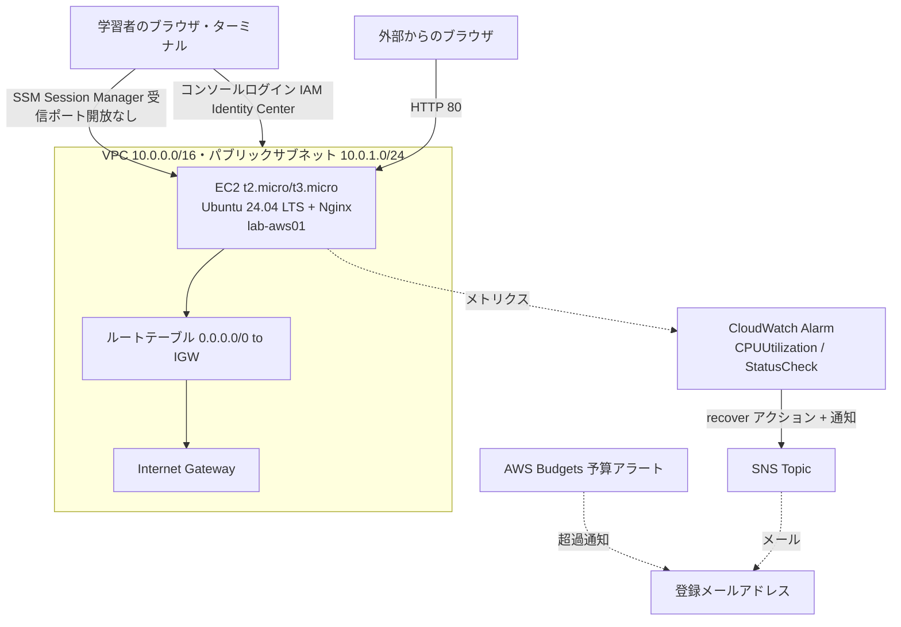

# 11 AWS基礎構築演習設計：基礎からのクラウド構築とTerraform化

> **本ドキュメントの位置付け**
>
> [サーバー構築エンジニア学習プラン](./README.md) Phase 6 の [W21 クラウド基礎](./02-curriculum.md#w21-クラウド基礎)・[W22 Terraformによるコード化](./02-curriculum.md#w22-terraform-によるコード化)は、他のフェーズと違って学習項目・ハンズオンが見出しレベルの記述にとどまっており、[05](./05-phase1-exercise-design.md)〜[09](./09-zabbix-monitoring-exercise-design.md)と同じ密度の具体設計がありませんでした。本書はこの差分を、[03 構築工程の実務ドキュメント](./03-build-process.md)の様式（パラメータシート・構築手順書・試験項目書）に沿って埋めます。
>
> **本書は [STATUS.md の「コードでは埋められない、残っている穴」4 番目](../../STATUS.md#コードでは埋められない残っている穴)（Terraform 約 3,000 行が `apply` 0 回）に対応する、最初の一歩としての演習設計です。** [server-monitor 改善設計 03 AWS + Terraform化](../server-monitor-improvements/03-terraform-aws.md)はモジュール・環境コードとも実装済みですが、ALB・マルチAZ・NAT Gateway・CloudTrail・GuardDuty を含む本番想定の約 3,000 行が一度も `apply` されていません。**本書はその設計をいきなり実行するための手引きではありません。** VPC 1 つ・EC2 1 台という最小構成を、コンソールでの手動構築（W21 相当）→ Terraform 化（W22 相当）の順で、実際に `apply` してから `destroy` まで確実に回し切ることだけを目的にした、規模を絞った別物の演習として設計します。ここで一度も `apply` していない状態を脱してから、初めて 03 の本番想定設計に取り組む土台ができるという位置付けです。
>
> [新規設計を増やさない運用ルール](../evidence-capture-checklist.md#新規設計を増やさない運用ルール)の対象は **server-monitor の改善設計 06 以降**です。本書は改善設計ではなく学習計画（[05](./05-phase1-exercise-design.md)・[06](./06-shell-scripting-exercise-design.md)・[07](./07-python-ops-automation-exercise-design.md)・[08](./08-ad-exercise-design.md)・[09](./09-zabbix-monitoring-exercise-design.md)と同じ位置付け）のため対象外です。
>
> **技術情報の裏取りについて**: 本書のバージョン・料金体系・IAM のベストプラクティスは、2026-08-27 に AI 支援セッションで Web 検索を実行して確認しました。とくに AWS Free Tier は 2025-07-15 に制度が変わっており、**2025-07-15 以降に作成したアカウントは $100〜$200 のクレジット + 6 か月間の Free プランへ移行し、それより前に作成したアカウントは旧来の 12 か月無料枠のまま**です（[2 章](#2-要件と基本設計)で詳述）。着手前に自分のアカウントがどちらの制度かを必ず確認してください。Terraform・AWS provider のバージョンは執筆時点（2026-08）の最新を記載していますが、更新頻度が高い分野のため、実施時に [Terraform Registry](https://registry.terraform.io/providers/hashicorp/aws/latest) で最新を再確認してください（[04 教材と資格の対応 §5](./04-resources.md#5-情報の鮮度を確認する習慣)と同じ姿勢）。IAM の設計は 2024 年以降の AWS 推奨（IAM Identity Center + 短期クレデンシャル、長期アクセスキーを作らない）に合わせており、[01 学習環境 §5](./01-environment.md#5-クラウド検証と課金事故の防止)の「IAM ユーザーを作る」という記述より一段新しい方式を採る（[2 章](#2-要件と基本設計)で理由を説明）。
>
> 本ドキュメントは**設計であり、実施記録ではありません**。実施したら [11. 実施ステータス](#11-実施ステータスと次のアクション)を更新します。

最終更新: 2026-08-27

> **実施ステータス: 設計のみ・未実施**（2026-08-27 時点）。試験項目書の実測結果欄はすべて空欄です。

---

## 目次

| 節 | 内容 |
| --- | --- |
| [1](#1-演習の目的スコープ前提条件) | 目的・スコープ・前提条件 |
| [2](#2-要件と基本設計) | 要件と基本設計（アカウント・IAM・ネットワーク・バージョン選定・概念対応表） |
| [3](#3-パラメータシートlab-aws01) | パラメータシート（`lab-aws01`） |
| [4](#4-構築手順書前半コンソールでの手動構築) | 構築手順書：前半（コンソールでの手動構築） |
| [5](#5-terraform化後半適用と削除まで実行) | Terraform化：後半（適用と削除まで実行） |
| [6](#6-障害演習検知から復旧まで) | 障害演習：検知から復旧まで |
| [7](#7-試験項目書) | 試験項目書 |
| [8](#8-到達確認) | 到達確認 |
| [9](#9-実施タイムテーブルと中断基準) | 実施タイムテーブルと中断基準（課金ストップ基準を含む） |
| [10](#10-証跡採録計画) | 証跡採録計画 |
| [11](#11-実施ステータスと次のアクション) | 実施ステータスと次のアクション |

---

## 1. 演習の目的・スコープ・前提条件

### 目的

1. [02 W21](./02-curriculum.md#w21-クラウド基礎)・[W22](./02-curriculum.md#w22-terraform-によるコード化)の見出しだけのハンズオンを、他フェーズと同じ密度（パラメータシート・構築手順書・試験項目書）で具体化する
2. [STATUS.md の残っている穴 4 番目](../../STATUS.md#コードでは埋められない残っている穴)（Terraform 約 3,000 行が `apply` 0 回）を破る、実行可能な粒度の最初の一歩を設計する
3. [資格取得ロードマップ](../certifications/roadmap.md)の AWS SAA 学習に実機の裏付けを与える。Skill Builder で読むだけでなく、実際に VPC・EC2・IAM を手で組んだ経験を持つ

### スコープ

| 対象 | 扱い |
| --- | --- |
| IAM Identity Center のセットアップ、ルートユーザーの保護 | **対象**。[4 章](#4-構築手順書前半コンソールでの手動構築) |
| VPC・パブリックサブネット・Internet Gateway・ルートテーブルの手動構築 | **対象**。[4 章](#4-構築手順書前半コンソールでの手動構築) |
| EC2 1 台（Ubuntu 24.04 LTS + Nginx）の手動構築と SSM Session Manager 接続 | **対象**。[4 章](#4-構築手順書前半コンソールでの手動構築) |
| AWS Budgets による予算アラート | **対象**。[2 章](#2-要件と基本設計)・[9 章](#9-実施タイムテーブルと中断基準) |
| 上記と同一構成の Terraform 化、`plan`／`apply`／`destroy` の実行、2 回目 `apply` での冪等性確認 | **対象**。[5 章](#5-terraform化後半適用と削除まで実行) |
| CloudWatch Alarm（CPU 使用率・システム状態チェック）と SNS 通知、EC2 auto recovery | **対象**。[6 章](#6-障害演習検知から復旧まで) |
| Cost Explorer での実費確認 | **対象**。[7 章](#7-試験項目書)の T-13、[10 章](#10-証跡採録計画) |
| ALB・マルチ AZ・NAT Gateway・RDS・Secrets Manager・CloudTrail・GuardDuty・Config | **対象外**。[server-monitor 改善設計 03](../server-monitor-improvements/03-terraform-aws.md)が扱う本番想定の範囲であり、本書では重複させない |
| Terraform の remote state（S3 + ネイティブロック） | **対象外**。単独学習者がその場で `apply`→`destroy` する規模には過剰。理由は [2 章](#2-要件と基本設計)を参照 |
| Kubernetes / EKS | **対象外**。[今後の興味リスト](../roadmap/README.md)の発展 topic |

### 前提条件

| 項目 | 内容 |
| --- | --- |
| 環境 | 手元の PC 1 台（[01 学習環境](./01-environment.md)のラボとは独立。VM は不要） |
| 前提知識 | [02 W1-W4](./02-curriculum.md#phase-1-linux-基礎w1-w4)（`systemctl`／パーミッション）、[W5](./02-curriculum.md#w5-tcpip-とアドレス設計)（サブネット計算）、[W9](./02-curriculum.md#w9-web-サーバーの構築)（Nginx）、[W17](./02-curriculum.md#w17-git-とバージョン管理変更管理)（Git） |
| アカウント | 学習者自身の AWS アカウント。[01 §5 の課金ガード 6 項目](./01-environment.md#5-クラウド検証と課金事故の防止)を実施済みであること。未実施なら本書の [4 章 A-1〜A-3](#4-構築手順書前半コンソールでの手動構築)で兼ねる |
| 権限 | アカウントのルートアクセス（初回の IAM Identity Center 有効化のみ）。以降は Identity Center 経由の一時クレデンシャルで作業する |
| 想定所要時間 | 手動構築（前半）2 時間 + Terraform 化（後半）2 時間 + 障害演習・試験 1.5 時間（[9 章](#9-実施タイムテーブルと中断基準)） |
| 想定コスト | 無料利用枠の範囲内なら概ね 0 円。枠を使い切っていた場合でも数十〜数百円（[2 章](#2-要件と基本設計)の試算） |
| 位置付け | [24 週学習プラン](./README.md) Phase 6（W21-W22）の具体化。[server-monitor 改善設計 03](../server-monitor-improvements/03-terraform-aws.md)の前段に位置する、規模を絞った別演習 |

---

## 2. 要件と基本設計

### 非機能要件（学習ラボとしての最小要件）

| # | 要件 | 理由 |
| --- | --- | --- |
| N1 | VPC 1 つ・EC2 1 台で完結する | [01 学習環境](./01-environment.md)の「迷わないように選択肢を絞る」方針と同じ。ALB・マルチ AZ は [server-monitor 改善設計 03](../server-monitor-improvements/03-terraform-aws.md)が担当し、ここでは重複させない |
| N2 | 1 回のセッションで `apply` から `destroy` まで完了できる | 「`apply` 0 回」という穴を埋めるには、まず**最後まで回し切った経験**が要る。未完了のまま放置すると課金が残る |
| N3 | 長期クレデンシャルを作らない | 2024 年以降の AWS 推奨（下記参照）。学習の最初からこの習慣を付ける |
| N4 | オンプレのラボ構成と対応付けて説明できる | [学習プランの到達度チェック](./README.md#7-到達度チェック)の「オンプレのラボ構成と、クラウド上の構成要素を対応付けて説明できる」を満たす。[概念対応表](#オンプレラボとawsの概念対応表)を参照 |

### 基本設計（アカウント・IAM）

| 項目 | 選定 | 理由 |
| --- | --- | --- |
| Free Tier の制度 | **着手前に確認**。2025-07-15 以降に作成したアカウントは $100〜$200 クレジット + 6 か月の Free プラン、それより前のアカウントは旧来の 12 か月無料枠 + 常時無料サービス | 2025-07-15 に AWS が制度を変更した。新方式は 6 か月または残クレジット消費のいずれか早い方でアカウントが閉じるため、本演習のような数時間の検証には影響が小さいが、期限自体は必ず把握しておく |
| ルートユーザー | MFA 必須（AWS 側で強制。標準アカウントは 2024-05 から、Organizations 配下のメンバーアカウントも 2025-06 からコンソールサインイン後 35 日以内の設定を要求） | AWS 自身が「ベストプラクティス」から「必須」へ引き上げた項目。[01 §5 の対策 1](./01-environment.md#5-クラウド検証と課金事故の防止)と同じ内容だが、現在は任意ではなく強制である点を明記する |
| 日常のサインイン方式 | **IAM Identity Center**（旧 AWS SSO）を有効化し、学習者本人用の 1 ユーザーを作成する。ルートユーザーは初回セットアップ以降使わない | 2024 年以降の AWS 推奨は「人間のサインインには長期の IAM ユーザーではなく、フェデレーションまたは IAM Identity Center 経由の一時クレデンシャルを使う」。[01 §5](./01-environment.md#5-クラウド検証と課金事故の防止)の「作業用の IAM ユーザーを作る」は依然として最低限のガードとしては有効だが、本演習ではより新しい方式まで進める |
| CLI／Terraform からのアクセス | `aws configure sso` で Identity Center と連携し、セッションごとの一時クレデンシャルを使う。**長期のアクセスキー（`AWS_ACCESS_KEY_ID`／`AWS_SECRET_ACCESS_KEY`）は発行しない** | 漏洩時の被害が小さい（セッション終了で失効する）。[server-monitor 改善設計 03](../server-monitor-improvements/03-terraform-aws.md#7-セキュリティ設計)の CI が OIDC ロール引き受けで長期キーを使わない方針と揃える |
| EC2 への接続 | **SSM Session Manager のみ**。SSH 鍵は作らず、インバウンド 22 番ポートも開けない | [02 W7](./02-curriculum.md#w7-ポートファイアウォールssh-の実務)で学ぶ「踏み台 + 鍵認証」と対照的に、クラウドでは IAM 権限だけでポートを一切開けずに接続できることを体験する。[server-monitor 改善設計 03](../server-monitor-improvements/03-terraform-aws.md#7-セキュリティ設計)もこの方式を「推奨」としている |

### 基本設計（ネットワーク・コンピュート）

| 項目 | 選定 | 理由 |
| --- | --- | --- |
| リージョン | `ap-northeast-1`（東京） | [server-monitor 改善設計 03](../server-monitor-improvements/03-terraform-aws.md)と揃え、料金試算・レイテンシの前提を一致させる |
| VPC CIDR | `10.0.0.0/16` | 03 と同じ CIDR 帯を使い、後で 03 の設計を読むときに概念を流用しやすくする（サブネット構成は本書では 1 つのみ使用） |
| サブネット | パブリックサブネット `10.0.1.0/24`（AZ: `ap-northeast-1a`） | プライベートサブネットや NAT Gateway は対象外（[スコープ](#スコープ)参照）。学習の最初は「パブリックに 1 台立てて壊す」に絞る |
| AMI | **Ubuntu Server 24.04 LTS**（公式 Canonical AMI） | [01 学習環境](./01-environment.md#3-ラボ構成3-台構成)のオンプレ 3 層ラボと同じ OS に揃え、[概念対応表](#オンプレラボとawsの概念対応表)がそのまま使えるようにする |
| インスタンスタイプ | `t2.micro`（`t2.micro` が提供されていないリージョンでは `t3.micro`。`ap-northeast-1` はどちらも提供対象） | 旧来の 12 か月無料枠は月 750 時間分が対象。2025-07-15 以降の新規アカウントはクレジット消費に含まれる。いずれの制度でも本演習の数時間には十分 |
| パブリック IP | サブネットの自動割り当てパブリック IPv4（**Elastic IP は使わない**） | [01 学習環境 §5](./01-environment.md#5-クラウド検証と課金事故の防止)が名指しする「削除漏れが起きやすいリソース」の筆頭が Elastic IP（未使用でも課金）。最初から使わない設計にして、そのリスク自体を無くす |
| セキュリティグループ | インバウンド: TCP 80 のみ `0.0.0.0/0`。**22 番は一切開けない**。アウトバウンド: 既定のまま全許可 | SSM 経由の接続には受信ポートが不要。開ける前提を最初から作らない |
| EC2 メタデータ | IMDSv2 必須（`http_tokens = required`） | [server-monitor 改善設計 03](../server-monitor-improvements/03-terraform-aws.md#5-モジュール設計)と同じ設定に揃える |

### 基本設計（Terraform）

| 項目 | 選定 | 理由 |
| --- | --- | --- |
| Terraform バージョン | 1.15 系（実施時点の最新へ読み替える。2026-08 時点の安定版は 1.15.2） | 執筆時点の最新を記載。頻繁に更新されるため実施時に [インストールページ](https://developer.hashicorp.com/terraform/install)で再確認する |
| AWS provider バージョン | `hashicorp/aws` の 6.x 系（`~> 6.0`。2026-08 時点の最新は 6.61.0） | 2025 年に メジャーバージョン 6 が GA した。**注記**: server-monitor 本体の既存 Terraform コードは、[STATUS.md の 2026-08-19 判断](../../STATUS.md)により 5.x → 6.x への更新を「破壊的変更の有無を確認するまで見送り」としている。本演習は server-monitor のモジュールを流用せず、**独立した新規の小さな構成として最初から 6.x を使う**ため、この見送り判断と矛盾しない |
| State 管理 | **ローカルファイル**（`terraform.tfstate`、`.gitignore` に追加） | [server-monitor 改善設計 03](../server-monitor-improvements/03-terraform-aws.md#53-remote-state)は S3 + ネイティブロックの remote state を採用しているが、それはチーム利用・本番想定の設計。本演習は学習者 1 人が 1 回のセッションで `apply`→`destroy` する規模のため、remote state を導入するコストの方が学習効果を上回る。**チームで使う場面に進むときに 03 の方式へ切り替える**、という順序で理解する |
| ディレクトリ構成 | `learning-plan/aws-exercise-kit/`（実施時に新規作成。単一の `main.tf`／`variables.tf`／`outputs.tf`。モジュール分割はしない） | [05](./05-phase1-exercise-design.md)・[08](./08-ad-exercise-design.md)の実施キットと同じく、設計書とは別ディレクトリに実行用コードを置く方針を踏襲する（キット自体は未着手。[11 章](#11-実施ステータスと次のアクション)参照） |

### コスト試算

| 項目 | 仕様 | 数時間の利用における目安 |
| --- | --- | --- |
| EC2 t2.micro（または t3.micro） | 前半・後半・障害演習で合計 4〜6 時間程度の起動 | 無料利用枠内（旧制度の 750 時間／月、新制度のクレジット）なら 0 円。枠を使い切っていた場合は `ap-northeast-1` で概算 1 時間あたり数円〜十数円 |
| EBS gp3 8GB | ルートボリューム | 無料利用枠（30GB／月）の範囲内。枠外でも月あたり数円相当を日割り |
| データ転送 | ブラウザからのアクセス数回、SSM 通信 | 数十 MB 程度であれば無視できる水準 |
| CloudWatch Alarm・SNS | 2〜3 個のアラームとメール通知 | 無料利用枠内（アラーム 10 個／月まで無料） |
| **合計目安** | | **無料利用枠内なら概ね 0 円。枠を使い切っていた最悪ケースでも数十〜数百円**（[server-monitor 改善設計 03 の試算](../server-monitor-improvements/03-terraform-aws.md#6-コスト試算)と同じ「学習目的の小規模検証」の水準） |

> 実際の請求額は [7 章](#7-試験項目書)の T-13 で Cost Explorer から確認し、[10 章](#10-証跡採録計画)に記録する。見積もりと実測を必ず突き合わせる。

### アーキテクチャ図



図の要約：学習者は IAM Identity Center 経由でコンソールにログインし、EC2 へは SSM Session Manager でポートを一切開けずに接続します。外部のブラウザは HTTP 80 番でのみ EC2 へアクセスします。CloudWatch Alarm と AWS Budgets は、それぞれ異常検知と予算超過を SNS・メールで通知します。

### オンプレラボとAWSの概念対応表

[学習プランの到達度チェック](./README.md#7-到達度チェック)が求める「オンプレのラボ構成と、クラウド上の構成要素を対応付けて説明できる」を満たすための対応表です。

| オンプレ側（[01 学習環境](./01-environment.md)） | AWS 側（本演習） | 対応での学び |
| --- | --- | --- |
| VirtualBox の VM 1 台 | EC2 インスタンス 1 台 | 「仮想化基盤が手元の VirtualBox からクラウド事業者のハイパーバイザーに変わる」という違いだけで、Ubuntu 24.04 の中身の操作は同じ |
| ホストオンリーネットワーク `192.168.56.0/24` | VPC・サブネット `10.0.0.0/16` / `10.0.1.0/24` | どちらも「隔離されたプライベートなネットワーク空間を自分で設計する」という点は共通。IP 設計の考え方（[01 §3](./01-environment.md#ネットワーク設計)）がそのまま活きる |
| NAT アダプタ（VM →インターネット） | Internet Gateway + ルートテーブル | 出口の作り方が「アダプタの種類を選ぶ」から「明示的にゲートウェイとルートを設定する」に変わり、設計の意識がより明確になる |
| ufw / firewalld（ホスト内ファイアウォール） | セキュリティグループ（インスタンス単位の仮想ファイアウォール）+ ネットワーク ACL（対象外） | クラウドでは**ホスト内とネットワークの両方**に近い制御点があることを知る。本演習ではセキュリティグループのみ扱う |
| SSH 公開鍵認証 + 踏み台（[02 W7](./02-curriculum.md#w7-ポートファイアウォールssh-の実務)） | SSM Session Manager（IAM 権限ベース、ポート開放なし） | 「鍵を配って管理する」運用から「IAM ポリシーで誰がどのインスタンスに入れるかを制御する」運用への転換を体験する |
| スナップショット（[01 §4](./01-environment.md#スナップショット運用)） | AMI／EBS スナップショット | 「壊す前に戻れる状態を作る」という考え方は同じ。取得・復元の操作方法が変わるだけ |
| [01 §5 の課金ガード 6 項目](./01-environment.md#5-クラウド検証と課金事故の防止) | IAM Identity Center + AWS Budgets（本演習で具体化） | オンプレには存在しない「使った分だけ課金される」というクラウド特有のリスクに、仕組みで備える |
| 手動の構築手順書（[03 章](./03-build-process.md)） | Terraform コード（[5 章](#5-terraform化後半適用と削除まで実行)） | 「手順書に書いた通りに手で実行する」から「コードそのものが実行可能な手順書になる」への発展として理解する |

---

## 3. パラメータシート（`lab-aws01`）

### 基本情報

| 項目 | 値 |
| --- | --- |
| ホスト名 / Name タグ | `lab-aws01` |
| 役割 | AWS 基礎構築演習用の単一 EC2（Web デモを兼ねる） |
| 対応する演習 | 11 AWS基礎構築演習（本書） |
| 位置付け | [24 週学習プラン](./README.md) Phase 6（W21-W22）の具体化。[server-monitor 改善設計 03](../server-monitor-improvements/03-terraform-aws.md)の前段 |

### アカウント・IAM

| 項目 | 値 |
| --- | --- |
| アカウント | 学習者個人の AWS アカウント（Free Tier の制度は [2 章](#2-要件と基本設計)を参照） |
| リージョン | `ap-northeast-1`（東京） |
| ルートユーザー | MFA 設定済み。日常操作には使用しない |
| サインイン方式 | IAM Identity Center。学習者本人用ユーザー 1 つ、許可セットは最小限（VPC・EC2・IAM ロール操作・CloudWatch・SNS・Budgets に限定したカスタム許可セット。`AdministratorAccess` は使わない） |
| CLI 認証 | `aws configure sso`（プロファイル名 `lab-aws`）。長期アクセスキーは発行しない |
| 予算アラート | AWS Budgets、月額 1,000 円（[01 §5](./01-environment.md#5-クラウド検証と課金事故の防止)と同水準）で 80% / 100% 通知 + Zero-spend budget テンプレートを併用 |

### ネットワーク

| 項目 | 値 |
| --- | --- |
| VPC | `lab-aws-vpc` / `10.0.0.0/16` |
| サブネット | `lab-aws-public` / `10.0.1.0/24` / `ap-northeast-1a` |
| Internet Gateway | `lab-aws-igw` |
| ルートテーブル | `lab-aws-rt`（`0.0.0.0/0` → IGW、サブネットに関連付け） |
| セキュリティグループ | `lab-aws-sg`（インバウンド: TCP 80 のみ `0.0.0.0/0`。22 番は開放しない。アウトバウンド: 全許可） |
| パブリック IP | サブネットの自動割り当て（Elastic IP は使わない） |

### コンピュート

| 項目 | 値 |
| --- | --- |
| AMI | Ubuntu Server 24.04 LTS（Canonical 公式。実施時に最新の AMI ID を `aws ec2 describe-images` で取得） |
| インスタンスタイプ | `t2.micro`（提供リージョンでは `t3.micro` で代替可） |
| ルートボリューム | gp3 8GB、暗号化有効 |
| キーペア | **使用しない**（SSM Session Manager のみで接続） |
| IAM インスタンスプロファイル | `lab-aws-ssm-profile`（`AmazonSSMManagedInstanceCore` を付与した `lab-aws-ssm-role`） |
| メタデータオプション | `http_tokens = required`（IMDSv2 必須） |
| 導入ミドルウェア | Nginx（[02 W9](./02-curriculum.md#w9-web-サーバーの構築)と同じ既定設定。デフォルトページの表示確認用） |

### タグ

| キー | 値 |
| --- | --- |
| `Name` | `lab-aws01` |
| `Project` | `ns7jp-learning` |
| `ManagedBy` | 前半は `manual`、後半は `terraform`（[4 章](#4-構築手順書前半コンソールでの手動構築)・[5 章](#5-terraform化後半適用と削除まで実行)で使い分ける） |
| `Exercise` | `11-aws-foundational` |

---

## 4. 構築手順書（前半：コンソールでの手動構築）

[02 W21 の想定](./02-curriculum.md#w21-クラウド基礎)どおり、まずコンソールで手を動かして構成要素を理解してから、[5 章](#5-terraform化後半適用と削除まで実行)でコード化します。段階ごとに想定結果を確認します（[09 の Z-1〜Z-11](./09-zabbix-monitoring-exercise-design.md#4-構築手順書)と同じ形式）。

| No | 段階 | 追加する内容 | 想定結果 | 判定 |
| --- | --- | --- | --- | --- |
| A-1 | ルートユーザーの保護 | ルートユーザーに MFA を設定する（未設定の場合、AWS から 35 日以内の設定を求められる） | IAM ダッシュボードの「セキュリティ状況」でルート MFA が緑になる | MFA 有効 |
| A-2 | IAM Identity Center 有効化 | IAM Identity Center を有効化し、学習者本人用ユーザーを 1 つ作成。許可セット画面で「カスタム許可セット」を選び、インラインポリシーに [`iam-identity-center-permission-set.json`](./aws-exercise-kit/iam-identity-center-permission-set.json)（VPC・EC2・IAM のロール操作限定・CloudWatch・SNS・Budgets に絞った定義済みポリシー）の内容をそのまま貼り付けて割り当てる | 作成したユーザーで Identity Center のポータル URL からサインインできる | サインイン成功 |
| A-3 | 予算アラート設定 | AWS Budgets で月額 1,000 円の予算を作成し、80%／100% でメール通知。あわせて Zero-spend budget テンプレートも作成する | Budgets の一覧に 2 件のアラートが表示される | 2 件とも `OK` 状態で表示 |
| A-4 | VPC 作成 | VPC コンソールで `lab-aws-vpc`（`10.0.0.0/16`）を作成する | VPC 一覧に状態 `Available` で表示される | 状態が `Available` |
| A-5 | パブリックサブネット作成 | `lab-aws-public`（`10.0.1.0/24`、AZ `ap-northeast-1a`）を作成し、「パブリック IPv4 自動割り当て」を有効にする | サブネット一覧で自動割り当てが `Yes` と表示される | `Yes` と表示 |
| A-6 | Internet Gateway 作成・アタッチ | `lab-aws-igw` を作成し、`lab-aws-vpc` にアタッチする | IGW の状態が `Attached` になる | `Attached` |
| A-7 | ルートテーブル設定 | `lab-aws-rt` を作成し、`0.0.0.0/0` → IGW のルートを追加、`lab-aws-public` に関連付ける | ルートテーブルの「ルート」タブに IGW 行が表示され、「サブネットの関連付け」に `lab-aws-public` が表示される | 両方とも表示 |
| A-8 | セキュリティグループ作成 | `lab-aws-sg` を作成。インバウンドは TCP 80 のみ `0.0.0.0/0`。**22 番は追加しない** | インバウンドルールが 1 件のみ表示される | 1 件のみ（80 番） |
| A-9 | IAM ロール作成 | `lab-aws-ssm-role` を作成し、`AmazonSSMManagedInstanceCore` ポリシーをアタッチ。インスタンスプロファイル `lab-aws-ssm-profile` を関連付ける | ロールの「アクセス許可」タブにポリシーが表示される | ポリシーが表示 |
| A-10 | EC2 起動 | Ubuntu 24.04 LTS AMI、`t2.micro`、`lab-aws-public` サブネット、`lab-aws-sg`、`lab-aws-ssm-profile`、**キーペアなし**で起動する | インスタンスの状態が `Running`、ステータスチェックが `2/2` に到達する | `2/2` |
| A-11 | SSM Session Manager 接続確認 | コンソールの「接続」→「Session Manager」から接続する | シェルプロンプトが表示される（SSH 鍵不要） | 接続成功 |
| A-12 | Nginx 導入 | セッション内で `sudo apt update && sudo apt install -y nginx` | `systemctl is-active nginx` が `active` | `active` |
| A-13 | ブラウザから確認 | EC2 のパブリック IP へブラウザでアクセスする | Nginx の既定ウェルカムページが表示される | 表示される |
| A-14 | 作成物の棚卸し | [01 §5](./01-environment.md#5-クラウド検証と課金事故の防止)の「作ったものの一覧」の原則どおり、ここまでに作成したリソース（VPC・サブネット・IGW・ルートテーブル・SG・IAM ロール／プロファイル・EC2・予算アラート）を書き出す | 一覧が A-4〜A-10 と過不足なく一致する | 一致 |

> **つまずきやすい点（構築全体）**: A-10 でパブリック IP が割り当てられない場合、A-5 の「パブリック IPv4 自動割り当て」の有効化を見落としている可能性が高い。A-11 で Session Manager にインスタンスが表示されない場合は、A-9 のインスタンスプロファイルの関連付け漏れ、または SSM エージェントの起動待ち（起動直後は数分かかる）が典型的な原因。A-13 で応答がない場合は、A-8 のセキュリティグループのインバウンドルールを最初に疑う。

### 前半終了後の一時停止について

セッションを分ける場合、EC2 は`stop`（課金停止。EBS のみわずかに課金）しておき、[5 章](#5-terraform化後半適用と削除まで実行)の直前に完全に `terminate` して手動構築分を削除してから Terraform 化に進む。**手動で作ったリソースを残したまま Terraform を `apply` すると、同名リソースの重複や競合の原因になる**ため、後半に進む前に必ず A-4〜A-10 のリソースを削除する。

---

## 5. Terraform化（後半：適用と削除まで実行）

[02 W22 の想定](./02-curriculum.md#w22-terraform-によるコード化)どおり、前半で手作業した構成を、そのまま Terraform で書き直します。**[2 章](#2-要件と基本設計)の理由により、state はローカルファイルとします。**

### 手順

| No | 段階 | 内容 | 想定結果 | 判定 |
| --- | --- | --- | --- | --- |
| B-1 | 前半分の削除確認 | [4 章](#4-構築手順書前半コンソールでの手動構築)の A-4〜A-10 が完全に削除されていることをコンソールで確認する | VPC 一覧に `lab-aws-vpc` が存在しない | 存在しない |
| B-2 | ローカル環境の準備 | Terraform・AWS CLI を導入し、`aws configure sso` で `lab-aws` プロファイルを設定する | `terraform version`／`aws sts get-caller-identity --profile lab-aws` がエラーなく応答する | 両方エラーなし |
| B-3 | ディレクトリ作成 | `aws-exercise-kit/`（`main.tf`／`variables.tf`／`outputs.tf`／`.gitignore`）を新規作成する | `terraform.tfstate` が `.gitignore` に含まれる | 含まれる |
| B-4 | コード化 | [4 章](#4-構築手順書前半コンソールでの手動構築)の A-4〜A-10 と同じ構成を HCL で書く（下記コード例を参照） | `terraform fmt -check` が差分なし、`terraform validate` が `Success` | 両方成功 |
| B-5 | `terraform init` | プロバイダをダウンロードする | `Terraform has been successfully initialized!` | 表示される |
| B-6 | `terraform plan` | 出力を読み、作成されるリソース数が A-4〜A-10 の 8 種類と一致するか確認する | `Plan: 8 to add, 0 to change, 0 to destroy`（実際の内訳は資源分割により前後する） | 追加のみで変更・削除が 0 |
| B-7 | `terraform apply` | `plan` の内容を確認したうえで `yes` を入力する | `Apply complete!` | エラーなく完了 |
| B-8 | 動作確認 | Terraform が作った EC2 に SSM で接続し、[A-12・A-13](#4-構築手順書前半コンソールでの手動構築)と同じ手順で Nginx を導入し、ブラウザで確認する | 手動構築時と同じ結果が再現する | 再現する |
| B-9 | 冪等性の確認 | 何も変更せずに 2 回目の `terraform apply` を実行する | `No changes. Your infrastructure matches the configuration.` | 変更ゼロ |
| B-10 | 差分の確認 | `variables.tf` の `Name` タグ等を 1 か所変更し、`terraform plan` を実行する | 変更した項目のみが差分として表示される | 差分が変更箇所のみ |
| B-11 | `terraform destroy` | すべてのリソースを削除する | `Destroy complete!` | エラーなく完了 |
| B-12 | 削除の確認 | コンソールで VPC・EC2・IAM ロールに残骸がないことを目視確認する | すべて存在しない | 存在しない |

### コード例（抜粋）

実際のファイルは [11 章](#11-実施ステータスと次のアクション)の実施時に `aws-exercise-kit/` へ作成する。以下は設計時点の骨子（IAM ロール・SG のインラインルール等は省略）。

```hcl
# versions.tf
terraform {
  required_version = ">= 1.15"
  required_providers {
    aws = {
      source  = "hashicorp/aws"
      version = "~> 6.0"
    }
  }
}

provider "aws" {
  region  = "ap-northeast-1"
  profile = "lab-aws" # aws configure sso で作成したプロファイル。長期アクセスキーは使わない
}

# main.tf（抜粋）
resource "aws_vpc" "lab" {
  cidr_block = "10.0.0.0/16"
  tags       = { Name = "lab-aws-vpc", Project = "ns7jp-learning" }
}

resource "aws_subnet" "public" {
  vpc_id                  = aws_vpc.lab.id
  cidr_block              = "10.0.1.0/24"
  availability_zone       = "ap-northeast-1a"
  map_public_ip_on_launch = true # Elastic IP は使わず自動割り当てのみに絞る
  tags                    = { Name = "lab-aws-public" }
}

resource "aws_internet_gateway" "lab" {
  vpc_id = aws_vpc.lab.id
  tags   = { Name = "lab-aws-igw" }
}

resource "aws_route_table" "public" {
  vpc_id = aws_vpc.lab.id
  route {
    cidr_block = "0.0.0.0/0"
    gateway_id = aws_internet_gateway.lab.id
  }
  tags = { Name = "lab-aws-rt" }
}

resource "aws_route_table_association" "public" {
  subnet_id      = aws_subnet.public.id
  route_table_id = aws_route_table.public.id
}

resource "aws_instance" "web" {
  ami                    = data.aws_ami.ubuntu.id
  instance_type          = var.instance_type # 既定 "t2.micro"
  subnet_id              = aws_subnet.public.id
  vpc_security_group_ids = [aws_security_group.lab.id]
  iam_instance_profile   = aws_iam_instance_profile.ssm.name
  # key_name は設定しない（SSM Session Manager のみで接続する）

  metadata_options {
    http_tokens = "required" # IMDSv2 強制
  }

  root_block_device {
    volume_type = "gp3"
    volume_size = 8
    encrypted   = true
  }

  tags = { Name = "lab-aws01", ManagedBy = "terraform" }
}
```

> **つまずきやすい点**: B-6 の `plan` で想定より多いリソース数が出た場合、IAM ロール・ポリシーアタッチメント・インスタンスプロファイルなど「A-9 で 1 操作に見えたものが Terraform では複数リソースに分かれる」ことが典型的な原因。B-9 で `No changes` にならない場合、AMI ID をハードコードせず `data "aws_ami"` で毎回最新を引いていると、AMI 更新のタイミングで差分が出ることがある（学習用には許容し、原因を説明できれば良い）。

---

## 6. 障害演習：検知から復旧まで

[server-monitor の D-1 復旧演習](https://github.com/ns7jp/server-monitor/blob/main/docs/drills/logs/2026-08-19-D-1.md)と同じ「検知→通知→復旧」の型を、AWS のマネージドサービス上で再現します。**AWS-2 は実際のハードウェア障害を意図的に起こせないため疑似演習である**ことを明記します（誠実性の原則は [08](./08-ad-exercise-design.md)・[09](./09-zabbix-monitoring-exercise-design.md)と同じ）。

### AWS-1: CPU 使用率アラーム（実際に発火させる）

| 手順 | 内容 | 記録する時刻 |
| --- | --- | --- |
| 1 | CloudWatch で `lab-aws01` の `CPUUtilization`（5 分間 70% 超）にアラームを設定し、SNS トピック（自分のメールを購読・確認済み）へ通知するようにする | 設定完了時刻 |
| 2 | 正常時、アラームが `OK` 状態であることを確認する | 開始時刻 |
| 3 | SSM Session Manager で接続し、`sudo apt install -y stress-ng && stress-ng --cpu 1 --timeout 600s` で負荷をかける（[証跡採録チェックリストの Slack 通知手順](../evidence-capture-checklist.md#4-slack-実通知)と同じ `stress-ng` の使い方） | 負荷開始時刻 |
| 4 | CloudWatch のアラーム状態が `ALARM` に変わり、通知メールが届くまでの時間を記録する | 検知・通知時刻 |
| 5 | `stress-ng` を停止する（またはタイムアウトで自然終了） | 復旧操作時刻 |
| 6 | アラームが `OK` に戻り、復旧通知メールが届く時間を記録する | 解決時刻 |
| 7 | 検知時間（負荷開始→検知）と解決時間（負荷開始→解決）を算出する | — |

### AWS-2: システム状態チェック失敗からの自動復旧（疑似演習）

> **正直な位置付け**: EC2 の `StatusCheckFailed_System`（基盤ハードウェア側の異常）は、学習者が意図的に発生させる標準的な手段が存在しない。そのため本演習では、AWS が動作確認用に公式に提供している `aws cloudwatch set-alarm-state` でアラームの状態を強制的に `ALARM` へ遷移させ、**recover アクションと SNS 通知の配線が正しいことだけ**を確認する。「実際のハードウェア障害から自動復旧した」という実績にはしない。

| 手順 | 内容 | 記録する時刻 |
| --- | --- | --- |
| 1 | `StatusCheckFailed_System` を監視し、アラームアクションに「インスタンスの回復」と SNS 通知を設定する | 設定完了時刻 |
| 2 | `aws cloudwatch set-alarm-state --alarm-name <alarm> --state-value ALARM --state-reason "疑似演習"` を実行する | 実行時刻 |
| 3 | recover アクションが起動し（コンソールの「アクション」履歴で確認）、SNS 通知メールが届く時間を記録する | 通知時刻 |
| 4 | インスタンス ID が変わらないこと（recover は同一インスタンスをマイグレーションする）、直前のメモリ内容が失われる仕様であることを確認する | — |
| 5 | `aws cloudwatch set-alarm-state --alarm-name <alarm> --state-value OK --state-reason "演習終了"` でアラームを戻す | 終了時刻 |

> **到達確認**: AWS-1 と AWS-2 の違い（実際に発火させた検証と、公式のテスト手段で配線だけを確認した疑似演習）を、自分の言葉で区別して説明できる。この区別自体が、[STATUS.md の運用ルール](../../STATUS.md#0-更新の運用ルール2026-07-03-制定)が求める「設計サンプルと実測証跡を混同しない」姿勢と同じである。

実測結果は未実施のため空欄です。実施したら本節に検知時間・復旧時間を追記します。

---

## 7. 試験項目書

異常系 5 件 / 全 13 件（約 38%）で、[03 §4](./03-build-process.md#異常系を必ず入れる理由)が定める「異常系 3 割以上」を満たします。実測結果・判定・エビデンス・実施日は未記入（未実施のため）。

| No | 試験分類 | 観点 | 前提条件 | 手順 | 期待結果 | 実測結果 | 判定 | エビデンス | 実施日 |
| --- | --- | --- | --- | --- | --- | --- | --- | --- | --- |
| T-01 | 単体 | ネットワーク疎通性 | [4 章](#4-構築手順書前半コンソールでの手動構築) A-7 完了後 | ルートテーブルの「ルート」タブを確認 | `0.0.0.0/0` → IGW が表示される | | | | |
| T-02 | 単体 | SSM 接続 | A-10 完了後 | Session Manager で接続を試みる | 鍵なしで接続できる | | | | |
| T-03 | 結合 | Web 応答 | A-13 完了後 | ブラウザで EC2 のパブリック IP にアクセス | Nginx の既定ページが表示される | | | | |
| T-04 | 結合 | Terraform 再現性 | [5 章](#5-terraform化後半適用と削除まで実行) B-8 完了後 | 手動構築時と同じ確認手順を実施 | 同じ結果が再現する | | | | |
| T-05 | 総合 | 冪等性 | B-9 | `terraform apply` を変更なしで実行 | `No changes` | | | | |
| T-06 | 総合 | 完全削除 | B-11〜B-12 | `terraform destroy` 後にコンソール確認 | すべてのリソースが存在しない | | | | |
| T-07 | 異常系 | SG 未開放時の Web 到達不可 | インバウンドルールを一時的に削除 | ブラウザで再アクセス | タイムアウトし応答しない | | | | |
| T-08 | 異常系 | IAM ロール未付与時の SSM 接続不可 | インスタンスプロファイルを一時的にデタッチ | Session Manager で接続を試みる | 対象インスタンスが一覧に表示されない | | | | |
| T-09 | 異常系 | 22 番ポート不使用の確認 | 通常状態 | 外部から `nc -zv <IP> 22` 相当を実行 | 接続できない（設計どおり。SSM 経由の接続とは無関係にアクセス可能なことを確認） | | | | |
| T-10 | 異常系 | 予算アラート発火 | [4 章](#4-構築手順書前半コンソールでの手動構築) A-3 完了後 | `aws budgets` の閾値を一時的に現在利用額の直下まで下げる | 通知メールが届く（実際の超過を待たずに配線を確認する疑似手順であることを明記） | | | | |
| T-11 | 異常系 | CPU アラーム発火（[6 章](#6-障害演習検知から復旧まで) AWS-1 本体） | 正常稼働中 | AWS-1 の手順を実施 | 検知・通知・復旧の一連が確認でき、所要時間が記録される | | | | |
| T-12 | 異常系 | 自動復旧アクションの疑似発火（AWS-2 本体） | 正常稼働中 | AWS-2 の手順を実施 | recover アクションと通知の配線が確認できる（疑似演習である旨を記録に明記） | | | | |
| T-13 | 総合 | 実費確認 | 演習終了・`destroy` 完了の翌日 | Cost Explorer で対象期間の請求額を確認 | 見積もり（[2 章のコスト試算](#コスト試算)）と大きく乖離しない。乖離があれば原因を記録する | | | | |

---

## 8. 到達確認

[学習プランの到達度チェック](./README.md#7-到達度チェック)と同じ形式です。すべて「調べながらで可」ですが、**手順書を見ずに何をすべきか判断できる**ことが条件です。

- [ ] オンプレのラボ構成（VirtualBox・ホストオンリーネットワーク・ufw）と、AWS の構成要素（EC2・VPC・セキュリティグループ）を対応付けて説明できる（[概念対応表](#オンプレラボとawsの概念対応表)）
- [ ] IAM Identity Center と長期 IAM ユーザーの違い、なぜ前者が推奨されるようになったかを説明できる
- [ ] セキュリティグループで 22 番を開けずに、SSM Session Manager だけでインスタンスに接続できる
- [ ] `terraform plan` の出力を読み、適用前に何が作られるかを説明できる
- [ ] 同じコードで `apply` を 2 回実行し、2 回目に変更が発生しないことを確認できる
- [ ] `terraform destroy` で完全に削除し、コンソールで残骸がないことを確認できる
- [ ] CloudWatch Alarm・SNS による検知から通知までの一連を設定し、実際に発火させて所要時間を計測できる
- [ ] 「実際に発火させた検証」と「`set-alarm-state` による疑似演習」の違いを、自分の言葉で区別して説明できる
- [ ] Elastic IP を使わない設計にした理由（削除漏れ課金の防止）を説明できる
- [ ] Cost Explorer で実費を確認し、見積もりとの差を説明できる

---

## 9. 実施タイムテーブルと中断基準

[05 §6](./05-phase1-exercise-design.md#6-実施タイムテーブルと中断基準)・[09 §9](./09-zabbix-monitoring-exercise-design.md#9-実施タイムテーブルと中断基準)と同じ考え方で、手動構築・Terraform化・障害演習を別セッションに分けます。**AWS 特有の課金ストップ基準を追加します。**

### セッション 1（手動構築、[4 章](#4-構築手順書前半コンソールでの手動構築)）

| 経過時間 | 作業 | 判定ポイント |
| --- | --- | --- |
| 0:00 | A-1〜A-3（ルート保護・Identity Center・予算アラート） | サインイン成功、アラート 2 件登録 |
| 0:45 | A-4〜A-9（ネットワーク・IAM ロール） | 各段階の想定結果が一致する |
| 1:30 | A-10〜A-13（EC2 起動・接続・確認） | ブラウザで応答を確認 |
| 1:50 | A-14（棚卸し） | 一覧が過不足なく一致 |
| 2:00 | **セッション 1 の終了目標** | 未完了は次セッションへ繰り越す |

### セッション 2（Terraform化、[5 章](#5-terraform化後半適用と削除まで実行)、別日）

| 経過時間 | 作業 | 判定ポイント |
| --- | --- | --- |
| 0:00 | B-1〜B-3（前半分の削除確認・環境準備） | 前半のリソースがゼロであることを確認してから開始する |
| 0:30 | B-4〜B-7（コード化・`apply`） | `Apply complete!` |
| 1:15 | B-8〜B-10（動作確認・冪等性・差分） | `No changes` を確認 |
| 1:45 | B-11〜B-12（`destroy`・削除確認） | 残骸なしを確認してから終了する |
| 2:00 | **セッション 2 の終了目標** | **未完了でも、時間を超過したらまず `destroy` を優先する**（下記課金ストップ基準） |

### セッション 3（障害演習・試験、[6 章](#6-障害演習検知から復旧まで)・[7 章](#7-試験項目書)、別日）

| 経過時間 | 作業 | 判定ポイント |
| --- | --- | --- |
| 0:00 | T-01〜T-06（単体・結合・総合） | 全項目で期待結果どおりの成功が再現する |
| 0:30 | T-07〜T-10（異常系、SG・IAM・ポート・予算） | 全項目で期待結果どおりの失敗・検知が再現する |
| 1:00 | T-11（AWS-1 本体） | 検知・通知・復旧の所要時間が記録される |
| 1:20 | T-12（AWS-2 本体） | recover アクションと通知の配線を確認 |
| 1:30 | **セッション 3 の終了目標**、`terraform destroy` で完全削除 | 削除完了を確認してから終了する |
| 翌日 | T-13（Cost Explorer 確認） | 実費を記録する |

**中断基準**（[05](./05-phase1-exercise-design.md#6-実施タイムテーブルと中断基準)・[09](./09-zabbix-monitoring-exercise-design.md#9-実施タイムテーブルと中断基準)と同じ運用に加え、AWS 固有の基準を追加）:

1. 1 つのつまずきに 30 分以上かかった場合、[01 学習環境 §7 の 30 分ルール](./01-environment.md#7-環境トラブルの対処)に従う
2. **課金ストップ基準（最優先）**: 各セッションの終了目標時刻を過ぎた場合、**未完了の学習項目より先に、起動中のリソースを削除するかどうかを判断する**。翌日以降に続きをやる予定がある場合は EC2 を `stop`（[4 章](#4-構築手順書前半コンソールでの手動構築)後半）または `terraform destroy`（[5 章](#5-terraform化後半適用と削除まで実行)以降）を優先し、放置しない
3. AWS Budgets の通知が届いた時点で、進行中の作業を中断し、原因（削除し忘れたリソースがないか）を確認してから再開する
4. バージョン起因の差分（[5 章](#5-terraform化後半適用と削除まで実行)の provider バージョン等）に気付かず時間を溶かしていると感じたら、まず `terraform version` と `terraform providers` で導入済みバージョンを確認し、[Terraform Registry](https://registry.terraform.io/providers/hashicorp/aws/latest)の該当バージョンのドキュメントを見る
5. セッションを終了する前に、**必ず [01 §5](./01-environment.md#5-クラウド検証と課金事故の防止)と同じ「コンソールで残骸がないことの目視確認」を実施してから離席する**

---

## 10. 証跡採録計画

本演習を実際に実行する際の記録方針です。[証跡採録チェックリストの原則](../evidence-capture-checklist.md#このチェックリストの原則)にある「設計サンプルと実測証跡を混同しない」を踏まえ、**このドキュメントの表を直接 PASS で埋めません**。本演習は[証跡採録チェックリストの現在の残タスク・順位 6（承認済み AWS 短時間検証）](../evidence-capture-checklist.md#現在の残タスクlinux-サーバー構築を最優先)、および[最小採録手順の項目 9（AWS apply / destroy と実費）](../evidence-capture-checklist.md#9-aws-apply--destroy-と実費)に対応する実行手順の具体化です。

| 項目 | 方針 |
| --- | --- |
| Terraform コード | `main.tf`／`variables.tf`／`outputs.tf`を、アカウント ID・IP を含まない形で `aws-exercise-kit/` に保存する |
| 作業ログ | [03 §3 の作業ログ取得](./03-build-process.md#作業ログの取得)と同じく `script -a` で記録する |
| スクリーンショット | コンソール画面・`plan`/`apply`/`destroy` の実行結果・CloudWatch アラーム画面は、アカウント ID・パブリック IP・メールアドレスをマスクしてから保存する |
| 試験証跡の命名 | [7 章](#7-試験項目書)の試験項目書のエビデンス列は `<試験No>_<対象>_<日付>.<拡張子>` で統一する |
| 障害演習の実測値 | [6 章](#6-障害演習検知から復旧まで)の検知時間・復旧時間は、[server-monitor の D-1 演習](https://github.com/ns7jp/server-monitor/blob/main/docs/drills/logs/2026-08-19-D-1.md)と同じ形式（`症状 → 検知 → 通知 → 復旧 → 所要時間` の表）で記録する |
| 実費 | Cost Explorer のスクリーンショット（account ID はマスク）と金額を [7 章](#7-試験項目書) T-13 に記録する。**0 円だった場合も「0 円だった」という結果を記録する**（[LEARNINGS.md](../../LEARNINGS.md)と同じく、期待どおりの結果も証跡として残す） |
| マスキング | [証跡採録チェックリストのマスキング鉄則](../evidence-capture-checklist.md#マスキングと記録の鉄則)に従い、AWS account ID・パブリック IP・秘密値をすべてマスクする |
| 反映先 | 実施後、本ドキュメントの[7 章](#7-試験項目書)・[6 章](#6-障害演習検知から復旧まで)の実測結果欄を埋めるか、実施記録を指す別ファイルへのリンクをここに追加する |

---

## 11. 実施ステータスと次のアクション

- **現在の状態**: 設計のみ・未実施（2026-08-27 時点）。本書の技術情報は AI 支援セッションでの Web 調査（本書冒頭「技術情報の裏取りについて」を参照）に基づくものであり、本人が実機で構築・検証した記録ではない。
  2026-08-31 に、実施を楽にするための実施キット（本章 5 章のコード例を完全な形にした Terraform コード一式、
  進捗チェックリスト）を [aws-exercise-kit/](./aws-exercise-kit/README.md) に用意した。`terraform fmt` の通過は
  確認したが、この AI 支援セッションには AWS アカウントが無く `apply` は未実行であり、これも上記の実施ステータスを
  変えるものではない
- **次のアクション**:
  1. [01 学習環境 §5](./01-environment.md#5-クラウド検証と課金事故の防止)の課金ガードが未実施なら先に済ませ、実施前に本書のバージョン・料金情報を [AWS 公式ドキュメント](https://docs.aws.amazon.com/)・[Terraform Registry](https://registry.terraform.io/providers/hashicorp/aws/latest)で再確認したうえで [4 章](#4-構築手順書前半コンソールでの手動構築)の A-1 から着手する
  2. 手動構築完了後、`aws-exercise-kit/`（未作成）を新規作成し、[5 章](#5-terraform化後半適用と削除まで実行)の Terraform 化を進める
  3. [6 章](#6-障害演習検知から復旧まで)の障害演習を実施し、検知・復旧の所要時間を実測する
  4. すべて完了し、**一度でも `apply` から `destroy` までを回し切ったら**、[STATUS.md の残っている穴 4 番目](../../STATUS.md#コードでは埋められない残っている穴)の解消状況を更新し、[server-monitor 改善設計 03](../server-monitor-improvements/03-terraform-aws.md)へ着手するかどうかを判断する
- **完了後に更新するもの**:
  - [02 フェーズ別カリキュラム W21/W22](./02-curriculum.md#w21-クラウド基礎)から、本書の実施記録へのリンク
  - [STATUS.md](../../STATUS.md)の「コードでは埋められない、残っている穴」4 番目
  - [証跡採録チェックリスト](../evidence-capture-checklist.md)の現在の残タスク・順位 6、最小採録手順の項目 9
  - [資格取得ロードマップ](../certifications/roadmap.md)の AWS SAA 項目に、実機演習の実施記録へのリンクを追加

---

## 関連ドキュメント

- [学習プラン 全体像](./README.md)
- [01 学習環境の作り方](./01-environment.md)
- [02 フェーズ別カリキュラム](./02-curriculum.md)
- [03 構築工程の実務ドキュメント](./03-build-process.md)
- [04 教材と資格の対応](./04-resources.md)
- [05 Phase 1 演習設計](./05-phase1-exercise-design.md)
- [08 AD構築演習設計](./08-ad-exercise-design.md)
- [09 Zabbix 監視基盤構築演習設計](./09-zabbix-monitoring-exercise-design.md)
- [10 Azure構築演習設計](./10-azure-foundational-exercise-design.md)
- [AWS基礎構築演習 実施キット（Terraform、未使用の雛形）](./aws-exercise-kit/README.md)
- [server-monitor 改善設計 03: AWS + Terraform化（本番想定の大規模設計）](../server-monitor-improvements/03-terraform-aws.md)
- [資格取得ロードマップ](../certifications/roadmap.md)
- [証跡採録チェックリスト](../evidence-capture-checklist.md)
- [学習の一次記録（つまずきログ）](../../LEARNINGS.md)
- [ポートフォリオ進捗 STATUS](../../STATUS.md)
