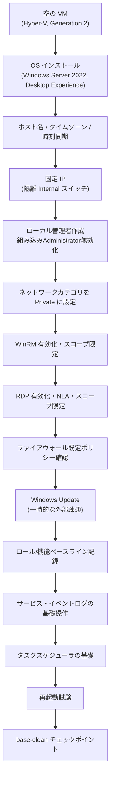

# 12 Windows Server 基礎構築演習設計：空の VM からの初期構築（LAB-WINBASE01）

> **本ドキュメントの位置付け**
>
> [01 学習環境の作り方 §6](./01-environment.md#6-windows-server-の学習環境任意)は、Windows Server の学習範囲として
> 「AD DS の構築、OU 設計、ユーザー作成、グループポリシーの基本、PowerShell での一括操作」を挙げ、それぞれ
> [Windows / AD 公開再現ラボ](../evidence/templates/windows-ad-lab.md)・[08 AD構築演習設計](./08-ad-exercise-design.md)・
> [06 シェルスクリプト演習設計](./06-shell-scripting-exercise-design.md)に具体化されています。
> **しかし、その手前にある「空の VM に Windows Server を導入し、ドメイン参加や役割追加の前提になる状態まで
> 初期構築する」という工程には、どの資料にも詳細設計がありません。**
> [windows-ad-lab.md §4.1](../evidence/templates/windows-ad-lab.md#4-greenfield-ad-ds--dns-forest-の構築)は
> 「hostname を設定済み・再起動済み・ラボ専用の private static IPv4 を設定済み」を**前提条件の箇条書き**として
> 挙げるだけで、その設定方法・確認コマンド・試験項目を持ちません。[07 Python 運用自動化演習設計 §3.1](./07-python-ops-automation-exercise-design.md#31-lab-winops1新規ホストの基本情報)が
> 用意する `LAB-WINOPS1` 作成スクリプトも、コメントに「実行後の OS インストールは Windows Server 評価版の
> GUI セットアップを手作業で進める（このスクリプトでは行わない）」と明記し、初期構築そのものは対象外にしています。
>
> これは、[05 Phase 1 演習設計](./05-phase1-exercise-design.md)が Linux 側で埋めた
> 「[STATUS.md](../../STATUS.md)の『空の VM に OS を入れるところからやっていない』」という穴と**同じ形の穴**が、
> Windows 側（[STATUS.md](../../STATUS.md)の「研修で触っている Windows Server / AD / AlmaLinux が portfolio に
> 出ていない」）にも存在することを意味します。本書は、05 が Linux（`lab-base01`）に対して行ったのと同じ密度
> （[03 構築工程の実務ドキュメント](./03-build-process.md)の様式：パラメータシート・構築手順書・試験項目書）で、
> Windows Server 版のテンプレートホスト `LAB-WINBASE01` に対してこれを行います。
>
> **既存資料との関係（重複させない）**: 本書が対象にするのは OS 導入からリモート管理・ファイアウォール・
> 基礎的なサービス／タスク運用までの**単体ホストの初期構築**のみです。AD DS への昇格・ドメイン参加は
> [windows-ad-lab.md](../evidence/templates/windows-ad-lab.md)、OU・GPO・パスワードポリシー・FSMO・
> システム状態バックアップは [08](./08-ad-exercise-design.md)、PowerShell 言語基礎からサービス・イベントログ・
> AD 操作の実務スクリプト化は [06](./06-shell-scripting-exercise-design.md)、Python による定型運用自動化は
> [07](./07-python-ops-automation-exercise-design.md) が扱う範囲であり、本書はそれらのどれとも重複しません
> （役割分担の一覧は[付録 B](#付録-b-本演習と既存資料の役割分担)）。本書が作る `LAB-WINBASE01` は、
> `ADLAB-DC1`（windows-ad-lab.md）・`LAB-WINOPS1`（07）とは**別の、独立したテンプレート演習用ホスト**であり、
> 両ホストを本書の手順で作り直すものではありません。
>
> **運用ルールとの関係**: 本リポジトリの「[新規設計を増やさない運用ルール](../evidence-capture-checklist.md#新規設計を増やさない運用ルール)」の対象は
> **server-monitor の改善設計 06 以降**です。本書は改善設計ではなく学習計画（[05](./05-phase1-exercise-design.md)〜
> [09](./09-zabbix-monitoring-exercise-design.md)と同じ位置付け）のため対象外です。
>
> **技術情報の裏取りについて**: この AI 支援セッションには Windows・Hyper-V・PowerShell の実行環境が無いため、
> 本書に書いたコマンド・レジストリキー・既定値・GUI の文言は**一つも実行して確認していません**。Microsoft の
> 公開ドキュメントの記載や、既存の Windows 系演習資料（windows-ad-lab.md・06・07・08）の記述との整合を根拠に
> 書いていますが、[09 Zabbix 監視基盤構築演習設計](./09-zabbix-monitoring-exercise-design.md)と同じく
> 「調べた範囲での判断」であり、**実施前に対象バージョンの公式ドキュメントで再確認してください**。
>
> 本ドキュメントは**設計であり、実施記録ではありません**。実施したら [8. 実施ステータス](#8-実施ステータスと次のアクション)を更新します。

最終更新: 2026-08-27

> **実施ステータス: 設計のみ・未実施**（2026-08-27 時点）。試験項目書の実測結果欄はすべて空欄です。

---

## 目次

| 節 | 内容 |
| --- | --- |
| [1](#1-演習の目的スコープ前提条件) | 目的・スコープ・前提条件 |
| [2](#2-要件と基本設計) | 要件と基本設計（なぜこの構成にするか） |
| [3](#3-パラメータシート) | パラメータシート（`LAB-WINBASE01` の設定値） |
| [4](#4-構築手順書) | 構築手順書（コマンド・想定結果・判定） |
| [5](#5-試験項目書) | 試験項目書（単体・結合・総合・異常系） |
| [6](#6-実施タイムテーブルと中断基準) | 実施タイムテーブルと中断基準 |
| [7](#7-証跡採録計画) | 証跡採録計画 |
| [8](#8-実施ステータスと次のアクション) | 実施ステータスと次のアクション |
| [付録 A](#付録-a-windows-server-基礎用語辞典) | Windows Server 基礎用語辞典（ワークグループ／ドメイン、Server Core、ネットワークプロファイル、WinRM、タスクスケジューラ） |
| [付録 B](#付録-b-本演習と既存資料の役割分担) | 本演習と既存資料の役割分担 |

---

## 1. 演習の目的・スコープ・前提条件

### 目的

[STATUS.md](../../STATUS.md)が挙げる「研修で触っている Windows Server / AD / AlmaLinux が portfolio に出ていない」
という穴のうち、Windows 側は現状 [LEARNINGS.md](../../LEARNINGS.md)の Hyper-V AD エントリ 1 件に留まっています。
[windows-ad-lab.md](../evidence/templates/windows-ad-lab.md)・[06](./06-shell-scripting-exercise-design.md)・
[07](./07-python-ops-automation-exercise-design.md)・[08](./08-ad-exercise-design.md)はいずれも詳細な設計を
持っていますが、**その全員が「OS は既に初期構築済み」という状態から始まっており**、初期構築そのものを
コマンド・想定結果・試験項目のレベルで扱った資料がありません。

本演習は、[05 Phase 1 演習設計](./05-phase1-exercise-design.md)が Linux の `lab-base01` に対して行ったことを、
Windows Server の `LAB-WINBASE01` に対して行います。空の VM 1 台に Windows Server 2022 評価版を導入し、
ホスト名・タイムゾーン・時刻同期・固定 IP・ローカル管理者・リモート管理（WinRM / RDP）・ファイアウォール・
Windows Update・ロールと機能のベースライン・サービスとイベントログの基礎操作・タスクスケジューラの基礎を、
コマンドと想定結果まで具体化することを目的とします。

完成後の成果物は、[01 学習環境 §6](./01-environment.md#6-windows-server-の学習環境任意)が Windows Server の
学習範囲として挙げる項目のうち、これまで抜け落ちていた「OS の初期構築」を埋めるものであり、
[windows-ad-lab.md §4.1](../evidence/templates/windows-ad-lab.md#4-greenfield-ad-ds--dns-forest-の構築)や
[07 §3.1](./07-python-ops-automation-exercise-design.md#31-lab-winops1新規ホストの基本情報)が前提条件として
箇条書きするだけだった状態を、実際に手を動かして再現できる手順書に変えます。

### スコープ

| 対象 | 扱い |
| --- | --- |
| Windows Server 評価版の導入（ISO 取得・SHA-256 確認・Desktop Experience の選択） | **対象**。[4.1](#41-作業前確認)〜[4.3](#43-os-インストール) |
| VM の作成（Hyper-V、専用の隔離 Internal スイッチ） | **対象**。[4.2](#42-vm-の作成hyper-v) |
| ホスト名・タイムゾーン・時刻同期 | **対象**。[4.4](#44-初期ログインホスト名タイムゾーン時刻同期) |
| 固定 IP の設定 | **対象**。[4.5](#45-固定-ip-の設定) |
| ローカル管理者の作成、組み込み Administrator / Guest の整理 | **対象**。[4.6](#46-ローカル管理者ユーザーと組み込みアカウントの整理) |
| WinRM（PowerShell リモーティング）の有効化とスコープ限定 | **対象**。[4.7](#47-リモート管理の有効化winrm) |
| リモートデスクトップ（RDP）の有効化と NLA・スコープ限定 | **対象**。[4.8](#48-リモートデスクトップの有効化) |
| Windows Defender ファイアウォールの既定ポリシー確認とラボセグメント限定の許可ルール | **対象**。[4.9](#49-ファイアウォール) |
| Windows Update の適用（一時的な外部疎通の追加・撤去を含む） | **対象**。[4.10](#410-windows-update-の適用) |
| ロール・機能のベースライン記録（`Get-WindowsFeature`） | **対象**。[4.11](#411-ロール機能ベースラインの記録)。**追加インストールは行わない** |
| 既定サービスの起動・停止とイベントログでの確認（基礎操作のみ） | **対象**。[4.12](#412-サービス操作とイベントログの確認) |
| タスクスケジューラの基礎（単純な定期タスク 1 本の登録・実行確認） | **対象**。[4.13](#413-タスクスケジューラの基礎) |
| 再起動試験・チェックポイント運用 | **対象**。[4.14](#414-再起動試験とチェックポイント取得) |
| AD DS への昇格・ドメイン参加 | **対象外**。[windows-ad-lab.md](../evidence/templates/windows-ad-lab.md)が扱う。`LAB-WINBASE01` はワークグループのまま維持する |
| OU 階層・AGDLP グループ戦略・GPO・パスワードポリシー（PSO）・FSMO・システム状態バックアップ | **対象外**。[08](./08-ad-exercise-design.md)が扱う。いずれもドメイン参加後の話であり、本書のスコープに含まれない |
| PowerShell の言語基礎、サービス・イベントログ・AD 操作の実務水準スクリプト化 | **対象外**。[06](./06-shell-scripting-exercise-design.md)が扱う。本書の[4.12](#412-サービス操作とイベントログの確認)・[4.13](#413-タスクスケジューラの基礎)は、その前提になる「素の cmdlet の挙動」を確認するだけに留める |
| Python による定型運用自動化（`routine.py` / `backup.py` / `check.py`） | **対象外**。[07](./07-python-ops-automation-exercise-design.md)が扱う |
| 追加ディスクの初期化・ボリューム管理（Linux の LVM に相当する Storage Spaces 等） | **対象外**。[02 W4](./02-curriculum.md#w4-ディスクファイルシステムシェルスクリプト)の Linux 版と同様、独立した演習として将来検討する（[今後の興味リスト](../roadmap/README.md)相当）。8 章のシステム状態バックアップ用の追加ディスクは [08 §4.9](./08-ad-exercise-design.md#49-追加ディスクとシステム状態バックアップ)が個別に扱う |
| IIS・ファイルサーバー等、具体的な役割の導入・運用 | **対象外**。本書は「役割を何も入れていないベースライン」を確認するところまでで止め、個々の役割は将来の演習に譲る |
| Server Core での構築 | **対象外**。本文は Desktop Experience を前提にする。Server Core との違いと選定理由は[2 章の決定事項](#決定事項選定と理由)、概念差は[付録 A](#付録-a-windows-server-基礎用語辞典)に記す |

### 前提条件

- [01 学習環境 §1〜2](./01-environment.md#1-用意するもの)（PC 要件・仮想化ソフト）を満たし、Hyper-V の役割・機能を
  有効化済みであること。本書の本文は**本人の実施環境である Hyper-V**を前提に書く（[05](./05-phase1-exercise-design.md)が
  VirtualBox を本文・Hyper-V を付録にしたのとは逆で、[windows-ad-lab.md](../evidence/templates/windows-ad-lab.md)・
  [06 windows-ps-kit](./windows-ps-kit/README.md)・[07 python-ops-kit](./python-ops-kit/README.md)・
  [08 ad-exercise-kit](./ad-exercise-kit/README.md)がいずれも Hyper-V 用スクリプトを持つことと揃える）
- Microsoft 評価版センターから Windows Server 2022 評価版 ISO を取得済みであること（180 日間無料、[01 学習環境 §1](./01-environment.md#1-用意するもの)）
- VM を 1 台、まっさらな状態（OS 未導入）で用意できること
- ホスト PC 側で PowerShell（Windows PowerShell 5.1 または PowerShell 7）を実行できること。本書のホスト PC 側コマンドは
  PowerShell の表記で統一する
- [07 §1 の隔離原則](./07-python-ops-automation-exercise-design.md#前提条件)（Windows ラボは Linux ラボと同一セグメントに
  置かない、外部への inbound・port forwarding・bridge を無効にする）と、[windows-ad-lab.md §3](../evidence/templates/windows-ad-lab.md#3-公開前の安全条件)の
  安全条件を踏襲する

### 想定所要時間

| 区分 | 時間 |
| --- | --- |
| 初回・構築（[4.1](#41-作業前確認)〜[4.14](#414-再起動試験とチェックポイント取得)。OS インストールを含む） | 3.5〜4.5 時間 |
| 初回・試験（[5 章](#5-試験項目書) T-01〜T-26。検証用セグメントの追加・撤去を含む） | 2〜2.5 時間。構築とは別セッションに分けてよい |
| 2 回目以降（手順書のみを見た再現性検証） | 2 時間以内 |

---

## 2. 要件と基本設計

### 非機能要件（学習ラボとしての最小要件）

| 項目 | 要件 | 理由 |
| --- | --- | --- |
| 可用性 | 単一 VM。冗長化なし | [05 の非機能要件](./05-phase1-exercise-design.md#2-要件と基本設計)と同じく、本演習は「1 台を正確に作れる」ことが目的 |
| セキュリティ | 組み込み Administrator を無効化し名前付き管理者で運用、WinRM/RDP はラボセグメントに限定、恒久的な外部インターネット接続を持たない | Linux 側の「root ログイン禁止・鍵認証のみ・SSH 許可元を限定」（[05](./05-phase1-exercise-design.md#2-要件と基本設計)）と同じ考え方を Windows に適用する |
| 再現性 | 手順書のみで、まっさらな VM から半日以内に再構築できる | [03 構築手順書の原則](./03-build-process.md#3-構築手順書) |
| 永続性 | 再起動後に全設定（ホスト名・固定 IP・ファイアウォール・WinRM/RDP・タスク登録）が保持される | [試験項目書](#5-試験項目書) T-17 で確認する |
| 隔離 | Windows ラボは Linux ラボ（`192.168.56.0/24`）や他の Windows ラボ（`ADLAB` / `LAB-WINOPS1`）と同一セグメントに置かない | [07 §1 の隔離原則](./07-python-ops-automation-exercise-design.md#前提条件)をそのまま踏襲し、新しい例外を作らない |

### 基本設計（構成と選定理由）

図の要約：空の VM から OS 導入 → ホスト名・時刻設定 → 固定 IP → ローカル管理者の整備 → ネットワークカテゴリの明示 →
WinRM → RDP → ファイアウォール確認 → Windows Update → ロール/機能のベースライン記録 → サービス・イベントログの
基礎操作 → タスクスケジューラの基礎 → 再起動試験 → チェックポイント取得、の順に進む。**F（ネットワークカテゴリ）を
G（WinRM 有効化）より先に行う**のは、[決定事項](#決定事項選定と理由)のとおり、これを飛ばすと「有効化したのに
繋がらない」という典型的な詰まりを生むためである。

### 決定事項（選定と理由）

| 決定事項 | 選定 | 理由・比較した選択肢 |
| --- | --- | --- |
| バージョン・エディション・インストールオプション | Windows Server 2022 Standard 評価版、**Desktop Experience**（GUI あり） | [07 の `LAB-WINOPS1`](./07-python-ops-automation-exercise-design.md#31-lab-winops1新規ホストの基本情報)と同じバージョンに揃え、ラボ間の前提の食い違いを避ける。Desktop Experience を選ぶのは、初学者にとって Server Manager の GUI が最初の詰まりを減らすためであり、[01 学習環境](./01-environment.md)全体が「迷わないように選択肢を絞る」方針と一致する。**Server Core** は本番でよく使われる構成だが、GUI なしでの操作に習熟してからの方が学習効率が良いと判断し、本書のスコープ外にした（[付録 A](#付録-a-windows-server-基礎用語辞典)で概念差のみ補足） |
| 仮想化基盤 | Hyper-V | [05](./05-phase1-exercise-design.md#前提条件)が明らかにした「本人の実施環境は Hyper-V」に加え、既存の Windows 系実施キット（[ad-exercise-kit](./ad-exercise-kit/README.md)・[python-ops-kit](./python-ops-kit/README.md)）がいずれも Hyper-V 用 PowerShell スクリプトのため、Windows 側は Hyper-V を本文の標準にする（[01 学習環境](./01-environment.md)が既定とする VirtualBox は Linux 側（05）の主環境のまま変えない） |
| ネットワークセグメント | 専用の Internal スイッチ `lab-winbase-internal`、`192.168.60.0/24`、恒久的な外部接続なし | [07 §1 の隔離原則](./07-python-ops-automation-exercise-design.md#前提条件)を踏襲し、Linux ラボ（`192.168.56.0/24`、[01 学習環境](./01-environment.md#命名と-ip-の割り当て規則)）や[05 付録 A-3 の検証用セグメント](./05-phase1-exercise-design.md#a-3-検証用セグメントの一時追加p-1p-7-の代替)（`192.168.57.0/24`）と衝突しない新しいオクテットを採番する。`ADLAB`・`LAB-WINOPS1` のセグメントは各資料で具体的な IP を固定していないため、それらとの衝突可能性も排除できる |
| ローカル管理者戦略 | 名前付きローカル管理者 `opsadmin` を新設し、組み込み `Administrator` は改名のうえ無効化する | Linux 側の「`root` の直接ログインを禁止し、`sudo` 経由の名前付きユーザー `opsadmin` で運用する」（[05](./05-phase1-exercise-design.md#3-パラメータシート)）と同じ考え方を Windows に適用し、ユーザー名も意図的に揃える。組み込みアカウントを無効化まで行うのは、改名だけでは SID ベースの照会で依然として特定できるため（[付録 A](#付録-a-windows-server-基礎用語辞典)） |
| リモート管理方式 | **WinRM**（HTTP + `TrustedHosts`、ラボセグメント限定）を主、**RDP**（NLA 必須、ラボセグメント限定）を副として両方有効化する | WinRM は PowerShell リモーティングの標準基盤であり、複数ホストにまたがる一括管理・監視など将来の演習に備えた汎用インフラとして有効化する。現時点で設計済みの [06](./06-shell-scripting-exercise-design.md)・[07](./07-python-ops-automation-exercise-design.md)・[08](./08-ad-exercise-design.md#46-gpo-のリンクとクライアント側の適用確認)はいずれも対象ホスト自身のローカルコンソール上で完結しており WinRM 経由のリモート実行を前提にしていない（07 は複数ホストをまたぐリモート一括実行を明示的に対象外としている）が、Windows Server の基礎として PSRemoting を正しく構成・スコープ限定できることの確認自体に価値がある。RDP は[志望トラック](../target-roles.md)の補助トラック（IT サポート・社内 SE 補助）の実務で使用頻度が高いため併設する。HTTPS 化・証明書運用は基礎の範囲を超えるため対象外にし、[付録 A](#付録-a-windows-server-基礎用語辞典)に将来課題として記す |
| ネットワークカテゴリ | 隔離 Internal スイッチの NIC を明示的に **Private** に設定する | 未識別のネットワークは既定で **Public** に分類される。Windows Server では `Enable-PSRemoting` は Public プロファイル向けにもファイアウォール規則を作成するが、その `RemoteAddress` は既定で「同一ローカルサブネット」に限定される（`-SkipNetworkProfileCheck` はサーバー版には影響しない）。本ラボはホスト PC（`192.168.60.1`）と VM（`192.168.60.10`）が同一サブネットにあるため、この既定規則だけで接続できてしまう可能性があるが、その暗黙の制約に依存せず意図を明示するため、[4.7](#47-リモート管理の有効化winrm)の先頭でカテゴリを明示する（[05 の netplan/cloud-init 順序](./05-phase1-exercise-design.md#3-5-固定-ip-の設定)や[06 の UTF-8 BOM 問題](../../STATUS.md)と同種の「知らないと見落とす」落とし穴） |
| ファイアウォールの既定方針 | Windows Defender ファイアウォールは**既定で有効・既定で受信拒否**のまま変更せず、WinRM と RDP の 2 つの受信許可だけをラボセグメントへ限定して追加する | Ubuntu の `ufw` は既定で無効なため[05](./05-phase1-exercise-design.md#3-9-ファイアウォール)で明示的に有効化するが、Windows Server は既定で有効・既定でブロックのため、本書では「既定を変えない」判断そのものが確認事項になる。許可ルールを最小 2 本に絞るのは[05 の「22/tcp のみ許可」](./05-phase1-exercise-design.md#3-パラメータシート)と同じ最小権限の考え方 |
| Windows Update の運用 | 恒久的なインターネット接続は持たず、更新作業の間だけ外部スイッチを一時的に追加し、完了後に外す | [windows-ad-lab.md §3](../evidence/templates/windows-ad-lab.md#3-公開前の安全条件)（「internet 接続が必要な更新時だけ NAT を一時追加し、検証前に外した」）・07 の [`03-enable-external-nat.ps1`](./python-ops-kit/hyperv/03-enable-external-nat.ps1)/[`04-disable-external-nat.ps1`](./python-ops-kit/hyperv/04-disable-external-nat.ps1)と同じ運用を踏襲し、Windows ラボ全体で例外を増やさない |
| ロール・機能の扱い | 新規のロール・機能は一切追加せず、`Get-WindowsFeature` によるベースライン記録のみ行う | AD DS/DNS は [windows-ad-lab.md](../evidence/templates/windows-ad-lab.md)、IIS・ファイルサーバー等は将来の演習が扱うべき範囲であり、本書が兼務すると「基礎」の輪郭がぼやける |
| サービス／イベントログ演習の対象 | 実在する既定サービス（Print Spooler）を使った、起動・停止・診断の基礎操作に限定する | [06 §4.3 演習 B・演習 C](./06-shell-scripting-exercise-design.md#4-windowspowershell演習設計)が同じ題材（`Get-Service`／`*-EventLog`）を実務水準までスクリプト化しており、重複を避けるため本書は「素の cmdlet の挙動を手で確認する」段階に留める |
| タスクスケジューラ演習の対象 | 単純な日次ハートビート記録タスク 1 本の登録・実行確認に限定する | [06 演習 C フラッグシップ `Invoke-EnvironmentCheck.ps1` の日次登録](./06-shell-scripting-exercise-design.md#演習-cフラッグシップ-invoke-environmentcheckps1)と重複させないため、本書はタスクスケジューラという機構そのものの基礎操作（アクション・トリガー・実行結果の確認）だけを扱う |

---

## 3. パラメータシート

[03 構築工程の実務ドキュメント §2](./03-build-process.md#2-パラメータシート)の様式に、`LAB-WINBASE01` の実値を入れたもの。

### 基本情報

| 項目 | 値 |
| --- | --- |
| ホスト名 | `LAB-WINBASE01` |
| 役割 | Windows Server 基礎構築テンプレート（`ADLAB-DC1`・`LAB-WINOPS1` とは別の独立ホスト） |
| 環境区分 | 検証（個人学習ラボ） |
| 設置場所 | ローカル仮想環境（Hyper-V） |
| 用途・備考 | [01 学習環境 §6](./01-environment.md#6-windows-server-の学習環境任意)が学習範囲に挙げる Windows Server 学習の起点。他の Windows 演習（windows-ad-lab.md・06・07・08）はそれぞれ別ホストを新規に用意する前提のため、本ホストを直接引き継ぐものではない |

### ハードウェア・仮想マシン

| 項目 | 値 |
| --- | --- |
| 世代（Generation） | 2（UEFI） |
| vCPU | 2 |
| メモリ | 4 GB（起動時メモリ固定。動的メモリは無効） |
| ディスク構成 | 40 GB（単一 VHDX、可変サイズ） |
| 仮想化基盤 | Hyper-V |
| NIC 枚数 | 1（隔離 Internal スイッチ `lab-winbase-internal` のみ）。[4.10](#410-windows-update-の適用)の Windows Update 適用時のみ、外部疎通用のアダプタを一時的に追加し、完了後に撤去する |

> vCPU/メモリ/ディスクの値は [01 学習環境 §6](./01-environment.md#6-windows-server-の学習環境任意)が
> Windows Server の学習環境として既に定めている値（vCPU 2 / メモリ 4 GB / ディスク 40 GB）とそのまま揃えている。

### OS

| 項目 | 値 |
| --- | --- |
| OS / バージョン | Windows Server 2022 Standard（評価版、180 日間） |
| インストールオプション | Desktop Experience |
| タイムゾーン | `Tokyo Standard Time` |
| 時刻同期 | Windows Time サービス（`W32Time`）、ワークグループ既定のピア `time.windows.com` |
| セキュアブート テンプレート | `MicrosoftWindows`（既定のまま。Linux ゲストのように変更不要） |
| Windows Update | 一時的な外部疎通時のみ手動適用（[4.10](#410-windows-update-の適用)）。恒久的な自動更新は設定しない（[2 章の決定事項](#決定事項選定と理由)） |

### ネットワーク

| 項目 | 値 |
| --- | --- |
| 仮想スイッチ | `lab-winbase-internal`（Internal、Hyper-V ホストとのみ通信可、外部への接続なし） |
| VM 側 IP | `192.168.60.10/24` 固定 |
| ホスト PC 側 IP（`vEthernet (lab-winbase-internal)`） | `192.168.60.1/24` |
| デフォルトゲートウェイ | 設定しない（隔離セグメントのため不要） |
| DNS サーバー | 設定しない（ワークグループの単一ホストであり、この時点では名前解決の相手先がない） |
| ネットワークカテゴリ | Private（[2 章の決定事項](#決定事項選定と理由)） |
| 開放ポート（受信） | `5985/tcp`（WinRM/HTTP）・`3389/tcp`（RDP）のみ、いずれも送信元を `192.168.60.0/24` に限定 |

### ユーザー・権限

| 項目 | 値 |
| --- | --- |
| 作業用ローカル管理者 | `opsadmin`（Administrators グループに所属） |
| 組み込み `Administrator` | 改名（`legacy-admin-disabled`）のうえ無効化 |
| 組み込み `Guest` | 無効（既定のまま。確認のみ） |
| 認証方式 | ローカルアカウントのパスワード認証（ワークグループのためドメイン認証は使わない） |

### リモート管理

| 項目 | 値 |
| --- | --- |
| WinRM リスナー | HTTP（`5985/tcp`）。`Enable-PSRemoting` で作成される既定リスナー |
| ホスト PC 側 `TrustedHosts` | `192.168.60.10`（ワイルドカードは使わない） |
| RDP | 有効、NLA（ネットワークレベル認証）必須 |
| リモート接続を許可するアカウント | `opsadmin`（Administrators グループのメンバーは既定で RDP 接続可） |

### ファイアウォール（Windows Defender ファイアウォール）

| プロファイル | 既定の受信ポリシー | 追加した許可ルール |
| --- | --- | --- |
| ドメイン | ブロック（既定のまま。ワークグループのため実質未使用） | なし |
| プライベート | ブロック（既定のまま） | `WINRM-HTTP-In-TCP`・`Remote Desktop - User Mode (TCP-In)` を `192.168.60.0/24` に限定して有効化 |
| パブリック | ブロック（既定のまま） | 追加なし。ただし `Enable-PSRemoting`（[4.7-2](#47-リモート管理の有効化winrm)）が同一ローカルサブネット限定の WinRM 許可規則を自動作成するため、明示的に追加した規則ではない点に注意（[2 章の決定事項](#決定事項選定と理由)） |

### ロール・機能ベースライン

| 項目 | 値 |
| --- | --- |
| 追加インストールしたロール・機能 | なし（本書のスコープ外。[2 章の決定事項](#決定事項選定と理由)） |
| ベースライン記録方法 | `Get-WindowsFeature \| Where-Object InstallState -eq Installed` の出力を [4.11](#411-ロール機能ベースラインの記録)で記録し、以後の演習（windows-ad-lab.md 等）で追加された分と区別できるようにする |

### タスクスケジューラ

| 項目 | 値 |
| --- | --- |
| タスク名 | `LabHeartbeat` |
| トリガー | 毎日 03:00 |
| アクション | `powershell.exe -NoProfile -Command "Get-Date \| Out-File C:\ops\heartbeat.log -Append"` |
| 実行アカウント | `opsadmin`（`-RunLevel Highest`） |
| 出力先 | `C:\ops\heartbeat.log` |

### ログ

| 項目 | 値 |
| --- | --- |
| ログ出力先 | イベントビューアー（`Application` / `System` ログ）、`Get-WinEvent` で参照 |
| 監視・バックアップ | この演習では対象外。Hyper-V チェックポイント（`base-clean`・異常系着手前の `before-drill`）を取得 |

---

## 4. 構築手順書

[03 構築工程の実務ドキュメント §3](./03-build-process.md#3-構築手順書)の構成・書式に従う。特記のない限り、
すべて `LAB-WINBASE01` 上の管理者 PowerShell（Hyper-V マネージャーの「接続」から開くコンソール）で実行する。
ホスト PC 側で実行するものは明記する。

### 4.1 作業前確認

| No | 確認内容 | コマンド / 操作 | 想定結果 |
| --- | --- | --- | --- |
| 4.1-1 | Hyper-V ホスト側に同名の VM・スイッチが無いこと | ホスト PC で `Get-VM -Name LAB-WINBASE01 -ErrorAction SilentlyContinue`、`Get-VMSwitch -Name lab-winbase-internal -ErrorAction SilentlyContinue` | どちらも結果が返らない |
| 4.1-2 | ISO の取得と SHA-256 の記録 | Microsoft 評価版センターのダウンロード確認画面に表示される SHA-256 をその場で控える（Ubuntu の `SHA256SUMS` のような恒久的な公開ファイルではないため、ダウンロード時に控え損なうと後から入手できない）。ホスト PC で `Get-FileHash .\WindowsServer2022.iso -Algorithm SHA256` | 控えた値と一致する |
| 4.1-3 | ホスト PC の Hyper-V 有効化確認 | `Get-WindowsOptionalFeature -Online -FeatureName Microsoft-Hyper-V-All \| Select-Object State` | `Enabled` |

### 4.2 VM の作成（Hyper-V）

すべてホスト PC 側の管理者 PowerShell で実行する。

| No | 作業内容 | コマンド | 想定結果 | 判定 |
| --- | --- | --- | --- | --- |
| 4.2-1 | 隔離 Internal スイッチの作成 | `New-VMSwitch -SwitchName lab-winbase-internal -SwitchType Internal` | スイッチが作成される | `Get-VMSwitch -Name lab-winbase-internal` が成功する |
| 4.2-2 | ホスト側 IP の付与 | `New-NetIPAddress -InterfaceAlias "vEthernet (lab-winbase-internal)" -IPAddress 192.168.60.1 -PrefixLength 24` | アドレスが返る | `Get-NetIPAddress -InterfaceAlias "vEthernet (lab-winbase-internal)"` に `192.168.60.1/24` |
| 4.2-3 | VM 作成 | `New-VM -Name LAB-WINBASE01 -Generation 2 -MemoryStartupBytes 4GB -NewVHDPath "D:\HyperV\LAB-WINBASE01\LAB-WINBASE01.vhdx" -NewVHDSizeBytes 40GB` | VM が作成される | `Get-VM -Name LAB-WINBASE01` が成功する |
| 4.2-4 | vCPU 数の設定 | `Set-VMProcessor LAB-WINBASE01 -Count 2` | 出力なし | `(Get-VMProcessor LAB-WINBASE01).Count` が `2` |
| 4.2-5 | 動的メモリの無効化 | `Set-VMMemory LAB-WINBASE01 -DynamicMemoryEnabled $false` | 出力なし | `(Get-VMMemory LAB-WINBASE01).DynamicMemoryEnabled` が `False` |
| 4.2-6 | セキュアブート テンプレート確認 | `Set-VMFirmware LAB-WINBASE01 -SecureBootTemplate MicrosoftWindows` | 出力なし | `(Get-VMFirmware LAB-WINBASE01).SecureBoot` が `On` |
| 4.2-7 | ISO のマウント | `Add-VMDvdDrive LAB-WINBASE01 -Path "C:\ISO\WindowsServer2022.iso"` | DVD ドライブが追加される | `Get-VMDvdDrive LAB-WINBASE01` が ISO パスを表示する |
| 4.2-8 | NIC を隔離スイッチのみに接続 | `Get-VMNetworkAdapter -VMName LAB-WINBASE01 \| Connect-VMNetworkAdapter -SwitchName lab-winbase-internal` | 出力なし | `Get-VMNetworkAdapter -VMName LAB-WINBASE01` の `SwitchName` が `lab-winbase-internal` |
| 4.2-9 | 起動順の確認 | `Get-VMFirmware LAB-WINBASE01 \| Select-Object -ExpandProperty BootOrder` | DVD ドライブが優先される順序 | ISO から起動できる順序になっている |

### 4.3 OS インストール

| No | 作業内容 | 操作 | 想定結果 | 判定 |
| --- | --- | --- | --- | --- |
| 4.3-1 | VM 起動とセットアップ開始 | Hyper-V マネージャーで `LAB-WINBASE01` を起動し「接続」 | Windows セットアップの言語選択画面が表示される | 画面が表示される |
| 4.3-2 | エディション選択 | 「**Windows Server 2022 Standard Evaluation (Desktop Experience)**」を選択（Server Core 版と間違えない） | 選択できる | 選択したオプション名を控える（[作業後確認](#作業後確認)で使う） |
| 4.3-3 | インストール種類・ディスク | 「カスタム: Windows のみをインストールする」を選び、未初期化のディスクへインストール | パーティションが自動作成される | インストールが進行する |
| 4.3-4 | 初回サインインパスワード設定 | 再起動後、組み込み `Administrator` の初期パスワードを設定する | サインイン画面が表示される | サインインできる |

> **4.3-2 の注意（Linux 版との違い）**: Ubuntu Server のインストーラは対話式にユーザーを作成できる
> （[05 の 3-3](./05-phase1-exercise-design.md#3-13-3-vm-作成と-os-インストールgui--tui-操作)）が、Windows Server の
> セットアップにはユーザー作成の画面が無く、**組み込み `Administrator` のパスワードを設定する**画面しかない。
> 名前付きの `opsadmin` は [4.6](#46-ローカル管理者ユーザーと組み込みアカウントの整理)で改めて作成する。
>
> **4.3-2 の注意（一方向の選択）**: Desktop Experience と Server Core はセットアップ時に選ぶオプションであり、
> インストール後に相互変換できるかどうかはバージョンやサポート方針によって扱いが変わる（[付録 A](#付録-a-windows-server-基礎用語辞典)）。
> 選び直したい場合は作り直すのが確実なため、[4.1-1](#41-作業前確認)のチェックポイント以前の状態であることを
> 確認してから選び直す。

### 4.4 初期ログイン・ホスト名・タイムゾーン・時刻同期

| No | 作業内容 | コマンド | 想定結果 | 判定 |
| --- | --- | --- | --- | --- |
| 4.4-1 | ホスト名変更 | `Rename-Computer -NewName LAB-WINBASE01 -Restart` | VM が再起動する | 再起動後 `(Get-CimInstance Win32_ComputerSystem).Name` が `LAB-WINBASE01` |
| 4.4-2 | タイムゾーン設定 | `Set-TimeZone -Id "Tokyo Standard Time"` | 出力なし | `(Get-TimeZone).Id` が `Tokyo Standard Time` |
| 4.4-3 | 時刻同期状態の確認（未同期であることの確認） | `w32tm /query /status` | この時点では隔離 Internal スイッチのみで DNS・ゲートウェイとも未設定のため `time.windows.com` に到達できず、`Source: Local CMOS Clock` 相当の未同期表示になる | `time.windows.com` への同期が**まだ成立していない**ことを確認する（実際の同期成功確認は [4.10](#410-windows-update-の適用)の一時的な外部疎通時に行う） |
| 4.4-4 | 手動同期の試行（失敗の確認） | `w32tm /resync /force` | 外部到達性が無いため失敗する（例:「このコンピューターは、使用できる時刻データがなかったため、再同期されませんでした。」） | 想定内の失敗であることを確認し、次工程へ進む |

> **4.4-1 の注意（Linux 版との違い）**: `hostnamectl set-hostname` は再起動不要で即時反映されるが（[05 の 3-4-1](./05-phase1-exercise-design.md#3-4-初期ログインとホスト名時刻設定)）、
> Windows の `Rename-Computer` は**再起動するまで反映されない**。
>
> **4.4-3 の注意（ドメイン参加後との違い）**: ワークグループの既定ピアは `time.windows.com` だが、
> [windows-ad-lab.md](../evidence/templates/windows-ad-lab.md)の手順でドメインに参加すると、Windows Time
> サービスは自動的にドメイン階層（`NT5DS`、通常は PDC エミュレータを頂点とする）へ同期先を切り替える
> （[08 付録 A の PDC エミュレータ](./08-ad-exercise-design.md#付録-a-ad-基礎用語辞典)を参照）。本書はワークグループのままのため、この切り替えは対象外。

### 4.5 固定 IP の設定

| No | 作業内容 | コマンド | 想定結果 | 判定 |
| --- | --- | --- | --- | --- |
| 4.5-1 | インターフェース名の確認 | `Get-NetAdapter` | `Ethernet` という名前の 1 枚が `Up` | 実際の名前を控える（以下 `Ethernet` と表記） |
| 4.5-2 | 固定 IP の付与 | `New-NetIPAddress -InterfaceAlias "Ethernet" -IPAddress 192.168.60.10 -PrefixLength 24` | アドレスが返る | `Get-NetIPAddress -InterfaceAlias "Ethernet" -AddressFamily IPv4` に `192.168.60.10/24` |
| 4.5-3 | DNS を設定しないことの確認 | `Get-DnsClientServerAddress -InterfaceAlias "Ethernet" -AddressFamily IPv4` | `ServerAddresses` が空 | [2 章の決定事項](#決定事項選定と理由)どおり未設定のまま |

### 4.6 ローカル管理者ユーザーと組み込みアカウントの整理

| No | 作業内容 | コマンド | 想定結果 | 判定 |
| --- | --- | --- | --- | --- |
| 4.6-1 | ローカル管理者の作成 | `New-LocalUser -Name "opsadmin" -Password (Read-Host -AsSecureString "opsadmin の初期パスワードを入力") -FullName "Ops Admin" -PasswordNeverExpires:$false` | ユーザーが作成される | `Get-LocalUser -Name opsadmin` が成功する |
| 4.6-2 | Administrators への追加 | `Add-LocalGroupMember -Group "Administrators" -Member "opsadmin"` | 出力なし | `Get-LocalGroupMember -Group "Administrators"` に `opsadmin` が表示される |
| 4.6-3 | **`opsadmin` でのサインイン確認（重要・必須）** | サインアウトし `opsadmin` でサインインできることを確認する | サインインできる | 別セッションで確認してから次へ進む |
| 4.6-4 | 組み込み `Administrator` の改名 | `Rename-LocalUser -Name "Administrator" -NewName "legacy-admin-disabled"` | 出力なし | `Get-LocalUser -Name "legacy-admin-disabled"` が成功する |
| 4.6-5 | 組み込み `Administrator`（改名後）の無効化 | `Disable-LocalUser -Name "legacy-admin-disabled"` | 出力なし | `(Get-LocalUser -Name "legacy-admin-disabled").Enabled` が `False` |
| 4.6-6 | `Guest` の既定確認 | `Get-LocalUser -Name "Guest"` | 導入時から `Enabled: False` | 変更不要。既定のまま無効であることの確認のみ |

> **ここで組み込み `Administrator` を無効化する前に、必ず `opsadmin` でのサインインを確認する。**
> [05 の 3-7 の注意](./05-phase1-exercise-design.md#3-7-ssh-公開鍵の登録と鍵ログイン確認パスワード認証を禁止する前に実施)と同じ理由で、
> 先に無効化すると自分が締め出される。

### 4.7 リモート管理の有効化（WinRM）

| No | 作業内容 | コマンド | 想定結果 | 判定 |
| --- | --- | --- | --- | --- |
| 4.7-1 | **ネットワークカテゴリを Private に設定（必須・最初に行う）** | `Set-NetConnectionProfile -InterfaceAlias "Ethernet" -NetworkCategory Private` | 出力なし | `(Get-NetConnectionProfile -InterfaceAlias "Ethernet").NetworkCategory` が `Private` |
| 4.7-2 | WinRM の有効化 | `Enable-PSRemoting -Force` | リスナー作成・ファイアウォール規則有効化のメッセージ | エラーなく完了する |
| 4.7-3 | リスナーの確認 | `Get-ChildItem WSMan:\localhost\Listener` | `Transport = HTTP` のリスナーが 1 件 | 表示される |
| 4.7-4 | WinRM ファイアウォール規則のスコープ限定 | `Set-NetFirewallRule -Name "WINRM-HTTP-In-TCP" -RemoteAddress 192.168.60.0/24` | 出力なし | `(Get-NetFirewallRule -Name "WINRM-HTTP-In-TCP" \| Get-NetFirewallAddressFilter).RemoteAddress` が `192.168.60.0/24` |
| 4.7-5 | ホスト PC 側 `TrustedHosts` の設定（ホスト PC 側で実行） | `Set-Item WSMan:\localhost\Client\TrustedHosts -Value "192.168.60.10" -Force` | 出力なし | `Get-Item WSMan:\localhost\Client\TrustedHosts` の `Value` が `192.168.60.10` |
| 4.7-6 | 疎通確認（ホスト PC 側） | `Test-WSMan -ComputerName 192.168.60.10` | `wsmid` を含む応答 | エラーなく返る |
| 4.7-7 | **リモートセッションの動作確認（重要・必須）（ホスト PC 側）** | `Enter-PSSession -ComputerName 192.168.60.10 -Credential (Get-Credential opsadmin)` | プロンプトが `[192.168.60.10]: PS ...` に変わる | 別セッションで成功を確認してから次へ進む |

> **4.7-1 の注意**: Windows Server では `Enable-PSRemoting` はネットワークカテゴリが **Public**（未識別ネット
> ワークの既定値）のままでもファイアウォール規則自体は作成するが、`RemoteAddress` が同一ローカルサブネットに
> 限定される。隔離 Internal スイッチはホスト PC・VM とも同一サブネット（`192.168.60.0/24`）にあるため、この
> 既定規則だけで接続できてしまう場合がある。本書ではその暗黙の挙動に依存せず、カテゴリを明示的に Private に
> してから WinRM を有効化する（[2 章の決定事項](#決定事項選定と理由)）。

### 4.8 リモートデスクトップの有効化

| No | 作業内容 | コマンド | 想定結果 | 判定 |
| --- | --- | --- | --- | --- |
| 4.8-1 | RDP の有効化 | `Set-ItemProperty -Path 'HKLM:\System\CurrentControlSet\Control\Terminal Server' -Name "fDenyTSConnections" -Value 0` | 出力なし | 同キーの値が `0` |
| 4.8-2 | NLA の要求 | `(Get-WmiObject -Class "Win32_TSGeneralSetting" -Namespace root\cimv2\terminalservices -Filter "TerminalName='RDP-tcp'").SetUserAuthenticationRequired(1)` | 戻り値 `ReturnValue: 0` | 成功 |
| 4.8-3 | RDP ファイアウォール規則の有効化 | `Enable-NetFirewallRule -Name "RemoteDesktop-UserMode-In-TCP"` | 出力なし | `Get-NetFirewallRule -Name "RemoteDesktop-UserMode-In-TCP" -Enabled True` が 1 件表示される |
| 4.8-4 | RDP ファイアウォール規則のスコープ限定 | `Set-NetFirewallRule -Name "RemoteDesktop-UserMode-In-TCP" -RemoteAddress 192.168.60.0/24` | 出力なし | `(Get-NetFirewallRule -Name "RemoteDesktop-UserMode-In-TCP" \| Get-NetFirewallAddressFilter).RemoteAddress` が `192.168.60.0/24` |
| 4.8-5 | **RDP 接続確認（ホスト PC 側）** | `mstsc /v:192.168.60.10` を起動し `opsadmin` で接続 | NLA 認証後に接続できる | デスクトップが表示される |

### 4.9 ファイアウォール

| No | 確認内容 | コマンド | 想定結果 | 判定 |
| --- | --- | --- | --- | --- |
| 4.9-1 | 全プロファイルが既定で有効・受信ブロックのままであることの確認 | `Get-NetFirewallProfile \| Select-Object Name, Enabled, DefaultInboundAction, DefaultOutboundAction` | 3 プロファイルとも `Enabled: True`、`DefaultInboundAction: Block`、`DefaultOutboundAction: Allow` | Ubuntu の `ufw`（既定で無効）とは逆に、変更せずこの状態を維持する |
| 4.9-2 | 有効な受信許可ルールが最小限であることの確認 | `Get-NetFirewallRule -Direction Inbound -Enabled True -Action Allow \| Where-Object { $_.DisplayGroup -in @("Windows Remote Management","Remote Desktop") } \| Select-Object DisplayName, Profile` | WinRM・RDP に対応するルールのみ表示される | [3 章のパラメータシート](#3-パラメータシート)と一致 |

### 4.10 Windows Update の適用

| No | 作業内容 | コマンド / 操作 | 想定結果 | 判定 |
| --- | --- | --- | --- | --- |
| 4.10-1 | 一時的な外部疎通の追加（ホスト PC 側） | 既存の External スイッチ（または `Default Switch`）を確認し、`Add-VMNetworkAdapter -VMName LAB-WINBASE01 -SwitchName "Default Switch" -Name "temp-update-nic"` | アダプタが追加される | `Get-VMNetworkAdapter -VMName LAB-WINBASE01` に 2 枚目が表示される |
| 4.10-2 | 疎通確認 | `Test-NetConnection www.microsoft.com -Port 443` | `TcpTestSucceeded: True` | 到達できる |
| 4.10-2b | 時刻同期の確認（外部疎通時。[4.4-3/4.4-4](#44-初期ログインホスト名タイムゾーン時刻同期)の未同期状態を解消する） | `w32tm /resync /force` に続けて `w32tm /query /status` | `コマンドは正常に完了しました。`、`Source: time.windows.com` を含む出力 | `time.windows.com` への同期成功を確認する（[4.10-5](#410-windows-update-の適用)で外部アダプタを撤去する前に実施） |
| 4.10-3 | 更新の確認と適用 | 設定アプリの「Windows Update」から「更新プログラムのチェック」を実行し、提示された更新をすべて適用する | 更新が適用される（再起動を伴う場合あり） | 完了メッセージが表示される |
| 4.10-4 | 適用結果の確認 | `Get-HotFix \| Sort-Object InstalledOn -Descending \| Select-Object -First 10` に加え、`winver` またはレジストリの `UBR`（`(Get-ItemProperty 'HKLM:\SOFTWARE\Microsoft\Windows NT\CurrentVersion').UBR`）でビルド番号を確認する | 直近の更新が一覧表示される（`Get-HotFix` は `Win32_QuickFixEngineering` を参照するため、Windows Update サイト経由で配信される更新、特に累積更新プログラムは表示されないことがある点に注意） | `UBR` が更新されている、または設定アプリの「更新の履歴」に 4.10-3 で適用した更新が記載されている |
| 4.10-5 | 外部アダプタの撤去（ホスト PC 側） | `Remove-VMNetworkAdapter -VMName LAB-WINBASE01 -Name "temp-update-nic"` | 出力なし | `Get-VMNetworkAdapter -VMName LAB-WINBASE01` に隔離スイッチの 1 枚だけが残る |
| 4.10-6 | 隔離状態の復帰確認 | `Test-NetConnection www.microsoft.com -Port 443` | 失敗する（到達不能） | 恒久的な外部接続を持たない状態に戻っている |

### 4.11 ロール・機能ベースラインの記録

| No | 作業内容 | コマンド | 想定結果 | 判定 |
| --- | --- | --- | --- | --- |
| 4.11-1 | 導入済みロール・機能の記録 | `Get-WindowsFeature \| Where-Object InstallState -eq "Installed" \| Select-Object Name, DisplayName` | ベースOS標準の機能のみが表示される（AD DS・DNS・IIS 等は含まれない） | 出力をそのまま記録し、以後の演習との差分比較に使う |

### 4.12 サービス操作とイベントログの確認

| No | 作業内容 | コマンド | 想定結果 | 判定 |
| --- | --- | --- | --- | --- |
| 4.12-1 | サービス稼働状況のベースライン | `Get-Service \| Where-Object Status -eq "Running" \| Measure-Object \| Select-Object -ExpandProperty Count` | 数値が表示される | 記録のみ |
| 4.12-2 | 対象サービスの状態確認 | `Get-Service -Name Spooler` | `Status: Running` | 稼働中 |
| 4.12-3 | サービスの再起動 | `Restart-Service -Name Spooler -Force` | 出力なし | `(Get-Service -Name Spooler).Status` が `Running` |
| 4.12-4 | イベントログでの確認 | `Get-WinEvent -LogName System -MaxEvents 20 \| Where-Object { $_.ProviderName -eq "Service Control Manager" -and $_.Message -like "*Spooler*" }` | Spooler の停止・開始に対応するイベントが記録されている | 直近のイベントに再起動の記録がある |

### 4.13 タスクスケジューラの基礎

| No | 作業内容 | コマンド | 想定結果 | 判定 |
| --- | --- | --- | --- | --- |
| 4.13-1 | 出力先ディレクトリの作成 | `New-Item -ItemType Directory -Path C:\ops -Force` | ディレクトリが作成される | `Test-Path C:\ops` が `True` |
| 4.13-2 | タスクの登録 | `$Action = New-ScheduledTaskAction -Execute "powershell.exe" -Argument '-NoProfile -Command "Get-Date \| Out-File C:\ops\heartbeat.log -Append"'` `$Trigger = New-ScheduledTaskTrigger -Daily -At 3am` `Register-ScheduledTask -TaskName "LabHeartbeat" -Action $Action -Trigger $Trigger -User "opsadmin" -RunLevel Highest` | タスクが登録される（パスワードを聞かれる場合がある） | `Get-ScheduledTask -TaskName "LabHeartbeat"` の `State` が `Ready` |
| 4.13-3 | 即時実行での動作確認 | `Start-ScheduledTask -TaskName "LabHeartbeat"` | 出力なし | 数秒後 `(Get-ScheduledTaskInfo -TaskName "LabHeartbeat").LastTaskResult` が `0` |
| 4.13-4 | 実行結果の確認 | `Get-Content C:\ops\heartbeat.log` | 現在時刻が 1 行追記されている | 記録されている |

### 4.14 再起動試験とチェックポイント取得

| No | 作業内容 | コマンド | 想定結果 | 判定 |
| --- | --- | --- | --- | --- |
| 4.14-1 | 再起動 | `Restart-Computer -Force` | 接続が切れる | - |
| 4.14-2 | リモートセッションの再確認（ホスト PC 側） | `Enter-PSSession -ComputerName 192.168.60.10 -Credential (Get-Credential opsadmin)` | 手動操作なしで到達できる | 成功する |
| 4.14-3 | 固定 IP 保持確認 | `Get-NetIPAddress -InterfaceAlias "Ethernet" -AddressFamily IPv4` | `192.168.60.10/24` | 保持されている |
| 4.14-4 | ファイアウォール保持確認 | [4.9-2](#49-ファイアウォール)と同じコマンド | 再起動前と同じ結果 | 保持されている |
| 4.14-5 | タスク登録の保持確認 | `Get-ScheduledTask -TaskName "LabHeartbeat"` | `State: Ready` | 保持されている |
| 4.14-6 | チェックポイント取得（ホスト PC 側） | `Checkpoint-VM -Name LAB-WINBASE01 -SnapshotName base-clean` | チェックポイントが作成される | `Get-VMSnapshot -VMName LAB-WINBASE01` に `base-clean` が表示される |

### 作業後確認

| No | 確認内容 | コマンド | 想定結果 |
| --- | --- | --- | --- |
| 4-後-1 | ホスト名・IP | `(Get-CimInstance Win32_ComputerSystem).Name`、`Get-NetIPAddress -InterfaceAlias "Ethernet" -AddressFamily IPv4` | `LAB-WINBASE01` / `192.168.60.10/24` |
| 4-後-2 | リモート疎通（ホスト PC 側） | `Test-WSMan -ComputerName 192.168.60.10` | エラーなく応答 |
| 4-後-3 | ロール・機能に変化がないこと | [4.11-1](#411-ロール機能ベースラインの記録)を再実行 | [4.11-1](#411-ロール機能ベースラインの記録)の記録と一致 |

### 切り戻し手順

#### 切り戻しの判断基準

| 判断基準 | 対応 |
| --- | --- |
| WinRM/RDP の設定ミスでリモート接続不能になった（[4.7](#47-リモート管理の有効化winrm)・[4.8](#48-リモートデスクトップの有効化)） | Hyper-V マネージャーの「接続」（コンソール、リモート接続不要）から直接サインインし、[R-1](#切り戻し手順作業手順と同じ粒度)〜[R-2](#切り戻し手順作業手順と同じ粒度)を実施するか、直近のチェックポイントへ復元する |
| 組み込み `Administrator` を無効化した後に `opsadmin` でサインインできないことが判明した | コンソールから `opsadmin` のパスワードリセット等を試みるより先に、**[4.6-6 以前のチェックポイント](#46-ローカル管理者ユーザーと組み込みアカウントの整理)へ復元する**方が早く確実（[05 の判断基準](./05-phase1-exercise-design.md#51-切り戻しの判断基準)と同じ考え方） |
| ネットワーク設定を壊し、30 分以内に原因を特定できない | [01 学習環境 §7 の 30 分ルール](./01-environment.md#7-環境トラブルの対処)に従い、症状とエラー全文を記録してから作り直す |
| それ以外の重大な設定ミス | 直近のチェックポイントへ復元する。[4.14-6](#414-再起動試験とチェックポイント取得)より前はチェックポイントが存在しないため、VM を作り直す |

#### 切り戻し手順（作業手順と同じ粒度）

コンソール（Hyper-V マネージャーの「接続」、リモート接続不要）から実施する。

| No | 作業内容 | コマンド | 想定結果 | 判定 |
| --- | --- | --- | --- | --- |
| R-1 | RDP 無効化（4.8 の戻し） | `Set-ItemProperty -Path 'HKLM:\System\CurrentControlSet\Control\Terminal Server' -Name "fDenyTSConnections" -Value 1` | 出力なし | 同キーの値が `1` |
| R-2 | WinRM 無効化（4.7 の戻し） | `Disable-PSRemoting -Force`（併せて `Stop-Service WinRM`） | 出力なし | `Test-WSMan` がホスト PC 側から失敗する |
| R-3 | 組み込み `Administrator` の復旧（4.6 の戻し） | `Enable-LocalUser -Name "legacy-admin-disabled"`、続けて `Rename-LocalUser -Name "legacy-admin-disabled" -NewName "Administrator"` | 出力なし | `Get-LocalUser -Name "Administrator"` の `Enabled` が `True` |
| R-4 | 固定 IP の撤去（4.5 の戻し） | `Remove-NetIPAddress -InterfaceAlias "Ethernet" -IPAddress 192.168.60.10 -Confirm:$false` | 出力なし | `Get-NetIPAddress -InterfaceAlias "Ethernet" -AddressFamily IPv4` に `192.168.60.10` が無い |
| R-5 | タスク削除（4.13 の戻し） | `Unregister-ScheduledTask -TaskName "LabHeartbeat" -Confirm:$false` | 出力なし | `Get-ScheduledTask -TaskName "LabHeartbeat"` が失敗する |
| R-6 | 復旧確認 | [作業後確認](#作業後確認)と同じ手順を再実行 | 手順適用前の状態に戻る | [作業後確認](#作業後確認)の各項目と一致する |

---

## 5. 試験項目書

[03 構築工程の実務ドキュメント §4](./03-build-process.md#4-試験項目書)の様式。異常系 8 件 / 全 26 件（約 31%）で、
[同ドキュメントが定める「異常系 3 割以上」](./03-build-process.md#異常系を必ず入れる理由)を満たす設計にしている。
実測結果・判定・エビデンス・実施日は**すべて未記入**（未実施のため）。

| No | 試験分類 | 観点 | 前提条件 | 手順 | 期待結果 | 実測結果 | 判定 | エビデンス | 実施日 |
| --- | --- | --- | --- | --- | --- | --- | --- | --- | --- |
| T-01 | 単体 | ホスト名 | [4.4](#44-初期ログインホスト名タイムゾーン時刻同期)完了 | `(Get-CimInstance Win32_ComputerSystem).Name` | `LAB-WINBASE01` | | | | |
| T-02 | 単体 | タイムゾーン | 同上 | `(Get-TimeZone).Id` | `Tokyo Standard Time` | | | | |
| T-03 | 単体 | 時刻同期 | [4.10-2b](#410-windows-update-の適用)（一時的な外部疎通時、4.10-5 の撤去前）完了 | `w32tm /query /status` | `Source: time.windows.com` を含む | | | | |
| T-04 | 単体 | 固定 IP | [4.5](#45-固定-ip-の設定)完了 | `Get-NetIPAddress -InterfaceAlias "Ethernet" -AddressFamily IPv4` | `192.168.60.10/24` | | | | |
| T-05 | 単体 | `opsadmin` の Administrators 所属 | [4.6](#46-ローカル管理者ユーザーと組み込みアカウントの整理)完了 | `Get-LocalGroupMember -Group "Administrators"` | `opsadmin` が含まれる | | | | |
| T-06 | 単体 | 組み込み `Administrator` の無効化 | 同上 | `(Get-LocalUser -Name "legacy-admin-disabled").Enabled` | `False` | | | | |
| T-07 | 単体 | `Guest` の既定確認 | OS 導入済み | `(Get-LocalUser -Name "Guest").Enabled` | `False` | | | | |
| T-08 | 単体 | WinRM リスナー | [4.7](#47-リモート管理の有効化winrm)完了 | `Get-ChildItem WSMan:\localhost\Listener` | `Transport = HTTP` のリスナーが 1 件 | | | | |
| T-09 | 単体 | RDP 有効化と NLA | [4.8](#48-リモートデスクトップの有効化)完了 | `Get-ItemProperty -Path 'HKLM:\System\CurrentControlSet\Control\Terminal Server' -Name fDenyTSConnections` および `(Get-WmiObject -Class "Win32_TSGeneralSetting" -Namespace root\cimv2\terminalservices -Filter "TerminalName='RDP-tcp'").UserAuthenticationRequired` | `fDenyTSConnections` が `0`、`UserAuthenticationRequired` が `1` | | | | |
| T-10 | 単体 | ファイアウォール既定ポリシー | OS 導入済み | `Get-NetFirewallProfile \| Select-Object Enabled, DefaultInboundAction` | 3 プロファイルとも `True` / `Block` | | | | |
| T-11 | 単体 | タスク登録 | [4.13](#413-タスクスケジューラの基礎)完了 | `Get-ScheduledTask -TaskName "LabHeartbeat"` | `State: Ready` | | | | |
| T-12 | 単体 | ロール・機能ベースライン | [4.11](#411-ロール機能ベースラインの記録)完了 | `Get-WindowsFeature \| Where-Object InstallState -eq "Installed"` | [4.11-1](#411-ロール機能ベースラインの記録)の記録と一致（AD DS・DNS・IIS 等を含まない） | | | | |
| T-13 | 結合 | リモート PowerShell セッション（ホスト PC 側） | [4.7](#47-リモート管理の有効化winrm)完了 | `Enter-PSSession -ComputerName 192.168.60.10 -Credential (Get-Credential opsadmin)` | セッションが確立する | | | | |
| T-14 | 結合 | RDP 接続（ホスト PC 側） | [4.8](#48-リモートデスクトップの有効化)完了 | `mstsc /v:192.168.60.10` で `opsadmin` 接続 | デスクトップが表示される | | | | |
| T-15 | 結合 | サービス再起動のイベントログ記録 | [4.12](#412-サービス操作とイベントログの確認)完了 | `Restart-Service -Name Spooler -Force` 後 `Get-WinEvent -LogName System -MaxEvents 20` | Service Control Manager のイベントに記録される | | | | |
| T-16 | 結合 | タスク実行結果 | [4.13](#413-タスクスケジューラの基礎)完了 | `Start-ScheduledTask -TaskName "LabHeartbeat"` 後 `Get-ScheduledTaskInfo` | `LastTaskResult: 0`、`heartbeat.log` に追記 | | | | |
| T-17 | 総合 | 再起動後の設定保持 | [4.14](#414-再起動試験とチェックポイント取得)完了 | `Restart-Computer -Force` 後、T-01・T-04・T-08・T-09・T-10・T-11 を再実行 | 全項目が再起動前と同じ結果になる | | | | |
| T-18 | 総合 | チェックポイント復元 | `base-clean` 取得済み | `Rename-Computer -NewName TEMP-CHANGE` 後、`Restore-VMSnapshot` で `base-clean` へ復元 | 復元後ホスト名が `LAB-WINBASE01` に戻る | | | | |
| T-19 | 異常系 | ラボセグメント外からの WinRM 接続拒否 | [検証用セグメントの一時追加](#t-19t-20-の前提検証用セグメントの一時追加) Q-1〜Q-4 実施済み | 検証用セグメント側 IP から `Test-WSMan -ComputerName 192.168.60.10` | タイムアウトまたは拒否される | | | | |
| T-20 | 異常系 | ラボセグメント外からの RDP 接続拒否 | 同上 | 検証用セグメント側 IP から `Test-NetConnection 192.168.60.10 -Port 3389` | `TcpTestSucceeded: False` | | | | |
| T-21 | 異常系 | 無効化済み組み込みアカウントでの認証失敗 | [4.6](#46-ローカル管理者ユーザーと組み込みアカウントの整理)完了。`before-drill` 取得済み | ホスト PC 側から `Enter-PSSession -ComputerName 192.168.60.10 -Credential (Get-Credential legacy-admin-disabled)` | 認証を拒否される（アカウント無効） | | | | |
| T-22 | 異常系 | `TrustedHosts` 未設定時の WinRM 接続失敗 | ホスト PC 側 `TrustedHosts` を一時的にクリア（`Clear-Item WSMan:\localhost\Client\TrustedHosts -Force`） | `Enter-PSSession -ComputerName 192.168.60.10 -Credential (Get-Credential opsadmin)`（**T-21 の無効化済みアカウントではなく、有効な `opsadmin` を使う**。`TrustedHosts` だけを変数にするため）を試行し、失敗を確認後 [4.7-5](#47-リモート管理の有効化winrm)の値へ復元 | 「アクセスが拒否されました」相当のエラーで失敗し、復元後は再び成功する | | | | |
| T-23 | 異常系 | 重要サービス停止からの障害診断と復旧 | [4.12](#412-サービス操作とイベントログの確認)完了。`before-drill` 取得済み | `Stop-Service -Name Spooler -Force` 後、印刷ジョブの投入を試みて失敗を確認 → `Get-Service`/`Get-WinEvent` で診断 → `Start-Service -Name Spooler` で復旧 | 停止による失敗を確認でき、復旧後は正常に戻る | | | | |
| T-24 | 異常系 | スケジュールタスク無効化時の非実行確認 | [4.13](#413-タスクスケジューラの基礎)完了。`before-drill` 取得済み | `Disable-ScheduledTask -TaskName "LabHeartbeat"` 後 `Start-ScheduledTask` を試行 → 実行結果とログを確認 → `Enable-ScheduledTask` で復旧 | 無効化中は手動実行しても `LastTaskResult` が更新されない、または実行自体が拒否される。復旧後は正常に実行される | | | | |
| T-25 | 異常系 | ファイアウォールルールの誤緩和検知 | [4.7](#47-リモート管理の有効化winrm)完了 | 一時的に `Set-NetFirewallRule -Name "WINRM-HTTP-In-TCP" -RemoteAddress Any` へ緩め、`Get-NetFirewallRule -Name "WINRM-HTTP-In-TCP" \| Get-NetFirewallAddressFilter` で検知した後、[4.7-4](#47-リモート管理の有効化winrm)の値へ戻す | 緩和が `RemoteAddress: Any` として検知でき、戻した後は `192.168.60.0/24` に一致する | | | | |
| T-26 | 異常系 | 誤った固定 IP からのコンソール復旧 | [4.5](#45-固定-ip-の設定)完了。`before-drill` 取得済み | `New-NetIPAddress -InterfaceAlias "Ethernet" -IPAddress 192.168.60.99 -PrefixLength 24` で別 IP を追加し、ホスト PC 側から `192.168.60.10` への疎通が失われることを確認 → **コンソール接続**（Hyper-V マネージャーの「接続」、リモート接続不要）から `Remove-NetIPAddress -IPAddress 192.168.60.99` で復旧 | 誤設定後は `192.168.60.10` への到達性を失うが、コンソールから復旧できる | | | | |

### T-21・T-23・T-24・T-26 の前提：`before-drill` チェックポイントの取得

T-19〜T-26（異常系）に着手する前に、T-01〜T-18（正常系・結合・総合試験）が完了した状態を一つ確保しておく。

| No | 作業内容 | コマンド | 想定結果 | 判定 |
| --- | --- | --- | --- | --- |
| D-1 | `before-drill` チェックポイント取得（ホスト PC 側。T-01〜T-18 完了後・異常系着手前） | `Checkpoint-VM -Name LAB-WINBASE01 -SnapshotName before-drill` | チェックポイントが作成される | `Get-VMSnapshot -VMName LAB-WINBASE01` に `before-drill` が表示される |

### T-19・T-20 の前提：検証用セグメントの一時追加

[05 付録 A-3](./05-phase1-exercise-design.md#a-3-検証用セグメントの一時追加p-1p-7-の代替)と同じ目的・同じ手法を、`LAB-WINBASE01` 向けに読み替えたもの。
すべてホスト PC 側の管理者 PowerShell で実行し、試験後は必ず撤去する。

| No | 作業内容 | コマンド | 想定結果 | 判定 |
| --- | --- | --- | --- | --- |
| Q-1 | 検証用 Internal スイッチ作成 | `New-VMSwitch -SwitchName lab-winbase-test-segment -SwitchType Internal` | スイッチが作成される | `Get-VMSwitch -Name lab-winbase-test-segment` が成功する |
| Q-2 | ホスト側 IP の付与 | `New-NetIPAddress -InterfaceAlias "vEthernet (lab-winbase-test-segment)" -IPAddress 192.168.61.1 -PrefixLength 24` | アドレスが返る | 付与される |
| Q-3 | VM への一時追加 | `Add-VMNetworkAdapter -VMName LAB-WINBASE01 -SwitchName lab-winbase-test-segment -Name "temp-test-nic"` | アダプタが追加される | VM 側 `Get-NetAdapter` に 2 枚目が見える |
| Q-4 | VM 側検証用 IP の付与（コンソールから） | VM 側で `New-NetIPAddress -InterfaceAlias "Ethernet 2" -IPAddress 192.168.61.10 -PrefixLength 24` | アドレスが返る | 付与される |
| Q-5 | 後始末（VM 側 IP） | VM 側で `Remove-NetIPAddress -InterfaceAlias "Ethernet 2" -IPAddress 192.168.61.10 -Confirm:$false` | 出力なし | 削除される |
| Q-6 | 後始末（アダプタ・スイッチ、ホスト PC 側） | `Remove-VMNetworkAdapter -VMName LAB-WINBASE01 -Name "temp-test-nic"`、`Remove-VMSwitch -Name lab-winbase-test-segment -Force` | 出力なし | VM が隔離スイッチ 1 枚だけの構成に戻る |

---

## 6. 実施タイムテーブルと中断基準

| 経過時間 | 区分 | 内容 |
| --- | --- | --- |
| 0:00 | [4.1](#41-作業前確認)〜[4.3](#43-os-インストール) | 作業前確認・VM 作成・OS インストール |
| 1:15 | [4.4](#44-初期ログインホスト名タイムゾーン時刻同期)〜[4.5](#45-固定-ip-の設定) | ホスト名・時刻・固定 IP（時刻同期の成功確認は [4.10](#410-windows-update-の適用)で実施） |
| 1:45 | [4.6](#46-ローカル管理者ユーザーと組み込みアカウントの整理) | ローカル管理者の作成〜組み込みアカウントの整理（**`opsadmin` サインイン確認後**に無効化へ進む） |
| 2:15 | [4.7](#47-リモート管理の有効化winrm)〜[4.8](#48-リモートデスクトップの有効化) | WinRM・RDP の有効化とスコープ限定 |
| 2:45 | [4.9](#49-ファイアウォール) | ファイアウォールの確認 |
| 3:00 | [4.10](#410-windows-update-の適用) | Windows Update（一時的な外部疎通を含む） |
| 3:30 | [4.11](#411-ロール機能ベースラインの記録)〜[4.13](#413-タスクスケジューラの基礎) | ロール・機能ベースライン、サービス／イベントログ、タスクスケジューラ |
| 4:00 | [4.14](#414-再起動試験とチェックポイント取得) | 再起動試験・`base-clean` チェックポイント取得 |
| 4:15 | [5 章](#5-試験項目書) T-01〜T-18 | 正常系・結合・総合試験の実施 |
| 4:45 | [D-1](#t-21t-23t-24t-26-の前提before-drill-チェックポイントの取得) | `Checkpoint-VM -Name LAB-WINBASE01 -SnapshotName before-drill` を実行し取得する |
| 4:50 | [検証用セグメントの追加](#t-19t-20-の前提検証用セグメントの一時追加) Q-1〜Q-4 | `192.168.61.10` へ疎通する |
| 5:10 | 異常系 T-19〜T-26 の実施 | 全項目で「期待結果」どおりの失敗・復旧が再現する |
| 5:50 | 異常系の後始末（Q-5〜Q-6、各異常系で緩めた設定の復元） | [4.14](#414-再起動試験とチェックポイント取得)完了直後と同じ状態に戻っている |
| 6:15 | **終了目標**。未完了の試験項目は次セッションへ繰り越す | 中断基準 4 と対応 |

### 中断基準

1. [4.6-3 の `opsadmin` サインイン確認](#46-ローカル管理者ユーザーと組み込みアカウントの整理)が 3 回試行しても成功しない場合、組み込みアカウントの無効化に進まず原因調査へ切り替える
2. 単一の環境トラブルに 30 分以上かかった場合、[01 学習環境 §7 の 30 分ルール](./01-environment.md#7-環境トラブルの対処)に従う
3. チェックポイント取得前に取り返しのつかない状態になった場合、VM を作り直す（症状は先に記録する）
4. 開始から 6:15 を過ぎた時点で未実施の試験項目が残っている場合、その日は打ち切り、残りを次セッションで実施する

---

## 7. 証跡採録計画

本演習を実際に実行する際の記録方針。[証跡採録チェックリストの原則](../evidence-capture-checklist.md#このチェックリストの原則)にある
「設計サンプルと実測証跡を混同しない」を踏まえ、**このドキュメントの表を直接 PASS で埋めない**。

| 項目 | 方針 |
| --- | --- |
| 作業ログ | `Start-Transcript` で端末のやり取りを非公開ディレクトリへ記録する（[windows-ad-lab.md §6](../evidence/templates/windows-ad-lab.md#6-raw-transcript-と公開用コピー)と同じ運用）。区切りごと（OS インストール後の初期設定、WinRM/RDP、ファイアウォール、Windows Update、サービス／タスク、再起動試験、異常系）にファイルを分ける |
| GUI 手順の証跡 | [4.2](#42-vm-の作成hyper-v)〜[4.3](#43-os-インストール)、[4.10-3](#410-windows-update-の適用)（Windows Update の GUI 操作）、[4.8-5](#48-リモートデスクトップの有効化)（RDP セッション）は端末ログに残らないため、スクリーンショットで採録する |
| ファイル名 | `<日付>_LAB-WINBASE01_<作業名>.log`（例: `20260901_LAB-WINBASE01_initial-build.log`） |
| 試験証跡の命名 | [5 章 試験項目書](#5-試験項目書)のエビデンス列は [03 §4 のエビデンスの要件](./03-build-process.md#エビデンスの要件)に従い `<試験No>_LAB-WINBASE01_<日付>.<拡張子>` で統一する |
| マスク | [windows-ad-lab.md §6](../evidence/templates/windows-ad-lab.md#6-raw-transcript-と公開用コピー)と同じ基準（Windows license key・machine GUID・SID・MAC address・個人名・ホスト側のパスを除く）。ローカルアカウントのパスワードは平文で一切記録しない（`Read-Host -AsSecureString`／`Get-Credential` の対話入力のみで完結させる） |
| 公開先ファイル | `docs/evidence/YYYY-MM-DD-windows-base-lab.md` を新規作成し、本書の各表に対応する形で実測結果を記録する（`ADLAB-DC1` を対象にする [windows-ad-lab.md](../evidence/templates/windows-ad-lab.md)とは別ホストのため、同ファイルへは統合しない） |
| 状態の判定 | [windows-ad-lab.md](../evidence/templates/windows-ad-lab.md)と同じ `PASS` / `FAIL` / `BLOCKED` / `NOT RUN` の 4 区分を使う |
| 反映先 | 実施後、本ドキュメントの[試験項目書](#5-試験項目書)の実測結果欄を埋めるか、実施記録を指す別ファイルへのリンクをここに追加する |

---

## 8. 実施ステータスと次のアクション

**実施ステータス（2026-08-27 時点）: 設計のみ・未実施。**

- [4 章](#4-構築手順書)のいずれの手順も、実機（VM）で実行していない。この AI 支援セッションには
  Windows・Hyper-V・PowerShell の実行環境が無いため、コマンド構文の事前検証（[05 の付録 B](./05-phase1-exercise-design.md#付録-b-設計の事前検証コマンド構文と設定挙動の確認)や
  [08 の実施キット構文検証](./ad-exercise-kit/README.md)のような検証）も行っていない。
- [5 章の試験項目書](#5-試験項目書) T-01〜T-26 の実測結果・判定・エビデンス・実施日はすべて空欄。
- 次のアクションは次の順で進める。

| # | アクション | 前提 |
| --- | --- | --- |
| 1 | [1 章の前提条件](#前提条件)（Hyper-V 有効化、Windows Server 2022 評価版 ISO 取得）を満たす | [01 学習環境 §1〜2](./01-environment.md#1-用意するもの) |
| 2 | [4.1](#41-作業前確認)〜[4.14](#414-再起動試験とチェックポイント取得)を実施する | 上記 1 完了 |
| 3 | [5 章の試験項目書](#5-試験項目書)を実施し、[7 章の証跡採録計画](#7-証跡採録計画)に従って `docs/evidence/YYYY-MM-DD-windows-base-lab.md` を新規作成して記録する | 上記 2 完了 |
| 4 | 実施を楽にするための実施キット（4 章をスクリプト化した `.ps1`、Hyper-V 用チェックポイント関数、進捗チェックリスト、証跡記入用テンプレート）の要否を検討する（[ad-exercise-kit](./ad-exercise-kit/README.md)・[python-ops-kit](./python-ops-kit/README.md)と同じ形式が候補） | 上記 3、または並行して着手可 |
| 5 | 完了後、`LAB-WINBASE01` を土台に [windows-ad-lab.md](../evidence/templates/windows-ad-lab.md)（ドメイン参加）や、[06](./06-shell-scripting-exercise-design.md)・[07](./07-python-ops-automation-exercise-design.md)（standalone のまま自動化）へ進めるかどうかは、その時点の学習優先度に応じて判断する（本書は 3 者いずれの前提にもなり得るが、[1 章](#1-演習の目的スコープ前提条件)のとおり `ADLAB-DC1`・`LAB-WINOPS1` を作り直すことは意図していない） | 上記 3 完了 |

---

## 付録 A: Windows Server 基礎用語辞典

「基礎から」を掲げる本書の、[2 章](#2-要件と基本設計)・[4 章](#4-構築手順書)で使う語彙を補足する。
実機での確認を伴わない**概念解説**であり、本演習の実施記録ではない。

### ワークグループとドメイン

| 状態 | 認証の仕組み | 本書での扱い |
| --- | --- | --- |
| ワークグループ | 各コンピュータが自分の SAM（Security Account Manager）データベースにローカルアカウントを持ち、単独で認証する | `LAB-WINBASE01` はこの状態のまま維持する |
| ドメイン | Active Directory（ドメインコントローラ）が集中的にアカウントを管理し、Kerberos で認証する | [windows-ad-lab.md](../evidence/templates/windows-ad-lab.md)がこの状態への移行（ドメイン参加）を扱う。参加すると、ローカルアカウントに加えてドメインアカウントでもサインインできるようになり、[4.4-3 の注意](#44-初期ログインホスト名タイムゾーン時刻同期)のとおり時刻同期の既定ピアも切り替わる |

### Server Core と Desktop Experience

Windows Server の評価版 ISO は、セットアップ時に **Server Core**（GUI シェルを持たない、コマンドライン・
PowerShell 中心の構成）と **Desktop Experience**（デスクトップ環境・Server Manager 等の GUI を含む構成）を
選択できる。両者はディスクに書き込まれるコンポーネントが異なり、**インストール後の相互変換ができるか、
できるとしてどの程度サポートされるかはバージョンによって扱いが異なる**（実施前に対象バージョンの公式
ドキュメントで確認すること。一般には、後から GUI コンポーネント一式を追加する方向より、GUI 込みで導入した
ものを事後に削ぎ落とす方向のほうが制約が小さいとされるが、本書ではいずれの変換も行わず、最初の選択
（[4.3-2](#43-os-インストール)）を確定的なものとして扱う）。本書が Desktop Experience を選ぶ理由は
[2 章の決定事項](#決定事項選定と理由)を参照。

### ネットワークプロファイル（ネットワークカテゴリ）

| カテゴリ | 想定する場面 | ファイアウォールの傾向 |
| --- | --- | --- |
| ドメイン | ドメインコントローラを検出できるネットワーク | 組織のポリシーに従う |
| プライベート | 自宅・信頼できる小規模ネットワーク | 比較的緩い既定ルールセット |
| パブリック | 空港・カフェ等、信頼できないネットワーク（**未識別ネットワークの既定値でもある**） | 最も厳しい既定ルールセット |

`Enable-PSRemoting` は、Windows Server では Public プロファイル向けにもファイアウォール規則を作成するが、
その規則は既定で同一ローカルサブネットからの接続のみを許可する（クライアント版 Windows は既定でこの規則を
作成せず、`-SkipNetworkProfileCheck` を指定した場合のみ同様の規則を作成する）。隔離した Hyper-V Internal
スイッチは、ドメインコントローラも見えず「識別されていないネットワーク」としてパブリックに分類され、かつ
ホスト PC と VM が同一サブネットにあるため、この既定規則だけで接続できてしまう場合がある。本書ではこの
暗黙の挙動に依存せず、[4.7-1](#47-リモート管理の有効化winrm)で明示的にプライベートへ変更する。

### WinRM（WS-Management）と PowerShell リモーティング

WinRM は Windows のリモート管理の基盤プロトコルで、既定では HTTP（`5985/tcp`）または HTTPS（`5986/tcp`）で
待ち受ける。`Enter-PSSession`・`Invoke-Command` などの PowerShell リモーティングはこの上で動く。
ワークグループ環境では Kerberos が使えないため NTLM 認証になり、クライアント側が接続先を明示的に信頼する
（`TrustedHosts` に登録する）必要がある。本書は基礎の範囲として HTTP + `TrustedHosts` を採用しているが、
HTTPS 化（自己署名証明書またはローカル CA 発行の証明書をリスナーへ紐付ける）は、盗聴・改ざんへの耐性を
高める発展課題として今後の検討対象になる。

### NLA（ネットワークレベル認証）

リモートデスクトップにおいて、フルのデスクトップセッションを開始する**前**に認証を要求する仕組み。
NLA を要求しない設定では、認証前にログオン画面のレンダリングまで進んでしまい、認証されていない接続者に
サーバー側のリソースを多く消費させる余地が生まれる。[4.8-2](#48-リモートデスクトップの有効化)で明示的に有効化する。

### タスクスケジューラの基本要素

| 要素 | 内容 |
| --- | --- |
| アクション（Action） | 実行する内容（プログラム・引数） |
| トリガー（Trigger） | いつ実行するか（時刻指定・ログオン時・イベント発生時 等） |
| 実行アカウントと RunLevel | どの権限で実行するか。`-RunLevel Highest` は管理者権限での実行を意味する |
| 設定（Settings） | 多重起動の扱い、失敗時の再試行 等（本書では既定値のまま扱う） |

cron・systemd timer（Linux、[02 W3](./02-curriculum.md#w3-プロセスサービスログ)・[W18](./02-curriculum.md#w18-シェルスクリプトによる定型化)）に相当する Windows の仕組みであり、
本書の[4.13](#413-タスクスケジューラの基礎)は最小構成（単一の日次タスク）でこの機構の動作原理だけを確認する。
実務水準のタスク（環境チェック・失敗時通知等）は [06 演習 C フラッグシップ](./06-shell-scripting-exercise-design.md#演習-cフラッグシップ-invoke-environmentcheckps1)が扱う。

---

## 付録 B: 本演習と既存資料の役割分担

Windows 関連の資料が複数に分かれているため、「何を確認したいときにどれを見るか」を 1 か所にまとめる。

| 知りたいこと | 参照先 |
| --- | --- |
| Windows Server 学習の全体像・任意トラックとしての位置付け | [01 学習環境 §6](./01-environment.md#6-windows-server-の学習環境任意) |
| 空の VM への OS 導入、ホスト名・固定 IP・ローカル管理者・WinRM/RDP・ファイアウォール・Windows Update・サービス／タスクの基礎 | **本書**（[3 章](#3-パラメータシート)〜[5 章](#5-試験項目書)） |
| AD DS へのフォレスト昇格の実際の手順（fail-closed の事前確認、承認マーカー、DSRM パスワード設定） | [windows-ad-lab.md §4](../evidence/templates/windows-ad-lab.md#4-greenfield-ad-ds--dns-forest-の構築) |
| 最小限の OU・グループ・テストユーザー作成、90 日未ログイン棚卸し、DNS 障害注入からドメイン参加 | [windows-ad-lab.md §7〜§9](../evidence/templates/windows-ad-lab.md#7-ad-ds--dns-とラボ専用-object-の確認) |
| OU 階層設計、AGDLP グループ戦略、GPO、パスワードポリシー（既定 + PSO）、FSMO・ヘルスチェック、システム状態バックアップ・権威復元 | [08 AD構築演習設計](./08-ad-exercise-design.md) |
| PowerShell の言語基礎、サービス・イベントログ操作の実務水準スクリプト化、CSV からの AD ユーザー一括作成 | [06 シェルスクリプト演習設計 §4](./06-shell-scripting-exercise-design.md#4-windowspowershell演習設計) |
| Python による定型作業・バックアップ・監視チェックの自動化（Linux/Windows 両対応） | [07 Python 運用自動化演習設計](./07-python-ops-automation-exercise-design.md) |
| Windows Server 基礎用語（ワークグループ/ドメイン、Server Core、ネットワークプロファイル、WinRM、タスクスケジューラ） | [付録 A](#付録-a-windows-server-基礎用語辞典)（本書） |

---

## 関連ドキュメント

- [サーバー構築エンジニア学習プラン](./README.md)
- [01 学習環境の作り方 §6](./01-environment.md#6-windows-server-の学習環境任意)
- [03 構築工程の実務ドキュメント](./03-build-process.md)
- [05 Phase 1 演習設計](./05-phase1-exercise-design.md)（本書が Windows 側で踏襲した Linux 版の原型）
- [06 シェルスクリプト演習設計](./06-shell-scripting-exercise-design.md)
- [07 Python 運用自動化演習設計](./07-python-ops-automation-exercise-design.md)
- [Windows / AD 公開再現ラボ](../evidence/templates/windows-ad-lab.md)
- [08 AD構築演習設計](./08-ad-exercise-design.md)
- [09 Zabbix 監視基盤構築演習設計](./09-zabbix-monitoring-exercise-design.md)
- [証跡採録チェックリスト](../evidence-capture-checklist.md)
- [志望トラックと証跡の対応](../target-roles.md)
- [ポートフォリオ進捗 STATUS](../../STATUS.md)
