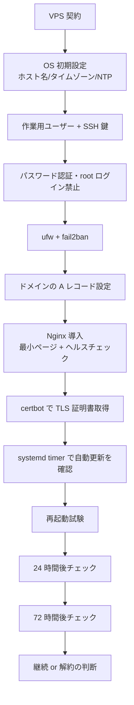

# 13 恒久ホスト構築演習設計：独立ホストでの初期構築から再起動・長期稼働・実 DNS/TLS まで（lab-persist01）

> **本ドキュメントの位置付け**
>
> [STATUS.md](../../STATUS.md)が挙げる「[コードでは埋められない、残っている穴](../../STATUS.md#コードでは埋められない残っている穴)」の
> 1 番目は次のとおりです。
>
> > 恒久ホストが 1 台も無い。再起動後の永続性、24 / 72 時間稼働、Slack 実配信、実 DNS / TLS、
> > インターネット越しの UFW がここで止まっている。VPS 1 台で大半が解決する。
>
> [学習プラン README](./README.md#本人の到達状況自己採点)も同じ内容を「残っている大きな穴」の 1 番目に挙げており、
> [証跡採録チェックリストの現在の残タスク](../evidence-capture-checklist.md#現在の残タスクlinux-サーバー構築を最優先)は
> 順位 1・2 として次を挙げていますが、**この 2 項目にはどの資料にも詳細設計がありません**（順位 6 の AWS 検証だけが
> [11 AWS基礎構築演習設計](./11-aws-foundational-exercise-design.md)という具体設計を持っています）。
>
> | 順位 | 証跡採録チェックリストの記載 |
> | --- | --- |
> | 1 | Docker 未導入の独立した Ubuntu 対象ホスト + 別の管理端末（`site.yml` 初回適用、2 回目 `changed=0`、network / UFW、受け入れ試験、引き渡し資料） |
> | 2 | 対象ホストの再起動・継続稼働（再起動直後の自動起動・監視復帰・バックアップ、24 時間後と 72 時間後の正常性） |
>
> 本書は、[05 Phase 1 演習設計](./05-phase1-exercise-design.md)が**ローカルの使い捨て VM**（`lab-base01`）に対して
> 行った初期構築を、**インターネット上の恒久ホスト**（`lab-persist01`）に対して行う演習として設計します。05 が
> 意図的にスコープ外とした「ラボセグメント限定ではない、実インターネットからの到達」「実ドメインでの名前解決」
> 「公的証明書（Let's Encrypt）による TLS 化」「再起動を跨いだ複数日にわたる継続稼働の確認」までを対象にします。
> ただし本書が作るのは**そのための土台となる 1 台の独立ホスト**までであり、上表順位 1 の `site.yml`（Ansible）適用や
> 順位 3 の Slack 実配信そのものは対象外です（重複させない境界は[付録 B](#付録-b-本演習と既存資料の役割分担)）。
>
> [新規設計を増やさない運用ルール](../evidence-capture-checklist.md#新規設計を増やさない運用ルール)の対象は
> **server-monitor の改善設計 06 以降**です。本書は改善設計ではなく学習計画（[05](./05-phase1-exercise-design.md)〜
> [12](./12-windows-server-exercise-design.md)と同じ位置付け）のため対象外です。
>
> **技術情報の裏取りについて**: 本書の VPS 料金・certbot の既定動作は、2026-08-28 に AI 支援セッションで Web 検索を
> 実行して確認しました。VPS 料金は変動が大きい分野のため、契約前に必ず提供元の最新料金ページで再確認してください
> （[04 教材と資格の対応 §5](./04-resources.md#5-情報の鮮度を確認する習慣)と同じ姿勢）。certbot の systemd timer による
> 1 日 2 回の自動更新は Ubuntu 24.04 のパッケージ既定動作として複数の一次情報・解説記事で確認できましたが、
> 実施時に対象ホストで `systemctl list-timers` により実際の設定を確認してください。この AI 支援セッションには
> インターネットに公開した実ホストが無いため、本書のコマンド・想定結果は**一つも実行して確認していません**。
>
> 本ドキュメントは**設計であり、実施記録ではありません**。実施したら [8. 実施ステータスと次のアクション](#8-実施ステータスと次のアクション)を更新します。

最終更新: 2026-08-28

> **実施ステータス: 設計のみ・未実施**（2026-08-28 時点）。試験項目書の実測結果欄はすべて空欄です。

---

## 目次

| 節 | 内容 |
| --- | --- |
| [1](#1-演習の目的スコープ前提条件) | 目的・スコープ・前提条件 |
| [2](#2-要件と基本設計) | 要件と基本設計（VPS・ドメイン・TLS・到達制御の選定理由） |
| [3](#3-パラメータシートlab-persist01) | パラメータシート（`lab-persist01`） |
| [4](#4-構築手順書) | 構築手順書（コマンド・想定結果・判定） |
| [5](#5-試験項目書) | 試験項目書（単体・結合・総合・異常系） |
| [6](#6-実施タイムテーブルと運用ガード) | 実施タイムテーブルと運用ガード（複数日程・課金停止基準） |
| [7](#7-証跡採録計画) | 証跡採録計画 |
| [8](#8-実施ステータスと次のアクション) | 実施ステータスと次のアクション |
| [付録 A](#付録-a-使用終了時の解約データ消去手順) | 使用終了時の解約・データ消去手順 |
| [付録 B](#付録-b-本演習と既存資料の役割分担) | 本演習と既存資料の役割分担 |

---

## 1. 演習の目的・スコープ・前提条件

### 目的

[STATUS.md の残っている穴 1 番目](../../STATUS.md#コードでは埋められない残っている穴)（恒久ホストが 1 台も無い）を埋める
最初の一歩として、**インターネットから到達できる独立した VPS 1 台**（`lab-persist01`）に Ubuntu Server 24.04 LTS を
導入し、[05](./05-phase1-exercise-design.md)と同じ密度（パラメータシート・構築手順書・試験項目書）で、次を具体化する。

1. OS の初期構築（[05](./05-phase1-exercise-design.md)と同じ項目に加え、実インターネットに公開する差分だけを追加する）
2. 実ドメインの DNS 設定と、Let's Encrypt による公的 TLS 証明書の取得・自動更新
3. 再起動後の永続性、24 時間後・72 時間後の継続稼働確認（複数日にまたがる試験計画）
4. 実インターネットからの不正アクセス試行に対する `fail2ban` の動作確認（ラボセグメントでは再現できない、実運用ならではの異常系）
5. 使い終わったときの解約・データ消去手順（継続コストが発生するホストである以上、構築手順と同じ重みで必要）

完成後の成果物は、[証跡採録チェックリストの現在の残タスク](../evidence-capture-checklist.md#現在の残タスクlinux-サーバー構築を最優先)
順位 1・2 が採録先として使える「独立ホストの構築・試験手順」になる。**ただし本演習を完走しても順位 1・2 が
完了扱いになるわけではない**（[付録 B](#付録-b-本演習と既存資料の役割分担)のとおり、順位 1 の `site.yml` 適用と
順位 3 の Slack 実配信は別途必要。順位 2 についても、本演習が確認するのは再起動後のサービス自動復帰と
heartbeat による 24 / 72 時間後の到達性のみであり、監視スタック本体の復帰確認とバックアップの復元試験は
対象外のまま残る）。

### スコープ

| 対象 | 扱い |
| --- | --- |
| VPS の契約、支払い方法の確認、契約プランの確認 | **対象**。[4.1](#41-作業前確認) |
| 独自ドメインの取得（または既存ドメインのサブドメイン払い出し）と A レコード設定 | **対象**。[4.1](#41-作業前確認)・[4.7](#47-ドメインの-dns-設定) |
| OS 初期構築（ホスト名・タイムゾーン・NTP・固定グローバル IP の確認・作業用ユーザー・SSH 鍵・パスワード認証禁止・root ログイン禁止） | **対象**。[05](./05-phase1-exercise-design.md)と同一項目。[4.2](#42-初期ログインホスト名タイムゾーンntp)〜[4.5](#45-ssh-公開鍵の登録と鍵ログイン確認) |
| `ufw` によるファイアウォールと `fail2ban` による総当たり対策 | **対象**。[05](./05-phase1-exercise-design.md)がラボセグメント限定で済ませていた到達制御を、実インターネット向けに置き換える。[4.6](#46-ファイアウォールufwと総当たり対策fail2ban) |
| 最小限の Web サービス（Nginx、静的ページ + ヘルスチェック用エンドポイント） | **対象**。TLS 化・稼働確認の対象を用意するためだけの最小構成。[4.8](#48-nginx-の導入と最小ページの配置) |
| Let's Encrypt（`certbot`）による TLS 証明書の取得と自動更新 | **対象**。[4.9](#49-lets-encrypttls証明書の取得) |
| heartbeat タイマーの設定、再起動試験、24 時間後・72 時間後の継続稼働確認 | **対象**。[4.10](#410-heartbeat-タイマーの設定)〜[4.11](#411-再起動試験)、[5 章](#5-試験項目書)の T-15〜T-17 |
| 使用終了時の解約・データ消去 | **対象**。[付録 A](#付録-a-使用終了時の解約データ消去手順) |
| `site.yml`（Ansible）による構成管理の適用、Docker 導入 | **対象外**。[証跡採録チェックリスト順位 1](../evidence-capture-checklist.md#現在の残タスクlinux-サーバー構築を最優先)が扱う。本書はその適用先になり得る「素の独立ホスト」を作るところまで |
| Alertmanager → Slack の実配信 | **対象外**。[証跡採録チェックリスト順位 3](../evidence-capture-checklist.md#現在の残タスクlinux-サーバー構築を最優先)が扱う。Slack Webhook の取得は本書のホストに依存しない |
| Web / AP / DB の 3 層構成、監視スタック本体（Prometheus / Grafana / Zabbix） | **対象外**。[05](./05-phase1-exercise-design.md)・[09](./09-zabbix-monitoring-exercise-design.md)と同様、本書は基盤のみを扱う |
| AWS 上への構築（VPC・EC2・Terraform） | **対象外**。[11](./11-aws-foundational-exercise-design.md)が扱う。11 は「1 セッションで `apply` から `destroy` まで完了する」ことが目的の別演習であり、**「継続稼働させる」ことが目的の本書とは目的が逆**（[2 章](#2-要件と基本設計)で比較する） |
| D-2（ホスト障害復旧）、Windows / AD | **対象外**。それぞれ[証跡採録チェックリスト順位 5](../evidence-capture-checklist.md#現在の残タスクlinux-サーバー構築を最優先)・[08](./08-ad-exercise-design.md)・[12](./12-windows-server-exercise-design.md)が扱う |

### 前提条件

| 項目 | 内容 |
| --- | --- |
| 前提知識 | [05 Phase 1 演習設計](./05-phase1-exercise-design.md)を実施済み、または同等の操作（SSH 鍵ログイン、`ufw`、`systemctl`、`journalctl`）に慣れていること |
| 支払い手段 | VPS 契約とドメイン取得に使えるクレジットカード等。継続課金が発生する契約であることを理解していること（[6 章](#6-実施タイムテーブルと運用ガード)） |
| 意思決定 | 独自ドメインを新規取得するか、既存ドメインのサブドメインを払い出すかを事前に決めておく（[2 章](#2-要件と基本設計)） |
| 環境 | 手元の PC 1 台（[01 学習環境](./01-environment.md)のラボとは独立。VM は不要） |
| 想定所要時間 | 初回構築（[4.1](#41-作業前確認)〜[4.9](#49-lets-encrypttls証明書の取得)） 2.5〜3.5 時間。DNS 反映待ちで数十分〜数時間の中断が入ることがある（[6 章](#6-実施タイムテーブルと運用ガード)）。再起動試験 30 分。24 時間後・72 時間後の確認は各 10〜15 分だが、**構築から 72 時間後の確認完了まで暦日で最短 4 日かかる**（[6 章](#6-実施タイムテーブルと運用ガード)） |
| 想定コスト | [2 章のコスト試算](#コスト試算)を参照。初月は VPS + ドメイン取得費で概ね 1,000〜3,300 円程度、継続する場合は月 600〜1,300 円程度 |

---

## 2. 要件と基本設計

### 非機能要件（学習ラボとしての最小要件）

| # | 要件 | 理由 |
| --- | --- | --- |
| N1 | 1 台の VPS で完結する | [05](./05-phase1-exercise-design.md#2-要件と基本設計)・[11](./11-aws-foundational-exercise-design.md#2-要件と基本設計)と同じく、まず「1 台を正確に、実インターネット条件で作れる」ことを目的にする |
| N2 | 継続コストを本人が常に把握できる | 従量課金の AWS / Azure（[10](./10-azure-foundational-exercise-design.md)・[11](./11-aws-foundational-exercise-design.md)）と異なり VPS は定額だが、**契約したまま忘れる**ことが最大のリスクになる。[6 章](#6-実施タイムテーブルと運用ガード)で明示的な継続要否の判断点を置く |
| N3 | パスワード認証を使わない、実インターネットからの総当たりに耐える設定にする | [05 の非機能要件](./05-phase1-exercise-design.md#2-要件と基本設計)（パスワード認証禁止・root ログイン禁止）に加え、ラボセグメント限定という保護が無くなる分を `fail2ban` で補う |
| N4 | 再現性：手順書のみで、新しい VPS 1 台から半日以内に再構築できる | [03 構築手順書の原則](./03-build-process.md#3-構築手順書) |
| N5 | 永続性：再起動・24 時間・72 時間を跨いで全設定が保持される | [試験項目書](#5-試験項目書) T-15〜T-17 で確認する。ローカル VM の再起動試験（[05](./05-phase1-exercise-design.md) T-10）を、電源の入り切りではなく**実際の課金対象インスタンスの再起動**として行う点が異なる |

### 基本設計（構成と選定理由）

図の要約：VPS 契約から OS 初期設定・SSH 鍵・到達制御（`ufw`/`fail2ban`）・ドメイン設定・Nginx・TLS 証明書取得の順に
構築し、再起動試験の後、24 時間後・72 時間後の 2 回にわたって継続稼働を確認してから、継続するか解約するかを
判断する。**J（再起動試験）から M（判断）までは暦日で数日かかる点が、他の演習設計と最も異なる**。

### 決定事項（選定と理由）

| 決定事項 | 選定 | 理由・比較した選択肢 |
| --- | --- | --- |
| ホスト形態 | **VPS**（クラウドの IaaS ではなく、月額固定の仮想専用サーバー） | [STATUS.md](../../STATUS.md#コードでは埋められない残っている穴)が「VPS 1 台で大半が解決する」と明記している。自宅の余剰 PC を使う選択肢もあるが、多くの家庭用回線は動的 IP・CGNAT（ISP 側で複数契約者が 1 個のグローバル IP を共有する方式）の対象になり得り、実 DNS の A レコードを固定できない場合がある。VPS はグローバル IP が契約に紐づくため、この演習の目的（実 DNS / 実 TLS / 実インターネットからの到達）に直接適合する |
| VPS 事業者・プラン | 国内 VPS 事業者の最安〜下から 2 番目のプラン（例: 月額 600〜1,300 円程度、メモリ 512MB〜1GB、SSD 20〜25GB。2026-08-28 時点の Web 検索で確認した価格帯であり、契約前に必ず最新料金を確認する） | 学習目的の 1 台構成であり高スペックは不要。国内事業者を選ぶ理由は、円建て課金で為替変動を気にしなくてよいこと、国内データセンターで DNS 反映やレイテンシの確認がしやすいことの 2 点。**特定事業者を指定しない**のは、料金・プランの変動が大きい分野のため（[04 教材と資格の対応 §5](./04-resources.md#5-情報の鮮度を確認する習慣)と同じ姿勢）。契約前に確認する項目は[4.1](#41-作業前確認)に列挙する |
| 契約期間 | **月単位（自動更新）**。年払い等の長期契約は選ばない | 学習の最初の 1 台は「いつでも解約できる」ことを優先する。長期契約は月あたりの単価が下がることが多いが、[6 章](#6-実施タイムテーブルと運用ガード)の継続要否判断より前にコミットする必要が生じ、N2 の要件（継続コストを常に把握できる）と矛盾する |
| OS | Ubuntu Server 24.04 LTS | [05](./05-phase1-exercise-design.md)・[11](./11-aws-foundational-exercise-design.md)と同じ OS に揃え、コマンド・設定ファイルの記述を使い回せるようにする。契約前に、選んだ VPS 事業者の OS テンプレート一覧に Ubuntu Server 24.04 LTS が含まれることを確認する（[4.1](#41-作業前確認)） |
| ドメイン | 安価な TLD（`.com` / `.net` 等）を新規に 1 つ取得する。既に個人保有ドメインがあればそのサブドメインでもよい | 実 DNS・実 TLS の確認には自分が権威を持つドメインが要る。[README](../../README.md)で使っている `ns7jp.github.io` は GitHub Pages のサブドメインであり、A レコードを VPS の IP に向けることはできないため代用できない。レジストラは複数あるため本書では特定の 1 社を指定しない。初年度キャンペーン価格と 2 年目以降の更新価格が大きく異なることが多いため、**更新価格を契約前に確認する**（[4.1](#41-作業前確認)） |
| SSH の到達制御 | ポート番号は既定の `22/tcp` のまま変更せず、**送信元は全世界からの接続を許可した上で `fail2ban` を導入する** | [05](./05-phase1-exercise-design.md#2-要件と基本設計)はラボセグメント（`192.168.56.0/24`）に許可元を限定できたが、本書は実インターネットからの管理接続を要件にしているため同じ限定はできない。ポート番号の変更は迷惑スキャンの記録を減らす効果はあるが本質的な対策ではない（security through obscurity）ため採用せず、**実際に総当たりを受けて `fail2ban` が防ぐところまでを演習の一部にする**（[5 章](#5-試験項目書) T-18）。鍵認証のみ・パスワード認証禁止・root ログイン禁止は [05](./05-phase1-exercise-design.md)から変更しない |
| Web サービス | Nginx + 静的な 1 ページ + `/healthz` エンドポイント（固定文字列を返すだけ） | TLS 化・稼働確認・24/72 時間チェックの「対象」を用意することが目的であり、実サービスの構築は[スコープ外](#スコープ)。[03 パラメータシート記入例](./03-build-process.md#2-パラメータシート)の Nginx 設定をそのまま流用する |
| TLS 証明書 | **Let's Encrypt**（`certbot`、HTTP-01 チャレンジ、Nginx プラグイン） | 無料で公的な証明書チェーンを得られ、[02 W10 TLS とリバースプロキシ](./02-curriculum.md#w10-tls-とリバースプロキシ)の学習項目「Let's Encrypt の自動更新」をそのまま実地で確認できる。[05](./05-phase1-exercise-design.md)・[03 パラメータシート記入例](./03-build-process.md#2-パラメータシート)はいずれも自己署名証明書を前提にしており、公的証明書での確認は本書が初めて埋める差分 |
| 証明書の自動更新方式 | **systemd timer**（`certbot` パッケージが既定で作成する `certbot.timer`、1 日 2 回起動） | 2026-08 時点の Web 検索で確認した Ubuntu 24.04 の `certbot` パッケージの既定動作であり、EFF（Let's Encrypt 運営）も 1 日 2 回の実行を推奨している。cron を新たに書く必要はなく、既定を確認する（[4.9](#49-lets-encrypttls証明書の取得)）ことが本書の作業になる |
| バックアップ | VPS 事業者のスナップショット機能で、初期構築完了直後の状態を 1 回取得する | [05 のスナップショット運用](./05-phase1-exercise-design.md#2-要件と基本設計)と同じ考え方。多くの VPS のスナップショットは保存期間中も課金対象になるため、[6 章](#6-実施タイムテーブルと運用ガード)の判断点で不要になった時点で削除する |

### 11（AWS）との違い

| 観点 | 11 AWS基礎構築演習設計 | 13（本書） |
| --- | --- | --- |
| 目的 | 「`apply` を 1 度も実行していない」穴を埋める。IaC 化の経験そのものが目的 | 「恒久ホストが 1 台も無い」穴を埋める。継続稼働そのものが目的 |
| 所要時間の設計 | **1 セッションで `apply` から `destroy` まで完了**させる（[11 章](./11-aws-foundational-exercise-design.md#9-実施タイムテーブルと中断基準)） | **複数日にまたがって稼働させ続ける**（[6 章](#6-実施タイムテーブルと運用ガード)） |
| 課金モデル | 従量課金（使った分だけ）。無料利用枠の範囲なら概ね 0 円 | VPS の月額固定課金。使っていなくても契約している限り発生する |
| コード化 | Terraform でコード化することが目的の中心 | 対象外。手作業構築のみ（[スコープ](#スコープ)） |
| DNS / TLS | 対象外（インスタンスのパブリック DNS 名をそのまま使う） | 実ドメイン + Let's Encrypt が目的の中心 |

両者は「クラウドか VPS か」ではなく**目的が違う演習**であり、どちらか一方で代替できない
（[STATUS.md の穴の 1 番目と 4 番目](../../STATUS.md#コードでは埋められない残っている穴)は別項目として挙げられている）。

### コスト試算

| 項目 | 目安 | 備考 |
| --- | --- | --- |
| VPS 初月 | 600〜1,300 円程度 | 事業者・プランにより変動。日割りの事業者もある |
| VPS 継続（月額） | 600〜1,300 円程度 | 契約を続ける限り毎月発生する |
| ドメイン初年度 | 数百円〜2,000 円程度（レジストラ・TLD・キャンペーンにより変動） | 初年度と更新年度で価格が異なることが多い。**更新価格を契約前に確認する** |
| ドメイン更新（年額） | 1,000〜2,000 円程度 | 継続しない場合は更新せず失効させる、または[付録 A](#付録-a-使用終了時の解約データ消去手順)の手順で早めに整理する |
| Let's Encrypt 証明書 | 0 円 | 発行・更新とも無料 |
| VPS スナップショット | 事業者により数十〜数百円/月 | [6 章](#6-実施タイムテーブルと運用ガード)の判断点で不要なら削除する |

**初月の総額は概ね 1,000〜3,300 円程度**（VPS 初月 + ドメイン新規取得費。事業者・レジストラの組み合わせにより変動）。
**継続する場合は月 600〜1,300 円程度 + 年 1 回のドメイン更新**。
[01 学習環境 §5](./01-environment.md#5-クラウド検証と課金事故の防止)がクラウド検証の目安として挙げている「数百円」よりも
高くなるのは、本書が**継続課金**を前提にしているためであり、[6 章](#6-実施タイムテーブルと運用ガード)で
継続要否を明示的に判断する設計にしている理由でもある。

---

## 3. パラメータシート（`lab-persist01`）

[03 構築工程の実務ドキュメント §2](./03-build-process.md#2-パラメータシート)の様式に、`lab-persist01` の実値を入れたもの。

### 基本情報

| 項目 | 値 |
| --- | --- |
| ホスト名 | `lab-persist01` |
| 役割 | 恒久稼働の独立ホスト（[05](./05-phase1-exercise-design.md)の `lab-base01` のインターネット公開版）。将来的に[証跡採録チェックリスト順位 1](../evidence-capture-checklist.md#現在の残タスクlinux-サーバー構築を最優先)の `site.yml` 適用先になり得るが、本書の時点ではその手前の素のホスト |
| 環境区分 | 検証（個人学習ラボ。ただし実インターネットに公開する） |
| 設置場所 | VPS（国内事業者、[2 章の決定事項](#決定事項選定と理由)） |
| 用途・備考 | [STATUS.md の残っている穴 1 番目](../../STATUS.md#コードでは埋められない残っている穴)に対応する演習用ホスト |

### 仮想マシン

| 項目 | 値 |
| --- | --- |
| vCPU | 1 |
| メモリ | 1 GB（最安の 512MB プランは `nginx` + `fail2ban` + `certbot` の同時稼働では手狭になり得るため、1 段階上のプランを選ぶ） |
| ディスク構成 | 20〜25 GB SSD（事業者の下から 2 番目のプラン相当） |
| リージョン / データセンター | 国内データセンター（東京・大阪・石狩等、事業者の選択肢に依存） |

### OS

| 項目 | 値 |
| --- | --- |
| OS / バージョン | Ubuntu Server 24.04 LTS |
| タイムゾーン | `Asia/Tokyo` |
| ロケール | `ja_JP.UTF-8` |
| 時刻同期 | `systemd-timesyncd`（既定の NTP プールを使用。ラボセグメントの制約が無いため [05](./05-phase1-exercise-design.md)のような未同期状態は発生しない） |
| 自動更新 | セキュリティ更新のみ `unattended-upgrades` で有効化（[05](./05-phase1-exercise-design.md#3-パラメータシート)と同じ） |

### ネットワーク

| 項目 | 値 |
| --- | --- |
| グローバル IP | VPS 契約時に払い出される固定 IPv4（値は契約後に確定。本書では `<VPS_GLOBAL_IP>` と表記する） |
| ドメイン | `lab-persist01.<取得したドメイン>`（A レコードを `<VPS_GLOBAL_IP>` へ向ける） |
| 開放ポート（受信） | `22/tcp`（全世界、`fail2ban` で保護）、`80/tcp`（Let's Encrypt HTTP-01 チャレンジとリダイレクト用）、`443/tcp`（HTTPS） |
| 開放ポート以外 | すべて拒否（`ufw default deny incoming`） |

### ユーザー・権限

| 項目 | 値 |
| --- | --- |
| 作業用ユーザー | `opsadmin`（[05](./05-phase1-exercise-design.md#3-パラメータシート)と同じユーザー名で揃える） |
| sudo 権限 | 全コマンド許可、パスワード必須 |
| 認証方式 | SSH 公開鍵のみ。パスワード認証は禁止 |
| root ログイン | 禁止（`PermitRootLogin no`） |

### ミドルウェア

| 項目 | 値 |
| --- | --- |
| Web サーバー | Nginx（安定版、Ubuntu 24.04 の標準リポジトリ） |
| ドキュメントルート | `/var/www/lab-persist01` |
| ヘルスチェック | `/healthz`（固定文字列 `ok` を返すのみ） |
| TLS 証明書 | Let's Encrypt（`/etc/letsencrypt/live/lab-persist01.<取得したドメイン>/`） |
| 証明書自動更新 | `certbot.timer`（1 日 2 回。[4.9](#49-lets-encrypttls証明書の取得)で確認） |

### 到達制御

| 項目 | 値 |
| --- | --- |
| ファイアウォール | `ufw`（[05](./05-phase1-exercise-design.md#3-パラメータシート)と同じ既定拒否の方針） |
| 総当たり対策 | `fail2ban`（`sshd` jail を有効化。既定の `bantime` / `findtime` / `maxretry` から変更しない） |

### ログ・稼働確認

| 項目 | 値 |
| --- | --- |
| heartbeat | systemd timer（`lab-heartbeat.timer`）で 1 時間毎に `date` を `/var/log/lab-heartbeat.log` へ追記 |
| 外部からの稼働確認 | 手元 PC から `curl` で `/healthz` を定期実行し、結果を時刻付きで記録（[5 章](#5-試験項目書) T-16・T-17） |
| ログローテーション | `logrotate`（既定のまま。`fail2ban` のログも対象に含まれることを確認する） |

---

## 4. 構築手順書

[03 構築工程の実務ドキュメント §3](./03-build-process.md#3-構築手順書)の構成・書式に従う。特記のない限り、
すべて `lab-persist01` 上の SSH セッションで実行する。手元 PC 側で実行するものは明記する。

### 4.1 作業前確認

| No | 確認内容 | コマンド / 操作 | 想定結果 |
| --- | --- | --- | --- |
| 4.1-1 | VPS 事業者の OS テンプレートに Ubuntu Server 24.04 LTS があること | 契約画面で確認 | テンプレート一覧に含まれる |
| 4.1-2 | 選んだプランの月額と契約期間（月単位であること）を確認 | 契約画面で確認 | [2 章の決定事項](#決定事項選定と理由)のとおり月単位・自動更新であることを確認する |
| 4.1-3 | ドメインの新規取得費用と**更新価格**を確認 | レジストラの料金ページで確認 | 初年度価格だけでなく 2 年目以降の更新価格も把握する |
| 4.1-4 | 手元 PC に SSH クライアントと `dig` / `curl` があること | `ssh -V`、`dig -v` または `nslookup` の有無、`curl --version` | いずれも実行できる |

### 4.2 初期ログイン・ホスト名・タイムゾーン・NTP

| No | 作業内容 | コマンド | 想定結果 | 判定 |
| --- | --- | --- | --- | --- |
| 4.2-1 | 初期ログイン確認 | `ssh root@<VPS_GLOBAL_IP>`（事業者が発行した初期パスワードまたは初期鍵を使用） | ログインできる | プロンプトが表示される |
| 4.2-2 | ホスト名変更 | `sudo hostnamectl set-hostname lab-persist01` | 出力なし | `hostnamectl status` の `Static hostname` が `lab-persist01` |
| 4.2-3 | タイムゾーン設定 | `sudo timedatectl set-timezone Asia/Tokyo` | 出力なし | `timedatectl show --property=Timezone --value` が `Asia/Tokyo` |
| 4.2-4 | NTP 同期確認 | `timedatectl show --property=NTPSynchronized --value` | `yes` | ラボセグメント限定の [05](./05-phase1-exercise-design.md) と異なり、初回から同期が成立する |
| 4.2-5 | ロケール設定 | `sudo localectl set-locale LANG=ja_JP.UTF-8` | 出力なし | `localectl status` の `System Locale` が `LANG=ja_JP.UTF-8` |

### 4.3 作業用ユーザーの作成

| No | 作業内容 | コマンド | 想定結果 | 判定 |
| --- | --- | --- | --- | --- |
| 4.3-1 | ユーザー作成 | `sudo adduser opsadmin` | パスワード設定を含む対話が完了する | `id opsadmin` が成功する |
| 4.3-2 | `sudo` グループへ追加 | `sudo usermod -aG sudo opsadmin` | 出力なし | `groups opsadmin` に `sudo` が含まれる |

### 4.4 パッケージの更新と基本パッケージの導入

| No | 作業内容 | コマンド | 想定結果 | 判定 |
| --- | --- | --- | --- | --- |
| 4.4-1 | パッケージ一覧の更新と全体更新 | `sudo apt update && sudo apt full-upgrade -y` | エラーなく完了する | 終了ステータス 0 |
| 4.4-2 | 自動更新（セキュリティのみ）の有効化 | `sudo apt install -y unattended-upgrades` に続けて `sudo dpkg-reconfigure -plow unattended-upgrades` | 有効化の確認ダイアログに `はい` | `cat /etc/apt/apt.conf.d/20auto-upgrades` に `"1"` が 2 行 |
| 4.4-3 | `fail2ban` の導入 | `sudo apt install -y fail2ban` | 導入される | `systemctl is-active fail2ban` が `active` |

### 4.5 SSH 公開鍵の登録と鍵ログイン確認

[05 の 3-7](./05-phase1-exercise-design.md#3-7-ssh-公開鍵の登録と鍵ログイン確認パスワード認証を禁止する前に実施)と同じ手順・同じ注意点（**パスワード認証を禁止する前に、必ず鍵ログインを別セッションで確認する**）。

| No | 作業内容 | コマンド | 想定結果 | 判定 |
| --- | --- | --- | --- | --- |
| 4.5-1 | 手元 PC で鍵ペア作成（未作成の場合） | `ssh-keygen -t ed25519 -C "lab-persist01"` | 鍵ペアが作成される | `~/.ssh/id_ed25519.pub` が存在する |
| 4.5-2 | 公開鍵の登録 | `ssh-copy-id -i ~/.ssh/id_ed25519.pub opsadmin@<VPS_GLOBAL_IP>`（手元 PC 側） | 登録される | `opsadmin` の `~/.ssh/authorized_keys` に追記される |
| 4.5-3 | **鍵ログイン確認（重要・必須）（手元 PC 側）** | `ssh -o PreferredAuthentications=publickey opsadmin@<VPS_GLOBAL_IP> whoami` | `opsadmin` | 別セッションで成功を確認してから次へ進む |
| 4.5-4 | パスワード認証・root ログインの禁止 | `/etc/ssh/sshd_config.d/00-lab-hardening.conf` に `PasswordAuthentication no` と `PermitRootLogin no` を記載し `sudo systemctl reload ssh` | エラーなく反映される | `sudo sshd -T \| grep -E "passwordauthentication\|permitrootlogin"` がいずれも `no` |

### 4.6 ファイアウォール（`ufw`）と総当たり対策（`fail2ban`）

| No | 作業内容 | コマンド | 想定結果 | 判定 |
| --- | --- | --- | --- | --- |
| 4.6-1 | 既定ポリシーの設定 | `sudo ufw default deny incoming`、`sudo ufw default allow outgoing` | 出力なし | `sudo ufw status verbose` に両方表示される |
| 4.6-2 | SSH の許可 | `sudo ufw allow 22/tcp` | 出力なし | ルール一覧に `22/tcp ALLOW Anywhere` |
| 4.6-3 | HTTP / HTTPS の許可 | `sudo ufw allow 80/tcp`、`sudo ufw allow 443/tcp` | 出力なし | ルール一覧に両方表示される |
| 4.6-4 | 有効化 | `sudo ufw enable` | 確認プロンプトに `y` | `sudo ufw status` が `Status: active` |
| 4.6-5 | `fail2ban` の `sshd` jail 確認 | `sudo fail2ban-client status sshd` | jail が存在し `Currently banned: 0` | エラーなく表示される |

> **4.6-2 の注意（[05](./05-phase1-exercise-design.md#3-9-ファイアウォール)との違い）**: 05 は許可元をラボセグメント
> （`192.168.56.0/24`）に限定できたが、本書は実インターネットからの管理接続を要件にしているため送信元を
> 限定しない（[2 章の決定事項](#決定事項選定と理由)）。その代わりに `fail2ban` を導入し、[T-18](#5-試験項目書)で
> 実際に総当たりを検知・遮断できることを確認する。

### 4.7 ドメインの DNS 設定

| No | 作業内容 | コマンド / 操作 | 想定結果 | 判定 |
| --- | --- | --- | --- | --- |
| 4.7-1 | A レコードの設定 | レジストラまたは DNS 管理画面で `lab-persist01.<取得したドメイン>` → `<VPS_GLOBAL_IP>` の A レコードを追加 | 保存される | 管理画面上に反映される |
| 4.7-2 | 反映確認（手元 PC 側） | `dig +short lab-persist01.<取得したドメイン>` | `<VPS_GLOBAL_IP>` が返る | 一致するまで数分〜数時間かかることがある（TTL に依存） |
| 4.7-3 | 反映待ちの間の対応 | — | [6 章の実施タイムテーブル](#6-実施タイムテーブルと運用ガード)のとおり、反映を待つ間は他の作業を挟んでよい | — |

### 4.8 Nginx の導入と最小ページの配置

| No | 作業内容 | コマンド | 想定結果 | 判定 |
| --- | --- | --- | --- | --- |
| 4.8-1 | Nginx の導入 | `sudo apt install -y nginx` | エラーなく完了する | `systemctl is-active nginx` が `active` |
| 4.8-2 | 自動起動の確認 | `systemctl is-enabled nginx` | `enabled` | 一致 |
| 4.8-3 | 最小ページの配置 | `echo "lab-persist01" \| sudo tee /var/www/lab-persist01/index.html`（事前に `sudo mkdir -p /var/www/lab-persist01`） | ファイルが作成される | `curl -s http://<VPS_GLOBAL_IP>/` に `lab-persist01` |
| 4.8-4 | ヘルスチェックエンドポイントの配置 | `location /healthz { return 200 "ok"; }` を server ブロックに追記し `sudo nginx -t && sudo systemctl reload nginx` | 構文チェックが通る | `curl -s http://<VPS_GLOBAL_IP>/healthz` が `ok` |
| 4.8-5 | HTTP での動作確認（手元 PC 側） | `curl -I http://lab-persist01.<取得したドメイン>/` | `200 OK` | ドメイン名でも到達できることを確認する（[4.7](#47-ドメインの-dns-設定)の反映後） |

### 4.9 Let's Encrypt（TLS）証明書の取得

| No | 作業内容 | コマンド | 想定結果 | 判定 |
| --- | --- | --- | --- | --- |
| 4.9-1 | `certbot` の導入 | `sudo apt install -y certbot python3-certbot-nginx` | エラーなく完了する | `certbot --version` が表示される |
| 4.9-2 | 証明書の取得と Nginx への自動組み込み | `sudo certbot --nginx -d lab-persist01.<取得したドメイン>` | メール入力・規約同意の対話に応答すると証明書が発行される | `/etc/letsencrypt/live/lab-persist01.<取得したドメイン>/` にファイルが作成される |
| 4.9-3 | HTTPS での動作確認 | `curl -I https://lab-persist01.<取得したドメイン>/healthz` | `200 OK`、有効な証明書チェーン | エラーなく応答する |
| 4.9-4 | HTTP → HTTPS リダイレクトの確認 | `curl -I http://lab-persist01.<取得したドメイン>/` | `301` で `https://` へリダイレクトされる | `certbot --nginx` が自動生成したリダイレクト設定を確認する |
| 4.9-5 | 自動更新タイマーの確認 | `systemctl list-timers certbot.timer` | 1 日 2 回のスケジュールが表示される | Ubuntu 24.04 の `certbot` パッケージの既定動作であることを確認する（[2 章の決定事項](#決定事項選定と理由)） |
| 4.9-6 | 更新のドライラン | `sudo certbot renew --dry-run` | `Congratulations, all simulated renewals succeeded` 相当のメッセージ | 実際の証明書を消費せずに更新経路を検証する |

### 4.10 heartbeat タイマーの設定

[5 章](#5-試験項目書) T-16・T-17 の 24 / 72 時間後チェックが参照する `/var/log/lab-heartbeat.log` は、
このタイマーが作る。

| No | 作業内容 | コマンド | 想定結果 | 判定 |
| --- | --- | --- | --- | --- |
| 4.10-1 | heartbeat 実行スクリプトの配置 | `printf '#!/bin/sh\ndate >> /var/log/lab-heartbeat.log\n' \| sudo tee /usr/local/bin/lab-heartbeat.sh && sudo chmod +x /usr/local/bin/lab-heartbeat.sh` | ファイルが作成される | `test -x /usr/local/bin/lab-heartbeat.sh` |
| 4.10-2 | systemd service ユニットの作成 | `/etc/systemd/system/lab-heartbeat.service` に `[Unit]`（`Description=lab heartbeat`）と `[Service]`（`Type=oneshot`、`ExecStart=/usr/local/bin/lab-heartbeat.sh`）を記載 | ファイルが作成される | `systemctl cat lab-heartbeat.service` がエラーなく表示される |
| 4.10-3 | systemd timer ユニットの作成 | `/etc/systemd/system/lab-heartbeat.timer` に `[Timer]`（`OnCalendar=hourly`、`Persistent=true`）と `[Install]`（`WantedBy=timers.target`）を記載 | ファイルが作成される | `systemctl cat lab-heartbeat.timer` がエラーなく表示される |
| 4.10-4 | 有効化と初回実行確認 | `sudo systemctl daemon-reload && sudo systemctl enable --now lab-heartbeat.timer && sudo systemctl start lab-heartbeat.service` | timer が有効化され、`lab-heartbeat.service` の初回実行でログに 1 行追記される | `systemctl is-enabled lab-heartbeat.timer` が `enabled`、`cat /var/log/lab-heartbeat.log` に 1 行以上 |

### 4.11 再起動試験

| No | 作業内容 | コマンド / 操作 | 想定結果 | 判定 |
| --- | --- | --- | --- | --- |
| 4.11-1 | 自動起動設定の記録（再起動前） | `systemctl is-enabled ssh ufw fail2ban nginx lab-heartbeat.timer` | すべて `enabled` | 再起動後との比較用に控える |
| 4.11-2 | 再起動 | `sudo reboot`。復帰しない場合は VPS 管理画面のコンソールから再起動する | 数十秒〜数分でホストが復帰する | 手元 PC からの疎通で確認する |
| 4.11-3 | 復帰後の一括確認（手元 PC 側） | `ssh opsadmin@lab-persist01.<取得したドメイン> "systemctl is-enabled ssh ufw fail2ban nginx lab-heartbeat.timer && systemctl is-active ssh ufw fail2ban nginx lab-heartbeat.timer && sudo ufw status && curl -s -o /dev/null -w '%{http_code}\n' https://lab-persist01.<取得したドメイン>/healthz"` | 4.11-1 と同じ `enabled` 一覧、全サービス `active`、`ufw` が `active`、HTTP ステータス `200` | 手動操作なしで全項目が復帰する |
| 4.11-4 | 証明書の有効性確認 | `curl -vI https://lab-persist01.<取得したドメイン>/ 2>&1 \| grep -i "expire\|issuer"` | 再起動前と同じ証明書が有効なまま | 再起動によって証明書が失われていないことを確認する |

---

## 5. 試験項目書

[03 構築工程の実務ドキュメント §4](./03-build-process.md#4-試験項目書)の書式に従う。全 22 項目中 7 項目が異常系であり、
[03 の「異常系を全体の 3 割以上」](./03-build-process.md#異常系を必ず入れる理由)の条件を満たす。

| No | 試験分類 | 観点 | 前提条件 | 手順 | 期待結果 | 実測結果 | 判定 | エビデンス | 実施日 |
| --- | --- | --- | --- | --- | --- | --- | --- | --- | --- |
| T-01 | 単体 | ホスト名 | OS 導入済み | `hostnamectl status` | `Static hostname: lab-persist01` | | | | |
| T-02 | 単体 | タイムゾーン・NTP 同期 | 同上 | `timedatectl show --property=Timezone,NTPSynchronized --value` | `Asia/Tokyo` と `yes` | | | | |
| T-03 | 単体 | SSH 鍵ログイン | 公開鍵登録済み | `ssh -o PreferredAuthentications=publickey opsadmin@lab-persist01.<取得したドメイン> whoami` | `opsadmin` | | | | |
| T-04 | 結合 | パスワード認証拒否 | 4.5-4 実施済み | `ssh -o PreferredAuthentications=password -o PubkeyAuthentication=no opsadmin@lab-persist01.<取得したドメイン>` | 認証を拒否される | | | | |
| T-05 | 結合 | root ログイン拒否 | 同上 | `ssh root@lab-persist01.<取得したドメイン>` | 認証を拒否される | | | | |
| T-06 | 単体 | `ufw` 既定拒否 | 4.6 実施済み | `sudo ufw status verbose` | `Default: deny (incoming), allow (outgoing)`。許可は `22/80/443` のみ | | | | |
| T-07 | 単体 | `fail2ban` 稼働 | 4.6-5 実施済み | `sudo fail2ban-client status sshd` | jail が有効、`Currently banned: 0` | | | | |
| T-08 | 単体 | Nginx 稼働・自動起動 | 4.8 実施済み | `systemctl is-active nginx && systemctl is-enabled nginx` | 両方 `active` / `enabled` | | | | |
| T-09 | 結合 | DNS 解決 | 4.7 実施済み | `dig +short lab-persist01.<取得したドメイン>`（手元 PC 側） | `<VPS_GLOBAL_IP>` が返る | | | | |
| T-10 | 結合 | HTTPS 応答と証明書チェーン | 4.9 実施済み | `curl -vI https://lab-persist01.<取得したドメイン>/healthz` | `200`、公的な証明書チェーンで検証エラーが出ない | | | | |
| T-11 | 結合 | HTTP → HTTPS リダイレクト | 同上 | `curl -I http://lab-persist01.<取得したドメイン>/` | `301` で `https://` へ | | | | |
| T-12 | 単体 | 証明書自動更新タイマー | 4.9-5 実施済み | `systemctl list-timers certbot.timer` | 1 日 2 回のスケジュールが有効 | | | | |
| T-13 | 異常系 | 証明書更新のドライラン | 4.9-6 実施済み | `sudo certbot renew --dry-run` | 全件成功のメッセージ | | | | |
| T-14 | 異常系 | 80 番ポート閉塞時の更新失敗と復旧 | T-13 が PASS 済み | `sudo ufw delete allow 80/tcp` 後に `sudo certbot renew --dry-run --force-renewal` を実行 → `sudo ufw allow 80/tcp` で復旧 | HTTP-01 チャレンジが失敗する。ポートを戻すと再度成功する | | | | |
| T-15 | 総合 | 再起動後の復帰 | 4.11 実施済み | [4.11-3](#411-再起動試験)の一括確認コマンド | 手動操作なしで全項目が復帰する | | | | |
| T-16 | 総合 | 24 時間後の継続稼働 | T-15 が PASS 済み | 構築から 24 時間後、手元 PC から `curl` で `/healthz` を実行し、`/var/log/lab-heartbeat.log` の最新行を SSH 越しに確認 | `200` が返り、heartbeat が 1 時間毎に途切れず記録されている | | | | |
| T-17 | 総合 | 72 時間後の継続稼働 | T-16 が PASS 済み | 構築から 72 時間後、T-16 と同じ確認に加え `sudo fail2ban-client status sshd` で総当たり検知件数を確認 | `200` が返り、heartbeat が途切れていない。総当たり検知件数を記録する（0 件でも異常ではない） | | | | |
| T-18 | 異常系 | 実インターネットからの総当たりに対する `fail2ban` の動作 | T-17 と同時期に実施可 | `sudo fail2ban-client status sshd` を複数日おきに確認し、`Currently banned` と `Total banned` の推移を記録する | 期間中に 1 件以上の自動検知・遮断が記録される（実インターネットに公開したホストは高い確率でスキャンを受けるため）。0 件だった場合は「未観測」として正直に記録する | | | | |
| T-19 | 異常系 | SSH 誤設定からの復旧 | スナップショット取得済み | `00-lab-hardening.conf` に存在しないディレクティブを追記し `sudo sshd -t` を実行 → 元の内容に復元 | `sshd -t` が構文エラーを検出する。復元で復旧できる | | | | |
| T-20 | 異常系 | Nginx 設定ミスからの復旧 | スナップショット取得済み | `server` ブロックの閉じ括弧を削除し `sudo nginx -t` を実行 → 元の内容に復元し `sudo systemctl reload nginx` | `nginx -t` が構文エラーを検出する。復元後 `active` に戻る | | | | |
| T-21 | 異常系 | 未許可ポートへの到達不能確認 | 4.6 実施済み | 手元 PC から `nc -zv -w3 lab-persist01.<取得したドメイン> 3306`（例: DB ポートなど未許可ポート） | 接続が拒否またはタイムアウトする | | | | |
| T-22 | 異常系 | ディスク容量逼迫時の検知と復旧 | スナップショット取得済み | `df -h /` で残容量を確認後 `sudo fallocate -l <残容量弱>G /var/tmp/dummy` でほぼ埋め、`sudo apt update` の失敗を確認 → `sudo rm /var/tmp/dummy` で復旧 | 容量不足によるコマンド失敗（`No space left on device` 相当）を確認できる。削除後は `df -h /` の使用率が元に戻り、`sudo apt update` が成功する | | | | |

---

## 6. 実施タイムテーブルと運用ガード

### 実施タイムテーブル（複数日程）

他の演習設計と異なり、本演習は**再起動試験の後に 72 時間の経過を待つ**ため、1 回の作業セッションでは完結しない。

| 日 | 作業 | 目安時間 |
| --- | --- | --- |
| Day 0 | [4.1](#41-作業前確認)〜[4.10](#410-heartbeat-タイマーの設定)（VPS 契約〜heartbeat タイマー設定）、スナップショット取得 | 2.5〜3.5 時間（DNS 反映待ちを除く） |
| Day 0（同日、間隔を空けて） | [4.11](#411-再起動試験) 再起動試験、T-01〜T-15 | 1 時間 |
| Day 1 | T-16（24 時間後チェック） | 15 分 |
| Day 3 | T-17・T-18（72 時間後チェック、`fail2ban` 検知件数の確認） | 15 分 |
| Day 3（判断後） | [下記「継続 or 解約の判断」](#継続-or-解約の判断) | 15 分 |

### 課金停止基準

| # | 基準 | 対応 |
| --- | --- | --- |
| 1 | T-01〜T-18 が完了し、かつ`site.yml` 適用等の後続演習を近日中に行う予定が無い | [付録 A](#付録-a-使用終了時の解約データ消去手順)の手順で速やかに解約する |
| 2 | VPS 管理画面や請求メールで想定外の金額を検知した | 直ちに該当リソースを停止し、[付録 A](#付録-a-使用終了時の解約データ消去手順)を実施する |
| 3 | ドメインの更新時期が近づいても継続の予定が無い | 更新せず失効させる。DNS レコードは事前に削除しておく（[付録 A](#付録-a-使用終了時の解約データ消去手順)） |

### 継続 or 解約の判断

72 時間チェック（T-17・T-18）完了後、次のいずれかを選ぶ。**「なんとなく残す」を選ばない**。

| 選択肢 | 該当する場合 | 次のアクション |
| --- | --- | --- |
| 継続する | [証跡採録チェックリスト順位 1](../evidence-capture-checklist.md#現在の残タスクlinux-サーバー構築を最優先)（`site.yml` 適用）や順位 3（Slack 実配信）を近日中に実施する予定がある | ホストを維持し、[STATUS.md](../../STATUS.md)の実施ステータスへ「継続中」と記録する |
| 解約する | 本演習の証跡採録（T-01〜T-22）で目的を達成しており、当面の後続演習の予定が無い | [付録 A](#付録-a-使用終了時の解約データ消去手順)を実施し、[8 章](#8-実施ステータスと次のアクション)へ解約日を記録する |

---

## 7. 証跡採録計画

[03 構築工程の実務ドキュメント §4](./03-build-process.md#エビデンスの要件)の要件（再現性・結果全文・秘密値のマスク・命名規則）に従う。

| 証跡 | 内容 | 保存先（実施時） |
| --- | --- | --- |
| 構築ログ | [4 章](#4-構築手順書)のコマンドと出力全文（`script` コマンドで記録） | [証跡採録チェックリスト](../evidence-capture-checklist.md)が指す保存先 |
| 試験結果 | [5 章](#5-試験項目書) T-01〜T-22 の実測結果とエビデンスファイル | 同上 |
| 24 / 72 時間チェックの記録 | T-16・T-17 実施時刻と `curl` / heartbeat ログのスクリーンショットまたは出力全文 | 同上。**実施日時が証跡の核心**のため、コマンド出力の日時をマスクしない |
| `fail2ban` 検知ログ | T-18 の `fail2ban-client status sshd` 出力（送信元 IP はマスクする） | 同上 |
| 解約記録（解約する場合） | 解約日、最終請求額、DNS レコード削除の確認 | [8 章](#8-実施ステータスと次のアクション) |

マスクする値：`<VPS_GLOBAL_IP>`（実 IP）、取得したドメイン名（本人特定や迷惑スキャンの標的化を避けるため、
必要に応じて一部を伏せる）、`fail2ban` が検知した送信元 IP、支払い金額の明細（合計額のみ記録し、
カード情報等は記録・撮影しない）。

---

## 8. 実施ステータスと次のアクション

| 項目 | 状態 |
| --- | --- |
| 本演習の実施 | 未実施 |
| VPS 契約 | 未実施 |
| ドメイン取得 | 未実施 |
| T-01〜T-22 | 未実施（実測結果欄はすべて空欄） |
| 継続 or 解約の判断 | 未実施 |

**次のアクション**

1. VPS 事業者・プランを確定し、[4.1](#41-作業前確認)の作業前確認を実施する
2. ドメインを取得（またはサブドメインを払い出し）、[4.7](#47-ドメインの-dns-設定)を実施する
3. [4.2](#42-初期ログインホスト名タイムゾーンntp)〜[4.9](#49-lets-encrypttls証明書の取得)を実施し、スナップショットを取得する
4. [6 章のタイムテーブル](#実施タイムテーブル複数日程)に沿って再起動試験・24 / 72 時間チェックを実施する
5. 実施後、本表と[証跡採録チェックリスト](../evidence-capture-checklist.md)の該当行を更新する

---

## 付録 A: 使用終了時の解約・データ消去手順

継続課金が発生するホストである以上、**構築手順と同じ重みで解約手順を用意する**（[03 構築手順書 §5 切り戻し手順](./03-build-process.md#5-移行と切り戻し)と同じ考え方を、稼働終了時に適用したもの）。

| No | 作業内容 | 操作 | 想定結果 | 判定 |
| --- | --- | --- | --- | --- |
| A-1 | 最終状態の記録 | [5 章](#5-試験項目書)の主要試験（T-01・T-06・T-10・T-16 相当）を再実行し、解約直前の状態を証跡化する | 記録が残る | [7 章](#7-証跡採録計画)の保存先に保存する |
| A-2 | DNS レコードの削除 | レジストラまたは DNS 管理画面で `lab-persist01.<取得したドメイン>` の A レコードを削除する | レコードが消える | `dig +short lab-persist01.<取得したドメイン>` が空になる |
| A-3 | スナップショットの削除 | VPS 管理画面でスナップショットを削除する（保持したまま解約すると別途課金が続く事業者があるため） | 削除される | 管理画面の一覧から消える |
| A-4 | VPS の解約 | VPS 管理画面から契約解除を申請する | 解約完了の通知が届く | 次回請求が発生しないことを確認する |
| A-5 | ドメインの扱いの決定 | 更新するか、更新せず失効させるかを決める | いずれかを実施する | 更新しない場合は自動更新設定を無効化する |
| A-6 | 最終請求額の確認 | 翌月の請求を確認する | 想定どおりの金額で契約が終了している | [8 章](#8-実施ステータスと次のアクション)へ記録する |

---

## 付録 B: 本演習と既存資料の役割分担

| 資料 | 対象 | 本演習との関係 |
| --- | --- | --- |
| [05 Phase 1 演習設計](./05-phase1-exercise-design.md) | ローカルの使い捨て VM（`lab-base01`）への OS 初期構築 | 本演習の OS 初期構築部分（[4.2](#42-初期ログインホスト名タイムゾーンntp)〜[4.5](#45-ssh-公開鍵の登録と鍵ログイン確認)）は 05 と同じ項目・同じユーザー名（`opsadmin`）で揃えている。05 はラボセグメント限定、本演習は実インターネット公開という点が異なる |
| [11 AWS基礎構築演習設計](./11-aws-foundational-exercise-design.md) | AWS 上に VPC・EC2 を構築し、1 セッションで `apply` から `destroy` まで完了させる | [2 章の比較表](#11awsとの違い)のとおり目的が異なる別演習。どちらか一方で代替しない |
| [09 Zabbix 監視基盤構築演習設計](./09-zabbix-monitoring-exercise-design.md) | 監視スタック本体の構築 | 本演習は監視スタックを導入しない（heartbeat のみ）。`lab-persist01` に監視スタックを載せる演習は将来の課題として扱う |
| [証跡採録チェックリスト](../evidence-capture-checklist.md)順位 1（`site.yml` 適用） | server-monitor の Ansible role 一式を対象ホストへ適用する | **本演習が作る `lab-persist01` は、この適用先になり得る候補の 1 つ**だが、適用作業そのものは対象外。Docker 導入・`site.yml` 適用は server-monitor 側の [build-package](https://github.com/ns7jp/server-monitor/tree/main/docs/build-package) が担う |
| 証跡採録チェックリスト順位 2（再起動・継続稼働） | 対象ホストの再起動・24 / 72 時間後の正常性確認 | 本演習の[4.11](#411-再起動試験)・[5 章](#5-試験項目書) T-15〜T-17 は、再起動後のサービス自動復帰と heartbeat による 24 / 72 時間後の到達性確認の詳細設計に当たる。ただし監視スタック本体の復帰確認とバックアップの復元試験は[スコープ](#スコープ)のとおり対象外であり、この項目を完全に満たすものではない |
| 証跡採録チェックリスト順位 3（Slack 実配信） | Alertmanager から Slack への実配信 | 対象外。Slack Webhook の取得・Alertmanager 設定は本演習のホストの有無に依存しない独立した作業 |
| [ADR-0006](../adr/0006-self-host-monitoring.md) | 監視スタックを自前運用する方針（EC2 上を想定） | 本演習は監視スタックの本番配置場所を決めるものではない。`lab-persist01` を将来の配置先にするかどうかは、本演習の証跡が貯まった後の別判断とする |

---

## 関連ドキュメント

- [学習プラン 全体像](./README.md)
- [03 構築工程の実務ドキュメント](./03-build-process.md)
- [05 Phase 1 演習設計](./05-phase1-exercise-design.md)
- [09 Zabbix 監視基盤構築演習設計](./09-zabbix-monitoring-exercise-design.md)
- [11 AWS基礎構築演習設計](./11-aws-foundational-exercise-design.md)
- [証跡採録チェックリスト](../evidence-capture-checklist.md)
- [ADR-0006: 監視は自前運用](../adr/0006-self-host-monitoring.md)
- [ADR-0007: Slack 通知](../adr/0007-slack-notifications.md)
- [学習の一次記録（つまずきログ）](../../LEARNINGS.md)
- [ポートフォリオ進捗 STATUS](../../STATUS.md)
