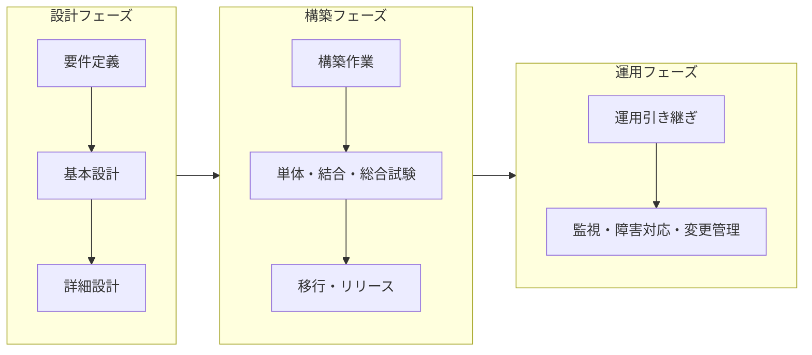
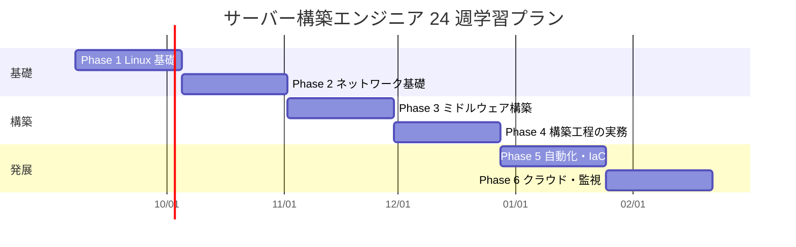

# サーバー構築エンジニア 学習プラン（未経験者向け・24 週）

> **本ドキュメントの位置付け**
>
> - これは **学習計画（これから実行する設計）** であり、実績ではありません。本人の到達状況は [STATUS.md](../../STATUS.md) と [証跡採録チェックリスト](../evidence-capture-checklist.md) を一次情報とします
> - 対象は **未経験からサーバー構築（インフラ構築）を目指す初心者**です。本人の学習設計であると同時に、同じ立場の人がそのまま使える形で書いています
> - 本リポジトリの「[新規設計を増やさない運用ルール](../evidence-capture-checklist.md)」の対象は **server-monitor の改善設計 06 以降**です。本書は改善設計ではなく学習計画であり、成果物は既存の証跡採録項目へ寄せています（[本ポートフォリオとの接続](#10-本ポートフォリオとの接続)）

最終更新: 2026-08-22（server-monitor Full-stack E2E 実測を反映）

---

## 目次

| ページ | 内容 |
| --- | --- |
| 本ページ | 対象・職種定義・24 週ロードマップ・学習時間・記録運用・到達度チェック |
| [01 学習環境の作り方](./01-environment.md) | PC 要件、仮想化ソフトの選び方、3 台構成ラボ、IP / 命名設計、課金事故の防止 |
| [02 フェーズ別カリキュラム](./02-curriculum.md) | 週単位の学習項目・ハンズオン課題・到達確認・つまずきやすい点 |
| [03 構築工程の実務ドキュメント](./03-build-process.md) | パラメータシート / 構築手順書 / 試験項目書 / 移行・切り戻しのテンプレート |
| [04 教材と資格の対応](./04-resources.md) | 書籍・無料教材・資格の対応表と費用の目安 |
| [05 Phase 1 演習設計](./05-phase1-exercise-design.md) | 03 のテンプレートを Phase 1（空の VM からの初期構築）へ適用した具体設計。**設計のみ・未実施** |
| [06 シェルスクリプト演習設計](./06-shell-scripting-exercise-design.md) | W4 / W18 のシェルスクリプト学習項目を、Linux（Bash）と Windows（PowerShell）の両方で基礎から実務（AD 操作・サービス・イベントログを含む）まで具体化した設計。**設計のみ・未実施** |
| [07 Python 運用自動化演習設計](./07-python-ops-automation-exercise-design.md) | 06 と同じ Phase 5（W18）の題材（定型作業・バックアップ・監視チェック）を、シェルではなく Python で Linux / Windows 両対応にする演習設計。**設計のみ・未実施** |
| [08 AD構築演習設計](./08-ad-exercise-design.md) | [Windows / AD 公開再現ラボ](../evidence/templates/windows-ad-lab.md)のフォレスト昇格・最小 OU 構成の先を、OU 階層・AGDLP グループ戦略・GPO・パスワードポリシー（既定 + 細分化）・FSMO 確認・ヘルスチェック・システム状態バックアップ／権威復元まで具体化した演習設計。実施キット（[ad-exercise-kit/](./ad-exercise-kit/README.md)、構文検証済みの `.ps1` 全 11 本）あり。**設計のみ・未実施** |
| [09 Zabbix 監視基盤構築演習設計](./09-zabbix-monitoring-exercise-design.md) | Phase 6（W23）の監視ハンズオンを、本ラボの主系統である Prometheus/Grafana とは別に Zabbix で具体化した補完演習。[career-bridge.md の概念対応表](../career-bridge.md#26-監視ツールの転用可能性prometheus--zabbix--jp1)を実機で検証する狙い。**設計のみ・未実施** |
| [10 Azure構築演習設計](./10-azure-foundational-exercise-design.md) | Phase 6（W21-W22）のクラウド・IaC ハンズオンを、本ラボの主系統である AWS + Terraform（[ADR-0005](../adr/0005-terraform-for-iac.md)）とは別に Azure で具体化した補完演習。ガバナンス/ID・ネットワーク・コンピュート・Terraform（`azurerm` provider）・監視/バックアップまで扱う。**設計のみ・未実施** |
| [11 AWS基礎構築演習設計](./11-aws-foundational-exercise-design.md) | Phase 6（W21-W22）の見出しだけのハンズオンを、VPC・EC2 1 台の最小構成でコンソール手動構築 → Terraform化 → `apply`/`destroy` まで具体化した演習設計。[STATUS.md の「Terraform 約 3,000 行が `apply` 0 回」](../../STATUS.md#コードでは埋められない残っている穴)を破る最初の一歩であり、[server-monitor 改善設計 03](../server-monitor-improvements/03-terraform-aws.md)の本番想定設計とは別物の前段演習。**設計のみ・未実施** |

---

## 1. 対象と前提

### 対象読者

- IT 実務未経験、または非 IT 職からの転職を目指している
- Linux をほとんど触ったことがない、または `ls` / `cd` 程度は分かる
- 自宅に PC が 1 台あり、週 10〜15 時間の学習時間を確保できる
- 座学だけでなく、**手を動かして壊して直す**進め方を受け入れられる

### 前提としない知識

プログラミング経験、ネットワーク機器の操作経験、クラウドの利用経験はいずれも前提としません。
必要になる範囲は各フェーズ内で扱います。

### このプランのゴール

24 週の終了時点で、次の状態を目指します。**「教材を読み終えた」ではなく「できる」で定義します。**

| # | ゴール | 確認方法 |
| --- | --- | --- |
| G1 | 空の仮想マシンから **Web / AP / DB の 3 層構成を単独で構築**できる | 手順書を見ながら 1 日以内に再構築し、ブラウザから応答を確認できる |
| G2 | 構築内容を **パラメータシート・構築手順書・試験項目書**の形で文書化できる | 他人が同じ手順で再現でき、試験項目書の全項目に実測結果が入っている |
| G3 | 「つながらない」を **L1 から L7 まで順番に切り分け**られる | 意図的に壊した環境で、原因の特定手順を口頭で説明しながら再現できる |
| G4 | 構築作業を **Ansible / Terraform でコード化**し、再実行できる | 2 回目の実行で変更が発生しない（冪等性を確認できる） |
| G5 | 監視・バックアップを設定し、**壊して復旧する演習**を実測できる | 検知から復旧までの所要時間を記録した演習ログがある |
| G6 | 上記を **面接で自分の言葉で説明**できる | 設計判断の理由を、選ばなかった選択肢と比較して説明できる |

> ゴールに「資格の合格」を入れていないのは、資格が不要という意味ではありません。
> 資格は[別ロードマップ](../certifications/roadmap.md)で管理し、本プランは**手を動かす側**を担当します。

### 本人の到達状況（自己採点）

このプランは他の人にも使える形で書いていますが、**本人がどこまで到達しているか**
を書かないと、計画だけが立派な文書になります。現時点の自己採点を残します。

最終更新: 2026-08-23

| # | ゴール | 状況 | 根拠 / 残っていること |
| --- | --- | --- | --- |
| G1 | 空の VM から Web / AP / DB の 3 層構成を単独で構築 | △ | [3 層ラボ](https://github.com/ns7jp/server-monitor/tree/main/labs/three-tier)を[実コンテナで実行](https://github.com/ns7jp/server-monitor/blob/main/docs/drills/logs/2026-08-24-B-2.md)（nginx / gunicorn / PostgreSQL、層を分離、9 PASS）。**コンテナ上の構成であり、空の VM に OS を入れて組んだ実績ではない**。この差分を埋める演習は [05 Phase 1 演習設計](./05-phase1-exercise-design.md)に設計済み（未実施） |
| G2 | パラメータシート・構築手順書・試験項目書として文書化 | ○ | [構築案件パック](https://github.com/ns7jp/server-monitor/tree/main/docs/build-package)。試験項目書の原本は引き渡し対象ホスト未定のため `NOT RUN`。記入済みの見本は演習の証跡が担当 |
| G3 | 「つながらない」を L1 から L7 まで順番に切り分け | △ | [L2 / L3 ラボ](https://github.com/ns7jp/server-monitor/blob/main/docs/drills/logs/2026-08-24-B-4.md)で静的ルート・`ip_forward`を実機実行（6 PASS）。VLAN ID 不一致は kernel が `CONFIG_VLAN_8021Q` を無効化していたため未検証。**物理スイッチ・ケーブル・ポート VLAN は未着手（L1 が残っている）** |
| G4 | Ansible / Terraform でコード化し、再実行できる | ○ | `site.yml` の一括適用と 2 回目 `changed=0` を[実測済み](https://github.com/ns7jp/server-monitor/blob/main/docs/evidence/2026-08-22-full-stack-e2e.md)。**Terraform は `validate` まで。`apply` は未実施** |
| G5 | 監視・バックアップを設定し、壊して復旧する演習を実測 | ○ | D-1 復旧演習 RTO 13 秒 / 1 秒を実測。DB の復元は [B-3 として実行済み](https://github.com/ns7jp/server-monitor/blob/main/docs/drills/logs/2026-08-24-B-3.md)（7 PASS、RTO 0.149 秒）。**B-1〜B-4 は全て実機実行済み** |
| G6 | 面接で自分の言葉で説明できる | △ | [つまずきログ](../../LEARNINGS.md)に症状 → 原因 → 対処 → 学びを記録。**AI 生成コードのうち、自分で説明できない深さのものを減らす作業が継続中** |

凡例: ○ = 根拠を出せる / △ = 一部のみ / × = 未着手

**残っている大きな穴は 3 つ。**

1. **恒久的に動いているホストが 1 台も無い。** すべて WSL2 / 使い捨て runner /
   コンテナ。再起動後の永続性、長期稼働、Slack 実配信、実 DNS / TLS が
   まとめてここで止まっている。
2. **空の VM に OS を入れるところからやっていない。** Phase 1（W1-W4）の
   OS インストール、ディスク設計、ユーザー設計は、コード側は用意したが
   実機での実施記録が無い。
3. **物理層（L1）に触っていない。** スイッチ、ケーブル、ポート VLAN。

この 3 つは計画を足しても埋まりません。実機で 1 回やる以外にありません。

---

## 2. サーバー構築エンジニアとは（運用との違い）

未経験者が最初につまずくのは、求人票の「インフラエンジニア」が**複数の異なる仕事**を指していることです。
学習の優先順位は職種によって変わるため、まず地図を持ちます。



図の要約：要件定義 → 設計 → 構築 → 試験 → 移行 → 運用引き継ぎ → 運用の順に進み、構築エンジニアは主に中央の構築フェーズを担当します。

### 職種ごとの担当範囲

| 職種 | 主な担当 | 未経験からの入りやすさ | 求められる中心スキル |
| --- | --- | --- | --- |
| 監視オペレーター | 監視画面の確認、一次対応、エスカレーション | 高い（夜勤・交代制が多い） | 手順書の遵守、報告の正確さ |
| 運用エンジニア | 定期作業、障害対応、変更作業、手順書の改善 | 中程度 | 切り分け、ログ調査、記録 |
| **構築エンジニア** | **設計に沿った構築、試験、移行、ドキュメント作成** | **中程度から低い** | **OS / ミドルウェア設定、手順書と試験の設計、正確さ** |
| 設計エンジニア | 要件定義、基本設計、方式選定 | 低い | 技術選定の根拠、非機能要件の整理 |

### 未経験からの現実的な経路

未経験の 1 社目でいきなり設計を任されることはほとんどありません。実際には次の経路が一般的です。

1. **監視・運用で入り、手順書を作る側に回る** → 構築案件へアサインされる
2. **構築案件のメンバーとして入り、手順書どおりの作業と試験から始める** → 設計の一部を任される

どちらの経路でも、最初に評価されるのは「**手順どおり正確に作業し、結果を記録できるか**」です。
本プランが Phase 4 で構築ドキュメントに 4 週を割いているのは、この評価軸が技術知識と同じくらい重いためです。

### 構築と運用の重なり

構築と運用は対立しません。構築の質は運用のしやすさで決まり、運用の経験は構築の設計判断に返ります。
本ポートフォリオの第一志望は [Linux サーバー構築・運用](../target-roles.md) です。
未経験採用の求人では「構築・運用」が一体で募集されることが多いため、本プランは**運用の学習と競合しません**。
差分は Phase 4（構築工程のドキュメント）に集約しています。

---

## 3. 全体ロードマップ（24 週）



図の要約：Linux → ネットワーク → ミドルウェア → 構築工程 → 自動化 → クラウド・監視の順に、各 4 週で 6 フェーズを進めます。開始日は仮置きです。

> この Gantt は理想的な参照スケジュールであり、実際の学習はこの暦どおりには進んでいません。実績は[本人の現在地](#10-本ポートフォリオとの接続)の表を参照してください。

### フェーズ一覧

| Phase | 週 | テーマ | 到達目標 | 成果物 |
| --- | --- | --- | --- | --- |
| 1 | W1-4 | Linux 基礎 | 1 台の Linux を初期構築し、サービス・ログ・ディスクを扱える | 初期構築手順書 v1 |
| 2 | W5-8 | ネットワーク基礎 | 疎通しない原因を L1 から L7 まで順に切り分けられる | 切り分け一次メモ |
| 3 | W9-12 | ミドルウェア構築 | Web / AP / DB の 3 層構成を TLS 付きで構築できる | 3 層構成ラボ一式 |
| 4 | W13-16 | 構築工程の実務 | 設計 → 構築 → 試験 → 移行の文書一式を作れる | パラメータシート / 手順書 / 試験項目書 |
| 5 | W17-20 | 自動化・IaC | 構築作業を Ansible / Docker で再実行可能にする | Ansible role とコンテナ構成 |
| 6 | W21-24 | クラウド・監視 | クラウド上に再構築し、監視・バックアップ・復旧まで通す | 監視ダッシュボードと復旧演習ログ |

各週の詳細は [02 フェーズ別カリキュラム](./02-curriculum.md) を参照してください。

### フェーズを飛ばしてよい条件

学習開始時点で経験がある場合、次の条件を満たせるフェーズは短縮できます。**自己申告ではなく、実機で確認します。**

| Phase | 短縮してよい条件 |
| --- | --- |
| 1 | 空の VM から SSH 鍵ログイン・sudo・systemd サービス化・ログ確認までを、調べながら 2 時間以内に完了できる |
| 2 | `ss` / `dig` / `traceroute` / `tcpdump` の出力を見て、どこで止まっているかを説明できる |
| 3 | Nginx のリバースプロキシと TLS を設定し、証明書の期限切れを検知する方法を説明できる |
| 5 | Ansible playbook を 2 回流して差分が出ないことを確認できる |

---

## 4. 学習時間の設計

### 標準ペース（週 15 時間・24 週・合計約 360 時間）

| 区分 | 時間 | 使い方 |
| --- | --- | --- |
| 平日 5 日 | 1.5h × 5 = 7.5h | インプット（読む・見る）と、短いハンズオン |
| 土曜 | 4h | まとまったハンズオン（構築・試験） |
| 日曜 | 3h | 記録の整理、詰まった箇所の復習、週次レビュー |

### ペース別の所要期間

| 週あたりの時間 | 想定 | 所要期間 |
| --- | --- | --- |
| 20h 以上 | 求職中・学習に専念 | 約 18 週 |
| 15h | 標準（在職中で計画的に確保） | 24 週 |
| 8-10h | 在職中・家庭の都合あり | 約 36-40 週 |

**期間を延ばすのは失敗ではありません。** 失敗は「計画を放置して現状と乖離させること」です。
遅れたら[週次レビュー](#6-記録と振り返りの運用)で計画そのものを更新し、更新した事実を記録します。

### 時間が取れない場合の縮退版（12 週）

転職活動を先に始めるなど、24 週を待てない場合は次の順で削ります。**削る順番には理由があります。**

1. Phase 6 のクラウドを **AWS の無料枠で EC2 を 1 台立てて壊す**だけに縮小（W21-24 → 1 週）
2. Phase 5 の Terraform を後回しにし、**Ansible と Git だけ**に絞る（W17-20 → 2 週）
3. Phase 2 の座学を削り、**切り分け演習だけ**残す（W5-8 → 2 週）
4. **Phase 1・3・4 は削らない**（構築職の評価軸そのもののため）

> 縮退版でも成果物 G1・G2・G3 は残します。「広く浅く触った」より
> 「3 層構成を 1 つ、文書と試験まで作り切った」ほうが未経験選考では評価されます。

---

## 5. 進め方の 5 原則

| # | 原則 | 具体的な行動 | 破るとどうなるか |
| --- | --- | --- | --- |
| 1 | **手を動かす前に読み切らない** | 教材は 1 章読んだら必ず VM で実行する | 読了しても手が動かず、面接で説明できない |
| 2 | **壊してから直す** | 設定ファイルをわざと壊し、復旧してからスナップショットへ戻す | 正常系しか知らず、障害時に固まる |
| 3 | **その日のうちに記録する** | コマンド・エラー全文・原因・対処を[つまずきログ](../../LEARNINGS.md)形式で残す | 1 か月後に何も再現できない |
| 4 | **他人に説明できる形にする** | 週末に「なぜその設定にしたか」を 3 行で書く | 手順を覚えただけになり、応用が効かない |
| 5 | **やったこととやっていないことを区別する** | 「構築した」「コードは書いたが動かしていない」を書き分ける | 面接で深掘りされた瞬間に信頼を失う |

原則 5 は本ポートフォリオ全体の方針と同じです（[STATUS.md §0](../../STATUS.md)）。
未経験者にとって、**正確な自己申告そのものが評価対象**になります。

---

## 6. 記録と振り返りの運用

学習は「続いた記録」が残らないと証明できません。次の 3 層で管理します。

| 頻度 | やること | 残す場所 |
| --- | --- | --- |
| 毎日 | 実行したコマンドとエラー全文を貼る（清書しない） | 作業メモ（テキスト 1 枚） |
| 毎週 | 週次テンプレを 5 分で埋める | GitHub Issue へコメント |
| 毎月 | 計画と実績の差を確認し、**計画側を更新**する | 本ページと[資格ロードマップ](../certifications/roadmap.md) |

### 週次テンプレート

```text
## Week NN（YYYY-MM-DD 〜 YYYY-MM-DD）

- 予定していたこと:
- 実際にやったこと:
- 動かせたもの（成果物へのリンク）:
- 詰まったこと（症状 → 原因 → 対処）:
- 次週やること:
- 学習時間: 合計 N.N h
```

**進まなかった週も 1 行残します。**「今週は進まず。理由: 〇〇」で構いません。
記録が途切れないこと自体が、継続力の証跡になります（本リポジトリの[運用ルール](../../STATUS.md)と同じ考え方）。

### 月次レビューで確認すること

1. 遅れているフェーズはどれか。遅れの原因は時間不足か、難易度か、環境トラブルか
2. 難易度が原因なら、教材を変えるか、前提となる章へ戻る
3. 環境トラブルが原因なら、[01 学習環境](./01-environment.md)のスナップショット運用を見直す
4. 予定日を過ぎた項目は、**必ず新しい日付に更新する**（放置しない）

---

## 7. 到達度チェック

各フェーズ終了時に、下記を**実機で**確認します。すべて「調べながらで可」ですが、
**手順書を見ずに何をすべきか判断できる**ことが条件です。

### Phase 1（Linux 基礎）

- [ ] 新規 VM に OS を入れ、作業用ユーザー作成 → SSH 鍵ログイン → root ログイン禁止まで設定できる
- [ ] `systemctl` でサービスを起動・自動起動設定し、失敗時に `journalctl` で原因を追える
- [ ] ディスク使用率 100% の状態を作り、原因のファイルを特定して復旧できる
- [ ] cron / systemd timer で定期実行を設定し、実行されたことをログで確認できる
- [ ] パーミッション起因のエラーを、`ls -l` と `id` の出力から説明できる

### Phase 2（ネットワーク基礎）

- [ ] `/24` `/26` などのサブネットで、使えるホスト数とブロードキャストアドレスを暗算できる
- [ ] 名前解決の流れを `dig +trace` の出力で説明できる
- [ ] ファイアウォールでポートを閉じ、`ss` と `tcpdump` で「閉じている」ことを確認できる
- [ ] 「ping は通るが HTTP が返らない」状態を作り、原因を切り分けられる
- [ ] SSH の踏み台経由接続とポートフォワードを設定できる

### Phase 3（ミドルウェア構築）

- [ ] Nginx でバーチャルホストとリバースプロキシを設定できる
- [ ] 自己署名証明書で HTTPS 化し、期限と発行者を `openssl` で確認できる
- [ ] DB を導入し、専用ユーザーに必要最小限の権限だけ付与できる
- [ ] DB のバックアップを取得し、**別の空 DB へリストアして中身を確認**できる
- [ ] 3 層すべてを再起動しても、サービスが自動で復帰する

### Phase 4（構築工程の実務）

- [ ] 自分のラボのパラメータシートを埋め、他人が同じ環境を作れる
- [ ] 構築手順書に「想定結果」と「切り戻し手順」が書かれている
- [ ] 試験項目書に正常系と異常系の両方があり、実測結果が入っている
- [ ] エビデンスに実行日時・対象・コマンド・出力が揃い、秘密値がマスクされている
- [ ] 作業を中断・中止する判断基準を、自分の言葉で説明できる

### Phase 5（自動化・IaC）

- [ ] Ansible playbook を 2 回実行し、2 回目に `changed=0` になる
- [ ] 手動構築した内容を role へ落とし込み、新しい VM へ適用できる
- [ ] Git でブランチを切り、変更理由が分かるコミットメッセージを書ける
- [ ] Docker Compose で同じ 3 層構成を起動できる

### Phase 6（クラウド・監視）

- [ ] クラウド上に VM を作成し、**使い終わったら確実に削除**できる
- [ ] 予算アラートを設定し、想定外の課金に気付ける状態にしている
- [ ] 監視ツールで CPU / メモリ / ディスク / プロセス死活を可視化できる
- [ ] 意図的に障害を起こし、通知が飛ぶことを確認できる
- [ ] 復旧までの所要時間を計測し、記録に残せる

---

## 8. よくある失敗と対策

未経験者の学習が止まる原因は、技術の難しさよりも**進め方の設計ミス**であることが多いため、先に対策を決めておきます。

| 失敗パターン | 何が起きるか | 対策 |
| --- | --- | --- |
| 教材の写経で終わる | 手順は再現できるが、1 か所変わると動かせない | 各章の最後に「教材と違う条件」で 1 回やり直す |
| 環境構築で 2 週間溶かす | 本題に入る前に意欲が尽きる | [01 学習環境](./01-environment.md)の構成をそのまま使い、迷ったら Ubuntu LTS を選ぶ |
| 壊すのが怖くて触れない | 正常系しか経験できない | 触る前に必ずスナップショットを取る。壊すのは作業ではなく**演習** |
| 記録を後でまとめようとする | エラー全文を思い出せず、学びが消える | エラーは**その場でコピペ**。清書は週末 |
| 資格の勉強に逃げる | 座学は進むが、手が動かない | 週の学習時間の **半分以上をハンズオン**に固定する |
| 手を広げすぎる | Kubernetes まで浅く触り、深掘りに耐えられない | 24 週の範囲外は「興味リスト」に書くだけにする |
| 完成するまで公開しない | 選考に間に合わない | 未完成でも公開し、`途中`と明記する。[応募開始を成果物の完成と連動させない](../../STATUS.md) |
| 情報の鮮度を確認しない | EOL 済みのソフトを前提に設計してしまう | 採用時に必ず公式のサポート期限を確認する（[実例](../../LEARNINGS.md)） |

---

## 9. 資格との対応

資格は**学習の順序付けとペースメーカー**として使い、合格そのものを目的にしません。
時期・優先順位の判断は[資格取得ロードマップ](../certifications/roadmap.md)に集約しています。

| Phase | 対応する資格 | 使い方 |
| --- | --- | --- |
| 1 | LPIC-1 101 | ハンズオンで触れていない範囲の穴埋めに使う |
| 2 | CCNA / 基本情報（テクノロジ系） | 用語と体系の整理に使う。機器操作は Packet Tracer で代替 |
| 3-4 | LPIC-1 102 | サービス・セキュリティ・スクリプトの範囲がそのまま重なる |
| 5-6 | AWS SAA | クラウド設計の共通語彙を得る |

詳細な教材と費用は [04 教材と資格の対応](./04-resources.md) を参照してください。

---

## 10. 本ポートフォリオとの接続

### 成果物の置き場所

本プランの成果物は**新しい設計書を増やさず**、既存の導線へ接続します。

| 成果物 | 置き場所 |
| --- | --- |
| 手を動かした一次記録 | [LEARNINGS.md](../../LEARNINGS.md) |
| 実機の画面・ログ・実測値 | [証跡採録チェックリスト](../evidence-capture-checklist.md)の該当項目 |
| 構築ドキュメント一式 | [03 構築工程の実務ドキュメント](./03-build-process.md)のテンプレートを使い、server-monitor 側へ配置 |
| 学習の進捗 | GitHub Issue（月 1 回更新） |

### 本人の現在地（2026-08 時点の自己申告）

同じ 6 フェーズに、本人の到達状況を当てはめたものです。**実測証跡の有無は
[STATUS.md](../../STATUS.md) の区分に従い、コード実装と実行実績を分けています。**

| Phase | 状況 | 根拠 | 残っている差分 |
| --- | --- | --- | --- |
| 1 Linux 基礎 | おおむね通過 | server-monitor をローカル Linux + Docker で構築済み | LPIC-1 101 で体系の穴を埋める |
| 2 ネットワーク | 障害ラボと使い捨て runner 内の境界検証は実測済み | [二セグメント障害ラボ](https://github.com/ns7jp/server-monitor/blob/main/docs/evidence/2026-08-19-network-drill.md)に加え、[PR #75 Full-stack E2E](https://github.com/ns7jp/server-monitor/blob/4a292026b569dd1a522c0f2913b4ad40aeccebe7/docs/evidence/2026-08-22-full-stack-e2e.md#pr-75-hardening後の再検証)で network / UFW、loopback bind、別 Docker namespace からの直接遮断と SSH tunnel を PASS | 独立した管理端末・引き渡し対象ホスト・組織 DNS で同じ試験を採録する |
| 3 ミドルウェア | Web / AP は通過 | Nginx / Gunicorn / TLS を実装済み | DB は[今後の興味リスト](../roadmap/README.md)の段階。リストア試験が未実施 |
| 4 構築工程 | 成果物作成済み・使い捨て runner の一気通貫試験は完了 | [構築案件パック](https://github.com/ns7jp/server-monitor/tree/main/docs/build-package)を作成。2026-08-19 の[試験結果票](https://github.com/ns7jp/server-monitor/blob/main/docs/evidence/2026-08-19-build-validation.md)（11/21 PASS）は履歴として保持し、[PR #75 Full-stack E2E](https://github.com/ns7jp/server-monitor/blob/4a292026b569dd1a522c0f2913b4ad40aeccebe7/docs/evidence/2026-08-22-full-stack-e2e.md#pr-75-hardening後の再検証)は disposable Ubuntu 24.04 上で 23/23 PASS | Docker 未導入の独立した引き渡し対象ホストで構築・受入・再起動後試験を採録する |
| 5 自動化・IaC | Ansible の runner 実測済み・Terraform 適用待ち | [4 ロールの full Molecule](https://github.com/ns7jp/server-monitor/blob/main/docs/evidence/2026-08-17-molecule.md)に加え、[PR #75 E2E](https://github.com/ns7jp/server-monitor/blob/4a292026b569dd1a522c0f2913b4ad40aeccebe7/docs/evidence/2026-08-22-full-stack-e2e.md#pr-75-hardening後の再検証)で `site.yml` 一括適用と 2 回目 `changed=0` を PASS。Terraform コードあり | 独立対象ホストへの適用と AWS `plan / apply / destroy` を採録する |
| 6 クラウド・監視 | ローカル監視・runner 内 D-1 / restore 実測済み | D-1 は[2026-08-19 の RTO 13 秒](https://github.com/ns7jp/server-monitor/blob/main/docs/drills/logs/2026-08-19-D-1.md)を履歴として保持。[PR #75 E2E](https://github.com/ns7jp/server-monitor/blob/4a292026b569dd1a522c0f2913b4ad40aeccebe7/docs/evidence/2026-08-22-full-stack-e2e.md#pr-75-hardening後の再検証)では RTO 1 秒、local webhook の FIRING / RESOLVED、3 volumes の backup / restore を PASS | Slack 実配信、D-2、AWS 適用、再起動後・長期稼働ホストを採録する |

> **この表の読み方**: 2026-08-22 の完了範囲は使い捨て GitHub-hosted runner 内に限ります。
> Slack 実配信、AWS、D-2、独立した管理端末・引き渡し対象ホストでの試験を完了扱いにはしません。
> 次の優先補強点は、独立対象環境での再実施と未実測項目の採録です。

---

## 関連ドキュメント

- [01 学習環境の作り方](./01-environment.md)
- [02 フェーズ別カリキュラム](./02-curriculum.md)
- [03 構築工程の実務ドキュメント](./03-build-process.md)
- [04 教材と資格の対応](./04-resources.md)
- [05 Phase 1 演習設計](./05-phase1-exercise-design.md)
- [06 シェルスクリプト演習設計](./06-shell-scripting-exercise-design.md)
- [07 Python 運用自動化演習設計](./07-python-ops-automation-exercise-design.md)
- [08 AD構築演習設計](./08-ad-exercise-design.md)
- [09 Zabbix 監視基盤構築演習設計](./09-zabbix-monitoring-exercise-design.md)
- [10 Azure構築演習設計](./10-azure-foundational-exercise-design.md)
- [11 AWS基礎構築演習設計](./11-aws-foundational-exercise-design.md)
- [資格取得ロードマップ](../certifications/roadmap.md)
- [証跡採録チェックリスト](../evidence-capture-checklist.md)
- [志望トラックと証跡の対応](../target-roles.md)
- [現場経験とインフラ運用の橋渡し](../career-bridge.md)
- [学習の一次記録（つまずきログ）](../../LEARNINGS.md)
- [ポートフォリオ進捗 STATUS](../../STATUS.md)
