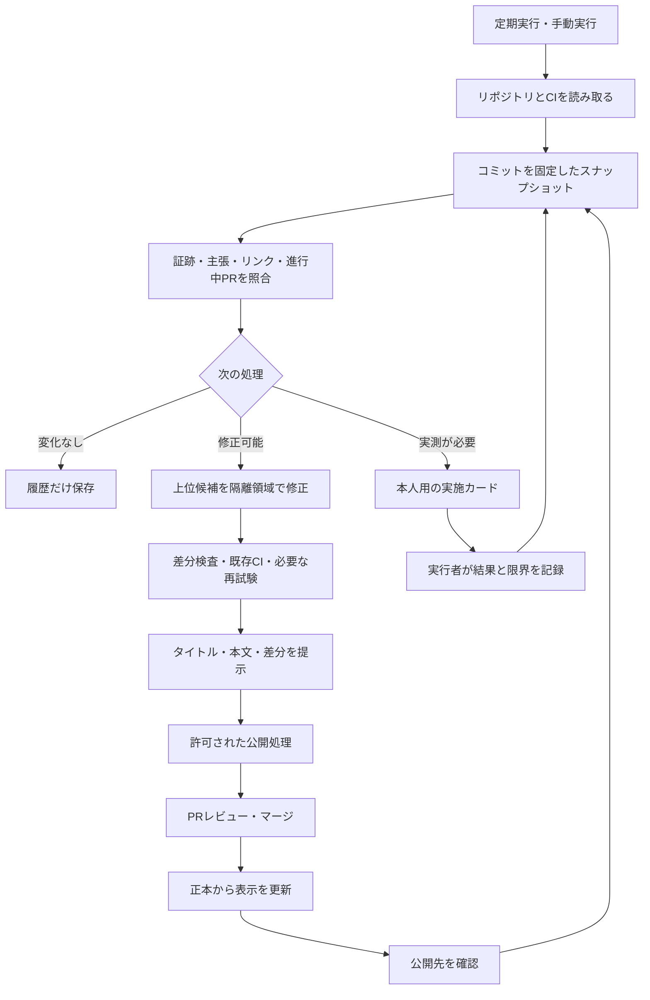

# サーバー構築エンジニア向け ポートフォリオ継続改善システム 詳細設計

設計日：2026-09-07（JST）／対象：ns7jp／版：1.0

**採用する構成：GitHub Actionsによる定期監査 → 根拠付き改善キュー → 小さな修正案 → 既存CIによる検証 → 本人の公開判断 → 公開後確認。**

目的は、サーバーの「設計・構築・試験・監視・復旧・引き渡し」を、第三者が追試でき、本人が説明できる状態へ近づけること。コード量、記事数、コミット数を増やすことは成果指標にしない。

この文書は詳細設計とローカル判定の試作品を扱う。2026-09-07の初回設計作業時点ではGitHubへのpush・PR作成を行っておらず、その後、公開用PRとして本リポジトリへの配置を準備した。定期実行登録、クラウド契約、サーバー操作は未実施。この文書の「自動」は導入後の目標動作を表す。

## 1. 現状から決めた設計方針

### 1.1 調査の基点

公開リポジトリをGitHub接続から読み取り、次のmainを確認した。調査は2026-09-07に実施。以下は参照時点のスナップショットで、今後の実行時には更新する。

| 役割 | リポジトリ | 確認したmainコミット |
| --- | --- | --- |
| 主作品・実測の正本 | [ns7jp/server](https://github.com/ns7jp/server) | 7f7e5c9d792faef2569d02e181399effa9ba56d5 |
| プロフィール・職歴・学習状況 | [ns7jp/ns7jp](https://github.com/ns7jp/ns7jp) | 0e813b66f6581dd937dd56b07beeefa5e7feb386 |
| 採用担当者向け表示 | [ns7jp/ns7jp.github.io](https://github.com/ns7jp/ns7jp.github.io) | 50b5d9de24b433d0d810d8ab9ca7d23a4826713c |
| 関連教材 | [ns7jp/automation](https://github.com/ns7jp/automation) | 今回はREADME・構成のみ確認 |

旧名server-monitorの記述が残るが、現在の主作品名はserver。設定はrepository IDを識別の軸にし、別名を補助情報として保持する。名前の変更だけで別作品として集計しない。

Webのプロフィール取得結果には古いREADMEが出た一方、GitHubから取得した現行READMEには9月4日のUbuntu／AlmaLinux基盤構築が反映されていた。したがって「現行READMEが未更新」という指摘は採用しない。これを監査の必須要件に落とし込み、検索結果やキャッシュだけから不備を断定しない。[現行READMEの確認基点](https://github.com/ns7jp/ns7jp/blob/0e813b66f6581dd937dd56b07beeefa5e7feb386/README.md)

### 1.2 継承する既存資産

| 確認した資産 | 設計への反映 |
| --- | --- |
| serverの証跡台帳は実行環境と対象範囲を分離している | 台帳を正本として残し、機械可読な索引を追加する |
| Ubuntu VMはfoundation.ymlの基盤構築、AlmaLinuxは再利用VMでの適用・冪等性を記録 | site.yml全体、まっさらな新規構築、最小公開への拡大解釈を禁止する |
| 過去のE2Eは使い捨てrunnerの結果 | 最新コミットや永続ホストの保証へ転用しない |
| STATUS.mdは職歴、実測、欠陥、優先順位の正本を既に指定 | 正本の役割を維持し、サイトは同期先にする |
| LEARNINGS.mdは本人のみが編集する運用 | 自動編集の保護対象にする。本人への記入項目の提示まで |
| Full-stack E2E、Molecule、サイト静的検査が既存 | 新CIを大量に複製せず、実行結果と必要な差分検証を再利用 |
| 作業終了判断のgate.mjsが既存 | 既存のsecurity／functional／recovery／handover判定を終了時の補助に使う |

根拠：[証跡台帳](https://github.com/ns7jp/server/blob/7f7e5c9d792faef2569d02e181399effa9ba56d5/docs/evidence/README.md)、[正本と運用ルール](https://github.com/ns7jp/ns7jp/blob/0e813b66f6581dd937dd56b07beeefa5e7feb386/STATUS.md)、[既存の終了判定](https://github.com/ns7jp/server/blob/7f7e5c9d792faef2569d02e181399effa9ba56d5/docs/work-completion/automation/README.md)。

### 1.3 現在の改善候補

「確認できた事実」と「これから行う改善提案」を区別する。優先度は本設計の提案であり、採用確率の予測ではない。

| 優先 | 改善候補 | 根拠・完了条件 |
| --- | --- | --- |
| P1 | コミットと実行範囲を固定した横断監査 | 3リポジトリのSHA、取得時刻、出典が全候補に付く |
| P1 | 最新の要約と履歴を分ける | STATUS内の古い「AD／AlmaLinuxが公開されていない」記述は、9月の証跡と照合する。歴史的記録なら残し、現在の残件だけ別に生成する |
| P1 | 既存のAnsible改善PRの経過を取り込む | 調査時に[PR #160](https://github.com/ns7jp/server/pull/160)と[PR #161](https://github.com/ns7jp/server/pull/161)がopen。同じ修正を別PRにしない |
| P2 | 証跡の厳密な対象版を補う | Ubuntu結果票は短縮SHA、AlmaLinux結果票は「537d9be相当」。実行時差分まで確認できないものは歴史的記録として保持し、機械的な最新保証を止める |
| P2 | 新規AlmaLinux VMでの最小公開・構築 | 再利用VMの成功を保持し、別の新規VM結果票で受入条件を満たす |
| P2 | 監視全体の独立ホスト構築・永続性・復旧 | 既存の未実測計画から月1件以上の実測へ進む |
| P2 | 本人による説明と第三者のレビュー | 本人が設計理由、失敗原因、戻し方を説明した記録を残す。自動生成で代替しない |
| P3 | 見出し・リンク・説明文の整理 | 検証証跡への到達性を改善し、既存説明を重複させない |

VM検証の根拠：[Ubuntu結果票](https://github.com/ns7jp/server/blob/7f7e5c9d792faef2569d02e181399effa9ba56d5/docs/evidence/2026-09-04-ansible-foundation-build.md)、[AlmaLinux結果票と未完了範囲](https://github.com/ns7jp/server/blob/7f7e5c9d792faef2569d02e181399effa9ba56d5/docs/evidence/2026-09-04-ansible-foundation-el9-build.md)。

## 2. 到達目標と自動化の境界

### 2.1 三つの到達目標

1. 採用担当者が入口から主作品・役割・証跡・未実施の範囲を短時間で理解できる。
2. 技術担当者が要件ID → 設計 → コード → 試験ID → 実出力 → 復旧手順を追える。
3. 本人がAIの助けを受けた範囲を含め、操作と判断を自分の言葉で説明できる。

### 2.2 実行権限

| 処理 | 初期運用 | 担当 |
| --- | --- | --- |
| 公開リポジトリ、CI、既存PRの読み取り | 自動 | 収集処理 |
| 不整合検知、優先順位、重複判定、ローカルレポート | 自動 | 決定的な判定処理 |
| 許可された文書区画の修正案作成 | 隔離作業領域で自動 | 修正処理・任意のAI |
| インフラコード、依存更新、試験の変更案 | 影響分析後、隔離環境で検証 | 修正処理と本人 |
| ブランチpush・Issue作成・PR作成 | 初期は内容確認後に本人が承認 | 公開処理 |
| PRのマージ、サイト公開 | 必須チェックと本人の判断 | 本人 |
| VM新規構築・停止・再起動・復元・Firewall変更 | 対象と手順を指定した個別実施枠 | 本人／承認済みラボ実行処理 |
| AWS apply、destroy、課金リソース、Slack実配信 | 対象・予算・宛先を含む別の実施承認 | 本人 |
| 職歴・資格取得・個人の学びの確定 | 本人が記入 | 本人 |

初期設定はpublish_enabled=false、auto_merge=false、lab_execution_enabled=false。運用開始後に、文書限定PRなどの継続的な許可を本人が与えた場合は、その範囲を記録して再利用する。既に許可された操作を毎回確認する仕組みにはしない。

## 3. 全体構成



主な追加先はns7jp/ns7jpのtools/portfolio-audit/とする。個人プロフィールのリポジトリが3リポジトリをまとめる。serverには証跡索引、サイトには生成済みデータと表示だけを置く。既存automationリポジトリは学習用案件集なので、今回の制御機構を混在させない。

データ処理だけの小規模構成で始め、専用サーバー、DB、常時稼働ダッシュボードは初期必須にしない。

## 4. データと正本

### 4.1 追加するファイル

| 配置案 | 内容 |
| --- | --- |
| ns7jp: tools/portfolio-audit/policy.json | 対象、権限、閾値、保護パス |
| ns7jp: tools/portfolio-audit/claims.json | 公開してよい主張と証跡IDの対応 |
| ns7jp: tools/portfolio-audit/backlog.json | 改善ID、状態、根拠、関連PR、次の行動 |
| ns7jp: tools/portfolio-audit/scripts/ | 収集・検証・順位付け・生成 |
| server: docs/evidence/index.json | 日付付き原本を指す機械可読索引 |
| server: docs/evidence/YYYY-MM-DD-*.md | 実行結果の原本。過去の結果を上書きしない |
| ns7jp.github.io: data/portfolio.json | 承認済み索引から生成した表示用データ |
| 各リポジトリ: .github/workflows/ | 既存検証と接続するワークフロー |
| 非公開の実行履歴領域 | 監査スナップショット、差分案、未公開ログ、通知状態 |

最初からREADME全体を生成しない。証跡一覧などの明示的な生成区画だけを置換し、人物紹介・設計理由・LEARNINGS.mdは保護する。区画マーカーが欠落・重複したら編集を停止する。

### 4.2 証跡レコード

| 項目 | 必須性・意味 |
| --- | --- |
| schema_version、id、project_id | 必須。IDはプロジェクト内の一意な固定値 |
| scope、test_id、requirement_id | 必須。foundation.ymlとsite.yml、OS、試験体系を混同しない |
| result | PASS／FAIL／NOT_RUN／BLOCKED／SKIP_ENV。空欄はUNKNOWNとして受付保留 |
| environment.kind | ci-runner／container／local-vm／persistent-host／network-namespaceなど |
| environment.os、lifecycle | OS版、fresh／reused／ephemeral。単に「実機」としない |
| executor、assistance、owner_explained | 実施者、AI支援、本人の説明確認。相互に独立 |
| executed_at、collected_at | 実行日時と取得日時。文書更新日で実測日を更新しない |
| subject.commit_sha | 対象コードの完全SHA。原本を保存したコミットとは別 |
| subject.dirty、patch_sha256 | 未コミット差分の有無と、その差分の識別値 |
| dependencies、image_digests | 構成ファイル、OSイメージ、依存の版 |
| expected、observed、exit_code | 合格条件、実出力の要点、実際の終了状態 |
| evidence_url、artifact_sha256 | 公開可能な原本・ログの位置と内容ハッシュ |
| limitations、not_run | 証明していない範囲と未実施項目 |
| review | 技術レビュー、秘密情報除去確認、公開可否 |

一つの結果票に異なる実行者・環境・日が混在する場合は、試験ID単位に子レコードへ分解する。Ubuntu結果票の静的検査とHyper-V上の実適用を同一の「本人VMでPASS」と集約しない。

旧証跡に情報がない場合はnullとneeds_reviewを使う。後から実出力やSHAを推測して補完しない。短縮SHAを解決できても、未コミット差分や「相当」と書かれた意味まで確定したことにはならない。

### 4.3 過去の成功と最新性を分ける

実測結果resultは履歴として保持する。別フィールドでcurrent／historical／revalidation_required／unknownを持つ。

例：8月のE2EがPASSで9月にコードが変わった場合、8月の結果をFAILにせず、9月の対象版についてrevalidation_requiredとする。古い成功が自動的に最新成功へ昇格することもない。

表示する主張は、要件・試験範囲・環境・対象版・実施者が一致する証跡に限定する。RTOは障害開始／検知／サービス復旧など測定の起点と終点を添え、異なる環境の秒数を優劣として合算しない。

### 4.4 原本と表示の同期

1. 原本の実測を記録し、証跡索引をレビューする。
2. 承認した索引のコミットと内容ハッシュでgeneration_idを作る。
3. プロフィールとサイトの表示用データにgeneration_idとsource_revisionを付ける。
4. 各同期先のPRを関連付ける。同時にマージされたと仮定しない。
5. 正本 → プロフィール → サイトの順に反映し、全先のgeneration_id一致を確認する。
6. 同期途中はSYNC_PENDING。片方が失敗したら残りだけ再試行し、正本の実測履歴を巻き戻さない。

## 5. 収集と監査の処理

### 5.1 収集の手順

1. repository ID、現在名、default branch、head SHAを取得する。
2. そのSHAを指定してREADME、STATUS、台帳、対象設定、workflowを取得する。
3. open PR、変更パス、head SHA、関連チェックを取得する。ページネーションを完了する。
4. 収集末尾にbranchを再取得する。途中でHEADが動いたら今回を一貫した過去スナップショットとして扱い、修正直前に再取得する。
5. observed_at、API状態、取得漏れ、ETag、原文ハッシュを保存する。
6. 取得先リポジトリのコードはこの段階では実行しない。

部分取得、403、429、タイムアウトを「ファイルなし」「CI成功」「PRなし」へ置き換えない。収集不全ならUNKNOWNを返し、依存する修正・公開を止める。ツリーがtruncatedの場合はディレクトリ単位に再取得する。

### 5.2 監査規則

| 規則ID | 検知内容 | 判定・動作 |
| --- | --- | --- |
| EV-01 | PASS主張に証跡IDがない | P1、主張の公開を保留 |
| EV-02 | 環境・scope・対象版の不一致 | P1、拡大解釈の修正候補 |
| EV-03 | 完全SHA／dirty状態など来歴不足 | P2、原本確認または再実行候補 |
| EV-04 | 前提ファイル・依存・OSが証跡後に変更 | 現行版の再検証候補 |
| EV-05 | 結果票と本文のPASS／NOT RUNが矛盾 | 意味確認後に修正。単純な語句一致だけでは確定しない |
| SY-01 | 同期先generation_idが正本と異なる | P1、同期待ちを表示 |
| LK-01 | 内部リンク／アンカー切れ | P2、正しい移動先が確認できれば修正案 |
| LK-02 | 外部リンク失敗 | 403はアクセス不明、429は待機、404/410は別時点でも確認 |
| CI-01 | 必須の対象head SHAのチェック未実施・失敗 | 公開ゲートを不合格にする |
| CI-02 | skip／cancelled／timeoutを成功扱い | P1、実施条件と必須対象を修正 |
| DP-01 | 既存PRとrule／scope／変更パスが重なる | 既存PRへ関連付け、別PRを抑止 |
| HM-01 | 実測、本人説明、第三者確認が必要 | AWAITING_LABまたはAWAITING_OWNER |
| SC-01 | 秘密情報・未許可の公開範囲を検出 | P0、公開処理停止、値を転載せず報告 |

時間による目安は、監査の観測は48時間、日常の監視確認は7日、基盤再現性は30日を初期案とする。期限だけで過去PASSを失効させず、現行保証の要否を見直す。証跡の真実性・本人の理解・文脈上の矛盾は機械判定だけでは確定できない。

## 6. 改善候補の選択と重複防止

### 6.1 候補の形式

各候補にid、rule_id、repository ID、scope、根拠URL、対象SHA、期待する改善、変更候補パス、検証方法、戻し方、本人作業の有無、関連PR、状態、再開条件を持たせる。

fingerprintは「repository ID＋rule_id＋scope＋ソートした対象パス」のハッシュとし、日付や行番号は含めない。新しい観測は既存候補へ追加する。候補を閉じても履歴を残し、同じ問題が再発したら同じ系列で再開する。

PRの題名だけで重複判定しない。完全な変更パス一覧、目的、依存関係を照合する。変更パスが重なるだけのときは自動統合せずレビュー待ちにする。PRがclosedでもmergedかどうかを別に確認する。

### 6.2 優先順位

P0は点数に関係なく最優先。その他は次の暫定式で同一優先度内を並べる。

```text
score = (5 × 職種適合 + 5 × 証跡の増加 + 3 × 再現性向上 + 2 × 読みやすさ) / (作業量 + 2 × 変更リスク)
```

各価値は0〜5、作業量は1〜5、変更リスクは0〜5。本人の実測時間とレビュー時間も作業量へ含める。点数は説明可能な並べ替えの道具で、合格率や採用可能性の推定ではない。

初期上限は1回1テーマ、同時修正1件、公開待ちPR全体3件、通常差分5ファイル／250変更行、修正再試行2回。複数ページの事実同期など、必要なまとまりが超える場合は理由付きで枠を再設定し、不完全な同期で終えない。

### 6.3 状態遷移

```text
DETECTED → TRIAGED → READY → PATCHED → VERIFIED → AWAITING_PUBLICATION
→ PR_OPEN → REVIEWED → MERGED → POSTCHECKED → CLOSED
```

分岐はDUPLICATE、WAITING_DEPENDENCY、AWAITING_LAB、AWAITING_OWNER、NEEDS_INPUT、FAILED。待機状態には「何が変わったら再開するか」を必須にする。

変化なしの回はレポートを再通知しない。原因・対象・優先度が変わった場合、修正完了、実行失敗、本人の操作が必要になった場合に通知候補を作る。外部メッセージの送信先と許可は運用開始時に別設定する。

## 7. 修正の作り方

### 7.1 AIへ渡す入力

固定済みsnapshot、承認済みpolicy、候補1件、関連原本、既存PR情報、許可パス、合格条件を渡す。任意のAIを文章・差分案の作成に使えるが、初期版の収集・順位・公開可否は決定的なコードで判定する。

リポジトリ本文、Issue、ログ、PRコメントは分析するデータであり、権限を広げる指示として扱わない。AIが取得文書の命令に従って外部送信・認証情報参照・保護パス変更をしない構成にする。

### 7.2 編集区分

| 区分 | 例 | 必要な検証 |
| --- | --- | --- |
| A：表示と参照 | 生成された実測表、確認済みリンク | 正本一致、リンク、HTML、差分 |
| B：説明と設計 | 手順の誤り、構成図、受入条件 | 技術原典、設計との対応、必要な再現 |
| C：実装と依存 | Ansible、Compose、Python、Terraform | 既存CIと変更箇所に対応するruntime検証 |
| D：運用機構 | workflows、権限、監査規則、秘密情報処理 | 本人レビュー、悪条件テスト、段階導入 |
| E：本人の事実 | 職歴、資格、LEARNINGS、実施者 | 本人による記入・確認 |

区分Dを区分Aの自動修正権限で変更しない。検証を通す目的でテストを削除、閾値を緩和、必須チェックを任意化、NOT RUNをPASSに変更することを禁止する。

### 7.3 成功するまで無限に直さない

再試行2回で新しい根拠が出なければ、最小再現、原因仮説、失敗ログの安全な要点、次の調査を残す。変更と関係しない既存障害を見つけたら別候補として登録する。既存の作業終了gateは参考判定として接続し、その終了コード0をデプロイ許可にしない。

## 8. 検証と公開

### 8.1 変更別の検証

| 対象 | 使う検証 |
| --- | --- |
| プロフィール文書 | 既存docs-check、リンク／アンカー、人物情報と正本の整合 |
| 静的サイト | JS構文、check-static-links、check-html-structure、check-site-quality、外部リンク検査のテスト、秘密情報検査、動画メタデータ |
| Ansible基盤 | ansible-check、対象OSのMolecule、foundation合成。#160／#161の最終状態を取り込む |
| 監視全体 | full-stack-e2eの対象条件を確認し、構築・冪等性・認証・監視・復旧・復元 |
| Python／shell | 既存python-checkの関連試験と必要な回帰 |
| Terraform | fmt／validate等の静的検証と、別管理の実環境apply／destroy記録 |
| 本人ラボ | 対象VM、ネットワーク、前提、操作、終了状態、事後再確認、ロールバック |

CI実行の有無はworkflowファイルの存在から判断しない。実際のrun、job、head SHA、conclusionを照合する。今回の設計作業では既存のサーバーCIやVM検証を再実行していない。

サイトの静的検査は既に週次スケジュールがある。Full-stack E2Eにも月次実行がある。最初はそれを読む監査を追加し、同じ試験を別スケジューラから重複起動しない。[サイトCI](https://github.com/ns7jp/ns7jp.github.io/blob/50b5d9de24b433d0d810d8ab9ca7d23a4826713c/.github/workflows/static-check.yml)、[E2E定義](https://github.com/ns7jp/server/blob/7f7e5c9d792faef2569d02e181399effa9ba56d5/.github/workflows/full-stack-e2e.yml)

### 8.2 公開ゲート

1. 修正したhead SHAに対して必要なチェックが完了している。
2. 証跡と主張のscope・環境・対象版が対応し、取得不明を成功扱いしていない。
3. 実測値・実行者・本人の職歴などを推測で変更していない。
4. 既存PRと重複せず、同時作業の競合を解消している。
5. 差分に秘密情報がなく、表示データの出典と限界が残っている。
6. タイトル、説明、変更範囲、検証結果、NOT RUN、戻し方が提示済み。
7. 該当する公開許可がある。許可を得たSHA／差分から変更があれば再評価する。

GITHUB_TOKENによるPR作成・更新のCI挙動は導入時の公式仕様を確認する。2026-09-07確認の公式文書ではopened／synchronize／reopenedによるrunは承認待ちとなり、通常push由来の再帰実行も抑制される。必要なら本人がworkflow実行を承認するか、対象を限定したGitHub Appを用いる。「botがPRを作れたからCIも動いた」と推定しない。[公式の起動条件](https://docs.github.com/en/actions/how-tos/write-workflows/choose-when-workflows-run/trigger-a-workflow)

### 8.3 公開後と戻し方

マージ後のdefault branchのチェックと、Pagesの配信完了を別々に確認する。サイトはHTTP状態、代表ページ、証跡へのリンク、generation_idを確認する。配信の遅延はSYNC_PENDINGで管理する。

誤った表示は生成データの直前版に戻すPRで修正する。インフラの設定変更はその変更の復旧手順に従い、単にコードをrevertしただけで稼働環境も復元されたとしない。

## 9. 実行頻度・費用・停止条件

| 処理 | 初期の頻度案（JST） | 上限案 |
| --- | --- | --- |
| 読み取り監査 | 毎日07:37 | 10分、対象3リポジトリ |
| 改善候補の選択と差分案 | 週1回・土曜08:17 | 1テーマ、修正45分、再試行2回 |
| 既存CI結果の取り込み | 上記監査時／必要な変更時 | 同一SHAの結果を再利用 |
| 本人による実測 | 月1件以上を目安 | 各演習前に時間・費用・戻し方を決める |
| STATUSと優先順位のレビュー | 月1回 | 30分 |
| 監査自体の失敗確認 | 週次の本人レビュー | 最終成功48時間超なら要確認 |

UTCで記述する場合、毎日07:37 JSTは前日の22:37 UTC。土曜08:17 JSTは金曜23:17 UTC。GitHub Actionsのscheduleは遅延・欠落、公開リポジトリの無活動による停止があり得るため、厳密な定刻保証には使わない。手動再実行と最終成功時刻の点検を用意する。[schedule仕様](https://docs.github.com/en/actions/reference/workflows-and-actions/events-that-trigger-workflows#schedule)

月次の実行量は暫定で「日次監査31回×10分＋週次修正5回×45分＝535分以下」を枠とし、既存CIは別集計する。AI利用料金、ストレージ、VM／クラウド費用は別項目。無料と仮定せず、契約と導入時料金から上限を決める。AIやクラウドを使う機能は予算未設定なら無効にする。

自動停止条件は、権限・保護パス逸脱、取得不全、状態ファイル不整合、連続3回の収集失敗、修正予算到達、未レビューPR上限、予算超過。監査処理の停止と稼働サーバーの停止を連動させない。

## 10. 権限と運用障害

### 10.1 権限の分離

監査jobはcontents:read、actions:read、pull-requests:readを必要に応じて付与する。書き込みjobは独立させ、許可されたリポジトリだけに限定する。通常のGITHUB_TOKENを3リポジトリ共通の書き込み資格として扱わない。

監査はGitHub-hosted runnerで行う。自宅のHyper-Vホストへ公開PRのコードを自動実行するself-hosted runnerを接続しない。ラボ操作用の秘密値は監査jobへ渡さない。

Actionsを追加するときは公式リポジトリ由来の完全コミットSHAに固定し、更新PRで検証する。外部のIssue本文等をshellコマンドへ直接埋め込まず、構造化データとして扱う。[GitHubの安全な利用指針](https://docs.github.com/en/actions/reference/security/secure-use)

### 10.2 よくある障害と動作

| 状況 | 動作 |
| --- | --- |
| 403／404 | 対象・公開状態・権限を区別。認証情報の抽出や別用途への流用で回避しない |
| 429／一時的5xx | Retry-After等に従い上限付き再試行。失敗を空データで保存しない |
| branchが進んだ | 新headを取得して差分案を作り直す。古いテストを使い回さない |
| 同じworkflowが並行起動 | concurrencyで同じ対象を直列化。書き込み中は中断しない |
| artifactの期限切れ | 原本索引の永続コピーを探し、無ければARTIFACT_UNAVAILABLE |
| 通知の失敗 | 修正処理を繰り返さず通知状態のみ再試行 |
| 状態ストアの欠損 | 再構築が終わるまで公開停止。PR一覧との照合で重複を防ぐ |
| 保持中ログに秘密値 | 公開を隔離。値そのものをIssueや通知へ転載しない |

artifactは30日を初期保存期間とする案。期間はリポジトリ側上限以内で設定する。採用時にも必要な承認済み証跡は、マスク済みMarkdownとログのハッシュをGit履歴へ残す。短命なartifactだけを永続的な根拠にしない。[artifact保持期間](https://docs.github.com/en/actions/tutorials/store-and-share-data)

## 11. サーバー構築エンジニアとしての評価軸

| 能力 | 自動で確認するもの | 本人が残す証拠 |
| --- | --- | --- |
| 要件と設計 | 要件ID・構成図・パラメータの対応 | なぜその構成を選んだか |
| 構築 | 設定の構文・差分・反復実行 | 新規環境での初回構築と前提 |
| 試験 | 試験IDと期待結果・結果票の対応 | 実出力と失敗時の判断 |
| ネットワーク・権限 | 設定と検査結果の照合 | 管理端末からの到達性と拒否 |
| 監視 | メトリクス・アラート設定の検査 | 異常を起こし検知・通知を確認した結果 |
| 復旧 | 復元スクリプト・結果票の整合 | 復元したデータ、RTOの測り方、戻し方 |
| 変更管理 | PR、対象SHA、チェック、差分 | リスクと受入判断の説明 |
| 引き渡し | 残件・手順・証跡へのリンク | 第三者に伝えた内容と質問への回答 |

月次に見る指標は、根拠付き主張率、未実施件数の推移、再現性の追加、誤検知率、修正採用率、本人の確認時間。主張率の分母は管理対象の主張IDに限定し、自由文すべてを完全監査した割合とは表現しない。

初期目標案：管理対象の主張100%に出典、重大な範囲誤認0件、重複PR0件、月1件以上の本人実測、レビュー負担週30分以内。実現できなかった月は原因を残して目標を調整する。

## 12. 導入順序と受入試験

### 12.1 4週間の導入案

| 週 | 実装・運用 | 完了条件 |
| --- | --- | --- |
| 1 | 対象3リポジトリを固定、原本の索引化、読み取り監査 | 同じsnapshotから同じ結果。取得不明が成功にならない |
| 2 | claimsと生成区画、重複候補管理、初回の手動レビュー | 最新READMEを誤って未更新判定しない。#160／#161と重複しない |
| 3 | 小さい差分案と既存CI接続、許可されたPR作成 | 対象headでチェックが完了し、公開前に範囲とNOT RUNを提示 |
| 4 | サイト同期、公開後確認、本人の実測1件、月次評価 | generation_id一致。実測1件の出典・環境・限界が追える |

これは作業順の提案で、期日や処理時間の保証ではない。未実測テーマの新規設計を増やすより、既存計画を実施して証拠を追加する。

### 12.2 本番運用の受入条件

| ID | 試験 | 期待結果 |
| --- | --- | --- |
| AT-01 | 同一入力を2回監査 | 同じ候補ID・判定。重複起票なし |
| AT-02 | 収集に403／429／途中ページ欠落 | UNKNOWN。依存する修正・公開停止 |
| AT-03 | PASS証跡なし、NOT_RUN、SKIP_ENV | 成功へ昇格しない |
| AT-04 | CIのPASSをpersistent-hostの主張へ接続 | scope／環境不一致 |
| AT-05 | 古い実測と新しいコード | 過去PASSを保存、最新主張は再検証待ち |
| AT-06 | 明示した過去の成功を表示 | 古いという理由だけで失敗にしない |
| AT-07 | 既存PRと変更パスが競合 | 重複候補／依存待ち |
| AT-08 | 承認後にhead SHAが変わる | 新headで検証と公開判断を更新 |
| AT-09 | workflow／LEARNINGSへの未許可変更 | 保護パス検査で停止 |
| AT-10 | ログ中の外部命令・秘密情報 | 命令を実行せず、公開を隔離 |
| AT-11 | 正本だけマージ、サイト同期失敗 | SYNC_PENDING。正常同期済みとしない |
| AT-12 | 実行スケジュール停止・artifact期限切れ | 最終成功と根拠の利用可否に異常表示 |
| AT-13 | 通知なしで数回実行 | 状態変化がない限り通知候補を増やさない |
| AT-14 | AI出力なし／予算超過 | 監査結果は保存、修正処理だけ停止 |
| AT-15 | 一つの結果票に異なる環境が混在 | 試験IDごとに分解し、全件を本人VM実績にしない |

## 13. 納品コードの範囲

[付属キット](../../tools/portfolio-audit/README.md)はネットワークへ接続せず、与えたJSONの証跡と主張を照合し、来歴不足・最新性・未実測・進行中PRとの競合を判定するNode.js試作品。

入力の実測結果が真実か、URLが開けるか、証跡の内容ハッシュが一致するかを検証するものではない。2026-09-07の入力例は、今回読んだ資料から手動で構造化した観測と、これから行う改善提案を分けて収録する。

自動収集、自由文の意味理解、本文の修正、GitHub書き込み、定期実行、クラウド／VM実行、通知は未実装。これらは上記の導入順で実装する。試作品の終了コード0は判定処理が動いた意味であり、公開許可ではない。

既存のgate.mjsとは役割が異なる。今回の試作品は「主張が根拠と整合するか・どの候補を先に扱うか」を調べ、既存gateは「一つの作業を閉じる材料が揃っているか」を整理する。

## 14. 用語

| 用語 | 意味 |
| --- | --- |
| 証跡 | 実際の操作・結果・環境を後から確認できる記録 |
| 正本 | 同じ事実が複数箇所にあるとき、更新の基準にする原本 |
| scope | その結果が証明する範囲。例：Ubuntu上のfoundation.yml |
| snapshot | 調査した時点と版を固定したデータ一式 |
| 冪等性 | 同じ設定を再適用しても、必要な変更が追加で生じない性質 |
| 来歴 | 誰が、いつ、どの版を、どの環境で確認したか |
| ゲート | 次の段階へ進む前に満たす条件 |
| NOT_RUN | 未実施。文書上ではNOT RUNと表記する場合もある |
| UNKNOWN | 取得・確認できていない状態。未実施と断定しない |
| generation_id | 同じ正本から生成された表示内容を識別する値 |
