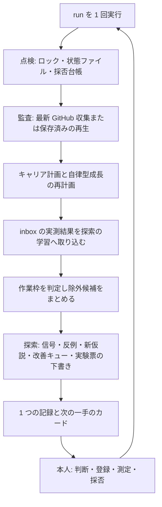

# 自律型ポートフォリオ改善イノベーションループ

作成日：2026-09-09。対象：`ns7jp/server`、`ns7jp/ns7jp`、`ns7jp/ns7jp.github.io`。

**既存の 4 系統（GitHub 週次監査・キャリア計画・自律型成長・改善実験の探索）を 1 コマンドで順に回し、作業枠の判定、実測結果の取り込み、次の一手の提示までを自動化する仕組みです。**
これまで 5 つの CLI と 4 つの保存先を、手書きの context JSON を挟みながら 10 手順で操作していた週次運用を、`run` 1 回に置き換えます。
公開、実機操作、外部送信、本人の技能判定は行いません。書き込み先は Git 管理外の `.local/` だけです。

## まず動かす

```text
node --test tools/portfolio-loop/tests/*.test.mjs
node tools/portfolio-loop/loop.mjs demo
```

`demo` は一時ディレクトリに合成データで全工程を流し、次の一手のカードを表示します。ネットワーク、実在の `.local/`、公開情報には触れません。
実際の週次運用は初回に `init`、以後は `run` の 1 行です。

`run` / `weekly` は[自律繁栄システム](../autonomous-prosperity/README.md)にも接続しています。
既存4系統の後に成果・負荷を確認し、最優先の一行動を表示します。同じ判断の再実行は短い「変化なし」表示です。
本人の週次負荷は `node tools/portfolio-loop/loop.mjs check-in normal`（縮小なら `reduced`、停止なら `paused`）で入力します。
別の定期実行は追加しません。`demo` とライブラリ `runLoop()` は従来の4系統の実行です。

さらに `run` / `weekly` は[高速な試行錯誤](../server-innovation/fast-loop.md)を実行します。
保存済みの新しい観測で反例と小変更を比較し、同条件の再実行は結果を再利用します。
`node tools/portfolio-loop/loop.mjs iterate` ならGitHubの再取得や週次計画を省いて直接試せます。

`run` / `weekly` は[発火点から改善への橋渡し](../server-innovation/bridge.md)も実行します。
本人の独自提案を優先した残枠へ自動仮説を補い、既存キューが選んだ一件の実装準備と検証一式を用意します。
保存済み観測では `bridge`、内容の表示は `bridge-show`、合成データでの体験は `bridge-demo` です。

```text
node tools/portfolio-loop/loop.mjs init 10
node tools/portfolio-loop/loop.mjs run
```

## 読む順番

| 順番 | 文書 | 分かること |
| --- | --- | --- |
| 1 | [詳細設計](design.md) | 目的、工程の順序、作業枠の判定規則、実験のライフサイクル、不変条件とその実装位置 |
| 2 | [CLI と入力仕様](tool-guide.md) | コマンド、オプション、inbox の構成、採否台帳、終了コード、エラー分類 |
| 3 | [月曜の運用](operation.md) | 1 コマンドの手順、出力の読み方、実験の一巡、停止・再開 |
| 4 | [検証記録](validation.md) | 今回動かした確認と NOT RUN |

## 全体の流れ



機械がするのは、既存の各ツールをこの順で呼ぶこと、作業枠の判定に必要な事実を集めること、判定結果を 1 か所にまとめることです。
どの候補を準備するか、実験の条件、測定、採用・却下は本人が決めます。ループはそれらを許可しません。

## 既存システムとの関係

| 既存の仕組み | ループが呼ぶもの | ループが変えないもの |
| --- | --- | --- |
| [週次監査](../portfolio-automation/weekly-operation.md) | `cycle.mjs` の収集・判定・限定修正案（`discovery.config.json` で一度だけ収集） | 修正案 `pending.json` の採否、公開 |
| [キャリア計画](../engineer-career/README.md) | `career.mjs check` と `plan` | `profile.json` の内容、週 10 時間 |
| [自律型成長](../autonomous-growth/README.md) | `growth.mjs check` と `plan`（SE 台帳が読めるときだけ） | 学習枠の接続 `bind-slot`、本人の再説明記録 |
| [改善実験と探索](../server-innovation/README.md) | `discovery.mjs` の cycle・feedback・dismiss、`innovation.mjs` の register・evaluate | 実験票の条件、測定値、原本 |

各ツールの状態ファイル、ロック、通知の意味はそのまま使います。ループは自分の保存先 `.local/portfolio-loop/` に採否台帳、inbox、実行記録を持つだけです。

## 今回の実装

- 1 コマンドの週次実行 `run`。オフライン再生 `--offline`、独自提案 `--proposals`、作業枠の明示 `--occupied` / `--free`。
- 読み取り専用の `status`。鮮度、ロック、修正案待ち、判断待ち、探索の登録数と上限、保存量、次の一手。
- 実験票の登録 `register`。下書きの 4 つの `NOT SET` を引数から埋め、環境条件のハッシュを計算し、inbox の骨組みを作ります。
- 採否台帳 `decisions.json` への記録 `done`、動的候補の却下 `dismiss`、学習枠の接続 `bind-slot`。次回の作業枠判定に反映します。
- 合成データのフィクスチャ生成と `demo`。テスト・デモはネットワークなしで動きます。
- 元のメッセージを保ったエラー分類と日本語の対処。終了コードは 0（処理完了）、3（収集不全）、2（停止）。
- 既存の文書 CI に接続した自動テスト。追加パッケージ、AI API、API キーは不要です。

## 限界

- 処理完了（終了コード 0）は、課題が 0 件、実機試験に合格、公開可能という意味ではありません。
- 合成データの実行は `合成` と表示し、実測記録・本人の実績へは転記しません。合成の結果を学習台帳へ入れる操作は拒否し、合成スナップショットの再生は `demo` か一時ディレクトリに限ります。探索そのものはスナップショットの由来を検査しません。
- 探索の候補・仮説は提案です。実験の実施、採用、公開の許可ではありません。
- ネットワークは `run` の実行時に既存の収集器が行う GitHub API の GET だけです。プロキシ環境や API 制限では収集不全（終了コード 3）になり、依存する準備を止めます。収集エラーの内容はカードと記録に出ます。`PORTFOLIO_LOOP_NO_NETWORK=1` で収集を禁止できます。
- 定期実行の登録、GitHub Actions での本ループの実行、VM・AWS・Slack の操作は含みません。検証した範囲は[検証記録](validation.md)にあります。
