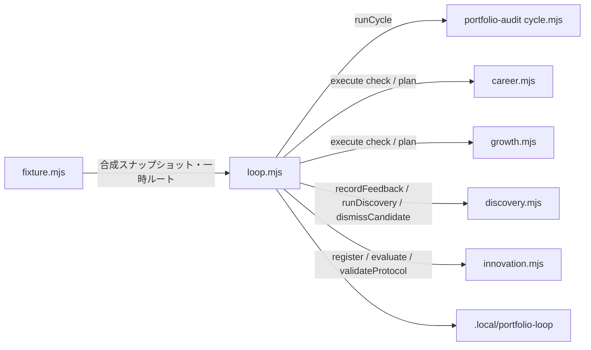
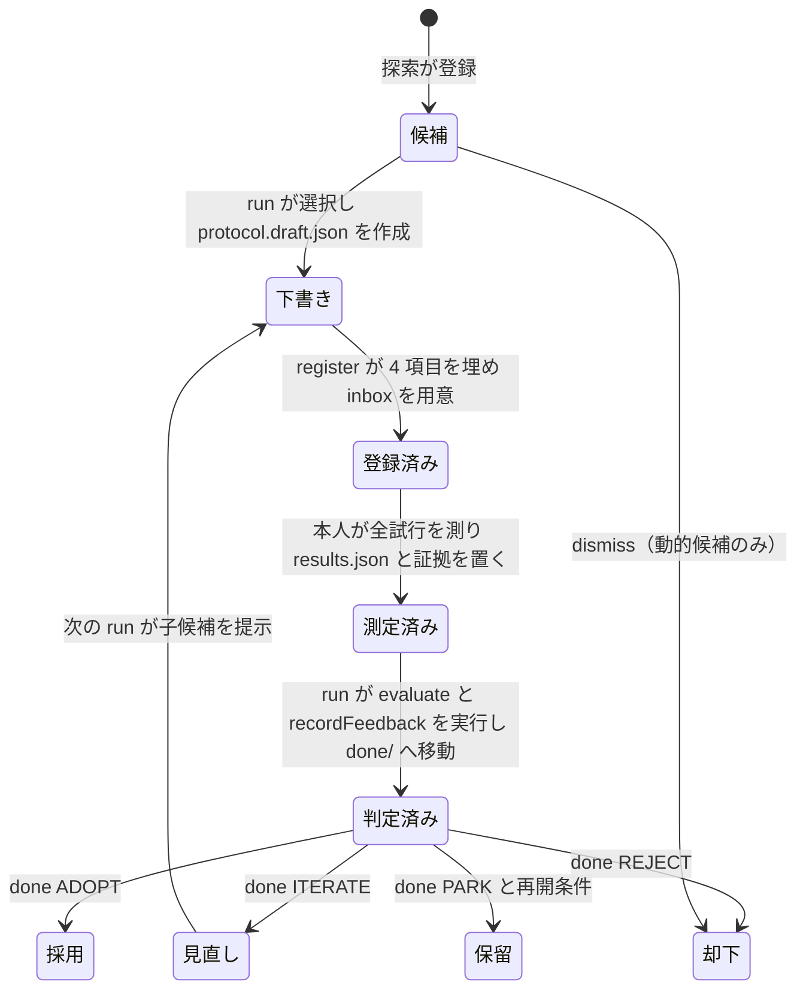

# 詳細設計：自律型ポートフォリオ改善イノベーションループ

設計日：2026-09-09。対象：`ns7jp/ns7jp` の `tools/portfolio-loop/`。版：1.0。

## 1. 目的と非目的

目的は、サーバー構築エンジニアとしての証拠を増やし、方法そのものを改善する既存の週次運用を、**高速に、手軽に、自律的に**回すことです。

| 観点 | 現状（2026-09-08 時点の運用） | この設計 |
| --- | --- | --- |
| 手順 | 5 つの CLI を固定順で 10 手順。引数の文法と終了コードの意味が CLI ごとに違う | `run` 1 コマンド。終了コードは 0 / 3 / 2 に統一 |
| 入力 | `context.json`（使用中か、除外 ID）を毎週手書き。24 時間で失効し、誤った ID で停止 | 監査結果、pending、採否台帳、inbox から機械的に合成。手書きなし |
| 出力 | 4 つの `latest.json` と 4 つのレポートを開いて変化を確認 | 1 つの `summary.md` と次の一手のカード。通知は各系統の意味差分の OR |
| 速度 | 毎回ネットワーク収集が必要。デモ・テストに実測が必要 | オフライン再生と合成フィクスチャ。一時ルートでの全工程は 1 秒未満（[検証記録](validation.md)の環境での参考値） |
| 実験 | 実験票の 4 か所の `NOT SET`、環境ハッシュ、結果の対応付けを手作業 | `register` が埋め、inbox の骨組みと結果の雛形を作る |

非目的は次のとおりです。既存ツールのロジックを複製しない。新しい合否や実績を作らない。公開・実機操作・外部送信をしない。本人の時間を増やさない。

## 2. 構成

既存ツールはすべて **エクスポートされた関数** として呼びます。子プロセスを起動しません。
各 CLI の `import.meta.url` ガードにより、読み込みだけでは何も実行されません。
設定は `tools/server-innovation/discovery.config.json` だけを使います。`live.config.json` の 11 ファイルより広い 17 ファイルの上位集合で、監査と探索の両方が同じスナップショットを読めます。

| ファイル | 役割 | 規模 |
| --- | --- | --- |
| `tools/portfolio-loop/loop.mjs` | 点検、工程の実行、作業枠の合成、取り込み、集約、次の一手、CLI | 約 550 行 |
| `tools/portfolio-loop/fixture.mjs` | schema v2 の合成スナップショット、一時ルートの用意、フィクスチャ CLI | 約 100 行 |
| `tools/portfolio-loop/tests/*.test.mjs` | ネットワークなしの回帰試験 | 22 件 |

## 3. 工程の順序と契約

`run` は次の順で進みます。1 回の実行で時刻を 1 つだけ確定し、全工程で共有します。

| 順 | 工程 | 呼ぶもの | 入力 | 出力 | 飛ばす条件 |
| --- | --- | --- | --- | --- | --- |
| 0 | 点検 | `inspect` → `enforce` | 4 つのロック、`pending.json`、採否台帳、探索の状態ポインター | 事実の一覧。異常なら停止（終了コード 2） | なし |
| 1 | 監査 | `runCycle({ config, outputDir, now })`。`--offline` なら `replay` | `discovery.config.json`、前回 `state.json` | 監査の `latest.json`、`runs/<時刻>/`、収集状態 | なし。収集不全でも以降を続け、探索だけ止める |
| 2 | キャリア計画 | `career.execute(['check'])` → `['plan']` | `profile.json` | 週の配分、信号、通知 | `profile.json` がないとき（未初期化として記録） |
| 3 | 自律型成長 | `growth.execute(['check'])` → `['plan']` | career の結果、SE 台帳 | 学習候補、枠の接続状態 | career 未初期化、または `learner_id` が設定済みで SE 台帳が読めないとき |
| 4 | 実測の取り込み | `validateProtocol` → `evaluate` → `recordFeedback` | `inbox/<実験ID>/` の実験票・結果・証拠 | 判定、`done/` への移動、台帳への記録 | inbox が空、または 3 点が揃わない項目 |
| 5 | 作業枠の合成 | 独自 | 監査結果、pending、台帳、inbox | `{schema_version, reviewed_at, occupied, closed}` の 4 項目だけ | なし |
| 6 | 探索 | `runDiscovery({ snapshot, context, outputDir, proposals, now })` | スナップショット、作業枠、独自提案 | 改善キュー、新候補、問い、実験票の下書き | 収集不全のとき |
| 7 | 集約 | 独自 | 全工程の結果 | `summary.json`、`summary.md`、`latest.json`、次の一手 | なし |

取り込み（4）を探索（6）より前に置く理由は、同じ実行で「判定」と「その結果から派生する追試候補」の両方が出るためです。
探索は終了した実測記録から vary / invert / combine の子候補を生成します。既存の運用手順は探索 → 取り込みの順で書かれていましたが、月曜に 2 回実行する必要をなくすため、この順に固定しました。

時刻の扱いは次のとおりです。監査の収集が終わってから評価時刻を確定します。収集の完了時刻より前の評価時刻をスナップショットの検査が拒否するためです。
career と growth には時刻を返す関数を、探索・登録・評価には ISO 文字列を渡します。CLI からは時刻を注入できません。テストとデモだけがライブラリ経由で固定時刻を使います。

## 4. 作業枠の判定規則

作業枠 `occupied` は「共通の 45 分枠にレビュー待ち・実行中の一件があるか」です。未確認は使用中とし、検証できた条件がすべて偽のときだけ空きにします。

| 根拠コード | 条件 | 出典 |
| --- | --- | --- |
| `AUDIT_DRAFT_PENDING` | 監査の修正案状態が CREATED / EXISTING_PENDING_DRAFT / PENDING_DRAFT_NEEDS_REBASE / PENDING_REQUIRES_REVIEW | 監査の `latest.json` |
| `AUDIT_PENDING_FILE` | `pending.json` が存在する | 監査の保存先 |
| `AUDIT_URGENT_OR_PR_REVIEW` | 優先度 1 の課題に EXISTING_PR_REVIEW または NEEDS_REVIEW がある（open PR、CI 失敗、資料欠落、主張境界の要確認） | 監査の `analysis.json` |
| `COLLECTION_INCOMPLETE` | 収集不全・古い観測 | 監査の収集状態 |
| `EXPERIMENT_INBOX_PENDING` | 取り込めない inbox 項目が残っている | `inbox/` |
| `EXPERIMENT_ITERATING` | 採否台帳の最新の本人判断に ITERATE がある | `decisions.json` |
| `CAREER_CAPACITY_UNKNOWN` | キャリア計画が未初期化で容量が分からない | `profile.json` |
| `FLAG_OCCUPIED` | `--occupied` を付けた | 引数 |
| `HUMAN_CONFIRMED_FREE` / `_OVERRIDES` | `--free` を付けた。空いていると本人が確認した週だけ | 引数 |

除外 ID `closed` は、採否台帳の**候補ごとの最新の本人判断**が ADOPT / REJECT / PARK のものです。ITERATE と取り込みだけの記録は除外しません。
既知の候補（カタログの 8 件と探索の登録簿）にない ID は捨て、警告として記録します。探索は未知の ID を含む作業枠を拒否するためです。

## 5. 実験のライフサイクルと採否台帳

採否台帳 `.local/portfolio-loop/decisions.json` の各行は次の 8 項目です。

| 項目 | 値 |
| --- | --- |
| `candidate_id` | `INV-001` 形式または `INV-` + 16 桁 hex |
| `decision` | 本人の判断 ADOPT / REJECT / PARK / ITERATE。取り込み行は null |
| `verdict` | 取り込みの判定 PROMISING / ITERATE / REJECT / NOT_READY / INCONCLUSIVE。本人の行は null |
| `protocol_sha256` | 登録済み実験票のハッシュ。なければ null |
| `decided_at` | UTC 時刻 |
| `reason` | 1 行の理由 |
| `resume_condition` | PARK のときだけ必須 |
| `source` | `human` または `intake` |

台帳を書くのは `done`、`dismiss`、取り込みの 3 経路だけです。取り込みは判定を記録するだけで、候補を閉じません。閉じるのは本人の判断です。
探索の判定 PROMISING と本人の ADOPT は別です。数値がよくても、依存関係、実施者の負担、保守性を含めて本人が決めます。

## 6. 高速に回すための仕組み

- **ライブラリ呼び出し**。子プロセスも `npx` もありません。起動は Node.js の読み込みだけです。
- **オフライン再生**。`--offline SNAPSHOT.json` は既存の replay 機能を使い、修正案を作らず、`replay-state.json` に分けて記録します。鮮度判定は同じ 24 時間で、古い再生は収集不全として扱います。
- **合成フィクスチャ**。`fixture.mjs` は設定の 17 ファイルすべてを、ハッシュと URL を観測 SHA に固定した schema v2 で生成します。監査の 5 プローブ行は NOT RUN、カタログの目印行は 1 行ずつ、探索の信号語も含みます。
- **一時ルート**。`demo` と試験は `mkdtemp` のルートに雛形だけを複製し、実在の `.local/` へ書きません。
- **同じ入力での再実行は無変化**。各系統の指紋がそのまま使われ、2 回目は通知なし、追加候補なし、下書きの再生成なしです。

## 7. 手軽に回すための仕組み

- **`run` だけ**。点検、収集、計画、取り込み、探索、集約、次の一手までを 1 回で行います。`status` と `demo` は任意の補助です。
- **手書き JSON なし**。作業枠は合成、採否は `done`、実験票は `register`、却下は `dismiss` が書きます。
- **次の一手のカード**。優先順に並べた行動と、そのまま打てるコマンド例を出します。
- **エラー分類**。元のメッセージを変えずに `[LOCKED]` `[NOT_INITIALIZED]` `[CORRUPT_STATE]` などの分類と日本語の対処を添えます。
- **前提の早期停止**。ロック、壊れた pending、壊れた台帳、探索状態の不整合は、監査が `runs/` を書く前に止めます。

## 8. 自律的に進める範囲

| ループが決めること | 本人が決めること |
| --- | --- |
| 収集の鮮度に応じて探索を止めるか | 収集不全の原因への対処 |
| 作業枠が使用中か（根拠付き） | `--free` で空きを宣言するか |
| 除外候補（本人の判断から機械的に） | ADOPT / REJECT / PARK / ITERATE |
| inbox の取り込み順と判定の記録 | 測定の実施、証拠、結果の作成 |
| 次の一手の優先順 | どれを実施するか |
| 通知の要否（意味差分の OR） | 通知先と伝え方 |

ループが**しない**ことは、候補の自動採用・却下、キャリアや成長の計画の省略、古いスナップショットの自動再利用、ロックの自動除去、状態ファイルの自動修復、`profile.json` や学習枠の自動更新です。

## 9. 次の一手の優先順

| 順 | コード | 出す条件 |
| --- | --- | --- |
| 1 | `LOCK_PRESENT` | いずれかのロックが残る |
| 2 | `CORRUPT_STATE` | 状態ファイルの読み取り不整合 |
| 3 | `REFRESH_COLLECTION` | 収集不全・古い観測 |
| 4 | `REVIEW_PENDING_DRAFT` | 監査の修正案がレビュー待ち |
| 5 | `INIT_CAREER` / `REVIEW_PROFILE` | 未初期化、または確認から 21 日以上（28 日で縮退） |
| 6 | `COMPLETE_INBOX` / `FIX_INBOX` | inbox の不足、取り込み失敗 |
| 7 | `DECIDE` | 判定済みで本人判断がない実験 |
| 8 | `BIND_SLOT` | 学習枠が未接続・再接続要 |
| 9 | `REGISTER_PROTOCOL` | 選択候補の下書きが未登録 |
| 10 | `PREPARE_CANDIDATE` | 選択候補あり |
| 11 | `RESEARCH` / `DISMISS_OR_PARK` / `SLOT_OCCUPIED` | 探索の状態に応じて |
| 12 | `NO_CHANGE` | 上記なし |

## 10. 不変条件と実装位置

| 不変条件 | 実装 | 試験 |
| --- | --- | --- |
| すべての出力に `authorization: NONE`、`publication_allowed: false`、`external_actions_allowed: false`、`se_record_writes_allowed: false`、`runtime_status: NOT_RUN` | `STAMP` を `stamp()` で付与 | 各試験の `stamped()` |
| 合成データを実測にしない | 取り込みは `data_kind: measured` だけ受け付け、探索も合成を拒否。`demo` は `demo: true` と `合成` 表示 | synthetic inbox、demo |
| 収集は `discovery.config.json` の 3 リポジトリだけ。GET 以外なし | 既存 `runCycle` のみ。ループ側にネットワークなし | 試験冒頭で `fetch` を例外化 |
| 書き込みは `.local/` 配下だけ | 5 つの保存先を定数化。docs/ への書き込み経路なし | フィクスチャ CLI が docs/ を拒否 |
| 登録済み記録を上書きしない | `wx` 作成、tmp + rename、`done/` は移動のみ | register の重複拒否、rerun の下書き数 |
| ロックを自動で外さない | `enforce` は停止するだけ。pid の生死を表示 | ロック残存の試験 |
| 壊れた状態を黙って直さない | 点検で停止し元のメッセージを表示 | pending、台帳の試験 |
| 作業枠は 4 項目だけ。既定は使用中 | `synthesize` 相当の合成部 | context.json の鍵集合、未初期化ルート |
| 時刻は 1 実行 1 つ。収集後に確定 | `nowIso = clock()` を `runCycle` 後に取得 | 未来観測の拒否 |
| 鮮度を迂回しない | 24 時間判定は既存ツールに委ね、古い再生は NEEDS_REFRESH | 古いスナップショットの試験 |
| 本人の時間を増やさない | `profile.json`、`bind-slot`、SE 台帳を書かない | 未初期化ルートで `.local/engineer-career` が作られない |
| 元のエラーメッセージを保つ | `Loop stopped: <元の文>` に分類を添えるだけ | CLI の試験 |

## 11. 保存物

| パス | 内容 |
| --- | --- |
| `.local/portfolio-loop/decisions.json` | 採否台帳 |
| `.local/portfolio-loop/inbox/<実験ID>/` | `protocol.registered.json`、`evidence/context.json`、`results.template.json`。本人が `results.json` と証拠を追加 |
| `.local/portfolio-loop/done/<実験ID>-<時刻>/` | 取り込み済みの実験（移動のみ） |
| `.local/portfolio-loop/runs/<時刻>-<id>/` | `context.json`、`summary.json`、`summary.md` |
| `.local/portfolio-loop/latest.json` | 最新実行の要約と次の一手 |
| `.local/portfolio-loop/demo-snapshot-<時刻>.synthetic.json` | `demo` が使った合成スナップショット（一時ルート内） |

既存 4 系統の保存先は変えません。`runs/` は削除しません。保存量は `status` が表示し、整理は本人が判断します。

## 12. 拡張の方針

新しい工程を足す場合は、既存ツールのエクスポートを呼び、その `latest.json` の通知だけを OR に加えます。
判定を緩めて PROMISING や空きを増やす変更、合成を実測に変える変更、ロック・状態の自動修復は行いません。
定期実行は利用者側のタスク登録で行い、このリポジトリに別のスケジューラや GitHub Actions の定期収集を追加しません。
