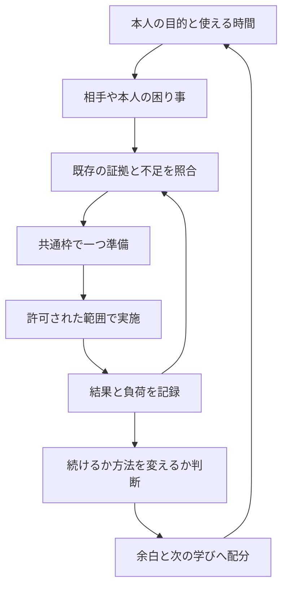

# 自律繁栄システムの詳細運用・価値レビュー

日常の入口は、最新mainにある[自律繁栄システム](../autonomous-prosperity/README.md)です。この文書群は、指標・月次運用・価値実験・原期限・導入計画を詳しくする補助です。通常は既存の `check-in` と `run` を使い、細かな一件の原期限と比較計画が必要な場合だけ[補助評価器](../../tools/prosperity/README.md)を使います。同じ成果の測定値を両方の台帳へ重ねて登録しません。

**役に立つ技術を育て、確かめた結果を信用へつなぎ、合う仕事で価値を生み、続けられる範囲で次へ投資するための運用です。**
当面の優先は、既存の本人選択にある「サーバー構築職への就職・定着」です。
学習・作品改善・就職活動の合計上限は週10時間を引き継ぎます。これは計画上の条件であり、現在の技能、雇用、応募実績、収入の確認結果ではありません。

「自律」は、正本を集め、矛盾や不足を見つけ、実行可能な次の一手を準備し、結果から方法を変えることです。
「繁栄」は投稿数や作成ファイル数を増やすことでは測れません。必要な成果を正しく届けられること、約束を守れること、無理なく継続できること、次に選べる仕事や学びが増えることを、別々の根拠で見ます。

## 最初に行うこと

1. [正本の対応表](design.md)で、既存のキャリア計画・本人台帳・改善ループの保存先を確認する。
2. [CLI](../../tools/prosperity/README.md)の `demo` で、合成データと実測の違い、次の一手の表示を確かめる。
3. 既存のキャリア計画を読み、この週に使える枠と実施中の一件を確認する。使っている台帳があればそれを接続する。
4. 繁栄レイヤの `init` と `review` を実行する。未記入・未採用から始め、生成結果を実施済みへ変更しない。
5. [運用手順](operation.md)に沿って、一つの候補を実施するための準備、または現在の阻害要因の解消へ進む。

初回に「本人の確認が必要」「基準値がない」と出るのは、本人の状態を知るための正常な結果です。
その間も、既に依頼されたローカル文書やコードの改善、参照先の検査、実施カードの下書きは進められます。

## 読む順番

| 文書 | 使う場面 |
| --- | --- |
| [詳細設計](design.md) | 目的、正本、権限、循環、優先順位を理解する |
| [日・週・月・四半期の運用](operation.md) | 今日動かす、止める、縮小する、再開する |
| [指標と欠測](metrics.md) | 成果・負荷・証拠を混同せず比較する |
| [価値検証と実験](experiments.md) | 相手や本人の困り事が減ったか確かめる |
| [記録のテンプレート](templates.md) | 正本を重複させず、判断材料を残す |
| [30・60・90日計画](roadmap.md) | 本人が採用した日から小さく導入する |
| [操作と入力仕様](../../tools/prosperity/README.md) | CLI、JSON、保存先、エラーを確認する |
| [検証記録](validation.md) / [根拠資料](sources.md) | 実装・実行・未実施の範囲と出典を確認する |

## 繁栄につながる六つの観点

| 観点 | 観察したい変化 | 根拠の例 |
| --- | --- | --- |
| 役に立つ技術 | 要件に合う構築・試験・復旧を説明して実施できる | SEの試行、支援量、別日の再説明 |
| 証拠と信用 | 主張の範囲が明確で、約束と報告に食い違いが少ない | 対象版、実測、未実施、確認者の原記録 |
| 就職と定着 | 自分の希望と仕事の要求を照合し、担当範囲を合意できる | 公式求人、本人の活動記録、職場の合意 |
| 仕事上の価値 | 受け手が必要な結果を使い、困り事が減る | PJの受け入れ条件、実際の利用、手戻り |
| 持続可能性 | 時間と負荷が本人の許容範囲に収まる | 予定と実時間、負荷の自己記録、未完の理由 |
| 再投資と選択肢 | 得られた余白を休息、品質、次の不足へ振り向けられる | 月次の配分判断と、次期間の確認結果 |

六観点を合算した「繁栄点」や個人の順位は作りません。
例えばCIが通っても、受け手が使えたかは未確認です。面接に進んでも、技術力の全条件を満たしたとは判断できません。
収入・条件の改善は、本人が確認した実際の記録があるときだけ扱います。

## 一巡の流れ

既存の[キャリア計画](../engineer-career/README.md)が全体の時間と機会を扱い、[自律型成長](../autonomous-growth/README.md)が学び方を改善し、[ポートフォリオループ](../portfolio-loop/README.md)が監査・探索・実験を動かします。
今回のレイヤは、その結果が本人の価値と負荷にどう結び付いたかを見直す入口です。
サーバー実験の採否は既存の採否台帳に残し、このレイヤから上書きしません。

## 自動化の現状を読む

今回確認した既存自動化は `github-ns7jp`、09:30の登録がACTIVEです。
登録の存在と、繁栄レイヤを接続した定期実行・実際の発火は別です。新機能の定期接続と発火は今回未実施で、重複するスケジュールは追加していません。
過去文書の月曜09:00などの記述は当時の運用記述として扱い、現在の予定と実行結果は既存自動化と履歴を確認します。

コードの検査、公開GitHubの観測、本人の実技、受け手の確認を、それぞれ[検証記録](validation.md)で分けます。
最初の実運用は、予定を登録した時点ではなく、本人が一件を実施して実際の結果を原本へ残した時点から評価します。
