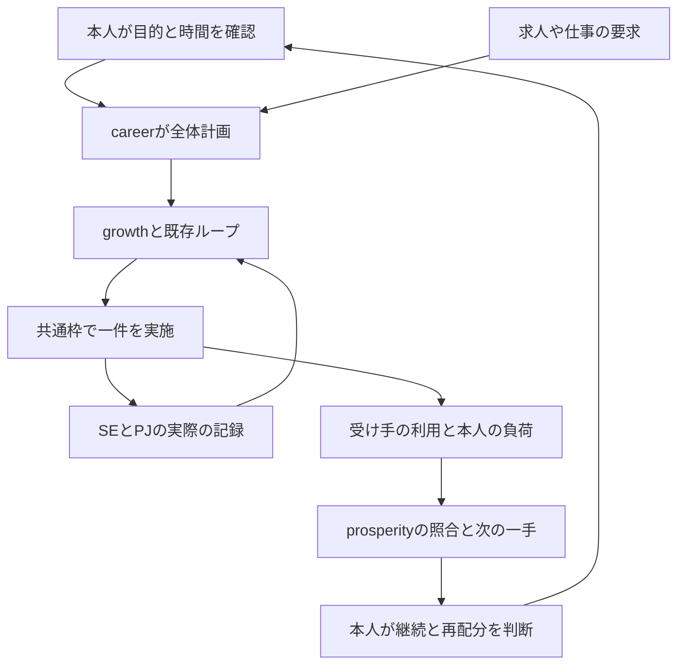

# 自律繁栄の詳細設計

[入口](README.md) / [運用](operation.md) / [指標](metrics.md) / [実験](experiments.md) / [記録票](templates.md) / [導入計画](roadmap.md) / [CLI](../../tools/prosperity/README.md)

## 1. 何を最適化するか

目的は「必要な成果を、根拠を保ち、本人が続けられる負荷で届ける力と機会を育てること」です。
就職前は、希望条件と求人の要求に合う説明・実測・応募準備が中心です。
就職後は、合意した小さな担当を正確に実施し、早く相談し、受け入れられた成果と次の担当へつなぎます。
勤務先や収入をGitHubの活動から推測して段階を切り替える設計にはしません。

優先順位は次の順です。下位の数値がよくても、上位の問題を隠すことはできません。

1. 記録と権限の整合性、実際の期限、影響のある障害を確認する。
2. 本人の使える時間と負荷に収める。
3. 既存の未完一件・判断待ちを進め、同時進行を増やさない。
4. 受け手の要求と本人の目標に直結する不足を一つ選ぶ。
5. 効果と悪化を測り、方法を続けるか判断する。
6. 得られた余白を、維持・休息・次の不足へ配分する。

## 2. 正本を増やさず接続する

正本は、事実を訂正するときに戻る場所です。生成レポートはその時点の参照結果であり、正本の代わりにはなりません。

| 情報 | 正本・参照パス | このレイヤで持つもの |
| --- | --- | --- |
| 本人の目的、週の時間、フェーズ、機会 | `.local/engineer-career/profile.json`、[仕様](../engineer-career/tool-guide.md) | 確認時点の参照。計画を自動変更しない |
| 応募・面談等の実際の本人記録 | `.local/engineer-career/records/` | 必要な記録への参照。選考状態を推測しない |
| 本人の試行、支援量、人の技能評価 | `.local/server-engineer/<本人ID>/progress.json`、[仕様](../server-engineer/tracker-guide.md) | 既存機能による検査結果を参照。合否を書かない |
| 実案件・演習案件の承認と完了 | 所属先の正本、または `.local/server-projects/<案件ID>/project.json` | 公開可能な課題への参照。検収を代行しない |
| 再説明・実際の評価依頼 | 既存growthの `followups.json`、[設計](../autonomous-growth/design.md) | 再説明の候補と阻害要因を参照 |
| 最新の監査、収集、候補と作業枠 | `.local/portfolio-loop/latest.json` と参照先のrun summary | 上流の鮮度、阻害要因、占有状態を参照 |
| サーバー実験の採否 | `.local/portfolio-loop/decisions.json` | 技術採否の正本への参照。Pの判断で書き換えない |
| サーバー実験の登録条件・全試行 | 同ループの `inbox/`、`done/` とinnovationの保存物 | 比較条件と結果への参照 |
| 今回の運用候補、確認、負荷の基準 | `.local/prosperity/ledger.json` | この運用を使うか、どう確かめるかの最小記録 |
| 今回の評価結果 | `.local/prosperity/latest.json`、`history/`、`report.md` | 再計算可能な派生出力。実施の証拠ではない |

`ledger.json` に置くP系候補は、本人が今回の運用や表示を使う価値を確かめるものです。
サーバーの復旧・復元・監視等の技術比較は既存のINV系へ登録します。同じ実験の条件・結果・採否を双方へ転記しません。
P系で技術成果に触れる場合は、どのINV結果を利用したかをメモと原記録の参照で示します。
機械が自由記述内の参照先すべてを追跡・検証するわけではないため、必要な正本照合は運用で行います。

## 3. 自動処理と本人の判断

| 担当 | 実施すること | 結果を確定する場所 |
| --- | --- | --- |
| 繁栄CLI | 入力・証跡・鮮度の検査、時間条件の照合、一つの次の行動、差分通知の判定 | CLIのreportと履歴 |
| 既存ループ | GitHub収集、career/growth計画、実測取り込み、探索、技術候補の集約 | 既存各ツールの状態と採否台帳 |
| Codex | 原本の調査、候補の比較、実施カード、依頼されたローカル実装と検証、説明の下書き | 差分と検査結果。本人実績とは区別 |
| 本人 | 目的・時間・負荷の確認、候補採用、実施、本人の説明、次の配分 | 既存profile、本人記録、必要なP系記録 |
| 技能評価者 | 条件に応じた実技観察と評価 | 既存SEの評価記録 |
| 職場の責任者・受領者 | 担当と権限、作業の承認、受け入れ、組織内の優先順位 | 所属先の業務正本 |

すでに依頼・許可されたローカル作業は、毎工程で許可を取り直さず進めます。
今回未依頼の応募送信、対人連絡、公開、契約・支払い、実機操作はこのシステムの実装から自動発生させません。
人の判断が必要なときは、対象、選択肢、差分、検証、未確認、次の影響まで準備し、一つの判断で先へ進める形にします。

## 4. 六つの経路を一巡へまとめる

「価値が生まれた」を主張するには、成果物の存在だけでなく、対象となる困り事・実際の使用・結果の根拠が必要です。
例えば手順を作った段階は作成済み、本人が試した段階は本人試行、受領者が追えた段階は当該受領者の確認です。
それぞれの段階を飛ばさず、実際に得た反応を次の不足へ戻します。

## 5. 時間を二重に使わない

本人の週10時間は600分です。既存careerが余白20%、既約束、レビューを先に引き、最大3主行動を選びます。
P系の実験時間は、既存の行動IDに接続した枠の内訳です。600分に45分を加えたり、学習10時間とキャリア10時間に分けたりしません。
新ledgerの上限値は照合用で、既存profileを置き換える権限を持ちません。食い違えば本人の最新の確認内容を正本へ反映して再評価します。

例として、技術行動 `evidence-map` が180分なら、参照先の確認20分、本人の実践90分、説明25分、運用比較45分で180分です。
これは配分例で、本人がその時間を実施した記録ではありません。実験が本来の学習目的に合わない場合は接続せず保留します。
Codexの通常の小改善枠は既存運用の原則一件45分です。本人の作業実績へ変換せず、レビューに要した本人時間だけ本人の記録へ含めます。

## 6. 状態と次の一手

CLIの正確な状態名・条件・検査順は[実装仕様](../../tools/prosperity/README.md)を正本とします。
運用上は、入力の破損、情報の不足・鮮度、時間と負荷、上流の優先事項、実施中の一件、採用前の候補、という順で確認します。

| 状況 | 運用上の意味 | 次の扱い |
| --- | --- | --- |
| 未接続 | 読む対象が指定されていない | 既存台帳の場所を確かめる。能力0としない |
| UNKNOWN・欠測 | 現時点で値や状態を確かめられない | 欠けた一項目と確認方法を示す |
| NOT RUN | 必要な操作や測定を実施していない | 実施条件と残件を示す |
| 進行中 | 一つの実施を続けている | 同じ一件の完了・中止・保留を決める |
| 結果がある | 登録条件に対応する記録がある | 全試行、悪化、範囲を確認する |
| 採否待ち | 判断材料はあるが本人の意思が未記録 | 一つの具体的な判断へまとめる |

値がない状態を0へ変えず、取得失敗で最後に確認できた日時を進めません。
過去の結果は残しますが、現在の版や環境の成功へ自動継承しません。

## 7. 再投資を決める

再投資は、確認した成果から得た余白を次の価値へ配分する本人の判断です。金銭投資や自動購入の機能ではありません。
最初は時間を対象とし、順番は、必要な維持・未完の約束、休息と余白、同じ困り事の再発防止、次の不足一件です。
一度の作業が短くなっただけでは恒常的な余剰時間にならないため、保守と確認の追加負担も含めて判断します。

月次に「何が減ったか」「何を維持する費用が増えたか」「同じ結果が別の日にも出たか」を確認します。
配分変更は既存profileの次期間の計画で行い、変更理由を[月次記録票](templates.md)へ残します。
CLIは基準値との数値差を示せますが、自動的な再投資、技能認定、収入効果の因果推定は実装していません。

## 8. 成立を確かめる条件

仕組みとしての成立は、同じ正本から追跡できる次の一手が出ること、壊れた入力・欠測を成功扱いしないこと、共通枠を増やさないこと、履歴を残すことで確認します。
利用上の成立は、本人が迷いを減らして一件を実施できたか、受け手に役立ったか、負担が増え過ぎなかったかで確かめます。
前者のテスト成功だけで後者を達成したとはせず、[検証記録](validation.md)と[価値実験](experiments.md)を対応させます。
