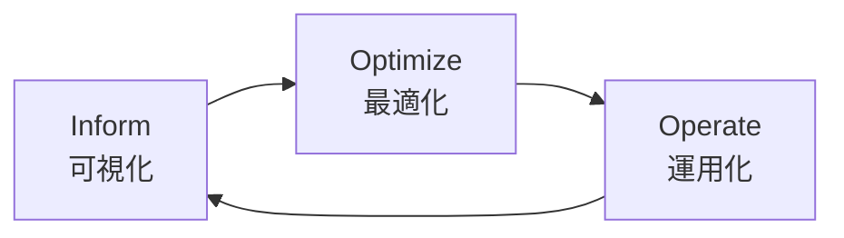
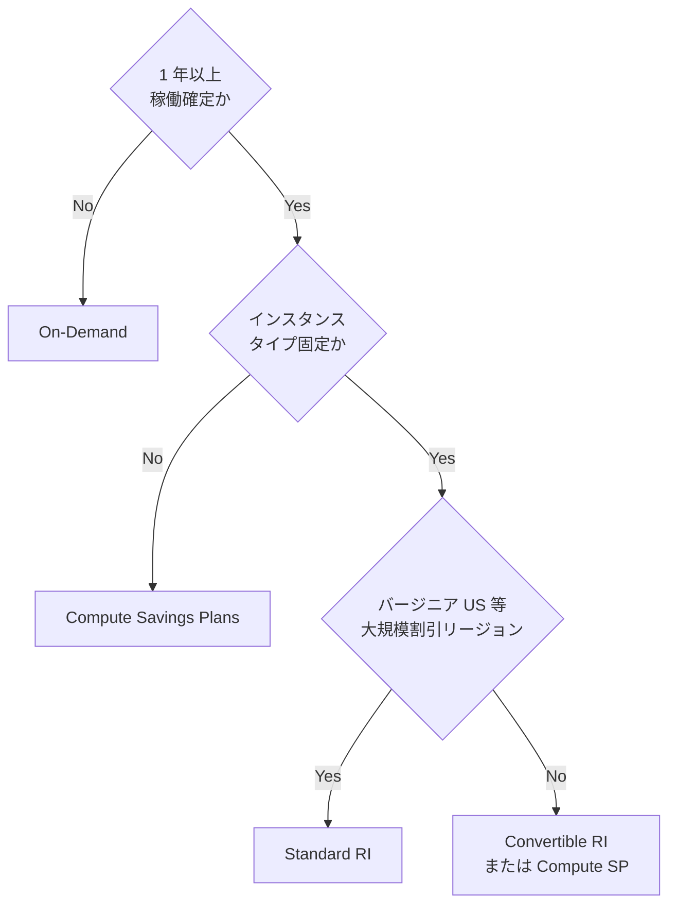
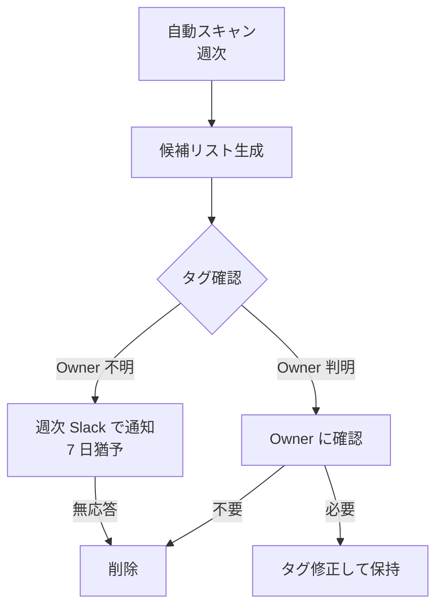

# 13. FinOps（コスト最適化運用）

## 1. 背景・課題

[03 Terraform / AWS](../server-monitor-improvements/03-terraform-aws.md) で AWS 化するにあたり、**コスト** の議論が薄い。クラウド案件では「**コストに鈍感なインフラ運用** は実務で歓迎されない」のが現実。

| 現状の課題 | リスク |
| --- | --- |
| 月額試算が概算止まり | 想定外の請求が出た時の判断不能 |
| コストアラートが無い | 異常な課金（漏洩 / 設定ミス）に気付けない |
| Reserved / Savings Plans の判断基準が無い | 1〜2 年運用が確実な部分にも On-Demand を払い続ける |
| Rightsizing の月次レビューが無い | 立ち上げ時のスペックを引きずる |
| タグ規約が無い | コスト按分・棚卸しが不可能 |

> ポートフォリオ観点：「**SLO・キャパ・コストの三角関係**」を語れることが、シニア寄りのインフラ運用に必須。

### 1.1 個人ラボでの読み替え

本ドキュメントには組織適用時の設計サンプルを含む。
[11 変更管理](../server-monitor-improvements/11-change-management.md) の軽量版方式と同じ考え方で、
個人ラボでは以下に読み替えて運用する。

| 組織前提の記述 | 個人ラボでの運用 |
| --- | --- |
| `CostCenter` タグによる部門按分（§4） | 按分先の部門が無いため **`Project` タグのみ運用**。`CostCenter` は組織適用時の設計サンプルとして記載 |
| Slack #ops への通知（§6） | 自分宛 Slack 通知 + Issue への記録 |
| IC アサイン検討（§6.1） | 1 人で帽子を掛け替える運用（[07 §3](../server-monitor-improvements/07-incident-response.md) の「1 人体制での運用」を参照） |
| Owner への確認フロー（§10） | Owner は常に本人のため確認フローは発生しない。組織適用時の設計サンプルとして記載 |
| 月次レビュー会議体（§9） | 月初の 1 人レビュー。議事録は同じテンプレで残し証跡化 |

---

## 2. 設計原則（FinOps Framework に準拠）

[FinOps Foundation](https://www.finops.org/) の 3 フェーズに沿う：



| フェーズ | 内容 | 本ドキュメントでの対応 |
| --- | --- | --- |
| Inform | 何に / 誰が / どれだけ使ったか可視化 | §4 タグ規約、§5 ダッシュボード |
| Optimize | 不要削減・適正化・予約購入 | §6 Rightsizing、§7 Reserved / Savings Plans |
| Operate | 月次運用ルーチン化 | §9 月次レビュー、§10 不要リソース回収 |

---

## 3. v2.0 月額試算（AWS / 単一 AZ + スタンバイ）

[03 Terraform / AWS](../server-monitor-improvements/03-terraform-aws.md) の構成での月額見積（東京リージョン、2026 年単価ベース、実費は変動）。

| サービス | リソース | 月額（USD） | 備考 |
| --- | --- | --- | --- |
| EC2 | t3.medium × 2（24/7） | 約 60 | アクティブ + スタンバイ |
| EBS | gp3 100GB × 2 | 約 16 | 監視データ + アプリ |
| ALB | 1 台 | 約 22 | + LCU 課金 |
| S3 | バックアップ 50GB | 約 1 | Standard + ライフサイクル |
| CloudWatch | Logs / メトリクス | 約 5 | カスタムメトリクス次第 |
| Route 53 | Hosted Zone 1 + クエリ | 約 1 | |
| データ転送 | 想定 20GB/月 | 約 2 | |
| KMS | CMK 1 個 | 約 1 | |
| Secrets Manager | 5 シークレット | 約 2 | |
| **合計** | | **約 110 USD/月** | 約 16,500 円 |

### 3.1 試算根拠の出し方

PR `#xxx` で `infracost` を CI に組込む：

```yaml
# .github/workflows/cost.yml
- name: Setup Infracost
  uses: infracost/actions/setup@v3
  with:
    api-key: ${{ secrets.INFRACOST_API_KEY }}

- name: Generate Infracost diff
  run: |
    infracost diff --path=terraform/ \
      --compare-to=/tmp/infracost-base.json \
      --format=github-comment \
      --out-file=/tmp/infracost-comment.md

- name: Post comment
  uses: marocchino/sticky-pull-request-comment@v2
  with:
    path: /tmp/infracost-comment.md
```

→ Terraform 変更時に **コスト影響が PR コメントで自動レビュー** される。

---

## 4. タグ規約

### 4.1 必須タグ

すべての AWS リソースに以下を付与。`terraform-aws-modules` の default_tags で強制する。

| タグキー | 内容 | 例 |
| --- | --- | --- |
| `Project` | プロジェクト識別子 | `server-monitor` |
| `Env` | 環境 | `prod` / `staging` / `dev` |
| `Owner` | 担当者（個人 / チーム） | `ns7jp` |
| `CostCenter` | コスト按分の単位 | `portfolio` |
| `ManagedBy` | 管理ツール | `terraform` |
| `Component` | 機能区分 | `monitoring` / `app` / `network` |
| `BackupPolicy` | バックアップ要否 | `daily` / `weekly` / `none` |

### 4.2 タグ違反検出

```hcl
# AWS Config Rule
resource "aws_config_config_rule" "required_tags" {
  name = "required-tags"
  source {
    owner             = "AWS"
    source_identifier = "REQUIRED_TAGS"
  }
  input_parameters = jsonencode({
    tag1Key = "Project"
    tag2Key = "Env"
    tag3Key = "CostCenter"
    tag4Key = "ManagedBy"
  })
}
```

→ タグ不備リソースを Config Rule で検出、Slack 通知。

---

## 5. コスト可視化

### 5.1 ダッシュボード

```text
┌──────────────────────────────────────────────────────────────────┐
│ FinOps Dashboard — server-monitor              May 2026          │
├──────────────────────────────────────────────────────────────────┤
│ 当月見込み:  $112  (予算 $130 / 進捗 18 / 31 日)                  │
│ 前月実績:    $108                                                 │
│ 前年同月:    —                                                    │
├──────────────────────────────────────────────────────────────────┤
│ サービス別内訳                                                    │
│   EC2        ████████████████████░░ $58                          │
│   EBS        █████░░░░░░░░░░░░░░░░░ $15                          │
│   ALB        ███████░░░░░░░░░░░░░░░ $22                          │
│   その他     █░░░░░░░░░░░░░░░░░░░░░  $5                          │
│   税         ██░░░░░░░░░░░░░░░░░░░░ $12                          │
├──────────────────────────────────────────────────────────────────┤
│ Reserved / Savings Plans カバー率                                 │
│   EC2:  ░░░░░░░░░░░░░░░░░░░░ 0%（v2.0 半年後に検討）              │
├──────────────────────────────────────────────────────────────────┤
│ Rightsizing 推奨（CloudWatch / Cost Explorer）                    │
│   - i-xxx (t3.medium): 平均 CPU 8% → t3.small へ降格を推奨        │
└──────────────────────────────────────────────────────────────────┘
```

### 5.2 データソース

| 項目 | データソース |
| --- | --- |
| サービス別コスト | AWS Cost Explorer API → Grafana CloudWatch データソース |
| 当月見込み | Cost Explorer Forecast |
| 予算進捗 | AWS Budgets |
| Rightsizing 推奨 | Compute Optimizer |

---

## 6. コストアラート

### 6.1 AWS Budgets

| アラート | 閾値 | 通知 |
| --- | --- | --- |
| 想定 50% 超過 | $65 達した時点 | Slack #ops |
| 想定 80% 超過 | $104 達した時点 | Slack #ops + メール |
| 想定 100% 超過 | $130 達した時点 | Slack #ops + メール + IC アサイン検討 |
| 前日比 +50% | 急増検知 | Slack #ops（即調査） |

### 6.2 異常検知（Cost Anomaly Detection）

AWS Cost Anomaly Detection を有効化。MLベースで「いつもと違う」課金を自動検知。

```hcl
resource "aws_ce_anomaly_monitor" "service" {
  name              = "anomaly-monitor-services"
  monitor_type      = "DIMENSIONAL"
  monitor_dimension = "SERVICE"
}

resource "aws_ce_anomaly_subscription" "slack" {
  name      = "anomaly-slack"
  frequency = "IMMEDIATE"
  monitor_arn_list = [aws_ce_anomaly_monitor.service.arn]

  subscriber {
    type    = "SNS"
    address = aws_sns_topic.cost_alerts.arn
  }

  threshold_expression {
    dimension {
      key           = "ANOMALY_TOTAL_IMPACT_ABSOLUTE"
      values        = ["10"]   # $10 以上
      match_options = ["GREATER_THAN_OR_EQUAL"]
    }
  }
}
```

---

## 7. Reserved Instances / Savings Plans 判断基準

「**1 年以上確実に稼働するリソースだけ予約する**」をルール化。

### 7.1 判断フロー



### 7.2 server-monitor での適用

| リソース | 判断 | 理由 |
| --- | --- | --- |
| EC2 アクティブ（t3.medium） | v2.0 安定後 6 ヶ月運用してから 1 年 Compute SP | スペック変更の可能性を残す |
| EC2 スタンバイ | 同上 | 同上 |
| EBS | 予約なし | 予約サービスが無い |
| RDS（将来） | スペック確定後 1 年 RI | DB は頻繁に変えない |

### 7.3 アンチパターン

- 開発初期に 3 年予約 → 設計変更で塩漬けに
- インスタンスタイプ変更が予測されるのに Standard RI
- リージョン変更可能性があるのにリージョン固定 RI

---

## 8. Rightsizing（適正化）

### 8.1 判断指標

| 指標 | 降格判断 | 据置判断 |
| --- | --- | --- |
| CPU 平均（過去 14 日） | < 15% で 1 段降格 | 15-50% は据置 |
| Mem 平均 | < 30% で降格 | 30-70% は据置 |
| ネットワーク使用率 | < 10% で世代変更検討 | — |
| 突発スパイク（p99） | スパイク無しなら降格可 | スパイクありなら現状維持 |

### 8.2 Compute Optimizer の活用

AWS Compute Optimizer は EC2 / EBS / Lambda 等の推奨を出してくれる。月次レビューで以下を確認：

- Under-provisioned（性能不足）
- Over-provisioned（過剰）
- Optimized（適正）

### 8.3 EBS gp2 → gp3 移行

gp2 → gp3 は **同性能で 20% 程度コスト削減** できる典型例。v2.0 で全 EBS を gp3 で作成すること。

---

## 9. 月次 FinOps レビュー

### 9.1 アジェンダ（30 分、SLO / IR / セキュリティと統合）

1. 当月実績と予算消費率
2. 前月比 / 前年同月比（あれば）
3. 異常課金イベントの有無
4. Compute Optimizer 推奨と適用判断
5. 不要リソース棚卸し結果
6. Reserved / Savings Plans カバー率と次月の購入計画
7. **キャパシティレビューと整合**：[10 §6 月次レビュー](../server-monitor-improvements/10-capacity-planning.md) と同会議体

### 9.2 議事録テンプレ

`docs/finops-reviews/YYYY-MM.md`：

```markdown
# FinOps レビュー 2026-06

## 実績
- 月額: $112（予算 $130、達成率 86%）
- 前月比: +3.7%

## トピック
- EBS gp2 → gp3 切替で $8 削減見込み（PR #150）
- 不要 ENI 3 個を回収（[10 §7](#)）

## 次月の方針
- t3.medium × 1 を 1 年 Compute SP 購入予定（年間 $230 削減見込み）
- Compute Optimizer の推奨 2 件を Standard Change で適用
```

---

## 10. 不要リソース回収プロセス



### 10.1 回収対象パターン

| パターン | 検出方法 |
| --- | --- |
| Stopped EC2 が 30 日以上 | Cost Explorer + Tag age |
| Unattached EBS | EBS volume の state == available |
| Unused ENI | ENI の attachment status == nil |
| Old AMI / Snapshot（90 日以上） | 作成日時 |
| 使われていない Elastic IP | association status == nil |
| 古いログ（CloudWatch Logs 保持期間超過） | ライフサイクル設定の有無 |

### 10.2 自動化（v2.0 で実装）

- AWS Trusted Advisor + EventBridge で週次スキャン
- 検出を Lambda が Slack 通知
- 7 日後に Owner 不明分を自動削除（タグなしリソースのみ）

---

## 11. 段階的導入

| 週 | 内容 |
| --- | --- |
| 1 | タグ規約を `docs/finops/tagging.md` に明文化、Terraform default_tags で強制 |
| 2 | AWS Budgets / Cost Anomaly Detection / Compute Optimizer 有効化 |
| 3 | Infracost を CI に組込み、Cost Explorer 連携の Grafana ダッシュボード作成 |
| 4 | 不要リソーススキャン Lambda、月次レビュー会の枠を SLO / IR / セキュリティと統合 |
| 月次 | レビュー（実績 / 推奨 / 計画） |

---

## 12. 完了条件（Definition of Done）

- [ ] Terraform default_tags で必須タグが全リソースに付与されている
- [ ] AWS Budgets が 50% / 80% / 100% で Slack 通知している
- [ ] Cost Anomaly Detection が有効、通知が動作確認済み
- [ ] Infracost が PR コメントで月額差分を投稿している
- [ ] Grafana FinOps ダッシュボードが存在
- [ ] `docs/finops-reviews/YYYY-MM.md` が月次で残されている
- [ ] gp2 → gp3 移行など、初回の最適化 PR が 1 件以上 merge されている

---

## 13. 関連設計書・ADR

- [03 Terraform / AWS 化](../server-monitor-improvements/03-terraform-aws.md) — 本ドキュメントの実装基盤
- [10 キャパシティプランニング](../server-monitor-improvements/10-capacity-planning.md) — Rightsizing 判断と統合
- [11 変更管理](../server-monitor-improvements/11-change-management.md) — コスト変更も変更管理プロセスに乗せる
- [ADR-0005 Terraform 採用](../adr/0005-terraform-for-iac.md)
- [ADR-0006 自前運用](../adr/0006-self-host-monitoring.md)

---

## 14. 参考

- [FinOps Foundation](https://www.finops.org/)
- [AWS Well-Architected Cost Optimization Pillar](https://docs.aws.amazon.com/wellarchitected/latest/cost-optimization-pillar/)
- [AWS Cost Optimization Hub](https://aws.amazon.com/aws-cost-management/cost-optimization-hub/)
- [Infracost Documentation](https://www.infracost.io/docs/)
- [J.R. Storment & Mike Fuller, "Cloud FinOps" 2nd ed.](https://www.oreilly.com/library/view/cloud-finops-2nd/9781492054610/)
