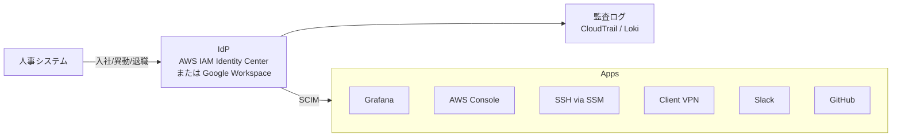
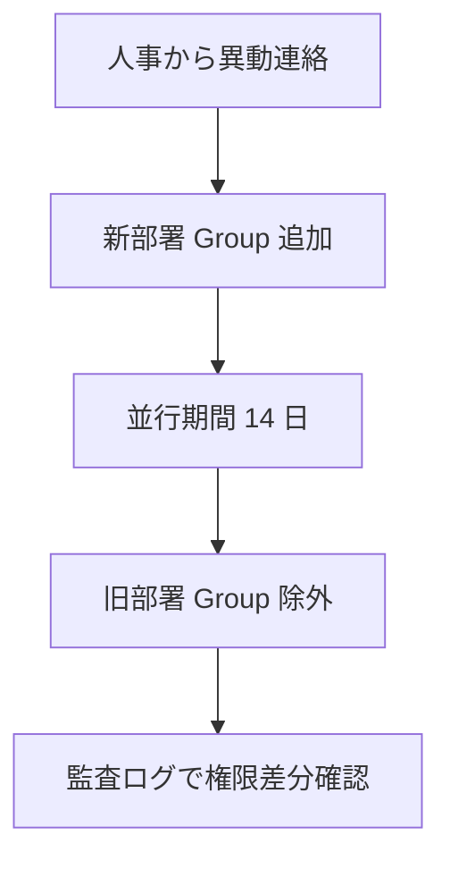
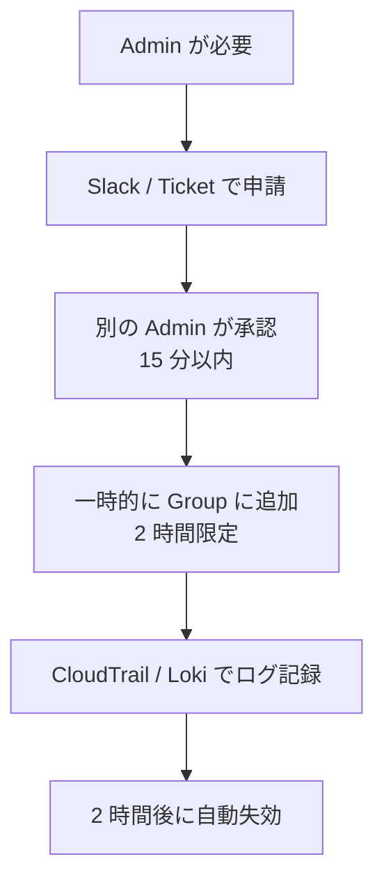

# 16. アイデンティティ運用設計（ID ライフサイクル / SSO / 特権管理）

> **本ドキュメントの位置付け（2026-07 注記）**
>
> - 入社・異動・退職の SOP など、組織を前提とした記述は **組織適用時の設計サンプル**
>   である。個人ラボでは §1.1「個人ラボでの読み替え」に読み替えて運用する。
> - IdP 選定を 2026-07 に見直した。AWS IAM Identity Center のカスタムアプリ連携は
>   SAML 2.0 経由であり、Grafana 等との汎用 OIDC 直接統合はできないため、
>   **ラボの OIDC IdP には Keycloak を採用し、IAM Identity Center は
>   AWS アカウントアクセスの統合に限定する**
>   （[ADR-0008 の 2026-07 追記](../adr/0008-stepwise-auth.md) 参照）。

## 1. 背景・課題

[09 セキュリティ運用](../server-monitor-improvements/09-security-operations.md) で OIDC SSO を扱っているが、**ID ライフサイクル全体（入社 → 異動 → 退職）** の設計が薄い。

| 現状の課題 | リスク |
| --- | --- |
| 入社・異動・退職時の **手続きが標準化されていない** | 退職者のアカウントが残る、必要な権限が抜ける |
| 特権アカウント（root / Admin / break-glass）の管理ルールが無い | 漏洩時の影響が甚大 |
| MFA の必須化対象が定義されていない | 弱い認証のままの利用者 |
| AD / LDAP / IdP の選定とグループ設計が無い | グループ命名が属人化、棚卸し不可能 |
| アカウント棚卸しの頻度・手段が無い | 半年後に「これ誰のアカウント？」状態 |

> ポートフォリオ観点：社内 SE 補助・インフラ運用で **必ず問われる** 領域。実体験前提ではなく、設計サンプルとして整備する。

### 1.1 個人ラボでの読み替え

[11 変更管理](../server-monitor-improvements/11-change-management.md) の軽量版方式と同じ考え方で、
組織前提の記述は設計サンプルとして残し、個人ラボでは以下に読み替えて運用する。

| 組織前提の記述 | 個人ラボでの運用 |
| --- | --- |
| 退職者アカウントの取り残し（§1） | 現状該当者なし（利用者は本人 1 名）。組織適用時の想定シナリオとして記載 |
| 入社・異動・退職 SOP（§2） | 該当イベントが発生しないため、退職 SOP をテストユーザーで演習し議事録を残す（§10 の完了条件と対応） |
| 人事システムからのイベント連携（§2） | 人事システムが存在しないため、IdP 上の手動操作で代替 |
| IT 担当 / 本人の分担（§2.1〜2.3） | すべて本人が実施。1 人で帽子を掛け替える運用（[07 §3](../server-monitor-improvements/07-incident-response.md) の「1 人体制での運用」を参照） |
| 月次 / 四半期棚卸しの担当（§7） | 本人が実施し、結果を Issue に記録して証跡化 |

---

## 2. ID ライフサイクル



「**人事のイベントが IdP のグループ変更に変換され、SCIM で全サービスに伝搬する**」を理想とする。

### 2.1 入社時 SOP（[アカウント管理](../it-support/account-management.md) と統合）

| ステップ | 担当 | 所要 |
| --- | --- | --- |
| 1. 人事から入社情報受領 | IT 担当 | — |
| 2. IdP 上でユーザー作成、所属チーム Group に追加 | IT 担当 | 5 分 |
| 3. SCIM で各サービスに自動プロビジョン | 自動 | 5-15 分 |
| 4. 初期パスワード発行・MFA 登録案内 | IT 担当 | 10 分 |
| 5. 初期権限の確認チェックリスト | IT 担当 + 本人 | 15 分 |
| 6. オンボーディング Doc 配布 | IT 担当 | — |

### 2.2 異動時 SOP



「**新権限の付与 → 並行期間 → 旧権限の削除**」を順序通り。並行期間を設けないと業務移行で詰まる。

### 2.3 退職時 SOP（最重要）

| ステップ | タイミング | 担当 |
| --- | --- | --- |
| 1. 人事から退職連絡受領 | 退職日 14 日前 | IT 担当 |
| 2. IdP の全 Group から除外（無効化） | **退職日当日 18:00** | IT 担当 |
| 3. SCIM 連動で全サービスのアクセス遮断 | 自動 | — |
| 4. 個人作成のシークレット（API キー、PAT）の棚卸し | 退職日 1 週間前 | 本人 + IT |
| 5. 共有アカウントのパスワードローテーション | 退職日 当日 | IT 担当 |
| 6. デバイス回収 / ワイプ | 退職日 当日 | IT 担当 |
| 7. アカウント削除（30 日後） | 退職日 +30 日 | IT 担当（自動） |

**並行期間ゼロ運用** が原則：退職日 18:00 で全アクセス即時遮断。

---

## 3. IdP 選定

### 3.1 候補

| IdP | 月額 | 強み | 弱み | 採用判断 |
| --- | --- | --- | --- | --- |
| **AWS IAM Identity Center**（旧 AWS SSO） | 無料 | AWS と完全統合、SCIM 標準 | カスタムアプリ連携は SAML 2.0 経由。Grafana 等との汎用 OIDC 直接統合は不可 | **AWS アカウントアクセスの統合に限定して採用** |
| **Google Workspace** | $6/user〜 | Google ツールとの統合、教材豊富 | AWS との SAML 設定が一手間 | 個人 Workspace 利用なら良い |
| **Azure AD（Entra ID）** | 無料枠あり | M365 と統合、SCIM 充実 | Microsoft エコシステム依存 | Microsoft 系企業なら有力 |
| **Okta** | $2-8/user | 高機能、SaaS 連携最多 | コスト | エンタープライズ向け |
| **Keycloak**（OSS） | 無料（自前運用） | カスタマイズ自由、OIDC / SAML 両対応 | 運用負荷大 | **ラボの OIDC IdP として採用（2026-07 見直し）** |

→ **本ポートフォリオでは役割分担で採用する（2026-07 見直し）**。AWS アカウントアクセスの
統合は AWS IAM Identity Center、Grafana 等カスタムアプリの OIDC は Keycloak（自己ホスト）。
IAM Identity Center のカスタムアプリ連携は SAML 2.0 経由になるため、Grafana の
Generic OAuth との直接統合には使えない。

### 3.2 採用面接での説明軸

「IdP は **AWS アカウントアクセスには AWS IAM Identity Center、Grafana 等カスタムアプリの OIDC には Keycloak** という役割分担にしました。IAM Identity Center のカスタムアプリ連携は SAML 2.0 経由で、Grafana の Generic OAuth とは直接つながらないためです。Google Workspace や Okta も候補に挙がりましたが、コストと学習投資効果で本構成にしました。商用案件で Okta / Azure AD（Entra ID）が指定されれば、SAML / SCIM / OIDC の概念は同じなので即対応可能です。」

---

## 4. グループ設計

### 4.1 命名規約

```text
{role}-{scope}-{env}

例:
  admin-global-prod        管理者（全体・本番）
  developer-app-staging    開発者（app・staging）
  viewer-monitor-prod      閲覧（監視・本番）
  oncall-monitor-prod      On-Call（監視・本番）
```

### 4.2 RBAC マトリクス

| Group | AWS Console | EC2 SSH | Grafana | RDS | S3 |
| --- | --- | --- | --- | --- | --- |
| admin-global-prod | Admin | Yes（SSM） | Admin | RW | RW |
| operator-monitor-prod | PowerUser（特定） | Yes（SSM） | Editor | RO | RW（backup） |
| viewer-monitor-prod | ReadOnly | No | Viewer | No | No |
| oncall-monitor-prod | + break-glass 権限 | Yes | Editor | RW | RW |
| dev-app-staging | ReadOnly（prod） | staging のみ | Editor（staging） | No | No |

### 4.3 グループ → IAM ロール / Grafana ロール マッピング

```hcl
# IdP -> AWS IAM Identity Center -> Permission Set
resource "aws_ssoadmin_permission_set" "operator" {
  name             = "OperatorMonitor"
  instance_arn     = local.sso_instance_arn
  session_duration = "PT4H"

  inline_policy = data.aws_iam_policy_document.operator.json
}

# Grafana OIDC role mapping (grafana.ini)
# role_attribute_path = contains(groups[*], 'admin-global-prod') && 'Admin'
#   || contains(groups[*], 'operator-monitor-prod') && 'Editor'
#   || 'Viewer'
```

---

## 5. MFA（多要素認証）

### 5.1 必須化対象

| 対象 | MFA 要件 |
| --- | --- |
| IdP（IAM Identity Center） | 必須（TOTP / FIDO2 / Yubikey） |
| AWS Console | IdP 経由でしか入れない → 自動的に MFA 必須 |
| GitHub | Organization レベルで強制 |
| Slack（管理者） | 必須 |
| VPN | 必須（IdP 連携） |
| SSH（root 緊急用） | パスフレーズ付き鍵 + Yubikey |

### 5.2 メソッドの優先順位

1. **FIDO2 / Yubikey**（フィッシング耐性最高）
2. **TOTP（Authenticator アプリ）**
3. **SMS**（最終手段、SIM swap リスク）

### 5.3 リカバリ手順

- バックアップコード：印刷して物理保管（金庫）
- バックアップ Yubikey：紛失時のため 2 本目を別保管
- リカバリプロセス：本人確認後の手作業（自動化しない）

---

## 6. 特権アカウント管理（PAM）

### 6.1 「常時 Admin」を持たない

通常運用は **PowerUser** や **specific role**。Admin は以下の場合のみ：

- インシデント対応中（Sev1-2、時限的）
- 月次のセキュリティレビュー時
- システム初期構築時

### 6.2 Just-In-Time（JIT）アクセス



実装：AWS IAM Identity Center の **Permission Set Session Duration** + Lambda で時限管理。

### 6.3 Break-glass アカウント

「**最後の手段**」用の Admin アカウント：

| 項目 | 設計 |
| --- | --- |
| 認証 | 個人 IdP とは独立した root メール + 物理 MFA |
| 利用条件 | Sev1 で IdP 自体が利用不可な場合のみ |
| 監査 | CloudTrail + 全 Admin に Slack 通知 |
| 棚卸し | 四半期に MFA 動作確認、年次でパスワードローテーション |
| パスワード保管 | 物理金庫に印刷、デジタルでは保管しない |

利用 = 必ずインシデント宣言とポストモーテム（[07](../server-monitor-improvements/07-incident-response.md)）。

---

## 7. アカウント棚卸し

### 7.1 月次

| 確認内容 | 担当 |
| --- | --- |
| IdP の全ユーザーが現役か | IT 担当 |
| 90 日以上ログインなしのユーザー特定 | 自動レポート |
| Admin / PowerUser Group の人数確認 | IT 担当 |
| MFA 未設定ユーザーの確認 | 自動レポート |

### 7.2 四半期

- 全 Permission Set の権限内容レビュー
- 共有アカウント（CI 用 IAM User 等）の必要性レビュー
- API キー / PAT / Personal Access Token の棚卸し

### 7.3 自動レポートサンプル

```python
# scripts/identity_review.py
import boto3
from datetime import datetime, timedelta, timezone

idstore = boto3.client('identitystore')
sso = boto3.client('sso-admin')

# 90 日ログインなし
threshold = datetime.now(timezone.utc) - timedelta(days=90)
users = idstore.list_users(IdentityStoreId=ID_STORE_ID)['Users']
for u in users:
    last = u.get('LastSeenAt')
    if last and last < threshold:
        print(f"DORMANT: {u['UserName']} last seen {last}")
```

→ 週次 cron で Slack に投稿。

---

## 8. v1.0 段階の運用（IdP 導入前）

v1.0 は Basic 認証なので、上記の多くは設計のみ。最低限以下を実施：

- `docs/identity/inventory.md`：現存アカウント一覧（Basic ユーザー / SSH 鍵 / GitHub Collaborator）
- 月次棚卸し：手動チェック
- パスワード強度ポリシー：`pwgen -s 24 1` で固定
- 共有秘密の保管：個人パスワードマネージャ（1Password / Bitwarden）

→ v2.0 IdP 導入と同時に全項目を本格運用へ。

---

## 9. 段階的導入

| 週 | 内容 |
| --- | --- |
| 1（v1） | `docs/identity/inventory.md` / `lifecycle.md` 整備、月次棚卸しスクリプト |
| 2（v1） | パスワード / 鍵管理ポリシー明文化、共有アカウント棚卸し |
| v2 移行 | AWS IAM Identity Center セットアップ、SCIM 連携 |
| v2 +1 | RBAC マトリクス確定、Permission Set 作成 |
| v2 +2 | MFA 必須化、Break-glass アカウント整備 |
| v2 +3 | JIT アクセス Lambda 実装、Audit 連携 |

---

## 10. 完了条件（Definition of Done）

### v1.0 段階

- [ ] `docs/identity/inventory.md` に現存アカウント一覧がある
- [ ] 月次棚卸しスクリプトが実行されている
- [ ] パスワード強度ポリシーが明文化されている

### v2.0 以降

- [ ] AWS IAM Identity Center が稼働、SCIM で Grafana / GitHub と連携
- [ ] グループ命名規約が `docs/identity/groups.md` にある
- [ ] RBAC マトリクスが `docs/identity/rbac.md` にある
- [ ] MFA が全 IdP ユーザーに強制
- [ ] Break-glass アカウントが整備、四半期動作確認運用中
- [ ] 退職時 SOP に従った実演（テストユーザー）の議事録あり

---

## 11. 関連設計書・ADR

- [09 セキュリティ運用](../server-monitor-improvements/09-security-operations.md) — SSO / 監査ログ運用
- [03 Terraform / AWS](../server-monitor-improvements/03-terraform-aws.md) — IdP / Permission Set の IaC 化
- [11 変更管理](../server-monitor-improvements/11-change-management.md) — グループ・権限変更も Normal Change
- [15 ネットワーク運用](../server-monitor-improvements/15-network-operations.md) — VPN / SSM の認証統合
- [IT サポート - アカウント管理](../it-support/account-management.md) — 入社・退職 SOP の実装
- [ADR-0008 段階移行](../adr/0008-stepwise-auth.md)

---

## 12. 参考

- [AWS IAM Identity Center User Guide](https://docs.aws.amazon.com/singlesignon/)
- [NIST SP 800-63B: Digital Identity Guidelines](https://pages.nist.gov/800-63-3/sp800-63b.html)
- [OWASP Identity and Access Management Cheat Sheet](https://cheatsheetseries.owasp.org/cheatsheets/Authentication_Cheat_Sheet.html)
- [Google BeyondCorp Whitepaper](https://cloud.google.com/beyondcorp)
- [SCIM 2.0 Specification (RFC 7644)](https://datatracker.ietf.org/doc/html/rfc7644)
