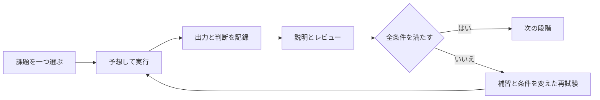

# 初心者からサーバー構築を担当できるまで

**今日の課題を選び、実行し、証拠を残し、他の人の確認を受けて次へ進むための育成システム**です。既存の24週教材と実施キットを、8段階・32条件の到達判定へつなぎます。

ここで目指す「一人前」は、**合意した小規模Linuxサーバー案件について、要件の確認、設計、構築、試験、変更、復旧、引き渡しを担当し、自分の判断範囲を超えたときに相談できること**です。すべての製品を知ることや、すべての障害を一人で抱えることは求めません。学習上の到達と、職場で担当を任せる判断は分けます。

## 最初にすること

1. [SE00 準備と学び方](stages/00-orientation.md)を開き、実行場所と利用できる環境を確認する。
2. [台帳の使い方](tracker-guide.md)に従い、自分専用の未実施台帳を作る。Node.jsを使えない場合は[作業記録](templates/work-record.md)をコピーする。
3. 今日は **SE00-C1だけ** 実施する。期待結果と実際の出力を残す。
4. 次の日に手順を閉じ、目的と出力を説明する。分からない箇所を次の課題にする。

台帳はローカルの `.local/server-engineer/` に保存します。公開リポジトリには個人の生ログを入れません。教材の作成・自動検査が完了しても、新しい学習者の状態はすべて **NOT RUN（未実施）** から始まります。

## どこまで進めば何ができるか

| 段階 | できるようにすること | 主な提出物 | 期間の目安 |
| --- | --- | --- | --- |
| [SE00](stages/00-orientation.md) | 実行場所・期待結果・実際の結果を区別する | 環境票、最初の出力、質問、翌日の説明 | 開始前 |
| [SE01](stages/01-linux.md) | 空のVMからLinux一台を構築する | OS・権限・サービス・ディスク試験 | W1〜W4 |
| [SE02](stages/02-network.md) | 通信経路を設計し「つながらない」を調べる | IP設計、DNS・SSH・Firewallの正常／異常試験 | W5〜W8 |
| [SE03](stages/03-services.md) | Web・アプリ・DBをつなぎ復元する | 応答、TLS、最小権限、復元比較 | W9〜W12 |
| [SE04](stages/04-design.md) | 要件を設計と合否判定に変える | 設計一式、要件と試験の対応表 | W13〜W16 |
| [SE05](stages/05-automation.md) | 同じ構成を再現し変更を戻す | Git差分、2回適用、新規VM再構築、切戻し | W17〜W20 |
| [SE06](stages/06-operations.md) | 監視・障害対応・復旧・継続観測を行う | 時系列記録、復元、再起動、7日間の観測 | W21〜W24 |
| [SE07](stages/07-capstone.md) | 条件変更を含む案件を自力で完結する | 別日の再構築、初見障害、第三者の受領記録 | 24週後、4〜8週 |
| [職場への接続](workplace.md) | 担当範囲を合意して実案件へ広げる | 30・60・90日の観察と担当範囲の合意 | 配属後に調整 |

期間は週10時間程度を想定した計画値です。準備、失敗の調査、再提出、評価者待ちで変わります。24週や上表の経過だけで合格にはなりません。時間が少ない場合は同じ課題を2週に分け、必須試験は省きません。

## 毎週の運用

1回90分なら、前回の説明10分、今回の予想10分、操作40分、結果確認20分、次回の課題10分に分けます。週に4回の演習と1回の振り返りを目安に、自分の時間へ調整します。手が止まっても出力を残せたら、それが次の調査の材料です。

週末は[週次レビュー](templates/weekly-review.md)で「最初の未合格条件」を一つ選びます。失敗した同じ操作を続けるより、どの前提が違うかを確認します。復習は翌日・7日後・28日後を目安に、手順を閉じた説明と条件を変えた小演習で行います。これは学習運用の提案で、個人の記憶定着を保証する日数ではありません。

[評価手順](assessment.md)に従い、全条件の実施後に人のレビューを受けます。評価者がいなければ自己練習を続け、台帳は `READY FOR REVIEW` のままにします。評価者の名前や承認を作って埋めません。

## 既存教材との使い分け

一件の仕事や複数案件を進める手順は、[サーバー案件の運用システム](../server-projects/README.md)へ。受付、範囲・見積の合意、作業配分、本番前承認、検収、保守、終結までを扱います。育成のSE条件と案件のPJ条件は別に記録します。

- **学ぶ内容と実施キット**: [24週の学習プラン](../learning-plan/README.md)、[主作品server](https://github.com/ns7jp/server)。
- **順序・提出・補習・合格の運用**: この育成システム。
- **著者の過去の実測**: [STATUS](../../STATUS.md)や主作品の証跡。本人の新しい実施の代わりにはしません。
- **教材の選択**: [リポジトリ対応表](repository-map.md)。Windows、AWS、Azureは応募先に応じた追加コースです。

既存教材のPhase 6にはクラウドも含まれます。この育成システムではLinuxの基礎を必修とし、AWS／Azureの実契約は必須にしません。ローカルVMの合格からクラウド運用の合格を推定することもありません。

## 使う書類

| 目的 | 開くもの |
| --- | --- |
| 実行結果を残す | [作業記録](templates/work-record.md) |
| 要件から試験までつなぐ | [設計・試験の記入枠](templates/design-pack.md) |
| 障害を調べる | [障害記録](templates/incident.md) |
| 他の人に確認してもらう | [評価記録](templates/review.md) |
| 操作を引き渡す | [引き渡し記録](templates/handover.md) |
| 次の1週間を決める | [週次レビュー](templates/weekly-review.md) |

[運営と教材保守](maintenance.md) / [参考資料と確認範囲](sources.md) / [能力定義の正本](curriculum.json) / [実装仕様](implementation-contract.md)

**現時点の境界**: 本システムは教材と台帳の実装です。学習者32条件の実技、第三者による採点の一致、初心者の通し利用、職場での担当判断は、実際に実施した記録が出るまで未確認です。
