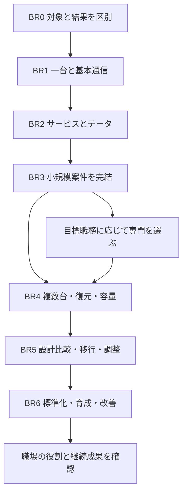

# 橋渡しの詳細設計

[入口](README.md) / [課題カード](practice.md) / [実行計画](action-plan.md)

## 到達点

サーバー構築エンジニアの成長を、**対象・根拠・結果・復旧・引き渡しを説明できる範囲が広がること**と定義します。上位では、要件が衝突したときの選択、初見の障害、データを守る移行、他者が運用できる標準まで担当します。

本設計の「熟練」は、特定領域で複数の状況に対応し、周囲の判断と再現性を高め続けられる状態です。すべての製品を知っていることを要求しません。学習上の発展課題の合格と、職場で熟練者として役割を任され継続して成果を出した事実は別に記録します。

BRという段階名、追加課題の数、復習間隔、時間配分は今回の設計案です。業界共通の資格・技能認定制度ではありません。

## 公開資産から分かった出発点

2026-09-06に公開mainを取得して確認しました。[profile側の育成体系](https://github.com/ns7jp/ns7jp/blob/b3dd74756c53b6eeebb38c5fc65b16a7d27f8824/docs/server-engineer/README.md)には、SE00〜SE07、32条件、本人の証跡、他者の実技観察、補習、条件変更、初見障害、第三者の引き渡し確認があります。[案件運営](https://github.com/ns7jp/ns7jp/blob/b3dd74756c53b6eeebb38c5fc65b16a7d27f8824/docs/server-projects/README.md)には受付から終結、複数案件の配分もあります。

[server側](https://github.com/ns7jp/server/tree/d0a69321ffb3248c8e953d75bea5ff9512c1b838)は、最小のapp/nginxからLinux、監視、自動構築、復旧、3層構成、ADなどへ進める教材と記録を持っています。したがって今回の中心は、教材を増やすだけでなく、**既存資産を本人が条件を変えて使えるか確認し、その先の性能・移行・チーム判断へつなぐこと**です。

初期調査で確認したのは公開ファイルです。過去ログの実機再実行、証跡の真正性や本人の独力技能の審査はしていません。具体的な確認元と取得SHAは[根拠](sources.md)、この追加文書の検査は[確認記録](validation.md)を参照してください。

## 成長を止めやすい6つの断絶

| 断絶 | 次へ渡す練習 | 観察する証拠 |
| --- | --- | --- |
| 言葉は知るが操作対象が曖昧 | 手元PC・VM・コンテナ・通信相手を指してから操作 | 環境票、構成図、対象確認の出力 |
| 手順をなぞれるが理由を説明できない | 実行前に結果を予想し、違いを説明 | 予想と実結果、選んだ設定値の理由 |
| 同じ環境でしか作れない | 新規VM・別IP・別ポートで再構築 | 設計差分、再構築記録、回帰試験 |
| 起動できるが壊れると戻せない | 正常時の基準を保存してから故障・復元 | 時系列、仮説、否定した原因、復旧後のデータ |
| 技術作業はできるが案件が終わらない | 要件と試験、受領者と受入条件を先に結ぶ | 要件対応表、残課題、引き渡し記録 |
| 自分だけができ、他者へ伝わらない | 別の人の再現を観察し標準を改訂 | 他者の結果、詰まった点、改訂前後の効果 |

各練習は「説明を読む→一緒に実施→部分的な手順で実施→自分で選択→条件変更→他者へ引き渡す」の順に支援を減らします。暗記だけを独力の条件にしません。公式文書や自分の手順書を使い、次の観測と操作を本人が判断できればよい設計です。

## 7段階の能力の見取り図

| 段階 | 到達する行動 | 既存との接続 | 次へ進む根拠 |
| --- | --- | --- | --- |
| BR0 準備と観測 | 対象を特定し、予想と結果を区別する | SE00 | 実行環境、秘密情報の扱い、出力、翌日の説明 |
| BR1 一台を作る | Linux一台と基本通信を手順に沿って構築・確認する | SE01・SE02、server入門 | OS・権限・サービス・IP/DNS/SSHの正常／拒否試験 |
| BR2 サービスをつなぐ | Web/AP/DBの経路を説明し、変更・復元を確認する | SE03、最小構成から3層ラボ | 認証、TLS、依存関係、データ内容までの確認 |
| BR3 小規模案件を完結する | 要件→設計→構築→試験→変更→復旧→引き渡しを担当する | SE04〜SE07、PJの運用 | 別日の再構築、条件変更、初見障害、受領者による実行 |
| BR4 複数台と変動へ対応する | 構成差異、依存障害、復元、容量を観測して判断する | BX01〜BX04 | 新規環境、故障範囲の分離、復元後操作、継続観測 |
| BR5 制約のある設計と変更を導く | 複数案を比較し、移行・障害時の判断を関係者と進める | BX05〜BX08、PJの適用 | 不採用理由、データ整合、切戻し境界、連絡・役割分担 |
| BR6 標準と人を育てる | 他者が再現できる標準を作り、結果から継続改善する | BX09〜BX12、職場の役割合意 | 他者利用、レビュー、改善の効果、実務での継続観察 |

BR0〜BR3は既存SEの学習結果を読み取る見取り図です。新たな二重採点や、BRの番号だけでSEを飛ばす仕組みは作りません。BR3相当を説明する場合は前提を含むSE00〜SE07の必要条件を確認します。

## 現在地を決める

初期値は全員一律の「初心者認定」ではなく、**本人の各能力が未確認**です。次の診断を行い、すでにある自分の記録は実施者・環境・支援量・版を確認して再利用候補にします。

| 診断 | その場で行うこと | 不足した場合の開始点 |
| --- | --- | --- |
| D01 対象 | 操作中のOS、シェル、カレントフォルダ、接続先を指す | SE00 |
| D02 OS | 一般利用者と管理者、サービス状態、ログを確認して説明 | SE01 |
| D03 通信 | IP→名前解決→経路→待受→FW→HTTPの確認順を選ぶ | SE02 |
| D04 応答 | 200、401、502、接続失敗の違いを例と出力で説明 | SE03前半 |
| D05 データ | 別の復元先でデータとアプリ操作を確認した証拠を示す | SE03後半 |
| D06 再現 | 新規VM構築、再適用、変更の復帰を示す | SE05 |
| D07 案件 | 要件・試験・証跡・未解決事項・受領者を結ぶ | SE04・SE07 |
| D08 運用 | 障害時系列、通知到達、欠測、復旧後確認を示す | SE06・SE07 |

説明ができても実技が未実施なら、その実技条件を飛ばしません。異なる教材で経験がある場合も、既存SEの同等条件に対応するか評価者と照合します。今回、学習者本人への診断実施や既存台帳の読み取りはしていません。

## 各段階で何を学び、どう練習するか

### BR0：作業の前後を区別する

最初に覚えるのは、サーバー、OS、プロセス、サービス、ポート、権限、ログ、バックアップです。「OSは土台、プロセスは動いている実体、サービスは継続する役割、ログは観測記録」と説明し、実際の表示へ対応させます。比喩だけで覚えず、例外や確認先も一緒に記録します。

毎回「どこで・誰の権限で・何を・何のために・何が出れば成功か」を一文にします。失敗は期待と違った事実、原因はまだ仮説、と分けます。手順の次の行へ進めないときは、出力を残して前提へ戻ることを練習します。

### BR1：OSの設定をサービスの挙動につなぐ

必修はファイルと所有者、許可・拒否、ユーザーとsudo、パッケージ、プロセスとsystemd、ログ、ディスク、マウント、時刻、IP/CIDR、DNS、ルーティング、SSH、Firewallです。読み取り、変更、永続化、再起動後確認をセットにします。

練習例は「特定グループだけ読めるファイル」「再起動後も起動するサービス」「管理端末からのみSSHが通る検証環境」です。正しい利用者の成功と、許可しない利用者の拒否の両方を観測します。SSH/FWを変更するときは検証VMのコンソール経路と戻し方を用意します。

コンテナでアプリを起動した証拠と、VMのOS・サービス・ディスクを構築した証拠を別にします。ホストの再起動やカーネル依存を確認する課題は、必要な機能を持つVM等で評価します。

### BR2：利用者の操作からデータまでを追う

入口は既存app/nginxの2サービスです。nginxは受付・転送、アプリは応答、DBは永続データと説明します。DBを含まない最小構成から始め、[3層ラボ](https://github.com/ns7jp/server/tree/d0a69321ffb3248c8e953d75bea5ff9512c1b838/labs)へ拡張します。DBは最小app/nginxの必須部品ではありません。

「どの端末の127.0.0.1か」「名前解決先と待受は何か」「認証の場所はどこか」「DBだけ止まると何が失敗するか」を図と出力で結びます。TLSは暗号化・接続先確認、認証は利用者確認、認可は操作範囲の制御として区別します。

確認はHTTPの状態だけで終えず、作成したテストデータを読み戻す操作、許可されない操作、復元先の内容を含めます。復元方式には異なる前提があるため、使用するPostgreSQLの版とバックアップ方式を対応させます。[PostgreSQL公式バックアップ資料](https://www.postgresql.org/docs/16/backup.html)

### BR3：小規模案件を最後まで担当する

設計を後回しにせず、小さな一枚の要件票はBR0から使い、SE04で設計一式へ拡張します。必要文書は要件、基本構成、詳細設定、パラメータ、通信一覧、手順、試験、切戻し、作業結果、引き渡しです。既存の[Linux案件パック](https://github.com/ns7jp/server/tree/d0a69321ffb3248c8e953d75bea5ff9512c1b838/docs/build-package)を採用し、同じ文書を別名で増やしません。

自動化は、説明できる小範囲の手作業をコードへ置き換える順にします。再適用で不要な変更がないこと、新規環境に再構築できること、変更前へ戻せることを別々に確認します。`changed=0`だけでは設定の正しさを証明しません。Ansibleのcheck modeは実適用の代わりではなく、`check_mode: false`のタスクはcheck指定でも変更し得るため、対象コードを事前に読みます。diff出力の秘密値にも注意します。[Ansible公式仕様](https://docs.ansible.com/projects/ansible/latest/playbook_guide/playbooks_checkmode.html)

総合課題は既存SE07を使います。本人の実行、条件変更、初見障害、受領者の操作をそろえ、小規模な範囲で一周したことを確認します。その結果で本番権限を自動付与しません。

### BR4：複数台と時間の変化へ広げる

BX01〜04で、複数台の構成差異、依存障害、別環境復元、負荷・容量を扱います。単一時点の起動確認から、変化と劣化を捉える観測へ進みます。

同じPCの複数VMは、サービス単位の故障分離を練習できますが、物理ホストや電源の故障領域は共通です。台数を増やしただけで高可用性を達成したと書きません。DNS・時刻・認証・ストレージ・監視など共有依存も図へ含めます。

性能は負荷量、同時接続、試験時間、データ量を固定し、遅延・要求数・エラー・飽和の観点を使って観測します。数値の改善だけでなく原因の仮説と再測定で裏付けます。[Google SREの監視設計](https://sre.google/sre-book/monitoring-distributed-systems/)

### BR5：要件の衝突と不可逆な変更を扱う

BX05〜08で、可用性・費用・納期・運用負荷を比較し、移行、複合障害、権限と更新・廃止を実施計画にします。採用案だけでなく不採用理由と見直し条件を残します。

移行ではアプリの旧版復帰とデータの巻戻しを分離します。新旧両方へ意図しない書き込みが入る状態を防ぎ、書き込み停止・同期完了・切替・確認・戻せる期限を定義します。逆変換できないデータ変更には、前進復旧や中止を含む代替策が必要です。

複合障害では原因究明とサービス回復を分担し、現在の影響、次の確認、相談が必要な判断を短く伝えます。実際の連絡・承認は職場の役割に従い、演習の架空担当者を本当の承認者として記録しません。

### BR6：自分の成功を他者が使える仕組みにする

BX09〜12で、標準手順の他者再現、レビュー、育成、複数案件での判断、運用からの標準改訂を扱います。READMEの見栄えや資料の数ではなく、他の人が判断できたか、誤り・手戻り・待ち時間がどう変わったかを観測します。

実務の熟練評価には、異なる制約の案件や運用局面、失敗後の修正、関係者との判断、継続する結果が必要です。一度の演習や固定年数で到達を保証しません。実務機会がない間は「発展設計演習」「チーム演習」「第三者レビュー」として実施範囲を正確に示します。

## 要件から証拠へつなぐ共通の案件骨格

例の案件は「社内向け状態確認サービス」です。利用者、利用時間、保護対象、管理端末、停止許容、データ損失許容、予算を最初に記入します。未確定値は仮定とし、実案件の顧客要件と混ぜません。

| 要件の例（新規の演習例） | 設計への変換 | 試験 | 証拠 |
| --- | --- | --- | --- |
| 許可した利用者だけ利用する | 接続経路、認証・認可、秘密値の配置 | 正しい認証の成功、認証なしの拒否 | 状態コードと対象、機密を除いた出力 |
| 障害を検知して対応できる | 監視対象、通知先、連絡・停止条件 | 停止→検知→通知到達→回復 | 時系列、通知記録、復旧後の操作 |
| データを許容範囲で復元する | バックアップ方式・保管先・復元順 | 別環境復元、内容と利用操作 | 復元所要時間、失われた範囲、整合比較 |
| 保守中に以前の版へ戻せる | 版固定、互換性、切戻し可能期限 | 変更失敗→復帰→回帰 | 前後のSHA、利用者操作、データ差分 |
| 担当者が変わっても運用できる | Runbook、必要権限、連絡経路 | 他者による状態確認・変更・異常連絡 | 受領者の記録、質問、改訂事項 |

一つの要件には、対応する設定または設計判断、試験、証跡を関連付けます。通った試験だけで表を埋めず、必須試験の母数を先に固定します。

## 専門分岐

共通基礎を主軸にし、求人の担当範囲や現在のラボに合う専門を一つ選びます。資格取得は知識の確認や応募条件への対応として計画し、実技・復旧・引き渡しの代替にはしません。

| 専門 | 橋渡し課題 | 既存資産の使い方 | 境界 |
| --- | --- | --- | --- |
| Linux・Web基盤 | systemd、権限、TLS、ストレージ、設定管理、更新、監視 | serverのLinux案件パックとSEを主線にする | コンテナだけの試験をOS構築全体へ広げない |
| Windows・AD | DNS、GPO、権限委任、PowerShell、複製、復旧 | 既存AD実測の目的と不具合を読み、本人の別条件再現へ進む | 過去のDC構成やVM名を現在の操作対象と推定しない |
| 仮想化・オンプレミス | VM、vSwitch、仮想ディスク、資源競合、保管先、復旧 | Hyper-V等のラボでホストとゲストを分けて観測 | スナップショットを独立したバックアップとみなさない |
| ネットワーク | L2/L3、VLAN、経路・戻り経路、NAT、FW、パケット | 既存routingラボの実行可能な範囲を確認する | カーネル制約の未実施を疎通成功へ含めない |
| 監視基盤 | Prometheus/GrafanaまたはZabbix、通知、ログ、欠測 | 既存監視を一系統ずつ構築・観測する | ダッシュボード表示と通知到達・対応成功は別 |
| AWSまたはAzure | 権限、ネットワーク、VM、監視、復元、費用、撤去 | 既存計画を一事業者・一構成で実測へ進める | validate/planをクラウド稼働や削除完了へ読み替えない |

Windows/ADでは通常のVM巻戻しを万能な復旧手順にせず、環境に応じたAD復旧手順と整合性確認を設計します。[Microsoft AD復旧ガイド](https://learn.microsoft.com/en-us/windows-server/identity/ad-ds/manage/forest-recovery-guide/ad-forest-recovery-guide)、[Hyper-Vチェックポイント](https://learn.microsoft.com/en-us/windows-server/virtualization/hyper-v/checkpoints)

Kubernetes、多数のクラウド、全OSの習得は共通課程の必須条件にしません。必要な担当職務が決まったら、同じ要件・構築・復旧・引き渡しの型で追加します。

## 評価と支援の原則

判定は「対象を説明」「構築を再現」「期待と実結果を比較」「復旧」「判断理由」「他者の確認」を観察して行います。必須項目の失敗を平均点で相殺しません。生ログ、教材コード、独力の実技、職場の担当経験はそれぞれ別の記録です。

練習中はAIや講師の支援を使って構いません。支援を使った試行はその事実を残し、独力条件の確認は別の試行にします。評価者がいない場合は自己練習と文書改善を進め、人による実技観察は未実施として残します。

証拠には実施日時・登録日時、環境、ソフトウェア版、構成SHA、設定差分、支援量、期待、出力、判定、限界、評価対象の試行IDを持たせます。版や対象が変われば影響範囲を確認し、必要な試験を再実施します。過去のPASSは履歴として残し、現在の構成への無条件の合格には使いません。

詳しい記入枠とレビュー手順は[記録](templates.md)、新規12課題は[課題](practice.md)にあります。
